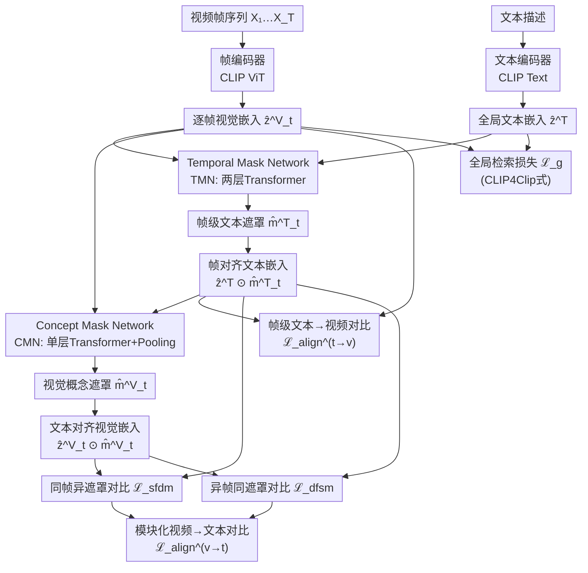

# MoVA：非对称双投影实现模块化长视频-文本对齐

**会议**: ECCV 2026  
**arXiv**: [2607.00858](https://arxiv.org/abs/2607.00858)  
**代码**: 无  
**领域**: 多模态VLM / 视频理解  
**关键词**: 视频-文本对齐, 对比学习, 时间错位, 语义非对称, 模块化表示

## 一句话总结
MoVA将视频-文本对齐问题建模为潜变量识别问题，提出非对称双投影架构——文本侧时域遮罩网络逐帧筛选相关文本概念、视频侧概念遮罩网络隔离文本相关的视觉因子——配合模块化对比学习目标实现长视频与长文本的结构化解耦对齐。

## 研究背景与动机

对比预训练（特别是CLIP范式）极大地推动了视觉-语言表征学习，使其在视频检索、描述生成、动作识别等任务上取得显著成功。然而，当从图像-文本推广到视频-文本时，CLIP遇到了两个根本性的新挑战。第一个是**时间错位**：视频的文本描述往往只与特定的时间窗口相关，一段长视频中不同帧对应文本中完全不同的子句——前一帧描述"人在说话"，后一帧可能描述"乒乓球比赛"，而中间大量过渡帧与文本几乎无关。第二个是**语义非对称**：文本到帧和帧到文本的关联是双向且不等价的——文本只激活帧中一小部分视觉概念（如"射箭"聚焦弓和箭，忽略背景树木），而每帧又包含远比文本描述丰富的视觉信息，形成一种稀疏的双向非对称关系。现有方法要么用短描述造成歧义，要么用长描述反而加剧了静态物体与时序演化之间的纠缠。

这种困境的核心矛盾在于：CLIP类模型本质上学的是图像级别的全局对齐——一张图配一段文字，概念是一次性的。扩展到视频后，多帧序列带来了时间维度上的概念动态演化，而CLIP式的全局对比损失无法区分"哪些文本词对应哪些帧"、"哪些视觉概念是帧特有的、哪些是全局共享的"。简单地应用SmartCLIP（图像级解耦遮罩）到视频行不通，因为缺少文本对帧的主动选择和帧对文本子集的反向约束。MoVA的切入角度是：既然视频-文本对齐天然是一个双视角潜变量识别问题——文本描述是对跨帧抽象语义的编码、每帧又提供了该语义的一个局部视图——那么引入一对非对称的投影遮罩，分别控制文本到帧和帧到文本的稀疏对应关系，就可以在保持全局语义的同时实现帧级概念解耦。**核心 idea：将视频-文本对齐形式化为潜变量识别问题，证明在稀疏双遮罩约束下可以恢复帧-文本对应关系（块级可辨识性），并据此设计双路非对称投影网络——TMN逐帧筛选文本相关子空间、CMN逐帧隔离视觉概念——配合模块化对比学习实现全局语义保持与帧级概念解耦。**

## 方法详解

MoVA的核心思路是在CLIP双塔编码器之上，插入一对非对称的遮罩投影模块：Temporal Mask Network（TMN）负责"文本到帧"方向的子空间投影，Concept Mask Network（CMN）负责"帧到文本"方向的视觉概念过滤。两个投影共享同一个稀疏双遮罩约束（dual-mask constraint），即每帧的文本侧遮罩激活的文本子空间应当与视觉侧遮罩激活的视觉子空间在潜在语义上对齐，从而保证全局语义在时间演化中的一致性和概念解耦性。

以VideoUFO或UltraVideo等长视频-长描述场景为例：一个长达155词的视频描述包含多个时序事件（如"一只黑拉布拉多坐在木船上；它捡起金属杯喝水；它转头扫视四周"），MoVA通过逐帧分析决定当前帧重点关注文本中的哪个事件子句，再从帧中隔离出与该事件相关的视觉因子（如狗的头部姿态、杯子）、忽略无关视觉信息（如水面波纹），最终在每个时间步上只对比对齐后的"文本子集到视觉子集"，从而避免全局对比中"无关帧污染相关概念"的问题。

### 关键设计

**1. Temporal Mask Network：文本到帧的时域子空间投影**

TMN要解决的核心问题是"一个全局文本描述中，当前帧应该关注哪些词"。它由一个两层Transformer Block构成，以当前帧的视觉嵌入为查询（query），让文本中的所有token与帧嵌入以及彼此之间充分交互，最终通过Straight-Through Estimator输出一个二值化遮罩向量$\hat{\mathbf{m}}_t^{\mathrm{T}} \in \{0,1\}^{d(\mathbf{z})}$，标记当前帧所激活的文本维度。关键约束是：$\hat{\mathbf{m}}_t^{\mathrm{T}}$必须足够稀疏（只有文本中与该帧语义相关的部分被激活），同时$\hat{\mathbf{z}}_t^{\mathrm{V}}$与$\hat{\mathbf{z}}^{\mathrm{T}} \odot \hat{\mathbf{m}}_t^{\mathrm{T}}$的余弦相似度要大于该帧与其他帧遮罩文本的相似度。为此MoVA设计了帧级对比损失$\ell_{\text{ctrf}}(t)$：正例对的相似度被推向1，同时以边际$\Delta$推开负例（本文其他帧的遮罩文本、其他视频帧的遮罩文本）。TMN的序列建模特性保证了它能在时间轴上平滑过渡——当视频从"射箭"切换到"靶子倒塌"时，遮罩激活的文本子集随之自然切换。从识别理论的角度看，TMN的实现等价于定理4.2中文本侧遮罩$\mathbf{m}_t^{\mathrm{T}}$的估计——在最优解下，它能够恢复真实的帧级文本子集支持集（Lem. 2的"无多余、无遗漏"保证）。

**2. Concept Mask Network：视觉到文本的概念隔离**

CMN是对称于TMN的反向投影，解决的是"给定当前帧和TMN选出的文本子集，帧中哪些视觉因子真正对应这段文本"。它由单层Transformer加一个Attention Pooling层构成，输入为TMN输出的遮罩文本嵌入$\hat{\mathbf{s}}^{\mathrm{T}} = \hat{\mathbf{z}}^{\mathrm{T}} \odot \hat{\mathbf{m}}_t^{\mathrm{T}}$和帧嵌入$\hat{\mathbf{z}}_t^{\mathrm{V}}$，输出遮罩$\hat{\mathbf{m}}_t^{\mathrm{V}}$，其核心约束来自与TMN共享的稀疏双遮罩一致性：$\hat{\mathbf{z}}_t^{\mathrm{V}} \odot \hat{\mathbf{m}}_t^{\mathrm{V}} \approx \hat{\mathbf{z}}^{\mathrm{T}} \odot \hat{\mathbf{m}}_t^{\mathrm{T}}$。CMN的设计巧妙之处在于它引入了Attention Pooling自适应下采样到与CLIP表示维度匹配，不同粒度的概念（物体级vs.运动级）将自然地落入不同的维度子空间。论文消融实验（表4）表明，去掉CMN（只用SmartCLIP的单向视觉到文本遮罩）是最差的变体——ActivityNet R@1从47.8暴跌至35.6，这直接验证了"语义非对称必须双向建模"的核心主张：光有帧对文本的选择不够，文本对帧反向选择哪些视觉因子被激活同样关键。

**3. 双流模块化对比损失：同帧异遮罩与异帧同遮罩**

有了TMN和CMN生成的双路投影嵌入$\mathbf{z}_t^{\mathrm{V}} \odot \hat{\mathbf{m}}_t^{\mathrm{V}}$和$\mathbf{z}^{\mathrm{T}} \odot \hat{\mathbf{m}}_t^{\mathrm{T}}$，MoVA设计了两个互补的对比学习目标。第一个是**同帧异遮罩（Same-Frame Different-Mask, sfdm）**：固定一个帧$\hat{\mathbf{z}}_t^{\mathrm{V}}$，对比来自不同描述生成的遮罩$\hat{\mathbf{m}}_{i,t}^{\mathrm{V}}$——这迫使模型理解"同一帧在不同文本语境下应强调不同的视觉内容"（例如一个森林场景，"熊"和"小河"两种描述应激活帧中不同的子区域）。第二个是**异帧同遮罩（Different-Frame Same-Mask, dfsm）**：固定一个文本子集$\hat{\mathbf{s}}^{\mathrm{T}}$，对比不同帧在相同遮罩下的嵌入——这迫使模型从时间序列中识别出跨帧共享的恒常概念（如反复出现的角色或动作），从而实现理论中通过遮罩交集操作恢复原子概念的目标。若去掉dfsm，ActivityNet R@1下降3.6个点，说明跨帧恒常性建模对整体对齐不可或缺。

### 损失函数/训练策略

MoVA的完整训练目标由四项加权求和构成：

$$\mathcal{L} = \lambda_{\mathrm{g}}\mathcal{L}_{\mathrm{g}} + \lambda_{\mathrm{tv}}\mathcal{L}_{\mathrm{align}}^{\mathrm{t}\to\mathrm{v}} + \lambda_{\mathrm{vt}}\mathcal{L}_{\mathrm{align}}^{\mathrm{v}\to\mathrm{t}} + \lambda_{\mathrm{s}}\mathcal{L}_{\mathrm{s}}$$

其中$\mathcal{L}_{\mathrm{g}}$是CLIP4Clip风格的全局视频-文本检索损失（全局相似度矩阵上的对称交叉熵）；$\mathcal{L}_{\mathrm{align}}^{\mathrm{t}\to\mathrm{v}}$是TMN侧的帧级对比损失；$\mathcal{L}_{\mathrm{align}}^{\mathrm{v}\to\mathrm{t}}$是CMN侧的模块化对比损失（sfdm+dfsm）；$\mathcal{L}_{\mathrm{s}}$是$\hat{\mathbf{m}}^{\mathrm{T}}$和$\hat{\mathbf{m}}^{\mathrm{V}}$的L0稀疏约束。

关键训练细节：先在ShareGPT4v图像-描述数据上做预热初始化（将CLIP图像级稀疏映射知识迁移到视频），然后以$10^{-7}$学习率微调编码器、$10^{-4}$学习率训练新模块，batch size 256，ViT-B/16主干，最多支持248个token（突破CLIP原始77 token限制）。消融实验（图7d）发现$\lambda_{\mathrm{g}}/\lambda_{\mathrm{tv}}$最佳比值约为1.0——过小（<0.2）丢失全局信息，过大（>1.2）导致帧级遮罩坍缩。

## 实验关键数据

### 主实验

| 数据集 | 方向 | 本文R@1 | 之前SOTA R@1 | 提升 |
|--------|------|---------|-------------|------|
| ActivityNet | T→V | 47.8 | 46.9 (VideoCLIP-XL) | +0.9 |
| ActivityNet | V→T | 46.7 | 42.9 (CLIP4Clip) | +3.8 |
| MSVD | T→V | 52.6 | 50.4 (X-CLIP) | +2.2 |
| DiDeMo | T→V | 57.5 | 50.8 (InternVideo) | +6.7 |
| VideoUFO | T→V | 62.4 | 57.4 (VideoCLIP-XL) | +5.0 |
| UltraVideo | T→V | 58.5 | 51.8 (ProST) | +6.7 |

### 消融实验

| 配置 | T→V R@1 (ActivityNet) | V→T R@1 (ActivityNet) | 说明 |
|------|------------------------|------------------------|------|
| Full MoVA (iv) | 47.8 | 46.7 | 完整双非对称投影 |
| 仅全局损失 (i) | 43.7 | 42.5 | 去掉所有模块化目标，退化为微调CLIP |
| 仅CMN单向 (ii) | 35.6 | 33.7 | 去掉TMN，智能CLIP图像级单向遮罩 |
| TMN+原始token遮罩 (iii) | 42.0 | 41.9 | TMN保留但直接在原始token上做时域遮罩 |
| w/o 异帧同遮罩 | ~44.2 | — | 去掉ℒ_dfsm后掉点明显 |

### 关键发现

- **双路缺一不可**：消融(ii)表明光有帧到文本的遮罩（去掉TMN的文本到帧方向）是最差配置，R@1骤降超过12个点，直接证明语义非对称必须双向建模。
- **模块化目标各自贡献**：ℒ_sfdm和ℒ_dfsm都不可或缺，单去掉ℒ_dfsm即导致R@1下降3.6，说明跨帧恒常性（异帧同遮罩）是解耦的关键一环。
- **TMN深度不敏感**：1-2层Transformer已经足够（表8），更深（3-8层）不带来额外收益——帧级文本子空间选择本身并非计算密集任务。
- **帧数鲁棒性**：32到160帧范围内性能稳定（表7），96帧附近最优，说明模型不依赖暴力增加帧数以覆盖概念。
- **参数效率**：MoVA仅174.7M参数（+7.6%于CLIP4Clip的162.3M），远小于VideoCLIP-XL（427.9M），且每epoch训练时间反而比CLIP4Clip更快（76.7min vs 92.9min，8×MI210）。

## 亮点与洞察

- **非对称双投影设计的反向消融验证**：大多数多模态方法只做单一方向的注意力/遮罩，MoVA通过严格消融证明两个方向（文本到帧选子空间、帧到文本选视觉因子）各自独立贡献，且缺一不可。这种"不对称对称"的设计直觉在CLIP类工作中不多见。
- **从潜变量识别理论到算法设计的闭环**：论文先建立数据生成模型（Section 3），证明块级可辨识性（Theorem 4.2），然后将识别条件直接翻译为TMN/CMN架构+稀疏对比目标。这种"理论推导到算法落地"的严密对话在对比学习类工作中具有示范意义。
- **长文本到视频生成的迁移收益**：MoVA的文本编码器零样本替换VideoCrafter2中的CLIP文本编码器后，不仅能保持基本物体，还能生成"油漆溅起的锈橙色污渍"这种极细微的纹路描述和"有节奏的摇摆"这种复杂时序动作，生动展示了解耦式多模态表示超越检索的迁移价值。

## 局限与展望

- **依赖图像级预热**：MoVA需要先在ShareGPT4v上做预热初始化（从SmartCLIP权重出发），如果目标域与自然图像分布差异大（如医学视频、遥感视频），预热迁移效果可能不理想。
- **长视频帧采样的扩展性**：当前方法对64帧左右稳定，但当视频长达数千帧（如电影、监控长视频），线性采样固定帧数可能错过关键事件。论文未讨论自适应帧选择或层次化采样策略。
- **硬遮罩的信息损失**：STE硬遮罩利于可解释性（论文图4展示了清晰的文本子集激活），但软遮罩版本性能相近——对于需要连续语义过渡的场景（如事件边界模糊的情况），硬二值化可能丢失中间语义。
- **理论假设与现实差距**：识别定理（Theorem 4.2）依赖生成器光滑可逆、视图多样性等条件，在实际数据中这些假设只能近似满足，理论保证的严格性需进一步消融（如在不满足假设的合成数据上验证失效模式）。

## 相关工作与启发

- **vs SmartCLIP [Xie2025, ICCV 2025]**: SmartCLIP在图像级提出自适应遮罩+模块化对比。MoVA将同一思路扩展到视频，核心差异在于引入TMN实现文本到帧的时域遮罩和双遮罩约束。理论层面，MoVA用潜变量识别框架统一了图像和视频的对齐问题，证明了时间维度上的可辨识性。
- **vs CLIP4Clip [Luo2022, CVPR 2022]**: CLIP4Clip是CLIP视频化的里程碑，聚焦于相似度计算和后融合。MoVA继承其全局检索损失作为基座，但用模块化对齐目标替代了简单的全局对比，实现帧级解耦对齐而不牺牲全局语义。
- **vs DGL [Yang2024]**: DGL用共享潜空间生成局部动态提示配合全局-局部注意力。MoVA的不同在于用可辨识性理论指导设计，双遮罩的非对称性也是独有设计——DGL的局部提示是隐式的，MoVA的遮罩是显式稀疏且可解释的（论文图4、图6）。
- **vs VideoCLIP-XL [Wang2024]**: VideoCLIP-XL使用更大的ViT-L/14和额外视频后预训练数据（YT-VidLA-800M）。MoVA在ViT-B/16上以少得多的参数（174.7M vs 427.9M）和多数据集上取得更优结果，证明系统性的模块化对齐设计可以替代暴力增大模型。

## 评分

- 新颖性: ⭐⭐⭐⭐⭐ 将潜变量识别理论引入视频-文本对比学习，提出非对称双投影架构，理论-算法闭环完整
- 实验充分度: ⭐⭐⭐⭐⭐ 6个数据集（长短视频）、检索+生成两个应用、消融覆盖各模块/帧数/TMN深度/损失权重/软硬遮罩
- 写作质量: ⭐⭐⭐⭐ 理论推导严密，方法描述清晰，但符号较多处（Section 3-4）可读性对非理论读者稍弱
- 价值: ⭐⭐⭐⭐⭐ 解决了CLIP从图像推广到视频的核心瓶颈，为长视频-文本对齐提供了新的范式方向，且直接可落地替换现有CLIP文本编码器

<!-- RELATED:START -->

## 相关论文

- [\[ECCV 2026\] Generating a Paracosm for Training-Free Zero-Shot Composed Image Retrieval](generating_a_paracosm_for_training-free_zero-shot_composed_image_retrieval.md)
- [\[ECCV 2026\] AdaBoosting Text Prompts for Vision-Language Models](adaboosting_text_prompts_for_vision-language_models.md)
- [\[ECCV 2026\] UniTac: A Unified Multimodal Model for Cross-Sensor Tactile Understanding and Generation](unitac_a_unified_multimodal_model_for_cross-sensor_tactile_understanding_and_gen.md)
- [\[ECCV 2026\] Layer-Specific Prompt Fusion Discovery via Differentiable Search in Vision Foundation Models](layer-specific_prompt_fusion_discovery_via_differentiable_search_in_vision_found.md)
- [\[ECCV 2026\] Skin-R1: Clinical Knowledge-Guided Dermatological Diagnosis Using Vision-Language Models](skin-r1_clinical_knowledge-guided_dermatological_diagnosis_using_vision-language.md)

<!-- RELATED:END -->
