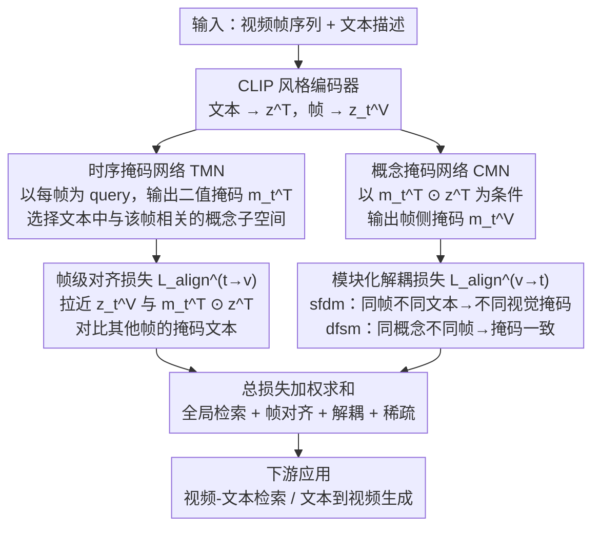

# MoVA: Learning Asymmetric Dual Projections for Modular Long Video-Text Alignment

**会议**: ECCV 2026  
**arXiv**: [2607.00858](https://arxiv.org/abs/2607.00858)  
**代码**: 无  
**领域**: 多模态VLM  
**关键词**: 视频-文本对齐, 非对称双投影, 概念解耦, 模块化对比学习, 长视频理解  

## 一句话总结

MoVA 提出双路非对称掩码投影框架——时序掩码网络（TMN）让文本为每帧自适应选择相关的概念子集，概念掩码网络（CMN）让每帧反向选择与文本对齐的视觉概念子集，通过帧级对比损失和模块化解耦对比损失联合优化，从理论上证明双掩码约束可以保证帧-文本对应关系的块级可辨识性，在五个长/短视频检索 benchmark 和文本到视频生成任务上全面超越现有方法。

## 研究背景与动机

视频-文本对齐的现代范式很大程度上继承了 CLIP 在图像-文本域的成功——在图像-文本对上预训练对比编码器，再轻量适配到视频数据。CLIP4Clip、X-CLIP、DGL 等代表性工作聚焦于设计更精巧的视频级相似度计算机制：时序 Transformer、全局-局部注意力、渐进式时空聚合。它们有一个共同的隐含假设——视频帧与文本之间存在某种可以直接学习的全局或粗粒度对应关系，相似度打分面向的是视频级或片段级的整体匹配。但在真实视频场景中，这一假设越来越站不住脚。首先，一段视频的文本描述往往只对应特定的时间窗口，比如"一个人在射箭"只覆盖视频的前几帧，而"箭击中靶心"覆盖后几帧——但模型缺乏机制知道每帧应该关注文本的哪一部分。更复杂的是，一帧画面除了被描述的内容外，还包含大量无关的视觉细节（背景、光照、人物衣着），如果全帧表征和全局文本表征做直接对齐，这些无关信息会污染表示空间。论文将这两个问题分别命名为时序错位（Temporal Misalignment）和语义非对称（Semantic Asymmetry），并指出它们在长视频和长文本描述的配对数据中尤为突出：短描述导致时间歧义（多个描述指向不同时间段，模型不知道该对齐哪一段），长描述虽然细节丰富，却导致静态物体属性和动态演化信息在表示中纠缠——模型学不到"对象是什么"和"对象如何运动"的解耦原子概念。

这种困境的根本原因在于现有方法只做一回儿全局相似度匹配，缺乏逐帧、逐概念的选择性对齐机制。SmartCLIP 在图像域提出了一个有趣的解决思路——自适应掩码 + 模块化对比目标，让图像自主选择文本中的相关子集。但扩展到视频域时，一个根本性的不对称出现了：在图像-文本对中，图像和文本的关系基本上是等价的（一张图像通常对应一段文本，文本同样完整描述该图像）；而在视频-文本对中，文本描述的是整个视频中随时间发生的事件序列，而每一帧只是这一序列的快照，两者之间的关系是稀疏且非对称的——文本不仅选择了"哪些帧是我描述的"，还隐含地决定了"哪些帧是不重要的"。这意味着不能简单地把图像-文本中的"图像选文本子集"复制成"帧选文本子集"，而必须建立一种双向选择机制：文本先判断"当前帧需要看我的哪部分"，帧再判断"我的哪部分与当前文本子集对应"。

本文将视频-文本对齐形式化为一个隐变量辨识问题，在数据生成过程层面建模了这种非对称性：视频帧和文本描述来源于共享隐空间中的语义潜变量，但各自通过模态特定的生成器投影到观测空间，生成过程中引入的模态特异性噪声（如光照变化、语法）被一个关键约束隔离——双非对称掩码。让文本到帧的掩码选择全局文本中与当前帧相关的概念子空间，帧到文本的掩码选择帧中与已选文本子集对应的视觉因子，两者在隐空间中逐帧做元素乘对齐。**核心 idea：用双路非对称掩码投影（TMN 从文本到帧的概念选择 + CMN 从帧到文本的视觉概念选择）代替传统的全局相似度对齐，通过稀疏化对比学习将视频与文本中的对象概念和运动概念解耦到独立的隐空间维度，并以辨识理论保证这种解耦的可恢复性。**

## 方法详解

### 整体框架

MoVA 解决的核心问题可以表述为：给定一段包含 T 帧的视频 $\mathbf{V} = (\mathbf{X}_1, \ldots, \mathbf{X}_T)$ 和一条全局文本描述 $\mathbf{T}$，如何在不丢失全局跨模态语义的前提下，逐帧选择性地对齐文本中与当前帧相关的概念子集，同时过滤帧中与文本无关的视觉噪声。

整体流程分两条并行路径。视频帧和文本分别经过共享的 CLIP 风格编码器投影到隐空间，得到全局文本表征 $\hat{\mathbf{z}}^{\mathrm{T}}$ 和逐帧视觉表征 $\hat{\mathbf{z}}^{\mathrm{V}}_t$。随后两条非对称掩码路径并行工作：时序掩码网络（Temporal Mask Network, TMN）从文本侧出发，以每帧的视觉嵌入为条件，输出一个二值掩码 $\hat{\mathbf{m}}^{\mathrm{T}}_t$，选择全局文本表征中与当前帧相关的概念子空间；概念掩码网络（Concept Mask Network, CMN）从帧侧出发，以 TMN 选出的文本子集 $\hat{\mathbf{s}}^{\mathrm{T}} = \hat{\mathbf{z}}^{\mathrm{T}} \odot \hat{\mathbf{m}}^{\mathrm{T}}_t$ 为条件，输出另一个二值掩码 $\hat{\mathbf{m}}^{\mathrm{V}}_t$，选择帧表征中与已选文本子集对应的视觉维度。两条路径在逐帧对齐约束 $\hat{\mathbf{m}}^{\mathrm{T}}_t \odot \hat{\mathbf{z}}^{\mathrm{T}} = \hat{\mathbf{z}}^{\mathrm{V}}_t \odot \hat{\mathbf{m}}^{\mathrm{V}}_t$ 下汇合，通过帧级对比损失、模块化解耦对比损失和全局检索损失的加权联合优化来训练。

### 关键设计

**1. 时序掩码网络 TMN：让文本为每一帧选择它该看的子空间**

时序错位的根源在于——同一视频的不同帧关注文本的不同部分，用同一个全局文本表征去对齐所有帧会引入错位。TMN 由两层 Transformer 块构成，将每帧的视觉嵌入 $\hat{\mathbf{z}}^{\mathrm{V}}_t$ 及其可学习位置编码作为 query，让帧与文本序列的所有 token 做交叉注意力交互，最终通过直通估计器（STE）输出一个二值向量 $\hat{\mathbf{m}}^{\mathrm{T}}_t \in \{0,1\}^d$，其中值为 1 的位置表示该隐含维度与当前帧相关。TMN 的训练信号来自帧级对比损失：对每一帧 $t$，拉近其视觉表征 $\hat{\mathbf{z}}^{\mathrm{V}}_t$ 与掩码后的文本表征 $\hat{\mathbf{z}}^{\mathrm{T}} \odot \hat{\mathbf{m}}^{\mathrm{T}}_t$ 的余弦相似度，同时强制该帧与自身掩码文本的相似度高于它与其他帧（同视频中远离的帧或其他视频中的帧）的掩码文本相似度。这个设计的精妙之处在于二值掩码而非软注意力——它迫使模型为每帧做一个离散选择，天然适配事件驱动型视频场景（如先"射箭"后"命中"），且掩码的可视化能够直接解读每帧关注了文本的哪一部分。实验表明，将掩码作用于全局文本表征比直接作用于原始文本 token 序列更有效（R@1 高出 5.6 个点），印证了隐空间维度天然对应语义概念而非表层词汇。

**2. 概念掩码网络 CMN：让每帧反向选择与文本相关的视觉概念**

语义非对称的解决需要帧侧也做选择性对齐——一帧画面包含大量文本未提及的视觉细节（背景树木、人物衣着），全帧对齐会引入噪声。CMN 由单层 Transformer 块和注意力池化层构成，以 TMN 选出的文本子集 $\hat{\mathbf{s}}^{\mathrm{T}} = \hat{\mathbf{z}}^{\mathrm{T}} \odot \hat{\mathbf{m}}^{\mathrm{T}}_t$ 为条件，输出逐帧的视觉侧二值掩码 $\hat{\mathbf{m}}^{\mathrm{V}}_t$，选择帧表征中与当前文本子集对应的视觉维度。这形成了一条双向闭环：文本决定"哪些帧该看我的哪一部分"（TMN），帧再决定"我身上哪些信息与你选的那部分有关"（CMN）。与 SmartCLIP 单向的"图像选择文本子集"相比，这里的核心差异在于 CMN 的条件输入 $\hat{\mathbf{s}}^{\mathrm{T}}$ 本身随帧而变——它不是对全局文本做一次掩码然后固定不变，而是每帧都有一个不同的文本子集作为"筛选指针"，同帧面对不同描述时输出不同的视觉掩码。这种双向耦合在设计上确保了无论描述中事件如何随时间切换，帧侧都能精确地只对齐其对应的那一部分。

**3. 模块化对比学习：sfdm + dfsm 的双目标解耦策略**

CMN 的训练策略由两个互补的对比项构成。Same-Frame Different-Mask（sfdm）固定一帧的视觉表征，用不同文本描述诱导出的不同视觉掩码做对比——分子是该帧与自身文本子集的对齐相似度，分母包含该帧与其他文本描述对应的视觉掩码的相似度。这迫使模型学会"同一帧画面，当文本描述不同时，激活的视觉维度也应不同"，实现帧内概念的解耦。Different-Frame Same-Mask（dfsm）则固定一个视觉掩码，对比不同帧（同视频内或其他视频中）在该掩码下的相似度——分子是正样本帧在掩码下的对齐分数，分母是其他帧在相同掩码下的分数。这确保"同一个文本概念出现在不同帧时，激活的视觉维度应当保持一致"。两个损失协同工作：sfdm 防止一帧的所有视觉信息被同一个掩码吞掉（强制对象语义的分离），dfsm 确保同一视觉概念在不同帧中具有一致的表示轨迹（保证运动语义的跨帧一致性）。消融实验证实两者缺一不可——去掉 dfsm 单独使 ActivityNet R@1 下降 3.6 个点。

### 一个完整示例：射箭视频的双掩码对齐

论文以射箭场景为例直观展示了双掩码的工作方式。全局文本描述包含两个事件："一个人在练习射箭"和"箭击中靶心导致靶心倒塌"。视频的第 $i$ 帧显示人物拉弓瞄准，第 $j$ 帧（$i < j$）显示箭撞击靶心。TMN 为帧 $i$ 输出的掩码 $\hat{\mathbf{m}}^{\mathrm{T}}_i$ 激活文本中 {man, practicing, archery} 这三个概念维度，为帧 $j$ 激活 {arrow, backdrop, collapse}。CMN 随后在帧 $i$ 上选择与"射箭姿态、弓、箭的运动"相关的视觉维度（同时过滤背景树木和人物衣服的编码），在帧 $j$ 上选择与"箭靶接触、倒塌动态"相关的维度。sfdm 确保帧 $i$ 面对"射箭"和"倒塌"两个不同文本子集时激活不同的视觉维度；dfsm 确保"射箭"这一概念跨越出现弓箭的所有帧共享一致的掩码模式。因此，即使训练时从未同时见过"射箭"和"倒塌"出现在同一帧，模型也能通过掩码的并集和交集操作恢复出跨时间段的原子概念组合——这正是辨识定理中"并集辨识"和"交集辨识"在工程上的具体体现。

### 损失函数 / 训练策略

总损失为四项加权和：$\mathcal{L} = \lambda_{\mathrm{g}}\mathcal{L}_{\mathrm{g}} + \lambda_{\mathrm{tv}}\mathcal{L}_{\mathrm{align}}^{\mathrm{t}\to\mathrm{v}} + \lambda_{\mathrm{vt}}\mathcal{L}_{\mathrm{align}}^{\mathrm{v}\to\mathrm{t}} + \lambda_{\mathrm{s}}\mathcal{L}_{\mathrm{s}}$。$\mathcal{L}_{\mathrm{g}}$ 是全局对称检索损失（CLIP4Clip 风格），用全局视频和文本表征的余弦相似度矩阵做双向对比，维持整体语义对齐底线。$\mathcal{L}_{\mathrm{align}}^{\mathrm{t}\to\mathrm{v}}$ 是帧级对齐损失，驱动 TMN 做逐帧文本子集选择。$\mathcal{L}_{\mathrm{align}}^{\mathrm{v}\to\mathrm{t}}$ 是模块化解耦损失，即 sfdm 和 dfsm 之和。$\mathcal{L}_{\mathrm{s}}$ 是稀疏正则项，约束两个掩码的 L1 范数。训练分两步：先在 ShareGPT4v 图像-文本数据集上预训练以初始化文本编码器、帧编码器和 CMN；再在目标视频数据集上全参数微调。文本和帧编码器的初始学习率为 $10^{-7}$，其余模块为 $10^{-4}$，默认 ViT-B/16，batch size 256。$\lambda_{\mathrm{g}}/\lambda_{\mathrm{tv}}$ 最优比约为 1.0——比例过小（<0.5）全局约束不足导致 Mean Rank 恶化，过大（>1.2）掩码坍缩为全 1 失去解耦作用。

## 实验关键数据

### 主实验

**ActivityNet 视频-文本检索（主要 benchmark）：**

| 方法 | T→V R@1 | T→V R@5 | V→T R@1 | V→T R@5 | V→T MnR |
|------|---------|---------|---------|---------|---------|
| CLIP4Clip | 43.8 | 74.9 | 42.9 | 75.3 | 6.4 |
| DRL | 44.2 | 73.9 | 42.7 | 73.8 | 7.7 |
| X-CLIP | 42.9 | 73.7 | 42.2 | 74.6 | 6.9 |
| ProST | 44.5 | 72.5 | 43.7 | 73.9 | 7.0 |
| InternVideo | 42.2 | 73.1 | 41.6 | 73.8 | 7.1 |
| DGL | 43.5 | 74.2 | 43.4 | 73.6 | 7.9 |
| VideoCLIP-XL | 46.9 | 75.1 | 37.7 | 68.2 | 10.1 |
| **MoVA** | **47.8** | **77.4** | **46.7** | **76.6** | **6.3** |
| MoVA + DSL | 53.6 | 79.1 | 54.4 | 79.9 | 5.7 |

**跨数据集扩展结果（T→V R@1，统一 ViT-B/16）：**

| 方法 | MSVD | DiDeMo | VideoUFO | UltraVideo |
|------|------|--------|----------|------------|
| CLIP4Clip | 47.4 | 44.8 | 34.5 | 43.3 |
| DRL | 49.8 | 49.0 | 24.2 | 35.9 |
| X-CLIP | 50.4 | 47.8 | 37.7 | 41.9 |
| ProST | 46.4 | 47.5 | 48.2 | 51.8 |
| InternVideo | 44.2 | 50.8 | 42.8 | 35.4 |
| VideoCLIP-XL | 48.6 | 38.6 | 57.4 | 42.6 |
| **MoVA** | **52.6** | **57.5** | **62.4** | **58.5** |

MoVA 在从短描述/短视频（MSVD，~10 秒）到长描述/长视频（UltraVideo，平均 850 词描述）的全谱系数据集上均取得最优 R@1，无需额外的大规模视频后训练数据。一个值得关注的对比是 VideoCLIP-XL（ViT-L/14，427.9M 参数）在 DiDeMo 上 R@1 仅 38.6，而 MoVA（ViT-B/16，174.7M 参数）达到 57.5，差距接近 19 个点。

### 消融实验

**核心组件消融（ActivityNet）：**

| 配置 | T→V R@1 | T→V R@5 | V→T R@1 | V→T R@5 |
|------|---------|---------|---------|---------|
| (i) 仅全局检索损失 $\mathcal{L}_{\mathrm{g}}$ | 43.7 | 73.5 | 42.5 | 72.9 |
| (ii) 单方向视觉掩码（SmartCLIP 风格，无 TMN） | 35.6 | 65.1 | 33.7 | 62.4 |
| (iii) TMN 作用于原始文本 token 而非全局表征 | 42.0 | 70.0 | 41.9 | 70.8 |
| (iv) **完整 MoVA（TMN + CMN）** | **47.6** | **77.4** | **46.7** | **76.6** |

**帧数与 TMN 深度消融：**

| 帧数 | T→V R@1 | TMN 块数 | T→V R@1 |
|------|---------|----------|---------|
| 32 | 46.7 | 1 | 47.8 |
| 64 | 47.2 | 2 | 47.8 |
| 96 | 47.9 | 3 | 46.6 |
| 128 | 47.8 | 4 | 47.8 |
| 160 | 46.6 | 8 | 47.0 |

### 关键发现

- **双路非对称投影是最大贡献者**：单独去掉 TMN 让 R@1 从 47.6 暴跌至 35.6（降幅 12 个点），是全部消融中降幅最大的操作，证明在视频域中文本侧的全局引导比图像域更加不可或缺——仅靠帧到文本的单向选择（SmartCLIP 风格）无法处理时序错位。去掉 CMN（回到仅 TMN）也使性能明显回落，说明双向闭环缺一不可。
- **概念级掩码优于 token 级掩码**：将 TMN 掩码从全局文本表征 $\hat{\mathbf{z}}^{\mathrm{T}}$ 换为原始文本 token 序列，R@1 从 47.6 降至 42.0，说明在解耦后的概念级语义维度而不是词表级 token 上做选择更有效——隐空间的维度天然对应更高层的语义概念。
- **跨长度一致性说明方法通用性**：MoVA 在 MSVD（约 10 秒短视频）、DiDeMo（约 30 秒）、VideoUFO（155 词描述）和 UltraVideo（850 词描述）四个差异极大的场景上同时最优，没有"长视频好了短视频就掉"的跷跷板效应。
- **参数效率突出**：MoVA 总参数量 174.7M（TMN +7.9M，CMN +11.1M），仅比 CLIP4Clip（162.3M）多约 7.6%，远低于 VideoCLIP-XL 的 427.9M。更令人意外的是训练吞吐——在 8×MI210 节点上 ActivityNet 一个 epoch 用时 76.7 分钟，甚至低于 CLIP4Clip 的 92.9 分钟（因为双掩码机制帮助训练更快收敛）。
- **$\lambda_{\mathrm{g}}/\lambda_{\mathrm{tv}}$ 最优比约为 1.0**：比值过小（<0.5）全局约束不足导致 MnR 恶化，比值过大（>1.2）掩码坍缩为全 1 失去解耦效果，验证了全局语义保持和帧级解耦之间存在一个需小心平衡的 trade-off。

## 亮点与洞察

- **隐变量辨识理论为工程方法提供了严谨担保**：论文将视频-文本对齐表述为从弱监督（片段-描述对）中恢复帧-文本对应关系的隐变量辨识问题，给出了四条充分条件（平滑可逆、全联合支撑、时序稳定、视角多样性）和块级可辨识性定理的完整证明。这不仅是理论包装——TMN 和 CMN 精确对应数据生成过程中两个方向的掩码，sfdm 和 dfsm 对应定理中"并集"和"交集"辨识所需的多样本约束，"理论推什么就造什么模块"的方式比"先造模块再强凑理论"有说服力得多。
- **sfdm + dfsm 的双对比设计可迁移到其他解耦场景**：同帧异掩码确保同一帧对不同描述激活不同视觉维度（解耦同帧中的概念纠缠），异帧同掩码确保同一概念在不同帧中表示一致（解耦概念与时间的纠缠）。这个设计可以迁移到需要从"全局描述 + 局部观察"对中学习解耦表示的任何任务，例如长文档段落级检索或多步推理中的中间状态表示学习。
- **硬掩码的可解释性是一项被低估的工程收益**：很多对比学习工作倾向于用软注意力加权，认为硬掩码不可微或损失信息。MoVA 用 STE 绕过不可微问题，同时获得了实打实的附加价值——可以直接可视化每帧激活了文本中哪些概念，比任何 attention map 都直观，在调试和交付场景中很有价值。
- **逐帧计算提供天然的长视频可扩展性**：TMN、CMN、帧级对比损失、sfdm 和 dfsm 全部是逐帧运算，计算复杂度与帧数线性增长，不需要显式的片段边界标注。从短视频（MSVD）切换到 UltraVideo（平均 850 词描述）只需调大帧数上限和 token 长度上限，不需改动任何架构——这种"不改代码只改超参"的扩展性在工程上弥足珍贵。

## 局限与展望

- **对 CLIP 初始化的强依赖**：编码器完全继承 CLIP 预训练权重，本质上依赖于 CLIP 在自然图像-文本域学到的语义空间。对于非自然图像域（医学影像、卫星遥感）的视频数据，CLIP 的表示质量不足可能成为瓶颈——MoVA 的双掩码机制能否在没有良好初始语义空间的情况下自行学习解耦，有待验证。
- **稀疏约束强度的定量分析缺失**：论文虽然使用了 $\mathcal{L}_{\mathrm{s}}$ 稀疏正则项，但未给出训练后掩码的实际稀疏度统计（如平均激活维度的占比）。如果实践中掩码倾向于在大部分维度上激活（接近全 1），解耦效果会打折扣。$\lambda_{\mathrm{s}}$ 的敏感性消融也有待补充。
- **理论假设的实际可满足性未经验证**：辨识定理的四项条件在理论上保证可恢复性，但在实际训练数据中是否成立没有实证检验。"时序稳定段"假设每个视频存在片段使得文本掩码恒定——对于自由拍摄的用户视频，这一假设并非总是成立。框架图中"仅理论"与"仅工程"之间的灰色地带在实证上未被充分探讨。
- **生成实验的范围有限**：VBench 评估只替换了 VideoCrafter2 的 CLIP 文本编码器，CMN 输出的解耦视觉概念没有注入生成管线的扩散过程。如果将对象掩码和运动掩码分离后的表示同时注入交叉注意力和运动模块，可能在运动一致性和时序连贯性上带来更大幅度收益。
- **与大规模视频后训练方法的对比缺失**：论文有意识排除了使用额外大规模视频语料的方法，声称要做受控对比。但 MoVA 自身的双掩码机制在大规模数据下的可扩展性——稀疏正则是否会被海量数据冲淡、掩码多样性是否随数据增大而退化——是值得探索的开放问题。

## 相关工作与启发

- **vs SmartCLIP**：SmartCLIP 在图像域用自适应掩码和模块化对比解耦图像-文本表示，但它是单向的（图像选择文本子集）。MoVA 将其扩展为视频域的双向版本——新增 TMN 让文本反向选择帧，两个掩码互锁构成闭环，这是最根本的架构差异，也是能处理时序错位的核心原因。
- **vs CLIP4Clip / X-CLIP / DGL / ProST**：这些工作聚焦于设计更精细的视频级相似度计算机制，本质上仍在做视频级的整体对齐。MoVA 的根本突破在于将对齐粒度下沉到"帧-文本子集"双掩码约束，这种逐概念的粒度变化使得在长视频和长描述场景下的优势十分明显。
- **vs VT-TWINS（基于 DTW 的对齐方法）**：DTW 类方法通过动态规划对齐两条序列来建立帧-词对应，依赖对称距离定义和强时序约束。MoVA 的非对称掩码机制不要求帧与词的一一对应——允许一帧关联多个文本概念、一个概念跨越任意多帧，灵活性更高。
- **vs 隐变量辨识理论**：传统多视图辨识方法需要预知的视图分组标签（哪些描述属于同一组）。MoVA 通过双掩码约束自动推断分组——不同帧如果共享相同的 $\hat{\mathbf{m}}^{\mathrm{T}}$ 即天然属于同一"概念类"——这一推广使得在无片段标注的视频数据上进行辨识成为可能。

## 评分

- 新颖性: ⭐⭐⭐⭐ 双路非对称掩码投影加辨识理论担保在视频-文本对齐中是新的组合，但核心的单侧掩码和模块化对比已有 SmartCLIP 的图像域前身，主要增量在时序适配和双向闭环
- 实验充分度: ⭐⭐⭐⭐ 覆盖 5 个 benchmark 的检索 + 生成 + 多维度消融（组件/帧数/TMN 深度/损失权重/参数量）+ 可视化，但缺与大规模后训练方法的公平对比及理论假设的实证检验
- 写作质量: ⭐⭐⭐⭐⭐ 理论-方法-实验三段式结构极其清晰，四条辨识条件定义完整，定理的直观解释写得很好，附录有完整证明，掩码可视化和 GradCAM 有效支撑论点
- 价值: ⭐⭐⭐⭐ 解决了视频-文本对齐中真实存在且常被忽略的时序错位和语义非对称问题，方法轻量（+19M 参数 = +7.6%）、跨长度泛化好、理论框架为后续工作提供了可引用的辨识条件
