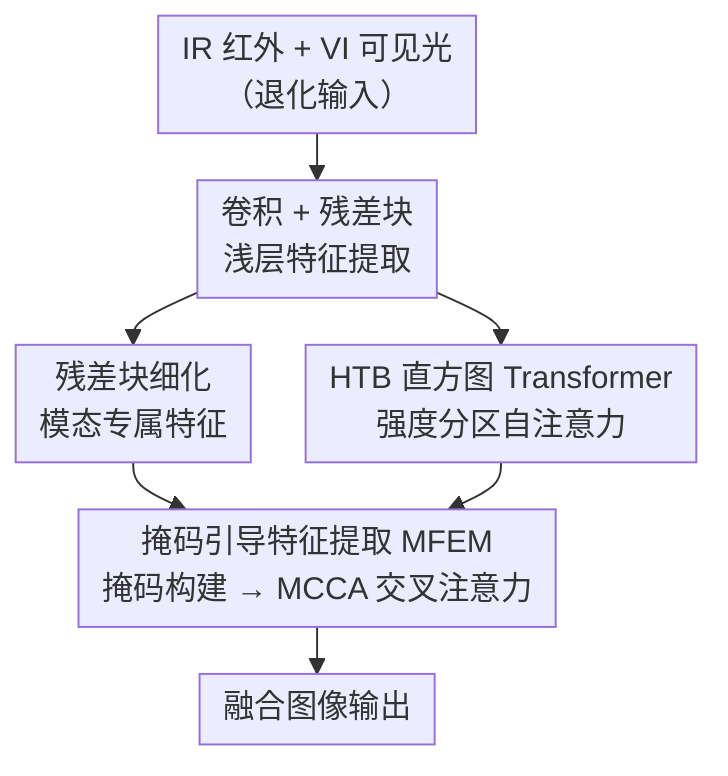

# Multi-modality Image Fusion under Adverse Weather: Mask-Guided Feature Restoration and Interaction

**会议**: ECCV 2026  
**arXiv**: [2606.26812](https://arxiv.org/abs/2606.26812)  
**代码**: [https://github.com/ixilai/AMG-Fuse](https://github.com/ixilai/AMG-Fuse) (有)  
**领域**: 多模态VLM  
**关键词**: 多模态图像融合, 红外可见光融合, 恶劣天气图像恢复, 掩码引导学习, 跨模态注意力

## 一句话总结
AMG-Fuse 提出掩码引导的恶劣天气多模态图像融合框架，通过从"伪真值"（Pseudo Ground Truth）中解耦模态贡献掩码，结合掩码引导特征提取模块（MFEM）中的跨模态交叉注意力（MCCA）、掩码引导学习策略（MGLS）和任务耦合退化感知学习策略（TDAS），在统一网络中同时完成特征恢复与跨模态交互，在雪/雨/雾三类恶劣天气及真实场景下全面超越 SOTA，并在下游目标检测任务中取得最优 mAP。

## 研究背景与动机
多模态图像融合（MMIF）通过整合不同模态的互补信息生成更丰富的场景表示。以红外-可见光图像融合（IVIF）为例，可见光图像捕获纹理细节，红外图像通过热辐射突出显著目标，两者融合可服务于目标检测、语义分割等下游任务。现有 IVIF 方法主要在理想场景下工作，但真实世界中的恶劣天气（雪、雨、雾）会导致严重的图像退化，破坏特征表示，使得融合网络难以同时完成"特征恢复"和"跨模态互补"两个目标。

现有应对恶劣天气的两类方案各有硬伤。第一类是"先恢复再融合"的两阶段范式，用独立恢复网络处理各模态后再送入融合网络。这带来两个问题：恢复阶段关注模态内复原、融合阶段关注模态间互补，优化目标不一致导致训练不稳定；恢复阶段产生的伪影会传播到融合阶段，造成误差累积。第二类方案使用"伪真值"（Pseudo Ground Truth）作为监督——即用已有融合方法在干净图像上生成的融合结果作为训练目标。这种方式将优化目标简化为 $\theta^* = \arg\min_\theta \|f(VI, IR; \theta) - GT_{Pse}\|_1$，降低了优化复杂度，能更好地保留全局结构和细节。然而，伪真值本身携带信息损失和模态偏差——网络容易过拟合到伪真值的静态像素分布，而非学习动态的模态分配机制，在干净场景下甚至会丢失红外热目标的关键信息。

**核心矛盾**：伪真值简化了训练，却让网络倾向于机械复制其表面特征，忽略了跨模态互补线索的动态挖掘。**核心 idea**：从伪真值与源图像的映射关系中推导模态贡献掩码 $M$（满足 $Fuse = M \times VI + (1-M) \times IR + \varepsilon$），将该掩码作为外部先验显式地建模跨模态交互，迫使网络学习"伪真值中各模态贡献了多少"的分配规律，而非简单复制伪真值的像素值。

## 方法详解

### 整体框架
AMG-Fuse 的输入是一对退化后的红外图像 $IR$ 和可见光图像 $VI$，输出是一张去退化且充分融合的图像。整个网络是端到端的单阶段结构，核心思想是将模态贡献掩码嵌入特征提取和交互过程，让网络在恢复退化特征的同时动态分配各模态的融合权重。

具体流程：首先用卷积和残差块提取多模态浅层特征，并组合生成初始融合特征。随后，模态专属特征经残差块进一步细化，融合特征则送入直方图 Transformer 块（HTB）——HTB 按像素强度将空间特征分区并在各区内做自注意力，能有效捕获跨长距离的相似退化模式（如雨条纹）。最后，细化后的多模态特征和 HTB 增强后的融合特征共同进入掩码引导特征提取模块（MFEM），在其中完成掩码构建和跨模态交叉注意力（MCCA），输出最终融合图像。

训练阶段，AMG-Fuse 使用伪真值 $GT_{Pse}$（由 EMMA 在干净图像对上生成）作为辅助监督，配合 MGLS、TDAS、梯度损失和颜色一致性损失联合优化。其中 MGLS 的权重系数 $\lambda$ 随训练 epoch 增加逐步衰减，使伪真值在早期稳定训练、后期让位于干净源图像的监督。

### 关键设计

**1. 模态贡献掩码构建：从融合公式中解耦模态分配权重**

IVIF 的核心目标是抑制跨模态冗余、提取互补信息。忽略特征增强和降维操作，融合结果可表示为 $Fuse = M \times VI + (1-M) \times IR + \varepsilon$，其中 $M$ 是模态权重分配掩码，$\varepsilon$ 是误差和噪声项。已知 $Fuse$、$VI$、$IR$ 时，直接求解 $M = \frac{Fuse - IR}{VI - IR} + \varepsilon_M$ 在恶劣天气下会出现严重问题：雾/雪天可见光图像亮度过曝、红外图像对比度低，分母 $VI - IR$ 被退化因素主导而非语义内容，导致掩码无法反映真实模态分布；夜间场景 $VI - IR$ 大面积接近零或为负，造成数值不稳定。

本文的关键修正是将 $Fuse$ 信息引入分母，重写为 $M = \frac{Fuse - IR}{VI - IR + Fuse} + \varepsilon_M$。这个操作一举两得：$Fuse$ 经网络优化和去退化后结构更稳定，有效抑制了可见光亮度偏差对掩码的错误放大；同时避免了分母趋零的数值不稳定。用此掩码对伪真值做特征分解，可得到可见光贡献图 $F_{VI} = M_{Pse} \times VI_C$ 和红外贡献图 $F_{IR} = (1-M_{Pse}) \times IR_C$，直观展示不同融合算法对各模态信息的分配策略。

**2. 掩码引导特征提取模块（MFEM）与跨模态交叉注意力（MCCA）**

直接在伪真值上训练会让网络复制伪真值的固有偏差，强调表面特征复现而忽视有效的跨模态交互。MFEM 的设计遵循公式 $Fuse = M \times VI + (1-M) \times IR$ 的合成范式：首先将多模态特征送入残差块（RSB）细化，融合特征经 HTB 增强；然后基于两者计算掩码 $M$；最后通过 MCCA 模块让网络学习伪真值中的多模态交互模式。

MCCA 采用交叉注意力机制：多模态特征作为 Query，受掩码加权引导；融合特征作为 Key 和 Value。具体地，掩码分别对可见光 Query $Q_{VI}$ 和红外 Query $Q_{IR}$ 加权，引导网络关注各模态中的显著特征。Query 和 Key-Value 分支均引入深度可分离卷积扩展局部感受野。通过掩码加权后的 Query 与融合特征的 Key/Value 做交叉注意力，在融合空间中完成多模态特征的解耦与重组——本质上是让网络学会"在融合时，这个位置应该取多少可见光信息、取多少红外信息"，而非盲目复制伪真值。

**3. 掩码引导学习策略（MGLS）：用伪真值的模态分布监督动态融合**

MGLS 的核心思路是利用伪真值中的模态分配规律来约束网络。先用公式 (5) 基于伪真值 $GT_{Pse}$ 和干净源图像 $VI_C$、$IR_C$ 计算掩码 $M_{Pse}$，再按公式 $F_{VI} = M_{Pse} \times VI_C$, $F_{IR} = (1-M_{Pse}) \times IR_C$ 解耦出伪真值中的可见光分配图 $F_{VI}$ 和红外分配图 $F_{IR}$。然后对网络输出的对应模态特征 $\hat{F}_{VI}$ 和 $\hat{F}_{IR}$ 施加 L1 损失：

$$\mathcal{L}_{MGLS} = \frac{1}{HW} (\|\hat{F}_{VI} - F_{VI}\|_1 + \|\hat{F}_{IR} - F_{IR}\|_1)$$

这迫使网络学习"伪真值中各模态分别贡献了多少"的分布规律，而非简单拟合伪真值的整体外观。关键是，MGLS 的权重系数 $\lambda$ 随训练衰减：早期 $\lambda$ 较大，利用伪真值稳定训练和加速收敛；后期 $\lambda$ 逐渐减小，让干净源图像的监督主导优化，避免网络被伪真值的偏差锁死。

**4. 任务耦合退化感知学习策略（TDAS）：用恢复模型作为"清洁度检测器"**

TDAS 的设计动机来自一个关键观察：退化场景下的掩码 $M_{Deg}$ 能有效捕获退化区域的分布——如雨天场景下 $M_{Deg}$ 成功抑制了大部分雨条纹。公式 $Fuse = M_{Deg} \times VI_{Deg} + (1-M_{Deg}) \times IR_{Deg} + \varepsilon$ 中，$Fuse$ 是无退化图像，因此 $VI_F = M_{Deg} \times VI_{Deg}$ 应当是无退化的可见光成分。

基于此，TDAS 引入一个预训练的恢复模型 $\mathcal{R}(\cdot)$ 作为"清洁度检测器"：如果 $VI_F$ 已被充分恢复，则恢复模型对其的输出 $\mathcal{R}(VI_F)$ 应接近恒等映射（因为输入本身已经干净）。TDAS 损失定义为：

$$\mathcal{L}_{TDAS} = \frac{1}{H \times W} \|VI_F - \mathcal{R}(VI_F)\|_1$$

当融合网络成功恢复干净特征时，$VI_F$ 与 $\mathcal{R}(VI_F)$ 接近，损失小；反之，若融合网络未能去除退化（如仍有雨条纹），恢复模型会对其进行去雨处理导致输出变化，损失增大。这相当于用恢复任务作为辅助监督信号，增强网络对退化的感知能力，引导其优先处理清晰、显著的区域。与 MGLS 互补：TDAS 聚焦"特征是否干净"，MGLS 聚焦"模态如何分配"。

### 损失函数 / 训练策略

除 MGLS 和 TDAS 外，AMG-Fuse 引入两项源图像监督损失以增强模型对多模态分布的捕捉能力。**梯度损失**保留结构细节：$\mathcal{L}_{grad} = \frac{1}{HW} \|\nabla Fuse - \max(|\nabla VI_C|, |\nabla IR_C|)\|_1$，即要求融合图像的梯度强度不低于两源图像中的最大值。**颜色一致性损失**保持色彩分布：$\mathcal{L}_{color} = \frac{1}{HW} \|F_{CbCr}(Fuse) - F_{CbCr}(VI_C)\|_1$，将图像从 RGB 转到 CbCr 颜色空间后约束融合结果与可见光图像的颜色分量一致。

总损失为 $\mathcal{L}_{total} = \lambda \times \mathcal{L}_{MGLS} + \mathcal{L}_{TDAS} + \mathcal{L}_{color} + \mathcal{L}_{grad}$，其中 $\lambda$ 为衰减系数，随训练 epoch 增加逐步减小；其余三项权重均为 1，无需精细调参。训练使用 AWMM-100k 数据集中雪/雨/雾各 1000 张作为训练集，裁剪为 $168 \times 168$ patch，Adam 优化器（初始学习率 $1\times 10^{-3}$，batch size 2），在 4 张 RTX 3090 上训练 200 epoch。

## 实验关键数据

### 主实验

在雪/雨/雾三类恶劣天气下，与 7 个对比方法（LRRNet、Text-DiFuse、EMMA、Text-IF、GIFNet、SAGE、AWFusion）比较。除 AWFusion 端到端处理退化外，其余方法均采用 AdaIR 做前置恢复。AMG-Fuse 在绝大多数指标上位列前二。

| 场景 | 方法 | $Q_M\uparrow$ | $Q_G\uparrow$ | SSIM$\uparrow$ | $VIF\uparrow$ | $Q^{AB/F}\uparrow$ |
|------|------|--------------|--------------|----------------|--------------|-------------------|
| Snow | EMMA (CVPR 24) | 0.5353 | 0.4235 | 0.4096 | 0.3252 | 0.5470 |
| Snow | Text-IF (CVPR 24) | 0.5942 | 0.4199 | 0.4298 | 0.3300 | 0.5419 |
| Snow | AWFusion (INFFus 26) | 0.5535 | 0.3552 | 0.3734 | 0.3024 | 0.4937 |
| Snow | **AMG-Fuse** | **0.6408** | **0.4240** | **0.4302** | **0.3463** | **0.5519** |
| Rain | EMMA (CVPR 24) | 0.5871 | 0.3745 | 0.3700 | 0.3384 | 0.4866 |
| Rain | Text-IF (CVPR 24) | 0.6375 | 0.4085 | 0.4046 | 0.3489 | 0.5149 |
| Rain | **AMG-Fuse** | **0.6940** | **0.4163** | **0.4080** | **0.3582** | **0.5184** |
| Haze | EMMA (CVPR 24) | 0.4149 | 0.3553 | 0.3296 | 0.2559 | 0.4617 |
| Haze | AWFusion (INFFus 26) | 0.5471 | 0.4283 | 0.3901 | 0.3433 | 0.5322 |
| Haze | **AMG-Fuse** | **0.5438** | **0.4376** | **0.4083** | **0.3445** | **0.5414** |

真实场景（真实雾天数据）下，AMG-Fuse 在全部 7 个指标中均位列前二（$Q_{MI}$: 0.7234, $Q_G$: 0.5114, $Q_M$: 1.1022, $VIF$: 0.4373, SSIM: 0.5202, $Q^{AB/F}$: 0.5957）。

**下游任务**：在 M3FD 数据集上用 YOLOv7 做目标检测，AMG-Fuse 取得最优 mAP@0.5=0.843 和 mAP@0.5:0.95=0.541，6 个类别中 5 个位列前二。

**超越伪真值生成器**：AMG-Fuse 在 MSRS、M3FD、LLVIP 三个干净数据集上均优于其伪真值生成器 EMMA（如 MSRS 上 $Q_M$: 1.5051 vs 0.7291），证明伪真值并未限制模型上界。

### 消融实验

| 场景 | 配置 | $Q_M\uparrow$ | $Q_G\uparrow$ | SSIM$\uparrow$ | $VIF\uparrow$ | $Q^{AB/F}\uparrow$ | 说明 |
|------|------|--------------|--------------|----------------|--------------|-------------------|------|
| Snow | w/o TDAS | 0.5097 | 0.3951 | 0.3961 | 0.3268 | 0.5012 | 去 TDAS 后融合质量明显下降，结构细节恢复不足 |
| Snow | **AMG-Fuse** | **0.6408** | **0.4240** | **0.4302** | **0.3463** | **0.5519** | 完整模型 |
| Rain | w/o MGLS | 0.6782 | 0.3910 | 0.3928 | 0.3531 | 0.4982 | 去 MGLS 后结构敏感指标 $Q_G$、$Q_M$ 下降明显，平均降幅 3.34% |
| Rain | **AMG-Fuse** | **0.6940** | **0.4163** | **0.4080** | **0.3582** | **0.5184** | 完整模型 |
| Haze | w/o MCCA | 0.5012 | 0.4178 | 0.3616 | 0.3184 | 0.5217 | 去 MCCA 后退化为单向恢复结构，跨模态交互受限，平均降幅约 6.9% |
| Haze | **AMG-Fuse** | **0.5438** | **0.4376** | **0.4083** | **0.3445** | **0.5414** | 完整模型 |

### 关键发现
- **MCCA 贡献最大**：去掉 MCCA 后平均性能下降约 6.9%，远超 TDAS 和 MGLS，说明跨模态交叉注意力是模型核心——没有它，网络退化为单向恢复结构，红外和可见光模态之间的互补信息交换几乎中断。
- **TDAS 对重度退化尤其关键**：雪天场景下，去掉 TDAS 后 $Q_M$ 从 0.6408 骤降到 0.5097（降幅 20.5%），因为雪天覆盖面积大、结构细节难恢复，没有退化感知约束时网络缺乏明确的"去退化"指引。
- **MGLS 退火机制有效**：消融显示 MGLS 主要保护结构敏感指标（$Q_G$、$Q_M$ 下降），而人眼感知指标（$VIF$、$Q_{CB}$）降幅较小，佐证了 MGLS 的核心作用是约束模态分配结构而非整体外观。
- **AMG-Fuse 在干净场景同样具有竞争力**：尽管为退化场景设计，AMG-Fuse 在干净数据集上仍能超越其伪真值生成器 EMMA，证明掩码引导机制学到的是通用的模态交互规律而非退化特化技巧。

## 亮点与洞察
- **掩码作为可迁移的"模态指纹"**：从融合公式推导出的掩码 $M$ 本质上是对任意融合算法模态分配策略的逆向工程——给定融合结果，$M$ 告诉你每个像素来自可见光的比例。这个思路可以迁移到任何"从黑盒融合结果反推权重分配"的场景，比如多曝光融合、多聚焦融合。
- **用恢复模型当"清洁度检测器"而非恢复器**：TDAS 的巧妙之处在于不要求 $\mathcal{R}$ 真的去恢复退化图像，而是利用"干净输入经过恢复模型近似恒等映射"这一特性来评估特征清洁度。这是一种零额外标注的退化感知信号，类似思路可用于其他需要判断"输出是否干净"的任务。
- **$\lambda$ 衰减是伪真值方法的关键稳定器**：伪真值早期引导收敛、后期让位给源图像监督的策略，让模型既享受了简化优化的好处，又避免了过拟合伪真值的偏差。这种课程学习式的损失加权可以推广到其他使用近似标签的方法。
- **公式 (5) 的分母修正**：在分母中加入 $Fuse$ 信息是一个简单但关键的数学修正，同时解决了恶劣天气下的亮度偏差放大和夜间场景的数值不稳定，说明针对任务特性的数值稳定化设计比通用的归一化技巧更有效。

## 局限与展望
- **计算开销大**：在 $224 \times 224$ 输入下需 242.03G FLOPs 和 59.74M 参数，主要瓶颈是 HTB 直方图 Transformer。作者也承认需要在效率上改进。轻量化方向可考虑用更高效的长程依赖模块替代 HTB（如状态空间模型 Mamba），或对 HTB 的强度分区策略做剪枝。
- **伪真值生成器的选择未充分消融**：论文只用了 EMMA 作为伪真值生成器，未比较不同生成器（如 SOTA 更强的融合方法）对最终性能的影响。换一个更强的伪真值生成器是否能进一步提升性能、或反而带来更严重的模态偏差，是值得探索的问题。
- **恶劣天气类型有限**：目前仅覆盖雪、雨、雾三类退化，未涉及混合退化（如雨+雾、低光照+噪声）的真实场景。混合退化下的掩码行为可能更复杂，退化之间可能存在耦合。
- **下游任务仅验证了检测**：虽然目标检测结果有提升，但语义分割、深度估计等其他下游任务的适配性未验证。不同下游任务对融合质量的定义可能不同，当前统一框架是否最优值得进一步研究。

## 相关工作与启发
- **vs 两阶段"恢复+融合"方法**：传统方案先恢复后融合，恢复与融合的优化目标割裂，误差累积不可避免。AMG-Fuse 在单阶段内通过 TDAS 将恢复作为辅助监督信号嵌入融合网络，实现了隐式恢复+显式融合的统一优化，实验证明这种耦合设计在重度退化下优势显著。
- **vs 文本引导融合方法（Text-DiFuse, Text-IF）**：文本引导方法用语义文本作为外部先验帮助网络关注退化区域，本质是引入高层语义监督。AMG-Fuse 的掩码则是一种低层像素级先验，直接从模态贡献的物理模型推导而来，更贴近融合问题的本质。两者或可结合——用语义文本指导掩码中退化区域的精确定位。
- **vs AWFusion（全天气 IVIF）**：AWFusion 通过知识蒸馏将多种物理模型先验引入学生模型，但本质上仍是"先恢复后融合"的思路。AMG-Fuse 不依赖物理退化模型，而是通过掩码从数据中学习模态分配规律，对未见过的退化类型可能更具泛化潜力。

## 评分
- 新颖性: 四颗星。从融合公式中推导模态贡献掩码并以此为核心构建一整套特征提取+学习策略体系，思路新颖且自洽；但掩码注意力机制本身不新，增量在于将其与融合任务的物理约束绑定。
- 实验充分度: 四颗星。三类恶劣天气+真实数据+干净场景+下游检测，对比 7 个 SOTA，消融覆盖三个核心组件，且额外验证了伪真值不限制上界；但缺少对混合退化的实验和对不同伪真值生成器的对比。
- 写作质量: 四颗星。公式推导步步递进（从式(1)→式(2)→式(3-5)的逻辑链清晰），问题引出自然（伪真值的双面性），Figure 1-2 直观；消融部分略有些"按场景分散"，每个组件只在一种天气下消融，不利于横向比较各组件的相对重要性。
- 价值: 四颗星。掩码解耦的思路具有通用性，可推广到其他多模态融合场景；代码已开源，对恶劣天气下的图像融合研究和应用有直接参考价值；但计算开销较大，离实际部署还有距离。

<!-- RELATED:START -->

## 相关论文

- [\[CVPR 2026\] Multi-Modal Image Fusion via Intervention-Stable Feature Learning](../../CVPR2026/multimodal_vlm/multi-modal_image_fusion_via_intervention-stable_feature_learning.md)
- [\[ECCV 2024\] Towards Real-World Adverse Weather Image Restoration: Enhancing Clearness and Semantics with Vision-Language Models](../../ECCV2024/multimodal_vlm/towards_real-world_adverse_weather_image_restoration_enhancing_clearness_and_sem.md)
- [\[CVPR 2026\] ReCoFuse: Ultra-Robust Image Fusion via Restorative Multi-Modal Diffusion Reciprocal Coupling](../../CVPR2026/multimodal_vlm/recofuse_ultra-robust_image_fusion_via_restorative_multi-modal_diffusion_recipro.md)
- [\[CVPR 2026\] Is the Modality Gap a Bug or a Feature? A Robustness Perspective](../../CVPR2026/multimodal_vlm/is_the_modality_gap_a_bug_or_a_feature_a_robustness_perspective.md)
- [\[CVPR 2026\] Multi-speaker Attention Alignment for Multimodal Social Interaction](../../CVPR2026/multimodal_vlm/multi-speaker_attention_alignment_for_multimodal_social_interaction.md)

<!-- RELATED:END -->
