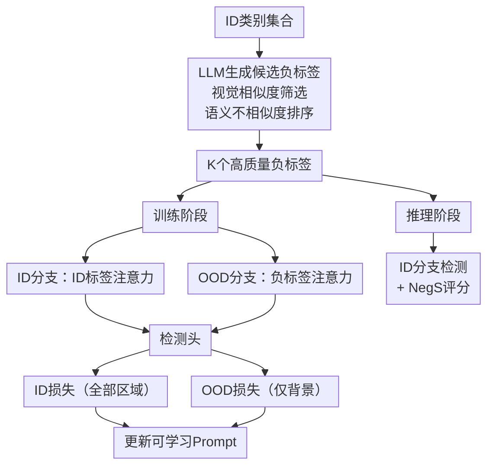

# NegAS: Negative Label Guided Attention and Scoring for Out-of-Distribution Object Detection with Vision-Language Models

**会议**: ECCV2026  
**arXiv**: [2606.22537](https://arxiv.org/abs/2606.22537)  
**代码**: 待确认  
**领域**: 多模态VLM  
**关键词**: OOD检测, 负标签引导, 视觉语言模型, YOLO-World, 开放词汇检测

## 一句话总结

NegAS 针对 VLM 目标检测器在 OOD 场景下的两个特有挑战——文本引导注意力的背景区域无差别处理和 sigmoid 多标签输出与 softmax OOD 评分不兼容——分别提出负标签引导注意力模块 NegA 和负标签引导评分函数 NegS，在 YOLO-World 和 Grounding DINO 上均大幅改善 OOD 检测性能，且推理时零额外开销。

## 研究背景与动机

OOD 检测是确保目标检测系统在安全关键场景（自动驾驶、医学影像等）中可靠运行的核心问题。当模型遇到训练时未见过的新类别目标时，往往会错误地将其分类为某个已知类别，带来严重隐患。传统 OOD 研究主要针对单模态分类器和检测器（如 Faster R-CNN），近年来基于 CLIP 的 OOD 分类取得了显著进展，核心思路分为两条线：一是设计负提示词（NegPrompt、LoCoOp）来增强特征的可区分性，二是开发改进的 OOD 评分函数（MCM、NegLabel）。然而，将这些思路从图像级分类向实例级检测迁移时，会遭遇一个根本性的断层——VLM 目标检测器（如 YOLO-World）的架构设计和训练信号与分类器截然不同。

本文率先将目光投向基于 VLM 的密集目标检测器在 OOD 场景下的表现，并识别出两个与之绑定的特有挑战。其一，YOLO-World 中的文本引导注意力（Text-Guided CSPLayer）通过 ID 标签增强前景区域，但所有背景区域被一视同仁地压制。这实际上浪费了关键信息——某些背景区域可能包含潜在的 OOD 目标，如果能引导模型更多地关注这些区域，就能学到更清晰的 ID-OOD 决策边界。其二，VLM 检测器使用独立的 Sigmoid 激活做多标签分类，这与传统 OOD 评分方法所依赖的 Softmax 概率空间存在本质不兼容：Softmax 的互斥假设在 Sigmoid 的世界里不再成立，直接将基于能量函数的评分搬过来会带来系统性偏差。

针对这两个问题，本文提出了 NegAS 框架，核心洞察是：既然 VLM 检测器天然具备文本条件化能力，就可以利用精心构造的负标签来弥补它缺失的 OOD 感知。**核心 idea：用 LLM 生成视觉相似但语义不同的负标签——训练时通过 NegA 模块引导注意力聚焦潜在 OOD 背景区域、学习更清晰的边界；测试时通过 NegS 函数（max ID 分数 − max 负标签分数）在 Sigmoid 空间完成 OOD 判别，且 NegA 分支在推理时被丢弃，不引入任何额外计算开销。**

## 方法详解

### 整体框架

NegAS 基于 YOLO-World 搭建，整体架构如图所示。预处理阶段，给定 ID 类别集合，由 LLM 一次性离线生成候选负标签，再经过 CLIP 视觉相似度筛选和语义不相似度排序，选出 K 个高质量的负标签。训练阶段，模型具有双分支 neck（共享参数）：ID 分支沿用原始 YOLO-World 的文本引导注意力（用 ID 标签增强特征），OOD 分支则用负标签做同样的注意力操作，但损失仅施加于背景区域（通过背景掩码实现）。两个分支共享检测头，但只有可学习的文本 prompt 被更新，YOLO-World 的骨干和检测头参数均冻结。推理阶段，NegA 的 OOD 分支整个被丢弃，仅保留 ID 分支产生检测结果，同时保留负标签的文本嵌入用于计算 NegS 分数——每张图只多了一个矩阵乘法的代价，几乎可以忽略。

### 关键设计

**1. NegA：负标签引导注意力模块**

YOLO-World 的文本引导注意力（MSA）对每个空间位置，计算视觉特征与所有 ID 标签文本嵌入的最大 Sigmoid 相似度作为注意力权重——与某 ID 标签高度匹配的区域被增强，无关区域被压制。问题在于，所有背景区域被同等压制，这对 OOD 检测极为不利：一个在视觉特征上接近 OOD 目标的背景区域本该被特别关注，却因为不与任何 ID 标签匹配而被简单压暗。

NegA 的解决方案是在 neck 中增加一个与 ID 分支并行的 OOD 分支，共享相同的架构和参数，但使用负标签文本嵌入来计算注意力。两个分支从相同的多尺度视觉特征出发：ID 分支产出 `I^id = MSA(I, T_id)`，OOD 分支产出 `I^ood = MSA(I, T_neg)`。关键约束有三：一、OOD 分支的分类损失只计算背景区域（通过 GT 框构造的二值背景掩码实现），避免干扰 ID 前景的学习；二、整个 YOLO-World 的骨干和检测头参数冻结，仅可学习的文本 prompt 被更新——这确保了 ID 检测能力完全不退化；三、OOD 分支的背景损失实际上与 ID 分支在该区域的损失方向一致（该区域 ID 分支的目标也是 0），两个梯度不冲突。

推理时 NegA 分支被整支丢弃，不改变原始 YOLO-World 的前向路径，实现了零额外推理成本。

**2. 基于 LLM 的负标签挖掘管线**

传统的 NegLabel 方法从 WordNet 等词汇数据库中检索负标签，但从中选出的许多词在视觉上是无意义的。本文提出了一套三步管线：LLM 生成 → 视觉相似度筛选 → 语义不相似度排序。

首先，设计一段详细 prompt（系统提示 + 用户提示）指导 LLM 为当前的 ID 类别集合生成候选负标签。prompt 要求负标签在视觉上与 ID 类别相似（颜色、形状、纹理等）但语义上截然不同，且要求候选标签多样、日常可见。这是一个一次性的离线步骤，训练和推理中都不再调用 LLM。对于 VOC 和 BDD100K，论文已发布完整的负标签集合，下游用户零 LLM 调用；对于新 ID 集，用开源的 Qwen3 也能达到可比性能。

第二步，视觉相似度筛选。对于每个 LLM 候选标签，用 CLIP 的图像编码器计算它与每类 ID 视觉原型（从训练集提取的实例特征均值）的图像-文本相似度，保留相似度高于阈值（默认 0.5）的候选。这一步确保负标签描述的目标在视觉上与 ID 目标有交集，否则对注意力引导没有意义。

第三步，语义不相似度排序。对每个通过视觉筛选的候选标签，计算它与所有 ID 标签在 CLIP 文本嵌入空间中的最大余弦相似度，然后用 `1 − 最大相似度` 作为不相似度分数，选出不相似度最大的 K 个标签（即与 ID 语义差距最大的那些）。这避免了负标签与 ID 标签语义重叠——如果「校车」与「公交车」的相似度太高，它就不会被选入负标签集。实验表明 K=20 时效果最佳。

**3. NegS：基于 sigmoid 的 OOD 评分函数**

传统 OOD 检测常采用基于 Softmax 配分函数的能量分数 `E = -log Σ e^z`，这在互斥假设下是合理的。但 VLM 检测器使用独立 Sigmoid 激活做多标签分类，直接套用 Softmax 能量函数在概率基础层面就不匹配。更根本的问题是，传统能量分数无法利用我们训练阶段注入的负标签语义信息。

NegS 的设计极为简洁：对每个检测框，分别计算它与 ID 标签集合的最大 Sigmoid 分数和与负标签集合的最大 Sigmoid 分数，然后取差值：

`NegS(P_id) = max(ID_scores) - max(negative_scores)`

这个公式的物理含义非常清晰：一个框如果与某个 ID 类别高度匹配（高 ID 分数）且不与任何负标签高度匹配（低负分数），它就更可能是 ID 目标；反之如果一个框虽然 ID 分数不高，但负分数很高（与负标签之一很像），它就是潜在的 OOD 目标。注意负标签与 ID 标签在视觉上本就相似，所以真正 ID 目标的负分数天然偏低，而 OOD 目标的负分数可能偏高。差值操作自然放大了这个分离信号。

NegS 在计算时用推理时的 ID 分支视觉特征与保存的 K 个负标签文本嵌入做一次前向即可，每张图只需要额外做一次矩阵乘法，计算量极低。

### 损失函数 / 训练策略

总损失函数为：
`L = L_det + α * L_ood_cls`

其中 `L_det` 是 YOLO-World 的原始检测损失（包含 ID 分类损失和边界框回归损失，全部由 ID 分支贡献），`L_ood_cls` 是 OOD 分支在背景区域上的 BCE 分类损失（前景被背景掩码 M 置零屏蔽），平衡系数 α 默认设为 3。训练中仅在可学习的文本 prompt（3 个，512 维，初始化为 "a photo of"）上更新梯度，其余全部冻结。优化器为 AdamW，学习率 1e-2，在 4 张 V100 上以 batch size 160 训练 30 轮，输入分辨率 640×640。

## 实验关键数据

### 主实验

以 VOC（20 类）为 ID 数据集，COCO / OpenImages（去除重叠类别）为 OOD 数据集：

| 方法 | OOD 数据集 | mAP (ID)↑ | FPR95↓ | AUROC↑ |
|------|-----------|-----------|--------|--------|
| YOLO-World (基线) | COCO | 69.0 | 21.3 | 93.4 |
| YW + CoOp (基线) | COCO | 72.2 | 13.9 | 95.7 |
| **YW + NegAS** | COCO | 72.5 | **9.9** | **95.9** |
| YOLO-World (基线) | OpenImages | 69.0 | 48.8 | 81.4 |
| YW + CoOp (基线) | OpenImages | 72.2 | 47.0 | 83.3 |
| **YW + NegAS** | OpenImages | 72.5 | **23.3** | **92.6** |

在更难的自动驾驶场景 BDD100K（10 类，ID 自身 mAP 仅 22.5）上：

| 方法 | OOD 数据集 | FPR95↓ | AUROC↑ |
|------|-----------|--------|--------|
| YOLO-World (基线) | COCO | 40.4 | 83.9 |
| **YW + NegAS** | COCO | **20.9** | **92.0** |
| YOLO-World (基线) | OpenImages | 8.2 | 97.0 |
| **YW + NegAS** | OpenImages | **3.6** | **98.7** |

NegAS 在 Grounding DINO 上的迁移实验结果同样显著：FPR95 从 11.7 降至 7.2（COCO OOD）、从 33.4 降至 24.3（OpenImages OOD），证明框架对不同架构的 VLM 检测器具有通用性。

### 消融实验

| 配置 | NegA | NegS | FPR95 (COCO) | FPR95 (OpenImages) |
|------|------|------|-------------|-------------------|
| 基线 (CoOp) | ✗ | ✗ | 13.9 | 47.0 |
| +仅NegS | ✗ | ✓ | 11.4 | 33.3 |
| +仅NegA | ✓ | ✗ | 11.8 | 41.8 |
| **NegAS完整** | ✓ | ✓ | **9.9** | **23.3** |

### 关键发现

- **NegS 比 NegA 增益更大**（尤其在困难 OOD 场景 OpenImages 上以 33.3 vs 41.8 大幅领先），说明一个好的评分函数对 OOD 检测的贡献可能比注意力引导更直接。两者结合有互补增益。
- **NegS vs 已有 VLM OOD 评分**：直接将 NegLabel 和 MCM 搬到 YOLO-World 每张 proposal 上做评分，NegS 在上述场景均大幅胜出——FPR95 从 18.2（NegLabel）降至 9.9（完整 NegAS），证明评分函数的精心设计比简单迁移已有工作更有效。
- **LLM 生成 vs WordNet 语料库**：LLM 生成的负标签（FPR95 9.9 vs 11.7，在 OpenImages 上 23.3 vs 42.4）大幅优于从 WordNet 检索的 NegLabel 方法，且对 LLM 种类（GPT-5、Opus 4.5、Qwen3）和 prompt 设计鲁棒。
- **负标签数量敏感**：K=20 效果最佳，太少（1-5）信息不够，太多（30）引入噪声；仅用单个 "object" 做负标签已能改善基线但远不如优选 20 个。
- **高斯噪声的作用**：对负标签嵌入加 σ=0.05 的高斯噪声能提升在 OpenImages 上的表现（23.3 vs 33.4），但对 COCO 几乎无影响——原因在于 OpenImages 的 OOD 类别与所选负标签的语义覆盖缺口更大，噪声起到了局部邻域补全的作用。

## 亮点与洞察

- **零推理开销**：NegA 分支训练完就丢弃，NegS 仅靠一次矩阵乘法完成——这种"训练阶段强化 OOD 特征学习、推理阶段不拖慢"的设计思路在实时检测场景下极具吸引力。
- **Sigmoid 原生 OOD 评分**：NegS 的 `max(ID) − max(neg)` 公式简洁到不能再简，但它恰好命中 VLM 检测器 Sigmoid 输出的本质属性——信息就藏在"与哪个标签的匹配度最高"这个相对排序里，而非绝对概率大小。
- **负标签生成的可复现性**：论文发布了完整的 LLM prompt 模板、生成过程和完整的负标签集合（VOC 和 BDD100K），这意味着后续工作不需要依赖闭源 LLM API 即可复现和扩展。
- **可迁移洞察**：负标签引导注意力的思路不限于 YOLO-World——对 Grounding DINO（query-based transformer）的成功适配意味着，任何带有文本条件化机制的 VLM 检测器都可以套用这个双分支方案。

## 局限与展望

- 负标签数量 K 的选取十分敏感（20 最佳，30 就下降），目前是通过实验暴力搜索的——缺少自动确定最优 K 的理论指导或自适应策略。
- 方法依赖于训练时构造准确的背景掩码，这对密集检测器（YOLO-World）容易，但对 query-based transformer（Grounding DINO）需要复杂投影，增加了适配难度。
- 实验仅在 VOC 和 BDD100K 两个 ID 集上进行（类别数分别为 20 和 10），规模相对较小；扩展到大规模 ID 集（如 LVIS 的 1200+ 类）时负标签的选择和评分函数的有效性尚未验证。
- 当 OOD 类别与 ID 类别在视觉上极其相似（如不同品种的狗）时，视觉相似度筛选可能无法有效区分，导致负标签质量退化。

## 相关工作与启发

- **vs NegLabel (ICLR2024)**：NegLabel 从 WordNet 检索负标签做 CLIP 分类 OOD，NegAS 改用 LLM 生成 + 视觉相似度筛选两条质控保证；NegLabel 的评分仅基于 ID 分类能量，NegS 则显式利用负标签做相对比较，更贴合 VLM 的 Sigmoid 输出。
- **vs VOS (CVPR2022)**：VOS 扰动 ID 数据合成伪 OOD 样本来训练，基于 Softmax 能量评分；NegAS 不做数据合成，而是用负标签引导注意力从真实背景中挖掘 OOD 线索，评分原理也不同。
- **vs YOLO-World (CVPR2024)**：本文在 YOLO-World 上的工作可视为给开放词汇检测器添加了一层 OOD 感知能力——原本 YOLO-World 天然缺乏"我不认识这个东西"的机制，NegAS 用负标签赋予了它这种能力。

## 评分

- 新颖性: ⭐⭐⭐⭐ [首个系统研究 VLM 检测器 OOD 检测的工作，提出 NegA+NegS 双组件框架，但整体思路（负标签引导）在 CLIP 分类 OOD 中已有先例]
- 实验充分度: ⭐⭐⭐⭐⭐ [在两个 ID 集 × 两个 OOD 集上实验，消融了每个组件、LLM 类型、prompt 设计、标签数量、噪声参数等多个维度，还跨了两种不同架构的检测器]
- 写作质量: ⭐⭐⭐⭐⭐ [问题定义清晰（两个挑战准确击中 VLM 检测器的特殊性），方法叙述有层次，消融实验完整]
- 价值: ⭐⭐⭐⭐ [VLM 检测器的 OOD 检测是空白但有实际需求的领域，NegAS 的"训练时有、推理时无"思路对实时系统友好，但负标签的离线生成方法限制了完全自动化]

<!-- RELATED:START -->

## 相关论文

- [\[CVPR 2026\] UNI-OOD: Unified Object- and Image-level Out-of-Distribution Detection via Cross-Context Attentive Vision-Language Modeling](../../CVPR2026/multimodal_vlm/uni-ood_unified_object-_and_image-level_out-of-distribution_detection_via_cross-.md)
- [\[ICCV 2025\] FA: Forced Prompt Learning of Vision-Language Models for Out-of-Distribution Detection](../../ICCV2025/multimodal_vlm/fa_forced_prompt_learning_of_vision-language_models_for_out-of-distribution_dete.md)
- [\[CVPR 2026\] Activation Matters: Test-time Activated Negative Labels for OOD Detection with Vision-Language Models](../../CVPR2026/multimodal_vlm/activation_matters_test-time_activated_negative_labels_for_ood_detection_with_vi.md)
- [\[ICCV 2025\] NegRefine: Refining Negative Label-Based Zero-Shot OOD Detection](../../ICCV2025/multimodal_vlm/negrefine_refining_negative_label-based_zero-shot_ood_detection.md)
- [\[ICCV 2025\] Adaptive Prompt Learning via Gaussian Outlier Synthesis for Out-of-Distribution Detection](../../ICCV2025/multimodal_vlm/adaptive_prompt_learning_via_gaussian_outlier_synthesis_for_out-of-distribution_.md)

<!-- RELATED:END -->
