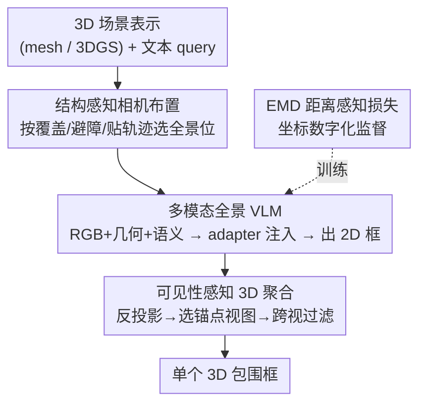

# PanoGrounder: Bridging 2D and 3D with Panoramic Scene Representations for VLM-based 3D Visual Grounding

**会议**: ECCV 2026  
**arXiv**: [2512.20907](https://arxiv.org/abs/2512.20907)  ⚠️ 疑似占位/未来日期（2025-12），以原文为准  
**项目页**: https://choiseongho-h.github.io/PanoGrounder  
**领域**: 多模态VLM / 3D视觉grounding  
**关键词**: 3D视觉grounding, 全景表示, 2D-3D桥接, VLM, 跨视聚合

## 一句话总结
用「全景渲染图」当作 2D 和 3D 之间的中间表示，让预训练的 2D VLM（CogVLM-17B）在一张 360° 全景图上直接输出 2D 框，再把多视角预测提升融合成 3D 框，从而把 2D VLM 的强语言推理能力搬到 3D visual grounding 上，在 ScanRefer 和 Nr3D 上取得 SOTA 并对未见场景/改写文本泛化良好。

## 研究背景与动机
3D 视觉 grounding（3DVG）要根据一句自由文本在 3D 场景里框出被指的物体，是连接语言理解与具身感知（AR、视觉语言导航、机器人抓取）的关键一环。传统做法给文本和点云各配一个编码器、再做跨模态融合，直接在 3D 上操作，在标准基准上分数很高。但这条路有两个天生的短板：语言侧多用 BERT / CLIP 式编码器，组合推理和空间关系理解远不如现代 VLM，遇到改写句、关系密集的描述就吃力；3D 视觉侧则是在规模有限的 3DVG 数据集上从零训练，一旦换场景、换类别、换说法就泛化不动，而且严重依赖人工清洗过的高质量点云——换成原始 RGBD 投影出来的点云性能就大幅下滑。

一个自然的想法是把 VLM 引进来补语言能力，但「2D 能力怎么迁到 3D」并不好办。近期基于 VLM 的方法用透视（针孔）图像当 2D-3D 的接口，可透视图视野窄，一张图只看到场景的一小块，捕捉不到全局空间上下文；而且它们往往依赖 GPT-4V、Qwen2-VL-72B 这类庞大的闭源模型，算力昂贵又难以针对任务微调。问题的核心矛盾在于：既想借 2D VLM 现成的语言推理，又要让它「看得全」并且「调得动」，而透视图这个接口两头都不讨好。

本文的切入点是换一个更合适的中间表示——全景图。**核心 idea：把 360° 全景渲染图当作 2D 与 3D 之间的显式中间表示，一张图就装下整个场景的全局空间关系、又能几乎零改动地喂给 2D VLM，配一个轻量 adapter 注入几何/语义线索并端到端微调，就能把 2D VLM 的语言推理力直接转成可泛化的 3D grounding。**

## 方法详解

### 整体框架
输入是一个可渲染的 3D 场景表示（三角网格或 3D Gaussian Splatting）加一句文本 query，输出是被指物体的一个 3D 包围框。整个流程分三阶段串起来：先在场景里挑出一小撮信息量高的全景相机位（结构感知相机布置），在每个位置渲染出 RGB、几何（深度/range）、语义三路多模态全景；再让一个预训练 VLM（配上多模态特征 adapter）在每张全景上按文本 query 吐出一个 2D 像素坐标框；最后把各视角的 2D 框反投影提升到 3D 空间、用「可见性感知的 3D 聚合」跨视投票融合成单个 3D 框。训练时用交叉熵加一个 EMD（推土机距离）损失做距离感知监督。这套设计的巧处在于：把「读点云」换成「读全景图」，既让 VLM 得到全局视野，又把对高质量 3D 输入的苛刻要求放松成「随手拍的 RGB 帧 + 现成 SfM/新视角合成管线」。

### 关键设计

**1. 全景作为 2D-3D 接口 + 结构感知相机布置：让 VLM 一眼看全场景、又不浪费视角**

透视图的痛点是视野窄，还得先猜「往哪看」；全景图天生 360°，一张图就把整屋的物体关系装进去，且和 VLM 完全兼容，于是省掉了预测朝向这一步，只需要决定「在哪放相机」。作者先用 RANSAC 估地面，在场景 2D 地板轮廓上铺一张 10cm 间距的网格，每个格点是一个候选相机位（高度取重建时原始相机的平均高度）。挑相机位靠一个打分函数把三件事捏在一起：射线覆盖 $A(p)$（从 $p$ 在 3m 内能无遮挡看到多少别的格点）、到最近场景几何的距离 $D_{\mathrm{surf}}(p)$（别贴着墙/家具，否则全景底部会畸变）、到最近原始 RGB 相机的距离 $D_{\mathrm{traj}}(p)$（别跑到重建不全的死角，无轨迹时可省略）：

$$S(p)=\frac{A(p)\,D_{\mathrm{surf}}(p)}{D_{\mathrm{traj}}(p)+\varepsilon},\quad \varepsilon=10^{-3}$$

从最高分开始贪心选，每选一个就把它能看到的格点标为「已覆盖」（这些点对后续候选的覆盖分置零），直到覆盖场景 90% 的格点为止。这样平均每个场景只需约 2.4 个相机，覆盖效果却相当于随机撒 7 个相机——既准又省。消融显示三个因子逐个加上去，准确率从随机的 51.9 一路升到 61.0，其中「避障」这一项贡献最大（55.7→59.2）。

**2. 多模态特征 adapter：把几何和语义线索「悄悄」注进 VLM 的视觉编码器**

只看 RGB 全景，遇到杂乱室内的遮挡、昏暗、小目标就容易框错。作者额外从同一批全景相机渲染出几何和语义两路特征图，patch 级对齐后注入 VLM 的 ViT。几何特征是把渲染的深度图喂给一个可训练的 DINOv2 ViT 得到；语义特征则是先用冻结 ViT 在数据集原始 RGB 视图上抽稠密 patch 特征、按相机内外参投到网格顶点上（一个顶点被多视看到就取平均），再重渲染到全景相机得到多视融合的语义图。注入用的是一个共享结构：2 层 MLP 接一个 1×1 卷积，卷积权重和偏置按 Zero-Convolution 零初始化——好处是初始时 adapter 输出恒为零，VLM 行为和预训练时一模一样，微调再让 adapter 学到任务相关信号，不会一上来就破坏原表示空间。放置上，几何特征注入中层（提供空间骨架）、语义特征注入后层（补高层语境），因为作者探针发现 CogVLM 冻结 ViT 本身就是「先编码低层几何、后编码高层语义」，把线索注在骨干已经表征对应信息的层最好整合（不过消融表明具体层带不敏感，60.9–61.0 之间）。零初始化很关键：换成高斯初始化会从 60.4 掉到 59.5。

**3. 可见性感知 3D 聚合：靠跨视一致性把错误的单视预测滤掉、精准落到 3D**

每个视角 VLM 都给一个 2D 框 $b_k$，但单视预测难免有错，这一步用多视角的几何共识来纠偏并定位到 3D。先对每个视角，用现成分割模型（如 SAM）从框里抠出精确物体 mask，再借深度图和相机外参把 mask 像素反投影到世界坐标，得到该视的 3D 点集 $\mathcal{P}_k$。接着选「锚点视图」：把每个候选点集 $\mathcal{P}_k$ 投影到所有其他视 $t$，算投影框 $\hat{b}_{k\to t}$ 和该视预测框 $b_t$ 的 IoU 之和当一致性分，分最高的那个视角就是最可信的锚点 $k^*$。最后把所有视的点集并起来、做统计离群点剔除去噪，再重投影到锚点视图上，落在锚点框外的点丢掉，剩下的可见点拟合一个轴对齐包围框就是最终 3D 定位。这套「反投影—选锚点—跨视过滤」显式偏爱那些在多个视角都自洽的预测，把偶发的单视错误挡在外面。（对 ReferIt3D 这类需要预定义候选框的基准，作者另给一个两阶段变体，把 2D 预测按 IoU 匹配到候选实例再投票，核心模块不变。）

**4. EMD 距离感知损失：让「坐标当数字序列生成」时知道相近数字更接近**

本文沿用 CogVLM 的做法，把每个框坐标归一化到 [000, 999]、离散成 3 位数字，当作 {0,…,9} 的 token 序列自回归预测，用 teacher forcing 下的 token 级交叉熵监督。但交叉熵把每个数字当独立类别，完全无视「8 和 9 比 8 和 1 更接近」这种数值邻近性。作者加了一个 EMD（1-Wasserstein 距离）辅助损失注入数值有序性：对第 $i$ 位数字，真值为 $X_i$、预测分布为 $P^{(i)}(x)$，

$$\mathcal{L}_{\text{EMD}}^{(i)}=\omega_i\sum_{x=0}^{9}P^{(i)}(x)\,|X_i-x|$$

其中 $\omega_i$ 是位值权重（百/十/个位分别 $10^2,10^1,10^0$）。它对偏得越远的数字罚得越狠，逼概率质量往正确数字附近聚。总损失是三位数字的 CE 与 EMD 加权和 $\mathcal{L}_{\text{total}}=\sum_{i=1}^{3}(\mathcal{L}_{\text{CE}}^{(i)}+\lambda\mathcal{L}_{\text{EMD}}^{(i)})$（$\lambda=10$）。消融里 EMD 无论输入配置都稳定涨点（57.5→58.4、59.3→60.2）。此外作者还即时生成「几何 QA」辅助样本（随机取全景上两个像素、问哪个沿某轴 3D 坐标更大），只用 CE 监督，占训练数据 1/3，逼模型真正把注入的几何特征用进空间推理。

### 损失函数 / 训练策略
骨干用 CogVLM-17B，以 LoRA（rank=64、α=64）微调，Adam、batch 64、cosine 学习率从 1e-4 起，训 5 个「场景中心」epoch（每个 query 平均被约 2.4 个视角看到，等价约 12 个文本中心 epoch，约 1 万步，仍远少于 3D-VisTA 的约 100 epoch）。数据增强用全景绕竖轴 yaw 旋转（实现成全景图的水平循环平移）；测试时增强对每个相机做 4 次 90° 旋转各独立推理，作者把它类比 self-consistency——多视角一致性即置信度，4 次旋转是性价比最优点。主论文结果都用 mesh 渲染的全景以保证公平对比。

## 实验关键数据

### 主实验
在 Nr3D / Sr3D / ScanRefer 上对比（ScanRefer 报 Acc@0.25，ReferIt3D 报 Top-1）。按训练规模分「单数据集」与「混合数据集」两组公平比较：

| 数据集 | 指标 | 本文(单) | 本文(S+R混合) | 之前最好 | 说明 |
|--------|------|---------|--------------|----------|------|
| Nr3D | Overall | 74.6 | 76.1 | 69.9 (ViewSRD) | 单训即超前作 +4.7 |
| Nr3D | Easy | 82.2 | 84.1 | 75.3 (ViewSRD) | 全 split 最佳 |
| Sr3D | Overall | 79.1 | 79.9 | 81.3 (PQ3D混合) | 位居前列 |
| ScanRefer | Overall | 61.0 | 62.0 | 60.0 (VGMamba) | Multiple 场景增益尤大 |
| ScanRefer | Multiple | 55.3 | 56.4 | 54.8 (VGMamba) | 同类干扰物场景最佳 |

关键点：本文在人工标注、需要细粒度关系消歧的 Nr3D 上增益远大于模板化的 Sr3D，也大于 ScanRefer——因为 ScanRefer 的 Unique 子集常靠简单属性匹配就能解，而 Nr3D 必须做关系推理，正好凸显更强语言理解的价值。

零样本对比（Nr3D，完全不微调）：本文用 CogVLM-17B 达 53.2 Overall，反超用 GPT-4V 的 VLM-Grounder（48.0）和 Qwen2-VL-72B 的 SeeGround（46.1），说明增益来自全景多模态表示与结构化流程，而非单纯堆大模型。

跨数据集泛化（都在 ScanRefer 上训、直接测未见场景，统一用 GT 分割）：本文在 ARKitScenes 达 53.5 Overall、3RScan 达 43.8，明显优于 3D-VisTA（32.9 / 37.7）等，掉点幅度远小于基线。文本泛化上，去掉物体类名后优势暴涨：+Aff.−N 上比 PQ3D 高 +15.9、Mask 上高 +8.5，说明缺显式类名线索、需靠空间语境推理时本文最能打。

### 消融实验
输入模态与辅助目标的消融（ScanRefer，Acc@0.25）：

| 配置 | RGB | Sem. | Geo. | EMD | Geo QA | Acc@0.25 | 说明 |
|------|-----|------|------|-----|--------|----------|------|
| (A) | ✓ | ✗ | ✗ | ✗ | ✗ | 57.5 | 纯 RGB 基线 |
| (B) | ✓ | ✗ | ✗ | ✓ | ✗ | 58.4 | 加 EMD +0.9 |
| (C) | ✓ | ✓ | ✗ | ✓ | ✗ | 60.4 | 加语义特征 +2.0 |
| (E) | ✓ | ✓ | ✓ | ✓ | ✗ | 60.2 | 再加几何 |
| Ours | ✓ | ✓ | ✓ | ✓ | ✓ | 61.0 | 全配置最佳 |

相机布置消融（打分因子逐个加）：随机 51.9 → 仅射线覆盖 RC 55.7 → 加避障 DS 59.2 → 加贴轨迹 DT（Ours）61.0，且相机数始终约 2.4 个/场景。

### 关键发现
- 语义特征贡献最大：(B)→(C) 加多视融合语义单项就 +2.0，即便没有几何输入也很有用；定性上语义特征在遮挡、昏暗、小目标、纹理杂乱时把预测从「附近大干扰物」拉回正确实例。
- 几何输入与几何 QA 是协同而非可替换：(F) 有几何 QA 但无几何输入只到 60.7，Ours 推理时把几何特征 mask 掉会掉到 60.5，二者都低于 61.0，说明它俩一起用才有效。
- 全景对针孔是碾压式优势：全景 61.0 vs 各种针孔视角策略 41.3–51.0；被指物体越多差距越大，「4+ 物体」类别下本文 71.0 甚至超过针孔的 GT-target oracle（66.0），印证窄视野是针孔的根本瓶颈。
- 场景表示：mesh 渲染（61.6）略优于 3DGS（60.8），因 3DGS 致密化会在欠重建区产生 floater 伪影；但纯 RGB 全自动重建的 3DGS*（55.1）仍超过同为 3DGS 的 LIFT-GS（49.7），且已在 iPhone 自采场景端到端跑通，证明落地可行。
- 骨干可缩放：换 Qwen2.5-VL-7B（52.1、15.5GB、0.82s/query）在准确率/显存/延迟三方面全面超过 LLaVA-3D（50.1、16.2GB、1.21s），进一步佐证增益主要来自全景多模态设计而非骨干容量。

## 亮点与洞察
- 「换接口」而非「改架构」的思路很干净：把 2D-3D 的桥梁从窄视野针孔图换成 360° 全景图，一举同时拿到「全局空间上下文」和「与 VLM 零改动兼容」两个好处，adapter 只是锦上添花的轻量模块——比起 Scene-LLM/Chat-Scene/LLaVA-3D 那套「设计专门 3D token + 大改架构」的路线省事得多。
- 零卷积初始化用得巧：让 adapter 初始输出恒零，VLM 起步时和预训练完全一致，避免几何/语义注入一上来就扰乱表征，微调再慢慢学——这个 ControlNet 式技巧迁移到「给冻结 VLM 注入新模态特征」很自然，消融证明比高斯初始化高近 1 个点。
- 「坐标当数字生成 + EMD 损失」值得复用：任何把连续量离散成数字 token 自回归预测的任务（坐标、时间戳、计数）都受累于 CE 无视数值邻近性，加一个按位值加权的 EMD 项注入有序性，是即插即用的小改进。
- 探针驱动的层放置有方法论价值：先用线性探针查清骨干每层「已经编码了什么」（深度 vs 物体标签），再把对应模态特征注在骨干已表征该信息的层——这种「顺着骨干天性注入」的做法可推广到其他多模态 adapter 设计。

## 局限与展望
- 依赖现成 3D 重建做预处理，严重的重建噪声/伪影会拖累 2D 推理（3DGS floater 就掉点）；作者也承认全自动 COLMAP+3DGS 管线比人工清洗的 mesh 更易受噪声影响。
- 比纯前馈 3D 方法慢：CogVLM-17B 每 query 约 3.3s（含 9.6 次前向），换小骨干可缓解但要牺牲精度。真实自采场景的离线预处理更是被 COLMAP（87 分钟）和 3DGS 训练（43 分钟）主导。
- 作者列出的三条未来方向：处理「无目标/多目标」query、扩展到 3D captioning/VQA 多任务、突破基于地板网格的相机布置以支持楼宇级/室外场景。
- 我的观察：主论文结果都用人工清洗过的 mesh 全景，虽有 3DGS*/自采场景实验佐证落地，但「随手拍就能用」的承诺与主榜之间仍隔着一层重建质量；且常见失败模式（歧义指代、小/遮挡目标、多层物体只框一层）说明纯全景视野对精细遮挡仍非万能。

## 相关工作与启发
- **vs 传统 3D-based 3DVG（3D-VisTA / ViL3DRel / PQ3D / ViewSRD）**：它们直接在点云上用 BERT/CLIP 编码器融合，语言弱、依赖干净点云、泛化差；本文改用全景图接 2D VLM，语言推理更强、不需干净 3D 输入，跨场景/改写文本泛化显著更好。
- **vs VLM-based 零样本方法（VLM-Grounder / SeeGround / ZSVG3D）**：它们用透视图当接口且依赖 GPT-4V、Qwen2-VL-72B 等巨模型，视野窄、难微调；本文用全景图一图看全场景，adapter 设计支持高效端到端微调，17B 骨干零样本即反超 72B。
- **vs 2D-based 3DVG（Refer-it-in-RGBD / Mono3DVG）**：它们从单/少视 RGB(-D) 做，视角选择严重影响能看到什么内容；全景表示天生消除朝向选择问题。
- **vs 多模态 3D 感知 MLLM（Scene-LLM / Chat-Scene / LLaVA-3D / UniVLG）**：它们需设计专门 3D token 并大改架构来桥接 3D 与语言空间；本文靠全景渲染桥接，直接复用预训练 2D VLM，架构改动极小，且 7B 变体在三项指标上超过 LLaVA-3D。

## 评分
- 新颖性: ⭐⭐⭐⭐ 「全景当 2D-3D 接口」是简洁且有效的新视角，但全景+VLM、零卷积注入、EMD 损失多为已有构件的巧妙组合
- 实验充分度: ⭐⭐⭐⭐⭐ 主榜/零样本/跨数据集/文本泛化/多骨干/相机布置/层放置/自采场景端到端，消融覆盖极全面
- 写作质量: ⭐⭐⭐⭐ 动机清晰、图表齐全、附录详尽；三阶段 pipeline 讲得明白
- 价值: ⭐⭐⭐⭐ 给「2D VLM 迁 3D」提供了一条低改动、可泛化、能落地到随手拍场景的实用路径

<!-- RELATED:START -->

## 相关论文

- [\[ACL 2025\] ViGiL3D: A Linguistically Diverse Dataset for 3D Visual Grounding](../../ACL2025/multimodal_vlm/vigil3d_a_linguistically_diverse_dataset_for_3d_visual_grounding.md)
- [\[ICCV 2025\] ViewSRD: 3D Visual Grounding via Structured Multi-View Decomposition](../../ICCV2025/multimodal_vlm/viewsrd_3d_visual_grounding_via_structured_multi-view_decomposition.md)
- [\[CVPR 2026\] Proxy3D: Efficient 3D Representations for Vision-Language Models via Semantic Clustering and Alignment](../../CVPR2026/multimodal_vlm/proxy3d_efficient_3d_representations_for_vision-language_models_via_semantic_clu.md)
- [\[ICLR 2026\] VaseVQA-3D: Benchmarking 3D VLMs on Ancient Greek Pottery](../../ICLR2026/multimodal_vlm/vasevqa-3d_benchmarking_3d_vlms_on_ancient_greek_pottery.md)
- [\[CVPR 2025\] RoboSpatial: Teaching Spatial Understanding to 2D and 3D Vision-Language Models for Robotics](../../CVPR2025/multimodal_vlm/robospatial_teaching_spatial_understanding_to_2d_and_3d_vision-language_models_f.md)

<!-- RELATED:END -->
