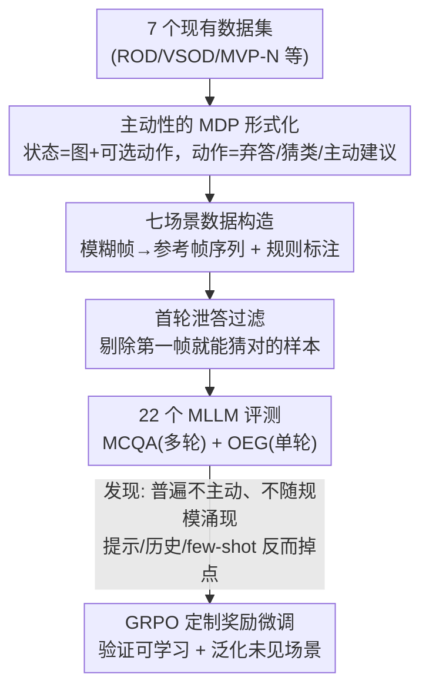

# ProactiveBench: Benchmarking Proactiveness in Multimodal Large Language Models

**会议**: ECCV 2026  
**arXiv**: [2603.19466](https://arxiv.org/abs/2603.19466)  
**代码**: [https://github.com/tdemin16/ProactiveBench](https://github.com/tdemin16/ProactiveBench)  
**领域**: 多模态VLM  
**关键词**: 多模态大模型, 主动性, Benchmark, 模糊查询, GRPO

## 一句话总结
本文提出 ProactiveBench——首个评测多模态大模型「主动性」的基准，把 7 个现有数据集改造成「初始画面模糊、需要用户干预才能答对」的多轮交互环境，评测 22 个 MLLM 后发现它们几乎都不会主动求助（要么弃答要么幻觉），且主动性不随模型规模涌现，但用 GRPO 加定制奖励微调可以让模型学会主动、并泛化到没见过的场景。

## 研究背景与动机
人类面对不完整或有歧义的信息时，会本能地提出假设、主动寻找线索、再修正判断——比如要辨认一个被挡住的物体，人会请旁边的人把遮挡物挪开。可当前的多模态大模型（MLLM）几乎只被放在「反应式（reactive）」的场景里研究：给一张图问一个问题，模型要么直接给答案，要么在答不出时选择弃答（abstain）。当图里的信息根本不足以回答时（比如问「蓝色积木后面是什么」而积木完全挡住了后面的物体），反应式模型只有两条路——凭空幻觉一个错误答案，或者干脆说「我不知道」。这两种行为都谈不上是好的协作者。

一个更理想的行为是「主动式（proactive）」：模型意识到当前视觉信息不够，于是主动建议用户做一个简单的干预动作（「能把积木往右挪一下吗」），拿到新的视觉线索后再作答。这件事之所以难，是因为模型自己没法在物理世界里行动，它只能通过自然语言把「该做什么」讲给用户，由用户去执行、再把新画面反馈回来。这种「知道自己不知道、并知道该请求什么帮助」的能力，此前从未被系统地度量过——现有 benchmark 全都假设问题是可回答的，少数涉及主动感知的工作也只在单张图上做微调、或只覆盖单一场景单轮对话，无法刻画「多轮交互中动作会带来实质性变化（视角/画质/时间戳都在变）」的完整图景。

本文属于典型的「空白填补型」工作：主动性此前没人做，一是缺乏标准化的评测协议，二是难以构造「一张画面到底对回答有没有信息量」这样的标注。作者的关键使能洞察是——很多现有数据集其实天然带有「从最难辨认到最易辨认」的帧序列结构（比如遮挡物逐帧移开、涂鸦逐笔增加），把它们「改造重用」就能低成本地自动生成主动性评测环境。**核心 idea：把 MLLM 的主动性形式化为一个马尔可夫决策过程——模型在「弃答 / 猜类别 / 建议一个能获取更多线索的干预动作」之间选择，用改造自 7 个数据集的多轮环境去度量它能否靠主动建议一步步走到正确答案；并进一步证明这种能力虽然没法靠提示或上下文轻易激发，却可以用带定制奖励的强化学习真正学会。**

## 方法详解

### 整体框架
ProactiveBench 不是一个方法，而是一套「评测协议 + 数据构造流水线 + 分析结论 + 一个可学习性验证」。它先给「主动性」下定义：模型要么给出正确答案，要么建议一个能让问题变得可回答的动作。评测分两种设定——**多选题问答（MCQA）**支持多轮、可控，是分析主力；**开放式生成（OEG）**不给选项、更贴近真实，但因动作未必在环境里可执行，限定为单轮。数据侧，作者挑了 7 个数据集各对应一类主动场景，通过基于规则的自动标注把它们拼成「初始模糊帧 → 中间帧 → 参考帧（信息完整）」的序列，再用一道过滤器剔除「第一帧就能猜对、根本不需要主动性」的样本。最后在 22 个 MLLM 上跑评测得出「模型普遍不主动」的结论，并用 GRPO 微调验证主动性可被学习且能泛化。

整个流程可以拆成「构造 → 评测 → 学习」三段，如下图：

### 关键设计

**1. 把主动性形式化为马尔可夫决策过程：让「求助」变成可评测的动作**

主动性最难的地方在于它不是一个静态问答，而是一串「观察—决策—环境变化」的交互，没有形式化就没法系统度量。作者借鉴「LLM 作为 agent」的思路，把每个样本建成一个有限 MDP $(\mathcal{S}, \mathcal{A}, \pi_\theta, R)$：状态 $s_t=\{I_t, A_t\}$ 由当前图像 $I_t$ 和当前可选动作集 $A_t$ 组成，策略 $\pi_\theta$ 就是被测的 MLLM，它在问题 $q$ 和状态 $s_t$ 条件下采样一个动作 $a_t \sim \pi_\theta(\cdot\mid q, s_t)$。动作集里既有「弃答」「四个候选类别（仅一个正确）」，也有若干「主动建议」（如「把遮挡物往左挪」）。关键在于状态转移规则：**只有选中主动建议才会让环境推进到 $s_{t+1}$**（换一张更清晰的图、给一组新动作）；一旦弃答或选错类别，评测立刻以「错误」终止；选对类别则以「成功」终止。每个环境能主动的次数有限（取决于数据集的帧数），用完仍没答对即判错。这套设计的巧妙之处是把「主动」和「作答」放进同一个动作空间里竞争，从而能干净地区分「模型是真的在用主动建议逼近答案，还是只是在瞎试」。

**2. 七场景数据集改造：用规则把现成数据变成主动性环境**

从零构造主动性数据既贵又要人工判断「一帧有没有信息量」。作者的做法是重用 7 个现有数据集，每个对应一类主动行为：ROD（挪开遮挡物看被挡物体）、VSOD（视频里等/倒放以避开时序遮挡）、MVP-N（旋转物体换个信息量更高的视角）、ImageNet-C（提升被损坏图像的画质）、QuickDraw（请用户补几笔涂鸦细节）、ChangeIt（请求过去/未来帧揭示关键动作）、MS-COCO（移动相机改变视角）。之所以能自动标注，是因为 ROD、MVP-N、QuickDraw、ImageNet-C 本身就把帧「从最难辨认排到最易辨认」——例如 ROD 每个样本 14 帧、中间帧遮挡最重，往两侧逐渐露出目标，于是直接取最难的那帧当初始输入即可；ChangeIt 取第一帧（通常没信息），COCO 则挑只含单个标注框的图并生成低 IoU 的困难裁剪。VSOD 缺类别标注，作者用 Google 图片识别名人姓名、识别失败的样本直接丢弃。全库共 10.8 万张图、1.8 万个样本、覆盖 19 种主动行为。这套「改造重用」思路让一个大规模、多样化的主动性基准得以低成本落地。

**3. 首轮泄答过滤：把「不靠主动也能答对」的样本剔干净**

一个隐患是：即便给的是最难辨认的帧，模型有时也能直接猜对（比如 ImageNet-C 里 55.3% 的样本第一帧就能被平均猜对），这些样本让模型「绕过用户干预」就拿分，会污染主动性的估计、还造成任务间难度不均。作者的过滤规则是：一个样本若在 MCQA 首轮被所有被测 MLLM 中至少 25% 猜对，就剔除。这个阈值在「删得够干净」和「保留足够样本量」之间取平衡。过滤后首轮平均准确率从 32.5% 骤降到 6.4%，意味着剩下的样本几乎必须靠主动建议才能答对；最终基准从原始 17,909 个样本收缩到 7,557 个。这一步是让「trajectory accuracy 真正只衡量主动性」的前提。

**4. 度量指标：轨迹准确率 + 主动建议率，把「有效主动」和「瞎主动」分开**

由于泄答样本已被过滤，作者用**轨迹准确率（acc）**衡量有意义的主动性，即「主动序列最终走到正确答案的比例」——它奖励的是「用主动建议逼近正确状态」，而非单纯多提建议。同时报告**主动建议率（psr）**，即模型平均请求了几次用户干预。对 OEG（单轮）则拆成两个指标：回答中包含正确类别的比例（cc）、包含有效主动建议的比例（ps），并用 LLM-as-judge（Qwen3-8B）判定，允许「换个视角」等同义改写算作有效。作者特别强调 MCQA 与 OEG 指标不可直接比大小——前者是轨迹末端的正确率，后者是首轮回答的命中率。这套指标的价值在于它能戳穿「假主动」：把有效主动建议替换成随机无效建议后，真主动的模型 psr 会大跌（如 LLaVA-OV-7B 相对下降 86%），而只是「不愿弃答、宁可乱选」的模型仍会去选那些随机建议，从而暴露它们并非真的主动。

### 损失函数 / 训练策略
验证「主动性能否被学会」时，作者用强化学习而非监督微调——因为「何时该建议、何时该直接答」需要密集的帧信息量标注，而这类标注普遍缺失。具体采用 **GRPO**：对每个「提示-图像」对采样 8 个回答，按规则给奖励——答对类别 $r_c=1$；给出有效主动建议 $r_p\in\{0.5, 0.75, 1.0\}$；其余 $r_w=0$。直觉是：只要把主动建议的奖励设得比答对类别低（$r_p < r_c$），模型就会学着优先直接作答、只在不确定时才回退到主动建议，从而同时兼顾效率（低 psr）和准确率。训练只用 QuickDraw 和 COCO 两个场景（覆盖抽象与自然图像、且留出其余场景测泛化），并限定为单轮交互、同时采样模糊帧和清晰帧，好让模型学会「哪些情况需要主动、哪些可以直接预测」。

## 实验关键数据

### 主实验
在 ProactiveBench 上评测 22 个开源/闭源 MLLM。核心结论：模型普遍缺乏主动性，且主动性不随规模单调增长。

| 设定 | 模型 | 关键指标 | 数值 | 说明 |
|------|------|---------|------|------|
| MCQA | GPT-4.1 | avg. acc | 30.9% | 闭源最佳之一，但 COCO 高达 94.4%，疑似训练数据污染 |
| MCQA | o4-mini | avg. acc | 34.0% | 开闭源综合最高 acc |
| MCQA | InternVL3-1B | avg. acc | 27.1% | 反超 InternVL3-8B 的 12.7%，规模越大反而越差 |
| MCQA | LLaVA-1.5-7B | avg. acc | 24.8% | 老模型反超更新更大的 LLaVA-OV-72B（13.0%） |
| MCQA | LLaVA-NeXT-Mistral-7B | avg. acc | 4.5% | 全场最差，倾向弃答 |
| 参考设定 | 全模型平均 | avg. acc | 79.8% | 直接给完整参考帧时能答对，说明差距源于缺主动性而非识别力 |

参考设定（直接喂信息完整的参考帧）下模型平均能答对 79.8%，但在需要主动的 ProactiveBench 上暴跌超过 60 个百分点；ROD 场景尤其惨烈——参考设定 98.3% vs. ProactiveBench 仅 8.2%。这直接证明模型「看得懂」但「不会主动求助」。

### 消融/分析实验
作者系统分析了各种「激发主动性」的手段，结论几乎都是负面的：

| 干预手段 | 对 psr 的影响 | 对 acc 的影响 | 结论 |
|---------|--------------|--------------|------|
| 加提示（hint） | +1.9（平均） | 25.8%，仅 +8.3% | 提示能催出更多建议，但 acc 不超随机选择，且 16.0% 情况下盲目狂选建议直到耗尽步数 |
| 加对话历史 | 0.5 → 1.8 | 下降约 7% | 历史里的过往主动建议诱导模型无脑重复，反而掉点 |
| few-shot（ICL） | ROD +1.6 / MVP-N +0.5（3-shot） | ROD 掉点、MVP-N 基本持平 | 上下文样本引入负偏置，模型倾向复制示例类别或狂选建议 |
| 替换为随机无效建议 | 真主动模型大跌（-60%~-90%） | — | 揭穿「假主动」：不掉的是「宁乱选也不弃答」而非真主动 |

GRPO 微调则是全篇唯一的正面结果：

| 模型 | 配置 | in-domain avg. acc | out-of-domain avg. acc | 说明 |
|------|------|-------------------|------------------------|------|
| Qwen2.5-VL-3B | original | ~7% | ~11% | 微调前 |
| Qwen2.5-VL-3B | $r_p=0.75$ | 46.2/49.4（QD/COCO） | 38.6 | 反超所有原始模型（含 o4-mini 34.0%），CIT 从 12.4%→55.6% |
| Qwen2.5-VL-3B | $r_p=1.0$ | — | 15.1 | 奖励设太高，过度狂发建议、几乎不作答，acc 崩 |
| LLaVA-NeXT-Mistral-7B | $r_p=0.5$ | 43.6/57.3 | 40.4 | 从全场最差（4.5%）跃升到 40%+ |

### 关键发现
- 主动性不是随规模涌现的属性：InternVL3-1B 反超 8B，LLaVA-1.5-7B 反超 LLaVA-OV-72B，底座 LLM 的影响甚至大过参数量（LLaVA-NeXT 用 Vicuna 的 acc 19.3% 远高于用 Mistral 的 4.5%，后者更爱弃答）。
- 「主动建议多」不等于「更主动」：把有效建议换成随机无效建议后，真主动的模型 psr 骤降，而 LLaVA-NeXT-Vicuna 反而从 37% 升到 49% 去选那些无效建议——它只是「不愿弃答、宁可乱猜」。有意义的主动性当且仅当模型用建议走到更好的状态、提升了 acc。
- 提示/历史/few-shot 三种免训练手段都会让模型「无脑狂发建议直到耗尽步数」，psr 上去了 acc 却掉了，说明当前 MLLM 没有内化「该主动才主动」的判断。
- GRPO 微调后主动性能泛化到没训练过的场景（只用 QD+COCO 训练，却在 ROD/VSOD/IN-C/CIT 上普遍涨点），但与参考设定仍有约 35 个百分点的差距（40.7% vs. 75.1%），说明离真正解决还很远。
- 奖励设计要 $r_p < r_c$：一旦把主动建议奖励设到和答对类别齐平（$r_p=1.0$），模型会过度生成建议、几乎不作答，acc 反而崩盘。

## 亮点与洞察
- 「改造重用现有数据集」的思路极具性价比：主动性数据最难的是标注「一帧有没有信息量」，作者发现 ROD/MVP-N/QuickDraw/ImageNet-C 天然带「从难到易」的帧序，直接取最难帧当初始输入就完成了标注，一举把 7 个不相关任务拼成统一的主动性环境。
- 用「随机无效建议替换」这一招巧妙戳穿「假主动」：只看 psr 会误以为某些模型很主动，替换后 psr 是否崩掉才能区分「真的在用建议逼近答案」还是「只是不愿弃答的瞎试」——这个探针可迁移到任何「agent 是否真的在做有效探索」的评测。
- 把主动性建成 MDP，让「弃答/猜类/主动建议」在同一动作空间竞争，加上首轮泄答过滤，使 trajectory accuracy 成为干净的主动性度量——这套「形式化 + 过滤 + 双指标」的组合可复用到其他「知道自己不知道」类能力的评测。
- 一个反直觉但重要的发现：对话历史和 in-context learning 在这里是负面的——过往主动建议会偏置模型无脑重复，提醒做交互式 agent 时不能想当然地认为「给更多上下文一定更好」。

## 局限与展望
- 作者承认即便 GRPO 微调后，与参考设定仍有约 35 个百分点的巨大差距，主动性远未被真正解决，只是给出了一个有希望的起点。
- 闭源模型（GPT/o4-mini）在 COCO 上异常高（约为其他模型的 3 倍），作者怀疑训练数据污染，但因数据闭源无法验证——这让闭源模型的 benchmark 数字可信度存疑。
- OEG 评测依赖 LLM-as-judge，虽用了较可靠的 Qwen3-8B，但「有效主动建议」的判定本身带主观性；且因算力限制 OEG 每场景只评 100 个样本，覆盖面有限。
- 训练只用了两个场景（QD+COCO）、且限定单轮，泛化虽好但训练设定较简化，多轮训练下的表现仍是开放问题。
- VSOD 用 Google 图片识别名人姓名来补类别标注，识别失败即丢弃，可能引入选择偏差；「有效主动建议」在 OEG 里靠 judge 灵活匹配同义改写，边界不够严格。

## 相关工作与启发
- **vs 主动感知类工作（ActiView / MLLMs know where to look）**: 它们也让模型主动寻找信息，但都在单张「本身可回答」的图上做修正/探索；本文在 7 个场景、多轮、动作会带来实质性变化（视角/画质/时间戳）的设定下评测，能更全面地分析失败案例和「假主动」。
- **vs Right this way [36]**: 该工作探讨 VLM 能否引导视障用户拍出更好的图，但只覆盖单一主动场景、单轮对话，且不度量建议的有效性；本文覆盖 7 场景、多轮，并显式衡量主动建议是否真的通向正确答案。
- **vs 主动视觉（active vision）经典工作**: 二者共享「主动观察者动态控制感知策略」的精神，但本文用真实世界多样场景的图像，且观察者以自然语言从 MLLM 获得反馈，构成人机协作，更贴近人机合作任务而非纯机器人系统。
- **vs 可靠 VQA / 弃答类工作**: 弃答类研究让模型「答不出就闭嘴」以避免答错；本文指出弃答只是消极下策，真正理想的是主动求助——并用实验证明「爱主动」的模型很多其实只是「不爱弃答」，把两种行为清晰地分了开。

## 评分
- 新颖性: ⭐⭐⭐⭐⭐ 首个系统评测 MLLM「主动求助」能力的基准，把此前无人形式化的能力做成了可度量、可训练的问题。
- 实验充分度: ⭐⭐⭐⭐⭐ 22 个模型、7 场景、MCQA+OEG 双设定，外加 hint/history/few-shot/随机建议/GRPO 五组分析，覆盖极全。
- 写作质量: ⭐⭐⭐⭐ 逻辑清晰、图表信息量大，MDP 形式化与「假主动」探针尤其漂亮；部分指标（cc/ps/psr）需反复对照才能理清。
- 价值: ⭐⭐⭐⭐⭐ 为「知道何时求助」的协作式多模态智能体指明方向，数据集开源，且证明了主动性可学、可泛化，后续研究价值高。

<!-- RELATED:START -->

## 相关论文

- [\[ICLR 2026\] HSSBench: Benchmarking Humanities and Social Sciences Ability for Multimodal Large Language Models](../../ICLR2026/multimodal_vlm/hssbench_benchmarking_humanities_and_social_sciences_ability_for_multimodal_larg.md)
- [\[CVPR 2026\] Venus: Benchmarking and Empowering Multimodal Large Language Models for Aesthetic Guidance and Cropping](../../CVPR2026/multimodal_vlm/venus_benchmarking_and_empowering_multimodal_large_language_models_for_aesthetic.md)
- [\[CVPR 2026\] GraphVLM: Benchmarking Vision Language Models for Multimodal Graph Learning](../../CVPR2026/multimodal_vlm/graphvlm_benchmark_vlm_graph_learning.md)
- [\[CVPR 2026\] OddGridBench: Exposing the Lack of Fine-Grained Visual Discrepancy Sensitivity in Multimodal Large Language Models](../../CVPR2026/multimodal_vlm/oddgridbench_exposing_the_lack_of_fine-grained_visual_discrepancy_sensitivity_in.md)
- [\[ECCV 2026\] Learning to Deny: Action Denial in Multimodal Large Language Models](learning_to_deny_action_denial_in_multimodal_large_language_models.md)

<!-- RELATED:END -->
