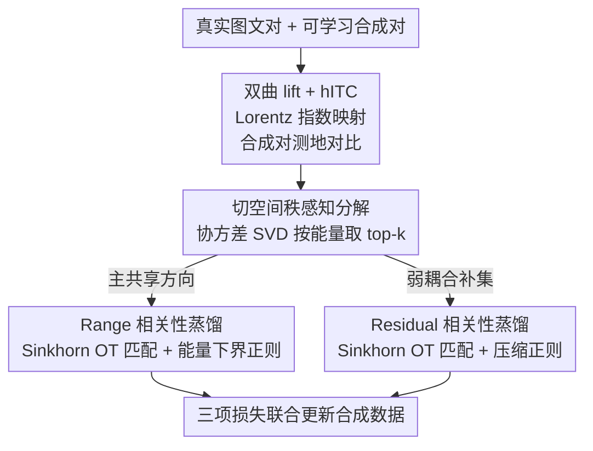

# Rank-Aware Hyperbolic Alignment for Vision–Language Dataset Distillation

**会议**: ECCV 2026  
**arXiv**: [2606.29464](https://arxiv.org/abs/2606.29464)  
**代码**: 有（Project Page，仓库链接见原文）  
**领域**: 多模态VLM / 数据集蒸馏  
**关键词**: 图文数据集蒸馏, 双曲几何, 秩感知对齐, 子空间分解, 最优传输

## 一句话总结
把图文特征 lift 到 Lorentz 双曲空间做对比对齐（hITC），再把真实批次图文协方差按累积能量 SVD 拆成 range（主共享方向）与 residual（弱耦合方向）两个子空间，分别用 Sinkhorn 最优传输匹配相关性分布并加非对称正则，从而在极限压缩预算下**只选择性对齐信息量大的共享结构**、放行模态私有多样性，取得更好的跨架构迁移与鲁棒性。

## 研究背景与动机
视觉-语言模型靠海量图文对 + 对比目标撑起来，但当配对数据从百万涨到十亿级，随之而来的隐私、授权、溯源与投毒风险越来越制约模型能怎么被构建、审计、分享和部署。数据集蒸馏（Dataset Distillation）提供了一条务实的出路：合成一小撮样本去逼近大数据集的训练信号，既省算力，又能在原始配对不便分享时充当可审计的替身。但把蒸馏从单模态推广到图文对更难——蒸出来的小集合不仅要保住模态内多样性，还得保住跨模态的相对排序结构（谁该被谁检索到）。现有 VLDD 方法大致三派：轨迹匹配（MTT-VL、LoRS、RepBlend）要存专家轨迹、成本高且继承教师架构偏差；生成式（EDGE）借扩散先验合成、却让出了对齐结构的直接控制权；分布统计匹配（CovMatch）高效地对齐跨模态二阶矩，但仍在欧氏空间里对**所有特征方向施加大体一致的对齐压力**。

问题恰恰出在这个「一视同仁」上。图文相关性往往是**低秩**的：一个紧凑的共享子空间承载了主导语义与粗粒度关系（这些方向确实该跨模态对齐），而剩下的方向构成一个弱相关的残差成分，吸收着模态特有线索、标注伪影与噪声变化。在预算极紧时，硬把残差方向也拉齐，反而会压掉互补信息、损害迁移。LoRS 虽然用低秩分解在**相似度层面**松了绑，却没有显式控制主导对齐的**容量与结构**该分给谁。另一条被忽视的线索是：多模态语义天然是层级的（实体→属性→关系），欧氏几何对这种嵌套结构几乎不提供归纳偏置，尤其当只有一小撮蒸馏样本要扛起训练信号时。

本文把这两点一并解决。**核心 idea：把图文表示 lift 到双曲空间以匹配其层级语义，再对真实批次的跨模态协方差做「range–residual」秩感知分解——只在能量主导的共享 range 子空间里强制测地对齐，同时正则残差子空间以保住模态私有多样性——从而显式控制「对齐什么、怎么对齐」，让有限的合成容量花在最该对齐的地方。**

## 方法详解

### 整体框架
RAHA 是一个**无需专家轨迹、几何感知**的图文蒸馏框架。输入是大规模真实图文对，输出是一小撮可微的合成图文对（图像是可学习像素张量，文本是可学习的输入层 token 嵌入 + 固定 mask）。训练时冻结预训练编码器，只用梯度更新合成数据本身。每一步蒸馏做两件事联合优化：一是在合成对上算**双曲对比损失 hITC**，维持合成集内部的图文可判别性；二是**秩感知相关性蒸馏**——把真实批次里观察到的跨模态相对排序结构，通过 range/residual 子空间分解 + 最优传输，迁移到合成集上。

具体流转是一条清晰的管线：投影特征先经指数映射 lift 到 Lorentz 双曲面（这一步定义 hITC），再经对数映射拉回原点切空间（在切空间里做线性代数才稳）；在切空间对真实批次算图文 cross-covariance 并 SVD，按累积能量阈值 ρ 自适应选出秩 k，把特征投影拆成 range 坐标与 residual 分量；两个子空间各自形成相似度矩阵、转成逐行相关性分布，用熵正则 Sinkhorn 求软耦合、算真实↔合成的匹配损失，再各配一个非对称能量正则。最终损失是三项：hITC、range、residual。

### 关键设计

**1. 双曲对比对齐 hITC：用负曲率几何承载图文的层级语义**

痛点直白：欧氏对比（点积/余弦 InfoNCE）把所有匹配对往一块拉、所有不匹配对推开，方向上没有偏好，也保不住「caption 比图像更抽象」这种层级落差。RAHA 的做法是把标准 InfoNCE 的相似度换成 Lorentz 双曲面上的**测地距离**。选双曲空间的直觉，不是说图文数据真是棵树，而是负曲率几何能让泛化概念自然靠近原点、具体实例向外散开（呼应 MERU 的观察：文本概念常比图像更泛化），从而以低失真容纳这种粗到细的嵌套关系——这是欧氏几何给不了的归纳偏置。

机制上，先把投影特征 $z^v,z^t$ 经指数映射（含 $\sinh$ 的径向缩放）lift 到双曲面得到 $h^v,h^t$（曲率 $c$、尺度 $s$ 控制形变，$c\to 0$ 时退回欧氏）。两点间测地距离由 Lorentzian 内积 $\langle u,v\rangle_{\mathcal L}=-u_0v_0+\bar u^\top\bar v$ 给出：

$$d_c(u,v)=\tfrac{1}{\sqrt c}\,\mathrm{arcosh}\!\big(-c\,\langle u,v\rangle_{\mathcal L}\big)$$

把 logits 取成负测地距离除以温度 $\tau=0.07$，再做双向对称交叉熵，就是 hITC 损失 $\mathcal L_{\mathrm{hITC}}$（只在合成对上算，不碰真实数据）。消融里它单独就是一个强 baseline，说明「测地 InfoNCE」本身已能蒸出可检索的对齐。

**2. Range–Residual 秩感知子空间分解：把「该对齐的」和「该放行的」方向拆开**

这是 rank-aware 的核心，直接针对「欧氏方法一视同仁地对齐所有方向」的痛点。先把双曲面特征经对数映射拉回原点切空间（切空间才好做线性代数），对真实批次算图文 cross-covariance $C_{\mathrm{real}}\in\mathbb R^{d\times d}$，其每个奇异值 $\sigma_i$ 度量该方向上的跨模态耦合强度。关键是**不手工定秩**，而是选累积平方能量首次达到阈值 $\rho$（默认 0.95）的最小 $k$：

$$k=\min\Big\{k':\ \tfrac{\sum_{i=1}^{k'}\sigma_i^2}{\sum_{i=1}^{d}\sigma_i^2}\ge\rho\Big\}$$

前 $k$ 个左右奇异向量 $U_k,V_k$ 张成 **range**（图/文两侧的主耦合方向），把切特征投上去得 range 坐标；从原特征里减掉 range 投影得 **residual** 分量。这套基由真实批次算出、同时复用到真实与合成特征上。为什么这样有效：range 承载最稳的检索信号，residual 装的是低能量、不稳、模态私有的东西——在预算极紧时把两者分开处理，才能把宝贵的合成容量优先花在共享结构上，而不是被弱相关方向稀释。作者还专门验证：$\rho=0.95$ 最优，取 1.0 会因吸入低能量残差尾而掉点；选出的秩随迭代稳定在数据集相关的界内，并非简单顶到代数上限 $\mathrm{rank}(C_{\mathrm{real}})\le B-1$。

**3. 基于 Sinkhorn OT 的相关性蒸馏 + 非对称子空间正则：把真实的相对排序搬到合成集**

hITC 只保证「每个合成对内部对齐」，搬不动真实数据里的**相对排序**结构。RAHA 对 range 和 residual 各自形成跨模态相似度矩阵、按相关性温度 $\tau_r$ 转成逐行概率分布（真实侧作 stop-gradient 目标）。由于合成行与真实行没有预设的一一对应，用 KL 散度堆出代价矩阵 $\Gamma$，再解一个熵正则最优传输得软耦合 $T$（Sinkhorn–Knopp 迭代），传输加权代价即单向匹配损失，双向平均得 $\mathcal L_{\mathrm{match}}$。这一步的巧处在于用「集合层面的软匹配」绕开了「哪个合成样本对应哪个真实样本」的伪对应问题。

两个子空间的正则是**非对称**的、方向相反，正是「选择性对齐」的落点。Range 侧加**能量下界正则**：只在合成能量低于真实时惩罚，逼合成集在 top-k 子空间至少保住和真实一样多的耦合能量、防止主共享成分塌缩：

$$\mathcal L_{\mathrm{reg}}^{\mathrm{range}}=\frac{\max(0,\ e_{\mathrm{real}}-e_{\mathrm{syn}})}{e_{\mathrm{real}}+\epsilon}$$

Residual 侧反过来加**压缩正则**：令残差能量占比 $r=e_{\mathrm{res}}/(e_{\mathrm{syn}}+\epsilon)$，用 $\mathcal L_{\mathrm{reg}}^{\mathrm{residual}}=r+\max(0,\,r-1)$——第一项持续把 $r$ 往零压，第二项在残差能量超过 range 能量（$r>1$）时额外加罚。一句话：range「保底不许塌」，residual「够用即压」，这正对应「主共享结构要保、弱耦合方向别喧宾夺主」的设计目标。消融显示 residual 单独用很弱、必须锚在 range 上并受压缩约束才有效。

### 损失函数 / 训练策略
总损失把三项加权求和：$\mathcal L_{\mathrm{total}}=\mathcal L_{\mathrm{hITC}}+\lambda_{\mathrm{range}}\mathcal L_{\mathrm{range}}+\lambda_{\mathrm{residual}}\mathcal L_{\mathrm{residual}}$，其中 range 损失 = 匹配 + 能量下界正则，residual 损失 = 匹配 + $\lambda_{\mathrm{comp}}$·压缩正则。默认 $\lambda_{\mathrm{range}}=0.8$、$\lambda_{\mathrm{residual}}=0.4$、$\lambda_{\mathrm{comp}}=0.1$，曲率 $c=1$、尺度 $s=1$、$\tau=\tau_r=0.07$、$\rho=0.95$、Sinkhorn $\varepsilon=0.05$ 迭代 20 次。训练遵循 CovMatch 的**在线蒸馏协议**：只更新合成参数，编码器每轮从预训练权重重置；外循环（默认 50 步）在合成通路上做梯度更新，内循环（默认 1 步）在真实数据上小步更新编码器，让代理模型的隐空间几何缓慢漂移、逼合成数据跨编码器配置泛化。数值上对可能病态的 SVD 加 jitter，并对 Sinkhorn 代价矩阵按均值归一化以稳定有效正则强度。

## 实验关键数据

### 主实验
三个图文检索基准（Flickr8k / Flickr30k / COCO，Karpathy 划分），网络为 NFNet + BERT，蒸馏预算 N∈{100,200,500} 属强压缩（N=100 不到 COCO 训练图的 1%）。指标为双向 Recall@{1,5,10} 的均值（IR/TR/Mean）。下表摘 Mean（IR+TR 平均）几组代表性对比：

| 数据集 / 预算 | Random | LoRS | CovMatch | RAHA(本文) | 说明 |
|--------------|--------|------|----------|-----------|------|
| Flickr8k / 100 | 5.7 | 9.4 | 20.4 | 20.4 | 最小预算与 CovMatch 打平 |
| Flickr8k / 500 | 15.4 | 13.5 | 25.9 | **30.7** | 预算增大后明显反超 |
| Flickr30k / 100 | 8.6 | 10.2 | 22.8 | 20.7 | 小预算略逊 CovMatch |
| Flickr30k / 500 | 22.6 | 10.9 | 28.9 | **32.9** | 大预算领先 |
| COCO / 200 | 5.6 | 1.7 | 8.3 | **10.2** | 反超 |
| COCO / 500 | 10.1 | 4.8 | 11.2 | **13.7** | 反超 |

作者诚实地给出结论：RAHA 在 100 对时与最强分布匹配 baseline CovMatch **打平**，在 200/500 对全面反超；不宣称在每个极限压缩格子都碾压。附录进一步在更大预算（1000 对）与更大更噪的 CC3M-595K-LLaVA（500 对 Mean 5.1→8.1）上验证优势随容量放大，并在 1000 对上全面超过生成式基线 EDGE。原因也说清了：数据集尺度的语义能被分解成 range/residual 基，但样本太少时**填不满**这些语义模式，故极小预算下 MTT 式方法仍可能占优；预算一涨，RAHA 才把这些模式「物化」出来。

### 消融实验
以 Flickr8k N=100（Mean=20.4 为满配）为例：

| 配置 | 关键指标(Mean) | 说明 |
|------|---------------|------|
| Full model | 20.4 | 完整模型（hITC+range+residual+正则） |
| 仅 hITC | 较强 | 测地 InfoNCE 本身已是强 baseline（Fig.2） |
| hITC + range | 单组件最大提升 | range 是跨模态耦合的主载体 |
| 仅 residual | 更弱 | 不锚在 range 上难可靠匹配 |
| 全欧氏（eITC+欧氏匹配） | 1.4/3.0/2.2 | 子空间分解在欧氏空间几乎失效 |
| 欧氏 ITC + 双曲匹配(eITC) | 18.1/21.7/19.9 | 恢复大部分性能 |
| 全双曲(hITC) | 19.0/21.9/20.4 | 再提一档 |

### 关键发现
- **贡献最大的是 range 分支**：从 hITC 出发加 range 项带来最大单组件提升，印证 range 子空间是跨模态耦合的主载体；residual 单用很弱，必须锚在 range 上、并受压缩正则约束才有增益——「residual 要被显式控制，而非独立优化」。
- **双曲 lift 是子空间分解生效的必要条件**：Fig.A6(d) 的几何消融最有说服力——把对比与匹配都放欧氏空间，同样的 Sinkhorn 管线只得 2.2 Mean；仅把匹配搬到双曲（eITC）即回升到 19.9，全双曲(hITC)到 20.4。可见增益不来自某个标量权重或单个损失项，而来自「选择性 range–residual 监督 × 双曲几何」的相互作用。
- **跨架构与鲁棒性是 RAHA 真正拉开差距的地方**（Table 5，Flickr8k）：N=200 时平均迁移从 7.2 提到 8.7、且对 BERT/DistilBERT 与多种视觉骨干一致；N=500 迁移达 12.7 vs CovMatch 8.7。这支持其设计意图——在秩自适应共享 range 里蒸相关性、同时调控残差，能减少对单一编码器几何的过拟合。
- **鲁棒性并非在最高预算下一致改善**：迁移随 N 强增，但鲁棒性在最高预算未必更好；作者如实指出这一非单调趋势。
- **定性上更干净**：CovMatch 蒸出的图常带高频斑纹/带状伪影（靠结构化噪声满足二阶对齐），RAHA 纹理更干净、边缘更自然，且更少把 caption 漂移到错误场景；在细粒度分类（CUB +1.9pp、Cars +2.17pp）上双曲层级偏置最受益。
- **代价诚实交代**：每步蒸馏比 CovMatch 贵（batch=64 时约 400s vs 55s，瓶颈在 d×d 协方差 SVD 与 Sinkhorn，随批量而非样本数增长；峰值显存两者相当约 9.3GB）。但作者强调这是**一次性离线成本**，且省掉了轨迹匹配约 18GB 的专家 checkpoint 存储，可用截断/随机 SVD、缓存基、warm-start Sinkhorn 等优化。

## 亮点与洞察
- **把「对齐容量的分配」显式变成一个可优化的几何问题**：range 保底不塌 + residual 够用即压这对方向相反的非对称正则，是全文最巧的一笔——它把「哪些方向该对齐、哪些该放行」从隐式副产品变成显式设计旋钮，比 LoRS 只在相似度层面松绑更进一步。
- **自适应秩选择而非手工设 k**：按累积能量阈值 ρ 定秩，让秩随数据/批次自适应且实测稳定，避开了低秩方法最烦的超参。这个「能量阈值定秩」的 trick 可迁移到任何需要区分主导/残差子空间的表示学习场景。
- **用双曲几何解释「模态 gap 不是纯错位」**：允许结构化的径向模态落差（文本更泛化→更靠原点），把 gap 当抽象层级差而非需消除的误差——附录 Fig.A5 用「径向差 Δr ≤ 匹配对双曲距离」的三角不等式直接诊断匹配对是否落在相容语义深度，是很干净的几何证据。
- **可复用范式**：「lift 到双曲 → 拉回切空间做线性代数（SVD/投影）→ 结果再进对齐目标」这条 round-trip，为「想用非欧几何但又离不开线性代数工具」的任务提供了一个可搬的模板。

## 局限与展望
- **计算开销偏大**：每步蒸馏比欧氏统计匹配贵近一个量级（SVD + Sinkhorn 随批量放大），虽是一次性离线成本，但作者也承认需靠截断/随机 SVD、缓存基、warm-start Sinkhorn 才能压下来——目前是「结构感知」换来的代价。
- **依赖层级结构假设**：RAHA 的秩感知先验最适合「共享信号集中在主导子空间」的数据；若有用信号散布在很多弱方向上，过度压缩残差会误删任务相关信息，弱层级数据集收益有限（作者明确列为局限）。
- **受限于教师编码器**：与所有多模态蒸馏一样，性能被预训练编码器的表达力封顶，域漂移/噪声 caption 下会退化。
- **极小预算并非最优**：100 对时只与 CovMatch 打平甚至在 Flickr30k 略逊，「样本太少填不满分解结构」是真实短板——优势要到 200+ 对才显现。
- **公平性无保证**：range 保留主导方向，若有害相关性恰落在主导奇异方向就会被一并保留；作者把「结构感知蒸馏 + 显式偏见审计」列为未来方向。

## 相关工作与启发
- **vs CovMatch（最强分布匹配基线）**: 都走无轨迹的分布匹配、都联合训练文本编码器，但 CovMatch 在欧氏空间直接对齐 cross-covariance 与特征统计、对所有方向压力大体一致，极小预算最有效；RAHA 改成双曲空间 + range/residual 分解后**逐行相关性分布**匹配，显式控制对齐容量分配。代价是更慢，回报是更好的迁移/鲁棒与更干净的合成图，且预算越大越占优。
- **vs LoRS（低秩相似度）**: LoRS 也认识到图文相关性低秩，但只在**相似度矩阵层面**做低秩分解、不显式区分主导共享方向与弱残差方向、也无几何/层级偏置；RAHA 把低秩思想搬进**表示空间的子空间分解**并配双曲几何，控制的是对齐结构本身而非相似度数值。
- **vs MTT-VL / RepBlend（轨迹匹配）**: 它们靠匹配训练轨迹、需存专家 checkpoint（约 18GB）且继承教师架构偏差；RAHA 无轨迹、省存储，且在中大预算反超。RepBlend 解模态塌缩的思路与 RAHA 正交，原则上可组合。
- **vs EDGE（生成式）**: EDGE 用 Stable Diffusion 先验合成图 + 生成离散 caption，让出对齐结构的直接控制换可扩展性；RAHA 不依赖预训练生成模型、聚焦检索相关的共享结构，1000 对上三数据集全面超过 EDGE。
- **vs HDD / MERU 等双曲工作**: HDD 做单模态双曲质心匹配、MERU 揭示 Lorentz 上的可解释径向布局；RAHA 首次在双曲空间内引入显式 range–residual 分解，把「选择性对齐共享方向 + 抑制信息贫乏残差」用于极限压缩下的图文蒸馏。

## 评分
- 新颖性: ⭐⭐⭐⭐⭐ 双曲几何 + 秩感知 range/residual 分解 + 非对称正则三者组合，首次把「对齐容量分配」做成显式可优化目标，切入角度新。
- 实验充分度: ⭐⭐⭐⭐ 三基准×多预算 + 跨架构/鲁棒/分类/成本/复现性分析都覆盖，几何消融尤其干净；但小预算不占优、且用的是 NFNet+BERT 经典配置而非更强 VLM。
- 写作质量: ⭐⭐⭐⭐⭐ 动机（低秩+层级双线索）与设计对应清晰，附录对 range/residual 反向正则、双曲 round-trip、成本与复现性都交代得很诚实。
- 价值: ⭐⭐⭐⭐ 为数据高效/可审计的 VLM 训练提供一条几何感知路线，「能量阈值定秩 + 主导/残差反向正则」可迁移；但计算开销与「需强层级结构」限制了普适性。

<!-- RELATED:START -->

## 相关论文

- [\[CVPR 2026\] Hyperbolic Gramian Volumes for Multimodal Alignment](../../CVPR2026/multimodal_vlm/hyperbolic_gramian_volumes_for_multimodal_alignment.md)
- [\[CVPR 2026\] Multimodal Distribution Matching for Vision-Language Dataset Distillation](../../CVPR2026/multimodal_vlm/multimodal_distribution_matching_for_vision-language_dataset_distillation.md)
- [\[ICML 2026\] Hyper-ICL: Attention Calibration with Hyperbolic Anchor Distillation for Multimodal ICL](../../ICML2026/multimodal_vlm/hyper-icl_attention_calibration_with_hyperbolic_anchor_distillation_for_multimod.md)
- [\[ICLR 2026\] Multimodal Dataset Distillation via Phased Teacher Models](../../ICLR2026/multimodal_vlm/multimodal_dataset_distillation_via_phased_teacher_models.md)
- [\[CVPR 2026\] Uncertainty-guided Compositional Alignment with Part-to-Whole Semantic Representativeness in Hyperbolic Vision-Language Models](../../CVPR2026/multimodal_vlm/uncertainty-guided_compositional_alignment_with_part-to-whole_semantic_represent.md)

<!-- RELATED:END -->
