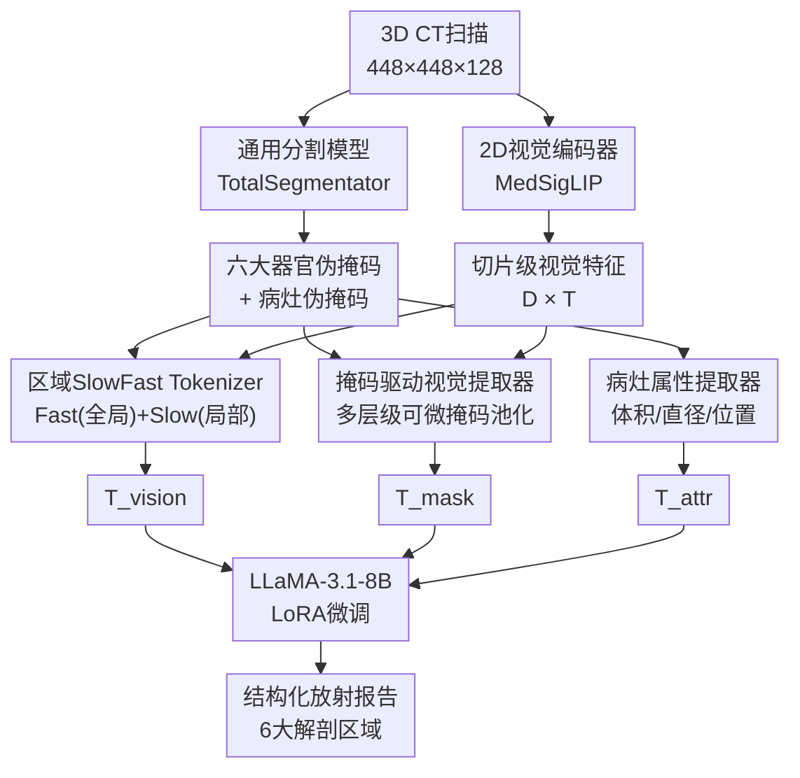

# MedRegion-CT: Region-Aware Multimodal Large Language Model via SlowFast Tokenization and Pseudo-Mask Guidance for 3D CT Report Generation

**会议**: ECCV 2026  
**arXiv**: [2506.23102](https://arxiv.org/abs/2506.23102)  
**代码**: [https://github.com/babbu3682/MedRegion-CT](https://github.com/babbu3682/MedRegion-CT)  
**领域**: 多模态VLM  
**关键词**: CT报告生成, 区域感知视觉编码, SlowFast表征, 掩码引导, 多模态大语言模型

## 一句话总结
MedRegion-CT 提出一套区域感知的 3D CT 报告生成框架，通过区域 SlowFast Tokenizer、掩码驱动视觉提取器和病灶属性文本编码三个模块，将放射科医生的层级化诊断流程显式建模到 MLLM 中，在结构化胸部 CT 报告生成基准上达到 SOTA。

## 研究背景与动机

CT 报告生成一直是医学影像分析的关键难题——一份完整的放射学报告需要覆盖多个解剖区域的异常发现，且每个区域的病变特征（大小、形态、位置）都直接影响临床诊断。近年来，3D 医学多模态大语言模型（如 RadFM、M3D、Med3DVLM 等）展现出将 CT 影像与临床语言联合推理的能力，在报告生成和视觉问答上取得了显著进展。然而，现有方法几乎全部依赖全局体积级别的特征表征：要么用 3D ViT 加 Token 压缩降低计算量，要么切片级 2D 编码加帧间聚合。这两种思路本质上都把整个 CT 体积压成一个"扁平"的整体特征，难以捕捉特定解剖区域的病理细节。以全局平均池化或均匀间隔采样的方式处理切片，还可能把关键器官区域的细粒度信息稀释在大量背景空片中。

放射科医生在实际阅片时遵循一套明确的层级化工作流：首先快速扫查所有切片获得全局概览，然后针对重点器官区域进行精细分析，最后结合病变的定量属性（体积、最大径、空间位置）做出诊断判断。这套流程天然是"粗到细"的——从全局到局部再到定量，每一步都有明确的解剖学锚点。当前 MLLM 的"全局压扁"式表征与此形成根本性矛盾：模型没有机制去关注哪个解剖区域正在被描述，也没有手段感知病变的具体几何属性。一些工作尝试用物体检测或边界框标注来引入区域感知能力，但在 3D CT 上标注成本极高，且依赖人工标注的细粒度定位信号。

本文的核心思路是：既然万能的通用分割模型（如 TotalSegmentator）可以零样本地从 CT 中分割出六大主要器官和常见病灶的伪掩码，那么这些掩码本身就可以作为"区域引导信号"，让模型在视觉编码阶段就聚焦在临床相关的解剖位置上。**核心 idea：构建一个完整的区域感知管线——先用 Region-based SlowFast Tokenizer 将注意力锚定在器官区域上（Fast 路径提供全局结构、Slow 路径保留局部细节），再用 Mask-Driven Visual Extractor 通过多层级掩码池化生成器官级的紧凑表征，最后用 Lesion Attribute Extractor 将病灶的体积、最大径和位置等定量属性编码为结构化文本提示注入 LLM，使报告生成同时具备区域定位精度和临床定量准确度。**

## 方法详解

MedRegion-CT 的整体架构如图 2 所示，核心是将传统放射科"粗到细"的诊断流程拆解为三个并行的视觉/属性信息提取通道，再统一馈入 LLM 生成结构化报告。

### 整体框架

输入为 3D CT 体积（448×448×128），首先经过通用分割模型 TotalSegmentator 生成六个主要解剖区域（肺实质、大气道、纵隔、心脏与大血管、腹部脏器、骨骼肌肉系统）和四种常见病灶（肺结节、胸腔积液、心包积液、肾囊肿）的伪二值掩码。与此同时，CT 切片逐帧经过预训练的 2D 视觉编码器 MedSigLIP 提取切片级特征。

视觉特征与器官/病灶掩码随后进入三条并行处理通路：
1. **Region-based SlowFast Tokenizer** — 以器官掩码为引导，从切片特征中并行提取全局 Fast Token 和局部 Slow Token，拼接后得到区域感知的 3D 视觉表征 $T_{vision}$；
2. **Mask-Driven Visual Extractor** — 从 MedSigLIP 的多层特征中，用器官伪掩码通过可微掩码池化提取每个器官的紧凑表征 $T_{mask}$；
3. **Lesion Attribute Extractor** — 对病灶伪掩码进行确定性几何计算（体积、最大径、位置），将结果编码为结构化文本提示 $T_{attr}$。

最后，三者与指令提示拼接后送入 LLaMA-3.1-8B（LoRA 微调），生成按六大解剖区域组织的结构化放射报告。

### 关键设计

**1. 区域感知 SlowFast Tokenizer：用器官掩码锚定视觉编码的双路径策略**

现有 3D MLLM 的视觉编码要么使用 3D ViT 加 Token 压缩（牺牲细粒度），要么在切片级 2D 特征上做帧间聚合（丢失深度维度上的空间关系）。更关键的问题是，常规 SlowFast 策略 [LITA, SlowFast-LLaVA] 对所有切片一视同仁地均匀采样——但 CT 中大量切片不含任何器官（如扫描范围超出身体部分），这些空片的特征只会稀释有效信息。

本文的改进是将器官伪掩码直接嵌入 Token 化过程。给定切片 $i$ 的第 $j$ 个空间 Token 特征 $f(i,j)$ 和来自器官掩码的指示变量 $m(i,j) \in \{0,1\}$，Fast 路径只保留掩码激活的切片（$\sum_j m(i,j) > 0$），对该切片所有空间 Token 做全局平局池化（kernel = T），得到单 token/切片的全局轮廓表征。Slow 路径则更进一步：只从掩码标注的器官区域内取 Token，用 2×2 核做空间池化，保留局部纹理细节——这相当于在 Token 压缩时天然做了"器官注意力掩码"。两条路径的输出拼接后送入 LLM。由于丢弃了背景空片和非器官区域，序列长度从 $D \times T$ 降至可控的几百 Token，且每个 Token 都携带明确的解剖位置含义。

**2. 掩码驱动视觉提取器：多层级跨尺度掩码池化的器官编码**

单纯的 SlowFast Token 提供的是以切片为单位的稀疏采样，难以覆盖完整的器官区域。本文受 Osprey 框架启发，设计了一个面向 3D CT 的体积掩码池化机制，从 MedSigLIP 的第 6、12、18、24 层分别提取多尺度特征，在每层上用器官伪掩码做可微加权平均池化（将掩码通过三线性插值对齐到特征图分辨率），每个器官 $o$ 在第 $l$ 层得到一个掩码 Token $k_l(o)$。各层的 $k_l(o)$ 分别经过独立的线性投影器 $\phi_l$ 后再逐元素相加，最后经过一个共享投影器 $\psi$ 映射到 LLM 嵌入空间，得到每个器官一个 Token 的紧凑表征 $T_{mask}$。这个设计的关键在于：（1）多层级特征兼顾了器官的精细边缘和高层语义；（2）每个器官只用一个 Token 表示（共 6 个器官 Token），对 LLM 上下文长度几乎无负担；（3）这些 Token 通过 `<region>` 特殊 Token 插入 LLM 的固定位置，让模型在生成每个器官段落时都能直接"看到"该器官的视觉信息。

**3. 病灶属性文本化编码：确定性几何计算与结构化文本注入**

3D CT 在编码过程中往往经过大幅下采样或裁剪，导致精细的形态学细节丢失。即使视觉 Token 包含区域信息，也难以精确表达"这个肺结节的体积是 3.2 mL、最大径 18 mm、位于右肺上叶"这类定量临床特征。本文的做法是将病灶伪掩码从 TotalSegmentator 的输出中分离出来，在体素空间上做确定性算法计算：先取病灶掩码与解剖引导区域（如右肺上叶）的交集，用最大连通分量过滤分割噪声，再分别计算绝对体积 $V = (\sum \mathcal{M}_{target}) \times (s_x s_y s_z) / 10^3$ 和包围盒的最大径 $d_{max} = \max_{i \in \{x,y,z\}} (L_i \times s_i)$。这些属性被组装成结构化自然语言文本，如"A nodule with a diameter of 18.0 mm and a volume of 3.2 mL is identified in the right upper lobe."，作为属性 Token $T_{attr}$ 输入 LLM。这种"确定性几何计算 + 文本化"的范式比让网络从视觉特征隐式预测病灶属性更可靠、可解释，也天然不受视觉编码器分辨率的下界限制——只要分割模型检出了病灶，几何计算就是在全分辨率体素空间上进行的。

### 损失函数 / 训练策略

训练采用两阶段 LoRA 微调。第一阶段冻结视觉编码器和 LLM，只训练多模态连接器和掩码投影器，在原始图像-报告对上预对齐 6 个 epoch（lr=1e-3, batch=48）。第二阶段解冻 LLM，以结构化区域报告为目标微调所有可训练模块 6 个 epoch（lr=2e-5, batch=48）。训练使用 AdamW 优化器，ZeRO stage 3 分布式策略，A100 80GB GPU。视觉编码器采用 MedSigLIP（已在百万级 CT 切片-报告对上预训练），LLM 为 LLaMA-3.1-8B，LoRA rank=128, alpha=256。

## 实验关键数据

### 主实验

| 数据集 | 指标 | RadFM | M3D | MedM-VL | Med3DVLM | CT-CHAT | **MedRegion-CT** |
|--------|------|-------|-----|---------|----------|---------|-----------------|
| RadGenome | BLEU | 0.3153 | 0.3177 | 0.3026 | 0.3269 | 0.3081 | **0.3435** |
| (内部) | ROUGE | 0.3732 | 0.3973 | 0.3854 | 0.3991 | 0.3900 | **0.4225** |
| | METEOR | 0.4894 | 0.4938 | 0.4811 | 0.5029 | 0.4831 | **0.5205** |
| | GREEN | 0.3030 | 0.4013 | 0.3970 | 0.3881 | 0.3966 | **0.4555** |
| | CRG | 0.3477 | 0.3717 | 0.3426 | 0.3866 | 0.3425 | **0.3959** |
| | GPT-CA | 0.2852 | 0.3586 | 0.3168 | 0.3733 | 0.3265 | **0.4003** |
| AMC | GREEN | 0.0977 | 0.1102 | 0.1115 | 0.1138 | 0.1138 | **0.1572** |
| (零样本) | CRG | 0.3476 | 0.3725 | 0.3472 | 0.3791 | 0.3487 | **0.3822** |
| | GPT-CA | 0.2018 | 0.2243 | 0.1963 | 0.2366 | 0.2053 | **0.2642** |

### 消融实验

| 配置 | BLEU | GREEN | CRG | 说明 |
|------|------|-------|-----|------|
| Full (RR+Attr+Mask) | **0.3273** | **0.4025** | **0.3861** | 完整模型 |
| w/o Mask (RR+Attr) | 0.3271 | 0.4010 | 0.3846 | 去掉掩码提取器影响很小 |
| w/o Attr (RR+Mask) | 0.3248 | 0.3937 | 0.3699 | 去掉属性编码后临床指标下降明显 |
| RR only | 0.3152 | 0.3930 | 0.3613 | 仅 SlowFast Tokenizer |
| M3D encoder 替代 | 0.3148 | 0.4009 | 0.3487 | 用预训练 3D ViT 替换 RR |
| LITA encoder 替代 | 0.3106 | 0.3880 | 0.3562 | 用常规 SlowFast 替换 RR |

### 关键发现

- 三个模块对最终性能都有正向贡献，其中 Mask 和 Attr 提供互补收益：Attr 对临床指标（GREEN、CRG、GPT-CA）的提升更显著，Mask 在零样本泛化上稍有优势。
- 与直接用预训练 3D ViT（M3D encoder）或常规 SlowFast（LITA encoder）相比，本文的区域感知 SlowFast Tokenizer（RR）在临床指标上明显更优，说明器官掩码引导的 Token 化策略确实有助于保留诊断关键信息。
- 分割噪声压力测试显示：扭曲器官掩码比扭曲病灶掩码造成更大的性能下降，因为器官掩码同时服务于 SlowFast Tokenizer 和 Mask-Driven Visual Extractor 两个模块，而病灶掩码仅用于属性提取。
- 按病灶大小分层分析发现，本文在中小尺寸（>5mm³）结节的检测率上大幅超过基线，但对极小结节（≤5mm³）的检测率反而低于基线——这是因为上游 TotalSegmentator 在 160 例微小结节中漏检了 110 例，性能下界受限于分割模型。
- 放射科医生盲审研究（50 例随机采样，1-10 分制）中，本文得到 6.98 ± 1.41，远超第二名 Med3DVLM 的 4.44 ± 2.01，证明了在跨机构场景下的实际临床可信度。

## 亮点与洞察

- **放射科工作流的显式建模**：本文最大胆也最巧妙之处在于——不试图让 MLLM 从全局特征中"隐式学出"区域感知能力，而是直接仿照医生阅片的层级化流程（全局概览→区域精细分析→定量属性），用三个并行的模块分别承担对应功能。这种"拟人化流程建模"思路本身就降低了 MLLM 的学习负担。
- **伪掩码的多角色复用**：TotalSegmentator 输出的一套器官/病灶伪掩码在三个模块中被重复用了三次——引导 SlowFast Tokenizer 的 Token 选择、作为 Mask Pooling 的权重、作为属性提取的输入。一套分割结果驱动整条管线，设计极为简洁且高效。
- **确定性几何计算替代隐式学习**：病灶体积和最大径没有让网络学，而是直接在体素空间用确定性算法算出、转成文本输入。这种"能算就不学"的思路保证了定量信息的精度和可解释性，且完全不受视觉编码器分辨率的下界约束——只要分割模型检出了病灶，几何计算就在全分辨率上进行。
- **结构化报告的构建本身也是贡献**：论文用 DSPy + Llama-3.3-70B 将非结构化的 RadGenome 报告自动重整为六大区域的标准化格式并公开为基准，这个 NLP 管线对后续 3D CT 报告生成研究有持续价值。

## 局限与展望

- 性能上界受限于上游分割模型：极小结节的漏检率和器官掩码的质量直接影响整体效果。这提示未来方向可以是分割模型与报告生成模型的联合训练或端到端优化，而不是两阶段管线。
- 当前仅在胸部 CT 上验证，器官和病灶类型受 TotalSegmentator 的标签空间限制。框架设计是模型无关的，理论上通过替换分割骨干可以推广到全身 CT 或 MRI，但需要验证。
- SlowFast Tokenizer 中 Slow 路径的 stride-2 池化仍然可能在局部区域丢失一些超细粒度纹理特征，尤其是对于肺间质病变等需要高分辨率观察的场景。
- LLM 部分只用了 8B 参数模型，随着医学领域更大规模 MLLM 的出现，性能可能还有提升空间。

## 相关工作与启发

- **vs M3D / RadFM / Med3DVLM**：这些方法都采用全局体积级编码（3D ViT + token 压缩或切片级 2D 编码 + 帧间聚合），用统一的池化/压缩操作处理所有空间位置。本文的关键区别在于引入器官伪掩码作为空间引导，让模型只在临床相关区域上分配视觉容量，从根本上改变了"均匀对待所有体素"的范式。
- **vs 常规 SlowFast（LITA / SlowFast-LLaVA）**：常规 SlowFast 对所有切片均匀采样，Fast 路径用全局平均池化处理所有切片、Slow 路径在均匀间隔的子集上密集采样。本文的版本用器官掩码动态决定 Fast 路径保留哪些切片、Slow 路径在哪些空间位置采样，实现了患者特异性而非固定步长的 Token 化。
- **vs MAIRA-SEG / RGRG / Reg2RG**：这些胸片/CT 区域感知方法也用了分割掩码或检测器来提取区域特征，但主要面向 2D 或粗粒度的器官级引导。本文在 3D CT 上将区域感知扩展为三通道融合（区域感知视觉 Token + 掩码池化 Token + 定量属性文本），深度和复杂度都有本质提升。

## 评分

- 新颖性: ⭐⭐⭐⭐⭐ 将放射科工作流的层级结构拆解为三个可学习的视觉/属性提取模块，并用同一套伪掩码驱动整条管线，构思清新且工程实现精巧
- 实验充分度: ⭐⭐⭐⭐⭐ 内部 + 外部两个基准，5 个 SOTA 基线，完整的消融、分层分析、分割噪声压力测试、放射科医生盲审，实验设计无死角
- 写作质量: ⭐⭐⭐⭐⭐ 动机清晰（每种设计都从临床工作流出发），方法描述详细（公式+伪代码齐全），实验分析维度丰富
- 价值: ⭐⭐⭐⭐⭐ 为 3D 医学影像 MLLM 的区域感知建模提供了一套可复现的高质量框架，结构化报告基准本身也填补了 CT 报告生成评估的空白

<!-- RELATED:START -->

## 相关论文

- [\[ICLR 2026\] SR-3D: 3D-Aware Region Prompted Vision Language Model](../../ICLR2026/multimodal_vlm/3d_aware_region_prompted_vision_language_model.md)
- [\[ECCV 2026\] RSICCLLM: A Multimodal Large Language Model for Remote Sensing Image Change Captioning](rsiccllm_a_multimodal_large_language_model_for_remote_sensing_image_change_capti.md)
- [\[CVPR 2026\] Direction-aware 3D Large Multimodal Models](../../CVPR2026/multimodal_vlm/direction-aware_3d_large_multimodal_models.md)
- [\[ECCV 2026\] UniTac: A Unified Multimodal Model for Cross-Sensor Tactile Understanding and Generation](unitac_a_unified_multimodal_model_for_cross-sensor_tactile_understanding_and_gen.md)
- [\[AAAI 2026\] PET2Rep: Towards Vision-Language Model-Driven Automated Radiology Report Generation for Positron Emission Tomography](../../AAAI2026/multimodal_vlm/pet2rep_towards_vision-language_model-drived_automated_radiology_report_generati.md)

<!-- RELATED:END -->
