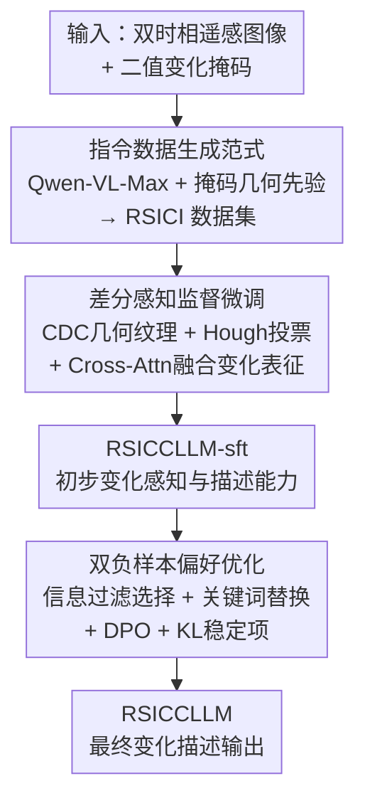

# RSICCLLM: A Multimodal Large Language Model for Remote Sensing Image Change Captioning

**会议**: ECCV 2026  
**arXiv**: [2606.28266](https://arxiv.org/abs/2606.28266)  
**代码**: [https://github.com/keaill/RSICCLLM](https://github.com/keaill/RSICCLLM) (有)  
**领域**: 多模态VLM  
**关键词**: 遥感图像变化描述, 多模态大语言模型, 偏好优化, 指令数据生成, 差分感知微调

## 一句话总结
RSICCLLM 是首个面向遥感图像变化描述（RSICC）的大模型后训练框架：先利用二值变化掩码作为几何先验、借助 Qwen-VL-Max 自动生成大规模指令数据集 RSICI，再通过差分感知监督微调（CDC 几何纹理提取 + Hough 投票 + Cross-Attention 融合）显式注入变化表征，最后以双负样本偏好优化（DNPO）精炼输出质量，仅 7B 参数即在全部 8 项指标上超越 Qwen3-VL-235B、InternVL-3.5-241B 等数百 B 级通用模型和 RSICC 专用模型。

## 研究背景与动机
遥感图像变化描述（RSICC）要求模型对两张不同时期的遥感图像生成自然语言变化描述，在环境评估、灾害响应、城市规划等公共事务中具有重要应用价值。与只输出二值变化图的遥感变化检测（RSICD）不同，RSICC 需要将视觉变化映射为语义描述，既要准确感知真实的地表变化，又要忽略光照、季节等无关因素的干扰，同时还将细粒度地物变化与自然语言对齐。

近年来 RSICC 的主流方法（如 Semantic-CC、Pix4Cap、Prompt-CC）均基于传统深度学习架构——CNN-Transformer 编码器配合轻量变化检测解码器，再连接一个描述生成模块。这些方法的模型容量有限（通常仅数千万至数亿参数），性能存在天然上限。与此同时，大模型后训练技术（SFT + 偏好优化）在通用视觉语言领域已取得巨大成功，遥感领域也涌现了 GeoChat、Falcon 等基础模型，但在单时相描述和通用下游任务上表现良好，面对 RSICC 的双时相细粒度变化理解仍力不从心。

核心矛盾在于两点：**数据稀缺**——RSICC 领域缺乏大规模、高质量的指令数据和偏好标注数据，现有数据集（如 LEVIR-CC 仅 5 万条描述、平均长度 40 词）不足以驱动大模型后训练；**变化感知能力不足**——现有 VLM 的视觉编码器并非为捕捉两图间细微几何纹理差异而设计，直接微调难以学到鲁棒的变化表征。

本文探索将大模型后训练范式引入 RSICC，核心 idea 是：**利用大规模 RSICD 数据中的变化掩码作为免费几何先验，驱动强 MLLM 自动合成高质量指令数据，再通过显式注入手工提取的变化几何纹理特征增强视觉编码器，最后以双策略互补的偏好优化实现性能精炼**——打通数据、表征、对齐三个环节，让 7B 模型获得超越数百 B 通用模型的 RSICC 能力。

## 方法详解

### 整体框架
RSICCLLM 是一个三阶段后训练框架，输入为一对双时相遥感图像及对应的二值变化掩码，输出为描述两图差异的自然语言文本。

**阶段一：指令数据生成。** 从 LEVIR-CD 和 SYSU-CD 两个 RSICD 数据集中取双时相图像及其 ground-truth 二值变化掩码，以掩码作为几何先验构造 prompt，调用 Qwen-VL-Max 生成变化描述文本，经过关键字校验、幻觉过滤、长度检查、专家复核四道质控后，得到约 35k 条高质量指令样本，并额外从 S2Looking 和 CDD 生成约 5k 条作为域外测试集。

**阶段二：差分感知监督微调。** 在 Qwen2.5-VL-7B 的视觉编码器中注入手工提取的变化几何纹理特征——通过中心差分卷积（CDConv）族提取光照不敏感的几何纹理，经 Hough 变换投票积累空间结构证据，再由 Cross-Attention 将像素级差分图与几何纹理特征融合为变化表征，最后将增强后的视觉嵌入送入 LLM 解码器做自回归训练，得到 RSICCLLM-sft。

**阶段三：双负样本偏好优化。** 基于 RSICCLLM-sft 构建偏好数据集 RSICP：先用信息过滤选择策略（对候选描述做关键词过滤后与 ground truth 计算相似度，筛选中等难度负样本），再用关键词替换策略（对 ground truth 中关键信息词做同组替换生成语义错误但语法自然的负样本），合并后通过 DPO + KL 稳定项进行偏好优化，得到最终 RSICCLLM。

### 关键设计

**1. 指令数据生成范式：以变化掩码为几何先验，用强 MLLM 自动合成高质量变化描述**

RSICC 领域长期受困于数据稀缺——人工标注双时相遥感图像的细粒度变化描述成本极高。本文的关键洞察是：RSICD 数据集（如 LEVIR-CD、SYSU-CD）自带像素级 ground-truth 二值变化掩码，这些掩码精确标出了"哪里变了"，可以作为免费的几何先验提供给强 MLLM。具体做法是：将双时相图像与对应的二值掩码一同输入 Qwen-VL-Max，通过精心设计的 prompt 要求模型"只描述掩码区域内发生的地表变化"，并辅以 few-shot 示例引导输出格式。

为确保质量，生成管线设置了四道关卡：（1）提取输出中的 object/direction/verb/quantity 结构化元素，验证其与掩码区域的一致性；（2）过滤包含"mask""segmentation"等泄露先验信息的样本；（3）过滤过长或语义幻觉的输出；（4）三位领域专家交叉复核。不合格样本会被拒绝并触发最多 2 次重试（调整 prompt 长度或示例后重新生成）。最终构建的 RSICI 包含 40,000 张图像配 20,000 条描述（平均 77 词），是通用领域规模最大的 RSICC 指令数据集。同时，从 S2Looking 和 CDD 额外生成约 5k 条域外测试样本，覆盖乡村场景、离底点建筑变化和季节性植被变化，用于评估泛化能力。

**2. 差分感知监督微调：CDC 几何纹理提取 + Hough 投票 + Cross-Attention 变化表征融合**

通用 VLM 的视觉编码器对光照、季节等不相关变化敏感，而对真正的地表结构变化不够敏感。本文的核心思路是**不依赖模型自己学会看变化，而是把变化信号显式算出来注入编码器**。

具体分四步：（1）**像素级差分图**：$T = I_1 - I_2$，提供最直接的变化强度线索。（2）**CDC 几何纹理提取**：设计 8 个 3x3 卷积核——1 个标准卷积 $C_8$、1 个中心差分卷积 $C_1$、4 个方向性非对称算子（$C_2$/$C_3$/$C_5$/$C_6$）和 2 个对称算子（$C_4$/$C_7$）。其中 CDConv 通过 $\delta_i(\Delta r_x, \Delta r_y)$ 门控函数决定邻域像素是否参与计算，使卷积对光照和天气变化不敏感，专注于提取几何纹理。（3）**Hough 投票**：将每个卷积算子的响应图投影到 Hough 参数空间 $(\rho, \theta)$ 做投票积累 $H_i^t(\rho, \theta) = \text{HoughTransform}(C_i^t)$，**关键设计是分别对两张图像独立做 Hough 变换和逆变换，在空间域做差分而非在参数域做差分**——这避免了两图直接差分造成的几何语义丢失，使 $\Delta S = \frac{S^{(2)} - S^{(1)}}{\|S^{(1)}\|_1 + \|S^{(2)}\|_1 + \epsilon}$ 保留完整的空间结构信息。（4）**Cross-Attention 融合**：以像素差分 $T$ 为 Query、几何纹理差 $\Delta S$ 为 Key/Value，做交叉注意力 $F = \text{softmax}(\frac{T\Delta S^\top}{\sqrt{d}})\Delta S$，最终得到增强的视觉嵌入 $V_{\text{enhanced}} = V_{\text{orig}} + F$，送入 Qwen2.5 LLM 解码器做自回归生成。

这套设计的巧妙之处在于：$T$ 偏语义（来自 VLM tokenizer，与语言空间对齐好），$\Delta S$ 偏几何（来自手工卷积算子，对空间结构敏感），Cross-Attention 让两者互补——语义信息引导几何特征中"哪里重要"，几何特征弥补语义信息中"结构在哪"的缺失。

**3. 双负样本偏好优化：信息过滤选择 + 关键词替换，双策略互补构建偏好数据**

偏好优化的效果严重依赖负样本质量——负样本太简单则学不到有用信号，太困难则训练不稳定。RSICC 领域无现成偏好标注，本文提出两种互补的负样本构造策略。

首先将变化描述中的词分为两类：**关键词**（object/direction/change verb/quantity，决定句义）和**非关键词**（冠词/介词/代词，影响流畅度但不影响语义）。两个策略均基于此定义展开。

**策略一：信息过滤负样本选择。** 用 RSICCLLM-sft 对每张输入图像采样 $K$ 条候选描述，对所有候选描述和 ground truth 做关键词过滤（通过指示函数 $\phi(w_i) \in \{0, 1\}$ 保留高信息密度词），得到过滤序列 $y^{\text{info}}$ 和 $y_{\text{GT}}^{\text{info}}$。以 BLEU-1、BLEU-2、ROUGE-1 的均值计算两者相似度 $S_{\text{sim}}$，只保留 $\tau_1 < S_{\text{sim}} < \tau_2$ 的候选作为负样本——下限 $\tau_1$ 筛掉与 ground truth 完全无关的随机噪声（太简单），上限 $\tau_2$ 筛掉与 ground truth 几乎相同的样本（太困难，实质是正样本变体）。这保证了负样本处于"有部分正确信息但不完全准确"的中等难度区间，最有利于偏好学习。

**策略二：基于替换的负样本构造。** 直接修改 ground truth 中的关键词：定义替换映射 $\psi: y_{\text{GT}}^{\text{info}} \to \mathcal{V}$，从按 object/direction/verb/quantity 分组的对比替换池中选取同组词替换。例如，将"building was constructed"中的"building"替换为同组的"road"，"constructed"替换为"demolished"。同组约束保证了替换后句子的词性和形态一致性（读起来仍然像一句自然的话），但关键语义已发生错误。对每条 ground truth 随机做 $M$ 次替换，得到负样本集 $\mathcal{N}_{\text{con}}$。

两种策略优势互补：信息过滤选择保真度高（来自模型自身分布，难度自然），但受限于模型生成能力；关键词替换可控性强（精确控制错误类型），但可能产生不自然的句子。合并后构建 RSICP 偏好数据集（20k 图像对），用 $\mathcal{L}(\pi_\theta; \pi_{\text{ref}}) = \mathcal{L}_{\text{DPO}}(\pi_\theta; \pi_{\text{ref}}) + \lambda \mathcal{L}_{\text{S}}(\pi_\theta; \pi_{\text{ref}})$ 训练，其中 $\mathcal{L}_{\text{S}}$ 为反向 KL 散度 $D_{\text{KL}}(\pi_\theta(\cdot|x) \| \pi_{\text{ref}}(\cdot|x))$，约束策略模型不过度偏离参考模型，防止 DPO 训练中常见的性能崩溃。

### 损失函数 / 训练策略

**SFT 阶段**使用标准自回归语言建模损失：$\mathcal{L}_{\text{AR}} = -\sum_{t=1}^{T} \log P(y_t \mid y_{<t}, I_1, I_2, P; \theta)$，将双时相图像经增强后的视觉嵌入与 prompt token 拼接后送入 Qwen2.5 解码器做 teacher forcing 训练。

**偏好优化阶段**联合优化两项损失：$\mathcal{L}(\pi_\theta; \pi_{\text{ref}}) = \mathcal{L}_{\text{DPO}}(\pi_\theta; \pi_{\text{ref}}) + \lambda \mathcal{L}_{\text{S}}(\pi_\theta; \pi_{\text{ref}})$。其中 $\mathcal{L}_{\text{DPO}}$ 为标准 DPO 损失，最大化正样本相对负样本的对数概率比；$\mathcal{L}_{\text{S}}$ 为反向 KL 正则项，实验表明仅用 DPO 会在训练后期出现性能骤降（模型迅速偏离参考分布后崩溃），而加入 KL 稳定项后训练曲线平稳上升并收敛到更高点。

所有模型在 22 张 NVIDIA A100 GPU 上训练。骨干网络为 Qwen2.5-VL-7B。

## 实验关键数据

### 主实验

在 RSICI 域内测试集（3k 样本）上的对比结果如下。RSICCLLM 仅 7B 参数，在所有 8 项指标上全面超越通用大模型（Qwen3-VL-235B、InternVL-3.5-241B 等数百 B 级别）和 RSICC 专用模型（TEOChat-7B、CCExpert-7B）。

| 方法 | 参数量 | BLEU-4 | ROUGE-1 | ROUGE-L | SBS |
|------|--------|--------|---------|---------|-----|
| Qwen-VL-Max | - | 2.70 | 34.20 | 20.10 | 71.79 |
| InternVL-3.5-241B | 241B | 2.83 | 32.83 | 19.77 | 72.98 |
| Qwen3-VL-235B | 235B | 2.82 | 33.79 | 19.42 | 71.70 |
| Qwen2.5-VL-72B | 72B | 2.65 | 33.71 | 19.38 | 70.06 |
| TEOChat-7B | 7B | 0.94 | 18.89 | 11.13 | 40.97 |
| CCExpert-7B | 7B | 0.88 | 17.65 | 10.81 | 40.31 |
| Qwen2.5-VL-7B (基座) | 7B | 0.61 | 17.27 | 10.16 | 42.06 |
| RSICCLLM-sft | 7B | 61.68 | 52.31 | 37.51 | 80.38 |
| **RSICCLLM** | **7B** | **62.78** | **53.54** | **38.30** | **82.72** |

域外测试集（S2Looking + CDD，5k 样本）上 RSICCLLM 同样全面领先，BLEU-4 达 47.84（第二名为 GLM-4.5V 的 3.67），验证了方法的强泛化能力。GPT-5.2 Thinking 作为判官的四维评分（object/direction/action verb/change magnitude）也由 RSICCLLM 取得第一。

### 消融实验

**差分感知 SFT 各组件贡献**（Table 4 精简）：

| 配置 | BLEU-4 | ROUGE-1 | ROUGE-L | 说明 |
|------|--------|---------|---------|------|
| Full (RSICCLLM) | 62.78 | 53.54 | 38.30 | 完整模型 |
| w/o G (几何纹理统计) | 62.54 | 53.13 | 38.11 | 用简单平均替换 CDC+Hough |
| w/o ΔS (几何纹理差) | 61.90 | 52.89 | 37.85 | 移除几何纹理分支 |
| w/o T (像素差分) | 60.45 | 51.37 | 36.03 | 移除像素差分分支 |

去掉像素差分 $T$ 掉点最多（BLEU-4 下降 2.33），说明显式变化强度信号对变化感知最为关键；去掉几何纹理 $\Delta S$ 次之，验证了 CDC+Hough 几何纹理的增益；去掉 G 将 CDC+Hough 退化为简单平均也有下降，表明几何纹理统计的有效性。

**训练策略有效性**（Table 5 精简）：

| 策略 | BLEU-4 | ROUGE-1 | ROUGE-L |
|------|--------|---------|---------|
| 无微调 (基座) | 3.21 | 17.27 | 10.94 |
| + SFT | 61.68 | 52.31 | 37.51 |
| + SFT + DNPO | 62.78 | 53.54 | 38.30 |

SFT 带来巨大增益（基座几乎完全不具备变化描述能力），DNPO 在 SFT 基础上进一步提升。在手动筛选的约 400 条困难样本子集上，DNPO 相对 SFT 的提升幅度达到 7.4%，说明偏好优化在困难场景下收益更大。

**两种负样本策略消融**（Table 6）：仅用信息过滤选择（S+F）BLEU-4 达 62.38，仅用关键词替换（S+R）达 62.16，两者联合（S+F+R）达 62.78，验证了两种策略的互补性。

### 关键发现
- **像素差分 $T$ 是变化感知的核心**：去掉 $T$ 导致 BLEU-4 下降 2.33 点，说明即使有精心设计的几何纹理提取，最原始的变化强度信号仍不可替代。
- **KL 稳定项防止 DPO 训练崩溃**：仅用 DPO 训练在早期略微领先但随后性能骤降，加入 $\mathcal{L}_{\text{S}}$ 后训练始终平稳上升并收敛至更高水平——这是偏好优化中的一个实用训练技巧。
- **推理效率优势显著**：RSICCLLM 仅 7B 参数，推理吞吐 0.631 samples/s，是 Qwen3-VL-235B（0.104 samples/s）的 6 倍，且 SBS 高出约 11 个百分点。
- **低数据量下差分感知 SFT 优势更明显**：在 2k/10k/24k/32k 不同训练规模下，差分感知 SFT 始终优于标准 SFT，且在 2k 小样本场景下增益最大——说明显式注入变化先验对数据高效学习至关重要。

## 亮点与洞察
- **用 RSICD 掩码作为免费的几何先验生成 RSICC 数据**：这是一个聪明的领域知识迁移——变化检测和变化描述共享"哪里变了"这一核心信息，前者恰好提供了像素级标注，后者借它驱动 MLLM 生成语义描述，变废为宝。
- **CDC + Hough 这条手工特征链注入大模型**：在大模型时代"手工特征已死"的叙事下，本文反其道而行，证明精心设计的传统视觉算子（CDC 的光照不变性、Hough 的几何证据积累）作为显式先验注入 VLM 编码器，可以在特定领域任务上带来显著增益——这是一个值得推广到其他细粒度视觉理解任务的设计范式。
- **两种负样本策略的互补性设计清晰且有说服力**：信息过滤选择提供"模型自己容易犯的错"，关键词替换提供"语义不可接受但在语言学上合理的错"，两者覆盖了偏好学习的两个关键维度——这种"互补负样本构造"思路可以迁移到其他缺乏偏好标注的文本生成任务。
- **KL 稳定项防崩溃**：实验图清晰展示了 DPO-without-KL 的"先涨后崩"曲线——这是一个非常实用的工程观察，任何做 DPO 训练的人都应该注意，尤其在偏好数据集质量有限（如本文的自动合成数据）时。

## 局限与展望
- **数据生成依赖封闭源模型**：RSICI 的质量上限受 Qwen-VL-Max 限制，且生成过程不可复现。后续可探索用开源模型（如 Qwen3-VL）做数据生成，或引入人工校验的少量精标注数据作为质量锚点。
- **CDConv + Hough 管线增加推理开销**：虽然最终模型仅 7B，但在视觉编码器中注入 8 路卷积 + Hough 变换的计算量不可忽略，论文未给出推理延迟的绝对数值（仅给了相对吞吐），实际部署时需权衡精度与速度。
- **变化类型覆盖有限**：训练数据主要来自 LEVIR-CD（建筑变化为主）和 SYSU-CD（人造地物变化），对自然灾害（洪水、火灾、滑坡）和农业变化等场景的覆盖不足，域外测试也多集中在建筑和季节变化。
- **仅支持英文描述**：生成的描述均为英文，未探索中文或其他语言的变化描述能力，在多语言遥感应用场景中存在局限。
- **偏好优化中硬负样本的潜力未充分挖掘**：DNPO 刻意筛掉了与 ground truth 高度相似（$S_{\text{sim}} > \tau_2$）的候选作为负样本，但这些"近乎正确但有微妙偏差"的样本恰恰是训练模型精细判别能力的最有价值信号。未来可尝试分阶段课程学习——先用中等难度负样本稳定训练，再逐步引入硬负样本。

## 相关工作与启发
- **vs 传统 RSICC 方法（Semantic-CC / Pix4Cap / Prompt-CC）**：这些方法在小型 CNN-Transformer 框架内做特征融合和注意力设计，受限于模型容量（通常 < 1B 参数）和训练数据量；RSICCLLM 换用大模型后训练范式，通过数据生成解决了数据瓶颈，范式层面的差距远大于模块设计的差异。
- **vs 遥感基础模型（GeoChat / TEOChat / Falcon）**：这些模型主要面向单时相图像描述和通用遥感下游任务，缺乏对双时相变化的显式建模能力；RSICCLLM 通过差分感知 SFT 注入变化表征，填补了"遥感 VLM 不会看变化"的空白。
- **vs 通用 VLM 后训练（Qwen-VL / InternVL 系列）**：通用 VLM 在 RSICC 上未经微调时几乎完全失效（BLEU-4 < 4），说明即使数百 B 参数的大模型也无法零样本完成这一专业任务——这为领域特化后训练的必要性提供了强证据，同时也暗示"遥感专用 VLM"可能是一个值得独立发展的方向。
- **DNPO 双策略负样本构造思路**：核心思想是让负样本在"错误类型"上互补——一种是模型自然分布中的错误（生成式），一种是人类定义的语义错误（替换式）。这种设计可以迁移到任何"ground truth 是自然语言、但没有现成负样本"的生成任务（如医学报告生成、法律文书摘要），只需根据需要定义对应的关键词类别和替换池。

## 评分
- 新颖性: ⭐⭐⭐⭐☆ 首个将大模型后训练范式引入 RSICC 的工作，数据生成范式 + 差分感知 SFT + DNPO 三个模块均有原创性，但各模块内部的技术组件（CDC、Hough、DPO）本身是已知技术，新颖性主要在"组合方式"和"领域适配"层面。
- 实验充分度: ⭐⭐⭐⭐⭐ 域内/域外双测试集、与 10+ 基线对比（覆盖通用大模型和领域专用模型）、各组件的消融实验、训练规模分析、推理效率对比、GPT 辅助评分，实验设计全面且有说服力。
- 写作质量: ⭐⭐⭐⭐☆ 结构和逻辑清晰，方法部分有详细公式推导，图 2 的全景框架图和图 3 的负样本策略示意图直观易懂。但部分细节（如 λ 具体取值、$K$/$M$ 超参设置）未在正文明确给出，需查阅附录。
- 价值: ⭐⭐⭐⭐⭐ 解决了 RSICC 领域的核心瓶颈（数据稀缺 + 模型容量不足），构建并开源了两个高质量数据集（RSICI + RSICP），7B 模型超越数百 B 通用模型的实践结论对遥感领域推广大模型后训练具有示范效应。差分感知 SFT 的"手工特征注入大模型"范式对其他细粒度视觉理解任务有直接迁移价值。

<!-- RELATED:START -->

## 相关论文

- [\[ECCV 2026\] Evaluating and Enhancing Negation Comprehension in Remote Sensing MLLMs](evaluating_and_enhancing_negation_comprehension_in_remote_sensing_mllms.md)
- [\[ICLR 2026\] PhysLLM: Harnessing Large Language Models for Cross-Modal Remote Physiological Sensing](../../ICLR2026/multimodal_vlm/physllm_harnessing_large_language_models_for_cross-modal_remote_physiological_se.md)
- [\[CVPR 2026\] VLM4RSDet: Collaborative Optimization with Vision-Language Model for Enhancing Remote Sensing Object Detection](../../CVPR2026/multimodal_vlm/vlm4rsdet_collaborative_optimization_with_vision-language_model_for_enhancing_re.md)
- [\[NeurIPS 2025\] CHOICE: Benchmarking the Remote Sensing Capabilities of Large Vision-Language Models](../../NeurIPS2025/multimodal_vlm/choice_benchmarking_the_remote_sensing_capabilities_of_large_vision-language_mod.md)
- [\[ECCV 2026\] MedRegion-CT: Region-Aware Multimodal Large Language Model via SlowFast Tokenization and Pseudo-Mask Guidance for 3D CT Report Generation](region-aware_multimodal_large_language_model_via_slowfast_tokenization_and_pseud.md)

<!-- RELATED:END -->
