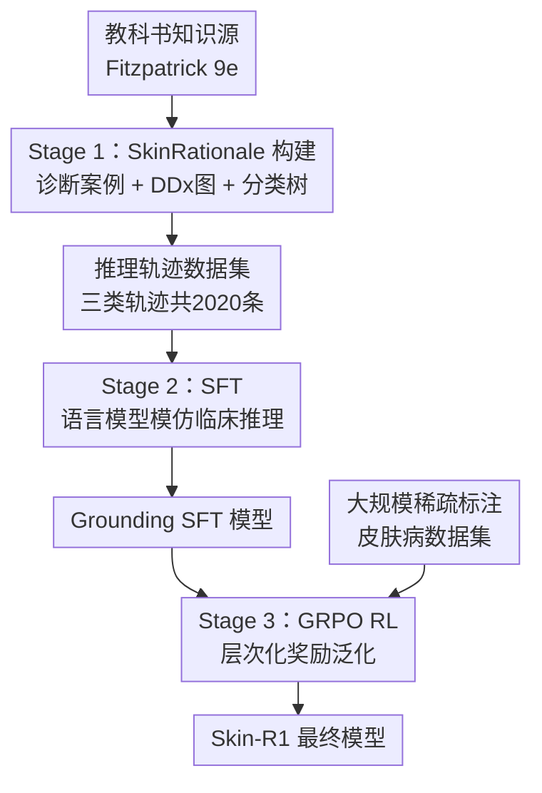

# Skin-R1: Clinical Knowledge-Guided Dermatological Diagnosis Using Vision-Language Models

**会议**: ECCV 2026  
**arXiv**: [2511.14900](https://arxiv.org/abs/2511.14900)  
**代码**: [https://github.com/l593191569/Skin-R1](https://github.com/l593191569/Skin-R1)  
**领域**: 多模态VLM / 医学图像  
**关键词**: 皮肤病诊断, 视觉语言模型, 临床推理, 强化学习, 教科书知识  

## 一句话总结

Skin-R1 提出三阶段训练框架——先由权威皮肤科教科书自动构建分层感知和鉴别诊断推理轨迹数据集 SkinRationale，再通过 SFT 初始化模型的临床推理能力，最后用 GRPO 强化学习配合层次化奖励设计将推理能力泛化到大规模稀疏标注数据集，在多项皮肤病诊断基准上全面超越现有 Med-VLM。

## 研究背景与动机

**领域现状**：皮肤病诊断本质上是一个视觉推理任务——临床医生需要解读细微的视觉模式、对照疾病分层分类体系进行比较、进行鉴别诊断（DDx）来区分视觉相似的疾病。近年来基于多模态视觉语言模型（VLM）的辅助诊断系统展现出潜力，但现有方法仍面临三个核心挑战。首先是**数据异质性**：真实世界的皮肤病数据集在诊断标签体系和概念标注上高度不一致——SkinCon 仅提供 29 个概念标注和良/恶性二分类，而 DermNet 覆盖 600+ 疾病却缺少结构化概念标注。其次是**缺乏专家级推理监督**：准确诊断需要尊重疾病层次结构的分层推理和鉴别诊断能力，但现有数据集极少提供临床可解释的推理过程标注。第三是**训练范式的可扩展性有限**：在小规模密集标注数据上训练的模型难以泛化到大规模稀疏标注数据。

**核心矛盾**：现有 Med-VLM 要么依赖小规模高质量标注数据（推理能力强但规模受限），要么依赖大规模弱标注数据（规模大但缺少可靠推理监督）。两条路线之间存在不可调和的矛盾——缺少一个既能从权威来源获取临床推理模式、又能有效泛化到异构数据集的统一框架。

**切入角度**：本文的独特洞察在于——教科书级别的诊断推理知识虽然数据量小但质量极高，可以作为推理能力的"种子"；RL 训练框架则能将这种推理能力从密集标注数据迁移到稀疏标注数据。二者结合可以打破之前二选一的困境。

**核心 idea**：构建一个三阶段训练管线——先基于权威皮肤科教科书自动生成层次化和鉴别诊断推理轨迹数据集 SkinRationale，再通过 SFT 建立临床推理基础，最后用 GRPO 强化学习框架配合层次化诊断精度奖励将推理能力泛化到大规模稀疏标注数据集上。

## 方法详解

### 整体框架

Skin-R1 的训练管线由三个阶段组成。第一阶段基于权威皮肤科教科书 Fitzpatrick's Dermatology 第 9 版（Part 20: Neoplasia，共 399 页），通过自动化的五阶段知识抽取流水线提取三种互补知识：诊断案例三元组（临床图像、文本推理、诊断标签）、鉴别诊断图（DDx graph，连接临床易混淆疾病）、疾病分类树（hierarchical taxonomy）。基于这些知识构造 2020 条三类诊断推理轨迹。第二阶段在这些轨迹上进行 SFT，让模型学习临床一致的诊断推理模式。第三阶段使用 GRPO 强化学习，配合组合奖励函数（格式规整奖励、层次深度感知奖励、恶性判别奖励），将推理能力从密集标注数据泛化到大规模稀疏标注数据上。

### 关键设计

**1. 教科书知识驱动的推理轨迹生成：解决高质量推理数据稀缺问题**

构建可靠推理轨迹的冷启动是核心难点。现有方法依赖大型推理模型（如 QwQ-32B）生成推理轨迹，但模型生成的推理可能包含错误，导致模型坍缩或幻觉传播。Skin-R1 的解决方案是从权威教科书直接提取结构化临床知识。先通过自动化的五阶段流水线——图像/文本抽取、图像聚类过滤（两级层次 k-means）、文本配对过滤（空间邻近度+正则）、诊断规则提取（gpt-4.1-mini 生成规则式语句）、DDx/分类树确认精炼——从 Fitzpatrick's Dermatology 中提取 220 个诊断案例 $(I_i, r_i, d_i)$、含 211 节点 245 边的 DDx 图（覆盖 61.36% 的案例）、含 458 节点 473 边的疾病分类树。然后基于这些知识构造三类推理轨迹：类型 1（220 条，图像→诊断+推理的直接映射）、类型 2（900 条，在类型 1 基础上加入 DDx 对比推理、最终诊断不变）、类型 3（900 条，加入 DDx 对比推理后修正诊断），共 2020 条轨迹。类型 2 和 3 的 DDx 配对使用层次化回退策略（优先查询 DDx 图邻域 → 无结果则查询分类树父节点邻域 → 再查子节点）确保高覆盖。三类轨迹从简单到复杂逐步覆盖诊断推理的不同场景，为 SFT 提供了丰富的推理监督信号，同时教科书来源规避了模型生成推理的错误传导风险。

**2. 层次化奖励设计：让RL泛化到稀疏标注数据**

这是本文的核心创新。作者为 GRPO 设计了组合奖励函数 $R_{\text{total}} = R_{\text{format}} + R_{\text{gran}} + R_{\text{malignancy}}$。**格式规整奖励** $R_{\text{format}}$ 为是否包含规定输出标签（1/0 二值），保证模型输出的结构化一致性。**层次深度感知奖励** $R_{\text{gran}}$ 是最关键的创新：如果预测诊断 $\hat{\ell}$ 位于正确分类路径 $\mathcal{P}$ 中，则奖励为 $0.75 \times i^{*}/L$（$i^{*}$ 为匹配深度，$L$ 为路径总深度）；否则为 0。这意味着模型选择正确的细粒度疾病（如"浅表扩散性黑色素瘤"）比只选对粗粒度类别（如"黑色素瘤"）获得更高奖励，鼓励模型进行更精确的分层推理。**恶性判别奖励** $R_{\text{malignancy}}$ 是对恶性/良性/原位癌前病变三分类是否正确给 0.25 奖励，从临床风险角度强化基础分类。这一设计的精妙之处在于：层次深度奖励将疾病分类树的结构信息直接编码进 RL 训练信号，使模型不只是做单标签分类，而是在疾病层级空间中进行推理，从而更好地泛化到训练中未见过的疾病类型。

**3. GRPO结合Grounding SFT的两阶段训练策略：解决RL-only方法缺乏临床知识的问题**

近期工作（如 MedVLM-R1、Med-R1）展示了对 Med-VLM 直接应用 GRPO 可以不经过 SFT 就诱导出推理行为，甚至有工作声称 SFT 可能引入记忆捷径。但本文通过实验给出了不同的结论。作者的策略是：先在大规模推理轨迹上做 SFT（标准自回归损失），让模型具备临床推理的基础能力，再用 GRPO 强化学习放大和泛化这些能力。GRPO 的目标函数为 $\mathcal{L}_{\text{GRPO}}(\theta) = \mathbb{E}_x[\frac{1}{K}\sum_{j=1}^K \min(\rho_j A_j, \text{clip}(\rho_j, 1-\varepsilon, 1+\varepsilon)A_j)] - \beta \text{KL}(\pi_{\theta} \| \pi_{\text{ref}})$，其中 $A_j = (r_j - \mu)/\sigma$ 是组内归一化的优势函数。消融实验清楚表明：纯 RL 虽然优于基座模型（ID 平均 0.4367 → 0.5843），但显著低于 SFT+RL 的完整管线（0.5843 → 0.6385），证明高质量 SFT 是有效 RL 的前提——与 Med-R1 的结论差异源于 Med-R1 使用的 SFT 数据缺乏临床推理性，而 Skin-R1 使用的教科书推理轨迹提供了真正的推理知识。

### 一个例子：粒度感知奖励的计算流程

给定真实标签"浅表扩散性黑色素瘤"（Superficial Spreading Melanoma），其分类路径为：肿瘤（Neoplasm）→ 黑色素细胞病变（Melanocytic）→ 黑色素瘤（Melanoma）→ 浅表扩散性黑色素瘤（Superficial Spreading Melanoma），路径深度 $L=4$。如果所有四个层级节点都作为选项出现，模型选择了"黑色素瘤"（深度 $i^{*}=3$），则 $R_{\text{gran}} = 0.75 \times 3 / 4 = 0.5625$。如果模型选择了正确的细粒度"浅表扩散性黑色素瘤"（$i^{*}=4$），则获得最高奖励 0.75。如果选择了不在路径上的节点，奖励为 0。这种逐步衰减的奖励设计让模型不是简单地做选择题，而是在层级空间中搜索，提升了推理泛化能力。

### 损失函数 / 训练策略

SFT 阶段采用标准自回归损失 $\mathcal{L} = -\sum_{i=1}^n \log \pi_{\theta}(x_i \mid x_{<i}, I, p)$，在 2020 条推理轨迹上训练 4 个 epoch。RL 阶段采用 GRPO，group size $K=4$，采样温度 1.0。基座模型使用 Qwen2.5-VL-7B-Instruct，SFT 和 RL 均用 LoRA 微调（lora_r=64, lora_alpha=32, lora_dropout=0.1）。SFT 学习率 $3\times 10^{-5}$，RL 学习率 $1\times 10^{-5}$，batch size 均为 16。训练使用 2 块 NVIDIA A100 40GB GPU。推理时采用贪心解码，最大图像分辨率 448×448。

## 实验关键数据

### 主实验

| 任务 | 数据集 | 指标 | Skin-R1 | 最佳基线 | 提升 |
|------|--------|------|---------|----------|------|
| ID Disease | BCN20000 | Acc | 0.6345 | 0.4911（Qwen2.5-VL-7B） | +0.1434 |
| ID Disease | HAM10000 | Acc | 0.7214 | 0.5162（Qwen2.5-VL-7B） | +0.2052 |
| ID Disease | PAD-UFES-20 | Acc | 0.6573 | 0.6009（InternVL3-8B） | +0.0564 |
| ID Disease | Derm12345 | Acc | 0.6608 | 0.4121（LLaVA-v1.6-13B） | +0.2487 |
| ID Disease | **ID Average (6个)** | **Acc** | **0.6385** | 0.4430（InternVL3-8B） | **+0.1955** |
| OOD Disease | **OOD Average (5个)** | **Acc** | **0.7171** | 0.6887（MedGemma-4B） | **+0.0284** |
| Lesion Condition | **Lesion Average** | **Acc / F1** | **0.6928 / 0.4287** | 0.6491 / 0.3654（Qwen3-VL-32B） | +0.0437 / +0.0633 |

在 ID 诊断任务上，Skin-R1 平均准确率 0.6385，超出次优基线 InternVL3-8B（0.4430）达 19.55 个百分点，提升极为显著。在 OOD 泛化任务上，Skin-R1 平均 0.7171 同样领先所有基线。在恶性/良性/癌前病变分类上，Skin-R1 同时取得最高准确率（0.6928）和 Macro-F1（0.4287），说明模型在不同类别上的平衡性也有优势。值得注意的是，多个基线模型在病变分类上表现出显著偏差——MedGemma-4B 强烈偏向"原位癌前病变"类别（8390 个预测中 7860 个为此类），LLaVA-Med-7B 偏向"良性"类别，而 Skin-R1 没有出现类似的极端偏差。

### 消融实验

| 配置 | ID Average Acc | OOD Average Acc | 说明 |
|------|---------------|-----------------|------|
| Qwen2.5-VL-7B（基座） | 0.4367 | 0.5027 | 基座模型，约30%输出格式无效无法提取答案 |
| + SFT | 0.4743 | 0.5153 | SFT 后格式对齐显著提升，仅~2%无效输出 |
| RL without SFT | 0.5843 | 0.5674 | 纯RL改善明显，但远低于完整管线 |
| RL with standard reward | 0.6379 | 0.6386 | 标准奖励（无层次深度感知）的RL |
| **Skin-R1（1500 steps）** | **0.6385** | **0.7171** | 完整管线，OOD提升最大 |

消融实验的核心发现：第一，SFT 阶段是关键前提——SFT 不仅提升了诊断能力（ID: 0.4367 → 0.4743），更重要的是大幅改善了输出格式对齐（无效提取率从~30% 降至~2%），为后续 RL 扫清了格式障碍。第二，RL without SFT 虽然好于基座模型（ID: 0.5843 vs 0.4367），但完整管线（ID: 0.6385）显著更优——这表明高质量 grounding SFT 是有效 RL 的必要前提，纯 RL 做法缺乏临床知识基础。第三，层次深度奖励在 OOD 场景上优势最大（0.6386 → 0.7171），说明层次化的奖励信号确实帮助模型学到了可泛化的疾病分类推理表示，而不是过拟合训练集标签分布。

### 关键发现

- SFT 阶段提供的格式对齐和推理初始化是后续 RL 的基础；RL 提供的主要是泛化能力，尤其是 OOD 场景
- 层次深度奖励的引入将 OOD 从 0.6386 进一步提升到 0.7171（+0.0785），是整体框架中单一贡献最大的改进，验证了将疾病分类树结构编码进 RL 奖励的有效性
- 在 Fitzpatrick 皮肤类型评估中，II、V、VI 型皮肤出现轻微性能下降（最低 0.4634 vs 最高 0.5494），提示训练数据可能存在人群分布偏差
- Skin-R1 在 DDx 专项评估中准确率最高，说明三类推理轨迹（尤其是类型 2 和类型 3）确实提升了模型对易混淆疾病的区分能力

## 亮点与洞察

- **教科书知识蒸馏到 RL 训练的完整闭环**：本文最巧妙的设计不是单点创新，而是构建了一条完整的知识链路——从教科书 PDF 自动抽取结构化知识 → 构建推理轨迹 → SFT grounding → RL 泛化。每个环节的设计都指向下一个环节的需求，形成一个闭环，而不是独立的模块拼凑。
- **对"RL 是否会取代 SFT"的辩论提供了有价值证据**：近期 Med-R1 等工作主张直接 RL（不经过 SFT）可以取得更好结果。本文通过仔细的消融实验表明，这取决于推理监督数据的质量——当 SFT 数据来自权威教科书而非大模型生成时，SFT 是 RL 的必要前提。这一发现对整个 Med-VLM 领域有指导意义。
- **层次深度奖励的设计优雅且可迁移**：将疾病分类树结构编码进 RL 奖励的方法简单有效，显著提升了 OOD 泛化能力。这一思路可以迁移到其他具有层次结构标签的医学诊断任务（如病理分级、影像分期），甚至更广泛的有层次标签的分类任务。
- **三类推理轨迹的结构化设计**：类型 1（直接映射）、类型 2（DDx 不修正）、类型 3（DDx 修正）从简单到复杂覆盖了临床推理的不同决策场景，既保证基础诊断能力，又使模型学会在不确定时进行鉴别诊断和修正判断。

## 局限与展望

- 奖励信号和评估都基于答案级别（多选题准确率），推理轨迹的正确性和忠实性只有定性分析，缺乏量化评估。在更开放的临床场景中，还需要置信度校准、高不确定度下的弃权机制以及对恶性病变的严重性感知错误分析。
- 疾病分类树和 DDx 图离线构建且在训练中固定。这些结构也用于生成评测题的干扰项，导致 ID 评测部分反映的是与固定临床知识的一致性（不过 OOD 评测 OmniMedVQA 不受此耦合影响）。静态设计也限制了适应数据集特有或演化本体论的能力。
- 当前仅在 Qwen2.5-VL-7B 上实例化，是否可迁移到其他基座（包括医学专用基座）尚未验证。同时观察到 Fitzpatrick II/V/VI 型皮肤上轻微的准确率下降，可能存在训练数据的人群偏差。
- 结果层面的目标函数不显式奖励中间推理步骤的正确性，定义和验证临床推理的过程级奖励信号仍是一个开放挑战。

## 相关工作与启发

- **vs MedVLM-R1 / Med-R1**：这些方法对 VLM 直接应用 GRPO 不经过 SFT 即可诱导出推理行为。Skin-R1 证明这是因为它们缺少高质量推理数据——当有教科书级推理轨迹时，SFT+RL 显著优于纯 RL，说明 RL 不应被视为 SFT 的替代，而是对已有推理能力的放大的工具。
- **vs SkinVL-PubMM**：作为皮肤科专用的 VLM，SkinVL-PubMM 使用人工标注进行 grounding SFT，但缺少 DDx 意识和层次感知能力。Skin-R1 的三类推理轨迹提供了更结构化的临床推理监督，同时在稀疏标注数据上的训练使模型更具泛化能力。
- **vs MedGemma**：MedGemma 混合使用 grounding SFT、蒸馏和 RL 奖励训练，具备一定的层次感知能力，但缺少 DDx 意识。Skin-R1 通过 DDx 图显式建模了疾病间的混淆关系，在鉴别诊断场景上更可靠。

## 评分

- 新颖性: ⭐⭐⭐⭐  教科书知识蒸馏 + RL 泛化的三阶段框架在 Med-VLM 领域是首次系统性尝试；层次深度奖励将分类树结构编码进 RL 奖励的思路具有原创性，三类推理轨迹的设计也富有巧思。
- 实验充分度: ⭐⭐⭐⭐⭐  6 个 ID 数据集 + 5 个 OOD 数据集 + 消融包含 SFT/RL/奖励设计的逐组件分析 + DDx 和层次化推理的专门评估 + Fitzpatrick 皮肤类型公平性分析 + 目标对比表覆盖 6 类 13 个基线模型，实验覆盖面相当全面。
- 写作质量: ⭐⭐⭐⭐  动机清晰、方法描述有层次、附录提供了算法的完整伪代码和详细超参配置。主文方法部分的三阶段描述可读性好。不足是多选 VQA 评估框架的干扰项构造策略在主文中解释不够详尽。
- 价值: ⭐⭐⭐⭐⭐  对 Med-VLM 训练范式的设计选择（SFT vs RL vs SFT+RL）提供了重要的经验证据；层次深度奖励的设计具有可迁移性；皮肤病辅助诊断在临床应用上价值明确。

<!-- RELATED:START -->

## 相关论文

- [\[NeurIPS 2025\] Are Vision Language Models Ready for Clinical Diagnosis? A 3D Medical Benchmark for Tumor-centric Visual Question Answering](../../NeurIPS2025/multimodal_vlm/are_vision_language_models_ready_for_clinical_diagnosis_a_3d_medical_benchmark_f.md)
- [\[AAAI 2026\] PatientVLM Meets DocVLM: Pre-Consultation Dialogue Between Vision-Language Models for Efficient Diagnosis](../../AAAI2026/multimodal_vlm/patientvlm_meets_docvlm_pre-consultation_dialogue_between_vision_language_models.md)
- [\[CVPR 2025\] Topo-R1: Detecting Topological Anomalies via Vision-Language Models](../../CVPR2025/multimodal_vlm/topo-r1_detecting_topological_anomalies_via_vision-language_models.md)
- [\[CVPR 2026\] EvoGraph-R1: Self-Evolving Multimodal Knowledge Hypergraphs for Agentic Retrieval](../../CVPR2026/multimodal_vlm/evograph-r1_self-evolving_multimodal_knowledge_hypergraphs_for_agentic_retrieval.md)
- [\[ECCV 2026\] NegAS: Negative Label Guided Attention and Scoring for Out-of-Distribution Object Detection with Vision-Language Models](negas_negative_label_guided_attention_and_scoring_for_out-of-distribution_object.md)

<!-- RELATED:END -->
