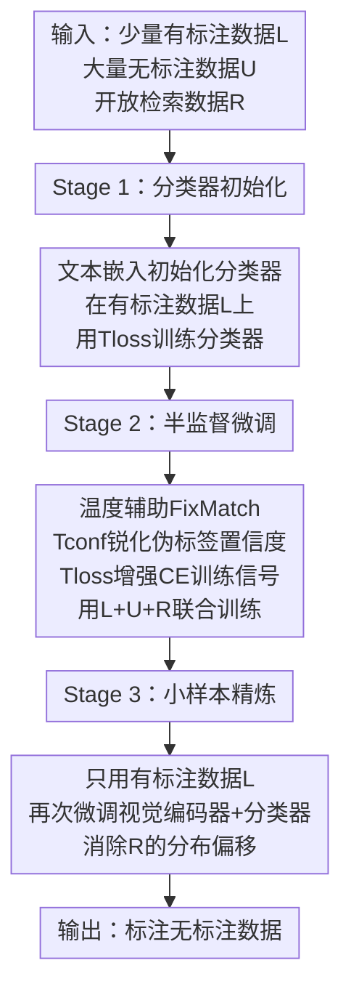

# Solving Semi-Supervised Few-Shot Learning from an Auto-Annotation Perspective

**会议**: ECCV 2026  
**arXiv**: [2512.10244](https://arxiv.org/abs/2512.10244)  
**代码**: [https://github.com/tian1327/SWIFT](https://github.com/tian1327/SWIFT)  
**领域**: 多模态VLM  
**关键词**: 半监督小样本学习, VLM微调, Temperature, 自动标注, 开放数据

## 一句话总结
本文从自动标注的现实视角研究半监督小样本学习（SSFSL），发现现有SSL方法直接微调VLM时会因VLM产生"平坦"的softmax概率分布而完全失效（未标注数据利用率为零、训练监督不足），提出用两个简单的温度参数（置信度温度 $T_{conf}$ 和损失温度 $T_{loss}$）来锐化softmax输出并增强训练信号，结合三阶段分步训练与外部开放数据检索，在5个细粒度基准上超越现有方法约5个点，甚至媲美全监督学习。

## 研究背景与动机

半监督小样本学习（SSFSL）天然对应自动标注这一现实需求：给定少量有标注的类别样本和大量无标注的同类数据，训练模型为无标注数据打上标签。这一设定在细粒度分类场景（鸟类品种、飞机型号、卫星图像地物分类等）中尤为重要，因为获取大量人工标注既耗时又昂贵。近年来，小样本学习（FSL）领域已经充分拥抱了预训练视觉-语言模型（VLM，如CLIP/OpenCLIP）和开放数据检索（从VLM的公开预训练集如LAION-400M中检索任务相关样本）这两大资源，取得了显著进展。然而，现有的半监督学习方法在很大程度上忽视了这些资源——它们要么仍然基于ImageNet预训练骨干从头训练，要么采用冻结VLM + prompt learning的方式，不敢微调整个模型。这造成了一个奇怪的局面：一个完全不使用无标注数据的FSL方法（FS-FT）反而比使用大量无标注数据的SSL方法效果更好。

为什么现有SSL方法在VLM上失效？作者通过深入实验分析，揭示了根因：VLM（尤其是对比学习预训练的模型）会产生"平坦"的softmax概率分布——无论输入是什么，模型对各类别的预测概率都接近均匀分布，最大值往往只有0.2-0.4。这带来了两个连锁问题：第一，FixMatch等基于伪标签的SSL方法依赖高置信度阈值（通常0.8）筛选可靠的伪标签，平坦分布下所有无标注样本的置信度都低于阈值，导致无标注数据利用率为零；第二，即使降低阈值，平坦分布提供的训练信号也非常弱，无法有效驱动模型收敛。此前的工作虽然观察到了这个现象，但未能找到根本原因。

本文的核心idea是：用**温度参数（temperature）**来锐化VLM的softmax输出，用一个极小的置信度温度 $T_{conf}=0.01$ 将平坦分布"压缩"为尖峰分布，使伪标签重新达到高置信度从而被利用；同时用可学习的损失温度 $T_{loss}$（初始值0.07）来增强交叉熵损失的训练信号强度。这两个温度参数协同作用，让FixMatch等传统SSL方法在VLM上重新有效，能在16-shot设定下带来14-20个点的巨幅提升。进一步，作者构建了三阶段训练方法SWIFT（Stage-Wise Finetuning with Temperatures），将分类器初始化、半监督微调、小样本精炼三个阶段与温度策略和开放数据检索有机结合，最终取得了超越现有FSL和SSL方法约5个点的SOTA性能。

## 方法详解

### 整体框架

SWIFT 采用一个三阶段的分步训练流水线，将视觉编码器和分类器（由类别名的文本嵌入初始化）逐步调优。第一阶段只用有标注的小样本数据训练分类器（冻结视觉编码器），为后续半监督微调提供更好的初始化；第二阶段同时利用有标注数据、无标注数据和检索到的开放数据，在温度辅助的FixMatch框架下对视觉编码器和分类器联合微调；第三阶段去掉无标注数据和噪声检索数据，只用有标注数据做少量epoch的精炼，以消除开放数据带来的分布偏移和类别不平衡。

### 关键设计

**1. 温度补救机制：置信度温度与损失温度协同**

VLM微调SSFSL的核心障碍在于对比学习预训练产生的"平坦"softmax分布。直接观察这个分布：对于一张输入图片，OpenCLIP对200个类别的预测概率几乎全部落在0.015-0.025之间，最大值仅约0.2——这导致所有无标注样本的置信度都低于FixMatch默认的0.8阈值，利用率完全为零。直观的替代方案是降低阈值，但这在无验证集的真实设定下几乎不可调，且低阈值会引入大量噪声伪标签。

本文的解决方案非常简单：引入两个独立的温度参数。置信度温度 $T_{conf}$ 直接对弱增强无标注图像的logits做缩放：$\mathbf{s}^w = \text{softmax}(\mathbf{W}^T\mathbf{V}(\mathbf{I}^w) / T_{conf})$。当 $T_{conf} = 0.01$ 时，原来在0.015-0.025之间的softmax概率被锐化为接近0或1的尖峰分布，最大置信度瞬间达到0.8以上。这使大量无标注数据重新满足FixMatch的高阈值筛选条件。但仅锐化置信度还不够——平坦分布下训练监督本身就弱，即使通过了阈值筛选，计算的交叉熵损失值也很小，不足以驱动有效的VLM微调。因此还需要第二个温度 $T_{loss}$（可学习参数，初始值0.07）来缩放计算CE损失时的logits：$\mathcal{L}_u = \frac{1}{|U|} \sum \mathbb{1}[max_c(s^c) \geq \sigma] \cdot \ell(\mathbf{W}^T\mathbf{V}(\mathbf{I}^s)/T_{loss}, \hat{y})$。$T_{loss}$ 的效果可以从损失曲线上直观看到：使用默认温度1.0时训练损失几乎不下降；$T_{loss}=0.07$ 时损失迅速下降，测试精度也从40%左右跃升至约55%。论文还发现，将 $T_{loss}$ 设为可学习参数（从0.07开始动态调整）比固定值效果更好，这可能是由于不同训练阶段需要不同的锐化程度。

这个设计之所以巧妙，在于它并非发明新损失或新架构，而是精准定位了VLM预训练（对比学习）与SSL微调（交叉熵）之间的"温度不匹配"：VLM预训练时softmax温度被卡在0.01（这是多模态对比学习训练稳定的需要），但下游SSL方法却默认温度1.0去解释它输出的logits——造成了实际概率分布与期望概率分布之间的鸿沟。补上一个0.01的置信度温度，本质上只是在告诉下游任务"请用预训练时的温度来读我的logits"。

**2. 开放数据检索与三阶段分步训练**

仅仅让FixMatch重新生效还不够——如果只利用有标注和无标注数据（$L$ 和 $U$），在较多样本（16-shot）下FixMatch w/ Temp.只能达到71.2%，与FSL方法FS-FT（69.1%）差距不大。要进一步突破，需要利用VLM公开预训练集（如LAION-400M）中检索到的任务相关开放数据 $R$。但 $R$ 天生存在三个问题：类别分布严重不平衡（某些类检索到上千张，某些类只有几十张）、标签噪声（检索基于文本匹配，图-文对并不严格对应类别）、以及与目标任务数据的域偏移（检索图与细粒度数据集风格差异大）。

直接把这些有噪声的 $R$ 和 $L$、$U$ 一起联合训练效果很差。作者设计了三阶段流水线来循序渐进地消化这些噪声数据。Stage 1 只用 $L$ 对分类器做linear probing（用 $T_{loss}$ 增强信号），目的是从文本嵌入初始化的分类器出发，先让分类器适应目标数据的分布。Stage 2 是核心——在温度辅助的FixMatch框架下，把 $L$、$U$、$R$ 三部分数据一起用于联合训练。这里有一个重要的实践细节：有标注样本 $L$ 和检索样本 $R$ 混合在一个batch里计算有监督损失 $\mathcal{L}_l$（对 $R$ 的噪声标签直接CE），而 $U$ 通过FixMatch的伪标签机制计算一致性损失 $\mathcal{L}_u$。$R$ 不加入无标注集，因为它的域偏移会干扰FixMatch的一致性正则化。Stage 3 则完全去掉 $U$ 和 $R$，只用 $L$ 再做几轮few-shot finetuning，目的是消除Stage 2中 $R$ 引入的分布偏移和噪声影响。这个 "用噪声数据增广 → 再精炼去掉噪声残留" 的思路与已有工作SWAT一致，但SWAT没有 $U$ 和温度，因此SWIFT每阶段提升都更显著。

**3. 无验证集的实用评估协议**

在真实自动标注场景中，有标注数据极度稀缺，不可能再从中切出验证集来调超参数。因此本文采用严格的"跨数据集调参"策略：所有超参数（学习率、weight decay、batch size等）在semi-Aves上确定后，直接应用到其余4个数据集，不做任何二次调整。温度的超参也是一样——$T_{conf}=0.01$，$T_{loss}$ 初始值0.07（可学习），所有数据集共用。这种设置下SWIFT仍能在5个数据集上稳定超越之前方法，说明温度策略对超参数是鲁棒的（$T_{conf}$ 在0.001到0.05的宽范围内都能稳定提升），且相比调阈值的老方法（在0.2-0.9之间精调还容易过拟合）更加实用。

### 损失函数/训练策略

SWIFT 在 Stage 2 使用三类损失联合训练：

- **有监督损失** $\mathcal{L}_l$：对有标注数据 $L$ 和检索数据 $R$ 计算CE，用 $T_{loss}$ 缩放logits
- **无监督一致性损失** $\mathcal{L}_u$：对无标注数据 $U$，先用 $T_{conf}$ 锐化弱增强视图的softmax获得伪标签 $\hat{y}$，再阈值筛选（$\sigma=0.8$），用 $T_{loss}$ 缩放强增强视图的logits计算CE
- **有监督检索损失**：$\mathcal{L}_r$ 与 $\mathcal{L}_l$ 合并处理（$R$ 和 $L$ 混合batch）

总损失：$\mathcal{L} = \mathcal{L}_l + \mathcal{L}_u$

视觉编码器学习率1e-6（小学习率保持预训练特征），分类器学习率1e-4。每阶段50 epoch，Stage 3为10 epoch。使用AdamW优化器和余弦退火调度器。

## 实验关键数据

### 主实验

实验在5个细粒度分类数据集（semi-Aves、FGVC-Aircraft、Stanford Cars、EuroSAT、DTD）上进行，骨干网络为OpenCLIP ViT-B/32。

| 设定 | 方法 | 4-shot | 8-shot | 16-shot |
|------|------|--------|--------|---------|
| FSL | FS-FT（仅用有标注数据） | 61.0 | 65.8 | 69.1 |
| FSL | SWAT（+检索开放数据） | 67.4 | 71.0 | 74.0 |
| SSL | FineSSL（冻结VLM调prompt） | 57.6 | 64.6 | 68.9 |
| SSL | FixMatch直接微调VLM | 39.3 | 49.9 | 57.2 |
| SSL | FixMatch + 温度（本文） | 57.7 | 65.7 | 71.2 |
| **SSFSL** | **SWIFT（本文）** | **71.5** | **76.3** | **79.7** |
| 参考 | 全监督（U有真实标签） | 74.8 | 75.4 | 76.0 |
| 参考 | 全监督+检索 | 76.0 | 76.8 | 77.2 |

SWIFT在4/8/16-shot下分别超出SOTA FSL方法SWAT约4.1/5.3/5.7个点，且16-shot结果（79.7%）甚至超过了全监督基线（76.0%），说明三阶段训练和温度策略成功利用了无标注数据中的额外信号。值得注意的是，FixMatch直接微调VLM在16-shot下（57.2%）甚至不如不使用无标注数据的FS-FT（69.1%），而加上温度后（71.2%）不仅反超，还超过了使用开放数据的SWAT（74.0% vs 71.2%在16-shot下有差距，但在4-shot下FixMatch+温度已接近SWAT）。

### 消融实验

| 配置 | 4-shot | 8-shot | 16-shot | 说明 |
|------|--------|--------|---------|------|
| FixMatch直接微调VLM | 39.3 | 49.9 | 57.2 | 基线，U利用率≈0% |
| + Stage 1（分类器初始化） | 56.3 | 59.8 | 62.2 | +$T_{loss}$在L上微调分类器 |
| + Stage 2（半监督微调，用$L+U+R$） | 68.8 | 73.3 | 77.3 | +$T_{conf}$+检索数据FixMatch |
| + Stage 3（小样本精炼）→ SWIFT | 71.5 | 76.3 | 79.7 | 只用$L$精炼消除$R$噪声 |
| 换成DebiasPL作为底层SSL方法 | 73.1 | 77.4 | 79.9 | SWIFT可与更强SSL方法结合 |

### 关键发现

- **温度是VLM微调的关键使能器**：FixMatch加温度后直接提升14-20个点，从不如FS-FT变为大幅超越。温度的作用机理被细致地拆解为两个独立维度——$T_{conf}$ 提升利用率（从~0%跃升至60-80%），$T_{loss}$ 增强监督信号（曲线从几乎平缓变为快速下降）。
- **三阶段各有贡献**：Stage 1贡献约5-17个点（低样本设定下更明显，因为分类器初始化的好坏在少样本时影响更大）；Stage 2贡献约6-11个点（这是开放数据+SSL温度的核心增益）；Stage 3贡献约2-3个点（精炼去噪）。三个阶段叠加效应明显，且每阶段提升数字可在所有5个数据集上稳定复现。
- **泛化性验证**：SWIFT在DINOv2骨干上同样有效，且提升更为显著（4-shot从50.2提到78.2，+28个点），说明温度机制并非OpenCLIP专属——任何对比学习预训练模型都存在平坦softmax问题。
- **超参数鲁棒**：$T_{conf}$ 在[0.001, 0.05]的宽区间内都能稳定带来大幅提升，而传统调阈值方法在无验证集设定下几乎不可行。
- **VLM vs ImageNet预训练的分水岭**：温度对于ImageNet预训练的ResNet-50或ViT反而是有害的（不加温度最好），但对于所有VLM（无论ResNet还是ViT架构）都是必需的——这确认了平坦softmax来源于对比学习预训练目标，而非网络架构差异。

## 亮点与洞察

- **洞察力驱动的简单方案**：本文最大的亮点在于定位了VLM微调失败的根因是"平坦softmax"，然后用一个极简的温度补救就解决了。这比设计复杂的自适应阈值方法（如FreeMatch）或专门为新骨干设计的SSL方法更优雅——不做加法，而是还原预训练和微调之间的温度匹配。
- **双温分解**：将温度的作用解耦为置信度温度（解决利用率）和损失温度（解决训练信号）两个独立维度，并通过细致的实验分别验证各自的影响。这种分解既简化了方法设计，也便于诊断其他VLM微调任务中的类似问题。
- **无验证集场景下的实用价值**：很多SSL论文在"我们有验证集可调"的假设下设计方法，而本文严格遵循无验证集协议，证明温度策略在此苛刻设置下的鲁棒性。这对自动标注等真实应用场景有直接指导意义。
- **可迁移的洞察**：任何需要微调对比学习预训练模型的下游任务（不仅仅是分类），都可能面临平坦softmax问题。温度策略可作为一个通用的预处理步骤嵌入各种现有SSL框架中，论文也验证了其在FixMatch和DebiasPL上的兼容性。

## 局限与展望

- **计算成本较高**：SWIFT使用三阶段训练和大量检索数据（每类500张图片），在semi-Aves 16-shot设定下训练时间约8小时（单RTX 4090），比FS-FT（0.3h）和SWAT（2h）都长很多。虽然性能提升显著，但在计算资源受限场景下需要权衡。
- **检索数据依赖**：开放数据检索本身有天花板——论文Tab.11显示从每类500张增加到1000张仍能提升性能，说明尚未饱和；但检索的质量（噪声标签、域偏移程度）会直接影响结果。如何在不依赖于大规模公开预训练集（如只有小规模领域内数据）的场景下设计类似的SSFSL方法，仍然是开放问题。
- **验证集缺失的代价**：虽然无验证集设定更真实，但也意味着无法根据具体任务微调温度等超参数。论文通过宽范围鲁棒性实验来缓解这一问题，但某些极端任务可能落在鲁棒区间之外。
- **极端类别不平衡**：5个基准数据集的类别分布基本均衡，但真实世界自动标注任务往往面临长尾分布。极端不平衡下，温度策略是否依然鲁棒（少数类的伪标签会否被平坦分布完全湮没）有待检验。

## 相关工作与启发

- **vs FixMatch / DebiasPL（传统SSL方法）**：它们的标准实现假设骨干网络产生锐利softmax分布，因此使用高置信度阈值。本文揭示了这个假设在VLM骨干下不成立，并在不改变算法结构的前提下用温度修复了VLM的平坦softmax，使这些方法重新生效。这种"修复底层假设而非重写算法"的思路值得借鉴。
- **vs FineSSL（冻结VLM调prompt）**：FineSSL通过prompt learning让冻结VLM适应下游任务来避免微调困难，但性能上被SWIFT超越（68.9 vs 79.7在16-shot），说明在足够数据下微调VLM的效果仍然优于prompt learning。
- **vs SWAT（FSL + 开放数据检索）**：SWAT和SWIFT都使用检索数据 + 三阶段训练，但SWAT不使用无标注数据且不使用温度。SWIFT在检索数据基础上多利用了无标注数据，结合温度使其有效，取得了约5个点的进一步提升。
- **vs FreeMatch（自适应阈值SSL）**：FreeMatch不依赖固定高阈值，而是根据模型学习状态自适应调整每类阈值。论文实验（Fig.13）表明，FreeMatch虽然能提升利用率（>60%），但缺乏$T_{loss}$提供的训练信号强化，精度仍然很低——说明单独的利用率提升是不够的，必须与损失温度配合。

## 评分

- 新颖性: ⭐⭐⭐⭐ 根因发现（平坦softmax）和极简解决（温度）的对比构成了强insight，但方法本身是极简的工程模式——好在简洁本身就是一种创新。
- 实验充分度: ⭐⭐⭐⭐⭐ 5个基准×3种shot设定×多个骨干（OpenCLIP/DINOv2/ImageNet）- 消融细致到每个阶段的增益 - 温度鲁棒性分析非常全面（宽范围、多种子、可学习vs固定）- 还对比了不同SSL方法上的集成效果。
- 写作质量: ⭐⭐⭐⭐⭐ 问题发现→根因分析→解决方案→系统性验证的叙事结构清晰流畅，Fig.3将"平坦分布→低利用率→弱监督"三个问题的因果链可视化得非常直观，是"用图讲故事"的范本。
- 价值: ⭐⭐⭐⭐⭐ SSFSL的现实场景（自动标注）需求明确，温度方案简单到可以立即复制到任何现有SSL代码库中，且5个点的大幅提升在少样本领域属于重大进步。

<!-- RELATED:START -->

## 相关论文

- [\[CVPR 2026\] Multi-Modal Representation Learning via Semi-Supervised Rate Reduction for Generalized Category Discovery](../../CVPR2026/multimodal_vlm/multi-modal_representation_learning_via_semi-supervised_rate_reduction_for_gener.md)
- [\[ICLR 2026\] Exploring Cross-Modal Flows for Few-Shot Learning](../../ICLR2026/multimodal_vlm/exploring_cross-modal_flows_for_few-shot_learning.md)
- [\[CVPR 2026\] Addressing Exacerbated Attention Sink for Source-Free Cross-Domain Few-Shot Learning](../../CVPR2026/multimodal_vlm/addressing_exacerbated_attention_sink_for_source-free_cross-domain_few-shot_lear.md)
- [\[CVPR 2025\] UNEM: UNrolled Generalized EM for Transductive Few-Shot Learning](../../CVPR2025/multimodal_vlm/unem_unrolled_generalized_em_for_transductive_few-shot_learning.md)
- [\[CVPR 2026\] Noise-Aware Few-Shot Learning through Bi-directional Multi-View Prompt Alignment](../../CVPR2026/multimodal_vlm/noise-aware_few-shot_learning_through_bi-directional_multi-view_prompt_alignment.md)

<!-- RELATED:END -->
