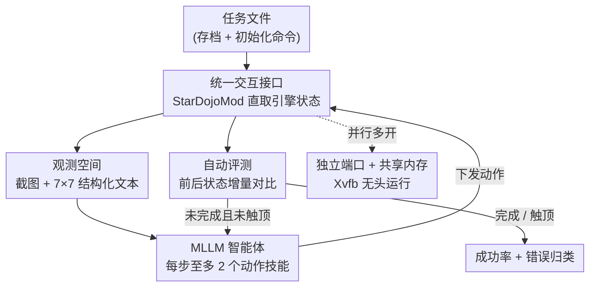

# StarDojo: Benchmarking Open-Ended Behaviors of Agentic Multimodal LLMs in Production–Living Simulations with Stardew Valley

**会议**: ECCV 2026  
**arXiv**: [2507.07445](https://arxiv.org/abs/2507.07445)  
**代码**: [https://weihaotan.github.io/StarDojo](https://weihaotan.github.io/StarDojo)  
**领域**: 多模态VLM / Agent  
**关键词**: MLLM 智能体, 开放世界基准, 生产-生活模拟, 长程规划, 星露谷物语

## 一句话总结
本文基于《星露谷物语》构建了 StarDojo——首个把「生产活动」与「社交生活」耦合在一起评测的开放世界 MLLM 智能体基准，含 1000 个精标任务，最强的 GPT-4.1 也只有 12.7% 成功率，暴露出当前 MLLM 在视觉理解、多模态推理与低层控制上的严重短板。

## 研究背景与动机
人类社会的复杂性体现在「生产-生活系统」里：一个人既要从事种地、制造、采集这类生产活动，也要参与社交、维系关系、融入社区这类生活活动，而两者并非彼此独立，而是互相强化又互相约束——生产成果是社交参与的物质基础，社交关系又反过来打开新配方、新折扣、新的协作机会，直接影响能拿到什么资源。时间、精力、天气、季节这些环境动态进一步把这两条线拧在一起，逼着人在共享约束下不断权衡资源产出、社交承诺与长期规划。现有的交互式基准恰恰把这层耦合切断了：Atari、StarCraft、MineDojo 这类传统 RL / 游戏环境要么只考技能执行和策略博弈、文本信息形同虚设，要么社交场景干脆缺席；而 Smallville、AvalonBench 这类「生成式智能体 / 社交推理」基准则反过来只关注多智能体的对话与推理，没有结构化的生产活动和资源生成机制，社交因此和物质约束、长期发展权衡完全脱钩。

最接近的两个前作各有硬伤。MineDojo 依托 Minecraft 提供了开放世界的丰富任务，但玩法主要围绕「和自然打交道」，几乎没有类人的社交互动，而且复杂的 3D 导航控制对 LLM 智能体极不友好，连简单任务都难完成；CivRealm 虽然覆盖人口、生产、经济等多种任务，但停留在国家级的宏观战略层，和 StarDojo 想考的「个体粒度的日常决策」不是一回事。更早在星露谷上做过初步尝试的 Cradle 也已经指出：当前 SOTA 智能体在多模态理解、长程规划和资源管理上都力不从心。于是这个领域至今缺一个系统性的评测平台，去回答一个智能体到底能不能在「耦合的、受约束的」人类生活结构里正常运转。

之所以现在才可能做这件事，一是《星露谷物语》本身是少数几款能跨 Linux / macOS / Windows 运行、且采用 2D 俯视视角（视野更宽、导航更友好）的开放式模拟 RPG，天然把生产、社交、经济、时间管理集成在一个结构化又开放的世界里；二是它有成熟的官方 Mod 框架 SMAPI，能直接暴露游戏事件与内部状态，让「不靠模拟键鼠、直接拿渲染图与结构化状态」的自动化交互成为可能。本文的核心 idea 是：**把《星露谷物语》改造成一个统一、易用、可并行的智能体基准 StarDojo——用一个绕开键鼠、直取游戏引擎状态的 Mod 接口，配上 1000 个覆盖「农耕/制造/探索/战斗/社交」五域三难度的精标任务和自动评测，第一次在同一个环境里同时考核 MLLM 智能体的生产能力与社交生活能力。**

## 方法详解

### 整体框架
StarDojo 不是一个「模型」而是一套「环境 + 基准」，它要解决的问题是：商业游戏《星露谷物语》只支持人类式交互（看截图、按键鼠），且窗口必须前台激活、无法多开，这让自动化评测和大规模数据采集几乎不可能。整套系统的转法是：由可配置的任务文件启动环境，Python Wrapper 通过一个自研 Mod（StarDojoMod，基于 SMAPI，用 C# 实现以对齐游戏引擎）经 socket / 共享内存与并行的游戏引擎通信，直接拿到渲染图和内部状态、下发动作技能；智能体（由某个 MLLM 驱动）在每一步收到「截图 + 结构化文本观测」，输出至多两个动作技能顺序执行，执行完环境暂停等待下一步；每步结束后自动评测器对比前后状态、判断任务是否完成或触顶最大步数。

### 关键设计

**1. 生产-社交双向反馈的任务体系：把「耦合」写进基准而非拼盘**

现有基准的通病是把生产和社交当成两个互不相干的模块并列摆放，考不出「资源约束下的权衡」。StarDojo 精心策划了 1000 个任务，分成农耕、制造、探索、战斗、社交五大类，每类再切成 easy / medium / hard 三档，核心在于难度的递进正好对应「耦合度」的递进：easy 任务把所需物品、工具、位置都预置好（如成熟待收的作物、就在店里且预算充足），只考最基础的原子操作；medium 任务要求智能体自己去满足前置条件（种地收获、凑齐制造原料、从农场跋涉到目标区、赚够钱），而且很多资源有多种获取路径，给了智能体可观的策略自由度；hard 任务通常要跨好几个游戏日、由多个 medium 子任务串成一条互相依赖的生产链——比如从种子种到收获，必须先翻地、每天浇水、连续多日、最后才收，中间漏浇一天就可能延迟甚至绝收。这样一来，生产成果解锁社交（送礼、参加节日、供养家庭），社交进展又回过头开新配方、给折扣、带来协作机会，双向反馈被显式编码进任务依赖里，而不是靠两组孤立任务硬凑。此外还提供了一个极端长程的 Playthrough 任务：从零起步攒到 100 万游戏币（通常需要数百游戏日），专考跨季规划与长期经营。

**2. 绕开键鼠、直取引擎状态的统一接口：让 MLLM 能「无摩擦」地玩商业游戏**

商业游戏只给人玩，截屏慢、键鼠糙、还不能多开，这是自动化评测的第一道墙。作者在 SMAPI 之上自研 StarDojoMod，通过 socket 服务器与游戏引擎实时通信，直接抓渲染帧（省掉耗时的屏幕捕获）、读内部状态（角色位置、状态、环境信息），并把一批可调用函数暴露成「动作技能」，从而超越传统键鼠。特别地，它通过直接改写游戏内部状态实现了可配置的「暂停-恢复」机制：模型推理和规划时游戏暂停，动作执行前再恢复——这对高延迟的闭源 API 智能体至关重要（后面消融会看到关掉它的代价）。对上层，作者封装了 Python Wrapper 负责取观测、执行动作、定制任务，让研究者几乎零门槛接入。这套设计还顺带解决了多开与跨平台：每个游戏实例分配独立端口、必要时用共享内存把取观测时延压到 30ms 级，配合 Xvfb 无头运行，支持在无图形界面的 Linux 上跑，也支持三大主流系统。

**3. 双模态观测 + 十动作精简动作空间：既给足信息又逼出真实探索能力**

星露谷独特的像素画风让 SOTA MLLM 很难只靠视觉精确操作，因此 StarDojo 给出「视觉 + 文本」双模态观测：每步一张截图，外加结构化文本描述角色状态（血量、精力、金钱、物品栏）、以角色为中心的 $n\times n$ 邻域瓦片信息（实验用 7×7）、以及时间/天气/菜单等游戏级全局信息。值得玩味的是它对信息的「刻意取舍」：地图级全局信息（能直接定位目标、给探索抄近道）虽然能大幅提分，却被故意排除在实验配置外，就是为了逼智能体靠视觉去做真实探索。动作空间则被精简成十个基本动作（`move` / `use` / `interact` / `choose_item` / `attach_item` / `craft` / `choose_option` / `menu` / `navigate` 等），既覆盖键鼠能做的绝大多数玩法、又剔除对决策无贡献的冗余操作；其中提供高层跨图传送的 `navigate` 在实验里被禁用，同样是为了让动作空间更贴近人类交互、考出真实的跨场景移动能力。

**4. 基于增量状态对比的自动评测：一套评测器适配所有任务且不受初值干扰**

任务多、还会持续新增，评测机制必须可复用、可扩展、且能实时给奖励反馈。StarDojo 的做法是维护一套统一的、基于文本观测对比的评测系统：每步执行完动作后调用评测器，它保存上一帧观测、取当前帧观测，按任务的评测器类型（如 harvest、sell）和目标对象检测相关状态变化（如物品栏增量、周围瓦片变化），把每步增量累加，再对照预设成功条件（数量阈值、事件触发）判定完成。用增量而非绝对状态来判断，关键好处是消解了不同任务初始条件带来的差异，让同一套评测逻辑能稳健地泛化到千余个异质任务上；评测输出的完成状态与当前进度还兼作奖励反馈回传给智能体。为标准化初始状态，作者另配了一套 simulator API 与预置存档，任务开始时自动加载对应存档并执行任务特定命令，把物品、装备、技能等级、日期、农场状态一次性配好。

## 实验关键数据

### 主实验
在 StarDojo-Lite（100 个代表性任务）上评测 7 个 MLLM，每任务跑 3 次，easy/medium/hard 分别限 30/50/150 步。总成功率如下（%）：

| 模型 | 类型 | 总成功率 | easy | medium | hard |
|------|------|---------|------|--------|------|
| GPT-4.1 | 闭源 | **12.7** | 21.4 | 2.7 | 0.0 |
| Gemini 2.5 Pro | 闭源 | 10.7 | 17.9 | 2.7 | 0.0 |
| Claude 3.7 Sonnet | 闭源 | 10.3 | 16.1 | 5.3 | 0.0 |
| Llama 4 Maverick | 开源 | 7.7 | 13.1 | 1.3 | 0.0 |
| GPT-4.1 mini | 闭源 | 7.0 | 11.3 | 2.7 | 0.0 |
| Qwen2.5-VL-72B | 开源 | 6.7 | 11.9 | 0.0 | 0.0 |
| Gemma 3 27B | 开源 | 4.0 | 6.6 | 1.3 | 0.0 |

旗舰闭源模型（GPT-4.1 / Gemini 2.5 Pro / Claude 3.7）均破 10%，开源模型全部低于 8%；所有模型在 medium 上普遍个位数、hard 上几乎清一色 0.0。分域看，各家在农耕、制造上尚有些许战力（GPT-4.1 农耕 easy 达 31.0），但探索、战斗、社交则集体崩盘——战斗类多数模型直接 0.0。

### 消融实验
用 GPT-4.1 在 5 个代表任务上做四种设置对比（Image+Text 默认 / Image Only / Text Only / Real-Time 不暂停）：

| 配置 | 现象 | 说明 |
|------|------|------|
| Image + Text | 基线 | 完整双模态观测 |
| Image Only | 全线大幅下降 | 去掉文本后暴露基座模型「纯视觉控制」的缺陷，凸显文本对细粒度动作 grounding 的重要性 |
| Text Only | 导航类任务显著下滑（如 Ship 1 Parsnip、Go to Bus Stop） | 去掉视觉后空间推理与移动能力垮掉 |
| Real-Time | 需及时反应/长动作序列的任务明显受损 | 不暂停时，战斗类（如 Kill 1 Bug）目标已移开、长程类（如 Chop 20 Wood）游戏时间流逝拖到夜里甚至跨天 |

### 关键发现
- **导航是头号瓶颈**：所有模型最卡的是导航——受限于图像理解，它们始终难以准确识别并定位目标物体、建筑出入口、地图切换点（这些信息通常只出现在图像而非文本里），因此在需要跨图移动的探索、社交任务上成功率尤其低；相对地，视野内直接可达的 easy 农耕任务表现最好。
- **错误归因四类**：对 GPT-4.1 的错误分析显示，视觉理解占 42%（目标物体常只有约 10×10 像素、且难判断相对角色的方位，连相邻瓦片是否已翻/已播/已浇/受阻都会看错）、多模态推理占 21%（过度依赖有限视觉、无视文本里明确的位置/状态信息，还会幻觉性地误以为上一步已成功）、长程规划占 21%（能提出合理子任务却过早放弃、策略反复横跳，叠加领域知识不足）、低层控制占 16%（偶发选错动作或参数格式错误）。
- **实时性是被前人忽视的维度**：闭源模型经 API 推理常需 10 秒以上，实时不暂停时战斗目标早已移位、长程任务游戏内耗时从 2 小时膨胀到 12+ 小时；小型开源模型推理快但能力弱，构成「推理效率↔能力」的根本权衡。

## 亮点与洞察
- **把「生产-社交耦合」做成基准的第一性设计**：不是把生产任务和社交任务并排堆一起，而是让二者通过任务依赖形成双向反馈闭环（Table 1 里 StarDojo 是唯一同时勾齐 open-endness / 长程规划 / 日常规划 / 生产 / 社交 / 经济 / 语言 API 七项的环境），这才真正逼近人类生活的约束结构。
- **「刻意不给捷径」的评测哲学很值得借鉴**：地图级全局信息和 `navigate` 传送明明能大幅提分却被故意关掉，为的是考出真实的视觉探索与跨图移动能力——这提醒基准设计者，给太多结构化捷径会掩盖模型的真实短板。
- **首次系统论证「实时性」对 agent 评测的影响**：多数前作在离线暂停环境里评测，看似有效的智能体一旦进入不暂停的真实部署，推理延迟就成瓶颈；这个 caveat 对所有做游戏 / 具身 agent 的人都有警示价值。
- **基于增量状态对比的通用评测器可迁移**：用「前后观测差」而非绝对状态判定完成，天然消解初值差异、一套逻辑适配千余异质任务，这套思路可直接搬到其他需要大规模自动评测的开放世界基准。

## 局限与展望
- 作者承认：运行 StarDojo 需自备正版《星露谷物语》；钓鱼这类独立的实时小游戏因不适合评 MLLM 暂未纳入；基准主要覆盖主山谷图的早中期内容，沙漠、姜岛等进阶区域尚未支持。
- 作者也明确不宣称 StarDojo 评的是「全方位开放式社交智能」——「社交」概念太宽，本文聚焦的是具身环境里「情境化的社交决策」。
- 评测仅在 StarDojo-Lite 上用 7 个模型完成，更广的任务 / 模型 / agent 框架（如带记忆、带反思、带工具的复杂 agent 架构，而非本文相对朴素的单模型 baseline）覆盖仍待补齐。
- 自己发现的一点：medium/hard 几乎全线 0.0，导致这两档目前区分度有限；在基座模型显著变强前，基准的评测重心实际落在 easy 档，长程能力的细粒度刻画还得等模型跟上。

## 相关工作与启发
- **vs MineDojo**: 二者都是开放世界游戏基准，但 MineDojo 玩法偏「和自然交互」、几乎无类人社交，且 3D 导航对 LLM 极不友好；StarDojo 用 2D 俯视视角降低导航难度，并把社交与经济做成一等公民，补上了「生产-生活耦合」这块空白。
- **vs CivRealm**: CivRealm 考国家级宏观战略（人口、生产、经济管理）；StarDojo 聚焦个体粒度的日常决策，粒度与视角完全不同。
- **vs Smallville / AvalonBench（生成式 / 社交推理智能体）**: 它们动作空间基本局限于对话、社交与物质约束脱钩；StarDojo 把社交嵌入受资源与时间约束的具身任务里，社交进展会实打实反哺生产。
- **vs Cradle / Voyager**: Voyager 靠 Minecraft 内置 API 展示了 in-context 终身学习，但强依赖内置 API、难迁移；Cradle 用统一接口无需 API 跨多款商业游戏作业，并在星露谷上初步暴露了 SOTA agent 的短板——StarDojo 正是把这条线扩展成一个成熟、可复现、可并行的完整基准。

## 评分
- 新颖性: ⭐⭐⭐⭐⭐ 首个把生产与社交生活耦合评测的开放世界 MLLM 基准，Table 1 七项能力唯一全勾。
- 实验充分度: ⭐⭐⭐⭐ 覆盖 7 个主流开/闭源 MLLM、四设置消融、四类错误归因与成本分析；但缺带记忆/反思/工具的复杂 agent 架构对比。
- 写作质量: ⭐⭐⭐⭐ 动机清晰、任务与接口设计交代详尽，附录任务清单与评测算法完整可复现。
- 价值: ⭐⭐⭐⭐⭐ 最强模型仅 12.7%，清晰定位了视觉理解/多模态推理/长程规划/实时性四大短板，是开放世界 agent 的高价值 testbed。

<!-- RELATED:START -->

## 相关论文

- [\[ECCV 2024\] Towards Open-ended Visual Quality Comparison](../../ECCV2024/multimodal_vlm/towards_open-ended_visual_quality_comparison.md)
- [\[ICML 2026\] ECA: Efficient Continual Alignment for Open-Ended Image-to-Text Generation](../../ICML2026/multimodal_vlm/eca_efficient_continual_alignment_for_open-ended_image-to-text_generation.md)
- [\[CVPR 2026\] GUIDE: A Benchmark for Understanding and Assisting Users in Open-Ended GUI Tasks](../../CVPR2026/multimodal_vlm/guide_a_benchmark_for_understanding_and_assisting_users_in_open-ended_gui_tasks.md)
- [\[ICLR 2026\] Decoding Open-Ended Information Seeking Goals from Eye Movements in Reading](../../ICLR2026/multimodal_vlm/decoding_open-ended_information_seeking_goals_from_eye_movements_in_reading.md)
- [\[ECCV 2026\] ProactiveBench: Benchmarking Proactiveness in Multimodal Large Language Models](proactivebench_benchmarking_proactiveness_in_multimodal_large_language_models.md)

<!-- RELATED:END -->
