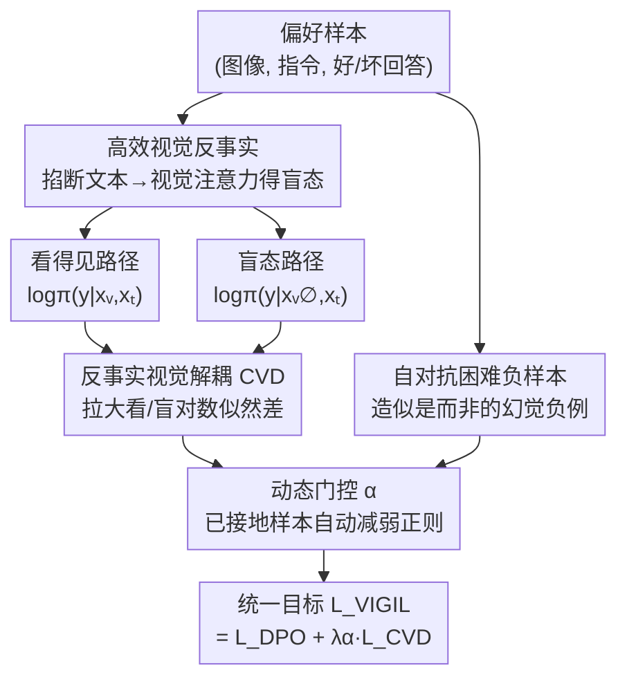

# Staying VIGILant: Mitigating Visual Laziness via Counterfactual Visual Alignment in MLLMs

**会议**: ECCV 2026  
**arXiv**: [2606.26387](https://arxiv.org/abs/2606.26387)  
**代码**: [https://xixiaouab.github.io/VIGIL/](https://xixiaouab.github.io/VIGIL/) (项目页)  
**领域**: 多模态VLM / 对齐RLHF  
**关键词**: 多模态幻觉, 视觉惰性, 反事实对齐, DPO, 视觉信息增益

## 一句话总结
针对 MLLM「明明看到了正确视觉证据却被语言先验带偏」的视觉惰性问题，本文提出 VIGIL，把一个「屏蔽视觉注意力的反事实盲态」当作负锚点塞进 DPO 偏好优化，用几何约束显式拉大「看得见」与「看不见」两种状态下的对数似然差距，从而强迫模型的高置信度回答因果地锚定在像素上——仅用 25% 偏好数据就超过 SOTA，还意外涌现出空间定位能力。

## 研究背景与动机
多模态大模型（MLLM）如今已经从「感知工具」升级成能解数学题、读财报图的「推理引擎」，但幻觉始终是可靠性上的一道坎。在多模态语境下，幻觉不只是「看错了」这么简单，而是一种更深层的**视觉接地失败**：模型生成的描述根本得不到眼前像素的支持。机制可解释性的研究进一步指出，根源往往是一种被称作「视觉惰性」（visual laziness）的现象——现代 MLLM 把一个视觉编码器接到一个在海量纯文本上预训练过的、以文本为中心的 LLM 上，这个 LLM 天生携带极强的语言先验；面对复杂多模态输入时，模型的推理会默认退回到这些先验，而不是去看图。多篇工作揭示出一个耐人寻味的反差：正确的视觉特征其实好端端地存在于模型的隐空间里，模型「内心」看到了对的东西，最后「嘴上」却说错了，因为语言相关性劫持了解码过程。

现有缓解手段各有明显代价。一类靠改架构，引入外部工具或模块化设计把感知和推理拆开，但这破坏了端到端学习的优雅；一类用在线强化学习动态挑选视觉 token，带来巨大算力开销和训练不稳定；而以 DPO 为代表的、基于结果的偏好对齐，问题更隐蔽——它在最终文本输出上最小化偏好损失，惩罚错误 token，却**完全不约束模型是怎么得出这个答案的**。如果 MLLM 靠语言先验（而非视觉证据）蒙对了答案，标准 DPO 照样奖励这个输出，等于在无意中强化了走捷径的坏习惯，把视觉惰性原封不动地保留下来。作者由此点破一个更本质的判断：**正确性并不是接地的充分代理**——模型完全可以「因为错误的理由蒙对答案」，只优化结果奖励反而会固化因果归因错误。

于是本文的切入角度非常直接：既然问题是「模型不肯依赖视觉」，那就得把「失明的后果」摆到它面前让它疼一次。**核心 idea：构造一个屏蔽视觉注意力的「反事实盲态」$x_{\text{v}}^{\emptyset}$，把「看得见的状态优于看不见的状态」写成一个偏好项塞进 DPO，用几何约束显式最大化视觉输入与回答之间的互信息（视觉信息增益 VIG），专门惩罚那些「即便看不见也照样自信」的盲目自信样本，逼着高置信输出因果地锚定在像素上。**

## 方法详解

### 整体框架
VIGIL 是一个纯离线的后训练框架，输入是标准的多模态偏好数据 $(x_{\text{v}}, x_{\text{t}}, y_w, y_l)$（视觉输入、文本指令、优/劣回答），输出是一个「不敢再瞎猜」的对齐后策略。它的骨架仍是 DPO，但在偏好优化回路里插入了「反事实视觉解耦」这一层几何约束。整个流程可以拆成三件事：先对每个训练样本跑**双路前向**——一路正常「看得见」，一路把文本对视觉 token 的注意力屏蔽掉制造「盲态」；再用**视觉信息增益（VIG）几何约束**去对比同一个好回答 $y_w$ 在这两种状态下的似然，惩罚盲态下仍然过高的置信度；最后用一个**动态门控 $\alpha$** 把这项 CVD 约束和标准 DPO 损失自适应地加权融合，得到统一目标 $\mathcal{L}_{\texttt{VIGIL}} = \mathcal{L}_{\text{DPO}} + \lambda\alpha\mathcal{L}_{\text{CVD}}$。此外还配了一个自对抗的困难负样本挖掘模块，专门喂给模型细粒度的视觉判别梯度。

关键在于「盲态」的实现方式：它不是把图片涂黑/打乱这种物理破坏，而是保持图像、视觉 token、投影输出、位置编码全部不变，**只在每一层 attention 里把文本 query 对视觉 key/value 的连接掐断**。这样一来两条路径的唯一差异就是「能不能读到视觉」，VIG 度量的就是纯粹由视觉带来的不确定性下降，避免了涂黑图带来的分布偏移污染。

### 关键设计

**1. 视觉信息增益 VIG：给「视觉到底有没有用」一个可优化的标尺**

痛点很直白：标准 DPO 只盯着最终文本对不对，根本没有一个量能衡量「这个答案有多依赖视觉」。作者从最大互信息（MMI）思路出发，把 VIG 定义成视觉输入 $x_{\text{v}}$ 与回答 $y$ 之间、在指令 $x_{\text{t}}$ 条件下的逐点互信息（PMI），落到实处就是同一回答在「看得见」和「盲态」两种条件下的对数似然之比：

$$\text{VIG}(y, x_{\text{v}}|x_{\text{t}}) = \log\frac{\pi_\theta(y|x_{\text{v}}, x_{\text{t}})}{\pi_\theta(y|x_{\text{v}}^{\emptyset}, x_{\text{t}})}$$

其中 $x_{\text{v}}^{\emptyset}$ 是注意力屏蔽出来的盲态，功能上等价于对视觉模态做了一次 do-intervention 干预。这个量的物理含义是「单靠视觉证据带来的不确定性下降」：VIG 接近 0，就说明模型全靠语言先验作答、把视觉当成了统计冗余，正是视觉惰性的核心症状。有了这把标尺，作者把多模态对齐重新表述成一个约束优化——在最大化偏好奖励的同时，要求好回答的条件互信息 $\mathbb{E}[\text{VIG}(y_w, x_{\text{v}}|x_{\text{t}})] \geq \delta$ 超过阈值，从而把多模态流形从纯文本流形上「掰开」，防止优化坍缩到只靠语言的捷径上。

**2. 反事实视觉解耦 CVD 损失：把「看得见 ≻ 看不见」变成一个偏好对**

上面那个带约束的优化问题不好直接解，作者引入拉格朗日乘子 $\lambda \geq 0$ 把约束项吸收进目标，然后做了一个很巧的转化：**把「对同一个好回答 $y_w$，看得见的状态 $(x_{\text{v}}, x_{\text{t}})$ 应当优于盲态 $(x_{\text{v}}^{\emptyset}, x_{\text{t}})$」直接实例化成一个 Bradley-Terry 偏好对**。于是拉格朗日项摇身一变成了一个和 DPO 同构的损失：

$$\mathcal{L}_{\text{CVD}}(\pi_\theta) = -\mathbb{E}_{\mathcal{D}}\left[\log\sigma\left(\beta\log\frac{\pi_\theta(y_w|x_{\text{v}}, x_{\text{t}})}{\pi_{\text{ref}}(y_w|x_{\text{v}}, x_{\text{t}})} - \beta\log\frac{\pi_\theta(y_w|x_{\text{v}}^{\emptyset}, x_{\text{t}})}{\pi_{\text{ref}}(y_w|x_{\text{v}}^{\emptyset}, x_{\text{t}})}\right)\right]$$

它的作用是：如果一个回答在抹掉视觉后似然**没有下降**，就说明这个回答本就不依赖视觉，CVD 会重罚这种「盲目自信」。一个容易被忽略但作者特意强调的实现细节是——冻结的参考模型 $\pi_{\text{ref}}$ 必须在**和策略模型相同的注意力掩码下**评估：看得见那一项两个模型都用 see 掩码，盲态那一项两个模型都用 blind 掩码。这样比较的才是「匹配的看/盲状态」，而不是拿盲策略去和看得见的参考项做归一化，避免了参考模型错配带来的伪信号。相比 DA-DPO 那种「按难度隐式重加权」的做法，CVD 是对输入几何做**物理干预**，消融里这一项贡献最大（POPE 涨 3.2 个点），是全方法的命脉。

**3. 动态门控 $\alpha$ 与自对抗困难负例：该管的时候管，不该管的时候松手**

如果对所有样本都一视同仁地施加 CVD 约束，会有个副作用：那些本来就已经好好看图的样本被过度正则化，反而伤害语义流畅度。作者设计了一个动态门控因子，用当前样本的「看/盲似然差」（也就是 VIG gap）来自适应调节约束强度：

$$\alpha = 1 - \tanh\left(\left|\log\pi_\theta(y_w|x_{\text{v}}, x_{\text{t}}) - \log\pi_\theta(y_w|x_{\text{v}}^{\emptyset}, x_{\text{t}})\right|\right)$$

当一个样本 VIG gap 已经很大（视觉接地良好）时，$\alpha$ 自动趋近 0、放松正则；只对那些看/盲差异小、明显在偷懒的样本重点施压。消融显示去掉动态门控只掉 1.1 个点，属于锦上添花但稳定梯度流的角色。与此配套的还有**自对抗困难负例挖掘**：用参考模型主动生成「加入貌似合理但实际不存在的细节」的幻觉式负样本 $y_{\text{hard}}$，替换掉标准 DPO 里较弱的 $y_l$，给模型更锐利的细粒度视觉判别梯度。最终统一目标写作 $\mathcal{L}_{\texttt{VIGIL}} = \mathcal{L}_{\text{DPO}}(y_w, y_{\text{hard}}) + \lambda\cdot\alpha\cdot\mathcal{L}_{\text{CVD}}$，让模型学会的不只是「说什么」，而是「凭什么这么说」。

### 损失函数 / 训练策略
全程用 OpenRLHF 框架，全参数微调，只训 1 个 epoch 防止过拟合偏好集。KL 系数 $\beta$ 固定 0.1，权重系数 $\lambda = 1.0$（消融验证是幻觉抑制与推理性能的良好平衡点），学习率 $5\times10^{-7}$ + cosine 衰减，72B 全局 batch 2048、7B 为 1024。72B 训练用 DeepSpeed ZeRO-3 + CPU offloading + FlashAttention-2，7B 用 FSDP。反事实盲态通过操作 attention mask 实现而非改物理输入张量，因此盲路前向几乎零额外开销——CVD 约束带来的额外 TFLOPs 不到总前向-反向的 1%。

## 实验关键数据

### 主实验
在 Qwen2.5-VL 从 7B 到 72B 上，VIGIL 在幻觉与推理各项指标上全面 SOTA，且**模型越大增益越大**——7B 在 POPE-Adv 上涨 4.1 点，72B 涨到 5.3 点，佐证了「后训练 scaling law」：更强的基座能更好地利用反事实视觉信号。相比之下 SimPO 这类纯文本中心方法在多模态任务上收益递减。

| 基座 / 方法 | POPE-Adv↑ | AMBER-Gen↑ | MMHal-Score↑ | MathVista↑ | MMBench↑ |
|--------|------|------|----------|------|------|
| Qwen2.5-VL-7B + DPO | 82.8 | 42.5 | 36.8 | 48.0 | 64.6 |
| 7B + DA-DPO (前SOTA) | 84.2 | 44.8 | 38.5 | 48.8 | 65.9 |
| **7B + VIGIL** | **86.9** (+4.1) | **46.5** (+4.0) | **40.2** (+3.4) | **49.5** | **67.3** |
| Qwen2.5-VL-72B + DPO | 84.5 | 46.8 | 40.5 | 54.1 | 68.1 |
| 72B + DA-DPO (前SOTA) | 87.4 | 49.8 | 44.2 | 55.4 | 70.3 |
| **72B + VIGIL** | **89.8** (+5.3) | **52.2** (+5.4) | **46.0** (+5.5) | **56.6** | **72.1** |

跨架构验证（Table 2）上，VIGIL 在投影器式的 LLaVA-OneVision-7B 和视觉中心的 InternVL2.5-26B（带 6B 视觉编码器）上都比 DPO 在 POPE-Adv 上稳定提升约 4.0 点——说明**即便视觉编码器很强，模型照样会犯视觉惰性**，反事实屏蔽能有效对治。

### 消融实验

| 配置 | POPE-Rand↑ | AMBER-Gen↑ | 说明 |
|------|---------|------|------|
| Full VIGIL | 88.5 | 46.5 | 完整模型 |
| − Visual Anchor ($x_{\text{v}}^{\emptyset}$) | 85.3 (−3.2) | 43.1 (−3.4) | 去掉盲态锚点，掉点最多，命脉 |
| − Hard Negatives | 86.5 (−2.0) | 44.2 (−2.3) | 去掉困难负例 |
| − Dynamic Gating ($\alpha$) | 87.4 (−1.1) | 45.4 (−1.1) | 稳定梯度流 |
| DPO 基线 | 86.2 | 42.5 | — |

策略机制对比更能说明问题：DPO（Equality）82.8 → 过滤简单样本 84.3 → DA-DPO 隐式重加权 85.7 → **CVD 物理屏蔽 88.5**（+5.7），证明「对输入几何做物理干预」比「对损失权重做数值调整」提供了更有效的监督信号。

### 关键发现
- **视觉依赖度分桶（VDI）**：标准 DPO 在高视觉依赖样本上只有 78.2，VIGIL 拉到 87.5——它精准修复了「盲猜型」幻觉，而这正是 baseline 最容易翻车的地方。
- **数据 + 算力效率**：仅用 25% 数据即可追平 DA-DPO 全量效果，总训练墙钟时间降约 70%，7B 全流程 3.5 GPU 小时（单 A100）搞定；盲路靠改 attention mask 实现，几乎不增成本。
- **涌现空间定位**：完全没喂过 bounding box 监督，零样本 RefCOCOg 却涨了 4.3 点（DPO 反而掉 0.4）——为了满足反事实接地目标，模型自己「长」出了把文本锚到图像区域的能力。
- **信息论佐证**：High-VDI 上 VIGIL 的 VIG 从 DPO 的 2.1 飙到 7.2，盲态预测熵从 0.65「爆炸」到 1.88——没有视觉锚定时模型确实丧失了确定性，证明约束真的改变了依赖路径而非只是重加权。
- **不伤文本能力**：MMLU/GSM8K 变化 < 0.2 点（在 ±0.3 的随机波动内），没有 capability tax。

## 亮点与洞察
- **「盲态」用注意力屏蔽而非涂黑图，是全篇最精巧的一手**：涂黑/打乱会引入 OOD 分布偏移污染似然比，而只掐断「文本 query → 视觉 key/value」的注意力连接、保持视觉编码和位置掩码完全一致，才让两条路径的似然差**可归因于跨模态访问本身**。消融里 attention mask（86.9）确实优于 black(84.7)/blur(85.6)/shuffle(85.9)。
- **把因果反事实塞进 DPO 偏好对，几乎零成本**：既不需要额外参考模型也不需要在线采样，就把「看得见 ≻ 看不见」变成一个和 DPO 同构的损失，还能全参微调 72B，这种「用现成偏好框架承载新监督信号」的思路很值得迁移。
- **动态门控 $\alpha$ 的设计哲学**：不是无脑加约束，而是「已经接地的样本自动松手、偷懒的样本重点施压」，用 $1-\tanh(\text{VIG gap})$ 一行式子实现自适应，可复用到任何「约束强度应随样本状态变化」的场景。
- 「涌现空间定位」这个副产物很有启发：教模型别幻觉，本质上是在加深它对视觉世界的理解，接地目标会自发牵引出定位能力。

## 局限与展望
- 作者承认：反事实盲态用「零化屏蔽」构造得比较简单粗暴，在高度杂乱的场景里可能捕捉不到更细微的跨模态冲突；未来可探索对象级谱滤波、语义保持变换这类更精细的反事实干预。
- 自己观察到的：方法完全依赖偏好数据的质量与视觉依赖度分布，对那些「文本就能答对」的低 VDI 样本几乎无增益（Low 桶 89.2 vs DPO 88.5），收益集中在中高视觉依赖场景。
- VIG/CVD 的有效性建立在「盲态似然能忠实反映视觉依赖」这一假设上；若模型内部存在文本-视觉信息泄漏路径（绕过被屏蔽的注意力），盲态可能不够「盲」，这一点论文未深入验证。
- 目前只在 DPO 家族上验证，作者也讨论了 GRPO 因需为每样本构造多个盲态变体而算力不划算，但换到其他 RL 框架下几何约束是否同样奏效仍待探索。

## 相关工作与启发
- **vs DA-DPO**: 都想缓解多模态幻觉，DA-DPO 靠「按难度隐式重加权偏好对」强调难样本，本文靠「对视觉输入做反事实物理屏蔽」；区别在于前者是数值层面调权重、后者是几何层面掐访问路径，消融显示物理干预（+5.7）显著优于重加权（+2.9）。
- **vs VCD（推理时对比解码）**: VCD 在解码时对比原图与失真图的 logits 来抑制幻觉，几乎翻倍推理延迟且对超参敏感；VIGIL 把类似的视觉对比在**后训练时**就内化进权重，得到一个推理高效的策略——实验显示在 VIGIL 之上再叠 VCD 只有边际收益（86.9→87.1）却把延迟翻倍。
- **vs 架构类方法（如 VGent）**: 它们用外部工具/独立推理模块把感知和推理拆开，破坏端到端优雅性且泛化受限；VIGIL 不加任何额外参数，只把反事实盲态当作负锚点，在端到端框架内完成接地。
- **vs Visual-GRPO**: 作者自建的 GRPO baseline 用 POPE 准确率当奖励，在 MathVista 上有竞争力（GRPO 擅长推理任务），但在幻觉基准上落后——印证了「只优化最终答案正确性」无法区分「真接地」和「先验驱动」的回答，反而可能强化视觉惰性。

## 评分
- 新颖性: ⭐⭐⭐⭐⭐ 把因果反事实「盲态」实例化成 DPO 偏好对、并给出 VIG 这个可优化的接地标尺，视角新且落地干净
- 实验充分度: ⭐⭐⭐⭐⭐ 7B–72B 跨规模、多架构、消融/机制/效率/信息论多维度验证，还带涌现定位这种意外发现
- 写作质量: ⭐⭐⭐⭐ 逻辑链清晰、公式推导完整，但「达摩克利斯之剑」等修辞略多，附录信息量偏大
- 价值: ⭐⭐⭐⭐⭐ 纯离线、几乎零额外开销、25% 数据超 SOTA，对生产环境的多模态对齐极具吸引力

<!-- RELATED:START -->

## 相关论文

- [\[ECCV 2026\] Magic-MM-Embedding: Towards Visual-Token-Efficient Universal Multimodal Embedding with MLLMs](magic-mm-embedding_towards_visual-token-efficient_universal_multimodal_embedding.md)
- [\[CVPR 2026\] DeepAlign: Mitigating Modality Conflict through Modality-Specific Alignment](../../CVPR2026/multimodal_vlm/deepalign_mitigating_modality_conflict_through_modality-specific_alignment.md)
- [\[ECCV 2026\] ADAPT: Attention Dynamics Alignment with Preference Tuning for Faithful MLLMs](adapt_attention_dynamics_alignment_with_preference_tuning_for_faithful_mllms.md)
- [\[CVPR 2026\] Rethinking Cross-Modal Anchor Alignment for Mitigating Error Accumulation](../../CVPR2026/multimodal_vlm/rethinking_cross-modal_anchor_alignment_for_mitigating_error_accumulation.md)
- [\[ICLR 2026\] Visual Jigsaw Post-Training Improves MLLMs](../../ICLR2026/multimodal_vlm/visual_jigsaw_post-training_improves_mllms.md)

<!-- RELATED:END -->
