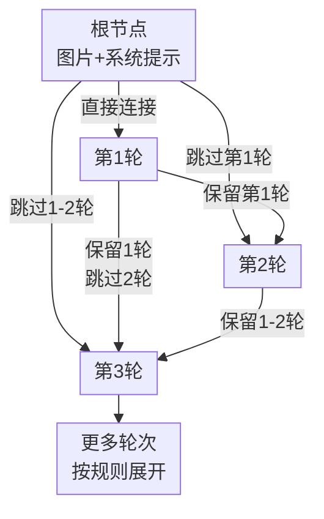

# StochasT: Learning with Stochastic Turn Depth for Visual Instruction Tuning

**会议**: ECCV2026  
**arXiv**: [2607.00465](https://arxiv.org/abs/2607.00465)  
**代码**: [https://yuanqing-ai.github.io/StochasT](https://yuanqing-ai.github.io/StochasT)  
**领域**: 多模态VLM  
**关键词**: 视觉指令微调, 多轮对话, 上下文鲁棒性, 随机深度, 训练-评估不匹配

## 一句话总结

StochasT提出在LVLM视觉指令微调时随机剪裁对话历史上下文，将固定链条展开为对话树，训练出一个隐式多深度集成模型，使单轮与多轮评估性能同时达到最优，并配套提出基于平衡拉丁方的鲁棒性评估框架与CRA/CRA+指标。

## 研究背景与动机

大型视觉语言模型（LVLM）通常需要经过视觉指令微调（Visual Instruction Tuning, VIT）来激活多模态推理能力。标准VIT实践中，一个普遍做法是将同一张图片的多个问答对打包成多轮对话（multi-turn dialogue）进行训练——这种 one-image-multiT 格式可以高效复用图片、丰富训练样本，被LLaVA等经典框架广泛采用。然而，当前几乎所有的LVLM评测基准（MMBench、MMMU、MME、Seed-Bench等）都采用单轮评估协议：每个问题独立地与图片配对，模型作答时没有上下文历史。

这就暴露了一个严重的训练-评估不匹配问题：模型在多轮对话中表现良好，因为前面的问答提供了丰富的上下文线索来辅助当前问题的回答；但同样的模型在单轮场景下性能急剧下降——一篇论文的数据显示，将评估从单轮切换为多轮可以让多个SOTA模型的性能跳跃式提升。更深入的分析表明，标准multiT训练本身就在放大这一问题：模型学会了利用文本上下文捷径而非真正的视觉理解来回答问题，导致视觉注意力持续衰退（visual attention decay）和上下文过拟合（contextual overfitting）。换句话说，训练时固定长度的多轮上下文反而成了模型在单轮场景下的"拐杖"。

本文的核心洞察是：单轮和多轮能力之间并非不可调和的矛盾，关键在于打破训练过程中固定的上下文深度，让模型在各种各样的上下文长度下都能稳定回答。**核心idea：在VIT中引入随机上下文深度（Stochastic Turn Depth），通过Beta分布控制的随机向后回溯机制，将每个多轮对话动态展开为对话树——同一batch内不同样本拥有不同的上下文长度，从而训练出一个隐式多深度集成模型，在不增加训练token的前提下自然调和单轮与多轮能力。**

## 方法详解

### 整体框架

StochasT的核心思想受Dropout和Stochastic Depth启发，但并非丢弃神经元或残差块，而是随机剪裁对话轮次之间的历史上下文依赖。给定一个包含N轮问答的标准多轮对话，StochasT对每一轮向后回溯：从它的前一轮开始，以Beta分布采样的概率决定是否"跳过"该历史轮次，遇到第一个被保留的轮次即作为父节点。如果所有前驱都被丢弃，则直接连接到根节点（图片+系统提示）。由此，线性链条被展开为有向树结构。

与直觉上更直接的"Turn Dropout"（直接丢弃轮次、连loss token都删掉）不同，StochasT保留了所有N轮的loss token参与梯度计算，仅改变它们的上下文连接关系。这是关键区别：不牺牲任何训练数据，只改变数据在因果注意力下的组织结构。由于每个epoch对话树都被重新随机采样，模型在training过程中间接经历了从单轮无上下文到完整深多轮对话的"连续谱系"。

当丢弃概率趋近于1时StochasT退化为单轮训练（每轮都直接连到根），趋近于0时退化为标准多轮训练。中间的随机状态恰好平衡了两者的优势。

### 关键设计

**1. 因果向后回溯：从链条到树的构建算法**

核心算法对第n轮从第n-1轮开始回溯。对每个历史轮次k，从Beta(α,β)分布采样丢弃概率p_k，再以Bernoulli(1-p_k)采样保留标志m_k。向后遍历遇到第一个m_k=1即停止，将第k轮设为第n轮的父节点；若遍历完所有前驱都未被保留（全部m_k=0），则父节点设为根节点。attention mask和position ID根据树结构相应调整——被跳过的轮次不再出现在后续轮次的因果视野中，但它们自己的loss token仍在原位计算梯度。

论文特意将这一随机过程与Chinese Restaurant Process做了对比：CRP通过偏好依附进行无序聚类，而StochasT的树构建是严格因果和时序驱动的——越近的轮次越可能成为父节点，这保证了对话的时序连续性不被破坏。这一设计比CRP更适合序列建模场景。

**2. Beta分布灵活调控上下文偏好**

丢弃概率由Beta(α,β)分布生成，两个超参数控制了"倾向短历史"还是"倾向长历史"。默认采用对称设置(2,2)，产生中间偏好的分布——保留一部分历史但不固定长度；(5,1)更偏好短历史，接近单轮训练；(1,5)更偏好长历史，接近多轮训练。实验表明(2,2)在CRA和CRA+上达到最优平衡，且对超参数选择相对鲁棒。这一设计的巧妙之处在于它把"上下文深度"从离散超参数变成了连续随机变量——模型训练时见到各种深度的变体，自然学会适应不同上下文场景，而不需要手动指定每轮对话的截断长度。

**3. 平衡拉丁方评估框架：系统化量化上下文鲁棒性**

传统评估只在单轮或多轮一种固定设置下测试，无法暴露模型对上下文变化的敏感程度。本文提出基于平衡拉丁方（Balanced Latin Square, BLS）的评估范式：构造一个N×N矩阵，每个N轮对话需要N次推理，矩阵的每一行是一种排列顺序，每种排列满足——每个问题恰好出现在所有N个位置各一次、每两个问题恰好相邻一次。这样一次评估同时覆盖单轮（出现在第一位置）和所有上下文长度，并消除一阶携带效应。基于BLS定义两个新指标：（1）上下文鲁棒准确率CRA，计算某问题在所有N种上下文下的平均正确率；（2）严格上下文鲁棒准确率CRA+，要求某问题在所有N种上下文中全部回答正确才计为1——反映了模型真正的、上下文无关的视觉知识掌握程度。奇数轮对话通过填充一个通用占位指令(dummy prompt)使N为偶数，该指令不计入最终得分。

### 损失函数 / 训练策略

StochasT不改变标准自回归交叉熵损失函数，仅改变每个forward pass中token之间的attention mask和position ID。因此它可以无缝集成到任意VIT训练流水线中——不做数据增广不改变优化器，零额外训练开销。实际实验采用LoRA参数高效微调，全局batch size 128，warmup ratio 0.03，搭配early stopping。

## 实验关键数据

### 主实验

| 模型 | 评估设置 | 训练策略 | 4数据集平均 | MMDU得分 |
|------|---------|---------|-----------|----------|
| LLaVA-1.5-7B | SingleT | MultiT(原始) | 61.51 | - |
| | SingleT | SingleT | 68.46 | - |
| | SingleT | **StochasT** | **67.16** | - |
| | MultiT | MultiT(原始) | 68.52 | 12.68 |
| | MultiT | SingleT | 68.60 | - |
| | MultiT | **StochasT** | **70.63** | **13.10** |
| Qwen2.5-VL-3B | SingleT | MultiT(原始) | 71.20 | - |
| | SingleT | SingleT | 76.71 | - |
| | SingleT | **StochasT** | **77.28** | - |
| | MultiT | MultiT(原始) | 77.39 | 57.90 |
| | MultiT | SingleT | 77.75 | - |
| | MultiT | **StochasT** | **80.16** | **59.80** |

### BLS鲁棒性评估

| 模型 | 训练策略 | CRA | CRA+ |
|------|---------|-----|------|
| LLaVA-1.5-7B | 原始(无微调) | 45.73 | 27.66 |
| | +MultiT | 61.82 | 41.19 |
| | +SingleT | 67.33 | **53.15** |
| | +**StochasT** | **67.69** | 50.89 |
| Qwen2.5-VL-3B | 原始(无微调) | 57.26 | 38.46 |
| | +MultiT | 73.63 | 54.30 |
| | +SingleT | 77.26 | **64.57** |
| | +**StochasT** | **77.53** | 61.76 |

### 关键发现

- **缩小单轮-多轮差距**：StochasT将单轮与多轮评估的差距从原始MultiT的7.01%（LLaVA-1.5）和6.19%（Qwen2.5-VL）分别缩小到3.47%和3.33%，接近预训练模型的原始鲁棒性水平
- **Beta参数鲁棒性**：(0.5,0.5)、(2,2)、(1,5)、(5,1)四种设置在CRA上差距不超过1.34%，说明方法对超参数不敏感；(2,2)对称设置在CRA+上最优
- **vs Random Cutoff**：等期望深度的随机截断baseline甚至不如MultiT（CRA 70.61 vs 73.65），说明StochasT的提升不是单纯"缩短上下文"带来的，而是动态多样化的上下文结构起关键作用
- **训练效率**：SingleT需要约2倍的训练token数才能达到StochasT同等的单轮性能，而StochasT不增加任何token
- **MME全类别提升**：在LLaVA-150K通用微调阶段应用StochasT，感知能力提升19.36%，推理能力提升25.56%
- **模型规模扩展**：在Qwen3VL-32B上StochasT仍保持约3个CRA点和3.8个CRA+点的优势

## 亮点与洞察

- **最优雅之处在于不引入新损失函数**：仅通过改变训练数据在注意力机制下的组织结构就实现了单轮/多轮能力的平衡，是纯数据组织角度的创新，与L2T、Vittle、Ross等修改训练目标的方法完全正交可叠加
- **"层深度→轮次深度"的类比迁移非常精彩**：将Stochastic Depth从ResNet的层级别迁移到多轮对话的轮次级别，是高层次的跨领域思想迁移——两种场景下"深度"都是一个连续超参数，随机化都能起到隐式集成效果
- **BLS评估框架具有独立贡献**：它暴露了LVLM评测的一个重要盲区——模型在单轮/多轮间的性能波动从未被系统量化。CRA+作为一个极其严格的指标，实际上衡量了模型是否掌握了真正的视觉知识而非依赖于上下文捷径
- **Token效率被明确量化**：许多论文声称"数据高效"但缺乏直接证据，本文展示了训练token数与性能的收益递减曲线图，并量化了StochasT相对于SingleT的约2倍token优势

## 局限与展望

- 论文明确指出StochasT适用于上下文弱依赖的对话——大部分VIT数据集正是如此；但对于强依赖场景（如逐步推理、故事理解），随机剪裁可能破坏语义连贯性
- 在CRA+指标上StochasT略逊于SingleT，说明单轮训练虽然在多轮能力上牺牲较大，但在极端一致性上仍有优势——如何在不牺牲一致性的前提下保持上下文鲁棒性仍是开放问题
- 当前仅在LoRA微调下验证（LLaVA-150K通用微调阶段虽是full fine-tuning但只跑了一个epoch），全参数大规模VIT下的行为有待进一步研究
- Beta分布虽相对鲁棒，但在不同数据集上的最优(α,β)可能不同，缺乏自动选择的指导策略

## 相关工作与启发

- **vs L2T**: L2T在指令token上添加辅助损失来惩罚捷径学习；StochasT不修改损失，而是从数据组织角度改变上下文分布，两者正交可叠加
- **vs Stochastic Depth**: Stochastic Depth随机丢弃ResNet残差块来训练层集成网络；StochasT创新性地将"深度"从网络层映射到对话轮次深度
- **vs Turn Dropout**: 一种直接的baseline——随机丢弃整个轮次（连loss一起扔）；StochasT保留所有loss token，数据利用率更高，性能也略优
- **vs 现有VIT数据策略**: 现有工作（DRESS、Vittle、Ross）要么改损失要么改数据质量；StochasT是第一个系统关注multiT/singleT不匹配问题的数据组织方法

## 评分

- 新颖性: ⭐⭐⭐⭐ [首次系统揭示multiT训练与singleT评估的结构性不匹配问题，并提出优雅的数据级解决方案]
- 实验充分度: ⭐⭐⭐⭐⭐ [覆盖5个跨领域数据集、2种模型架构、全套消融（参数/深度/注意力）+ BLS评估框架 + 扩展至通用微调阶段和更大模型]
- 写作质量: ⭐⭐⭐⭐ [motivation清晰扎实，方法论述细致，与CRP的对比分析显示了理论深度]
- 价值: ⭐⭐⭐⭐⭐ [直击LVLM训练管线中的结构性盲点，提出的方案零额外计算开销、开箱即用、易集成，BLS评估框架具有独立方法论贡献]

<!-- RELATED:START -->

## 相关论文

- [\[ECCV 2026\] VisNec: Measuring and Leveraging Visual Necessity for Multimodal Instruction Tuning](visnec_measuring_and_leveraging_visual_necessity_for_multimodal_instruction_tuni.md)
- [\[NeurIPS 2025\] Learning to Instruct for Visual Instruction Tuning](../../NeurIPS2025/multimodal_vlm/learning_to_instruct_for_visual_instruction_tuning.md)
- [\[CVPR 2026\] LLaDA-V: Large Language Diffusion Models with Visual Instruction Tuning](../../CVPR2026/multimodal_vlm/llada-v_large_language_diffusion_models_with_visual_instruction_tuning.md)
- [\[ICML 2025\] Parrot: Multilingual Visual Instruction Tuning](../../ICML2025/multimodal_vlm/parrot_multilingual_visual_instruction_tuning.md)
- [\[CVPR 2026\] MuCo: Multi-turn Contrastive Learning for Multimodal Embedding Model](../../CVPR2026/multimodal_vlm/muco_multi-turn_contrastive_learning_for_multimodal_embedding_model.md)

<!-- RELATED:END -->
