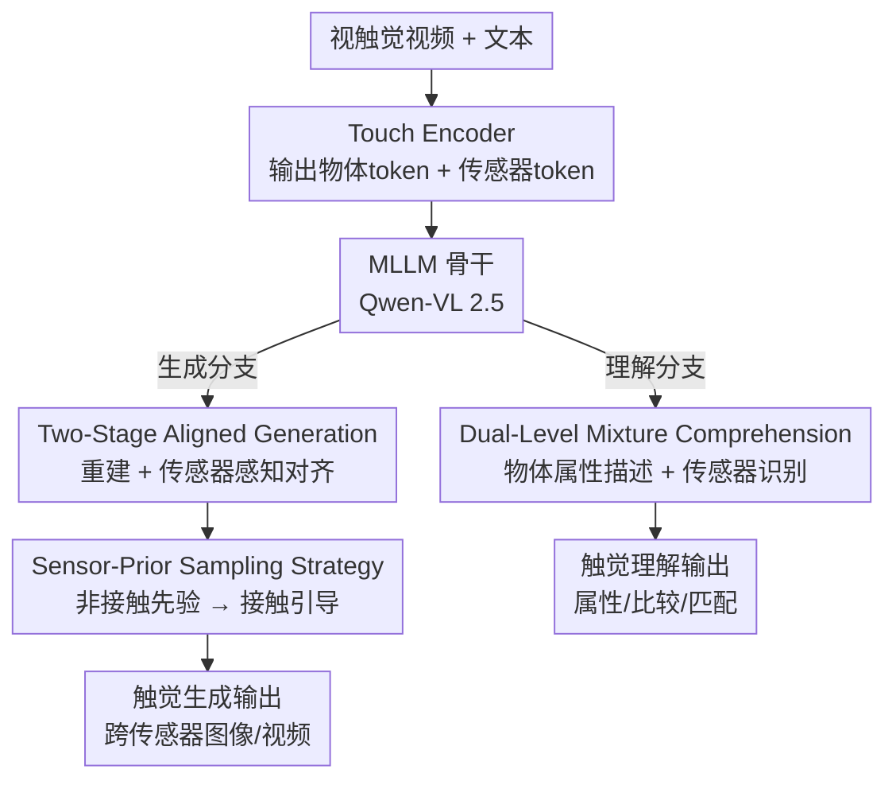

# UniTac: A Unified Multimodal Model for Cross-Sensor Tactile Understanding and Generation

**会议**: ECCV 2026  
**arXiv**: [2606.31451](https://arxiv.org/abs/2606.31451)  
**代码**: 待确认  
**领域**: 多模态VLM  
**关键词**: 触觉理解, 触觉生成, 统一多模态模型, 跨传感器, 整流流

## 一句话总结
UniTac 是第一个把「理解」与「生成」统一到单一框架里的触觉多模态大模型，通过同时建模「物体级语义」和「传感器级配置」这两层信息，在跨 GelSight/DIGIT/Duragel 等异构触觉传感器上既能推理物体物理属性、又能合成逼真的触觉信号。

## 研究背景与动机
统一多模态模型（UMM）近两年很火，像 Janus-Pro、Chameleon、Transfusion、BLIP3-o 这些工作把「感知」和「生成」塞进同一个 Transformer/扩散骨干里，让一个模型既能看懂图又能画图。但这股浪潮几乎全停在视觉—语言模态上，触觉这条路基本没人走。而触觉对具身智能又恰恰是刚需——精细操作、材质识别、超越视觉的几何推断都靠它。触觉领域现在的窘境是两头都不顺：理解侧，主流触觉—语言模型（如 Octopi 用的 PHYSICLEAR 只有 482 段触觉视频）都在各自的小数据集上单练，而社区其实已经开源了超过 40 万段片段、160 万帧的大规模数据，却分散在各处从不合并训练；生成侧，前作（如 Touch2Touch）只做过特定传感器对之间的转换，没人解决过跨多种传感器的通用合成。更根本的是，几乎所有工作都把理解和生成当成两个割裂的问题，从不挖掘它们之间的内在联系。

真正卡住触觉这条路的核心矛盾，在于触觉数据天生有一层视觉相机没有的「双重性」。相机一次曝光就得到一张自然图像，而触觉采集内在是两阶段的：先有一个「非接触」阶段捕获传感器自身的配置（打光、凝胶形变、相机参数），再有一个「接触」阶段在这个配置下记录物体的物理属性（表面几何、硬度、粗糙度）。缺了物体级信息，非接触的触觉数据没有任何语义；缺了传感器级信息，生成模型不知道该在哪种传感器配置上合成信号，理解模型也读不懂同样的凝胶形变在不同传感器上意味着什么——GelSight 是靠标记点位移编码粗糙度的，而这套位移模式完全依赖它自己的传感器配置。跨传感器的巨大 domain gap 正是从这里来的。

本文的切入角度是：既然触觉的意义是由「物体」和「传感器」两层共同决定的，那统一模型就必须把这两层显式地一起建模，而不是像视觉 UMM 那样只管物体语义。**核心 idea：把触觉过程建模为「非接触 → 接触」的状态转移，用一套同时编码传感器属性与物体属性的双层表示，让单一 MLLM 骨干在理解侧学会区分「什么随物体变、什么随传感器变」，在生成侧沿着这条状态转移路径合成传感器一致的触觉信号。**

## 方法详解

### 整体框架
UniTac 要解决的是「一个模型同时干好跨传感器的触觉理解和触觉生成」。输入是视触觉视频（tactile video）加文本，输出既可以是对接触物体物理属性的语言描述、也可以是给定文本描述后合成的触觉图像/视频。整个框架围绕四个模块串起来：**Touch Encoder**（采用 AnyTouch 预训练的 ViT-B/16，输出 768 维 token，其中既含物体级语义、又含专门的传感器 token）先把触觉信号编码成 latent；**MLLM 骨干**（Qwen-VL 2.5，3B/7B 两档）作为理解和生成共享的推理中枢；**Sensor-Aware DiT Projector**（NextDiT，24 层扩散 Transformer）把 MLLM 的输出映射回触觉 latent 空间；**Touch Decoder**（图像用 SANA、视频换成 Wan v2.2）最终把 latent 解码成触觉信号。

方法由三个核心贡献点组成，恰好对应「理解怎么强化 → 生成怎么对齐 → 采样怎么符合物理」这条链路：Dual-Level Mixture Comprehension 用两个监督任务把 MLLM 的触觉理解拉起来；Two-Stage Aligned Generation 用「重建 + 传感器感知对齐」两阶段把生成能力接到 MLLM 上；Sensor-Prior Sampling Strategy 则在采样时把无条件分支换成传感器先验，模拟真实的非接触到接触过程。

### 关键设计

**1. Dual-Level Mixture Comprehension：用两个任务逼模型同时读懂「物体」和「传感器」**

针对的痛点很直接——如果只让模型描述物体属性，它学不会区分「同一块粗糙表面在 DIGIT 和 GelSight 上为什么长得不一样」，跨传感器就会崩。UniTac 的做法是把触觉 token 用 `<T_VID>`/`</T_VID>` 两个特殊标记拼进 MLLM 的文本流，然后用一个指令提示 $\Pi_i$ 指定当前要做哪个任务，全程用标准的下一 token 预测来训练。两个任务一物一器：**物体级监督**沿用 Octopi，让模型从粗糙度、硬度、纹理三个维度描述接触物体（如「表面柔软、粗糙、有大凸起」），把接触模式绑定到物理材质；**传感器级监督**则让模型说出是哪种传感器采集的（如「由 DIGIT 传感器采集」），逼它学会打光、凝胶弹性、成像分辨率这些传感器专属线索。总损失把两者加权：

$$\mathcal{L}_{\text{DLMC}}=\mathcal{L}_{\text{prop}}+\lambda_{\text{sen}}\,\mathcal{L}_{\text{sen}}$$

其中 $\lambda_{\text{sen}}=0.1$（消融显示过小则对传感器不敏感、过大则损害物体推理）。这个双层监督的关键收益是让模型学会「解耦」——把随物体变化的东西和随传感器变化的东西分开，理解才准，也顺带给生成侧提供了语义先验。

**2. Two-Stage Aligned Generation：先在触觉域里学生成先验，再把 MLLM 的语义对齐过来**

生成侧的痛点是：MLLM 输出的是文本/物体语义空间的东西，跟触觉 decoder 需要的 latent 空间对不上，而且直接端到端训会很慢。UniTac 拆成两阶段。**阶段一（重建）** 完全绕开 MLLM：注意到 Touch Encoder 的 latent 天然可切成物体部分和传感器部分 $\mathbf{Z}_i=[\mathbf{Z}_i^{\text{obj}},\mathbf{Z}_i^{\text{sen}}]$，直接把它喂给 touch decoder 重建触觉信号，先学到一个「触觉域内的生成先验」；因为不碰 MLLM，这一阶段能和上面的理解任务并行训、省时间。**阶段二（传感器感知对齐）** 才把 MLLM 接进来：给定文本描述和 $N$ 个 touch query，MLLM 产出的 query 嵌入 $\hat{\mathbf{Q}}_i$ 主要编码了物体级语义、但缺传感器线索，于是把它和从 Touch Encoder 拿到的传感器 token $\mathbf{S}$ 拼起来构成条件 $\mathbf{F}_i=[\hat{\mathbf{Q}}_i;\mathbf{S}]$，再用整流流（rectified flow）训 DiT projector 学一个把高斯噪声搬向目标触觉 latent 的向量场：

$$\mathcal{L}_{\text{align}}^{\text{RF}}=\mathbb{E}_{t,\mathbf{z},\mathbf{Z}_i}\bigl\|v_\theta(\mathbf{x}_t\mid t,\mathbf{F}_i)-(\mathbf{Z}_i-\mathbf{z})\bigr\|_2^2$$

这样做的巧妙之处在于：语义来自 MLLM（保证描述忠实），传感器线索来自 encoder（保证跨传感器一致），两路信息在 projector 里显式拼接，生成结果就既语义对、又物理对。

**3. Sensor-Prior Sampling Strategy：把 CFG 的「无条件分支」换成「传感器先验分支」**

这一步解决的是采样阶段的一个错配。标准的 classifier-free guidance（CFG）用无条件先验 $v_\theta(\mathbf{x}_t\mid t,\varnothing)$ 当基线做引导，但触觉信号本质上依赖传感器配置，「无条件」根本代表不了真实的非接触初始状态。UniTac 观察到真实触觉采集就是「非接触 → 接触」的顺序过程，于是把无条件分支替换成一个传感器条件先验，采样式子改写为：

$$\hat{v}_\theta(\mathbf{x}_t\mid t,\mathbf{Z}_i^{\text{obj}},\mathbf{Z}_i^{\text{sen}})=v_\theta(\mathbf{x}_t\mid t,\mathbf{Z}_i^{\text{sen}})+s\bigl[v_\theta(\mathbf{x}_t\mid t,\mathbf{Z}_i^{\text{obj}},\mathbf{Z}_i^{\text{sen}})-v_\theta(\mathbf{x}_t\mid t,\mathbf{Z}_i^{\text{sen}})\bigr]$$

前一项 $v_\theta(\cdot\mid \mathbf{Z}_i^{\text{sen}})$ 是传感器先验分支、对应非接触过程，后一项 $v_\theta(\cdot\mid \mathbf{Z}_i^{\text{obj}},\mathbf{Z}_i^{\text{sen}})$ 引入同一传感器状态下的物体级接触语义，引导尺度 $s=1.5$。这样整个采样轨迹被强制走一条物理一致的路：先尊重传感器配置、再叠加接触语义。消融里作者特意在 $s=1.5$ 下把 SPSS 和 vanilla CFG 对齐比较，SSIM 从 0.817 提到 0.836，证明增益来自「换了个更有信息量的先验分支」而非单纯调引导强度。

### 损失函数 / 训练策略
训练分三大阶段：重建、双层理解、传感器感知对齐。其中重建和双层理解并行训（前者不涉及 MLLM 骨干），对齐阶段最后单独训 NextDiT projector（100 epoch，batch 512，lr 1e-4）。全程 bf16 混合精度，8×A800（80GB）。数据由 AnyTouch 组织的五个公开数据集（Touch and Go、Tacquad、TVL、SSVTP、PHYSICLEAR）统一成约 40 万片段、160 万帧，靠计算每帧与背景帧的差异筛出真正有形变的接触帧。生成侧默认用 64 个 MLLM query、CLIP 式语义编码器（比 VAE 像素编码器推理快且更省，指标几乎持平）。

## 实验关键数据

### 主实验
理解在 PHYSICLEAR-Test 上测六个任务（PC 属性比较、POM 属性—物体匹配、PSS 属性最高级选择，加硬度/粗糙度/纹理分类）；生成在四种传感器上用 SSIM/PSNR 评（随机采 6 万张生成图对比 GT）。

| 任务 | 指标 | UniTac-7B/UniTac | 之前最强 | 提升 |
|--------|------|------|----------|------|
| 触觉理解 平均分 | Acc | 66.51 (7B) | 57.31 (Octopi-7B) | +9.20 |
| 理解 POM | Acc | 64.61 (7B) | 22.22 (Octopi-7B) | +42.39 |
| 理解 PC | Acc | 57.30 (7B) | 45.50 (Octopi-7B) | +11.80 |
| 生成 平均 SSIM | SSIM | 0.836 | 0.816 (TextToucher) | +0.020 |
| 生成 平均 PSNR | PSNR | 19.93 | 18.65 (TextToucher) | +1.28 |

理解上 UniTac-7B 的总提升主要来自推理类任务（PC/POM/PSS），说明它更擅长把触觉观测 ground 到高层物理/语义概念；生成上不仅在 UMM 里最强，还超过了纯生成方法 TextToucher。

### 消融实验

| 配置 | PHYSICLEAR | SSIM | PSNR | 说明 |
|------|---------|------|------|------|
| UniTac (Full) | 60.61 | 0.836 | 19.93 | 完整模型（此处用 3B 骨干） |
| w/o 传感器识别 | 57.38 | 0.822 | 19.91 | 去掉后理解掉 3.23，跨传感器解读变弱 |
| w/o 双层理解 | 26.52 | 0.758 | 18.14 | MLLM 退化成普通 Qwen-VL，理解崩盘 |
| w/o DiT Projector | 60.61 | 0.794 | 19.25 | 只伤生成，不碰理解 |
| w/o 传感器先验采样 | 60.61 | 0.817 | 19.49 | 退化为 vanilla CFG，生成保真度下降 |

### 关键发现
- **双层理解是地基**：去掉它理解从 60.61 暴跌到 26.52，同时生成也掉（SSIM 0.836→0.758），证明触觉理解不仅提升推理、还为生成提供了关键语义先验——理解和生成确实是耦合的，这正是本文「统一」的立论。
- **传感器识别任务小而关键**：去掉它理解掉 3.23，说明显式建模传感器配置对跨传感器解读贡献明显。
- **$\lambda_{\text{sen}}$ 有甜点**：0.01 时理解 58.27、0.1 时 60.61、1.0 时又掉回 58.12，0.1 是跨传感器一致性与物体推理的最佳平衡。
- **Duragel 是公认难点**：所有方法在 Duragel 上都偏低，因为它采集条件不稳、标定和凝胶状态波动大，图像偏模糊——这是数据本身的问题而非框架局限。

## 亮点与洞察
- **把触觉的「双阶段物理性」直接写进模型**：非接触→接触这个物理先验既指导了理解（区分物体 vs 传感器），又指导了采样（SPSS 换掉无条件分支）。这是全文最「啊哈」的地方——用一个物理观察串起了理解和生成两条线。
- **SPSS 是一个可迁移的小 trick**：CFG 里「无条件分支不代表真实初始状态」这个洞察，其实适用于任何「生成对象天然带某种固定先验状态」的场景（比如带固定背景/相机的成像生成），把 $\varnothing$ 换成域先验即可，几乎零成本。
- **生成数据能反哺下游**：用 UniTac 生成的 GelSight 数据做增广，跨传感器抓取分类从 50.00% 拉到 99.37%，且源域几乎不掉——对触觉硬件快速迭代、每换一个新传感器就要重采数据的痛点是实打实的解法。
- **两阶段并行训省算力**：重建阶段不碰 MLLM，能和理解任务并行，这个工程拆分让训练效率明显提升，是个值得抄的做法。

## 局限与展望
- **Duragel 这类不稳定传感器仍是短板**：作者承认原始数据波动大导致重建/生成都偏弱，框架本身没给出针对噪声传感器的鲁棒化手段。
- **依赖 AnyTouch 预训练编码器**：整套双层表示建立在 AnyTouch 的传感器 token 上，若换一个没有这种跨传感器预训练的 encoder，双层解耦能力能否保持存疑。
- **理解评测集中在 PHYSICLEAR**：六个任务都围绕粗糙度/硬度/纹理这几类属性，更复杂的触觉语义（如温度、滑动、材料类别开放集）尚未覆盖。
- **真实部署规模有限**：机器人实验是 20 次 rollout 量级的小样本验证，说明可行但离大规模落地还有距离；VTLA-pred（用预测触觉代替实时触觉）虽好于纯视觉 VLA，但仍略逊于真实触觉，预测触觉的可靠性边界未充分刻画。

## 相关工作与启发
- **vs Octopi**：Octopi 也把触觉视频对齐到 VLM 做物体属性推理，但只做理解、且用小的自采数据集；UniTac 用 40 万片段大规模训练 + 传感器识别任务，理解上 POM 直接高出 42 分，还额外统一了生成。
- **vs AnyTouch**：AnyTouch 提出跨传感器表示但止步于表示学习、不做下游推理和生成；UniTac 复用它当 encoder，把它的表示接进 MLLM 做理解、接进 DiT 做生成，把「表示」推进到「统一理解+生成」。
- **vs TextToucher / Touch2Touch**：TextToucher 做文本→触觉但限单传感器，Touch2Touch 只做特定传感器对转换；UniTac 靠双层建模实现真正的跨多传感器合成，SSIM/PSNR 还反超纯生成的 TextToucher。
- **vs Janus-Pro / BLIP3-o 等视觉 UMM**：这些是视觉—语言统一模型的范式来源，UniTac 借了「AR 理解 + Diffusion 生成」的骨架，但把它第一次搬到触觉域，并针对触觉的「传感器—物体双层性」做了本质改造，而非简单换模态。

## 评分
- 新颖性: ⭐⭐⭐⭐⭐ 第一个触觉域统一多模态模型，「非接触→接触」双层建模的视角切得很准
- 实验充分度: ⭐⭐⭐⭐⭐ 理解+生成双线评测、消融细致（含 $\lambda_{\text{sen}}$/query 数/编码器选型/引导尺度），还有真机部署和跨传感器增广验证
- 写作质量: ⭐⭐⭐⭐ 结构清晰、动机—方法—实验闭环，公式与算法附录完整；个别模块命名偏多需对照图理解
- 价值: ⭐⭐⭐⭐⭐ 触觉数据稀缺+硬件快速迭代的痛点下，「生成数据反哺下游」提供了可扩展的现实解法

<!-- RELATED:START -->

## 相关论文

- [\[ICLR 2026\] Thinking with Camera: A Unified Multimodal Model for Camera-Centric Understanding and Generation](../../ICLR2026/multimodal_vlm/thinking_with_camera_a_unified_multimodal_model_for_camera-centric_understanding.md)
- [\[ICLR 2026\] UniF2ace: A Unified Fine-grained Face Understanding and Generation Model](../../ICLR2026/multimodal_vlm/unif2ace_a_underlineunified_underlinefine-grained_underlineface_understanding_an.md)
- [\[ICLR 2026\] Omni-Weather: A Unified Multimodal Model for Weather Radar Understanding and Generation](../../ICLR2026/multimodal_vlm/omni-weather_a_unified_multimodal_model_for_weather_radar_understanding_and_gene.md)
- [\[ICLR 2026\] MME-Unify: A Comprehensive Benchmark for Unified Multimodal Understanding and Generation Models](../../ICLR2026/multimodal_vlm/mme-unify_a_comprehensive_benchmark_for_unified_multimodal_understanding_and_gen.md)
- [\[CVPR 2026\] OneCAT: Decoder-Only Auto-Regressive Model for Unified Understanding and Generation](../../CVPR2026/multimodal_vlm/onecat_decoder-only_auto-regressive_model_for_unified_understanding_and_generati.md)

<!-- RELATED:END -->
