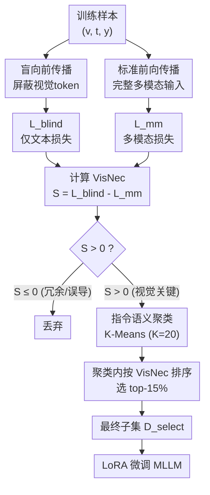

# VisNec: Measuring and Leveraging Visual Necessity for Multimodal Instruction Tuning

**会议**: ECCV2026  
**arXiv**: [2603.01195](https://arxiv.org/abs/2603.01195)  
**代码**: [https://dmk041218.github.io/VisNec/](https://dmk041218.github.io/VisNec/)  
**领域**: 多模态VLM  
**关键词**: 视觉必要性, 数据选择, 多模态指令微调, 视觉冗余, 跨模态推理

## 一句话总结

VisNec 通过对比多模态模型在「有图 vs 无图」两次前向传播的损失差，量化每条训练样本对视觉输入的依赖程度，进而筛选出真正需要跨模态推理的高价值子集——仅用 15% 的 LLaVA-665K 数据就恢复甚至超越全量训练的性能。

## 研究背景与动机

多模态指令微调是大模型获得视觉对话能力的关键步骤，但当前主流数据集（如 LLaVA-665K、Vision-Flan-186K）的构建方式包含大量「伪多模态」样本：有些问题仅靠语言先验就能回答（比如「草是什么颜色」→ 绿色），视觉信息毫无贡献；更糟的是，有些样本的图片与标注矛盾，视觉输入反而干扰预测。这两类样本在训练中不仅浪费算力，还会强化模型依赖文本捷径、削弱真正的跨模态对齐能力。现有数据筛选方法——无论是基于梯度影响（ICONS）、聚类覆盖（COINCIDE）还是文本侧损失（IFD）——都把样本当作一个整体来评估重要性，没有显式区分视觉模态的独立贡献。结果就是选出来的子集仍然可能以「语言学上容易但视觉上无用」的样本为主，甚至保留了有害的错误标注。

核心矛盾在于：多模态数据的价值不能用整体「难度」来度量，而应该由「去掉图片后预测难度是否显著上升」来决定——一条样本的价值正比于视觉信息对预测不确定性的边际减少。如果去掉图片后模型照样答对，说明这条样本对跨模态训练几乎没有价值；如果去掉图片后答错、加上图片后答对，这才是真正需要视觉推理的好样本。

**核心 idea：通过计算多模态模型在「盲看（只给文本）」和「正常看图」两次前向传播之间的损失差，量化每条样本的视觉必要性分数（VisNec），再结合语义聚类做分层选样，从而选出既视觉必要又任务多样的高质量微调子集。**

## 方法详解

### 整体框架

VisNec 的数据筛选流程分两大阶段。第一阶段对每条样本做两次前向传播——一次屏蔽视觉输入（盲向前传播）、一次正常接收完整多模态输入——计算两者的交叉熵损失差，得到一个标量 VisNec 分数，直观反映视觉信息对回答的边际贡献。分数为正表示视觉关键，近零表示冗余，负值表示视觉误导。第二阶段先将所有样本的指令问题做语义聚类（K-Means），在每个聚类内按 VisNec 分数从高到低排列，去除分数≤0 的样本后，从剩余样本中选出 top-r%（默认 15%）作为最终微调子集。这样既保留了每条样本的视觉必要性，又通过聚类保证了任务类型的多样性。

### 关键设计

**1. Blind Forward Pass：在 MLLM 中隔离视觉贡献的对照实验**

实现「有图 vs 无图」损失对比的关键技术难点在于：如何在不修改模型参数的前提下，干净地构造一个纯文本推理条件。VisNec 的做法很巧妙——将图像 token 的位置全部替换为填充 token（padding tokens），同时将对应位置的注意力掩码置零，这样视觉信息完全无法通过注意力计算传播到响应 token 的表示中。两次前向传播使用完全相同的模型权重和批处理配置，唯一变化的变量就是是否有视觉输入。为了确保两次损失的可比性，图像 token 位置通过 `ignore_index` 排除在损失计算之外，最终 `L_blind` 和 `L_mm` 都是只对响应 token 求平均的交叉熵损失：

$$
\mathcal{L}_{\text{Blind}}(\theta;t,y)=-\sum_{j=1}^{L}\log P(y_{j}\mid y_{<j},t;\theta)
$$

虽然盲向输入（只有文本指令）不在 MLLM 的正常训练分布内，但这对排序没有影响——VisNec 用的是聚类内的相对排序而非绝对阈值，任何系统偏差在同类样本之间会相互抵消，不会改变实际筛选结果。

**2. VisNec 分数：视觉必要性的量化标尺**

VisNec 分数的定义极其简洁——盲向损失与多模态损失之差：

$$
S_{\text{VisNec}}(v,t,y)=\mathcal{L}_{\text{Blind}}(\theta;t,y)-\mathcal{L}_{\text{MM}}(\theta;v,t,y)
$$

这个差值对应 V-usable Information（V-usable Information）框架中视觉变量对预测不确定性的边际减少量。根据分数大小，样本被清晰地分为三类：**S > 0** 表示视觉增益显著，模型在看了图之后损失大幅下降，这类样本需要真正的跨模态推理；**S ≈ 0** 表示视觉冗余，模型不看图也能给出差不多的预测，这类样本主要依赖语言捷径；**S < 0** 表示视觉误导或标注错误，视觉输入让预测变得更差。VisNec 与其他方法（如 IFD）的关键区别在于：IFD 只看文本侧的损失，无法区分「样本因视觉误导而难」和「样本因视觉关键而难」；VisNec 通过差分操作显式分离出视觉的独立贡献，能精准剔除视觉误导样本。消融实验显示，单独使用文本损失或单独使用多模态损失筛选，相对性能分别只有 95.6% 和 94.0%，而两者联合的 VisNec 达到 100.2%，证明了差分信号的必要性。

**3. 语义感知分层采样：保留任务多样性的选样策略**

如果仅凭 VisNec 分数全局 top-r% 选样，会出现一个严重问题：不同任务类型的视觉依赖程度天然不同——空间推理类样本的 VisNec 分数通常远高于 OCR 或常识问答类样本，直接全局排序会导致选出来的子集偏向某一类任务，丧失多样性。VisNec 采用「先聚类再选样」的两阶段策略来解决这个问题：第一步从每条指令中提取用户问题部分（排除系统提示），用句子嵌入做 K-Means 聚类（K=20），将相似语义的问题自动分组；第二步在每个聚类内部，先剔除 VisNec 分数 ≤0 的冗余或误导样本，再按分数从高到低选出 top-r%。这样做保证了最终子集在每个任务类型内部都保留了视觉依赖最强的样本，同时所有任务类型都获得等比例的微调数据。消融结果显示，去掉聚类层的 Top-VisNec 方案相对性能从 100.2% 掉到 97.0%，证实分层采样对维持任务覆盖不可或缺。

### 损失函数 / 训练策略

VisNec 本身是一个数据选择框架，不涉及新的训练目标。选出的子集使用标准的 LoRA 微调配置：学习率 2×10⁻⁴，训练 1 个 epoch，在 LLaVA-v1.5 Stage-1 预训练检查点（特征对齐）基础上微调。实验发现 15% 是性能最优的筛选比例（5% 可恢复 99.1%，15% 达到 100.2%，20% 反而微降到 99.2%），印证了多模态指令微调中「少即是多」的结论。

## 实验关键数据

### 主实验

在 LLaVA-665K 上用 15% 数据（98K 样本）微调 LLaVA-v1.5-7B：

| 指标 | Random | IFD | PreSel | XMAS | COINCIDE | CoIDO | VisNec(15%) | Full-Data(100%) |
|------|--------|-----|--------|------|----------|-------|-------------|-----------------|
| Rel. | 94.2% | 92.1% | 97.7% | 97.3% | 95.8% | 97.7% | **100.2%** | 100% |
| VQAv2 | 75.3 | 74.0 | 76.5 | 75.1 | 76.1 | 75.8 | **78.0** | 79.1 |
| LLaVA-Wild | 58.8 | 62.3 | 65.6 | 62.4 | 64.9 | 66.7 | **69.8** | 67.9 |
| MM-Vet | 30.2 | 28.1 | 29.6 | 31.0 | 28.5 | 31.4 | **32.1** | 30.0 |

在 Vision-Flan-186K（191 个不同任务、每条任务样本量更少）上，VisNec 以 15% 数据（28K 样本）达到 **115.8%** 的相对性能，远超全量训练的 100% 和随机选样的 96.7%，说明该数据集里大量样本不仅冗余还对训练有害，VisNec 的过滤效果特别显著。

### 跨架构迁移性

| 模型 | Full-Data | VisNec(15%) |
|------|-----------|-------------|
| Qwen2.5-VL-3B | 100% | **103.8%** |
| Qwen2.5-VL-7B | 100% | **104.0%** |
| Qwen2.5-VL-32B | 100% | **102.4%** |

VisNec 分数在不同架构（LLaVA vs Qwen2.5-VL）和多规模（3B/7B/32B）下均有效，说明它捕获的是数据本身的固有视觉必要性，而非对特定模型的偏好。

### 关键发现

- **差分信号是成功关键**：单独使用文本损失或单独使用多模态损失进行筛选，性能分别为 95.6% 和 94.0%，远低于两者联合的 100.2%。视觉误导样本在多模态损失中表现为低损失（因为模型「学会了」被误导），需要用盲向损失来对照揭穿。
- **聚类层贡献 3.2% 的增益**：去掉聚类的 Top-VisNec 方案从 100.2% 降至 97.0%，但已优于所有非 Top-VisNec 基线——说明 VisNec 分数本身是强信号，聚类起的是「锦上添花」的多样性保障作用。
- **超参数鲁棒性强**：聚类数 K 从 10 变到 30，相对性能波动仅 1.3%；筛选比例在 5%-20% 范围内均恢复 99% 以上的全量性能。
- **计算高效**：VisNec 筛选 665K 样本仅需 12 GPU-hours（H100），远低于 Self-Filter（73.5）和 COINCIDE（55.5），且不依赖任何外部 API。

## 亮点与洞察

- **差分对比法优雅简化了「质量评估」问题**：把数据筛选从复杂的梯度追踪或多模型集成压缩成「跑两次前向、算一个差值」，理念清晰、实现轻量，是信息论思路在工程落地中的优秀范例。
- **V-usable Information 框架的自然拓展**：从文本域延伸到多模态域，用「边际损失减少」直接对应视觉变量的信息增益，理论根基扎实。
- **少即是多的实证**：Vision-Flan-186K 上 15% 数据反超全量 15.8%，说明现有数据集中大量噪声/冗余样本实际在拖后腿——这一现象在任务数量多、每条任务数据少的场景下尤其突出，对数据构建策略有直接启示。
- **无需外部 API、无需多模型集成、无需梯度反传**：与 PreSel/CoIDO 等需要 GPT-4 打分的方法相比，VisNec 完全自包含，可部署在任何可用 GPU 的环境中。

## 局限与展望

- VisNec 分数的质量受限于 MLLM 本身的能力：如果模型很弱，盲向损失和多模态损失的差值可能无法可靠地反映真实视觉必要性。作者在 3B-32B 范围验证了迁移性，但更小/更大的模型边界有待检验。
- 聚类数 K=20 在不同数据集（LLaVA-665K 约 10 个任务、Vision-Flan-186K 有 191 个任务）下使用相同配置，虽然实验显示鲁棒，但对极端多样性的数据集（如上千种任务）可能需要自适应 K 的选择。
- 筛选后的 15% 子集是否有类别失衡风险？聚类策略保证了「每类都有」，但无法保证每类内部的样本多样性（如一个类全是简单问题）。以原文为准。

## 相关工作与启发

- **vs IFD（NAACL 2024）**：IFD 用文本侧响应预测损失作为质量信号，不能区分「样本因视觉误导而难」和「样本因视觉关键而难」。VisNec 的差分公式直接解决了这个混淆问题。
- **vs PreSel / CoIDO**：这两个方法依赖 GPT-4 等外部 API 评估图片质量，成本高、有隐私风险。VisNec 完全自包含。
- **vs COINCIDE（EMNLP 2024）</b>：COINCIDE 用梯度聚类做选样但复杂度高（55.5 GPU-hr），VisNec（12 GPU-hr）快约 4.6 倍且性能更好。
- **vs 经典的 active learning / 不确定性采样方法（EL2N、TypiClust）**：这些方法适用于有标签的监督学习场景，到多模态指令微调中缺乏对跨模态一致性的感知能力。

## 评分

- 新颖性: ⭐⭐⭐⭐½ 用差分损失量化视觉必要性在概念上新颖，但在 V-usable Info 框架下理论创新有限，工程实现巧妙
- 实验充分度: ⭐⭐⭐⭐⭐ 覆盖 2 个数据集 × 10 个 benchmark × 3 种模型规模，消融分析完整（loss 组件消融、聚类消融、参数敏感性），无遗漏
- 写作质量: ⭐⭐⭐⭐⭐ 逻辑清晰，盲向前传播的设计动机和实现细节解释透彻，case study 直观展示三类样本的分数含义
- 价值: ⭐⭐⭐⭐⭐ 15% 数据恢复/超越全量性能，计算成本低（12 GPU-hr），不依赖外部 API，对训练大模型有直接实用价值

<!-- RELATED:START -->

## 相关论文

- [\[ECCV 2026\] StochasT: Learning with Stochastic Turn Depth for Visual Instruction Tuning](stochast_learning_with_stochastic_turn_depth_for_visual_instruction_tuning.md)
- [\[NeurIPS 2025\] Visual Instruction Bottleneck Tuning](../../NeurIPS2025/multimodal_vlm/visual_instruction_bottleneck_tuning.md)
- [\[ICML 2025\] Parrot: Multilingual Visual Instruction Tuning](../../ICML2025/multimodal_vlm/parrot_multilingual_visual_instruction_tuning.md)
- [\[CVPR 2026\] LLaDA-V: Large Language Diffusion Models with Visual Instruction Tuning](../../CVPR2026/multimodal_vlm/llada-v_large_language_diffusion_models_with_visual_instruction_tuning.md)
- [\[NeurIPS 2025\] Learning to Instruct for Visual Instruction Tuning](../../NeurIPS2025/multimodal_vlm/learning_to_instruct_for_visual_instruction_tuning.md)

<!-- RELATED:END -->
