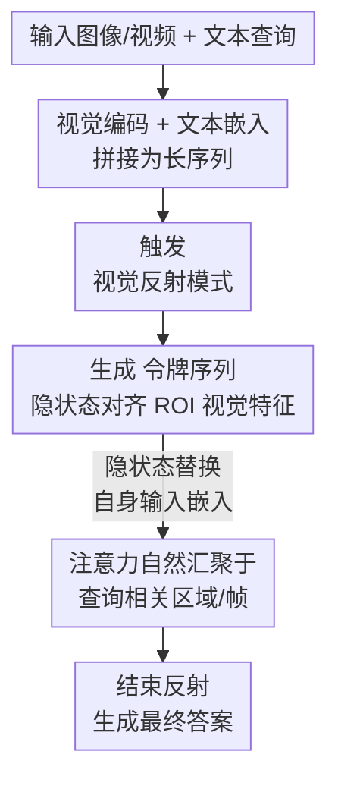

# VisReflect: Latent Visual Reflection for Fine-Grained Perception in Long Visual Context

**会议**: ECCV2026  
**arXiv**: [2606.30288](https://arxiv.org/abs/2606.30288)  
**代码**: 无  
**领域**: 多模态 VLM  
**关键词**: 视觉反射, 注意力汇聚, 细粒度感知, 长视觉上下文, LVLM

## 一句话总结
VisReflect 提出潜空间视觉反射机制，让 LVLM 在生成 `<VR>` 特殊令牌时用其隐状态直接召回图像/视频中与查询相关的视觉特征，从而在单次前向传播内实现注意力重聚焦，避免现有"缩放-重编码"范式中的坐标预测误差与多次前向开销，在图像和视频细粒度感知任务上分别提升 4.1% 和 1.8%，推理速度比多轮缩放方法快 44%。

## 研究背景与动机

当前的大型视觉语言模型在常规视觉问答上表现出色，但面对高分辨率图像或长视频时，视觉令牌数量动辄数千甚至上万，注意力汇聚（Attention Sink）现象加剧——大量无关令牌吸走了不成比例的注意力权重，导致模型难以聚焦于与查询相关的微小目标或特定时间片段。例如在一张 4K 图像中找出某个微小的交通标志，或在长达数分钟的视频中定位某人按下开关的那个瞬间，现有 LVLM 在长上下文场景下的细粒度感知能力远未解决。

已有工作尝试通过"先定位后放大"的思路来缓解这一问题，即让模型先预测目标区域的边界框坐标或视频中的时间区间，然后裁剪出该区域并重新编码做第二次前向推理。这类方法（如 Thyme、DeepEyes、LOVE-R1 等）虽然有效，但存在两个本质缺陷。其一，坐标预测停留在离散文本空间，模型生成的数值（如 `[x1, y1, x2, y2]`）本质上是对视觉特征空间的一种粗糙映射，定位稍有偏差就导致第二次前向的输入区域错误，错误级联放大。其二，每次缩放都需要一次额外的视觉编码和 LLM 前向，推理延迟和计算开销大幅增长，在多轮迭代时更为严重。

本文的核心洞察是：既然 LLM 的隐状态本身就处在与视觉特征相同的嵌入空间中，我们完全可以绕过离散坐标预测，让模型在连续潜空间中直接"回忆"与查询相关的视觉特征。**核心 idea：VisReflect 在 LVLM 的词汇表中引入三个特殊令牌 `<BOR>`/`<VR>`/`<EOR>`，让模型在回答前先生成一组连续视觉反射嵌入——这些 `<VR>` 令牌的隐状态通过训练与图像/视频中感兴趣区域的视觉特征对齐，随后利用这些嵌入替代自身输入，在单次前向传播内引导注意力重新聚焦到相关区域，彻底避免了坐标预测误差和多轮裁剪-重编码的开销。**

## 方法详解

### 整体框架

VisReflect 的核心流程可分为三个阶段：输入编码与令牌拼接、视觉反射生成、注意力重聚焦与答案输出。模型在标准 LVLM 的自回归生成基础上，插入一段反射令牌序列——这些令牌的隐状态被训练为近似查询相关区域的视觉特征，从而从隐空间内部引导注意力。

### 关键设计

**1. 潜空间视觉反射令牌：用连续嵌入替代离散坐标**

现有方法将定位问题表达为离散文本空间中的坐标预测——模型输出 `[x1,y1,x2,y2]` 这样的数值序列，再用这些数值去裁剪图像区域。这种"在文本空间中表达视觉位置"的方式有两个根本问题：坐标值无法忠实反映底层视觉特征分布，且数值误差会直接导致后续裁剪区域偏离目标。

VisReflect 的解决方案是在词汇表中新增三个特殊令牌——`<BOR>`（开始反射）、`<VR>`（视觉反射令牌）、`<EOR>`（结束反射）。生成 `<VR>` 令牌时，其最后一层隐状态 $h^{VR}_k$ 被训练为与感兴趣区域内视觉令牌 $z_{i_k}$ 的余弦相似度最大化。这意味着 `<VR>` 的隐状态本身就是高维特征空间中目标区域视觉特征的近似表达，而不是一个指向该区域的指针。模型没有说"目标在那里"，而是说"目标的视觉特征是这样的"，后者的信息密度远高于前者。训练时，给定边界框标注，找出框内包含的 K 个视觉令牌索引，让对应的 `<VR>` 隐状态对齐到这些视觉特征——这一对齐过程在连续嵌入空间中完成，不依赖任何离散数值的精度。

**2. 反射嵌入递归替换：单次前向内的注意力引导**

VisReflect 的第二个关键设计是反射模式下的嵌入替换机制。在标准文本生成模式下，每个时间步的输入嵌入来自前一步预测的离散令牌。但在视觉反射模式下，当当前生成的令牌是 `<VR>` 时，下一步的输入嵌入直接使用当前步的隐状态：$\mathbf{E}_{i+1} = \mathbf{h}^{VR}_i$（即论文公式 9）。这意味着 `<VR>` 令牌的隐状态不仅作为输出，还作为下一步的输入继续参与计算——形成一个自洽的递归回路。

这个机制的精妙之处在于：既然 $h^{VR}_k$ 已经被训练为与 ROI 视觉令牌的特征近似，那么当它作为输入嵌入进入下一层时，注意力机制会自然地计算它与所有视觉令牌的相似度，那些对应感兴趣区域的令牌会获得更高的注意力权重。换句话说，模型不需要去"找"目标区域——反射令牌的视觉内容天然地将其周围的注意力吸引过来。注意力量化分析证实了这一点：VisReflect 的 ROI 注意力比达到 1.15，意味着感兴趣区域获得的注意力高于全局平均值，而基线模型仅为 0.73–0.82。这一机制使得整个注意力重聚焦过程发生在同一轮前向传播内部，不需要任何裁剪或重新编码。

**3. 分阶段训练与对齐损失设计**

训练分为图像和视频两个阶段，均采用相同的基本框架：标准语言建模的交叉熵损失加上视觉反射对齐损失。对齐损失的定义是核心——对于图像，给定边界框标注，找出框内包含的 K 个视觉令牌索引，让 `<VR>` 令牌的隐状态与这些视觉令牌的余弦相似度最大化：

$$ \mathcal{L}^{img}_{VR} = \frac{1}{K}\sum_{k=1}^K \left(1 - \frac{h^{VR}_k \cdot z_{i_k}}{\|h^{VR}_k\|_2 \|z_{i_k}\|_2} \right) $$

视频阶段类似，但反射令牌需要对齐的是从标注时间区间内均匀采样的 J 帧的所有空间令牌，覆盖帧级空间特征。特别地，图像阶段仅保留标注框面积小于整图 10% 的样本（确保训练数据偏向需要细粒度感知的场景），视频阶段限制标注时间跨度小于 10 秒（强调局部化时序推理）。两个阶段中视觉编码器和投影器保持冻结，仅更新 LLM 参数，保留了预训练的视觉表征不变，同时让语言模型学会在潜空间中做视觉反射。消融实验证实余弦相似度损失（COS）显著优于均方误差损失（MSE），且反射令牌数量在 128 附近达到最佳。

### 损失函数 / 训练策略

总体损失函数为 $\mathcal{L} = \mathcal{L}_{LM} + \lambda \mathcal{L}_{VR}$，其中 $\lambda=0.1$。图像阶段使用 VisualCoT 数据集，输入分辨率范围 128–4096 像素（对应 128–4096 个视觉令牌）。视频阶段使用 QVHighlights、ActivityNet、NExT-GQA 与 PLM-Video，最大视觉令牌数 16384，每帧分辨率限制为 128 像素，采样帧数 J=3。训练使用 AdamW 优化器，学习率 $1\times 10^{-5}$，warmup 比例 0.03，8 张 H100 GPU 训练。推理时图像任务仅需 1 个 `<VR>` 令牌，视频任务需 4 个，达到性能与效率的最佳平衡。

## 实验关键数据

### 主实验

| 数据集 | 指标 | Qwen2.5-VL | VisReflect | 提升 |
|--------|------|-------------|------------|------|
| BLINK | Acc | 56.5 | 57.1 | +0.6 |
| HRBench-4K | Acc | 70.9 | 73.8 | +2.9 |
| HRBench-8K | Acc | 66.9 | 70.1 | +3.2 |
| V* (Attribute) | Acc | 80.8 | 86.7 | +5.9 |
| V* (Spatial) | Acc | 76.3 | 82.3 | +6.0 |
| V* (Overall) | Acc | 79.1 | 84.9 | +5.8 |
| MLVU | Acc | 69.8 | 70.6 | +0.8 |
| MVBench | Acc | 68.4 | 70.4 | +2.0 |
| VideoMME (w/o sub) | Acc | 65.2 | 67.4 | +2.2 |
| VideoMME (w/ sub) | Acc | 70.7 | 72.7 | +2.0 |

### 消融实验

| 配置 | V* (Overall) | HRBench-4K | HRBench-8K | 说明 |
|------|--------------|-------------|-------------|------|
| Qwen2.5-VL 基线 | 79.1 | 70.9 | 66.9 | 无反射 |
| + Fine-tune（无反射） | 80.1 | 71.3 | 65.9 | 仅微调，增益有限 |
| + Visual Reflection (MSE) | 83.2 | 72.8 | 69.3 | MSE 对齐损失 |
| + Visual Reflection (COS) | 84.9 | 73.8 | 70.1 | 余弦相似度对齐（最佳） |

### 关键发现

- 反射令牌数量对性能的影响存在饱和现象：图像任务仅需 1 个 `<VR>` 令牌即可获得绝大部分收益（从 0→1 提升超 6 个点），增至更多令牌收益递减；视频任务则需要 4 个，更多令牌边际增益极低。这说明反射机制的本质是注意力锚点而非视觉重建。
- 注意力量化分析表明 VisReflect 的 ROI 注意力比达到 1.15，远高于基线方法的 0.73–0.82，说明反射令牌有效地将模型注意力从背景拉回到感兴趣区域。
- 与多轮缩放方法（LOVE-R1、VideoChat-R1.5、TimeSearch-R）相比，VisReflect 在多个视频基准上达到相当精度，但推理时间降低约 44%（如 MLVU 上 18.5 秒对比 32.5–37.1 秒）。
- 纯微调（无反射）带来的增益极小，加上反射后增益显著——证明性能提升来自反射机制本身而非更多训练数据。

## 亮点与洞察

- **从离散坐标到连续嵌入的范式转变**是本文最巧妙的点。让模型在潜空间中直接"回忆"视觉特征，而不是在文本空间中"指向"坐标，从根本上避免了坐标预测误差的级联。
- **递归嵌入替换**是一个轻量但高效的设计——不需要额外模块或网络层，仅通过修改 `<VR>` 令牌的输入嵌入规则，就让注意力机制自然地完成重聚焦，与 LVLM 架构完美兼容。
- **单令牌即可完成反射**的反直觉发现很有启发。这说明反射令牌不需要精确重建 ROI 的全部视觉特征——只需一个大致指向性的注意锚点就能显著改善模型对相关区域的关注。
- 与潜空间推理方法（如 Coconut）的关键区别在于：VisReflect 的对齐损失对隐状态提供了强监督（使其逼近真实视觉特征），而 Coconut 的隐状态是在无监督状态下做推理的，因此 VisReflect 的视觉反射有更明确的行为和可解释性。

## 局限与展望

- 训练阶段 `<VR>` 令牌的出现频率远高于 `<EOR>`，模型有时倾向于继续生成反射令牌而非终止反射。当前方案是硬性限制 `<VR>` 数量后强制插入 `<EOR>`，未来可以探索自适应反射长度，根据查询复杂度动态决定需要多少反射令牌。
- 视频训练依赖帧级别的时空标注，但大规模 QA 数据集的精细时序标注仍然稀缺。更丰富的时空标注数据有望进一步提升长视频感知能力。
- 当前仅基于 Qwen2.5-VL-7B 进行实验，在更大模型（如 72B 级别）或不同视觉架构（如 SigLIP、CLIP 变体）上的泛化性和扩展性有待验证。

## 相关工作与启发

- **vs Thyme / DeepEyes（Thinking-with-Images 范式）**: 它们通过预测坐标→裁剪→重编码的多轮流程实现细粒度感知，缺点是定位误差级联和计算开销大。VisReflect 用潜空间反射替代了显式裁剪，在单次前向内完成注意力重聚焦，且精度接近或超越它们的多次前向版本。
- **vs LOVE-R1 / TimeSearch（Thinking-with-Video 范式）**: 类似地，视频方向的缩放方法也需要两次前向。VisReflect 在精度相当的前提下将推理耗时降低近一半，展示了显著的效率优势。
- **vs Coconut（潜空间推理）**: Coconut 在纯语言空间内对隐状态做递归推理但不提供监督信号。VisReflect 的创新在于引入对齐损失让反射令牌的隐状态承载视觉特征信息，而非仅做推理中间步骤。

## 评分

- 新颖性: ⭐⭐⭐⭐⭐ 将潜空间推理的思路扩展到视觉感知，用连续反射嵌入替代离散坐标预测，思路独特且优雅。
- 实验充分度: ⭐⭐⭐⭐ 覆盖高分辨率图像和长视频两大场景、多个基准，消融和分析全面，但仅基于单一 7B 模型进行实验，与更大模型的对比可进一步加强。
- 写作质量: ⭐⭐⭐⭐⭐ 动机清晰、方法叙述流畅，注意力可视化直观地支撑了核心论点。
- 价值: ⭐⭐⭐⭐⭐ 解决了 LVLM 在长视觉上下文中的根本性难题，单次前向的推理效率优势十分显著，实际部署价值高。

<!-- RELATED:START -->

## 相关论文

- [\[ECCV 2026\] DiCoBench: Benchmarking Multi-Image Fine-Grained Perception via Differential and Commonality Visual Cues](dicobench_benchmarking_multi-image_fine-grained_perception_via_differential_and_.md)
- [\[ICLR 2026\] Catching the Details: Self-Distilled RoI Predictors for Fine-Grained MLLM Perception](../../ICLR2026/multimodal_vlm/catching_the_details_self-distilled_roi_predictors_for_fine-grained_mllm_percept.md)
- [\[CVPR 2026\] DiG: Differential Grounding for Enhancing Fine-Grained Perception in Multimodal Large Language Models](../../CVPR2026/multimodal_vlm/dig_differential_grounding_for_enhancing_fine-grained_perception_in_multimodal_l.md)
- [\[CVPR 2026\] OddGridBench: Exposing the Lack of Fine-Grained Visual Discrepancy Sensitivity in Multimodal Large Language Models](../../CVPR2026/multimodal_vlm/oddgridbench_exposing_the_lack_of_fine-grained_visual_discrepancy_sensitivity_in.md)
- [\[CVPR 2026\] Hugging Visual Prompt and Segmentation Tokens: Consistency Learning for Fine-Grained Visual Understanding in MLLMs](../../CVPR2026/multimodal_vlm/hugging_visual_prompt_and_segmentation_tokens_consistency_learning_for_fine-grai.md)

<!-- RELATED:END -->
