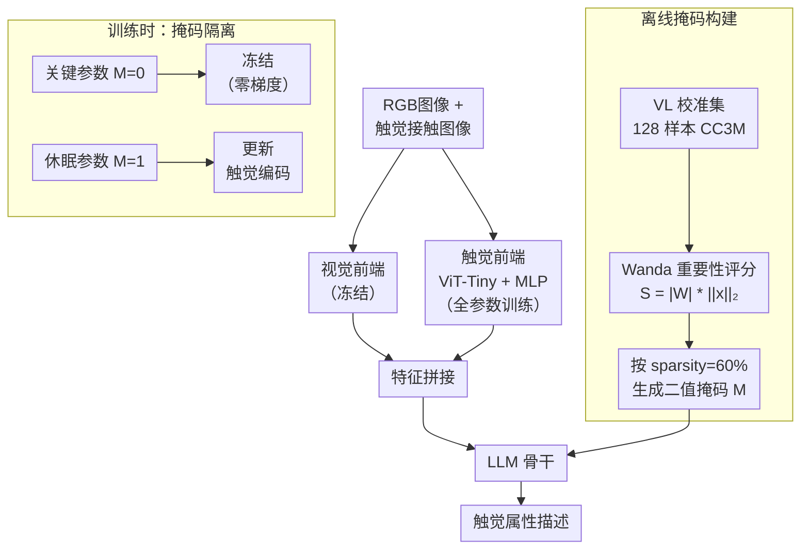

# Wake up for Touch! Mask-isolated Tactile Alignment Learning in MLLMs

**会议**: ECCV2026  
**arXiv**: [2607.00302](https://arxiv.org/abs/2607.00302)  
**代码**: [https://github.com/xxx](https://github.com/xxx) (有)  
**领域**: 多模态VLM / 触觉感知  
**关键词**: 触觉对齐, 小模型多模态, 灾难性遗忘, 参数稀疏化, 掩码微调  

## 一句话总结

本文提出 Splash，一种掩码隔离的触觉对齐框架，通过 Wanda 风格的重要性评分将小 MLLM 的 LLM 参数划分为"休眠"与"关键"两个子空间，只更新休眠子空间来编码触觉能力，冻结的关键子空间则作为稳定锚点保持原有视觉语言推理不受损害。

## 研究背景与动机

触觉是机器人感知物理世界的核心通道——仅凭视觉很难判断一个表面是光滑还是粗糙、柔软还是坚硬，但用手指轻轻一压就能知道。近年来，研究者尝试为多模态大语言模型（MLLM）赋予这种触觉感知能力，通过 visuo-tactile-language (VTL) 对比学习把触觉信号对齐到视觉语言表征空间。这些努力虽然让分类和检索这类判别式任务有了可喜进展，但对于需要高层的语义推理和指令跟随的复杂操作决策而言，它们远远不够。MLLM 凭借其 LLM 骨干中编码的世界知识，天然适合承担触觉信号的开放集语义推理。

然而，一个根本的矛盾在于：要在资源受限的边缘机器人上部署，MLLM 必须足够小（3B 以下），但小模型的参数预算极度有限。把触觉这一全新模态塞进去，必然会与已有的视觉语言知识发生"零和竞争"——模型为了学会触觉属性描述，不自觉地把在视觉预训练中学到的特征覆盖掉了。一个典型的例子是：Qwen2.5-VL-3B 原本能准确识别物体，但在触觉微调后频繁产生视觉幻觉，把金属说成光滑、把织物说成金属。这就是灾难性遗忘。现有的 VTL 方法（如 TVL、UniTouch）采用两阶段流程（先对齐触觉编码器，再用 LoRA 等 PEFT 微调 LLM），在一定程度上缓解了参数量负担，但 LoRA 的低秩增量（θ+Δθ）依然会对整个参数流形产生扰动，遗忘问题并未根除。

本文的核心 idea 是：与其为触觉强迫模型长出新的参数，不如把模型内部已经存在但未被充分利用的"休眠"参数唤醒，让它们承担触觉编码任务，而关键的视觉语言参数保持冻结、纹丝不动。为此，作者提出 Splash，一个基于参数重要性掩码的触觉对齐框架，用一组 128 样本的校准集计算每个权重的视觉相对重要性，据此将 LLM 的参数空间一刀切为冻结的关键子空间和可训练的休眠子空间；训练时，触觉前端和休眠参数同时更新，关键参数零梯度。这样既不需要引入任何外部适配器模块（如 LoRA），也不改变模型结构，推理阶段零额外开销。

## 方法详解

### 整体框架

Splash 的整体流程分两步：离线构建掩码和单阶段训练。首先，使用一小批视觉语言校准数据（128 张 CC3M 图文对），对预训练小 MLLM（如 Qwen2.5-VL-3B）的 LLM 部分逐层计算每个权重的视觉相对重要性分数，低于阈值 s% 的权重被标记为"休眠"（可训练），其余为"关键"（冻结）。然后，在单阶段训练中同时更新触觉前端（ViT-Tiny + 2 层 MLP 投影）和 LLM 中的休眠参数，关键参数保持零梯度，通过 autoregressive 语言建模损失来对齐触觉描述生成。整个训练过程不需要分阶段，也不需要 LoRA 等外部模块。

### 关键设计

**1. 休眠子空间定位：用视觉相对重要性区分哪些参数可以被"征用"**

Splash 的核心前提是预训练 LLM 内部存在大量冗余参数——彩票假说（Lottery Ticket Hypothesis）已经表明只有一小部分参数对模型功能至关重要。关键问题是如何触觉对齐的语境下定义"重要"：重要不是相对于语言建模本身，而是相对于**视觉语言推理能力**。作者借鉴了 Wanda（一种简单有效的 LLM 剪枝方法）的思路，将每个权重 Wi,j 的重要性定义为该权重大小乘以其对应输入激活的 ℓ2 范数：Si,j = |Wi,j| · ||xi||2。这个乘积综合衡量了权重的结构重要性和该位置被激活的强度。用一个 128 样本的 VL 校准集上各样本的激活值求平均后，在每个线性层内按重要性分数排序，取分数最低的 s% 作为休眠参数（M=1），其余为关键参数（M=0）。此外，首尾各若干层（LLM 的第一和最后一个 transformer block）强制标记为关键（M=0），因为输入层负责 grounding、输出层负责高层语义表征，这两处对分布偏移最敏感。这一设计保证了休眠子空间捕获的是模型结构中真正的冗余，而不是对特定校准集的过拟合——论文通过将校准数据换成随机噪声图像加无意义文本的实验证明了这一点，模型表现依然高度稳定。

**2. 掩码隔离训练：零梯度的关键参数作为稳定锚点**

在掩码构建完成后，训练过程是最简洁的：触觉前端 ℱψ（ViT-Tiny + MLP 投影器）全参数训练，LLM 部分的参数更新由二值掩码 M 限定——关键参数（M=0）梯度被 Hadamard 乘积清零，休眠参数（M=1）正常更新。这与 LoRA 有本质区别：LoRA 在旁路中加入 Δθ，推着整个参数分布偏移；而 Splash 是直接的稀疏替换——休眠参数的旧值被新值覆盖，关键参数完全不参与更新。实验表明，这种"结构性隔离"比 LoRA 的"增量式适应"更能保护 VL 能力。而且，因为不引入任何额外参数或旁路分支，推理时的计算图和参数量与原模型完全一致，没有任何额外开销（P99 latency 134.55ms，与原始 Qwen2.5-VL-3B 一致）。

**3. 统一单阶段训练：省掉触觉对齐的"预对齐"阶段**

现有 VTL 方法（如 TVL、UniTouch）通常需要两阶段训练：先通过对比学习把触觉编码器的输出与视觉或语言表征空间对齐，再冻结触觉编码器、用 LoRA 微调 LLM 做多模态推理。Splash 得益于参数隔离设计，只需要一个阶段：触觉前端和 LLM 休眠子空间同时接受 autoregressive language modeling loss（标准的下一个 token 预测损失）的监督。这极大简化了训练流程（只需 1 epoch 即可收敛），而且不需要设计额外的对比损失对齐目标。触觉前端可以从头开始（ImageNet 预训练 ViT-Tiny）而不是用 VTL 预训练权重初始化——论文特意做了控制实验，即使触觉前端换成和 TVL 一样的预训练初始化，Splash 仍然显著优于 TVL，证明增益主要来自掩码隔离策略本身而非前端初始化。

### 损失函数 / 训练策略

训练目标为标准自回归语言建模损失：

$$
\mathcal{L} = -\sum_{n=1}^{N} \log P(y_n | Y_{<n}, X_R, X_C, X_T)
$$

其中 XR 为 RGB 图像，XC 为触觉接触图像，XT 为文本 prompt。触觉前端参数 ψ 全参更新，LLM 参数 θ 只更新休眠子空间（M ⊙ ∇θℒ）。关键超参：sparsity ratio s=60%，初始学习率 2×10-5（Splash-3B）/ cosine decay / warmup 0.05，AdamW with weight decay 0.0，训练 1 epoch（3B）或 2 epoch（1B）。

## 实验关键数据

### 主实验：触觉描述生成（LLM Judge 评分，满分 10）

| 数据集 | 指标 | Splash-3B | 此前最佳 TVL (Qwen3B) | 提升 |
|--------|------|-----------|----------------------|------|
| SSVTP | GPT-4o 评分 | 5.48 | 4.98 | +0.50 |
| TVL | GPT-4o 评分 | 4.39 | 4.29 | +0.10 |
| TacQuad | GPT-4o 评分 | 4.86 | 4.22 | +0.64 |
| 平均 | - | 4.91 | 4.50 | +0.41 |

在客观指标（F1 / Top-5 Accuracy）上 Splash 同样全面领先。尤其值得注意的是，Splash-1B（只用了 1B 参数的 InternVL 骨干）已在平均分上超越 UniTouch 的 7B LLaMA 基线（5.01 vs 3.74），说明掩码隔离策略充分利用了小模型的有限容量。

### VL 能力保持

| 基准 | Zero-shot Qwen3B | TVL (Qwen3B) | Splash-3B |
|------|-----------------|-------------|-----------|
| MMMUval | 53.1 | 50.0 | **55.3** |
| MathVista | 62.3 | 52.8 | **65.3** |
| MMBench-EN | 79.1 | 76.8 | 78.0 |

Splash-3B 在 MMMUval 和 MathVista 上甚至超过了 Zero-shot 原始模型，说明掩码隔离的适配过程带来了一种剪枝式正则化效果，进一步稳定了预训练推理流形。对比之下，TVL 的 LoRA 微调在两个基准上都有明显掉点（MMMU 从 53.1→50.0，MathVista 从 62.3→52.8）。

### 消融实验

| 配置 | VTL 平均 | MMMUval | 说明 |
|------|---------|-------------------|------|
| 全参微调 (s=100%) | 4.73 | 22.0 | VL 能力灾难性崩溃 |
| s=80% | 4.85 | 52.6 | 较大退化 |
| **s=60%** | **4.91** | **55.3** | **最佳平衡** |
| s=40% | 4.90 | 52.6 | VL 稍降 |
| s=30% | 4.79 | 52.0 | 触觉学习受限 |

超参数分析发现：s=60% 是最优平衡点——超过 60% 休眠参数太多会灾难性遗忘 VL 能力（s=100% 时 MMMU 从 53 暴跌至 22），低于 40% 则冻结过多导致触觉表征能力不足。另外，校准样本数 64/128/256 表现几乎一致（鲁棒性极强）；甚至把校准数据换成无意义的噪声图像+空文本，"校准自由"的设置也仅下降 0.03 个 VTL 平均分，证明 Wanda 指标捕捉到的是模型架构内在的冗余模式，而非对特定语义分布的过拟合。

## 亮点与洞察

- **"唤醒休眠参数"的直觉非常自然且优雅**：不引入任何外部模块，不改变模型结构，不增加推理延迟，只靠一个离线掩码就让触觉能力嵌入 LLM 的内部参数空间。这比 LoRA/Adapter 等 PEFT 方案更"干净"——因为 LoRA 的旁路在推理时合并后仍会轻微扰动原始权重分布，而 Splash 的直接替换是严格的结构隔离。
- **触觉=新模态隔离的特例可以推广到模态级多任务学习**：本文成功将剪枝领域"跨任务参数隔离"的思路从任务级扩展到模态级（vision→tactile）。如果这个思路成立，理论上可以用同一小 MLLM 为听觉、温度的多种感知模态各分配一个休眠子空间，训练不同的前端编码器，实现"一模型多模态"而不互相干扰。
- **单阶段训练极大降低了部署门槛**：对 VTL 方法不需要做两阶段预对齐+微调，触觉前端可以直接用通用预训练权重初始化，1 个 epoch 即可达到 SOTA，对计算资源有限的机器人团队非常友好。

## 局限与展望

- 休眠子空间在离线确定后是静态的，而机器人交互中激活模式随操作状态（握持力、接触姿态、任务阶段）动态变化，静态掩码难以自适应长时程触觉推理。论文自身提出了动态自适应掩码作为未来方向。
- 实验目前只基于 DIGIT 光学触觉传感器，跨传感器（GelSight、TacTip 等）泛化尚未验证。好在 Splash 的触觉前端设计是无关的，切换传感器只需更换 ViT 编码器。
- sparsity ratio 在 1B 规模模型上的敏感性高于 3B 模型（1B 的 VL 性能在 s=60% 时有明显掉点），小模型的冗余度较低，"安全区"更窄，需要更精细的层间非均匀分配策略。

## 相关工作与启发

- **vs TVL / UniTouch**: 它们用 7B LLaMA 骨干+两阶段对齐+LoRA 微调；Splash 用 3B sMLLM + 单阶段 + 参数隔离。Splash 以更小的模型达到了更高或持平的触觉推理性能，且 VL 能力在任何基准上都不掉点。
- **vs LoRA 等 PEFT**: LoRA 是增量式适应（θ+Δθ），会对整个参数流形产生不可控的扰动；Splash 是稀疏替换式适应（M⊙θ），只更新休眠参数，关键参数状态不变。当任务目标是保护原有多模态能力时，隔离策略明显优于增量策略。
- **vs Wanda (剪枝)**: Splash 借用了 Wanda 的重要性评分公式，但目的完全相反——Wanda 用它来移除不重要参数（剪掉），Splash 用它来标记"可以被征用的"休眠参数（训练它们）。剪枝和专业化使用的背后是同一个假设：模型存在大量冗余。

## 评分

- 新颖性: ⭐⭐⭐⭐⭐ 把剪枝领域的参数重要性度量巧妙地反用到新模态的"定向激活"，掩码隔离训练的 idea 简洁且有力，在触觉对齐这个具体问题上有开创性。
- 实验充分度: ⭐⭐⭐⭐ 三个 VTL benchmark + 五个通用 VL benchmark + 详尽的 sparsity/校准数据/自适应策略消融，质性和量化分析充分；缺的是跨传感器泛化实验和真实机器人部署的闭环验证。
- 写作质量: ⭐⭐⭐⭐⭐ 问题动机明确、方法直觉清晰（从彩票假说切入，逐步推导到休眠子空间定位→掩码隔离训练），贡献层次分明，图表质量好。
- 价值: ⭐⭐⭐⭐⭐ 对嵌入式边缘机器人部署小 MLLM 有直接实用价值。参数隔离的思路可推广到其他新模态（音频、温度、力觉）的增量学习，有较高的领域外迁移潜力。

<!-- RELATED:START -->

## 相关论文

- [\[CVPR 2026\] Seeing Through Touch: Tactile-Driven Visual Localization of Material Regions](../../CVPR2026/multimodal_vlm/seeing_through_touch_tactile_localization.md)
- [\[ECCV 2026\] UniTac: A Unified Multimodal Model for Cross-Sensor Tactile Understanding and Generation](unitac_a_unified_multimodal_model_for_cross-sensor_tactile_understanding_and_gen.md)
- [\[ECCV 2026\] ADAPT: Attention Dynamics Alignment with Preference Tuning for Faithful MLLMs](adapt_attention_dynamics_alignment_with_preference_tuning_for_faithful_mllms.md)
- [\[CVPR 2026\] Towards Dynamic Modality Alignment in Multimodal Continual Learning](../../CVPR2026/multimodal_vlm/towards_dynamic_modality_alignment_in_multimodal_continual_learning.md)
- [\[ECCV 2026\] Staying VIGILant: Mitigating Visual Laziness via Counterfactual Visual Alignment in MLLMs](staying_vigilant_mitigating_visual_laziness_via_counterfactual_visual_alignment_.md)

<!-- RELATED:END -->
