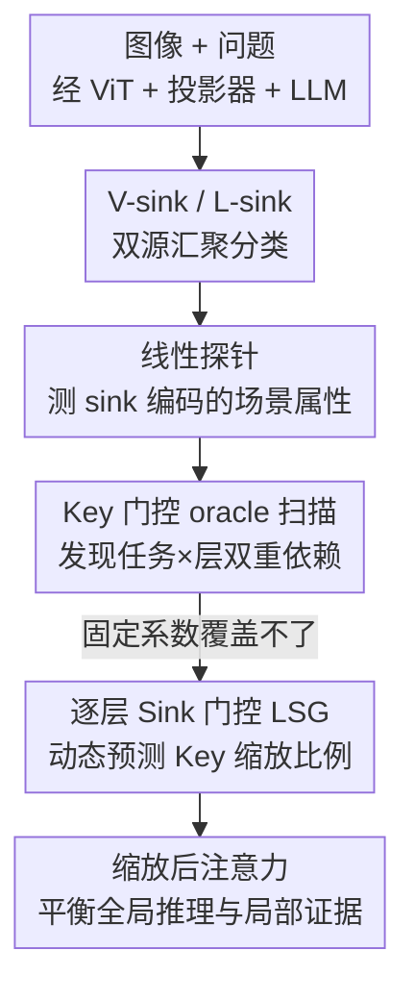

# When Sinks Help or Hurt: Unified Framework for Attention Sink in Large Vision-Language Models

**会议**: ECCV 2026  
**arXiv**: [2604.03316](https://arxiv.org/abs/2604.03316)  
**代码**: [https://github.com/JH-GEECS/lsg_public](https://github.com/JH-GEECS/lsg_public) (待发布)  
**领域**: 多模态VLM  
**关键词**: 注意力汇聚 (attention sink)、视觉 token、可解释性、层级门控、LVLM

## 一句话总结
本文把大视觉语言模型里的"视觉注意力汇聚点"拆成来自视觉编码器的 V-sink 和在 LLM 深层新生的 L-sink 两类，揭示它们编码全局场景先验、有利于粗粒度推理却压制细粒度感知的双刃剑效应，并提出一个冻结主干、只训练轻量 MLP 的逐层门控 LSG，按输入和层深动态调整 sink 的 Key 缩放，在多模态 benchmark 上普遍涨点。

## 研究背景与动机
注意力汇聚（attention sink）在纯语言和纯视觉的 transformer 里都早已被观察到：LLM 里 [BOS] 或标点这类语义贫乏的 token 会持续吸走异常大的注意力权重，根源是隐藏状态里某几个固定维度上的巨大激活（massive activation）；ViT 里则是一些低信息量的背景 patch 因为高 $\ell_2$ 范数而聚集注意力，被用来传播全局上下文。到了大视觉语言模型（LVLM，如 LLaVA）里，视觉 token 序列中同样冒出这种汇聚点，但它们到底是该被清除的冗余伪影，还是承载有用全局先验的必要锚点，学界一直没有定论——Kang 等人认为 sink 与性能基本无关、主张把注意力重新分配走，Luo 等人却认为 sink 编码了关键全局信息、应当按任务主动调节，两派结论直接冲突。

之所以吵不清，是因为过去的工作把 LVLM 里的视觉 sink 当成同质的一坨来处理，既没区分它们的计算来源，也没检验它们在 LLM 逐层传递中信息如何演化。本文第一步就把视觉 sink 按来源劈成两类：V-sink 直接从视觉编码器继承过来、以整体偏高的范数进入 LLM；L-sink 在 ViT 输出阶段还很普通，却在 LLM 深层通过维度特异的尖锐激活自己长出来。两者虽然都吸走大量注意力，但成因和激活形态完全不同，因此有理由怀疑它们承载着不同信息。进一步的线性探针分析证实：两类 sink 都稳定编码了物体数量、颜色、形状、尺寸这类场景级全局属性，而且这些信息在 LLM 逐层传递中几乎不衰减。但"信息存在"不等于"模型真的用了它"，于是作者又用注意力干预去逼问：在哪些层、以什么方式调节 sink，才真正改变下游推理？这一步暴露了核心矛盾——重新平衡 sink 与普通 token 的注意力是把双刃剑：对需要全局上下文的粗粒度任务，sink 至关重要，强化它有益；对需要精确局部证据的细粒度感知任务，sink 的主导反而压制了关键视觉细节，得抑制它；更麻烦的是，同一个任务里这种利弊还会随层深反转。固定的缩放系数根本没法同时照顾这么多相互矛盾的情形。

**核心 idea：既然 sink 的最优调节方向既依赖任务又依赖层深、无法用一个固定系数覆盖，就用一个逐层的轻量门控网络，从"最后一个输入 token"的隐状态里读出输入内容，为每一层动态预测 V-sink 相对其余视觉 token 的 Key 缩放比例，只用下一个 token 预测损失训练、主干全程冻结。**

## 方法详解

### 整体框架
本文的骨架是"先分析、后建模"：前半部分（Stage 分析）建立一套统一的视觉 sink 分类学并测量它们的作用规律，后半部分（LSG）把规律固化成一个可学习的门控模块。分析侧先按公式 $\hat{\mathcal{I}}^{\ell}=\{j\mid \max_{d\in\mathcal{D}_{\mathrm{sink}}}|(\mathbf{h}_j^{\ell})[d]|\ge\tau\}$ 用 sink 维度上的激活幅值阈值把视觉 token 分成 V-sink / L-sink / 普通三组（LLaVA-1.5 里 sink 维度是 CLIP 的 650、LLaMA-2 的 1415/2533），再用线性探针查这三组在 CLEVR 上编码了多少场景属性，最后用"Key 门控"逐层扫描不同缩放系数下的准确率变化，画出一张任务 × 层的最优系数地图。这张地图告诉我们：调节 sink 的效果随任务、随层深反转（Observation 1、2），且把"其余"组再细分成 L-sink 和普通 token 收益甚微（Observation 3）。

建模侧（LSG）据此做了两个关键取舍：分组上只保留 V-sink vs. 其余（两组），干预对象上只缩放 Key 向量。在每两个 LLM 层之间插一个轻量的两层 MLP 门控 $g_\ell$，它读第 $\ell$ 层最后一个输入 token 的隐状态 $\mathbf{h}_{\mathrm{last}}^\ell$，输出下一层给 V-sink 和其余视觉 token 分配的注意力比例，据此缩放它们的 Key。整个 LVLM 主干（视觉编码器、投影器、LLM）全部冻结，只用标准的下一 token 预测损失训练门控，不需要任何任务标签或 oracle 系数监督。

### 关键设计

**1. V-sink 与 L-sink：按计算来源劈开的双源汇聚分类**

过去把 LVLM 里所有视觉 sink 混为一谈，导致"sink 有没有用"的争论鸡同鸭讲——因为不同来源的 sink 本就该有不同角色。本文的第一刀是按成因把视觉 sink 分成两类：V-sink 是在视觉编码器里就已经成型的汇聚点，它们在 ViT 的双向注意力下于少数 sink 维度上长出尖锐激活尖峰，但穿过那个没有残差连接、"线性变换 + 非线性"的两层 MLP 投影器后，集中的激活被摊平到各输出维度，于是进入 LLM 时表现为"整体范数偏高"而非某个维度的尖峰。L-sink 则相反，在 ViT 输出时和普通 token 没区别，是进了 LLM 后由早期 FFN 在与文本 sink 相同的那几个维度（如 2533）上写入巨大激活、再靠残差连接维持下来的，成因完全复刻了文本 [BOS] sink 的机制。判定上两者共用式 (2) 的阈值准则，只是 V-sink 在投影器前（ViT 侧）判定、之后视作固定索引集，L-sink 在 LLM 每一层逐层判定。这一分类的价值在于：它给"sink 到底编码什么、该不该动"提供了可分析的抓手，后面所有分析和方法都建立在这三组划分之上。

**2. 线性探针：证明两类 sink 都稳定编码全局场景属性**

分类之后要回答"这些 sink 里到底装了什么信息"，本文在 CLEVR 上设计线性探针，逐层从 V-sink、L-sink、普通 token 的池化隐状态里探测四种场景属性——物体数量（多分类）、最大物体尺寸分箱（多分类）、颜色和形状（各为多标签）。为公平对照，普通组的构造是先剔除任意层被判为 V/L-sink 的 token，再从剩下的池子里随机采 5 个 token（约占 576 个 patch 的 1%）取平均，并重复 5 次独立采样报均值 ± 标准差。结果很清楚：两类 sink 在全部四个任务上都胜过普通 token，且优势在早中层最明显——尤其数量预测（单个 patch 无论如何看不全的整体属性）差距最大，坐实了 sink 汇聚的是场景级摘要信息。更关键的是第二个发现：sink 的探针精度在深层要么保持要么上升，几乎不衰减；这与语言 token 在早层就被迅速"抹去身份"的现象截然相反，说明视觉 sink 里的场景信息贯穿整个 LLM 都被保留。但作者也诚实点出：信息存在不代表模型推理时真的用了它，这才引出下一步的注意力干预。

**3. Key 门控 oracle 扫描：暴露 sink 调节的任务 × 层双重依赖**

探针只说明信息"在"，要验证它"被不被用"、以及怎么用最有利，本文引入"Key 门控"做因果干预：在某一层把某组 token 的 Key 向量乘上一个标量系数，从而平滑改变它在 softmax 前 logits 里占的注意力质量。之所以选 Key 而非直接改注意力权重，是因为缩放 Key 直接调制 pre-softmax logits、进而控制各组拿到多少注意力概率质量。干预后的注意力为

$$\mathrm{Attn}\big(\mathbf{Q},\mathrm{diag}(\mathbf{s})\cdot\mathbf{K},\mathbf{V}\big)=\mathrm{SoftMax}\!\left(\frac{\mathbf{Q}\big(\mathrm{diag}(\mathbf{s})\cdot\mathbf{K}\big)^{\top}}{\sqrt{D}}\right)\mathbf{V}$$

其中 $\mathbf{s}$ 是按组赋值的 token 系数向量。作者对全部 32 层逐层扫描、把 V-sink 与其余的系数从 (0.0,1.0) 到 (1.0,0.0) 以 0.1 为步长遍历，得到三个关键观察：其一是任务依赖（Observation 1）——重平衡 sink 注意力的效果会随任务反向，细粒度感知每层调节都涨（最高 +6.49%），粗粒度感知每次调节都掉（最高 −4.27%）；其二是层依赖（Observation 2）——同一任务里效果也随层深反转，逻辑推理在早层（L4–8）强化 sink 大涨 +7.07%，晚层（L22–26）同方向反而受损；其三（Observation 3）是把"其余"组再细分成 L-sink 和普通 token 收益极小，因为两类 sink 编码的全局信息高度冗余。正是这三条——固定系数覆盖不了的任务与层双重反转——直接催生了后面的学习式门控。

**4. LSG 逐层门控：用最后一个 token 的隐状态动态预测 Key 缩放比例**

oracle 扫描证明最优系数因输入、因层而异，固定值和输入无关的静态方案都覆盖不了这种变化，于是 LSG 把系数变成"可学、随输入"的。门控输入选的是每层最后一个输入 token 的隐状态 $\mathbf{h}_{\mathrm{last}}^\ell$——因为已有可解释性研究表明自回归 LLM 里这个 token 会逐层聚合视觉与查询语义、能通过线性探针预测模型的高阶判断，正好同时携带图像上下文和问题意图。据 Observation 3，分组只取两组（V-sink vs. 其余，"其余"含 L-sink 和普通 token）。门控 $g_\ell$ 是个带 LayerNorm 的两层 MLP（$D\to64\to2$），把 $\mathbf{h}_{\mathrm{last}}^\ell$ 映成分配 logits，经 softmax 得两组比例 $\rho_{\mathrm{vit}}^{(\ell+1)}+\rho_{\mathrm{rest}}^{(\ell+1)}=1$，再据此缩放各视觉 token 的 Key：$\tilde{\mathbf{K}}_j^{(\ell+1)}=\rho_{g(j)}^{(\ell+1)}\cdot\mathbf{K}_j^{(\ell+1)}$。这等于把式 (3) 里手工扫出来的系数换成了学习式、输入条件化的门控。相比之下，Kang 等人的方法只会"抑制"sink、Luo 等人的方案是静态的、DIYSink 虽输入条件化但只在输入级不分层——LSG 是唯一同时做到"输入条件化 + 逐层"的，这正对应 oracle 地图里既要强化又要抑制、既分任务又分层的复杂需求。

### 损失函数 / 训练策略
主干（视觉编码器、投影器、LLM）全部冻结，只训练门控 MLP，目标就是最标准的下一 token 预测损失

$$\mathcal{L}=-\sum_{t}\log p_{\theta}(x_t\mid x_{<t})$$

其中 $\theta$ 仅为门控参数，不用任何任务标签或辅助损失。每层单独训练一个门控（32 个独立 run），每个约 262K 参数（$4096\to64\to2$）；softmax 输出初始化为 $(\rho_{\mathrm{vit}},\rho_{\mathrm{rest}})=(0.5,0.5)$，等价于对所有视觉 token Key 施加 0.5 的均匀缩放，恰好落在网格搜索区间中点，给门控留出向两个方向学习的中性起点。训练数据是从 Cambrian-7M 里按 OCR / 通用 VQA / 计数 / 代码 / 数学 / 科学六类等比分层抽出的 10K 样本，2 个 epoch。5 层堆叠版共加约 1.3M 参数，仅占 7B 冻结主干的 0.02%。

## 实验关键数据

### 主实验
基线为未改动的 LLaVA-1.5-7B（MMStar 33.27，CVBench 57.29），全部报相对基线的准确率变化（%p）。

| 方法 | 输入条件 | 逐层 | ΔMMStar | ΔCVBench |
|------|:---:|:---:|:---:|:---:|
| VAR (Kang) | ✗ | ✗ | −0.01 | +0.75 |
| Sink-to-the-front (Luo) | ✗ | ✗ | −0.13 | −0.39 |
| DIYSink (CoT)† | ✓ | ✗ | +0.25 | +0.41 |
| LSG (单层 L10) | ✓ | ✓ | **+0.72** | **+2.14** |
| LSG (5 层堆叠) | ✓ | ✓ | **+1.55** | **+3.08** |

单层版就已全面超过所有先前 sink 处理方法；L10 是最佳单层，仅靠 10K 通用样本、无任务标识的 NTP 训练就拿到 +0.72 / +2.14；5 层堆叠 {L3,L6,L7,L10,L19} 进一步拉大到 +1.55 / +3.08。堆叠的做法是从最佳单层 L10 出发，按单层增益降序贪心加入独立训练好的门控、不重训。

### 消融实验

| 类别 | 配置 | ΔMMStar | ΔCVBench | 非负/负 (共10) |
|------|------|:---:|:---:|:---:|
| — | LSG (默认 $\mathbf{h}_{\mathrm{last}}$, V-sink vs 其余) | +0.72 | +2.14 | 8/2 |
| A. 门控信号 | mean-pool 全部 token | −0.28 | −0.07 | 5/5 |
| A. 门控信号 | mean-pool 仅视觉 token | −0.30 | −0.15 | 3/7 |
| B. 分组 | L-sink vs 其余 | +1.07 | +1.75 | 6/4 |
| B. 分组 | 三组 (V/L/普通) | +0.98 | +2.96 | 8/2 |
| 对照 | LoRA rank-8 @L10 (同参量 262K) | +0.70 | **−5.30** | — |

### 关键发现
- **门控信号必须用 $\mathbf{h}_{\mathrm{last}}$**：两种 mean-pool 都把聚合在最后 token 的查询相关信号稀释成位置平均、失去查询特异性，仅视觉 mean-pool 甚至掉了 7/10 子任务；$\mathbf{h}_{\mathrm{last}}$ 是唯一在两个 benchmark 上都稳定涨、8/10 子任务非负的选择。
- **有效层集中在 L3–19**：这段正好与跨模态信息在 LLaVA-1.5 第 4–20 层最活跃的已知结论重合；L2 太浅、最后 token 还没聚够视觉信息，门控停在 0.5 初始化附近不分化输入（同层 ST 涨 +10%p 但 Rel 掉 −16%p，整体受损）；L20 之后跨模态传递基本结束，再调 sink 也激不起有意义的表征变化。
- **收益源于 sink 结构而非参数量**：同为 262K 参数的 LoRA 在 MMStar 上涨幅相当（+0.70），却把 CVBench 砸了 −5.30，说明 LSG 的增益来自 sink 特异的门控结构，不是多出来的参数。
- **门控确实学出了任务分化**：L10 处门控把 CVBench 的 Count/Relation 收敛到 ρ≈0.05、Depth/Distance 到 ≈0.20、MMStar 子任务落在 0.30–0.45，与"细粒度低 sink、推理高 sink"的 oracle 规律一致；L2 处则始终不分化，性能也差。

## 亮点与洞察
- **把"sink 有没有用"这个二元争论化解成一张任务 × 层的连续地图**：本文最漂亮的一点是没有站队"删除"或"保留"，而是用 oracle 扫描证明答案是"看任务、看层深，既要强化也要抑制"，一举调和了 Kang（抑制派）和 Luo（保留派）两派看似矛盾的结论——这种"双方都对但只对了一半"的框架很有说服力。
- **投影器缺残差连接如何"抹平"V-sink 的尖峰**：对 V-sink 为何进入 LLM 后从维度尖峰变成整体高范数的机制解释（两层 MLP 的线性变换把集中激活摊到各维），是很扎实的可解释性洞察，可迁移去理解其他"经投影器跨模态"的表征重构现象。
- **零任务标签的门控自己复现了 oracle 规律**：LSG 只用通用 NTP 损失、不碰任何 oracle 系数或任务标签，却学出了"细粒度输入压低 sink、推理输入抬高 sink"的方向性，且增益集中在跨模态传递活跃层——这说明 $\mathbf{h}_{\mathrm{last}}$ 里本就编码了足够的任务可分信号，是可复用到其他"从内部隐状态读任务意图"的即插即用模块思路。
- **即插即用、主干冻结、0.02% 参数**：整套方法不动骨干、每层一个 262K 的小 MLP，工程上极轻，适合给已部署的 LVLM 打补丁。

## 局限与展望
- **绝对增益偏小**：单层 MMStar 仅 +0.72、5 层也就 +1.55，相比 oracle 上界（如 ST +12.02、FG +6.49）恢复率多在 30–70%；作者归因于 NTP 损失同时聚合所有任务的梯度、把门控推向保守系数，回避伤害任一任务而非追求单任务极值。
- **多层堆叠是次可加的**：独立训练的门控堆起来收益远低于各自单层增益之和，因为推理时每个门控面对的隐状态已被其它门控改动过、存在训练-推理分布偏移；联合训练虽提 CVBench 却因参数空间放大 5 倍在固定 10K 数据上更易过拟合而拉低 MMStar。
- **验证主要在 LLaVA-1.5-7B**：核心分析集中在单一架构，虽在 LLaVA-OneVision（SigLIP+Qwen2）及 Phi-3+CLIP、Qwen2.5+SigLIP 上复现了 sink 分类学与 oracle 规律、学习式 LSG 也给出同号增益，但那些只是初步证据，跨架构的 LSG 增益明显更小（如 Phi-3 上 MMStar 仅 +0.21）。
- **阈值判定在深层不稳**：如 LLaVA-OneVision 深层因残差范数增长，固定 τ 会把大量边界 token 误判为 L-sink（L20–24 计数飙到 ~100），是阈值伪影而非真 sink，说明这套基于固定阈值的 sink 识别在范数漂移的架构上需要更鲁棒的判据。

## 相关工作与启发
- **vs VAR (Kang et al.)**: 他们只分析 L-sink、认为 sink 与性能无关并单向把注意力从 sink 重分配走（suppress-only、头级、固定阈值）；本文证明这只对细粒度感知成立，在推理任务上 oracle 反而要在 32 层中 26 层抬高 sink 注意力，因此单向抑制会伤推理。
- **vs Sink-to-the-front / DIYSink (Luo et al.)**: 他们只分析 V-sink、认为其编码关键全局信息、在投影器嵌入层做静态或输入级调节；但因 LLM 每层 RMSNorm 会重归一化，投影器级的标量重加权控制深层相对注意力的能力有限，且 DIYSink 的 CoT 路由只在输入级不分层。本文改在归一化之后的 Key 上干预、直接调 pre-softmax logits，并做到逐层 + 输入条件化，覆盖了前两者各自只碰到的那部分 (任务, 层) 版图。
- **vs Wang et al. (V-attention)**: 二者都用连续缩放做干预，但 Wang 给每个注意力头独立赋标量以定位对特定视觉语义有影响的头；本文给每个 token 组赋标量并在层内所有头上一致施加，问的是 sink 与普通 token 的相对注意力分配如何影响推理，干预轴不同。
- **vs 寄存器 token (Darcet et al.)**: ViT 侧用额外 register token 吸走伪影以改善稠密预测；本文不新增 token、而是原地对已有 sink 做逐层门控，且把分析从 ViT 输出延伸到 LLM 逐层的信息演化，补上了前者没看的"跨 LLM 层信息如何变化"这一段。

## 评分
- 新颖性: ⭐⭐⭐⭐⭐ 首次给 LVLM 视觉 sink 建立"双源分类 + 任务×层地图"的统一框架，把对立两派结论调和进一张连续图。
- 实验充分度: ⭐⭐⭐⭐☆ 分析扎实（探针 + 全 32 层 oracle 扫描 + 多架构复现），但方法侧绝对增益偏小、多 benchmark 与多 seed 覆盖仍显克制。
- 写作质量: ⭐⭐⭐⭐⭐ 逻辑链（分类→探针→干预→门控）环环相扣，观察与设计取舍一一对应，附录对阈值伪影等诚实交代。
- 价值: ⭐⭐⭐⭐☆ 即插即用、冻结主干、0.02% 参数的轻量补丁，兼具可解释性洞察与实用性，但涨点幅度限制了直接落地吸引力。

<!-- RELATED:START -->

## 相关论文

- [\[ECCV 2024\] Attention Prompting on Image for Large Vision-Language Models](../../ECCV2024/multimodal_vlm/attention_prompting_on_image_for_large_visionlanguage_models.md)
- [\[ICML 2026\] Large Vision-Language Models Get Lost in Attention](../../ICML2026/multimodal_vlm/large_vision-language_models_get_lost_in_attention.md)
- [\[CVPR 2026\] Addressing Exacerbated Attention Sink for Source-Free Cross-Domain Few-Shot Learning](../../CVPR2026/multimodal_vlm/addressing_exacerbated_attention_sink_for_source-free_cross-domain_few-shot_lear.md)
- [\[CVPR 2026\] Test-Time Attention Purification for Backdoored Large Vision Language Models](../../CVPR2026/multimodal_vlm/test-time_attention_purification_for_backdoored_large_vision_language_models.md)
- [\[ACL 2026\] When Seeing Overrides Knowing: Disentangling Knowledge Conflicts in Vision-Language Models](../../ACL2026/multimodal_vlm/when_seeing_overrides_knowing_disentangling_knowledge_conflicts_in_vision-langua.md)

<!-- RELATED:END -->
