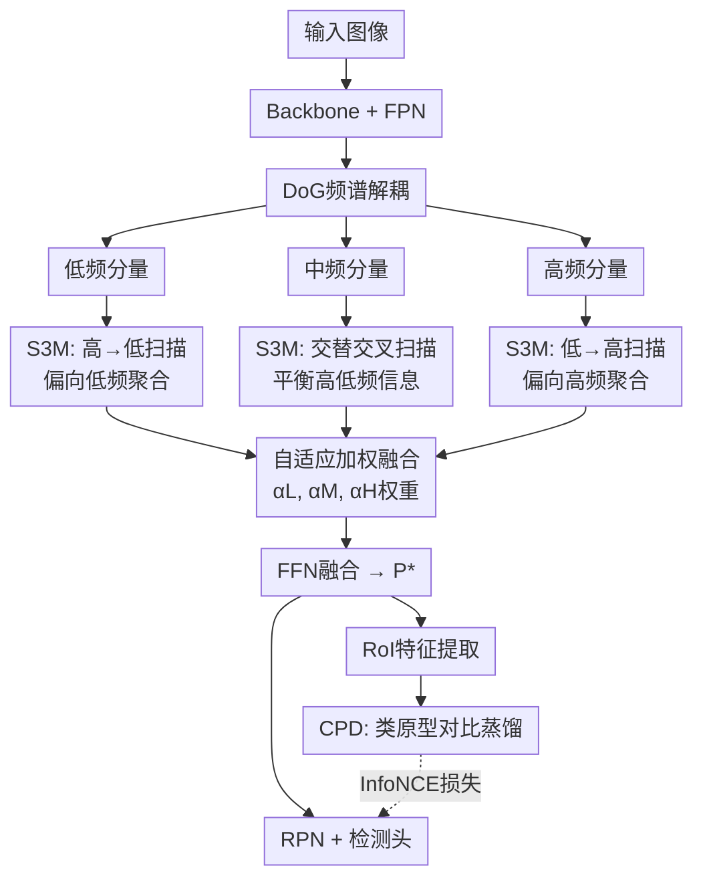

# Adaptive Spectrum-Aware Feature Disentangled Network for Small Object Detection

**会议**: ECCV2026  
**arXiv**: [2606.29029](https://arxiv.org/abs/2606.29029)  
**代码**: [https://github.com/ManOfStory/SFDNet](https://github.com/ManOfStory/SFDNet)  
**领域**: 目标检测  
**关键词**: 小目标检测, 频谱解耦, 状态空间模型, 原型蒸馏, 背景抑制

## 一句话总结
SFDNet将特征在频谱域显式解耦为低/中/高三频分量，分别为每个频谱设计专属的Mamba扫描策略进行上下文建模后自适应融合，同时构造类别级原型通过对比蒸馏压缩同类目标特征分布，在AI-TOD和SODA-D/SODA-A上大幅超越此前SOTA。

## 研究背景与动机

小目标检测（Small Object Detection, SOD）在遥感、无人机巡检、自动驾驶等应用中至关重要，其根本困难在于目标仅占据数十甚至几个像素，缺乏足够的视觉线索，极易与背景混杂。近年来业界从数据增强（复制粘贴、GAN/扩散模型生成）、标签分配（基于Wasserstein距离的适应策略）和特征增强三个方向持续推进，其中特征增强是最核心的环节：FPN金字塔中高层语义已严重衰减，小目标的有效信号几乎被背景噪声淹没。最新的方法如HS-FPN尝试用高通滤波器压制低频背景成分，SET通过频谱增强突出小目标相关频段，但它们都基于一个隐含假设——噪声集中在某几个频段。然而事实并非如此：实测发现，不同频率分量对不同尺度的目标有截然不同的敏感性——低频对背景结构和大尺度干扰响应最强，中频能覆盖从极微小到中等目标，高频对极微小目标特别敏感。噪声是分布在整个频谱上的，只处理单个频段必然丢失其他频段的互补信息。

第二个关键问题在于同类目标的语义相关性未被充分利用。同类别的小目标往往共享相似的外观模式（如遥感图像中成排的车辆、屋顶），但现有方法要么通过超分辨率/特征模仿/记忆检索为每个实例独立增强表示，要么用IoU或余弦相似度等固定度量做实例级关系分组——前者只关注个体、忽略了类别共性，后者泛化能力有限。真正需要的是类别级别的语义监督：一种能够显式建模「所有属于该类别的目标的共同特征」的机制，迫使同类目标的特征在嵌入空间中压缩到一起。

为解决上述两个问题，SFDNet提出了两条互补的技术线索协同工作。**核心idea：一方面通过自适应频谱解耦（ASD）将FPN特征显式拆解为低/中/高三频分量，在每个分量上设计专属的Mamba扫描策略进行上下文建模后按可学习权重融合，实现全频谱的背景消歧；另一方面通过类原型蒸馏（CPD）构建和维护类别级原型嵌入，用对比学习拉近同类提案特征与类原型的距离。ASD确保每个目标从噪声中分离出干净的频谱特征，CPD确保同类目标在这些特征空间中被紧密压缩。**

## 方法详解

### 整体框架

SFDNet基于标准的"Backbone + FPN + 检测头"范式，核心在于FPN之后引入自适应频谱解耦（ASD）模块替换常规卷积/注意力增强，并在训练时附加类原型蒸馏（CPD）分支提供对比监督。整体流程为：输入图像经Backbone提取多尺度特征{C2, C3, C4, C5}，FPN自顶向下聚合为{P2, P3, P4, P5}；以任意金字塔层P为例，ASD模块先通过Difference of Gaussian（DoG）将P解耦为低频Plow、中频Pmid和高频Phigh三个互补分量；每个分量经FFT变换到频域后拆分为幅度谱A和相位谱Φ，分别叠加上可学习位置编码后送入Sequential State Space Model（S3M）进行频谱相关的上下文建模；建模后的各频谱分量经IFFT转回空间域，按可学习重要性向量αL、αM、αH加权后经FFN融合为增强特征P*。P*一方面供RPN和检测头进行目标定位与分类，另一方面在训练时经RoI Align提取GT和Proposal特征，送入CPD分支进行类原型蒸馏。

下图中S3M内部的"高→低扫描""交替交叉扫描""低→高扫描"即为多频谱扫描策略的具体方向——这是第2个关键设计的核心。

### 关键设计

**1. 自适应频谱解耦（ASD）：全频谱协同消歧**

小目标检测中最常见的失败模式是将背景纹理误判为目标或被背景噪声淹没目标信号，而不同背景干扰分布在不同的频率带上。ASD的设计思路是先通过DoG操作将特征显式拆为三个互补频段，再让模型在每个频段内分别做上下文聚合，最后自适应融合。DoG分解基于频率域高斯滤波：对特征P做FFT后分别乘以三组滤波器——低频保留高斯低通G(ω, kσ)以内的成分，中频提取G(ω, σ)与G(ω, kσ)之差对应的环形区域，高频取1 − G(ω, σ)之外的残差——经IFFT得到Plow、Pmid、Phigh。分解后的每个分量各自经过一套完整的FFT→幅度/相位分离→位置编码→S3M→IFFT链路完成频谱内建模。之所以不走DoG直接后接卷积的简单路线，是因为DoG解耦得到的各分量内的噪声形态差异很大（低频是平滑的大片区域伪影，高频是分散的孤立噪声点），必须用能够捕获长程依赖的序列模型（而非局部卷积）才能有效建模。最后，三路增强后的特征通过可学习向量αL/αM/αH（每个C维向量对应一个通道的重要性）加权后经FFN融合。这个自适应权重的设计是关键的：不同输入图像中目标尺度分布不同，各频谱的贡献比例理应动态调整。

**2. 多频谱扫描策略：频谱定制的Mamba上下文建模**

S3M内部使用的不是常规的序列扫描，而是为每个频谱专门设计的扫描顺序。这一设计的动机在于：状态空间模型（SSM如Mamba）按顺序处理序列，隐藏状态自然地被相邻元素主导而受远端元素影响减弱——这种顺序敏感性在频谱域中会引入频谱偏差。利用这一特性，可以为不同频谱设计偏置性的扫描路径，使SSM的聚合偏向该频谱所珍视的信息。具体来说，高频分量采用从频谱中心沿半径递增向外展开的螺旋式"低→高"扫描顺序（即从低频区域扫向高频区域），使高频成分在隐藏状态中占据主导地位；低频分量则用相反的"高→低"扫描（从外向中心收敛），让低频成分主导最终表示；中频分量采用"交替交叉扫描"，在扫描路径中轮换内圈和外圈的频谱区域，混洗高低频信号以消除SSM的固有偏置、实现跨频谱的平衡建模。实验表明，将这种频谱定制的扫描策略替换为通用的sweep、clockwise或neighbor扫描，AP均下降约2-3个点（从29.0降至26.2-27.0），证明扫描方向的选择对频谱建模有决定性影响。

**3. 类原型蒸馏（CPD）：类别级特征压缩**

即使ASD将每个目标的频谱特征清理干净，同类目标之间仍可能存在分散的语义差距——比如同是"车辆"这个类，不同实例因为姿态、遮挡、光照差异在特征空间中相距甚远。CPD的思路是在一个共享的嵌入空间中构建每个类别的语义原型，迫使属于同一类别的所有提案特征向该原型靠拢。具体实现：在每轮训练中，从ground-truth边界框提取RoI特征，经过一个Global Convolution层（压缩空间维度）和MLP投影得到嵌入向量Z = [z1, ..., zN]；为每个类别c初始化一个原型dc(0)作为该类别所有GT嵌入的经验均值。然后通过一个仿射引导的加权机制（受层次化亲和建模启发）对原型进行精化：计算每个GT嵌入与对应原型dc之间的余弦相似度，经softmax（温度κ控制浓度）转化为注意力权重，以加权和的形式重新估计原型d_c*。原型库在各mini-batch间通过动量更新保持全局稳定性：dc ← α·dc + (1−α)·dc*。最后，对RPN产生的提案框同样提取RoI特征并投影到同一嵌入空间，用InfoNCE对比损失使每个提案嵌入与对应类原型相似度最大化、与其他类原型相似度最小化。损失的系数γ=0.1，温度τ=0.07。CPD不是特征增强的替代，而是一种互补的监督机制——ASD在特征层清理噪声，CPD在表征层压缩类内距离。

### 损失函数与训练策略

总损失由三部分组成：IoU损失（边界框回归）、交叉熵分类损失和原型蒸馏损失，平衡系数γ=0.1。训练在单张A100上进行：AI-TOD输入800×800、36个epoch；SODA-D和SODA-A输入1200×1200、12个epoch。DoG参数σ=1.0、k=1.414。论文提供了两个变体：SFDNet（ResNet-50骨干）和SFDNet*（Spatial-Mamba骨干，效果更强）。

## 实验关键数据

### 主实验

**AI-TOD测试集**（8类别，28,036张航拍图，平均目标仅12.8像素）：

| 方法 | 来源 | AP | AP50 | AP75 | APvt | APt | APs |
|------|------|----|------|------|------|-----|-----|
| DINO-Deformable-DETR | ICLR2023 | 23.2 | 56.6 | 15.4 | 9.9 | 23.1 | 29.3 |
| DINO-5scale w/SET | CVPR2025 | 26.6 | 57.1 | 20.8 | 13.2 | 27.1 | 31.5 |
| CFINet | ICCV2023 | 24.7 | 53.9 | 18.6 | 11.7 | 26.4 | 28.1 |
| DNTR | TGRS2024 | 26.2 | 56.7 | 20.2 | 12.8 | 26.4 | 31.0 |
| HS-FPN | AAAI2025 | 25.1 | 55.7 | 19.1 | 12.1 | 25.3 | 29.9 |
| **SFDNet (ResNet-50)** | 本文 | **29.0** | **57.9** | **23.5** | **14.4** | **29.0** | **33.4** |
| **SFDNet* (Spatial-Mamba)** | 本文 | **31.7** | **64.9** | **25.6** | **17.6** | **32.8** | **36.1** |

在SODA-D（24,828张高分遥感图）、SODA-A（2,513张航拍图，定向检测）上也取得SOTA：SFDNet*分别在SODA-D上达34.2 AP（比HS-FPN高4.6 AP）、在SODA-A上达39.2 AP（比此前SOTA GauCho高6.0 AP）。

### 消融实验

**AI-TOD上各模块贡献**：

| 配置 | AP | APt | APvt | APs | APm |
|------|----|-----|------|-----|-----|
| Baseline（无ASD、无CPD） | 24.8 | 24.8 | 9.3 | 30.3 | 38.2 |
| + ASD | 28.6 | 28.8 | 13.8 | 33.2 | 39.2 |
| + CPD | 27.2 | 27.6 | 12.0 | 32.2 | 38.3 |
| Full（ASD+CPD） | 29.0 | 29.0 | 14.4 | 33.4 | 40.8 |

**扫描机制对比**：

| 策略 | AP | APvt | APt | APs |
|------|----|------|-----|-----|
| Sweep | 26.7 | 13.6 | 27.1 | 30.6 |
| Clockwise | 27.0 | 13.1 | 27.4 | 31.2 |
| Neighbor | 26.2 | 12.3 | 26.6 | 29.7 |
| **多频谱扫描（本文）** | **29.0** | **14.4** | **29.0** | **33.4** |

### 关键发现

- **ASD是最大的性能贡献者**：仅加ASD就带来+3.8 AP提升（24.8→28.6），CPD在ASD之上额外提升+0.4 AP（28.6→29.0）。两者在微小目标（APvt）上的提升尤为显著（基线9.3→Full 14.4，+5.1点），说明频谱消歧对小目标最敏感。
- **频谱聚合机制对比**：S3M（SSM）显著优于Attention（26.6 AP）、VMamba（26.4 AP）和Convolution（26.3 AP），证明在频率域中顺序敏感的SSM具有独特优势。
- **中频和高频分量删除掉点最多**：去掉中频和高频比去掉低频对性能伤害更大，说明小目标的核心信息集中在较高的频率范围，但低频的补充仍然必要（丢掉低频APvt从14.4降至11.4）。
- **DoG参数鲁棒性好**：σ在0.5-2.0、k在1.2-1.8范围内AP波动不超过0.3，无需精细调参。

## 亮点与洞察

- **用频谱解耦巧解背景干扰问题**：以往的背景抑制方法要么用固定的高通/低通滤波（丢失另一频段信息），要么引入对抗训练或注意力机制（计算重且不直接）。ASD将问题转化为"先拆开、各自处理、再自适应合并"，既保留了全频谱信息又让每个子网的建模目标更加聚焦。这种"分解→分别优化→融合"的范式值得迁移到其他含多源噪声的任务（如图像去噪、红外目标检测）。
- **扫描方向作为归纳偏置**：SSM的顺序敏感性通常是需要克服的缺点，但本文将其变成设计空间——通过为不同频率设计不同的扫描方向，让SSM的固有序偏置成为可控的归纳偏置。这一思路可推广到任何需要按特定频率/模式/方向优先聚合的任务。
- **CPD是轻量的特征对齐方案**：不同于基于图网络或记忆网络的关系建模（计算重、超参多），CPD仅维护一组类别原型向量和一个InfoNCE损失，几乎不增加推理开销（推理时CPD去除）。这为需要在特征层面做类别级约束的检测任务提供了一个可参考的轻量方案。
- **两个变体的设计合理**：ResNet-50版本适合资源受限场景，Spatial-Mamba版本追求极致性能，两者都在各自配置下达到SOTA。

## 局限与展望

- ASD模块在每个FPN层上执行FFT/IFFT + 3路S3M + 加权融合，计算开销相比标准FPN有所增加，在资源受限的边缘设备上部署可能受限。SFDNet*（Spatial-Mamba骨干）的总计算量更大，论文未报告具体FPS或参数量对比。
- CPD依赖ground-truth边界框来构建原型，在有噪声标注或不完整标注（长尾分布中某些类别实例极少）的场景下原型估计可能不稳定。动量更新α的取值在类别极度不平衡时可能需要逐个类别调整。
- 实验仅覆盖遥感/航拍场景（AI-TOD、SODA系列），尚未在通用场景的小目标检测（如CityPersons中的小行人）或密集场景（如VisDrone）中验证。全频谱解耦对近景场景中的小目标是否同样有效有待验证。
- DoG分解仍然是基于固定参数的FFT操作，虽然对σ和k鲁棒，但在理论上可以进一步将滤波器设计为可学习的（学习更优的频谱分解方式而非手工设定差值长度k）。

## 相关工作与启发

- **vs HS-FPN**：HS-FPN基于固定高通滤波器抑制低频、靠手工超参驱动，SFDNet的ASD通过DoG将全频谱拆成三分量后各自由SSM建模并自适应融合权重，无需手工设计频率阈值。
- **vs SET**：SET在特定频段做频谱增强（偏重信号增强），SFDNet在全频谱上做噪声抑制（偏重信号分离），两者思路互补，理论上可进一步结合。
- **vs DNTR**：DNTR在FPN的top-down路径中用对比学习抑制噪声，但噪声抑制在空间域进行、不分频率；SFDNet将抑制粒度细化到频域。
- **vs Spatial-Mamba**：Spatial-Mamba关注空间邻域的结构保持，SFDNet将其作为骨干在SFDNet*中使用，但S3M中的多频谱扫描是在频率域上进行的，两者作用层次不同、可组合使用。

## 评分

- 新颖性: ⭐⭐⭐⭐ [两个核心设计（频谱专属扫描+类原型蒸馏）在SOD领域均属首次，各自具有一定先验基础，但二者的系统级组合很有见地]
- 实验充分度: ⭐⭐⭐⭐⭐ [三个标准benchmark，模块消融、扫描机制、频谱成分、聚合函数、超参五组消融，定量和定性分析完备]
- 写作质量: ⭐⭐⭐⭐ [方法逻辑清晰，动机论证充分，但公式较多、图2的流程图可读性有改进空间]
- 价值: ⭐⭐⭐⭐ [全频谱消歧思路可推广至其他受背景干扰影响严重的视觉任务，代码开源]

<!-- RELATED:START -->

## 相关论文

- [\[CVPR 2026\] BDNet: Bio-Inspired Dual-Backbone Small Object Detection Network](../../CVPR2026/object_detection/bdnetbio-inspired_dual-backbone_small_object_detection_network.md)
- [\[ECCV 2026\] Following the Flow: Advection-Consistent Modeling for Event-based Small Object Detection](following_the_flow_advection-consistent_modeling_for_event-based_small_object_de.md)
- [\[ICCV 2025\] Uncertainty-Aware Gradient Stabilization for Small Object Detection](../../ICCV2025/object_detection/uncertainty-aware_gradient_stabilization_for_small_object_detection.md)
- [\[CVPR 2026\] DA-Mamba: Learning Domain-Aware State Space Model for Global-Local Alignment in Domain Adaptive Object Detection](../../CVPR2026/object_detection/da-mamba_learning_domain-aware_state_space_model_for_global-local_alignment_in_d.md)
- [\[CVPR 2026\] Rotation Invariant and Symmetry Aware Pixel Difference Network for Remote Sensing Object Detection](../../CVPR2026/object_detection/rotation_invariant_and_symmetry_aware_pixel_difference_network_for_remote_sensin.md)

<!-- RELATED:END -->
