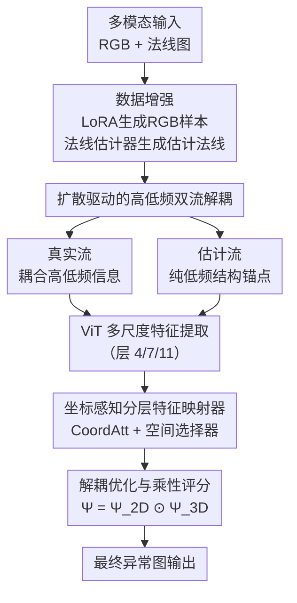

# CMDS-AD: Cross-Modal Dual-Stream Decoupling for Few-Shot Anomaly Detection

**会议**: ECCV 2026  
**arXiv**: [2606.20300](https://arxiv.org/abs/2606.20300)  
**代码**: [https://github.com/Junhaocai27/CMDS-AD](https://github.com/Junhaocai27/CMDS-AD) (有)  
**领域**: 异常检测 / 多模态 / 少样本学习  
**关键词**: 少样本异常检测, 多模态融合, 双流解耦, 扩散模型, 频率分解  

## 一句话总结

提出 CMDS-AD，一个面向少样本多模态异常检测的跨模态双流解耦框架；通过将扩散法线估计器重新用作非线性低通滤波器来构建纯低频的辅助估计流，锚定全局结构模板，让保留耦合高低频分量的真实流更精确地捕获局部微缺陷，配合坐标感知分层特征映射器与乘性异常评分机制，在 MVTec 3D-AD 和 EyeCandies 上 1-shot 设置下分别取得 5.7% 和 7.7% 的 I-AUROC 绝对提升。

## 研究背景与动机

**领域现状**：多模态异常检测（MAD）利用 3D 几何线索补充 RGB 特征的不足，在处理遮挡、光照变化和复杂纹理场景时优于纯 2D 方法。基于记忆库、特征适配和扩散重建的方法在全监督设定下取得了显著进展，但它们都依赖于大量正常训练数据。

**现有痛点**：在少样本场景（1-4 shot）下，现有多模态方法的性能急剧下降。以 1-shot 为例，MVTec 3D-AD 上最好的多模态方法也只有约 74% I-AUROC，远无法满足工业质检需求。

**核心矛盾**：现有 MAD 方法对所有空间特征做统一处理——通过逐层拼接、跨模态映射或记忆库检索——本质上是把稳定的低频宏观结构（物体的整体形状）与不可预测的高频局部变化（纹理偏移、细微划痕）**纠缠在同一个特征空间里**。在数据充沛时这问题不大，但在数据稀缺时，模型无法区分正常的传感器噪声和真正的结构缺陷，导致虚警率飙升。

**本文目标**：显式解耦高低频信息，让低频结构模板和高频缺陷信号在各自子空间中独立处理，避免相互干扰。

**切入角度**：作者发现预训练的扩散法线估计器在生成法线图时，受限于生成先验和潜在空间压缩，天然充当了**非线性低通滤波器**——它对输入 RGB 的输出结果极度平滑，只保留了大尺度结构，丢弃了高频细节。这一发现意味着不用额外设计滤波器，扩散模型本身就是完美的解耦工具。

**核心 idea**：构建双流架构——真实流（真实法线，含耦合的高低频分量）和估计流（扩散模型生成法线，仅含纯低频信息）。估计流作为稳定结构锚点引导真实流，使模型能把注意力集中到高频微缺陷而非全局形状上。结合坐标感知分层特征映射器和乘性评分机制，让跨模态融合只在有效区域发生，避免模态噪声放大。

## 方法详解

### 整体框架

CMDS-AD 的整体管线分三个大的阶段：数据增强、双流解耦与特征对齐、异常评分。给定极少量正常样本（如 1 张 RGB + 对应的 3D 点云），首先通过 LoRA 微调的扩散模型生成更多样化的 RGB 正常样本，再用预训练的法线估计器从真实和生成的 RGB 图像中分别估计法线图，构成扩增后的训练集。在训练时，框架同时处理两路输入：真实法线（含耦合的高低频信息）和估计法线（经扩散低通滤波后的纯低频信息）。两路分别通过相同的冻结 ViT 骨干提取层 4、7、11 的多尺度特征，再经坐标感知分层特征映射器（Coordinate-Aware Hierarchical Feature Mapper）自适应地对齐 2D 和 3D 特征。训练采用解耦多尺度掩码感知优化策略，真实流用前景掩码均值、估计流用全局均值。推理时，框架生成四个方向的异常距离图，经加权求和和跨模态乘性融合得到最终的逐像素异常图。

### 关键设计

**1. 扩散驱动的高低频双流解耦：利用法线估计器作为固有低通滤波器解耦频率分量**

面对的核心痛点：现有方法把低频结构和高频缺陷压缩到同一特征空间，少样本下模型无法区分正常纹理变化和真正缺陷。作者的关键洞察是——扩散法线估计器（如 Marigold）因生成先验和潜在空间压缩，输出天然极度平滑，在大规模数据上训练过的它不会为小样本重新学习高频信息。数学上，真实法线图 $N$ 可分解为低频结构分量 $N_{\text{low}}$ 和高频细节 $N_{\text{high}}$，而估计器输出 $\hat{N} = \Phi_{\text{diff}}(I) \approx N_{\text{low}}$。经过同一骨干 $\Phi$ 映射后得到两个互补的特征子空间：

$$
\mathcal{F}_{\text{est}} \approx \Phi(N_{\text{low}}), \quad \mathcal{F}_{\text{real}} \approx \Phi(N_{\text{low}} + N_{\text{high}})
$$

估计流 $\mathcal{F}_{\text{est}}$ 充当纯低频的"结构锚点"，帮助真实流 $\mathcal{F}_{\text{real}}$ 聚焦到高频微缺陷上。两者独立处理，不直接做特征残差（防止放大跨模态噪声），而是在异常评分层面进行协同聚合。FFT 频谱分析验证了这一设计的物理基础：估计法线的高/低频能量比从真实法线的 0.1251 骤降至 0.0221。

**2. 坐标感知分层特征映射器：不丢失空间精度的自适应跨模态对齐**

针对的问题：2D RGB 和 3D 法线存在巨大的语义间隙和幅度差异，直接拼接或 MLP 映射会丢失空间位置信息，而全局池化式的通道注意力在逐像素密集预测任务上尤其不利。

设计包含三步。首先从 ViT 的 4、7、11 层分别提取特征 $x_l \in \mathbb{R}^{C\times H\times W}$（$C=768$），分别代表局部边缘纹理、部件级图案和全局语义，各经过 $1\times1$ 卷积 + 组归一化 + GELU 进行域适配后沿通道拼接为 $\mathcal{F}_{\text{cat}} \in \mathbb{R}^{3C\times H\times W}$。然后引入坐标注意力（Coordinate Attention），将二维空间池化分解为两个一维方向编码：

$$
z_c^h(h) = \frac{1}{W}\sum_{i=0}^{W-1} \mathcal{F}_{\text{cat}}^{(c)}(h,i), \quad
z_c^w(w) = \frac{1}{H}\sum_{j=0}^{H-1} \mathcal{F}_{\text{cat}}^{(c)}(j,w)
$$

不同于通道注意力通过全局平均池化把空间维度压平，坐标注意力保留了逐行和逐列的位置编码，因此能用于密集预测。最后，一个轻量空间选择器通过逐像素 Softmax 生成三层的互斥权重图 $\mathcal{W}=[\omega_4, \omega_7, \omega_{11}]$（每像素 $\sum \omega_l=1$），自适应融合多尺度特征并投影得到预测特征 $\mathcal{P}$。

**3. 解耦多尺度掩码感知优化与乘性异常评分：分治优化配合硬性跨模态验证**

优化和评分是两个紧密关联的环节，共用一套分治思路。

训练阶段采用双流分离的余弦距离对齐，摒弃对幅度敏感的 $L_2$ 等度量——因为 RGB 和 3D 法线域的数值尺度差异巨大（$10^2$ 量级），余弦距离只关心方向一致性：

$$
\mathcal{L}_{\text{align}}(P,T) = 1 - \frac{P\cdot T}{\|P\|_2\|T\|_2}
$$

真实流使用 3D 点云导出的前景二值掩码 $M$ 做掩码均值计算（聚焦物体区域，忽略传送带等背景），估计流因无精确掩码则用全局均值。在层级别引入非对称递减权重 $\alpha>\beta>\gamma$（实验设为 $\alpha=1.2,\beta=1.0,\gamma=0.8$）：浅层（层 4）权重最大，迫使网络精确定位局部微缺陷；深层（层 11）权重最小，避免在语义层做逐像素对齐引发过拟合。

推理时，框架生成 2D 真实与估计、3D 真实与估计共四张异常距离图。先在模态内加权融合（$\Psi_{\text{2D}} = \Psi_{\text{2D}}^R + \lambda_1\Psi_{\text{2D}}^E$，$\Psi_{\text{3D}}$ 同理），再通过 Hadamard 积进行跨模态乘性评分：

$$
\Psi = \Psi_{\text{2D}} \odot \Psi_{\text{3D}}
$$

乘法等价于一个严格的逻辑"与"门：仅当 2D 纹理变化和 3D 结构偏差**同时**触发高异常响应时，该像素才被判为缺陷。这从根本上杜绝了单一模态的虚警（如 2D 镜面反光或 3D 传感器噪声）。在严格 FPR 阈值下，乘性融合的 PRO@1% 比加性融合高约 1 个点。

### 一个完整示例：贝果表面划痕的检测过程

考虑 MVTec 3D-AD 中一个贝果（Bagel）的表面细划痕。模型只在 1 张正常贝果图像上训练。训练时，LoRA 在 $W_0$ 锚上注入秩 16 的低秩适配矩阵 $BA$，从 1 张原始 RGB 生成 N 张纹理有变化但仍属正常的 RGB 图；每张生成图和原始图都经 Marigold 估计出平滑法线图 $\hat{N}$（纯低频，划痕已被滤除）。真实法线 $N$ 和估计法线 $\hat{N}$ 组成双流输入。ViT 在层 4（局部边缘）上，真实流的高频残差和估计流的平滑背景形成天然对比；层 11（全局语义）上两者几乎一致——因为宏观形状相同。坐标感知映射器在划痕区域自适应赋予层 4 更高权重 $\omega_4$，在平坦区域赋予层 11 更高权重 $\omega_{11}$。推理时，划痕像素在 $\Psi_{\text{2D}}^R$ 和 $\Psi_{\text{3D}}^R$ 上均有中等响应，但在 $\Psi_{\text{2D}}^E$ 和 $\Psi_{\text{3D}}^E$ 上几乎为零（扩散估计器已平滑掉划痕）；加权后 $\Psi_{\text{2D}}$ 和 $\Psi_{\text{3D}}$ 的响应集中在同一区域，乘积 $\Psi$ 精确标注出划痕位置。模型在 Bagel 类别上 1-shot 即达 97.0 I-AUROC。

### 损失函数 / 训练策略

框架的总优化目标由真实流和估计流的层加权损失求和构成。单层对齐用余弦距离 $\mathcal{L}_{\text{align}}$，真实流加掩码约束，估计流用全局约束。三层的加权融合公式为：

$$
\mathcal{L}_{\text{total}}^S = \alpha \mathcal{L}_{\text{L4}}^S + \beta \mathcal{L}_{\text{L7}}^S + \gamma \mathcal{L}_{\text{L11}}^S, \quad S \in \{R, E\}
$$

$$
\mathcal{L} = \mathcal{L}_{\text{total}}^R + \mathcal{L}_{\text{total}}^E
$$

超参设置：$\alpha=1.2,\beta=1.0,\gamma=0.8$；$\lambda_1=\lambda_2=0.1$。骨干为冻结的 DINO ViT-B/8，输入分辨率 $224\times224$。优化器 AdamW，学习率余弦退火 $10^{-4}\to 10^{-6}$，权重衰减 $10^{-4}$，训练 3000 步，batch size 每流 2。数据增强阶段 LoRA rank=16，Stable Diffusion v2.1 微调 1000 步。RGB 输入注入 $\sigma=0.01$ 高斯噪声抗过拟合。硬件为 RTX 5090（32GB）。

## 实验关键数据

### 主实验

以下为主结果对比表（MVTec 3D-AD，指标为 I-AUROC / AUPRO@30%），突出 1-shot 和 4-shot 两种极端的少样本设定。CMDS-AD 在所有 shot 数下均超越此前 SOTA 方法。

| Shot | 指标 | Ours | MAFR | CFM | M3DM | ShapeGuided |
|------|------|------|------|-----|------|-------------|
| 1-shot | I-AUROC | **79.6** | 72.4 | 69.8 | 73.9 | 65.0 |
| 1-shot | AUPRO@30% | **94.2** | 92.2 | 91.4 | 90.2 | 87.4 |
| 4-shot | I-AUROC | **87.1** | 84.1 | 80.8 | 79.3 | 69.8 |
| 4-shot | AUPRO@30% | **95.8** | 94.1 | 93.2 | 92.4 | 91.8 |

另一数据集 EyeCandies 上同样全面领先：1-shot I-AUROC 达 77.2（此前最佳 CIF 为 69.5），4-shot 达 82.7（此前最佳 MAFR 为 75.7），在糖果类高反射复杂纹理场景中验证了方法的泛化能力。

### 消融实验

核心组件消融（4-shot, MVTec 3D-AD）。表中"全配置"为完整 CMDS-AD，"w/o Est Stream"去掉估计流只用真实流，"w/o Real Stream"去掉真实流只用估计流，"w/o Feat Mapper"将特征映射器替换为标准 MLP。

| 配置 | I-AUROC | P-AUROC | AUPRO@30% | AUPRO@10% | AUPRO@5% | AUPRO@1% | 说明 |
|------|---------|---------|-----------|-----------|----------|----------|------|
| 全配置 | **87.1** | **98.9** | **95.8** | **88.6** | **80.6** | **41.0** | 完整模型 |
| w/o Est Stream | 87.3 | 98.9 | 95.6 | 88.0 | 79.5 | 40.0 | 去掉估计流后 I-AUROC 略升但严苛 FPR 下定位下降 |
| w/o Real Stream | 81.3 | 97.9 | 93.2 | 83.1 | 73.2 | 35.0 | 仅靠估计流性能大幅下滑 |
| w/o Feat Mapper | 87.2 | 98.8 | 95.5 | 87.7 | 79.2 | 39.9 | 标准 MLP 替换后所有定位指标系统性地低于完整模型 |

### 关键发现

- **估计流的价值不在平均指标，而在严苛 FPR 下的鲁棒性**：去掉估计流后 I-AUROC 甚至略升（87.3 vs 87.1），但 AUPRO@1% 从 41.0 掉到 40.0。说明估计流的作用不是提升整体分类正确率，而是提供低频锚点来抑制最容易被误判为缺陷的高频正常纹理——这在工业场景（要求极低虚警率）中极其关键。
- **乘性融合远优于加性或最大值融合**：测了 5 种融合策略（仅 2D、仅 3D、Add、Max、Mul），乘法在 AUPRO@1% 上领先第二名约 1 个点（41.0 vs 40.1）。核心原因在于乘法充当了严格的空间"与"门，单一模态噪声无法通过。
- **估计流权重高度鲁棒**：$\lambda_1=\lambda_2$ 从 0.1 到 0.9 变化时，PRO@1% 波动仅约 1.6 个点（MVTec），默认 0.1 是稳健操作点。
- **在几何结构复杂的类别上优势最大**：Bagel（97.0/97.0）、Rope（97.1/97.6）、Carrot（92.0/98.1）等类别提升显著；而在 Dowel 等细长刚性物体上增益较小（59.6/88.5），可能与法线估计器在细长结构上平滑过度有关。

## 亮点与洞察

- **复用扩散模型为低通滤波器而非数据生成器，是本方法最具巧思的地方**：多数工作把扩散模型当成增强工具来生成更多样本，本文发现法线估计器的平滑特性本身就是一种频率解耦手段，**零额外成本**地建立了一个纯低频的结构参考空间。这个思路可以迁移到其他需要频率分解的任务（如去噪、去模糊中的结构先验提取）。
- **余弦距离替代 L2 距离作跨模态对齐**：RGB 和 3D 法线的数值尺度差异巨大，使用余弦距离消除了幅度影响，让对齐只依赖方向一致性——这对跨模态特征对齐任务是一个可复用的技巧。
- **"估计流不用掩码"的设计非常务实**：因为估计法线图边界模糊、没有精确的物体掩码，作者直接让估计流用全局均值。理由很直觉：纯低频信号在全图范围内均匀分布，不需要前景聚焦。这种设计上的诚实（不为对称而强行加掩码）值得借鉴。
- **AUPRO@1% 指标的选择眼光**：AUPRO@30% 在工业场景过于宽松（容忍 30% 的 FPR 会导致大量良品被拦下返检），关注更严苛的 FPR 阈值（1%、5%、10%）才是实际部署关心的。附录中给出了完整的类级别细粒度分析，使结果更具可复现性和实用参考价值。

## 局限与展望

- **对"缺失型"缺陷无能为力**：物体部分缺失（如 cookie 的缺角）时，网络无法在缺失的像素上产生异常信号，异常响应被迫迁移到缺损边缘——这在物理上是一个固有局限。可能的改进方向是引入外部形状先验或生成完整的类别模板做对比。
- **过分割问题**：微小缺陷的异常响应会"渗入"周围平滑区域。根源在于估计流的低通滤波特性让多尺度特征比较时高频信号向邻域扩散。可以尝试引入边缘感知的后处理或更精细的去噪调度。
- **超复杂纹理下的虚警**：在 Candy Cane 等高频率变化剧烈的目标上，低频锚点无法覆盖所有正常纹理变体，仍然会有虚警。这本质上说明单靠频率分解不能完全解决极复杂纹理的少样本问题，可能需要结合语义级别的先验（如 CLIP embedding）做二次验证。
- **仅二维对齐指标不够**：消融实验用的 P-AUROC 已经饱和（均在 98%+），未来需要更有区分力的密集评估指标。作者在附录中指出了这一点，但没有提出替代方案。

## 相关工作与启发

- **vs CFM**: CFM 做跨模态特征映射，但将 2D→3D 和 3D→2D 当作对称任务处理。CMDS-AD 明确指出不对等性——2D 和 3D 的数值尺度不同，因此用余弦距离回避幅度对齐，并在每个模态内部分设独立的估计流引导。
- **vs M3DM / ShapeGuided**: 这两类方法依赖记忆库或形状引导，需要大量正常样本填满特征空间。CMDS-AD 的双流设计不依赖记忆库，从架构层面解决了数据稀缺的问题。
- **vs AST**: AST 利用不对称师生架构检测异常，但将 2D 和 3D 拼接输入导致严重的模态干扰。CMDS-AD 通过双路独立处理和乘性评分避免了干扰。
- **与频率分解相关工作的联系**: 传统频率域方法通常手工设计滤波器（高通/低通/带通），CMDS-AD 首次将扩散模型训练中天然产生的频率偏好（低频偏好）系统性地用于少样本异常检测解耦问题，提供了一个很有意思的跨领域迁移案例。

## 评分

- 新颖性: ⭐⭐⭐⭐ 将扩散模型重新用作频率解耦工具而非单纯的数据增强器，这个视角非常独特；双流解耦的思路之前没有人系统性地做过。扣一星是因为各模块本身的工程技术并不算新（LoRA、Coordinate Attention、Cosine Loss 都是现成组件）。
- 实验充分度: ⭐⭐⭐⭐⭐ 覆盖 MVTec 3D-AD 和 EyeCandies 两个数据集，1/2/4 三种 shot 数，5 个以上的基线方法，详尽的消融（组件、融合策略、权重敏感性、5 个种子稳定性），还提供了 FFT 频谱实证验证频率解耦假设——实验链条非常完整。
- 写作质量: ⭐⭐⭐⭐ 动机链清晰（从领域现状→痛点→矛盾→idea，一气呵成），关键概念（为什么扩散估计器是低通滤波器、为什么乘性融合有效）解释到位。附录写得很扎实。扣一星是因为主文的表数量较多但空间限制了展示，部分消融和分析只能放入附录给读者造成不便。
- 价值: ⭐⭐⭐⭐⭐ 少样本多模态异常检测是工业质检的刚需场景，当前 SOTA 在 1-shot 下 I-AUROC 仅 ~74%，本文提升到 ~80%，有直接的应用价值。"扩散模型作为频率解耦工具"的思路也可以启发其他低频结构先验提取相关的任务。

<!-- RELATED:START -->

## 相关论文

- [\[ICLR 2026\] Dual Distillation for Few-Shot Anomaly Detection](../../ICLR2026/object_detection/dual_distillation_for_few-shot_anomaly_detection.md)
- [\[ECCV 2026\] Rethinking Prototype-based Similarity Learning for Few-Shot Object Detection](rethinking_prototype-based_similarity_learning_for_few-shot_object_detection.md)
- [\[CVPR 2025\] T2ICount: Enhancing Cross-modal Understanding for Zero-Shot Counting](../../CVPR2025/object_detection/t2icount_enhancing_cross-modal_understanding_for_zero-shot_counting.md)
- [\[CVPR 2026\] SubspaceAD: Training-Free Few-Shot Anomaly Detection via Subspace Modeling](../../CVPR2026/object_detection/subspacead_training-free_few-shot_anomaly_detection_via_subspace_modeling.md)
- [\[CVPR 2026\] Remedying Target-Domain Astigmatism for Cross-Domain Few-Shot Object Detection](../../CVPR2026/object_detection/remedying_target-domain_astigmatism_for_cross-domain_few-shot_object_detection.md)

<!-- RELATED:END -->
