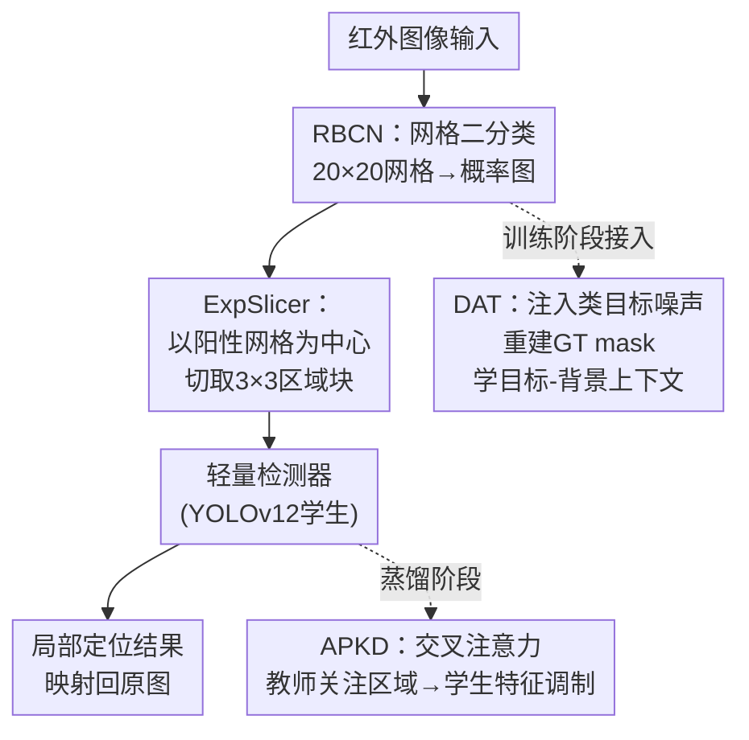

# Denoising-Enhanced Coarse-to-Fine Infrared Small Target Detection with Attention Prior-Guided Knowledge Distillation

**会议**: ECCV2026  
**arXiv**: [2606.21956](https://arxiv.org/abs/2606.21956)  
**代码**: 无  
**领域**: 目标检测  
**关键词**: 红外小目标检测, 粗到细检测, 去噪辅助训练, 知识蒸馏, 区域二分类

## 一句话总结
提出 ECFNet 粗到细红外小目标检测框架：粗阶段用 RBCN 将全图稠密预测降为网格二分类 + 引入去噪辅助训练（DAT）迫使网络学目标-背景上下文，细阶段用轻量检测器 + 交叉注意力先验蒸馏（APKD）让学生关注关键目标区域，在三个红外数据集上以 31.7G FLOPs 达到 SOTA。

## 研究背景与动机

红外小目标检测在无人机监控、遥感等场景中是关键技术，但红外图像中目标像素极少（通常仅几个到几十个像素）、信杂比低，且动态复杂背景（云层、建筑边缘、热杂波等）产生大量类目标干扰，导致传统方法漏检和虚警频发。现有方法大致分两类：单阶段方法（如 UIU-Net、MSHNet）在全图上做稠密预测，但小目标只占全图极小区域，大量算力浪费在无目标的背景区域上，限制了处理高分辨率图像时的实时性；两阶段方法（如 ESOD、QueryDet）先通过分割生成目标 mask 提案再进行稀疏检测，但稠密分割阶段计算量仍很大，且 mask 级别的提案裁剪丢弃了关键的上下文信息——对于红外小目标而言，上下文恰恰是区分目标和背景光晕的关键线索，丢失上下文后虚警率显著上升。

核心矛盾在于：红外小目标既需要上下文来辅助判别（因为目标本身特征极其微弱），又需要避免在全图范围做冗余计算。同时，两阶段框架中的轻量检测器能力有限，常规知识蒸馏方法只在全局特征层面做对齐，没有针对小目标区域施加显式注意力引导，使得蒸馏带来的收益有限。

本文提出的 ECFNet 从两个层面同时回应上述问题。在粗阶段，将全图密集的像素级分类问题降维为网格级的区域二分类（RBCN），只判断每个网格是否包含目标，彻底避免了稠密卷积的开销。同时设计了一个去噪辅助训练策略（DAT）：在训练时向 GT mask 上注入高斯类目标噪声，让 RBCN 的特征空间里混入带噪声的 mask，迫使网络通过去噪任务重建原始干净 mask——因为只有真正理解了目标与周围背景的关系，才能从噪声中正确分离出真实目标。在细阶段，通过 ExpSlicer 从 RBCN 的多尺度特征图上提取保留完整上下文的局部区域块，送入轻量检测器。**核心 idea：将红外小目标检测拆成「粗判区域→精细定位」两阶段，粗阶段用网格二分类代替全图稠密预测来降计算量，用去噪辅助训练强迫网络建模目标-背景上下文来提升区域提案质量，细阶段用交叉注意力知识蒸馏让轻量检测器聚焦关键目标区域。**&#x20;

## 方法详解

### 整体框架

ECFNet 是一个粗到细的两阶段红外小目标检测框架。粗阶段的核心是 RBCN（区域二分类网络），它将输入图像划分为 20×20 的非重叠网格，对每个网格输出一个概率值，判断该网格是否包含目标。在训练时，RBCN 额外接入 DAT 模块：将高斯类目标噪声注入 GT mask 并与 RBCN 的多尺度特征图拼接，让网络通过去噪任务重建原始 GT mask，从而迫使特征学习阶段就融入目标-背景上下文信息。RBCN 输出的二分类概率图经二值化后，由 ExpSlicer 以每个阳性网格为中心、在多尺度特征图上切取 3×3 网格范围的区域块（固定大小，带 padding 处理边界目标），这些区域块保留了完整的上下文信息。细阶段将这些区域块输入一个轻量检测器（基于 YOLOv12-L 的教师模型经 APKD 蒸馏得到的学生模型）进行精确的框级或像素级定位，最后将结果映射回原图。

### 关键设计

**1. RBCN：将全图稠密像素分类降维为网格级区域二分类**

传统的两阶段方法在第一阶段通常做像素级语义分割，产生目标 mask 后再进行稀疏检测。像素级分类需要在每个像素上做预测，计算量巨大，而且分割 mask 本身丢失了上下文——mask 只表示"这是目标/不是目标"，不包含目标周围的背景信息。RBCN 把这个问题重新定义为：把输入图分成 N×N 的非重叠网格（实验设 N=20），为每个网格输出一个二值预测，判断该网格是否包含目标区域。这相当于把 H×W 个像素点的分类问题变成了 N² 个网格的分类问题，计算量直接降低若干个数量级。RBCN 采用 4 级层级骨干，第 2-4 级使用 C2fP 模块（C2f 风格的双 3×3 卷积残差路径 + PConv 残差路径的融合），兼顾方向性感知和空间建模能力。输出概率图经阈值（0.5）二值化后即为区域提案。RBCN 的监督信号是 BCE Loss + IoU Loss 联合优化。

**2. DAT：向特征空间注入类目标噪声，迫使网络通过去噪学习目标-背景上下文**

红外小目标与背景杂波在光谱上高度相似，仅靠目标自身的微弱特征很难区分。DAT 的核心思路是对抗性地给训练过程增加难度：在 RBCN 的多尺度特征图上，在 GT mask 基础上逐元素地叠加一组用二维高斯函数合成的类目标噪声 $N_i^l(x,y)=\exp(-((x-x_i)^2+(y-y_i)^2)/2\sigma^2)$，然后将带噪声的 mask 与 RBCN 特征图沿通道拼接，送入辅助分支重建原始 GT mask。噪声的强度（$\sigma$ 控制了空间扩散范围）和数量都经过设计，目标是模拟真实红外图像中的类目标杂波。由于真实目标和合成噪声在局部特征上高度相似，网络如果只依赖孤立的像素级响应（即看到高亮就认为目标）就一定会误判，必须学会利用周围更大的上下文区域来判断"这个高亮到底是目标还是噪声"——这正是红外小目标检测最需要的能力。DAT 的损失与 RBCN 的主损失并行计算（三尺度各自算 BCE+IoU Loss 求和），只在训练时使用，推理时无额外开销。值得注意的是，单把 GT mask 拼接到特征图上反而导致性能下降（削弱了骨干的学习能力），而加上噪声后才显著提升粗阶段的 CRP 和 CRR。

**3. ExpSlicer：保留完整上下文的动态区域切片器**

RBCN 输出二值网格后，需要从原特征图上提取对应区域交给细阶段检测器。简单做法是只切阳性网格本身，但这可能切割不完整的目标（尤其是目标恰好跨多个网格时），也丢失了目标周围的上下文。ExpSlicer 的策略是：对每个阳性网格，以该网格在多尺度特征图上的对应位置为中心，切取 $k\times k$（实验设 k=3，即 3×3 网格范围）的矩形区域。对边界目标用零填充保证尺寸一致。切出的所有区域块沿 batch 维度堆叠后送入细检测器，同时用全局非极大抑制消除重叠区域产生的冗余预测。ExpSlicer 有两个关键优势：一是 3×3 区域保证目标完全被包含在内（即使目标恰好被 RBCN 的一个阳性网格覆盖，周围的 8 个邻域网格提供完整上下文和过分割容错）；二是 k 是动态可调的，灵活性远高于固定 mask 裁剪。此外，为保证训练时批量大小不因每张图的阳性网格数不同而变化，训练时将 proposal batch size 设为平均阳性数 +1，确保 50% 以上的图像完整参与训练。

**4. APKD：用交叉注意力在特征空间传递教师对小目标区域的关注先验**

细阶段使用轻量检测器（基于 YOLOv12-L 教师做蒸馏），但轻量模型表示能力有限，常规的全局特征蒸馏方法（如直接对齐学生和教师的特征图）对小目标区域的关注不足。APKD 的突破在于：不做 1D token 展平（会破坏空间局部性），而是在多维空间特征上直接做教师-学生的交叉注意力。具体说，学生特征图经 3×3 卷积分组降维后作为 PixelQuery（保留了局部空间细节），教师特征图处理成 AreaKey（保留了全局场景理解），计算两者的交叉注意力权重 A = Softmax(PixelQuery^T · AreaKey)，再用权重调制学生特征，产生一个动态卷积核 W_dyn。这个调制过程让学生特征中对应教师关注的区域被放大、背景区域被抑制。最终调制后的特征经 RepConv 残差门控融合后输出。蒸馏损失是对各尺度的教师-学生特征做余弦相似度加权求和。APKD 的关键洞察是：教师最擅长的地方不是告诉学生"全局对齐"，而是告诉学生"看哪里"——交叉注意力天然实现了这种空间先验的传递，且推理时教师被冻结甚至去掉，不增加任何额外延迟。

### 损失函数 / 训练策略

粗阶段联合损失：$\mathcal{L}_{\text{coarse}} = \mathcal{L}_{\text{BCE}}(M_{\text{pred}}, M_{\text{GT}}) + \lambda_1 \cdot \mathcal{L}_{\text{IoU}}(M_{\text{pred}}, M_{\text{GT}})$，$\lambda_1$ 为可学习权重（初始 1.0）。
DAT 损失：$\mathcal{L}_{\text{DAT}} = \sum_{l=1}^3 (\mathcal{L}_{\text{BCE}}(M_{\text{DAT}}^l, M_{\text{GT}}^l) + \lambda_2 \cdot \mathcal{L}_{\text{IoU}}(M_{\text{DAT}}^l, M_{\text{GT}}^l))$。
蒸馏损失：$\mathcal{L}_{\text{KD}} = \sum_{i=1}^L w_i \cdot \mathcal{D}_{\cos}(F_s^i, F_t^i)$，$w_i = 1/i$。
粗阶段和细阶段各训练 100 个 epoch，Adam 优化器，lr=0.01，weight decay=0.1，batch size=12，数据增强包括随机裁剪、水平翻转和亮度调整。教师模型（YOLOv12-L）先用相同数据和策略预训练，蒸馏时冻结教师只提供监督信号。

## 实验关键数据

### 主实验

| 数据集 | 指标 | 本文 | 之前SOTA | 提升 |
|--------|------|------|----------|------|
| UAV (Object) | AP50 | 95.87 | 95.39 (YOLO11-L) | +0.48 |
| Car (Object) | AP50 | 96.06 | 93.68 (D-FINE-L) | +2.38 |
| IRSTD-1k (Object) | AP50 | 89.23 | 84.32 (EFLNet) | +4.91 |
| UAV (Pixel) | nIoU | 56.11 | 54.23 (PConv) | +1.88 |
| Car (Pixel) | nIoU | 58.21 | 55.98 (PConv) | +2.23 |
| IRSTD-1k (Pixel) | nIoU | 69.67 | 67.93 (PConv) | +1.74 |

本文的 FLOPs = 31.7G，Params = 22.7M，FPS = 90，在三个指标上均明显优于 SOTA 方法。对比 ESOD-L（38.1G, 86 FPS），推理速度更快、精度更高；对比 D-FINE-L（90.7G, 40 FPS），计算量降低约 65%。值得注意，单纯看 FLOPs 并不直接对应 FPS——通用检测器（如 D-FINE）虽然 FLOPs 低但有多尺度融合等模块导致实际延时高，而红外专用检测器在硬件友好性上做了优化。

### 消融实验

| 配置 | AP50 | 说明 |
|------|------|------|
| Baseline | 87.26 | 无 DAT 无 APKD |
| +APKD | 89.30 | +2.10，单独加蒸馏 |
| +DAT | 92.71 | +5.45，单独加去噪训练 |
| +DAT+APKD | 95.87 | +8.61，两者互补达最优 |

| 配置 | CRP | CRR | 说明 |
|------|-----|-----|------|
| 无DAT | 89.38 | 93.45 | 粗阶段基线 |
| +Loss | 92.80 | 94.35 | 仅在特征图算Loss |
| +GT | 92.62 | 94.11 | 直接拼接GT mask |
| +Noise (DAT) | 94.13 | 95.69 | 注入噪声后再重建 |

| 蒸馏方法 | P | R | AP50 |
|----------|---|---|------|
| 无蒸馏 | 93.45 | 90.32 | 92.71 |
| Plain KD | 95.04 | 85.72 | 91.15 |
| CrossKD | 93.82 | 84.14 | 87.70 |
| DCSF | 95.82 | 86.73 | 89.29 |
| APKD (本文) | 95.96 | 91.63 | 95.87 |

### 关键发现

- DAT 是最大的性能贡献者（+5.45 AP50），其核心在于注入的噪声迫使网络学目标-背景上下文，而非简单的特征增强。对比实验说明直接拼 GT mask 效果反而差，因为弱化了骨干的学习压力。
- APKD 在轻量检测器上效果显著，且对教师模型的选择鲁棒——复杂度相差 7 倍的教师（PConv vs YOLOv12-L）都能带来超过 2.15 的 AP50 提升。更强的教师（YOLOv12-L）获益更大。
- RBCN 的 20×20 网格分辨率是最佳平衡点：10×10 分辨率太低导致上下文不足，40×40 分辨率过高使单个网格包含的信息太少，丢失了判别所需的上下文。
- C2fP 模块在粗阶段中取得了最高的 CRR（95.69%），即使 CRP 略低于 SwinTransformer，但 CRR 才是粗阶段的关键——宁可少许虚警（细阶段可以过滤），也不能漏掉目标区域。

## 亮点与洞察

- 去噪辅助训练（DAT）的设计非常巧妙。它不是在图像域加噪再去噪，而是在特征域将类目标噪声拼接到特征图上，用去噪目标来驱动上下文学习。这种"对抗性学习压力"的思路比简单地用更大的模型或更多的数据来提升判别力更优雅，而且训练完成后完全无推理开销。
- RBCN 中的"网格二分类替代像素级分割"是红外小目标检测场景下的极佳适配设计。小目标本来就稀疏，全图密集预测的效率极低；把问题降到网格级后，计算量降低到几乎可忽略，同时还天然保留了每个网格内的上下文信息。
- ApKD 的交叉注意力蒸馏避免了常见的 1D token 展平，保留了空间局部性——这对于红外小目标这种位置极其敏感的任务至关重要。"让教师告诉学生看哪里"比"让学生模仿教师的特征图"更适合小目标场景，因为特征图对齐对小目标区域几乎没有偏置。
- 粗-细两阶段的整体设计值得迁移到其他小目标/大分辨率检测任务（如航拍图像检测、遥感目标检测、显微图像检测等），只要目标在图像中占比极大小于背景。

## 局限与展望

- 粗阶段依赖一个固定的网格分辨率（20×20），对于目标尺度变化极大的场景可能不够灵活。虽然 ExpSlicer 使用了多尺度特征图，但网格分辨率本身是固定的超参数，不同场景可能需要不同的 N 值。
- 方法高度依赖红外数据特有的类目标噪声分布（二维高斯合成噪声）。迁移到可见光或其他波段时，噪声的建模方式需要重新设计，不一定能直接套用。
- DAT 仅在训练阶段引入，因此对训练数据的多样性要求较高。如果训练集中目标-背景关系高度单一（如所有目标都在天空背景下），DAT 学到的上下文判别能力可能缺乏泛化性。
- 细阶段的轻量检测器设计依赖于 YOLOv12 的架构，未来可以探索更通用的检测头适配（如基于 DETR 的轻量变体）以增强方法对不同检测范式的兼容性。

## 相关工作与启发

- **vs ESOD（两阶段小目标检测）**: ESOD 使用深度可分离卷积做稠密预测生成 mask，然后做稀疏检测；本文用网格二分类代替稠密预测，计算量（38.1G → 31.7G）和精度（AP50 78.33 → 89.23 on IRSTD-1k）均全面超越。加入 DAT 后的上下文建模是关键差异。
- **vs DN-DETR（去噪查询）**: DN-DETR 在 Transformer 检测器中引入去噪查询以稳定训练匹配，DAT 则是在两阶段框架粗阶段的特征域中注入类目标噪声，目的是迫使网络学目标-背景判别，本质上解决的问题不同。
- **vs 常规 KD（如 FitNets、CrossKD）**: 常规 KD 对齐全局特征图或检测头输出，对小目标关注不足。APKD 的交叉注意力机制显式传递教师对关键区域的注意力先验，在小目标上的收益远大于传统蒸馏方法。

## 评分

- 新颖性: ⭐⭐⭐⭐☆ DAT+网格二分类的组合在红外小目标检测中很新颖，但粗到细框架本身并非首创
- 实验充分度: ⭐⭐⭐⭐⭐ 三个真实红外数据集、大量消融实验（DAT 各变种、网格分辨率、蒸馏方法对比、不同教师等），论文正文和附录提供了完整的消融逻辑
- 写作质量: ⭐⭐⭐⭐☆ 方法描述清晰、图表完整，但 Introduction 稍长，部分数学符号可以精简
- 价值: ⭐⭐⭐⭐⭐ 提出的 DAT 和 APKD 两个模块都有清晰的动机和可复用的设计思路，方法效率极高（31.7G, 90 FPS），适合嵌入式部署，对红外/小目标检测领域有实际推动意义

<!-- RELATED:START -->

## 相关论文

- [\[CVPR 2026\] Target-Aware Invertible Encoder with Reconstruction Guidance for Infrared Small Target Detection](../../CVPR2026/object_detection/target-aware_invertible_encoder_with_reconstruction_guidance_for_infrared_small_.md)
- [\[CVPR 2025\] Small Target Detection Based on Mask-Enhanced Attention Fusion of Visible and Infrared Remote Sensing Images](../../CVPR2025/object_detection/small_target_detection_based_on_mask-enhanced_attention_fusion_of_visible_and_in.md)
- [\[NeurIPS 2025\] Rethinking Evaluation of Infrared Small Target Detection](../../NeurIPS2025/object_detection/rethinking_evaluation_of_infrared_small_target_detection.md)
- [\[CVPR 2026\] CHAL: Causal-guided Hierarchical Anomaly-aware Learning for Moving Infrared Small Target Detection](../../CVPR2026/object_detection/chal_causal-guided_hierarchical_anomaly-aware_learning_for_moving_infrared_small.md)
- [\[CVPR 2026\] Seeing Through the Noise: Improving Infrared Small Target Detection and Segmentation from Noise Suppression Perspective](../../CVPR2026/object_detection/seeing_through_the_noise_improving_infrared_small_target_detection_and_segmentat.md)

<!-- RELATED:END -->
