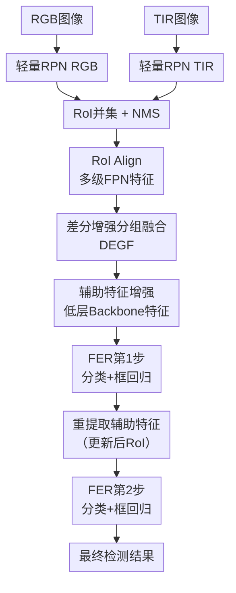

# Efficient RGB-T Object Detection via Sparse Cross-Modality Fusion

**会议**: ECCV2026  
**arXiv**: [2606.30215](https://arxiv.org/abs/2606.30215)  
**代码**: 无  
**领域**: 目标检测  
**关键词**: RGB-T目标检测, 跨模态融合, 稀疏计算, 高效检测, 轻量检测器

## 一句话总结

提出 SFEDet 稀疏融合框架，先用 YOLOv8-Small 级别的轻量单模态检测器高召回率筛选全图候选前景区域，再仅在稀疏的 RoI 上执行跨模态融合驱动的精确检验与多步框精炼，以约 1/3 的计算成本和 1/5 的参数量达到与 SOTA 相当甚至更优的检测精度。

## 研究背景与动机

RGB-T 目标检测通过融合可见光和热红外两种模态的互补信息，在全天候、弱光照等挑战条件下实现鲁棒检测。当前的主流方法普遍采用双路重型骨干网络（如 CSP-Darknet-Large），并在整张图像上逐像素执行跨模态特征融合。这种设计在带来高精度的同时，计算开销也极为可观——典型检测器的 FLOPs 可达 300-1100 GFLOPs，严重限制了在边缘设备和高分辨率场景中的实际部署。然而，该文通过实验发现一个有趣的现象：图像中的绝大部分区域是天空、地面等平滑背景，即使是 YOLOv8-Small 这样极轻量的单模态检测器，也能在 IoU=0.5 的宽松阈值下达到与重型检测器几乎相同的召回率（均接近 100%）。这说明对全图进行密集的跨模态融合计算存在大量浪费——真正需要复杂融合的，只是那些可能包含前景目标的稀疏区域。

但轻量检测器也存在两个明显短板：一是假阳性率显著偏高（大量的背景被误检为前景），二是框定位精度严重不足（IoU=0.75 时召回率急剧下降）。这两个问题恰好可以通过融合 RGB-T 双模态的丰富特征来弥补——跨模态特征能够提供更强的判别力以区分真实目标与背景噪声，同时多模态的位置信息可帮助修正粗略框。

基于以上观察，本文的核心思路是把检测拆成两个阶段：第一阶段用轻量模型快速扫全图、高召回地找出潜在候选区域；第二阶段只在余下的稀疏候选区域上做细致的跨模态融合分析和精炼。**核心 idea：提出稀疏融合机制 SFEDet，先用轻量的双单模态 RPN 筛选出候选 RoI，再仅对这些稀疏 RoI 执行差分增强分组融合（DEGF）驱动的多步分类与框精炼，将重计算集中在最有信息量的前景区域，从而实现精度与效率的帕累托最优。**

## 方法详解

### 整体框架

SFEDet 是一个两阶段检测框架。第一阶段使用两个独立的 YOLOv8-Small 检测器分别处理 RGB 和 TIR 图像，各自输出初步的检测提案。取两个模态检测结果的并集作为候选集，再经 NMS 去除冗余，得到稀疏的非重叠 RoI 集合。随后通过 RoI Align 从多级 FPN 特征中为每个 RoI 提取对应的 RGB 和 TIR 特征对。第二阶段的核心是融合驱动的检验与精炼模块（FER），它只处理第一阶段产出的稀疏 RoI 特征，通过多步特征增强（分组融合 + 差分增强 + 低层辅助特征注入）、分类与框回归，逐步剔除假阳性并提高定位精度。

FER 模块的计算量仅取决于 RoI 数量而非输入图像尺寸，因此 SFEDet 在处理高分辨率图像时表现出优秀的次线性计算增长特性——LLVIP 数据集上图像面积增加 4 倍时，FLOPs 仅增加约 2.4 倍，而密集融合方法增长 3.8 倍以上。

### 关键设计

**1. 稀疏融合机制：轻量单模态 RPN 筛选前景，融合模块仅处理稀疏 RoI**

最核心的设计理念源于一个简单的观察：既然图像中大部分区域是平滑背景、轻量检测器已能以极高召回率覆盖这些简单区域，那就不需要对全图做复杂的跨模态融合。具体实现中，SFEDet 第一阶段使用两个独立 YOLOv8-Small 单模态检测器作为区域提案网络（RPN），分别从 RGB 和 TIR 图像中生成初步检测框。由于两模态信息互补——例如交通灯在 RGB 中更突出、行人轮廓在 TIR 中更清晰——取并集能最大化召回率。在并集上施加 NMS 控制提案稀疏性后，第二阶段仅对剩余的稀疏 RoI 提取特征并执行融合推理。这一设计的直接优势是计算复杂度从与图像面积线性相关转变为与 RoI 数量线性相关：实际测试中，M3FD 高分辨率图像上每帧仅约需处理 10-30 个 RoI，相比全图密集融合节省 60% 以上计算量。

**2. 差分增强分组融合（DEGF）：轻量高效的自适应跨模态融合策略**

FER 模块内部采用分组加权融合加差分增强的机制来平衡融合效果与计算开销。首先，对 RGB 和 TIR 的 RoI 特征沿通道维度分为若干组（默认 4 组），每组独立预测融合权重并以 softmax 归一化，组内共享权重以控制计算量。分组融合的好处是每组的融合权重可以适配该通道子集的特征分布，比分通道独立预测更高效、比全局单权重更细致。融合后的特征再与原始单模态特征计算差分，由差分信号 $\mathbf{F}_{fu}^1 - \mathbf{F}_{fpn}^M$ 学习自适应的残差增强表示——每个模态的原始特征乘以由差分信号预测的注意力权重，再与融合结果相加并经 LayerNorm 得到最终增强特征。相比拼接后卷积，差分操作为轻量级计算；相比逐元素相加，差分带来的非线性适应性能更优。消融实验表明，该设计在几乎不增加 FLOPs 的前提下带来约 1.2 个点的 AP50 提升。

**3. 滚动卷积（Rolling Convolution）：通道滚动实现高效组间信息交互**

FER 模块的全部卷积层都替换为一种称为滚动卷积的轻量化算子。标准分组卷积（Group Convolution）将输入通道分成独立组，组间无信息交互，级联后性能会受损。滚动卷积的改进是并行地运行两条分组卷积分支：一条是标准分组卷积；另一条先将输入通道沿通道维度滚动（roll）半个组大小，再执行分组卷积。滚动操作相当于把不同组边界处的通道交错排布，使得原本属于不同组的特征在卷积核感受野内相遇。两条分支的输出经 $1 \times 1$ 逐点卷积融合。相比标准卷积，滚动卷积参数量更少但网络深度和非线性表达能力更强；在消融实验中，它比深度可分离卷积和 ShuffleNet 块均取得更优的 mAP，同时计算量仅略高于后两者。相比标准 Conv2d，滚动卷积在几乎相同的 mAP（61.0 vs 61.1）下减少 27% FLOPs。

**4. 分步框精炼与去噪训练：应对轻量 RPN 的低定位质量**

轻量 RPN 产出的框定位往往不准确，为此 FER 模块采用两步渐进精炼策略。先根据初始 RoI 特征做第一轮分类和框回归，然后用更新后的框重新从 backbone 低层特征图提取辅助特征，再做第二轮分类和框回归。由于 RoI 特征丢失了多尺度特征图固有的步长尺度信息，框解码时需要借助提案框本身的尺度进行归一化——将预测的距离残差 $d_i$ 按提案框宽高缩放到原始图像空间：$D_i = \frac{x_2 - x_1}{L} \cdot d_i$（左右边）或 $D_i = \frac{y_2 - y_1}{L} \cdot d_i$（上下边），其中 $L=16$ 为预测头的理论最大距离。

训练方面，去噪训练策略在每次迭代中额外注入 $N_{de}=10$ 组真值框的噪声变体到 RPN 产出的提案列表中，噪声由均匀分布 $\delta \sim U(-0.4W, +0.4W)$ 生成。这些带噪声的正负样本迫使 FER 模块学习处理大定位误差的困难样本，最终即使 RPN 输出的框 IoU 上限降至 0.5，FER（不经重训练）仍能维持稳定的检测性能。无去噪训练时 AP50 下降 1.8 个点。

### 损失函数 / 训练策略

训练分为两个阶段：先分别独立预训练两个单模态 RPN（标准 YOLOv8 配置），再端到端联合训练整个 SFEDet。联合训练时 RPN 的学习率乘以 $\lambda=0.005$ 衰减因子以稳定微调。总损失为两个 RPN 损失加上 FER 两步输出的损失之和，每项损失沿用 YOLOv8 配置：分类用二值交叉熵（BCE），框回归用 CIoU 损失 + DFL 损失，各项权重 $\alpha=0.5, \beta=7.5, \gamma=0.375$。训练还采用了 ExpMomentum EMA、学习率线性热身以及对单模态随机添加高斯/对比度/模糊噪声等数据增强。

## 实验关键数据

### 主实验结果

以下对比 SFEDet 与不同融合策略的密集检测器在 M3FD 上的表现。SFEDet 以 24.5M 参数量和 112.6G FLOPs 达到 mAP 61.0 / AP50 89.8，相比 FPN 级密集融合基线（180.4G FLOPs, AP50 88.4）节省 37.6% 计算量同时 AP50 提升。

| 融合策略 | Backbone | 参数量 | mAP | AP50 | FLOPs |
|---------|----------|--------|-----|------|-------|
| 图像级融合 | 1×CSP-L | 51.2M | 62.5 | 89.8 | 268.0G |
| Backbone级融合 | 2×CSP-S | 18.8M | 55.6 | 85.5 | 88.0G |
| FPN级融合 (+DEGF) | 2×CSP-S | 18.8M | 59.6 | 88.4 | 180.4G |
| **SFEDet（本文）** | **2×CSP-S** | **24.5M** | **61.0** | **89.8** | **112.6G** |

在 FLIR 数据集（640×512）上，SFEDet 以 69.0G FLOPs 达到 mAP 43.0 / AP50 81.7；在 LLVIP 高分辨率数据集（1280×1024）上，以 163G FLOPs 达到 mAP 65.9 / AP50 96.8。图像面积增加 4 倍时 FLOPs 仅增 2.4 倍，体现了稀疏融合在高分辨率下的独特优势。

### 消融实验

| 配置 | mAP | AP50 | FLOPs | 说明 |
|------|-----|------|-------|------|
| 基线（逐元素Add融合） | 57.2 | 85.4 | 104.0G | 无分组融合/差分增强/辅助特征/精炼 |
| +分组加权融合 | 58.4 | 87.1 | 96.4G | 分组自适应权重提升 AP50+1.7 |
| +差分增强 | 58.6 | 87.2 | 96.4G | 差分自适应加权，不增加FLOPs |
| +辅助特征（Backbone低层） | 59.9 | 88.5 | 104.6G | 低层特征比FPN高层特征更有效 |
| 完整 SFEDet | 61.0 | 89.8 | 112.6G | 含两步精炼+滚动卷积+去噪训练 |
| -去噪训练 | 59.9 | 88.0 | 111.6G | AP50下降1.8，训练样本多样性不足 |
| -滚动卷积（→标准Conv2d） | 61.1 | 88.9 | 144.4G | FLOPs增加27%，精度几乎不变 |

### 关键发现

- **假阳性抑制效果拔群**：FER 模块将单张 M3FD 图像上的平均假阳性数从 26.5 降到 2.1，降幅超过 92%。
- **定位鲁棒性出色**：即使提案框 IoU 上限降至 0.5 的极端情况（不复训），SFEDet 的 AP50 仍能保持 75.3（M3FD），高于许多密集融合方法的正常水平。
- **子线性计算增长带来实用价值**：在高分辨率图像上，密集融合方法的计算量成倍增加，而 SFEDet 的增长幅度显著更小，对实际部署有直接意义。
- **空间偏移的鲁棒性**：RGB-T 图像间的空间错位影响密集融合和 SFEDet，但通过训练时的随机平移数据增强即可有效缓解。

## 亮点与洞察

- **"以轻代重"的稀疏融合思路**：核心洞察非常朴素——既然图像大部分是背景、轻量模型已能高召回地找到前景，那就不必对全图做重融合。这一思路在效率型多模态检测中具有通用迁移价值，可适用至 RGB-D、RGB-NIR 等其他多模态检测任务。
- **设计完整性高**：从观察验证（YOLOv8-Small 与 Large 的召回率曲线对比实验）到机制设计（RPN+FER 两阶段），再到架构级的轻量化算子（Rolling Convolution）和数据级的鲁棒性提升（去噪训练），每个环节都有实验支撑，无悬空模块。
- **滚动卷积的设计简洁有效**：在分组卷积基础上仅增加一步通道滚动就实现了组间交互，轻量且容易复现。这个设计可替换任何分组卷积场景，具有跨任务的可迁移性。
- **假阳性抑制的分析令人信服**：附录中专门统计了每张图像的假阳性数量，从 26.5 降到 2.1 的量化结果直观地展示了 FER 模块的价值，不只是靠消融实验间接推测。

## 局限与展望

- 当场景中密集分布大量小目标时（如拥挤行人），RoI 数量大幅增加，稀疏融合的节省效果会减弱，FER 模块计算量可能接近全图密集融合。作者未深入分析这种极端场景下的表现。
- 两阶段训练流程相对复杂：需要先独立训练两个 RPN，再联合微调整个网络。对训练资源和调参经验有一定要求。
- 当前 RPN 使用 YOLOv8-Small，未来可以探索更激进的轻量化骨干（如 MobileNet）或结合蒸馏技术进一步压缩 RPN 成本。
- 滚动卷积的分组数、RoI 大小等超参数需要根据场景调优，当前提供了默认配置但缺少理论指导的自动选择机制。

## 相关工作与启发

- **vs 密集融合 RGB-T 检测器（ICAFusion, Fu-Mamba, EI2Det）**：现有方法均使用双路重型骨干并在全图执行密集跨模态融合，性能虽优但 FLOPs 极高（370-1133G）。SFEDet 首次将稀疏融合引入 RGB-T 检测，在约 1/3 的计算量下取得竞争性甚至更优的精度。
- **vs 单模态高效检测器（YOLO v8/v10, RT-DETR）**：这些方法虽然已非常高效，但设计时未考虑多模态融合特有的计算开销。SFEDet 明确指出真正的效率瓶颈在于双路特征提取与融合，而非单模态检测器本身。
- **vs Deevi（冻结双骨干）**：Deevi 通过冻结骨干来节省训练成本，但推理时仍需执行全图密集融合，计算量未减少。SFEDet 从推理架构层面改变了计算分布，是更深层的效率优化。

## 评分

- 新颖性: ⭐⭐⭐⭐ 稀疏融合应用于 RGB-T 检测的思路新颖，且基于扎实的实验观察（轻量模型与重型模型召回率对比），而非凭直觉提出。
- 实验充分度: ⭐⭐⭐⭐⭐ 在 M3FD/FLIR/LLVIP 三个主流数据集上充分对比，消融实验完整覆盖每个设计点，额外做了卷积算子对比、超参数分析、空间偏移鲁棒性等实验，很有说服力。
- 写作质量: ⭐⭐⭐⭐⭐ 动机清晰（从数据观察出发）、方法自洽、图表丰富。每个实验结论都有数据支撑，附录中的假阳性统计和训练损失曲线分析尤为细致。
- 价值: ⭐⭐⭐⭐ 为 RGB-T 检测的效率方向打开了新路径，稀疏融合的思想可推广到其他多模态检测任务中，实用价值高。

<!-- RELATED:START -->

## 相关论文

- [\[ICLR 2026\] SPWOOD: Sparse Partial Weakly-Supervised Oriented Object Detection](../../ICLR2026/object_detection/spwood_sparse_partial_weakly-supervised_oriented_object_detection.md)
- [\[CVPR 2026\] Tri-Modal Fusion Transformers for UAV-based Object Detection](../../CVPR2026/object_detection/tri-modal_fusion_transformers_for_uav-based_object_detection.md)
- [\[CVPR 2026\] Distribution-Aligned Multimodal Fusion for Robust Object Detection](../../CVPR2026/object_detection/distribution-aligned_multimodal_fusion_for_robust_object_detection.md)
- [\[ICLR 2026\] Long-Context Generalization with Sparse Attention](../../ICLR2026/object_detection/long-context_generalization_with_sparse_attention.md)
- [\[ICCV 2025\] Visual Modality Prompt for Adapting Vision-Language Object Detectors](../../ICCV2025/object_detection/visual_modality_prompt_for_adapting_vision-language_object_detectors.md)

<!-- RELATED:END -->
