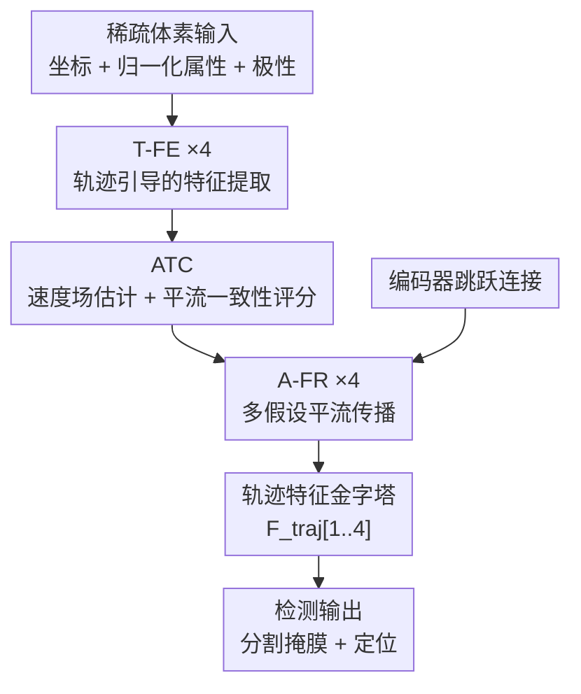

# Following the Flow: Advection-Consistent Modeling for Event-based Small Object Detection

**会议**: ECCV2026  
**arXiv**: [2606.22378](https://arxiv.org/abs/2606.22378)  
**代码**: [https://github.com/fulongcai/PACT](https://github.com/fulongcai/PACT)  
**领域**: 目标检测 / 事件相机  
**关键词**: 事件相机, 小目标检测, 平流一致性, 运动连续性, 物理引导

## 一句话总结
PACT 将事件流特征演化显式建模为平流方程约束下的物理传输过程，通过轨迹级一致性让微弱目标响应沿速度场累积、噪声自然衰减，在 EV-UAV 数据集上将 IoU 从 55.18% 提升至 75.90%。

## 研究背景与动机

事件相机以微秒级分辨率异步捕捉亮度变化，在高速动态场景中具有传统帧相机难以企及的优势。然而事件流本质上是稀疏、不规则且对噪声高度敏感的。当检测小目标时问题尤为严峻——小目标空间支撑小，触发的事件响应零散而断续，在复杂背景和强噪声下极易被淹没。现有方法大体分两派：帧基管线把事件先聚合成静态表示再检测，但聚合过程丢掉了连续时序演化，移除了区分弱信号和噪声的关键线索；脉冲神经网络（SNN）通过神经元动力学隐式积分时序信息，但弱且间歇的响应往往无法激发稳定的脉冲活动，同样难以从噪声中分离。

一个关键但常被忽视的事实是：尽管小目标的事件响应稀疏不连续，其底层的物理运动却是连续的。在足够短的时间窗口内，同一运动目标触发的事件响应可以用一个局部速度场近似描述其空间平移，而背景噪声不具备这种方向一致性。因此，**运动连续性成为在强噪声下区分有意义信号和随机触发的最后（也是最根本）的线索**。然而现有方法均以隐式方式建模时序连续性，缺乏显式的传播规则来串联碎片化的弱响应。

本文的切入角度是：用物理学中的平流方程（advection equation）显式刻画事件特征的时空演化。**核心idea：将事件流的特征表示视为被局部速度场搬运的连续场，平流一致性约束让服从运动连续性的弱响应沿速度场累积成连贯轨迹、不满足平流约束的噪声在传输中自然失对准而衰减，从而在强背景活动中恢复小目标的时空连续性。**

## 方法详解

### 整体框架

PACT 采用 encoder-decoder 架构，在稀疏体素特征张量上运作。输入为稀疏体素（含坐标索引 + 归一化属性与极性），编码器堆叠 4 个 T-FE（Trajectory-Guided Feature Extraction）模块逐级提取运动感知特征，形成金字塔 `{F_enc^i}`。每级由 ATC（Advection-based Trajectory Consistency）模块估计局部速度场并输出平流一致性门控权重，确保只有服从运动连续性的特征被强化传递。解码器使用 4 个 A-FR（Advection-consistent Feature Reconstruction）模块，沿速度场做多假设传播并融合编码器跳跃特征，将碎片化响应连接成连续轨迹特征金字塔 `{F_traj^i}`，最终输出分割掩膜和定位结果。

### 关键设计

**1. 平流一致性表征：以传输残差量化运动连续性**

将稀疏体素特征视为时空连续场 $u(\mathbf{x},t)$，其短时演化由平流方程近似描述：$\partial u / \partial t + \mathbf{v} \cdot \nabla u \approx 0$，其中 $\mathbf{v}$ 是局部速度场。沿特征曲线 $\mathbf{x}(t)$ 满足 $d\mathbf{x}/dt = \mathbf{v}$ 时特征近似守恒：$d u(\mathbf{x}(t),t)/dt \approx 0$。由此定义传输算子 $\mathcal{T}_{\mathbf{v}}(u)(\mathbf{x},t) = u(\mathbf{x} - \tau\mathbf{v}, t - \tau)$ 和平流残差 $\mathcal{R}_{adv} = \|u - \mathcal{T}_{\mathbf{v}}(u)\|$。残差小的特征被认为来自同一运动目标，后续传播获得高置信度；残差大的特征则判定为噪声并逐步抑制。这一形式化将模糊的「是否服从运动连续性」转化为可计算的数值判据，是整篇方法最底层的物理基础。

**2. T-FE + ATC：轨迹约束下的特征编码与速度门控**

编码器每级先通过多分支稀疏卷积（膨胀率 1,2,3,4）聚合时空上下文得 $\mathrm{F}_{multi}$。ATC 为其每个活跃体素预测二维位移 $\Delta\mathbf{p}_i = v_{max}\tanh(\mathrm{MLP}(\mathrm{F}_i))$，经高斯核插值得到传输后特征 $\mathrm{F}_{adv}$。然后计算轨迹一致性门控权重：
$$g = \exp\left(-\frac{\|\mathrm{F}_{adv}-\mathrm{F}\|_1}{\|\mathrm{F}\|_1+\varepsilon}\right) \odot \frac{1}{1+\alpha(|v_x|+|v_y|)}$$
$g$ 对「传输后与原始特征一致」「速度不太大」的成分赋予高权重，最终融合 $\mathrm{T}_{adv} = g\cdot\mathrm{F}_{adv} + (1-g)\cdot\mathrm{F}$。这个门控机制确保只有服从运动一致性的特征在编码阶段就被保留和强化，而孤立噪声（传输后与自身差异大）被自动降权，从源头阻断噪声在后续层级中被放大。

**3. A-FR：多假设平流引导的轨迹传播**

解码器不直接上采样，而是沿速度场做平流传播串联碎片响应。由于稀疏区域速度估计有不确定性，对每个体素从 $\mathbf{v}_i$ 生成 $K$ 个扰动假设 $\mathbf{v}_i^k = \mathbf{v}_i + \delta_k$，对每个假设计算传输候选 $\mathrm{A}_k$ 和置信度 $\mathrm{G}_k$。引入幅度惩罚 $\mathrm{S}_k$（通道平均能量）防止异常高激活值主导传播，用 Softmax 聚合：$\bar{\mathrm{A}} = \sum_k \pi_k \mathrm{A}_k$，$\pi_k = \mathrm{Softmax}(\eta\mathrm{G}_k - \mathrm{S}_k)$。聚合特征与原始特征拼接经通道注意力对齐，再融合编码器跳跃特征，经多膨胀稀疏卷积精炼得轨迹特征 $\mathrm{F}_{traj}$。多假设设计使传播对速度估计误差鲁棒——速度稍偏的假设贡献降低但不完全丢失轨迹，而完全错误的假设通过低置信度被自动排除。

### 损失函数

联合训练目标 $\mathcal{L} = (1-\lambda)\mathcal{L}_{seg} + \lambda\mathcal{L}_{vel}$，$\lambda=0.3$。$\mathcal{L}_{seg}$ 是体素级二值交叉熵（分割掩膜）。$\mathcal{L}_{vel}$ 是对预测速度的 Smooth-L1 正则化：因无稠密光流标注，通过前后帧前景体素的最近邻匹配构造伪标签 $\mathbf{v}^*_i = (\mathbf{p}_j - \mathbf{p}_i)/(t' - t)$。速度正则化稳定传输场学习，主监督仍由检测损失驱动。

## 实验关键数据

### 主实验

在 EV-UAV 数据集上评测（平均目标仅 6.8×5.4 像素，极小小目标 + 复杂光照）。PACT 以 75.90% IoU 和 91.84% P_d 大幅超越此前最优方法，虚警率降低一个数量级。

| 方法 | 类型 | IoU(%) | ACC(%) | P_d(%) | F_a(×10⁻⁴) | 参数量 |
|------|------|--------|--------|--------|-------------|--------|
| EV-SpSegNet (ICCV'25) | 点云分割 | 55.18 | 65.02 | 77.53 | 1.63 | 4.0M |
| COSeg (CVPR'24) | 点云分割 | 51.89 | 60.93 | 71.32 | 9.21 | 23.4M |
| KPConv (ICCV'19) | 点云分割 | 48.19 | 57.28 | 68.59 | 16.32 | 50.1M |
| Spike-YOLO (ECCV'24) | SNN检测 | 43.94 | 48.26 | 59.62 | 55.38 | 69.0M |
| RVT (CVPR'23) | 体素检测 | 43.21 | 51.38 | 60.35 | 55.68 | 9.9M |
| PACT (本文) | 平流传播 | **75.90** | **80.05** | **91.84** | **0.76** | 2.9M |

### 消融实验

| 配置 | IoU(%) | ACC(%) | P_d(%) | 说明 |
|------|--------|--------|--------|------|
| Baseline（无传输约束） | 59.90 | 63.18 | 78.80 | 弱响应无传播机制，容易断 |
| + 仅 ATC | 55.11 | 69.95 | 83.35 | 未结构化特征上强加平流约束，诱导虚假对应 |
| + 仅 T-FE | 66.54 | 69.67 | 84.48 | 抑制噪声，但未串联轨迹 |
| + 仅 A-FR | 63.26 | 65.34 | 79.97 | 保守传播，增益有限 |
| + T-FE + ATC | 71.95 | 73.48 | 85.61 | 提取+约束闭环 |
| + T-FE + A-FR | 70.55 | 76.04 | 88.76 | 无约束的传播不够精确 |
| Full（三者全开） | **75.90** | **80.05** | **91.84** | 闭环完整 |

### 关键发现

- **闭环缺一不可**：T-FE 产生运动一致特征，ATC 施加传输可行性约束，A-FR 沿流延伸形成稳定轨迹——三者耦合构成完整的"提取→约束→传播"物理闭环
- **仅加 ATC 使虚警暴增**（从 0.76 升至 4.76×10⁻⁴），因为无结构化特征上强制平流一致会诱导虚假时序对应，反而加深噪声的伪轨迹
- **多目标大速度差异场景是软肋**：单个一阶速度场无法同时对齐同一窗口内位移差异悬殊的多个目标，此时提升幅度收窄
- **平流残差演化分析很有说服力**：训练过程中前景的平流残差逐渐集中于零附近，背景残差保持宽分布，直观验证了模型确实在学习利用传输有效性维持弱响应

## 亮点与洞察

- 最巧妙的设计是将物理学中的平流方程引入事件特征传播，把"运动连续性"这一模糊原则转化为可计算的传输残差 $\mathcal{R}_{adv}$ 和门控权重 $g$——物理假设只要求局部速度场下的传输一致性，比全局对比度最大化更弱、更通用
- 多假设传播机制（K=5 速度扰动 + Softmax 聚合）优雅地处理了稀疏区域速度估计的不确定性，避免单一路径传播错误
- 速度伪标签通过前后帧最近邻匹配自动构造，无需人工标注稠密光流，实用性强
- 参数量仅 2.9M（比 EV-SpSegNet 的 4.0M 还小），推理 58ms/窗口，兼具精度和效率

## 局限与展望

- 当前采用局部恒定速度近似，对加速度或大幅度方向变化场景精度下降；扩展到二阶或分段线性运动模型是自然延伸
- 速度伪标签依赖最近邻匹配，目标密集或遮挡严重时匹配可能不准确
- 作者承认其方法在"同一窗口内多目标速度差异过大"时的增益缩小，未来的时变运动模型有望缓解此问题

## 相关工作与启发

- **vs 帧基方法（SSD/Faster R-CNN/DETR/YOLOv10）**：50ms 事件聚合窗口丢失时序结构，面对小目标弱响应性能远不如时序建模方法
- **vs SNN 方法（Spike-YOLO/EMS-YOLO）**：隐式时序积分，弱响应难以激发稳定脉冲，且脉冲机制本身引入额外计算约束
- **vs 点云分割方法（KPConv/RandLA-Net/COSeg/EV-SpSegNet）**：保持稀疏几何但缺乏显式传播规则，轨迹断点多，PACT 将检测连续性从约 0.3（归一化平均追踪长度）提升至约 0.7

## 评分

- 新颖性: ⭐⭐⭐⭐☆ 将平流方程引入事件特征传播的物理-视觉交叉视角有新意，多假设传播的门控聚合设计优雅
- 实验充分度: ⭐⭐⭐⭐⭐ 主实验 + 逐模块消融 + 平流残差演化分析 + 连续性量化分析 + 失败案例分析，维度全面且有深度
- 写作质量: ⭐⭐⭐⭐☆ 动机清晰（运动连续性 vs 隐式建模），物理形式化自然，但方法部分公式偏多增加阅读负担
- 价值: ⭐⭐⭐⭐⭐ 事件相机小目标检测有广泛应用前景（无人机/自动驾驶/工业检测），PACT 在极小目标上取得极大提升

<!-- RELATED:START -->

## 相关论文

- [\[CVPR 2026\] Towards Persistence: Learning Topological Constraints for Event-based Small Object Detection](../../CVPR2026/object_detection/towards_persistence_learning_topological_constraints_for_event-based_small_objec.md)
- [\[ECCV 2026\] Adaptive Spectrum-Aware Feature Disentangled Network for Small Object Detection](adaptive_spectrum-aware_feature_disentangled_network_for_small_object_detection.md)
- [\[CVPR 2026\] Spike-driven Discrete Aggregation for Event-based Object Detection](../../CVPR2026/object_detection/spike-driven_discrete_aggregation_for_event-based_object_detection.md)
- [\[ECCV 2026\] MATCH: Flow Matching for Multi-View Anomaly Detection](match_flow_matching_for_multi-view_anomaly_detection.md)
- [\[CVPR 2026\] BDNet: Bio-Inspired Dual-Backbone Small Object Detection Network](../../CVPR2026/object_detection/bdnetbio-inspired_dual-backbone_small_object_detection_network.md)

<!-- RELATED:END -->
