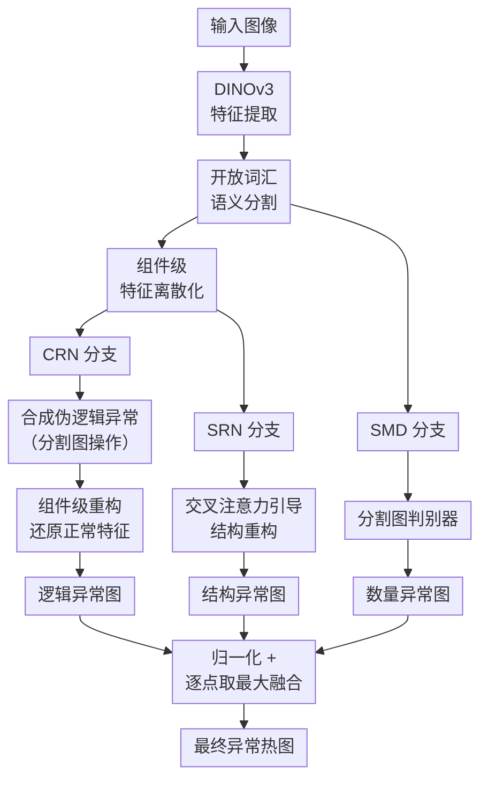

# LogiCo: A Unified Framework for Logical and Structural Anomaly Detection

**会议**: ECCV 2026  
**arXiv**: [2606.28688](https://arxiv.org/abs/2606.28688)  
**代码**: [https://github.com/cnulab/LogiCo](https://github.com/cnulab/LogiCo) (有)  
**领域**: 目标检测  
**关键词**: 逻辑异常检测, 结构异常检测, 组件级重构, 异常合成, 工业视觉

## 一句话总结
LogiCo 提出统一的组件级特征重构范式，通过离散化预训练特征到组件级空间并合成伪逻辑异常来训练重构网络，同时引入交叉注意力结构重构和分割图判别器，在保持空间结构的前提下同时检测逻辑异常和结构异常，在 MVTec-LOCO 等四个基准上达到 SOTA。

## 研究背景与动机

工业图像异常检测是视觉质量管控的核心任务，通常被建模为无监督学习问题——只用正常样本训练，然后在推理阶段检测出不符合正常分布的缺陷。异常大致分为两类：结构异常（structural anomaly）表现为局部视觉模式的异常，如划痕、破损、污渍，这类异常局部特征鲜明，现有的基于 patch 级特征建模的方法（如 PatchCore、Dinomaly）已经处理得相当好。逻辑异常（logical anomaly）则是违反装配逻辑或生产流程的无效配置，例如缺少某个组件、组件位置错误、数量不对——这些异常需要感知组件之间的长程关系，单靠局部 patch 特征根本抓不住。这两类异常在实际产线上往往同时存在，但当前的检测方法却难以兼得。

逻辑异常检测的最新进展（如 CSAD、SALAD、PSAD）通常采用"全局-局部"双分支架构：局部分支负责结构异常，另加一个全局分支丢弃空间结构来建模全局语义一致性，从而识别逻辑异常。这种设计看似合理，却有一个根本矛盾——全局分支丢弃了空间细节，因此检测粒度很粗，无法定位到像素级别，在面对细微的结构异常时明显不如专门的结构检测方法。结果就是：逻辑异常检测器在结构异常上的表现一直显著落后于专用结构检测器，而结构检测器又完全抓不住逻辑异常。业界亟需一个真正统一的框架，能同时精确检测两类异常而不牺牲任何一方的精度。

本文的核心观察是：逻辑异常的本质是组件间关系的违反，而结构异常的本质是组件内纹理的异常——两者在"组件"这个粒度上天然可以统一。**核心 idea：将预训练图像特征离散化为组件级特征空间，通过操作分割图合成各类伪逻辑异常来训练组件级重构网络（CRN）还原正常特征，同时用交叉注意力机制让结构重构网络（SRN）以 CRN 的无异常特征空间为锚点进行精细重构，再辅以分割图判别器（SMD）专门处理数量异常，三个分支的输出经归一化后取逐点最大融合，统一检测两类异常。**

## 方法详解

### 整体框架

LogiCo 的输入是一张工业产品图像，输出是逐像素的异常热图。整体分三条并行的检测通路，最终融合为统一异常得分。首先用 DINOv3 提取预训练特征，并通过开放词汇语义分割获得组件分割图。基于分割图将连续特征离散化为组件级原型特征（每个空间位置取对应组件的平均特征向量），这一离散化特征作为后续逻辑异常检测的基础。在训练时，通过操纵分割图（删除、替换、新增、擦除组件），合成多样化的伪逻辑异常特征，送入组件级重构网络（CRN）学习将其还原为正常预训练特征，从而捕获组件间的逻辑约束。同时，结构重构网络（SRN）在 CRN 的交叉注意力引导下对原始预训练特征进行精细重构，专门检测结构异常。此外，分割图判别器（SMD）直接在组件分割图上检测数量异常。推理时三条通路各自产出异常图，经验证集统计量归一化后取逐元素最大值作为最终异常得分。

### 关键设计

**1. 组件级重构网络（CRN）：将逻辑约束转化为重构任务**

逻辑异常的核心挑战在于约束类型多样——缺少组件、位置错误、数量异常各有各的违反方式，很难用单一规则覆盖。CRN 的关键洞察是把"学会各种逻辑约束"等价转化为"学会将异常特征还原为正常特征"这一统一的重构任务。具体来说，先用 DINOv3 提取预训练特征 $\mathrm{X} \in \mathbb{R}^{h \times w \times c}$，再通过开放词汇语义分割得到组件分割图 $G$（每个空间位置被分配到最相似的文本提示类别）。对每个组件 $k$，取其所有位置的特征平均得到组件原型 $\mathbf{f}_k$，然后将每个空间位置的特征替换为其所属组件的原型：$\mathrm{X}_{\mathtt{c}}(i,j) = \mathbf{f}_{G(i,j)}$。这一操作有两个精妙之处：一是过滤掉了与组件身份无关的纹理细节，让特征仅保留"这是什么组件"的信息，从而凸显组件间逻辑不一致；二是离散化的特征空间让异常合成变得极其简单——只需操纵分割图就能在查找表中生成各种逻辑异常。训练时，通过删除（将某组件替换为背景）、替换（将组件 A 替换为 B）、新增（用 CutPaste 将某组件复制到额外位置）、擦除（腐蚀或部分删除组件区域）四种策略合成异常分割图，据此构建异常组件级特征 $\mathrm{X}'_{\mathtt{c}}$，训练 CRN $\psi_{\mathtt{c}}$ 将其还原为原始预训练特征。重构目标设定为还原到原始连续特征而非正常离散化特征——这是防止网络退化到恒等映射的关键设计，连续目标提供了更丰富的学习信号，同时对分割噪声也有更强的鲁棒性。

**2. 交叉注意力结构重构（SRN）：以无异常空间为锚点避免捷径**

单纯的特征重构在异常检测中有一个经典陷阱：如果网络重构能力太强，会把异常特征也完好地保留下来（identical shortcut），导致漏检。SRN 的设计思路是让 CRN 充当"无异常的参照系"——因为 CRN 工作在离散化的组件级特征空间，天然丢弃了组件内部的纹理细节，所以它的特征空间中不包含结构异常信息，却保留了图像的整体空间布局。SRN 从 CRN 的对应层提取特征作为交叉注意力的 Key 和 Value，用自己的特征作为 Query，迫使 SRN 将自身的异常特征映射到 CRN 提供的正常参照空间中。同时，标准交叉注意力模块中的残差连接被移除，防止异常信息通过跳跃连接泄漏。这一设计巧妙地连接了逻辑检测和结构检测两个分支——CRN 的"干净"特征空间为 SRN 提供了高质量的重构锚点，两者相辅相成。

**3. 分割图判别器（SMD）：在直观空间捕获数量异常**

数量异常（如本该有 4 颗螺丝却只有 3 颗）是逻辑异常中最难在特征空间中建模的类型之一——特征空间中的"数量"信息高度耦合、难以直接分离。SMD 的洞察是：组件分割图本身已经直观地表达了各组件的位置和数量，检测数量异常在分割图上远比在特征空间中容易。因此，SMD 采用轻量全卷积 U-Net，以分割图 $G$ 为输入，直接预测逐像素异常掩码 $\mathcal{S}_\mathtt{D} \in [0,1]^{h \times w}$。训练时同样利用前文的异常合成方法生成分割图-掩码对 $(G', \mathcal{M})$，以 Binary Focal Loss 优化。SMD 虽然缺少组件内部纹理信息，在定位精度上不如 CRN/SRN，但对数量异常的检测能力极强——消融实验显示在"Breakfast Box"类别的数量异常上 I-AUC 从 90.08% 提升到 99.46%。

### 损失函数 / 训练策略

整体损失为三个分支损失之和：$\mathcal{L} = \mathcal{L}_{\mathtt{Log}} + \mathcal{L}_{\mathtt{Str}} + \mathcal{L}_{\mathtt{Dis}}$。其中 $\mathcal{L}_{\mathtt{Log}}$ 和 $\mathcal{L}_{\mathtt{Str}}$ 均为余弦距离损失 $\mathcal{L} = 1 - \cos(\text{重构特征}, \text{原始特征})$，$\mathcal{L}_{\mathtt{Dis}}$ 为 Binary Focal Loss。推理时，先计算三个输出异常图在验证集上的均值和标准差，进行归一化后取逐元素最大值作为最终异常得分，最后上采样到原图分辨率。骨干网络默认使用 DINOv3 ViT-B/16，输入分辨率 512×512。对于 MVTec-AD 中的纹理类（仅单组件），直接禁用异常合成和 SMD。

## 实验关键数据

### 主实验

| 数据集 | 指标 | LogiCo | 之前最佳 | 提升 |
|--------|------|--------|----------|------|
| MVTec-LOCO | I-AUC | 96.3% | 93.2% (SALAD) | +3.1% |
| MVTec-LOCO | sPRO | 72.9% | 70.6% (CSAD) | +2.3% |
| MVTec-AD | I-AUC | 99.6% | 99.6% (Dinomaly) | 持平 |
| MVTec-AD | PRO | 95.0% | 95.5% (Dinomaly) | -0.5%（接近） |
| VisA | I-AUC | 98.5% | 98.9% (Dinomaly) | -0.4%（接近） |
| VisA | PRO | 93.7% | 94.8% (Dinomaly) | -1.1%（接近） |
| Real-IAD | I-AUC | 93.8% | 93.7% (Dinomaly) | +0.1% |
| Real-IAD | PRO | 95.3% | 95.7% (Dinomaly) | -0.4%（接近） |

LogiCo 在逻辑异常检测基准 MVTec-LOCO 上全面超越所有专用逻辑检测方法（CSAD、SALAD、AnomalyMoE、SAM-LAD 等），在结构异常基准（MVTec-AD、VisA、Real-IAD）上与专攻结构异常的 SOTA 方法（Dinomaly、INP-Former）表现相当甚至更优，真正做到了统一检测。

### 消融实验

| 配置 | Logical I-AUC | Structural I-AUC | Logical sPRO | Structural sPRO | 说明 |
|------|---------------|------------------|--------------|-----------------|------|
| CRN only | 90.88 | 84.59 | 67.51 | 70.07 | 仅逻辑检测，结构弱 |
| SRN only | 75.34 | 94.86 | 53.00 | 81.55 | 仅结构检测，逻辑弱 |
| SMD only | 85.63 | 61.20 | 58.05 | 35.21 | 仅数量异常 |
| CRN+SRN+SMD+CrossAttn | 96.53 | 96.03 | 63.63 | 82.16 | 完整模型 |
| w/o Cross-Attn | 95.81 | 94.82 | 63.04 | 81.05 | 去掉交叉注意力，结构和定位均下降 |
| w/o SMD | 90.05 | 95.95 | 68.08 | 84.71 | 去掉 SMD 后逻辑检测大幅下降（尤其数量异常）|

### 关键发现
- **CRN 是逻辑检测的核心支柱**：单独使用 CRN 即可达到 90.88% 逻辑 AUC，超过许多专用逻辑异常检测方法（如 GLCF、GCAD、EfficientAD）。
- **交叉注意力对结构检测贡献显著**：引入交叉注意力后，结构 AUC 提升约 1%，结构 sPRO 提升约 2.73%，证明了其消除 identical shortcut 的有效性。
- **SMD 专攻数量异常效果极强**：在"Breakfast Box"的数量异常子类上，SMD 将 I-AUC 从 90.08% 提升到 99.46%（+9.38%），但定位精度略降——这是设计本身（无组件内纹理信息）的取舍。
- **多种异常合成策略互补**：Addition + Erasure + Replacement 全部联合使用效果最佳，单一策略（如仅 Deletion）会导致逻辑 AUC 降至 85.70%。
- **分割噪声鲁棒性强**：即使分割图将"樱桃汁"误分为其他类别，CRN 仍能还原出正常特征，避免误报。

## 亮点与洞察
- **特征离散化 + 连续目标重构**的精妙组合：离散化到组件原型空间是实现"操控合成逻辑异常"的前提，而将重构目标设为原始连续特征而非离散化特征，又防止了恒等映射退化，同时对分割噪声有天然鲁棒性——这是本文最具迁移价值的 trick。
- **交叉注意力桥接逻辑和结构检测**：用 CRN 的无异常特征空间作为结构重构的参照锚点，是本文最有"啊哈"感的设计，将两个本应独立的分支有机协同，而非简单双分支并联。
- **分割图上的数量异常检测**：在特征空间中建模数量极其困难，SMD 返回到原始分割图空间直接检测，用极轻量的 U-Net 解决了特征空间难以表达的问题——这一"退回更直观的表征"的思路可推广到其他需要检测数量关系的任务（如细胞计数）。
- **四合一异常合成策略**：删除/替换/新增/擦除四种操作覆盖了实际产线中绝大部分逻辑异常类型，且在离散化特征空间实现极为简单。

## 局限与展望
- **SMD 牺牲定位精度**：SMD 基于分割图检测异常，缺少组件内纹理信息，导致定位精度不如 CRN 和 SRN——这是设计上的已知取舍，后续可通过多尺度融合或与 SRM 分支联合优化来缓解。
- **依赖语义分割质量**：虽然 LogiCo 对分割噪声有强鲁棒性，但在极端困难的分割场景下（如高度相似的不同组件类别），仍可能影响离散化特征的区分度，导致逻辑异常漏检。
- **计算开销高于纯结构检测方法**：相比专攻结构异常的简单方法（如 Dinomaly 训练仅 0.7 小时），LogiCo 的组件分割 + 三分支联合训练带来额外计算，但 17.4 FPS 足以满足大多数产线实时需求。
- **异常合成策略需要人工设计**：当前删除/替换/新增/擦除四种策略需要根据产品组件类型手工配置，未来方向是发展可学习的异常合成机制，进一步提升自动化程度。

## 相关工作与启发
- **vs CSAD / SALAD / PSAD**：这些方法都依赖"全局语义建模 + 局部重建"的双分支架构，全局分支丢弃空间结构，导致结构异常检测能力弱。LogiCo 用 CRN 替代全局分支，保留了空间布局，从根本上解决了检测粒度不足的问题。
- **vs Dinomaly / PatchCore**：这些结构异常检测方法在局部特征建模上非常出色（Dinomaly 用 patch 级特征蒸馏），但完全没有全局感知能力，在 MVTec-LOCO 的逻辑异常上表现极差（I-AUC ~75%）。LogiCo 在保持相当结构检测能力的同时，大幅补上了逻辑异常的短板。
- **vs EfficientAD / GLCF**：早期逻辑异常检测方法通过瓶颈式全局分支或双网络重建误差来隐式建模逻辑约束，但检测能力有限。LogiCo 的组件级显式建模更准确、更可控。
- **vs SAM-LAD**：SAM-LAD 用 SAM 精化分割图来提升逻辑定位精度（sPRO 达 83.2%），但引入额外分割模型增加开销。LogiCo 用开放词汇分割 + 组件级重构的简洁设计实现了更优的平衡（LogiCo+ 可进一步利用 SAM 精化达到 80.4% sPRO，性能仍有提升空间）。

## 评分
- 新颖性: ⭐⭐⭐⭐⭐ [组件级特征离散化+异常合成策略统一了逻辑和结构异常检测，交叉注意力桥接两个分支的设计巧妙且有效]
- 实验充分度: ⭐⭐⭐⭐⭐ [在四个基准（含逻辑/结构综合 + 纯结构）上全面对比，消融实验覆盖每个组件和每种合成策略，还分析了骨干网络和输入分辨率的影响]
- 写作质量: ⭐⭐⭐⭐⭐ [motivation 清晰、方法描述有序、实验分析透彻，Supplementary 提供了详尽的复现协议和逐类指标]
- 价值: ⭐⭐⭐⭐⭐ [工业异常检测中逻辑+结构统一是刚需，LogiCo 用简洁的设计实现了 SOTA，代码开源，可直接落地]

<!-- RELATED:START -->

## 相关论文

- [\[ICML 2026\] EARL: Towards a Unified Analysis-Guided Reinforcement Learning Framework for Egocentric Interaction Reasoning and Pixel Grounding](../../ICML2026/object_detection/earl_towards_a_unified_analysis-guided_reinforcement_learning_framework_for_egoc.md)
- [\[CVPR 2026\] A Semantically Disentangled Unified Model for Multi-category 3D Anomaly Detection](../../CVPR2026/object_detection/a_semantically_disentangled_unified_model_for_multi-category_3d_anomaly_detectio.md)
- [\[AAAI 2026\] RcAE: Recursive Reconstruction Framework for Unsupervised Industrial Anomaly Detection](../../AAAI2026/object_detection/rcae_recursive_reconstruction_framework_for_unsupervised_industrial_anomaly_dete.md)
- [\[CVPR 2026\] Towards an Incremental Unified Multimodal Anomaly Detection: Augmenting Multimodal Denoising From an Information Bottleneck Perspective](../../CVPR2026/object_detection/towards_an_incremental_unified_multimodal_anomaly_detection_augmenting_multimoda.md)
- [\[CVPR 2026\] UniMMAD: Unified Multi-Modal and Multi-Class Anomaly Detection via MoE-Driven Feature Decompression](../../CVPR2026/object_detection/unimmad_unified_multi-modal_and_multi-class_anomaly_detection_via_moe-driven_fea.md)

<!-- RELATED:END -->
