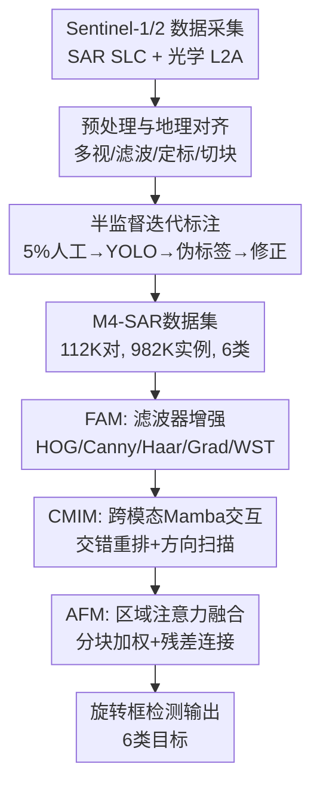

# M4-SAR: A Multi-Resolution, Multi-Polarization, Multi-Scene, Multi-Source Dataset and Benchmark for optical-SAR Object Detection

**会议**: ECCV 2026  
**arXiv**: [2505.10931](https://arxiv.org/abs/2505.10931)  
**代码**: [https://github.com/wchao0601/M4-SAR](https://github.com/wchao0601/M4-SAR)  
**领域**: 目标检测 / 遥感多源融合  
**关键词**: 光学-SAR融合, 旋转目标检测, 多源遥感数据集, Mamba跨模态交互, 半监督标注  

## 一句话总结
本文提出 M4-SAR——首个大规模光学-SAR 配对旋转目标检测数据集（112,174 对图像、981,862 实例、6 类），配套统一评测工具 MSRODet 和端到端融合检测框架 E2E-OSDet（FAM + CMIM + AFM），融合后 mAP 比最优单源提升 5.1%，复杂环境下增益尤为显著。

## 研究背景与动机
**B. 空白填补型**

光学遥感图像纹理丰富但受光照、云雾、低分辨率影响严重；SAR 图像全天候全天时但对散斑噪声敏感且语义信息稀疏。两者高度互补——光学提供纹理和颜色，SAR 提供几何结构和对恶劣天气的鲁棒性——融合二者可显著提升复杂环境下目标检测的可靠性。然而，该方向长期受困于缺乏大规模、高质量、标准化的光学-SAR 配对数据集：现有 SAR 数据集（HRSID、SSDD、MSAR、SARDet-100K、FAIR-CSAR、RSAR）均为单源数据，仅有 OGSOD-1.0/2.0 提供光学-SAR 配对但规模小（约 2 万对 256x256 图像）、类别少（3 类），且其测试集仅含 SAR 图像，设计初衷是跨模态知识蒸馏而非端到端融合检测评测。

这件事之所以现在才可能，源于两个关键使能因素：(1) ESA 的 Sentinel-1/2 卫星提供了全球覆盖、公开免费的多分辨率（10M/60M）光学和多极化（VH/VV）SAR 数据；(2) 半监督光学辅助标注策略的成熟——利用光学图像的高语义可读性来破解 SAR 标注成本高的难题。本文的设计选择是：聚焦沿海基础设施场景的 6 类静态目标（桥梁、港口、油罐、操场、机场、风机），利用地理坐标对齐（非像素级配准）以反映真实跨传感器采集条件，时间间隔控制在 10 天内以保证目标结构一致性。

核心 idea：用 Sentinel 公开数据 + 半监督光学辅助迭代标注构建首个大规模光学-SAR 配对检测基准，并从数据输入（FAM）、域对齐（CMIM）、特征融合（AFM）三个层面设计端到端融合框架 E2E-OSDet 系统性缩小跨模态域差异。

## 方法详解

### 整体框架
本文工作包含两部分：M4-SAR 数据集构建管线与 E2E-OSDet 端到端融合检测框架。数据集构建分三阶段——(a) 数据采集：从 ESA 开放平台获取 Sentinel-1 SAR（SLC 格式，VH/VV 双极化）和 Sentinel-2 光学（RGB 波段，L2A 产品，云量 0-10%），覆盖天津、洛杉矶、香港、伦敦等沿海城市，时间跨度 2020-2022；(b) 预处理与对齐：SAR 经多视平均降散斑、滤波、DEM 地理编码和辐射定标，光学经通道合成后，基于地理坐标与 SAR 对齐，切为 1024x1024 块，仅保留有效重叠区域；(c) 半监督迭代标注：先用 5% 无云光学图像人工标注，训练 YOLO 检测器，生成伪标签经人工修正后加入训练集，迭代直至全数据集标注完成，最终替换为含云图像并切为 512x512 块。E2E-OSDet 端到端检测框架则在数据输入端通过 FAM 将 SAR 投影到手工特征空间缩小域差距，在特征层通过 CMIM 实现跨模态 Mamba 序列交互，在融合层通过 AFM 强化关键区域注意力，最终由旋转框检测头输出结果。

### 关键设计

**1. 半监督光学辅助迭代标注：利用光学图像高语义可读性破解 SAR 标注成本难题**

SAR 图像因散斑噪声和低对比度，非专业人员难以准确判断目标边界；而光学无云图像边界清晰、语义明确。本文的核心洞察是：在遥感场景中，静态基础设施目标（桥、港口等）的跨模态结构一致性远高于动态目标（船），因此基于地理坐标的粗对齐已足以支撑可靠的光学→SAR 标注迁移。具体流程：首先在 5% 的无云光学图像上人工标注全部 6 类目标，用这批数据训练 YOLO 检测器；然后用该检测器对额外 5% 数据生成伪标签，人工修正后加入训练集，重新训练检测器；如此迭代直到全数据集标注完成。过程中排除不含有效目标的图像以提升效率，标注完成后将无云图像替换为含云图像以反映真实场景。最终在 3,000 样本上的人工抽检显示标注正确率超 98%（遥感专家 98.3%，非遥感专家 99.3%），专家与非专家差异极小说明光学图像上的标注不需要遥感专业背景。标注格式为四点四边形 $[category, (x_1,y_1), (x_2,y_2), (x_3,y_3), (x_4,y_4)]$，坐标归一化到 $[0,1]$。

**2. FAM（Filter Augment Module）：用手工特征投影缩小光学-SAR 像素域鸿沟**

光学和 SAR 的成像机制差异（光学靠反射、SAR 靠微波后向散射）导致像素域存在显著的分布偏移（原文 Fig. 4a 通过特征可视化证实），直接融合会引入噪声。FAM 的核心思路是：不改变原始图像，而是将低维稀疏的 SAR 和光学表示通过经典图像滤波器投影到高维判别性手工特征空间，在该空间中跨模态结构相似性（SSIM）显著高于像素域。给定光学图像 $I_O \in \mathbb{R}^{H \times W \times 3}$ 和 SAR 图像 $I_S \in \mathbb{R}^{H \times W \times 3}$，FAM 对每个滤波器 $t \in \{\text{WST, Canny, Haar, HOG, Grad}\}$ 生成增强特征：

$$F_O = I_O + \alpha * \mathbb{FAM}^t(I_O), \quad F_S = I_S + \alpha * \mathbb{FAM}^t(I_S)$$

其中 $\mathbb{FAM}^t(\cdot)$ 为滤波器变换（Canny 边缘检测、HOG 梯度直方图、Haar 类小波特征、Grad 梯度比边缘检测、WST 小波散射变换），$\alpha$ 为可学习的标量权重。光学和 SAR 各走一支路，保留各自模态特有结构的同时注入噪声鲁棒的多尺度边缘和形状线索。实验表明 Grad 特征效果最优——因为其通过梯度比值运算对 SAR 乘性散斑噪声具有天然鲁棒性，且能捕获多尺度梯度信息。注意 FAM 加在数据输入端，参数量几乎为零（仅 $\alpha$ 标量），不增加推理负担，是极高效的域适配手段。

**3. CMIM（Cross-modal Mamba Interaction Module）：交错重排实现细粒度跨模态序列交互**

现有融合方法主要关注空间级特征拼接（concat/add），忽略了特征域的分布偏差。Mamba 的状态空间建模擅长捕获长程依赖，但现有 Mamba 融合方法架构复杂、交互机制臃肿。CMIM 的关键创新在于 **交错输入重排（Interleaved Input Rearrangement, IIR）**：传统做法是将光学和 SAR 特征序列直接首尾拼接 $Z^{tra}_j = [p^o_1, ..., p^o_n, p^s_1, ..., p^s_n]$，这种粗粒度拼接无法建立逐位置跨模态对应。IIR 则将两模态特征逐 patch 交错排列：

$$Z^{IIR}_j = [p^o_1, p^s_1, p^o_2, p^s_2, \dots, p^o_n, p^s_n]$$

每个光学 patch 与其空间对应的 SAR patch 在序列中相邻，Mamba 的状态空间建模可在短时间步内直接捕获跨模态语义对应。交错的序列随后送入方向扫描机制 $Z^{scan}_j = \mathbb{SCAN}^m(Z^{IIR}_j)$（支持 Bidirectional、Z-Order、Zigzag、Hilbert 四种扫描方式），经 Mamba 块沿水平和垂直方向建模后 reshape 回 2D 空间并通过残差连接保留原始模态信息。CMIM 在三个特征层（$j=3,4,5$，对应下采样 8/16/32 倍）上独立运行：$\{F'_{Oj}, F'_{Sj}\} = \mathbb{CMIM}(Z^{scan}_j)$。IIR 的深层作用是：将"跨模态对齐"转化为"Mamba 序列内的局部邻接关系"，使得同步语义增强在短时间步内发生，有效防止训练中的特征漂移和梯度不一致。实验表明 CMIM 对不同扫描策略具有良好鲁棒性。

**4. AFM（Area-Attention Fusion Module）：分块区域注意力实现轻量高效特征融合**

经过 FAM 预处理和 CMIM 跨模态交互后，需要在融合层将两模态特征整合为统一检测表示。AFM 受 YOLOv12 高效空间建模启发，将 $H \times W$ 特征图沿一个方向切分为 $k$ 个不重叠条带块（尺寸 $H/k \times W$ 或 $H \times W/k$），通过简单 reshape 实现分块，无需显式窗口划分。在每个块内计算注意力权重自适应加权光学和 SAR 特征：

$$F^{fus}_j = \mathbb{AFM}(F'_{Oj} + F_{Oj}, F'_{Sj} + F_{Sj}), \quad j \in \{3,4,5\}$$

其中 $F'_{Oj}, F'_{Sj}$ 为 CMIM 增强特征，$F_{Oj}, F_{Sj}$ 为残差原始特征。AFM 的优势在于三点：(1) 分块操作相比全局注意力大幅降低计算量；(2) 区域注意力能自适应突出目标关键区域、抑制背景干扰，而非简单逐元素相加；(3) 残差连接保留原始模态信息防止过融合。消融实验中 AFM 单独贡献最大（+2.0 mAP），验证了区域感知融合在多源检测中的关键价值。

### 一个完整示例：一副港口场景光学-SAR 图像对的前向传播

以一副港口场景为例追踪 E2E-OSDet 的完整前向传播。输入：光学图像 $I_O$（512x512x3，10M 分辨率，RGB 三通道，包含港口、船舶停泊区、防波堤）和配对 SAR 图像 $I_S$（512x512x3，VH 极化，散斑噪声明显，港口轮廓可见但细节模糊）。第一步，FAM 分别对两图施加 Grad 滤波增强：光学侧 Grad 算子提取建筑边缘和海岸线梯度，SAR 侧 Grad 通过梯度比值压制散斑噪声后提取结构轮廓，得到 $F_O$ 和 $F_S$（各 512x512x3）。第二步，YOLOv11-S 骨干网络逐层下采样提取多尺度特征：在第 3 层（128x128xC3）、第 4 层（64x64xC4）、第 5 层（32x32xC5）分别获得光学特征 $F_{Oj}$ 和 SAR 特征 $F_{Sj}$。第三步，每个尺度上 CMIM 将 $F_{Oj}$ 和 $F_{Sj}$ flatten 为 1D 序列后通过 IIR 交错重排（如 $p^o_1, p^s_1, p^o_2, p^s_2, ...$），经 Hilbert 方向扫描送入 Mamba 块做长程交互，输出增强特征 $F'_{Oj}, F'_{Sj}$。第四步，AFM 对每层增强特征加残差后分块做区域注意力融合，得到 $F^{fus}_j$，送入 YOLOv8 OBB 检测头。最终输出：港口区域预测为 rotated bbox（AP50=91.8%），附带方向角度和置信度。整个过程参数量 24.7M，推理 20.9ms。

### 损失函数 / 训练策略

E2E-OSDet 采用复合损失联合优化分类与旋转框定位：

$$\mathcal{L}_{total} = \mathcal{L}_{reg} + \mathcal{L}_{dfl} + \mathcal{L}_{cls}$$

其中 $\mathcal{L}_{reg}$ 为 ProbIoU 旋转框回归损失（将旋转框建模为二维高斯分布并计算 Bhattacharyya 距离），$\mathcal{L}_{dfl}$ 为分布焦点损失（Distribution Focal Loss，对边框分布的离散概率做加权聚焦），$\mathcal{L}_{cls}$ 为二值交叉熵分类损失。所有融合模型统一使用 YOLOv11-S 骨干和 YOLOv8 OBB 检测头，SGD 优化器（lr=0.01, momentum=0.937, weight decay=5e-4），训练 300 epoch，batch size 64，输入分辨率 512x512，双卡 RTX 4090 FP16 混合精度训练，所有融合模型从头训练不加载预训练权重。数据集划分为训练:验证:测试 = 5:2:3。MSRODet 评测工具中单源 MMRotate 方法（FCOS/ATSS/RepPoint/RTMDet/PSC/LSKNet）使用 ResNet-50 骨干 + ImageNet 预训练 + AdamW（lr=2e-4）训练 72 epoch。

## 实验关键数据

### 主实验

| 方法 | 模态 | mAP | AP50 | AP75 | 参数量(M) | 推理(ms) |
|------|------|-----|------|------|-----------|----------|
| YOLO-Master | 光学 | 56.3 | 80.0 | 63.9 | 29.3 | 15.7 |
| YOLO-Master | SAR | 48.5 | 73.9 | 53.1 | 29.3 | 15.7 |
| CFT | O+S | 59.9 | 84.6 | 68.9 | 53.8 | 40.6 |
| CLANet | O+S | 59.6 | 84.6 | 68.5 | 48.2 | 29.1 |
| MMIDet | O+S | 59.8 | 84.8 | 68.6 | 53.8 | 41.9 |
| ICAFusion | O+S | 58.8 | 84.5 | 67.3 | 29.0 | 23.6 |
| CSSA | O+S | 58.0 | 83.4 | 66.4 | 13.5 | 12.3 |
| **E2E-OSDet** | **O+S** | **61.4** | **85.7** | **70.3** | **24.7** | **20.9** |

融合比光学最优提升 mAP +5.1，比 SAR 最优提升 +12.9。E2E-OSDet 参数量（24.7M）比第二名 CLANet（48.2M）少近一半，推理速度（20.9ms）在所有融合方法中排第二，综合效率最优。

### 消融实验

| 配置 | FAM | CMIM | AFM | 参数量 | mAP | AP50 | AP75 |
|------|-----|------|-----|--------|-----|------|------|
| Baseline (CSSA) | | | | 14.17M | 58.0 | 83.4 | 66.4 |
| +FAM | Y | | | 14.17M(+0M) | 58.9 | 84.5 | 67.1 |
| +CMIM | | Y | | 19.01M(+5.68M) | 59.6 | 84.9 | 68.6 |
| +AFM | | | Y | 19.84M(+4.84M) | 60.0 | 84.6 | 68.9 |
| +FAM+CMIM | Y | Y | | 19.84M(+4.84M) | 61.0 | 85.5 | 69.9 |
| +FAM+AFM | Y | | Y | 19.01M(+5.68M) | 60.7 | 84.9 | 69.5 |
| +CMIM+AFM | | Y | Y | 24.69M(+10.52M) | 60.9 | 85.2 | 70.0 |
| **Full** | **Y** | **Y** | **Y** | **24.69M(+10.52M)** | **61.4** | **85.7** | **70.3** |

### 跨数据集泛化

| 方法 | OGSOD-1.0 mAP | OGSOD-2.0 mAP |
|------|---------------|---------------|
| YOLOv11 (光学) | 61.5 | 58.5 |
| YOLOv11 (SAR) | 47.8 | 45.9 |
| CFT (O+S) | 65.3 | 61.4 |
| ICAFusion (O+S) | 66.1 | 62.2 |
| MMIDet (O+S) | 66.7 | 63.0 |
| **E2E-OSDet (O+S)** | **67.3** | **65.1** |

### 关键发现
- **AFM 贡献最大**：单独加 AFM 带来 +2.0 mAP，说明区域感知融合远比简单逐元素融合有效；FAM 单独贡献最小（+0.9 mAP）但零参数增长使其性价比最高。
- **融合远优于直接混合**：将光学和 SAR 数据直接混合训练单源检测器反而掉点（YOLO26 混合数据 mAP 仅 47.3%，低于光学 55.4% 和 SAR 48.2%），证明跨模态域差异必须通过专用融合架构处理，简单混合只会引入干扰。
- **Grad 特征在五种手工特征中最优**：Grad 通过梯度比值对 SAR 乘性散斑噪声天然鲁棒，跨模态 SSIM 最高；其他滤波器（Canny/HOG/Haar/WST）也有正向增益，说明"噪声模式匹配"而非"降噪后匹配"是缩小域 gap 的正确思路。
- **超参数不敏感**：手工特征输入比例和 AFM 区域分块大小的变化对最终性能影响 <0.5 mAP，框架部署稳定性好。

## 亮点与洞察
- **"四多"数据集的设计哲学务实**：不强求像素级精配准（现实中不可得），拥抱地理坐标粗对齐的约束，聚焦静态基础设施目标规避时间不对齐问题——这种"承认局限、在约束内做到最好"的思路值得 benchmark 论文借鉴。
- **FAM 的"零参数域适配"思路巧妙**：不增加可学习参数，仅通过经典手工特征投影缩小域差异——本质是利用人类先验知识（边缘/梯度/纹理）做特征空间变换，让网络在更容易对齐的空间中学习融合。这启示我们：多模态融合中注入手工特征先验仍是缩小域 gap 的高性价比手段。
- **CMIM 的 IIR 交错重排是通用设计模式**：将"跨模态对齐"转化为"Mamba 序列内的局部邻接关系"——任何需要对齐两路特征的 Mamba-based 融合任务都可套用此 trick（RGB-IR、RGB-Depth、RGB-Event 等），不限于遥感。
- **AFM 的分块注意力可迁移**：思路直接适用于其他双流融合检测任务，计算量远低于全局交叉注意力，且不依赖预定义窗口——是 YOLOv12 区域注意力在跨模态场景的自然泛化。
- **标注正确率 >98% 且专家与非专家差异<1%**：说明光学图像上的静态基础设施标注不需要遥感专业背景，这对后续数据集扩展的可行性和标注成本控制有重要参考价值。

## 局限与展望
- **地理坐标粗对齐限制应用范围**：光学-SAR 仅通过地理坐标对齐（非像素级配准），跨模态相似度指标极低（MSE 0.0662, SSIM 0.1256, MI 0.1729），无法用于图像配准、变化检测、像素级融合等需精确对齐的任务。作者承认这是设计权衡——更贴近真实条件但也牺牲了精配准能力。
- **类别覆盖有限和不均衡**：仅 6 类沿海基础设施，桥类占 43.64% 实例，港口仅 2.83%（因其空间覆盖大，单个港口即一个实例）。缺少车辆、船舶等动态目标和山地、农田等多样的内陆场景。未来可引入更多细粒度或动态类别。
- **时间对齐问题未深入解决**：Sentinel-1/2 非同步采集（间隔 <10 天），动态目标因无法对齐被排除。未来可引入时序对齐策略（多时相建模、光流 warp）扩展覆盖。
- **E2E-OSDet 仅在 YOLO 框架上验证**：虽跨 YOLO 版本（v5-v12）验证了泛化性，但未在 DETR 类或 anchor-free 类检测器上测试，模块可移植性待进一步验证。作者建议未来设计轻量化融合架构以支持边缘部署。

## 相关工作与启发
- **vs SARDet-100K / FAIR-CSAR / RSAR**：这些大规模 SAR 数据集仍是单源，无法支撑光学-SAR 融合研究。M4-SAR 以配对数据填补空白，实例密度（8.75/图）远高于 SARDet-100K（2.11/图），场景更密集、检测难度更高。
- **vs OGSOD-1.0/2.0**：仅有 3 类、约 2 万对 256x256 低分辨率图像，测试集仅含 SAR 图像，设计初衷是跨模态知识蒸馏。M4-SAR 在规模（5x 图像对、18x 实例）、类别（2x）、分辨率（512x512）和评测设计（同时含光学+SAR 测试集）上全面超越。
- **vs RGB-IR 融合方法（CLANet/ICAFusion/CMADet/CSSA）**：光学-SAR 域差异（不同物理成像原理）远大于 RGB-IR（仅光谱波段差异），直接迁移效果有限。本文将 6 种代表性 RGB-IR 方法适配到光学-SAR 场景并构建 MSRODet 统一评测，发现对齐感知型方法（CMADet）比直接融合型（ICAFusion）更鲁棒，说明跨模态融合中对齐策略是首要因素。
- **vs MambaSOD / FusionMamba 等 Mamba 融合方法**：这些方法交互机制复杂。CMIM 通过 IIR 交错重排以极简操作实现高效跨模态交互，参数量和计算量控制更优，且对扫描策略不敏感。

## 评分
- 新颖性: ⭐⭐⭐⭐ — 首个大规模光学-SAR 配对旋转检测数据集和针对性端到端融合框架，填补明确空白；但各子模块（手工特征增强、Mamba 交互、区域注意力）均基于已知技术，属于组合式创新
- 实验充分度: ⭐⭐⭐⭐⭐ — 单源 15+ 方法 + 融合 7 方法 + MSRODet 统一框架 + 3 模块逐一消融 + 手工特征类型对比 + 扫描策略对比 + OGSOD 跨数据集泛化 + 混合数据实验 + 人工标注质量评估（8 人），覆盖极其全面
- 写作质量: ⭐⭐⭐⭐ — 结构清晰，图表丰富（10+ 张配图），附录翔实；部分技术细节（如 FAM 五滤波器的选择依据、CMIM 扫描方向的消融逻辑）可交代得更透彻
- 价值: ⭐⭐⭐⭐⭐ — M4-SAR 数据集和 MSRODet 工具将对遥感多源融合社区产生长期影响，填补"有需求、没数据"的基础设施空白；E2E-OSDet 作为首个针对性基线为后续方法提供公平参照点

<!-- RELATED:START -->

## 相关论文

- [\[ECCV 2026\] MATCH: Flow Matching for Multi-View Anomaly Detection](match_flow_matching_for_multi-view_anomaly_detection.md)
- [\[CVPR 2026\] MRD: Multi-resolution Retrieval-Detection Fusion for High-Resolution Image Understanding](../../CVPR2026/object_detection/mrd_multi-resolution_retrieval-detection_fusion_for_high-resolution_image_unders.md)
- [\[ECCV 2026\] MSPL: Multi-Step Pseudo-Labeling for Open-Vocabulary Object Detection](mspl_multi-step_pseudo-labeling_for_open-vocabulary_object_detection.md)
- [\[ECCV 2026\] PS-MOT: Cultivating Instance Awareness from Point Seeds for Multi-Object Tracking](ps-mot_cultivating_instance_awareness_from_point_seeds_for_multi-object_tracking.md)
- [\[CVPR 2026\] GMT: Effective Global Framework for Multi-Camera Multi-Target Tracking](../../CVPR2026/object_detection/gmt_effective_global_framework_for_multi-camera_multi-target_tracking.md)

<!-- RELATED:END -->
