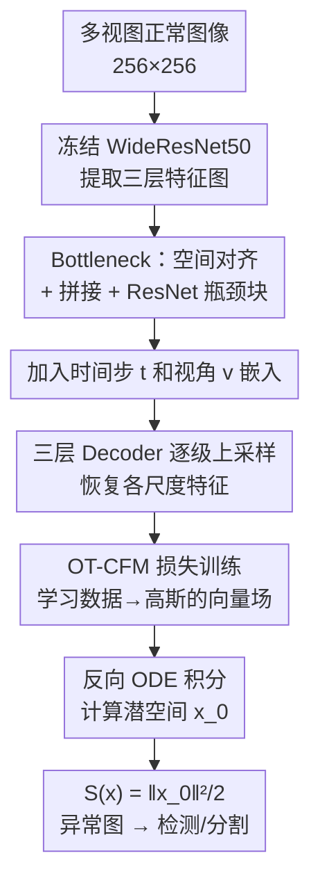

# MATCH: Flow Matching for Multi-View Anomaly Detection

**会议**: ECCV 2026  
**arXiv**: [2606.24375](https://arxiv.org/abs/2606.24375)  
**代码**: [https://github.com/m-kruse98/MATCH](https://github.com/m-kruse98/MATCH)  
**领域**: 异常检测 / 多视图视觉  
**关键词**: 多视图异常检测, Flow Matching, 归一化流, 密度估计, 工业缺陷检测

## 一句话总结
MATCH 是首个基于 Flow Matching 的多视图异常检测方法，用 ODE 形式的连续归一化流在预训练特征空间上做密度估计，通过省略散度项实现实时推理（18.77 FPS），在 Real-IAD 和 MANTA-Tiny 两个基准上均取得 SOTA 的检测和分割性能。

## 研究背景与动机

**领域现状**：工业异常检测的主流范式是半监督学习——训练时只用正常样本，推理时检测偏离正常分布的异常。现有高性能方法大量使用基于 RealNVP 的归一化流（Normalizing Flows）来做似然估计，如 DifferNet、CS-Flow、FastFlow、CFlow、Multi-Flow 等。

**现有痛点**：RealNVP 架构存在两个根本性限制。第一，它的 coupling block 结构要求网络可逆且 Jacobian 行列式易计算，这严重约束了网络架构的表达能力，只能堆叠有限层数的变换。第二，多视图场景下图像数据维度极高（多个视角的特征图拼接），RealNVP 在建模高维分布时容易失效——论文在 "Two Moons" toy experiment 中直观展示了这一点：将 2D 的 moons 数据嵌入到 d 维空间后，Flow Matching 在各个维度下都能正确捕获分布，而 RealNVP 在 d>2 时就开始产生退化的密度估计（BPD 为负值）。

**核心矛盾**：多视图异常检测需要在极高维的特征空间中捕捉微小偏差（异常），但 RealNVP 架构的表达能力受限于其可逆性约束，无法胜任高维分布的精确建模。同时，精确的似然估计需要计算散度（divergence）项，这会大幅增加推理成本，不利于工业实时部署。

**本文目标**：(1) 用 Flow Matching 替代 RealNVP 做多视图异常检测的密度估计；(2) 在保证检测精度的前提下省略散度项以提升推理速度；(3) 首次对 MANTA-Tiny 数据集进行全面基准测试。

**切入角度**：Flow Matching 作为连续归一化流（CNF）的现代训练范式，不要求网络可逆，可以使用任意通用架构（如 ResNet、Transformer），天然适合高维数据建模。其 ODE 形式既支持生成方向（噪声→数据），也支持密度估计方向（数据→高斯空间），后者正好可以用来计算异常分数。

**核心 idea**：用 Flow Matching 的 ODE 将多视图特征映射到标准高斯空间，以样本在高斯空间中的负对数似然（本质是 Mahalanobis 距离）作为异常分数，同时省略散度项使推理加速 3 倍以上而不损失精度。

## 方法详解

### 整体框架

MATCH 的整体流程是"冻结特征提取 → 多尺度特征对齐 → Flow Matching 潜空间映射 → 反向 ODE 积分计算异常分数"。训练时，输入正常多视图图像，经过冻结的 WideResNet50 提取三层特征图，加入时间步 t 和视角 v 的嵌入信息，通过 bottleneck 网络对齐并融合多尺度特征，再由三层 decoder 恢复到各尺度原始尺寸，用 OT-CFM 损失训练网络学习从数据分布到标准高斯的向量场。推理时，运行反向 ODE 将测试样本从 t=1 积分到 t=0 得到其在潜高斯的映射 x_0，用 S(x) = ||x_0||^2/2 + (d/2)log(2pi) 作为异常分数，生成多尺度异常图用于分割和检测。

### 关键设计

**1. Flow Matching 替代 RealNVP：根本上解除架构约束**

RealNVP 的 coupling block 要求每一层都可逆且 Jacobian 易算，这导致网络只能用特定结构（如仿射耦合层），层数受限于表达能力饱和。Flow Matching 则完全不同——它学习的是一个时间依赖的向量场 u_t(x)，通过 ODE d(phi_t)/dt = u_t(phi_t) 定义从噪声 p_0 到数据 q 的连续变换，**对网络架构没有任何可逆性或 Jacobian 约束**。训练时使用 OT-CFM 损失：L = E[||u_t^theta(x_t) - (x_1 - x_0)||^2]，其中 x_t = (1-t)x_0 + t*x_1 是线性插值的中间点。这个损失只是一个简单的回归目标（预测从当前点到目标数据点的直线方向），不需要通过 ODE 求解器反向传播。训练完成后，正向积分（t=0→1）做生成，反向积分（t=1→0）做密度估计。这种架构灵活性让 MATCH 可以使用 ResNet 风格的 bottleneck 和 decoder，自由设计层数和宽度，论文实验显示最佳宽度为 768，远超 RealNVP 通常的配置。

**2. 多尺度潜空间密度估计与 Reverse Distillation 架构**

直接在像素空间做 Flow Matching 已被证明对异常检测无效，因为正常和异常图像在像素层面差异太小。MATCH 在预训练 WideResNet50 的潜空间上学习分布，提取前三层特征图 x_1^i ~ q^i（尺寸分别为 256x64x64、512x32x32、1024x16x16，i=1,2,3）。这些特征图首先通过 bottleneck 做空间对齐——i=1 的特征用两层 stride-2 卷积下采样，i=2 的用一层，全部对齐到 16x16 后 concat，再经过三个 ResNet 风格瓶颈块（含 group norm + ReLU）进一步蒸馏正常结构的表征。Decoder 分三层 D_i（分别含 3、4、6 个 decoder block），每层用 1x1 conv + 3x3 stride-2 转置卷积上采样，逐步恢复到原始各尺度的空间尺寸，输出三个异常图 M_i。这种"压缩-恢复"的 Reverse Distillation 结构强制 bottleneck 只保留正常样本的共性结构，异常样本在 decoder 恢复时会产生更大的重建偏差，从而在异常图上响应更强烈。时间步 t（1024 维正弦位置编码 + 2 层 MLP）和视角 v（可学习嵌入 + MLP）的信息通过 concat 后分别注入 bottleneck 输出和每个 decoder block，让网络知道当前处于流路径的哪个阶段以及处理的是哪个视角。

**3. 省略散度项：用"不完整似然"换来实时推理**

标准 Flow Matching 的似然估计公式为 log p_1(x_1) = log p_0(x_0) - integral div(u_t)(x_t) dt，其中散度项需要沿 ODE 轨迹积分。在实践中，散度用 Hutchinson 迹估计器计算：div(u_t)(x) = E_z[z^T * partial_x u_t(x) * z]，每步都需要一次额外的反向传播。论文发现，在 Real-IAD 上，散度项的绝对值仅占最终分数幅度的 0.57%（|div|/|log p_0(x_0)| = 0.0057），加入散度（无论 M=1,2,4 个采样向量）对 I-AUROC 完全没有影响（91.172 vs 91.170）。省略散度后，FPS 从 5.40（M=1）飙升至 18.77，显存从 10.28GB 降至 8.88GB。所以 MATCH 的异常分数简化为 S(x) = ||x_0||^2/2 + (d/2)log(2pi)，去掉常数项后本质就是 x_0 到标准高斯的平方 Mahalanobis 距离——x_0 离高斯中心越远，就越可能是异常。作者推测这是因为模型学习到的向量场非常平滑，局部散度近乎为零。

**4. 多粒度异常分数融合：局部与全局互补**

MATCH 从三个 decoder 层输出三个异常图 M_i，每个都是沿特征维度计算 S(x) 得到。对于分割任务，直接求和 M_segment = sum(M_i)，将所有图双线性插值到原始图像尺寸——低层 M_1 擅长捕获微小、局部的低层异常（如划痕），高层 M_2 和 M_3 对高层的结构性异常更敏感，三图叠加实现了多粒度覆盖。对于图像级检测，只用 M_detect = M_2 + M_3（舍弃 M_1），这是因为已有研究发现高层表征更适合产生图像级别的单一异常分数，低层偏差容易被正常纹理变化触发而产生噪声。图像级分数取 M_detect 的最大值。对于样本级（多视图对象级）检测，取该对象所有视图图像分数的最大值——只要任意一个视角出现异常，整个对象就判为异常。

### 损失函数 / 训练策略

训练目标为 OT-CFM 损失（公式见关键设计 1），在三个特征尺度上分别计算 loss 后求和。优化器为 AdamW（lr=1e-4, beta=(0.9,0.95), weight decay=0.01），不需要梯度裁剪或缩放（与 RealNVP 不同）。所有图像缩放到 256x256，batch size=8，训练 150 epochs。推理时使用 Euler 方法求解 ODE，步长 0.2，共 5 次前向传播。ODEsolver 消融显示 Euler 方法不仅最快（13.13 FPS），I-AUROC（91.17）还略优于 Midpoint（91.08）和 RK4（91.07），不存在精度-速度 trade-off。

## 实验关键数据

### 主实验

**Real-IAD（30 类工业物体，5 个视角）**：

| 指标 | MATCH | Multi-Flow | RD4AD | EfficientAD | FastFlow |
|------|-------|------------|-------|-------------|----------|
| I-AUROC | **91.17** | 90.27 | 89.26 | 77.26 | 79.26 |
| S-AUROC | 95.63 | **95.85** | 93.46 | 86.91 | 92.30 |
| P-AUROC | **99.24** | 96.47 | 98.81 | 89.64 | 90.18 |
| P-AUPRO | **94.76** | 87.91 | 92.70 | 71.31 | 66.99 |
| P-AP | **32.68** | 12.42 | 32.65 | 13.18 | 06.16 |

MATCH 在除 S-AUROC 外的所有指标上均排第一。P-AUPRO 比第二名 RD4AD 高 2.06 点，比同是 flow-based 的 Multi-Flow 高 6.85 点，验证了 Flow Matching 比 RealNVP 更适合高维特征空间的异常分割。S-AUROC 略低于 Multi-Flow（-0.22），但 Multi-Flow 本身针对多视图场景做了专门优化。

**MANTA-Tiny（微小物体，5 大类，多子类）**：

| 指标 | MATCH | RD4AD | Multi-Flow | SimpleNet | EfficientAD |
|------|-------|-------|------------|-----------|-------------|
| P-AUPRO | **89.66** | 85.59 | 81.76 | 79.42 | 80.83 |
| P-AUROC | **95.65** | 94.60 | 93.07 | 93.63 | 92.21 |
| I-AUROC | 90.66 | 88.45 | — | **93.19** | — |

P-AUPRO 领先第二名 RD4AD 超过 4 个百分点。按类别分组看，Mechanics（工业零件）类最高（P-AUPRO 96.35），Agriculture（自然农产品）最低（75.52），因为自然品类的正常样本方差大、异常边界模糊。在 I-AUROC 上略低于 SimpleNet，作者推测是 MANTA-Tiny 中微小缺陷难以转化为整个图像的高异常分数。

### 消融实验

**散度项消融（Real-IAD）**：

| 方法 | M | I-AUROC | FPS | 显存(GB) |
|------|---|---------|-----|----------|
| MATCH (无散度) | — | 91.172 | **18.77** | **8.88** |
| Hutchinson | 1 | 91.170 | 5.40 | 10.28 |
| Hutchinson | 2 | 91.169 | 3.16 | 10.70 |
| Hutchinson | 4 | 91.170 | 1.56 | 11.45 |
| RQMC | 1 | 91.170 | — | — |
| RQMC | 4 | 91.170 | — | — |

加入散度（无论哪种估计方法、多少采样向量）对检测精度零提升，但 FPS 下降至少 3.5 倍。散度项只占最终分数的 0.57%，证实了省略的合理性。

**ODE 求解器消融（Real-IAD）**：

| 求解器 | 步长 | I-AUROC | FPS |
|--------|------|---------|-----|
| Euler | 0.20 | **91.17** | **18.77** |
| Euler | 0.10 | 91.12 | 6.54 |
| Midpoint | 0.20 | 91.08 | 6.55 |
| RK4 | 0.20 | 91.07 | 2.48 |
| Dopri5 (自适应) | — | 91.06 | 0.48 |

Euler 方法以大步长（0.2，仅需 5 步）在速度和精度上双赢。更复杂的求解器不能提升 AUROC（都约 91.06），且速度大幅下降。

**网络宽度消融**：将 bottleneck 和 decoder 的特征维度从 32 逐步增加到 768，所有指标几乎线性上升，宽度 768 时达到最佳。将 RD4AD 的参数数量匹配到 MATCH 后，RD4AD 的 I-AUROC 仅为 86.75，确认性能提升来源于 Flow Matching 公式而非模型容量。

### 关键发现

- 散度项可被完全省略而不损失性能，这是 MATCH 能实用化的关键——意味着 Flow Matching 用于异常检测时不需要精确似然，只需要相对排序的异常分数。
- 多尺度异常图融合是分割性能大幅领先的核心：低层图捕捉细微纹理缺陷，高层图感知结构异常，二者互补。
- MANTA-Tiny 上农业和食品类（Agriculture/Groceries）的表现显著弱于工业和电子类（Mechanics/Electronics），因为前者的正常样本形态多样、异常判定更依赖语义推理。作者给出了一些失败案例：稻谷的干瘪缺陷（仅颜色微差）、大豆裂纹导致整体被判异常、因光照反射导致误报等。
- 将 MATCH 在 MANTA-Tiny 上训练的模型直接在完整 MANTA 测试集上评估，性能无明显下降（P-AUPRO 89.23 vs 89.66），说明 MANTA-Tiny 是 MANTA 的良好替代基准。

## 亮点与洞察

- **散度项省略是本文最巧妙的设计决策**。按常理，Flow Matching 用于密度估计需要完整似然，但作者通过实验证明：对于异常检测这种只需要相对排序的任务，"不完整似然"（仅潜高斯的对数密度）已经足够，因为正常样本和异常样本在潜空间的范数分布已经充分可分。这相当于把昂贵的精确密度估计退化成了高效的到原点的距离度量，是理论与工程的优雅折中。
- **将 Reverse Distillation 架构与 Flow Matching 结合是自然的但被忽视的组合**。RD 的"压缩—恢复"结构天然适合异常检测（bottleneck 滤除异常信息），而 Flow Matching 为其提供了无架构约束的分布建模能力。两者结合后在分割指标上大幅领先纯 RealNVP 方案，说明架构范式和生成模型的选择同等重要。
- **多视角聚合策略极简但有效**：图像级取 max，样本级取 max，双层的 max 操作没有引入任何额外参数或训练。这暗示在多视图异常检测中，"任一视角有异常则对象异常"的假设足够强，不需要复杂的跨视角注意力或融合机制。
- 时间步和视角信息的嵌入方式可复用——通过正弦位置编码 + MLP 注入到 bottleneck 和每个 decoder block，让网络感知流路径的阶段和不同视角的特征分布差异。

## 局限与展望

- **全局结构异常处理不足**：作者在失败案例分析中承认，当一个物体的多个局部各自看起来正常但组合在一起是异常时（如胶囊两边都是蓝帽子而不是一蓝一白），MATCH 的局部异常图无法捕获这种全局违规。原因是分割分支侧重局部纹理，检测分支虽有全局视野但缺乏对"跨局部一致性"的显式建模。引入跨局部注意力或图模型可能改善。
- **光照和姿态变化敏感**：部分误报来自光照反射或物体旋转（训练集中未出现的光照条件），因为模型仅在 2D 特征空间建模正常分布，缺乏 3D 几何先验来区分"视角变化导致的表面外观改变"和"真正的表面缺陷"。
- **S-AUROC 不敌专门的多视图方法 Multi-Flow**：虽然差距仅 0.22 点，但说明简单的 max 聚合可能不是最优的样本级分数融合方式，考虑视角间的互补信息（如某些缺陷只在特定视角可见，可以从其他视角推断其合理性）可能进一步改进。
- **MANTA-Tiny 上 I-AUROC 落后于 SimpleNet**：SimpleNet 通过在特征空间加噪声合成异常来做监督训练，这种"伪异常监督"可能在微小缺陷的检测上比纯密度估计更有优势。未来可以探索 Flow Matching 与合成异常的结合。
- **未利用多视角几何约束**：论文提到未来工作将引入显式的 3D 约束或多视图对应关系（如对极几何）到 Flow Matching 框架中。
- **仅在 ImageNet 预训练的 WideResNet50 上验证**：尽管补充材料测试了 DINOv3 骨干（性能略降），但未探索更大的现代骨干（如 DINOv2 ViT-L）或直接在像素空间训练的可能性。

## 相关工作与启发

- **vs Multi-Flow**: 同为多视图 flow-based 方法，但 Multi-Flow 基于 RealNVP（离散归一化流），受限于 coupling block 的架构约束；MATCH 用 Flow Matching 替换，获得了更高的表达能力和显著更好的分割性能（P-AUPRO 94.76 vs 87.91）。但 Multi-Flow 在 S-AUROC 上略优，可能因为其多视图融合策略更精细。
- **vs RD4AD**: RD4AD 用 Reverse Distillation 架构做异常检测，但它的 teacher-student 蒸馏不涉及显式密度估计；MATCH 复用其 encoder-decoder 结构但在 bottleneck 上用 Flow Matching 学习显式的概率分布，获得了更强的异常定位能力。控制参数量的实验证实增益来自 FM 而非更大模型。
- **vs DifferNet / CS-Flow / CFlow**: 这些单视图 NF 方法使用 RealNVP 做密度估计，在多视图场景下失效；MATCH 证明 Flow Matching 在高维特征空间中的分布拟合能力远超 RealNVP（在同样的特征空间中，RealNVP baseline 的 BPD 高达 160.5，而 MATCH 仅 1.83）。
- **vs 基于 Novel-View Synthesis 的多视图方法**（如 SplatPose、PACLD）: 这些方法构建一个固定的 3D 正常原型（如 3DGS 表示），对新视角渲染比较，缺点是无法处理正常样本本身形态多变的情况；MATCH 的密度估计方式天然支持学习多模态的正常分布。

## 评分

- 新颖性: ⭐⭐⭐⭐ 首次将 Flow Matching 引入多视图异常检测，散度项省略的发现具有实用价值。但核心架构（RD + FM）是两个已知模块的组合，方法论层面新颖度中等偏上。
- 实验充分度: ⭐⭐⭐⭐⭐ 两个大数据集的全面评估 + 10 个 baseline 对比 + 散度/求解器/宽度三类消融 + toy experiment + 多类别分报告 + 失败案例分析 + 附录中补充了 MVTec AD、多类 AD、DINOv3 骨干等多组实验，非常扎实。
- 写作质量: ⭐⭐⭐⭐⭐ 动机清晰（从 RealNVP 的局限到 FM 的适配，有 toy example 可视化），方法描述完整（架构图 + 每步公式），实验逻辑严密（主结果→消融→分析→失败案例），补充材料丰富。
- 价值: ⭐⭐⭐⭐ 为多视图异常检测提供了一个实用的实时方案（18.77 FPS on consumer GPU），在核心 benchmark 上取得 SOTA，散度项可省略的发现对后续 Flow Matching 在异常检测中的应用有指导意义。但多视图优于单视图的场景目前仍相对有限，实际工业部署价值还需验证。

<!-- RELATED:START -->

## 相关论文

- [\[ICML 2026\] Mixture Prototype Flow Matching for Open-Set Supervised Anomaly Detection](../../ICML2026/object_detection/mixture_prototype_flow_matching_for_open-set_supervised_anomaly_detection.md)
- [\[NeurIPS 2025\] Scalable, Explainable and Provably Robust Anomaly Detection with One-Step Flow Matching](../../NeurIPS2025/object_detection/scalable_explainable_and_provably_robust_anomaly_detection_with_one-step_flow_ma.md)
- [\[CVPR 2026\] GPFlow: Gaussian Prototype Probability Flow for Unsupervised Multi-Modal Anomaly Detection](../../CVPR2026/object_detection/gpflow_gaussian_prototype_probability_flow_for_unsupervised_multi-modal_anomaly_.md)
- [\[ECCV 2026\] M4-SAR: A Multi-Resolution, Multi-Polarization, Multi-Scene, Multi-Source Dataset and Benchmark for optical-SAR Object Detection](m4-sar_a_multi-resolution_multi-polarization_multi-scene_multi-source_dataset_an.md)
- [\[AAAI 2026\] REXO: Indoor Multi-View Radar Object Detection via 3D Bounding Box Diffusion](../../AAAI2026/object_detection/rexo_indoor_multi-view_radar_object_detection_via_3d_bounding_box_diffusion.md)

<!-- RELATED:END -->
