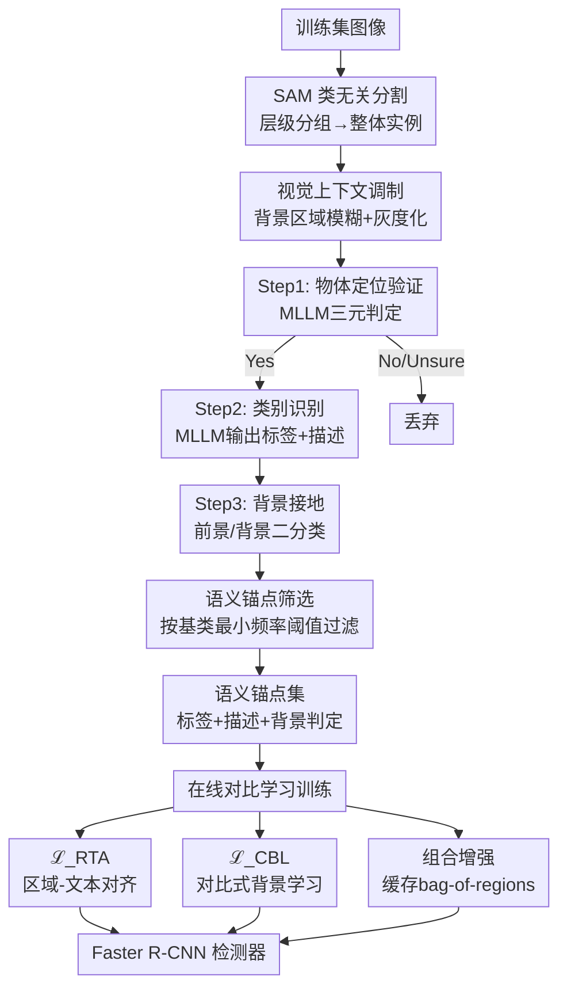

# MSPL: Multi-Step Pseudo-Labeling for Open-Vocabulary Object Detection

**会议**: ECCV 2026  
**arXiv**: [2510.14792](https://arxiv.org/abs/2510.14792)  
**代码**: 无  
**领域**: 目标检测  
**关键词**: 开放词汇目标检测, 伪标签, 多步推理, 对比学习, MLLM  

## 一句话总结

MSPL 将开放词汇目标检测的伪标签生成从单步 CLIP 图像-文本对齐重构为「定位验证→类别识别→背景接地」三步可解释推理管线，利用 SAM 类无关分割与 MLLM 零样本推理生成高质量伪标签，再通过区域-文本对齐和对比式背景学习两个对比学习信号进行在线训练，在 OV-COCO 和 OV-LVIS 上均达到新 SOTA，新类 AP50 提升 9.4 个点。

## 研究背景与动机

开放词汇目标检测（OVD）的目标是在测试时同时定位已见基类（base）和未见新类（novel）的物体，但训练时只有基类标注可用。为弥合这一监督缺口，近年来伪标签方法成为主流做法——利用 CLIP 等视觉语言模型在新类区域与文本嵌入之间做单步相似度匹配，自动生成伪标注来扩充训练集。这类方法在简单场景下表现不俗，一旦遇到拥挤遮挡等复杂场景就急剧退化。

深入分析可以发现三个根因失效模式。其一是**共现干扰**：单步对齐基于整图级监督训练的 VLM，区域特征天然编码了周边上下文统计，一个部分被遮挡的脚被误标为"滑板"，仅仅因为画面中滑板与该区域强共现。其二是**标题依赖**：单步匹配需要预定义的候选类别集，通常从图像标题中提取；任何未出现在标题中的物体（以及被粗粒度描述淹没的物体）在设计上就无法被发现。其三是**背景坍塌**：识别遮挡物体需要先识别遮挡物再推断被挡物体，单步对齐跳过这一分解，未被分配的物体区域直接被当背景学掉。这三个问题共享同一根源——单步对齐将整个场景压缩成一个推理单元，不给解耦共现、发现未指定类别或推理遮挡留出空间。

本文的核心洞察是：既然复杂视觉理解天然需要多步推理，为什么伪标签生成不能也分步走？作者提出将伪标签生成重构为一个可解释的三步视觉提示过程——先验证区域是否真有物体，再零样本指定类别并生成自然语言描述，最后显式判断该区域属于前景还是背景——每一步的输出都作为后续在线训练的丰富监督信号。**核心 idea：用「定位验证→类别识别→背景接地」三步递进推理取代单步 CLIP 对齐来生成 OVD 伪标签，每人造步不仅产出最终标签，还产出中间推理状态（区域描述、背景判定）做对比学习监督，从而在高遮挡高拥挤场景下实现高质量伪标注。**

## 方法详解

MSPL 是一个离线生成伪标签、在线对比学习训练的框架。离线阶段用 SAM 生成类无关区域提议，经过视觉上下文调制后喂给 MLLM 执行三步推理，最后用频率阈值筛选语义锚点。在线阶段将这些伪标签和中间状态打包成对比学习损失，训练 Faster R-CNN 检测器。离线多步推理将复杂的视觉计算负担放在训练前完成，在线阶段只需轻量的对比学习，不存在反复的在线自训练开销。

### 整体框架

整个框架分为离线伪标签生成和在线训练两阶段。离线阶段输入训练集图像，经 SAM 分割出候选区域后，用三步 MLLM 推理依次做物体验证、零样本标签分配和背景判定，最后按基类统计频率过滤得到语义锚点集。在线阶段将语义锚点作为正样本，结合 MLLM 在第二步生成的区域描述做区域-文本对齐（RTA），同时将第三步识别出的背景概念作为负样本做对比式背景学习（CBL），此外还通过缓存锚点做组合增强替换基线 BARON 的在线采样以加速训练。推理时丢弃伪标签，仅用基类加上 CLIP 文本嵌入做分类。

### 关键设计

**1. 三步递进推理：将伪标签生成分解为可解释的逐步认知**

单步 CLIP 对齐的根本问题在于将场景理解压进一次匹配，而 MSPL 将这一过程拆成三个独立的认知步骤，每一步都有明确的推理目标和中间输出。第一步（定位验证）收到 SAM 的类无关掩码后，并不直接做语义分类，而是先问 MLLM「这个区域内有没有物体？」返回 Yes/No/Unsure 三元判定。这层硬门控确保后续步骤只在真正包含物体的区域上做语义推理，避免了 SAM 产生的半实例碎片（如局部部件、阴影）被错误赋予标签。第二步（类别识别）抛弃了传统方法依赖图像标题定义的候选词表，直接让 MLLM 零样本预测类别名并生成一段自然语言描述（例如"a brown and white dog with long, wavy ears sitting"），从而发现任何画面中出现的物体，不受预设词表限制。第三步（背景接地）对前两步未能置信的预测做二次判定，用 MLLM 判断该预测是前景物体还是背景概念（如"草地""天空"），显式防止未标注物体被吸收进背景嵌入。三步之间形成清晰的认知梯度：从"有东西吗"到"是什么"再到"是前景还是背景"，每一步的输出（三元判定、标签+描述、前景/背景标记）都作为在线训练的额外监督。

**2. 区域-文本对齐（RTA）：用描述性语言增强对比学习信号**

仅靠类别名做对比学习容易在细粒度相似的类别间混淆（如红色"苹果"和红色"球"）。MLLM 在第二步生成的区域描述弥补了这一粒度缺陷：描述不仅包含类别名，还包含了颜色、纹理、姿态、部分关系等属性信息。RTA 将伪标签区域的特征（伪词嵌入）与对应的描述文本嵌入做 InfoNCE 对比对齐。具体地，对 IoU 大于 0.7 的候选区域，在同一批次内将当前区域的伪词嵌入与它的描述嵌入构成正对，与其他区域的描述嵌入构成负对：

$$\mathcal{L}_{\text{RTA}} = -\frac{1}{|\mathcal{S}|} \sum_{k \in \mathcal{S}} \log \frac{\exp(\tau \cdot \langle f_t^k, f_d^k \rangle)}{\sum_{l \in \mathcal{S}} \exp(\tau \cdot \langle f_t^k, f_d^l \rangle)}$$

其中 $f_t^k$ 是第 $k$ 个区域的伪词文本嵌入，$f_d^k$ 是对应描述嵌入，$\tau$ 是温度系数。这个损失直接鼓励区域视觉特征与其多维属性描述在 CLIP 嵌入空间中靠近，迫使模型学到更丰富的判别维度，而不是仅记住一个类别名。

**3. 对比式背景学习（CBL）：显式分离前景与背景嵌入**

背景坍塌的本质是未被标注的物体区域在特征空间中不知不觉地被推向了背景表征。传统方法将背景学成一个统一的"不感兴趣"嵌入，遮挡的物体就此消失。MSPL 在第三步识别出的背景概念（如 sky、water surface、vegetation、paved ground、plain wall）上做文章：把这些背景概念的 CLIP 文本嵌入取平均，初始化一个可学习背景先验 $f_{bg}$，然后在训练中让每个 bag-of-regions 的文本-视觉对齐不仅要拉近正对、推开其他负对，还要推开背景嵌入。这样就为"背景"建立了一个有结构的、可辨识的特征簇，而非一个将所有非目标吞噬的垃圾桶。CBL 损失基于双向 InfoNCE，在对比池中显式加入背景负样本，迫使前景物体特征远离背景簇，从而恢复出原本会被背景覆盖的物体特征。实测表明 CBL 能有效解决遮挡场景中目标被背景吞噬的问题。

### 损失函数 / 训练策略

在线阶段的总体损失由三部分构成：原始 Faster R-CNN 回归与分类损失、RTA 区域-文本对齐损失和 CBL 对比式背景学习损失。骨干网络用 SOCO 预训练的 ResNet-50 FPN（大模型实验用 ResNet-50×4 FPN），同步批归一化。OV-COCO 用 1× 训练计划（9 万迭代）、OV-LVIS 用 2× 训练计划（18 万迭代），学习率分别为 0.04 和 0.08，batch size 均为 16。三个温度参数 $\tau=0.2$、$\tau'=0.05$、$\tau''=0.1$。组合增强方面，MSPL 用缓存好的语义锚点做 bag-of-regions 分组，取代 BARON 的在线邻居采样，加速了 1.5 倍训练。

## 实验关键数据

### 主实验

在 OV-COCO 上，MSPL 以 ResNet-50 骨干和伪标注监督取得了 43.4 AP50_N，显著超过同类伪标签方法（LP-OVOD 40.5、SAS-Det 37.4）。当骨干扩大到 ResNet-50×4 时更是达到 47.8 AP50_N，超越此前最佳方法 OV-DQUO（45.6）。

| 方法 | 骨干 | 新类 AP50_N | 基类 AP50_B |
|------|------|-------------|-------------|
| ViLD-ens | RN50 | 27.6 | 51.3 |
| BARON | RN50 | 34.0 | 60.4 |
| LP-OVOD | RN50 | 40.5 | 60.5 |
| **MSPL** | RN50 | **43.4** | 58.9 |
| CLIP-Self | ViT-L/14 | 44.3 | - |
| **MSPL** | RN50×4 | **47.8** | 60.9 |

在 OV-LVIS（337 个新类长尾）上，MSPL 的检测 APr 达 26.4、分割 APr 达 24.8，分别比此前最佳 CAKE 高 1.4 和 0.9。

| 方法 | 检测 APr | 检测 AP | 分割 APr | 分割 AP |
|------|----------|---------|----------|---------|
| BARON | 23.2 | 29.5 | 22.6 | 27.6 |
| LBP | 24.1 | 29.9 | 23.7 | 28.0 |
| CAKE | 25.0 | 34.9 | 23.9 | 28.7 |
| **MSPL** | **26.4** | **34.9** | **24.8** | **28.6** |

零样本跨数据集迁移方面，在 OV-LVIS 上训练的 MSPL 直接在 MS-COCO 和 Objects365 上测试也全面超越此前方法。

### 消融实验

| 配置 | OV-COCO AP50_N | 说明 |
|------|----------------|------|
| Baseline (BARON) | 34.0 | 无伪标签 |
| + 1-Step PL | 37.6 | SAM+MLLM 单步推理 |
| + 3-Step PL | 41.6 | 三步推理管线 |
| + RTA | 42.5 | 加区域-文本对齐 |
| + CBL | **43.4** | 加对比式背景学习 |

| MLLM 对比 | 骨干大小 | AP50_N |
|-----------|---------|--------|
| BLIP2 | 2.7B | 39.6 |
| InstructBLIP | 7B | 42.6 |
| Qwen2-VL | 7B | **43.4** |

| 上下文化策略 | AP50_N |
|-------------|--------|
| 仅包围框 | 33.2 |
| 黑色蒙版（区域外全黑） | 38.7 |
| 背景模糊+灰度 | **43.4** |

### 关键发现

- **三步推理贡献最大**：三步推理（41.6）对比一步推理（37.6）提升 4.0 个点，远大于 RTA（+0.9）和 CBL（+0.9），说明分解式认知对复杂场景理解是关键贡献。
- **视觉上下文调制至关重要**：什么都不做（仅包围框）只有 33.2，背景模糊+灰度化比直接全黑区域多近 5 个点——适量的上下文保留有助于 MLLM 做推理，完全的上下文丢失反而导致幻觉。
- **MLLM 能力与性能正相关**：从 2.7B 的 BLIP2 到 7B 的 Qwen2-VL，AP50_N 从 39.6 提升到 43.4，且在同规模下不同架构差异不大。
- **MIN 频率阈值最优**：使用基类的最小标注频率做过滤阈值（而非平均值或中位数）效果最好，说明长尾低频伪标签噪声很大，需要严格门控。

## 亮点与洞察

- **"认知分解"而非"模型堆叠"**：MSPL 最有启发的地方在于它不是简单地"SAM 出候选框 + MLLM 打标签"，而是在两者之间插入了精心设计的结构——三步推理、三元验证、视觉上下文调制——让两个基础模型协同而不是互扰。这种以推理结构为中心的思路比单纯增大模型更值得借鉴。
- **中间状态即监督**：MLLM 生成的三元判定信号、"不确定"标注、以及自然语言描述都被当作额外监督信号使用，而不仅仅是丢弃。这意味着伪标签生成管线中的每个"副产品"都有潜在的教学价值。
- **背景概念的分解式建模**：CBL 最大的洞见是把"背景"从单一嵌入分解为 5 个有语义的类别（天空/水面/植被/铺地/墙面），然后用它们做负样本。这让背景有了结构性，而不是一个无差别垃圾桶。

## 局限与展望

- **对 MLLM 能力的天生依赖**：MSPL 的性能直接受限于底层 MLLM 的推理质量。作者推荐至少 7B 参数，但对长尾极细粒度物体和抽象概念的识别仍不稳定，比如 MLLM 会过度依赖形状而忽视颜色（把"刀"形物体全判为刀），且对专有名词（"埃菲尔铁塔" vs "建筑"）无法正确泛化。
- **"不确定"响应的浪费**：当前策略对 "Unsure" 响应全部丢弃以保安全性，但这些响应可能蕴含着长尾类别信号。未来可以探索将低置信预测以软标签形式引入训练。
- **单帧局限**：目前只在静态图像上工作，但遮挡消除和物体持久度追踪天然需要时序信息。作者展望了增加到第四步时间推理来扩展至视频检测的路径。

## 相关工作与启发

- **vs VL-PLM / SAS-Det / PB-OVD**：这些方法都用单步 CLIP 匹配生成伪标签，依赖图像标题定义候选集；MSPL 用 MLLM 做零样本分配，不依赖标题且能处理遮挡拥挤。优势在复杂场景 AP50_N 领先 10+ 个点。
- **vs BARON**：MSPL 以 BARON 为基线，用缓存语义锚点替换了 BARON 的在线邻居采样，训练加速 1.5 倍。更重要的是增加了离线伪标签生成管线，在高遮挡场景下表现远超 BARON。
- **vs CLIP-Self / DeCo-DETR**：这些是蒸馏/自训练方法，仅使用 CLIP 知识和基类标注。MSPL 通过额外伪标注取得了 2.1-6.2 AP50_N 的领先，证明伪标签路线的价值，但也付出了标注生成的计算代价。

## 评分

- 新颖性: ⭐⭐⭐⭐☆ 将多步视觉推理引入 OVD 伪标签生成，三步分解+背景接地的设计直观有效，但各组件（SAM、MLLM、对比学习）均为成熟工具，创新更多在结构层面的组装和中间状态的利用。
- 实验充分度: ⭐⭐⭐⭐⭐ 在两个基准（OV-COCO、OV-LVIS）上的 SOTA 主实验，加上跨数据集零样本迁移、MLLM 变体、上下文化策略、语义锚点策略等多方向消融，非常全面。
- 写作质量: ⭐⭐⭐⭐☆ 论述清晰，特别是图 3 对三个失效模式的可视化直观有力，但对背景坍塌和 RTA 的损失函数解释在正文中可更直接。
- 价值: ⭐⭐⭐⭐⭐ OVD 伪标签方向长期被单步方法主导，MSPL 展示了"用推理结构换质量"的正确方向，对工业界的高遮挡高拥挤场景检测有直接促进作用。

<!-- RELATED:START -->

## 相关论文

- [\[CVPR 2026\] NoOVD: Novel Category Discovery and Embedding for Open-Vocabulary Object Detection](../../CVPR2026/object_detection/noovd_novel_category_discovery_and_embedding_for_open-vocabulary_object_detectio.md)
- [\[CVPR 2026\] Parameter-Efficient Semantic Augmentation for Enhancing Open-Vocabulary Object Detection](../../CVPR2026/object_detection/parameter-efficient_semantic_augmentation_for_enhancing_open-vocabulary_object_d.md)
- [\[CVPR 2026\] WeDetect: Fast Open-Vocabulary Object Detection as Retrieval](../../CVPR2026/object_detection/wedetect_fast_open-vocabulary_object_detection_as_retrieval.md)
- [\[ICLR 2026\] OVID: Open-Vocabulary Intrusion Detection](../../ICLR2026/object_detection/ovid_open-vocabulary_intrusion_detection.md)
- [\[ECCV 2026\] M4-SAR: A Multi-Resolution, Multi-Polarization, Multi-Scene, Multi-Source Dataset and Benchmark for optical-SAR Object Detection](m4-sar_a_multi-resolution_multi-polarization_multi-scene_multi-source_dataset_an.md)

<!-- RELATED:END -->
