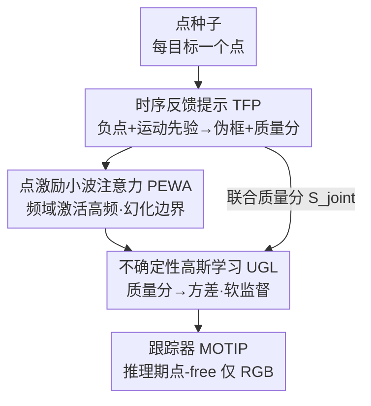

# PS-MOT: Cultivating Instance Awareness from Point Seeds for Multi-Object Tracking

**会议**: ECCV 2026  
**arXiv**: [2606.30476](https://arxiv.org/abs/2606.30476)  ⚠️ 疑似占位/未来日期（2026-06），以原文为准  
**代码**: [https://github.com/xifen523/PS-MOT](https://github.com/xifen523/PS-MOT)  
**领域**: 多目标跟踪 / 弱监督 / 点监督 / 目标检测  
**关键词**: 点监督跟踪, 伪标签演化, 小波频域, 不确定性建模, SAM

## 一句话总结
把多目标跟踪的每帧密集框标注换成"每个目标一个点"的点标注，用 SAM 闭环 + 频域边界幻化 + 不确定性高斯损失三层设计，把无尺度的点种子逐步"养成"尺度准确、身份连续的实例表示，在 DanceTrack 上以纯点监督拿到 52.3 HOTA、标注成本约省 64%。

## 研究背景与动机
多目标跟踪（MOT）长期依赖逐帧、逐目标的密集边界框标注。当前主流的 Tracking-by-Detection（如 ByteTrack、OC-SORT）和 query-based Transformer（如 MOTR、MOTIP）在标准 benchmark 上精度很高，但代价是先要有海量精确框：一个框的标注既要目标边界和相机视角精确对齐，又要跨帧维持身份一致和轨迹连续，人工成本随规模爆炸。更麻烦的是在具身机器人、全景/鱼眼这类严重几何畸变的场景里，刚性的轴对齐框根本没法忠实描述真实几何结构，"精确框"本身就是模糊甚至病态定义的。这把 MOT 研究牢牢锁死在少数被精心标注的数据域里，规模化无从谈起。

一个自然的想法是退到更廉价的监督信号——点。论文给出的成本对比是每个点约 0.7–0.9 秒、每个框约 7–10 秒，而且点作为拓扑中心天然抗透视畸变。但"点监督 MOT"（本文命名的 PS-MOT）会撞上一个绕不开的**精度-歧义悖论**：一个无尺度的点在位置上是确定的，在尺度和边界上却完全欠定。这种空间歧义在时序建模里会引爆两个具体问题——**空间泄漏**（模型缺少边界约束和对物理占据的理解，监督信号在拥挤场景里渗进背景或相邻目标，判别力被稀释）和**身份漂移**（尺度靠模型隐式猜，跨帧关联不稳，抖动和 ID-switch 频发）。已有的点监督工作（如 P2BNet、Point2RBox 系列）几乎只在静态检测里逐帧独立估尺度，搬到视频上会直接引入时序抖动和身份不稳。

本文的切入角度是：点确实缺乏显式的空间认知，但**基础模型先验（SAM）和时序动力学的协同，可以在一个概率空间里把缺失的尺度表示"补"回来**，让一个纯拓扑中心逐步演化成精确且身份一致的实例。**核心 idea：把点到实例的过程拆到数据、模型、损失三个层级做由粗到细的实例演化——数据层用时序反馈把点养成伪框，模型层在小波频域用点激活高频"幻化"出边界，损失层用不确定性高斯建模动态调节每个伪标签的监督强度。**

## 方法详解

### 整体框架
PS-Track 是一个统一框架，围绕一条"演化—感知—适应"（Evolution-Perception-Adaptation）的主线，把稀疏点监督逐步逼近密集像素级理解。输入是每个目标一个点的稀疏标注（实验中由 GT 框中心自动合成，不做任何人工精修），输出是尺度准确、身份连续的跟踪轨迹。整个 pipeline 是训练期的三层协同：

- **数据层（TFP，演化）**：不把点当静态锚点，而是和 SAM 做闭环交互，把静态点标注变成时序一致的伪框。关键是引入负空间线索把紧挨的目标分开、用运动引导的框约束抑制分割碎片，并给每个伪框打一个联合质量分。
- **模型层（PEWA，感知）**：网络内部表示也要适配点监督的稀疏性。用离散小波变换把特征拆成低频（全局语义）和高频（局部边界），让标注点充当"频率激励器"，只点亮目标附近的高频系数，从而在稀疏信号下"幻化"出锐利边界——且推理时整块旁路掉。
- **损失层（UGL，适应）**：承认伪标签本身带噪，把回归从确定性改成概率式。把伪框建模成高斯观测，用数据层传下来的联合质量分反推方差，自动给不可靠样本降权。

三层之间有一条贯穿的信息流：TFP 产出的**联合质量分**不仅在数据层用来软标注，还一路传到损失层决定每个样本的方差（监督强度），把"数据到损失"串成闭环。

### 关键设计

**1. 时序反馈提示 TFP：让 SAM 把静态点养成时序一致的伪框**

点监督学得好不好，几乎全看伪标签质量。直接拿 SAM 在跟踪场景里生成伪框会踩两个坑：**身份合并**（一个 mask 错误地圈进多个拥挤目标）和**语义碎片**（遮挡下只分割出一条肢体这种判别性局部）。TFP 用两条空间-时序约束治这两个病。一是**负线索做空间消歧**：对目标 $i$，把它空间近邻（当前帧同时存在、且中心距离小于阈值 $\tau_{dist}$ 的轨迹）的中心点采样成一组负提示 $\mathcal{P}_i^-$，连同正点一起喂给 SAM。这相当于给分割立起一道"语义防火墙"，逼模型拒绝相邻身份的特征，直接化解身份合并。二是**运动先验做时序正则**：每条 tracklet 用卡尔曼滤波维护运动状态，分割前把状态投影到当前帧得到运动先验框 $B_{t|t-1}$，作为 box 提示一并输入 SAM，把分割搜索空间收窄、压掉离群区域、保证 mask 的尺度一致，从而抑制碎片、减少漂移。

TFP 的第三件事是**不再把所有伪标签当 ground truth**，而是给每个伪框 $B_{pseudo}$ 打一个联合质量分，量化其可靠度：

$$S_{joint} = S_{sam}\cdot(\alpha\cdot\text{IoU}(B_{pseudo}, B_{t|t-1}) + \beta)$$

其中 $S_{sam}$ 是 SAM 自带的视觉置信度，IoU 项衡量视觉分割和物理运动先验的一致性，$\alpha,\beta$ 控制时序一致性的贡献与基线偏移。这个分数被保留下来传给损失层做动态降权——视觉和运动都靠谱的框分高、权重大，可疑的框分低、被容忍。（注：论文引用 [8] 把这里的可提示分割模型标为 "SAM 3"，即 SAM3，附录消融也对比了 SAM-v1/v2/v3，⚠️ 具体版本以原文为准。）

**2. 点激励小波注意力 PEWA：用点在频域点亮高频，从稀疏信号幻化边界**

数据层把点变成了框，但网络内部表示还得能从一个点推出"形状"。这就是**位置-边界失配**：点告诉你目标在哪，卷积核却很难在没有显式边界监督时推出它是什么形状；标准 CNN 受限于局部感受野和空间池化，从稀疏点重建锐利边界尤其吃力。PEWA 借鉴人类视觉的自上而下机制（高层抽象引导低层细节感知），把标注点当成训练期的"频率激励器"，在小波域里把边界"幻化"出来。做法是先用单级 Haar 小波变换把特征图拆成低频近似（对应全局语义，保留身份一致性）和三个高频子带 LH/HL/HH（对应边缘纹理）。问题在于无监督时高频被背景杂波主导，于是 PEWA 用**掩码频率调制**去噪增信：以标注点为中心生成一张空间高斯热图表征潜在目标范围，下采样到小波域分辨率后过一个轻量调制器 $\phi$、经 Sigmoid 得到频率激励掩码 $M_{exc}$，再逐元素乘到三个高频子带上：

$$\hat{X}_{HF}^{k} = X_{HF}^{k}\odot M_{exc}, \quad k\in\{LH, HL, HH\}$$

这一步等于强加了一个先验——只有标注点邻域内、局部语义区域里的边界才算数。低频分量不调制以保全局身份一致，最后经逆小波变换（IDWT）把调制后的高频和全局上下文重组、再加回残差得到细化特征。相比传统上采样层，这套频域重建更省参数。关键的工程点是：PEWA **只在训练期插在 backbone 之后**用来"逼"网络学出对边界敏感的特征响应，**推理时整块旁路**——模型只吃 RGB 帧，不碰任何点，彻底杜绝标签泄漏。附录还有个反直觉发现：本以为训练时随机激活 PEWA（结构 dropout, 概率 $p$）能弥合"训练有、推理无"的结构差，实测反而因为特征表示不一致（高频边界被反复重构又撤销，造成特征抖动、干扰下游 Transformer 学稳定的身份 embedding）而掉点；恒定激活 $p{=}1.0$ 最优（44.2 HOTA / 30.4 AssA）。

**3. 不确定性高斯学习 UGL：把伪框当高斯观测，按质量分动态调监督强度**

伪标签天然带噪，而标准 MOT 目标（L1、GIoU）隐含假设 ground truth 是狄拉克分布（零不确定性），硬套到演化出来的伪框上会逼网络过拟合 SAM 分割误差和遮挡漂移的噪声。UGL 把监督范式从确定性回归换成概率式的似然最大化：把每个伪框建模成一个以真实均值为中心、方差 $\sigma^2$ 表征观测噪声的高斯观测。核心的一笔是把方差和数据层的联合质量分挂钩——时序一致、视觉可信的轨迹应当方差小（精度高），于是 $\sigma_i = 1/(S_{joint,i}+\epsilon)$。据此写出不确定性引导的回归损失（高斯负对数似然）：

$$\mathcal{L}_{reg} = \frac{1}{N}\sum_{i=1}^{N}\left(\frac{1}{2\sigma_i^2}\|B_{pred,i} - B_{pseudo,i}\|_2^2 + \frac{1}{2}\log\sigma_i^2\right)$$

这个式子有很干净的物理解读：第一项是**动态重加权**——可靠样本（$S_{joint}$ 高、$\sigma$ 小）拿到大权重 $\frac{1}{2\sigma^2}$ 逼它精确定位，不可靠样本（如遮挡目标）权重衰减、允许模型容忍潜在标注错误；第二项 $\frac{1}{2}\log\sigma^2$ 因为 $\sigma_i$ 是由质量分确定性推出的，起的是概率校准作用，在伪标签质量参差的 batch 间保持绝对似然尺度，让目标函数不退化成一个纯相对的加权回归。总目标再加上分类损失和身份预测损失（$\mathcal{L}_{id}$ 沿用 MOTIP，由生成的身份标签监督）：$\mathcal{L}_{total} = \lambda_{reg}\mathcal{L}_{reg} + \lambda_{cls}\mathcal{L}_{cls} + \lambda_{id}\mathcal{L}_{id}$。凭这套，PS-Track 不需要人工清洗标签就能适配点监督数据的噪声分布。

### 损失函数 / 训练策略
PS-Track 建在 MOTIP 之上，用 Deformable DETR + ImageNet 预训练 ResNet-50，300 个 object query。单卡 RTX 5090、每 batch 30 帧视频片段，AdamW 训练 10 epoch，基础学习率 $1\times10^{-4}$、backbone 缩到 $1\times10^{-5}$，第 6、9 epoch 衰减。点标注由各数据集 GT 框中心自动合成（无人工精修），刻意保留"框中心可能落到目标外或邻近目标"的噪声来模拟真实草率点击。相比 MOTIP 只增中等开销：训练显存 23.7→24.2 GB、每 epoch 7.4→8.0 h、参数 59.1M→61.9M（含训练期 PEWA 分支）；推理因 SAM/PEWA 均旁路，FLOPs 不变、FPS 几乎不变（29.82→29.48）。

## 实验关键数据

### 主实验
四个 benchmark：DanceTrack、SportsMOT（剧烈非线性运动 + 均匀外观）、JRDB、EmboTrack（具身全景、极端自我运动、密集人群）。指标用 HOTA/DetA/AssA + MOTA/IDF1，全景数据集额外报 OSPA。作为纯点监督方法，PS-Track 的核心看点不是超越全监督 SOTA，而是**在只用点标注的前提下逼近甚至反超部分经典全监督方法**。

| 数据集 | 指标 | PS-Track（点监督） | 对比基准 | 说明 |
|--------|------|------|----------|------|
| DanceTrack test | HOTA | 52.3 | CenterTrack 41.8 / FairMOT 39.7（全监督） | 反超经典全监督 +10.5 / +12.6，落后全监督 SOTA MOTIP(69.6) |
| DanceTrack test | IDF1 | 53.4 | — | 纯点监督下身份一致性可用 |
| SportsMOT test | HOTA | 45.2 | ByteTrack 62.1（全监督 w/o extra） | 建立点监督 baseline，对快速姿态形变鲁棒 |
| JRDB test | HOTA | 20.72 | TrackFormer 19.16 / DiffMOT 19.96（全监督） | 全景密集人群下反超两个全监督方法 |
| EmboTrack QuadTrack | HOTA / IDF1 | 33.9 / 38.6 | ByteTrack 20.7 / OC-SORT 20.8（全监督） | 具身自我运动下大幅领先，验证 TFP 负线索防火墙 |

跨范式通用性（DanceTrack val，Tab.7）是另一大卖点：把核心模块插进三种主流架构，全监督基线都能在纯点监督下运转——BYTE+PS-Track 42.9 HOTA（仅落后全监督 BYTE 4.2）、MOTIP+PS-Track 50.3、AR-MOT+PS-Track 36.9。说明该框架像"通用催化剂"，能给已有 MOT 范式解锁点监督能力。

### 消融实验
DanceTrack val，10-epoch 完整调度下逐模块叠加（Tab.6a）：

| 配置 | HOTA | AssA | 说明 |
|------|------|------|------|
| ① 朴素点转框 baseline | 30.3 | 20.4 | 无时序/无不确定性约束，表现很差 |
| ② +TFP | 49.0 | 37.1 | +18.7 HOTA，运动先验+负线索化解身份合并/碎片，贡献最大 |
| ③ +TFP +UGL | 49.4 | 38.0 | 自适应降权残余伪标签噪声 |
| ④ Full（+PEWA） | 50.3 | 39.1 | PEWA 在频域幻化边界，为关联提供更高质量 embedding |

另有必要性消融（Tab.5）最能说明问题：把点监督检测器 Point2RBox-v3 直接接现成关联器（解耦 TBD）会灾难性失败（10.8 HOTA、MOTA < −28），因为孤立检测器解不了尺度歧义、框烂到任何关联器都救不回来；而用 PS-Track 范式训一个 YOLOX 检测器 + BYTE 关联直接到 42.9 HOTA（+32.1），证明"感知与时序演化必须统一"才是点监督跟踪 work 的关键。

### 关键发现
- **TFP 是绝对主力**：单加 TFP 就把 HOTA 从 30.3 拉到 49.0（+18.7），PEWA 和 UGL 各再补约 1 点。这符合直觉——点监督最致命的是伪标签质量，TFP 直接治身份合并和碎片这两个根源。
- **对点击噪声异常鲁棒**：给训练点注入高斯扰动，16px 下 HOTA 仅从 44.2 微降到 44.1、32px 仍有 42.8，48px 才明显掉到 39.8。TFP+PEWA 用运动先验和频域幻化把不精确点击锚回真实语义边界、UGL 再降权残余误差，三者协同撑起鲁棒性。
- **基础模型质量直接决定上限**：TFP 里换 SAM backbone，SAM-v1/v2/v3 对应 20.7/39.0/50.3 HOTA，越强的可提示分割器伪标签越可靠、跟踪越好；且这些 SAM 只在离线生成伪标签时用，不进推理。
- **超参不敏感、收敛平滑**：$\lambda_{reg}$ 在 1–5 间波动，峰值 44.8（$\lambda_{reg}{=}3$）；HOTA 从 epoch 2 的 44.2 平滑升到 epoch 10 的 50.3，无后期退化，说明不确定性框架有效抵抗弱监督的噪声记忆。

## 亮点与洞察
- **把"点监督 MOT"正式立为一个范式**，并给出 data/model/loss 三层协同的完整解法——不是某个模块的小改，而是把稀疏监督和密集感知之间的鸿沟系统性拆成三步跨越，思路清晰、可迁移。
- **训练期"频率激励器"是个巧劲**：点本身信息稀薄，但把它当作在小波高频域点亮目标边界的"生物聚光灯"，训练时逼特征学边界、推理时整块旁路不留痕，既涨点又零推理开销、零标签泄漏。这套"训练用强先验、推理时撤掉"的模式可迁移到很多弱监督场景。
- **联合质量分一分两用**：同一个 $S_{joint}$ 既在数据层做软标注，又作为方差的倒数在损失层做动态降权，把"数据可靠度"这一信号从生成端一路贯穿到优化端，比各自拍脑袋设权重优雅得多。
- **反直觉的负结果也有价值**：训练随机激活 PEWA（结构 dropout）本以为能弥合训练-推理结构差，实测反而因特征抖动掉点——恒定的确定性结构先验比刻意模仿推理态更利于学稳定身份 embedding。

## 局限与展望
- **极端遮挡/肢体缠绕仍会崩**：单点可能落到目标交界的歧义位置，导致 SAM 生成过分割或碎片伪标签（如密集摔跤、群舞队形），TFP 的负线索也救不回来。
- **极端运动模糊下 PEWA 失效**：高频边缘特征被物理性破坏，没有显式尺度先验就难以推出完整物理范围。
- **标注效率是"受控估计"而非端到端实测**：点标签是由 GT 框中心合成的，比真实人工点击更干净，且没测真实点击时间；TFP 还引入了额外的离线 SAM 伪标签生成成本。所谓省约 64% 应理解为"减少的框标注工作量的受控估计"。作者也强调 MOT 仍需时序身份链接，点监督并不能消除这部分负担。
- **未来方向**：多模态提示（点 + 粗语言描述）解语义歧义；时序稀疏标注（如每 5 帧给一次点）+ 无监督运动传播进一步压缩标注；以及把这套拓扑中心思路搬到 3D MOT（LiDAR/BEV）解锁自动驾驶级别的规模。

## 相关工作与启发
- **vs P2BNet / Point2RBox 系列（静态点监督检测）**：它们用 MIL 或由粗到细回归从点幻化框，但逐帧独立估尺度、忽视时序连续性，搬到视频会引入抖动和身份不稳。本文把"点到 mask"重构成轨迹感知过程、用运动先验强制时空一致，是点监督从检测走向跟踪的必要演化。消融里 Point2RBox-v3 直接接关联器灾难性失败正是这一点的实证。
- **vs MOTIP（全监督 query-based SOTA）**：本文直接建在 MOTIP 上，把它从全监督改造成点监督。MOTIP DanceTrack 69.6 HOTA，PS-Track 52.3——差距存在，但换来的是标注成本量级下降，且在 JRDB/EmboTrack 这类"框本身难定义"的场景反而更实用。
- **vs 无监督/半监督/弱监督跟踪**：无监督/半监督常受遮挡困扰或重度依赖初始种子质量，弱监督仍靠框先验估尺度；本文完全不需要任何密集框标注，把焦点从绝对空间精度转到时序身份一致性。
- **vs WaveFormer（频域视觉建模）**：WaveFormer 做通用频率解耦，本文专门利用 DWT 隔离高频、并用点做激励来重建边界，目标更聚焦在"从稀疏点幻化边界"。

## 评分
- 新颖性: ⭐⭐⭐⭐⭐ 正式提出并系统求解 PS-MOT 新范式，三层设计各有巧思，点当频率激励器尤其新。
- 实验充分度: ⭐⭐⭐⭐☆ 四 benchmark + 跨三范式 + 丰富消融/噪声/收敛/SAM 变体分析很扎实；扣分在点标签由框中心合成、未做真实人工点击成本研究。
- 写作质量: ⭐⭐⭐⭐☆ 逻辑主线（演化-感知-适应）清晰、动机具体；个别术语（如引用把 SAM 版本标注）稍易混淆。
- 价值: ⭐⭐⭐⭐⭐ 把 MOT 从密集框标注的规模瓶颈里解放出来，尤其利于全景/具身这类框难定义的场景，实用潜力大。

<!-- RELATED:START -->

## 相关论文

- [\[AAAI 2026\] AerialMind: Towards Referring Multi-Object Tracking in UAV Scenarios](../../AAAI2026/object_detection/aerialmind_towards_referring_multi-object_tracking_in_uav_sc.md)
- [\[CVPR 2026\] From Detection to Association: Learning Discriminative Object Embeddings for Multi-Object Tracking](../../CVPR2026/object_detection/from_detection_to_association_learning_discriminative_object_embeddings_for_mult.md)
- [\[CVPR 2026\] GMT: Effective Global Framework for Multi-Camera Multi-Target Tracking](../../CVPR2026/object_detection/gmt_effective_global_framework_for_multi-camera_multi-target_tracking.md)
- [\[ECCV 2024\] TAPTR: Tracking Any Point with Transformers as Detection](../../ECCV2024/object_detection/taptr_tracking_any_point_with_transformers_as_detection.md)
- [\[ECCV 2026\] M4-SAR: A Multi-Resolution, Multi-Polarization, Multi-Scene, Multi-Source Dataset and Benchmark for optical-SAR Object Detection](m4-sar_a_multi-resolution_multi-polarization_multi-scene_multi-source_dataset_an.md)

<!-- RELATED:END -->
