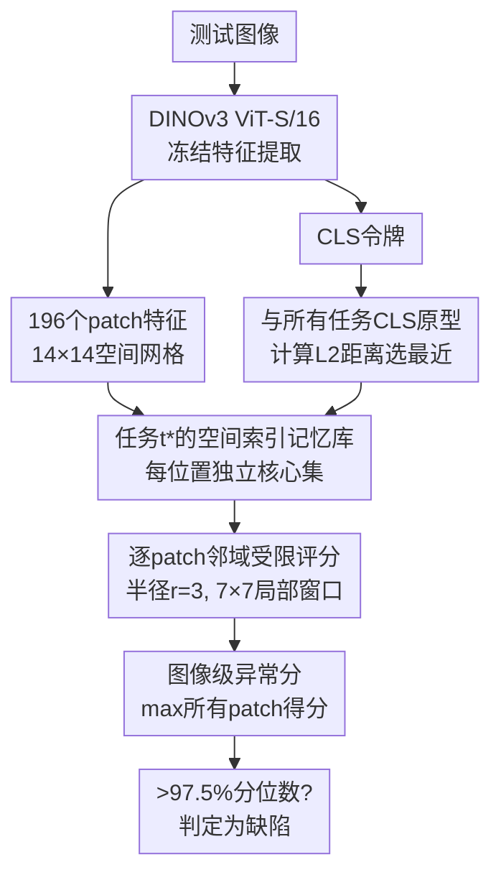

# Rethinking Continual Anomaly Detection on the Edge: Benchmarking Under Realistic Industrial Conditions

**会议**: ECCV 2026  
**arXiv**: [2605.24251](https://arxiv.org/abs/2605.24251)  
**代码**: [https://github.com/Continue-Edge-AI-Lab/Rethinking-Continual-AD](https://github.com/Continue-Edge-AI-Lab/Rethinking-Continual-AD) (有)  
**领域**: 目标检测  
**关键词**: 连续异常检测, 工业缺陷检测, 边缘部署, 核心集选择, DINOv3, 零遗忘

## 一句话总结
本文构建了首个统一基准对现有连续异常检测方法进行头对头比较、连续漂移评估和边缘端效率测试，发现专用CAD方法并不优于带简单经验回放的传统异常检测基线，并由此提出DINOSaur——一种完全冻结DINOv3骨干+空间索引核心集记忆库的无训练方法，在零遗忘前提下以亚100ms边缘推理性达到SOTA。

## 研究背景与动机

工业异常检测（Anomaly Detection, AD）是制造业质检的核心技术，通常以大量正常样本训练模型来识别缺陷品。然而真实生产线并非静态——刀具磨损、光照季节性变化、材料批次差异、工艺参数漂移等因素会持续改变"正常产品外观"的数据分布。当正常分布发生变化时，已部署的AD模型可能漏报真实缺陷或将正常变异常误判为缺陷，两者都造成重大经济损失。连续异常检测（Continual Anomaly Detection, CAD）试图解决这一矛盾：在数据按任务序列到达的约束下，让模型持续适应新分布的同时不遗忘旧知识。目前已出现三篇CAD方法——DNE（ViT嵌入分布的Mahalanobis距离）、IUF（正则化潜空间编码器-解码器）和UCAD（对比学习+SAM纹理分解+知识库），各自提出了复杂的架构设计。

但本文深入审视后发现，现有CAD文献存在三个严重缺口。第一，**未考虑边缘端计算可行性**——工业质检运行在Jetson、树莓派等受限设备上，需要每张图像亚100毫秒级的处理频率；而DNE、IUF、UCAD分别使用了ViT-B/16、6.31亿参数的编码器-解码器、以及SAM这样的视觉基础模型，从未在边缘硬件上基准测试过能否落地。第二，**评估场景不真实且范围窄**——现有基准将每个产品类别作为离散任务（瓶子→电缆），但工业漂移是连续渐变而非类别跳变；同时评估仅限于结构异常（表面缺陷），完全忽略了同样重要的逻辑异常（缺失组件、错误排列）。第三，**缺乏系统比较**——三篇CAD方法各自针对不同基线和实验条件独立报告，从未在统一协议下互相对比过，无从知晓它们的相对优劣，更谈不上评估实际工业部署前景。

本文的第一步是构建一个统一基准，首次在同一协议下对所有现有CAD方法进行头对头比较，并引入连续漂移协议（基于Magnetic Tile Defects数据集，通过渐进增强模拟颜色/模糊/几何三种真实漂移）、逻辑异常评估（MVTec-LOCO）和在Jetson/树莓派上的效率分析。基准结果揭示了一个引人注目的发现：**所有专用CAD方法（DNE、IUF、UCAD）在公平比较下，没有一种能一致性地超越带简单经验回放的传统AD方法（PatchCore）**——复杂架构的投入没有换来性能回报。这直接驱动了DINOSaur的设计。**核心 idea：用一个完全冻结的DINOv3 ViT-S/16（2100万参数，0可训练参数）作为特征提取器，配上按空间位置独立维护的核心集记忆库（每张训练图的196个patch位置各自保留ρ=10%的代表向量），推理时用CLS令牌进行无监督任务路由，在选定的记忆库中对每个测试patch做局部邻域内最近邻异常评分——不更新任何权重，从架构上根本上保证零遗忘，并在Jetson Orin Nano上达到亚100毫秒的推理性。**

## 方法详解

### 整体框架

DINOSaur的设计哲学是"无训练、零遗忘"：既然记忆回放的连续学习机制已经被证明效果最好（对比学习综述[Wang 2024]），而工业边缘存储成本很低，那么一个冻结的强特征提取器+非参数化记忆库就足以胜任。整个系统分为训练和推理两个阶段。

训练阶段极为简单：给定一个新任务的正常图像集，通过冻结的DINOv3 ViT-S/16前向一次，提取每张图像的全局CLS令牌和196个patch级别的特征（14×14空间网格）。对所有训练图像，在每个空间位置独立收集该位置出现的所有特征向量，然后用贪婪核心集选择（greedy coreset selection）保留M个最具有代表性的向量，构成该位置的核心集。这196个位置的核心集组成该任务的"空间索引记忆库"。同时，所有训练图像CLS令牌的均值作为该任务的紧凑原型向量，用于推理时的无监督任务路由。整个过程只需单次前向+核心集选择，不涉及梯度下降。

推理阶段：测试图像经过同一个冻结DINOv3提取特征后，先将其CLS令牌与所有已存储任务的CLS原型计算L2距离，选择最近的原型对应的记忆库。然后，对于patch网格上的每个位置，只在该位置周围半径r=3的局部邻域（7×7窗口）内的核心集向量中查找最近邻，以L2距离作为该patch的异常得分。最终图像级异常得分为所有patch得分的最大值。

### 关键设计

**1. 空间索引核心集记忆库：为每个位置保留正常外观的特征分布**

传统分布类AD方法（如PatchCore）将所有patch特征聚合到一个平坦的记忆库中，丢失了空间位置信息。当一个patch出现在不应该的位置时（逻辑异常），平坦记忆对这类异常的判别能力很弱。DINOSaur改为维持一个空间索引的张量记忆库 $\mathcal{M} \in \mathbb{R}^{\sqrt{N}\times\sqrt{N}\times M\times e}$，其中 $\sqrt{N}\times\sqrt{N}=14\times14$ 是DINOv3特征的空间网格，$M$ 是每个位置保留的核心集大小，$e=384$ 是特征维度。对每个空间位置 $(i,j)$，收集所有训练图像在该位置的特征向量集合 $\mathcal{P}_{i,j}$（共 $D$ 个向量），然后用贪婪最远点采样（greedy farthest-point sampling）逐步挑选与当前核心集距离最远的样本，保证在有限预算下覆盖特征空间的最大范围。每位置的核心集大小 $M=\max(20, \lfloor D\cdot\rho\rfloor)$，$\rho$ 是核心集比率（默认10%）。这种空间索引结构使得后续的邻域受限评分成为可能——一个位置的异常与否，只取决于该位置及其近邻本该出现什么特征，而非全局范围的平均。

**2. 邻域受限异常评分：空间一致性约束下的局部最近邻搜索**

推理时，给定测试图像在位置 $(i,j)$ 的patch特征向量 $\mathbf{p}_{i,j}^{\text{test}}$，不把它与整个记忆库中的所有向量比较，而是只与以 $(i,j)$ 为中心、半径 $r$ 的局部邻域内的核心集向量比较。每个patch的异常得分取该邻域内的最小L2距离，图像级得分取所有patch得分的最大值。这一设计的巧妙之处在于双重效果：空间一致性——异常被检测是因为"这个位置不应该出现这样的特征"而不是"整个图像里没有类似的patch"，这对逻辑异常（如错误排列）尤其重要；计算效率——在默认 $r=3$ 下，每个patch只需比较 $(2r+1)^2 \cdot M = 49M$ 次距离，而全局搜索需要 $196M$ 次，直接减少约4倍计算量。

$$
s_{i,j} = \min_{\mathbf{c} \in \mathcal{N}_{i,j}^{r}} \|\mathbf{p}_{i,j}^{\text{test}} - \mathbf{c}\|_2, \quad S(\mathbf{x}_{\text{test}}) = \max_{(i,j)} s_{i,j}
$$

**3. CLS令牌任务路由：零遗忘的无监督连续学习**

DINOSaur应对连续学习的方式完全不依赖传统的正则化、架构扩展或经验回放。对每个任务 $t$，除了前述的空间索引记忆库，还存储一个紧凑的CLS原型 $\boldsymbol{\mu}^t$——即该任务所有训练图像CLS令牌的均值向量。推理时，测试图像的CLS令牌 $\mathbf{z}^{\text{test}}$ 与所有已存原型计算L2距离选出最近的任务。由于特征提取器 $\Phi$ 被完全冻结（从不更新权重），而每个任务拥有独立且隔离的记忆库，新任务的到达完全不影响旧任务的记忆，**从架构上保证了零灾难性遗忘**——遗忘率（Forgetting Measure, FM）必然为零。同时，因为没有梯度更新，适应一个新任务只需对所有训练图像做一次前向传播+核心集选择，在Jetson Orin Nano上约30秒即可完成，使得边缘设备可自主在产线上适应新的生产条件。

### 损失函数 / 训练策略

DINOSaur完全无需训练（training-free）：没有损失函数、没有优化器、没有反向传播。唯一需要的"适应"操作是：对每个新任务的训练图像做一次DINOv3前向→逐位置收集patch特征→在每个位置运行贪婪核心集选择→保存核心集和CLS原型。超参数仅两个：核心集比率 $\rho$（默认10%，控制存储-精度权衡）和邻域半径 $r$（默认3）。参数敏感性分析显示，$\rho$ 从1%增加到20%时AUROC单调上升但收益递减（10%→20%仅提升1.5%），$r$ 影响较小且一致。

## 实验关键数据

### 主实验

**离散任务协议（MVTec-AD 和 MVTec-LOCO）**：DINOSaur在所有指标上全面领先。

| 方法 | MVTec-AD AUROC | MVTec-AD Recall | MVTec-AD FM↓ | MVTec-LOCO AUROC | MVTec-LOCO Recall | MVTec-LOCO FM↓ |
|------|:---:|:---:|:---:|:---:|:---:|:---:|
| DNE | 0.500 | 0.000 | 0.012 | 0.500 | 0.000 | -0.022 |
| IUF | 0.508 | 0.074 | -0.066 | 0.572 | 0.234 | 0.002 |
| UCAD | 0.798 | 0.552 | 0.000 | 0.629 | 0.389 | 0.000 |
| PatchCore* | 0.925 | 0.804 | 0.023 | 0.743 | 0.521 | 0.038 |
| EfficientAD* | 0.529 | 0.071 | 0.051 | 0.485 | 0.053 | 0.025 |
| **DINOSaur** | **0.968** | **0.991** | **0.000** | **0.768** | **0.845** | **0.000** |

**连续漂移协议（MTD-Color / Blur / Geometric）**：在颜色和模糊漂移下DINOSaur显著领先；几何漂移下所有方法退化为随机水平。

| 方法 | MTD-Color AUROC | MTD-Blur AUROC | MTD-Geo AUROC |
|------|:---:|:---:|:---:|
| DNE | 0.520 | 0.555 | 0.480 |
| IUF | 0.521 | 0.516 | 0.525 |
| UCAD | 0.566 | 0.582 | 0.480 |
| PatchCore* | 0.836 | 0.832 | 0.509 |
| EfficientAD* | 0.565 | 0.566 | 0.510 |
| **DINOSaur** | **0.928** | **0.891** | 0.519 |

**边缘端效率（NVIDIA Jetson Orin Nano）**：DINOSaur是唯一同时满足亚100ms推理性（10.9 FPS）和有意义的检测精度的CAD方案。

| 方法 | 参数量(M) | 推理性(ms) | FPS | 每任务存储(MB) |
|------|:---:|:---:|:---:|:---:|
| DNE | 86.6 | 60.7 | 16.5 | 2.3 |
| IUF | 631.1 | OOM | — | — |
| UCAD | 36.0 | 956.5 | 1.0 | 1.2 |
| PatchCore* | 9.3 | 119.0 | 8.4 | 5.0 |
| EfficientAD* | 8.1 | 34.7 | 28.8 | — |
| **DINOSaur** | 21.6 | **91.6** | 10.9 | 7.1 |

### 消融实验

核心集比率 $\rho$ 与邻域半径 $r$ 的网格搜索（平均五协议AUROC，默认配置 $\rho=10\%, r=3$ 加粗）：

| $\rho$ | $r=0$ | $r=1$ | $r=2$ | $r=3$ | $r=4$ |
|:---:|:---:|:---:|:---:|:---:|:---:|
| 1% | 0.771 | 0.773 | 0.773 | 0.780 | 0.778 |
| 2.5% | 0.765 | 0.770 | 0.775 | 0.776 | 0.782 |
| 5% | 0.771 | 0.775 | 0.777 | 0.781 | 0.785 |
| **10%** | **0.787** | **0.790** | **0.794** | **0.801** | **0.798** |
| 20% | 0.803 | 0.816 | 0.819 | 0.816 | 0.822 |

### 关键发现

- **零遗忘的构造性保证**：DINOSaur在所有协议上的Forgetting Measure均为0（或近乎0），这是由"冻结骨干+独立记忆库"的架构直接保证的，而非通过正则化技巧。相比之下，使用经验回放的PatchCore虽然性能好，但仍有0.023（MVTec-AD）~0.038（MVTec-LOCO）的遗忘率。
- **几何漂移是公开难题**：所有方法在几何漂移下均退化为随机水平（AUROC~0.5），因为几何变换从根本上改变了patch特征之间的空间关系。这说明当前冻结表示对几何形变存在根本性的盲区，需要几何等变特征来突破。
- **UCAD的SAM是效率瓶颈**：UCAD依赖SAM做纹理分解，在Jetson上每次推理耗时~956ms（约1FPS），远不能满足产线实时质检需求。其检测性能（0.798 AUROC）也不及无需训练、无模型的DINOSaur（0.968）。
- **DNE和IUF在无监督设定下几乎崩溃**：DNE的Recall为0，IUF的Recall仅0.074——它们在训练时可能需要异常样本来学习决策边界，这在只有正常样本的工业场景中是致命缺陷。
- **实用性权衡旋钮**：DINOSaur的 $\rho$ 提供了一个显式的精度-存储-延迟权衡：$\rho=1\%$ 时存储约1/10但AUROC从0.801降至0.780，可适应极端边缘场景；$\rho=20\%$ 精度最高但存储翻倍。

## 亮点与洞察

- **"零遗忘不是通过优化达到的，而是通过设计达到的"**：DINOSaur完全回避了灾难性遗忘问题——不更新任何参数、每个任务独立存储——这种"不解决就不存在"的思路是最优雅的遗忘解决方案，也比任何正则化或回放方法更可靠。
- **空间索引+邻域受限评分双剑合璧**：将空间先验显式嵌入记忆库结构，使得逻辑异常的检测成为自然推论——一个缺失的组件在某个位置本应有特定的patch特征，但在邻域内找不到匹配。这是PatchCore的平坦记忆不可能做到的。
- **基准本身的价值不亚于方法**：本文最有力的结果也许不是DINOSaur的性能，而是系统性证明了"专用CAD方法在公平比较下不优于简单回放基线"这一结论——为整个领域提供了关键的校正，避免社区继续在复杂的CAD架构上投入而忽略基础手段。
- **连续漂移协议的设计是工业AI测评的范例**：渐进增强模拟颜色/模糊/几何三种物理可解释的漂移类型（光源变化、传感器退化、机械形变），为后续工业AD基准提供了可复用的方法论。

## 局限与展望

- **几何漂移是方法论瓶颈**：在几何变换下所有方法均退化至随机水平。这需要几何等变的特征表示（如将DINOv3特征与坐标编码结合，或使用等变CNN），是明确的未来方向。
- **邻域评分天然的局部盲区**：像MVTec-LOCO中的逻辑异常（如传送带上缺失一个完整组件）涉及全局场景理解，纯局部的patch比较难以捕获。DINOSaur需要额外的全局推理机制来弥补。
- **连续漂移仍有任务边界**：尽管连续漂移协议比离散跳变更真实，但每个漂移强度仍是一个有边界的任务。真正的工业在线流式场景（数据无边界地连续到来）还没有被覆盖。
- **特征依赖DINOv3的预训练质量**：如果生产环境外观与ImageNet/diverse web数据差异极大（如特殊材质、红外成像），DINOv3冻结特征可能不够判别。此时需要领域适配或替换骨干，但就会引入权重更新和遗忘风险。

## 相关工作与启发

- **vs PatchCore + Experience Replay**: PatchCore用平坦记忆库+100张回放样本在各协议上紧随DINOSaur。DINOSaur的区别在于空间索引结构（逻辑异常更敏感）和邻域受限评分（4×计算节省），且无需回放、遗忘率为零。
- **vs UCAD**: UCAD是现有CAD方法中唯一展现出有意义的检测能力（0.798 AUROC）的，但SAM推理严重拖累边缘效率（~1FPS vs DINOSaur的10.9FPS）。其对比学习+提示任务路由的思想与DINOSaur的CLS原型路由有异曲同工之处。
- **vs DNE / IUF**: 两者在无监督设定下近乎崩溃，说明各自依赖的Mahalanobis分布估计和正则化潜空间分离在没有异常样本时均不能产生有效判别边界。DINOSaur以非参数最近邻完全绕过了这一困境。
- **vs Continual-MEGA**: 该工作提出了基于CLIP的MoE适配器来缓解大模型的遗忘。DINOSaur从相反的思路出发——既然大模型本身不可部署在边缘，不如用小模型+非参数记忆。

## 评分

- 新颖性: ⭐⭐⭐⭐ — 统一基准的全面性、连续漂移协议、以及"专用CAD方法不优于简单回放"的反直觉结论极具价值；DINOSaur本身设计简洁巧妙，但PatchCore的冻结特征+记忆库范式已有先例，空间索引是增量改进
- 实验充分度: ⭐⭐⭐⭐⭐ — 覆盖5个协议×6种方法×2个边缘平台，包含离散/连续/逻辑异常/几何漂移多种场景和消融，非常全面；但缺少在弱CAD方法上加入DINOv3骨干的控制变量实验
- 写作质量: ⭐⭐⭐⭐⭐ — 动机清晰、实验设计逻辑严密（先基准发现→再提出方法）、表格组织专业、易于复现；对"为什么其他方法在无监督下失败"的分析有深度
- 价值: ⭐⭐⭐⭐⭐ — 对领域有实质性的校正作用：引导社区不要盲目堆砌复杂的CAD架构，而是回归基础特征和回放策略。对工业边缘部署有直接指导意义

<!-- RELATED:START -->

## 相关论文

- [\[ECCV 2026\] Robust Zero-shot Anomaly Detection under Limited Auxiliary Anomaly Priors](robust_zero-shot_anomaly_detection_under_limited_auxiliary_anomaly_priors.md)
- [\[ECCV 2026\] Rethinking Prototype-based Similarity Learning for Few-Shot Object Detection](rethinking_prototype-based_similarity_learning_for_few-shot_object_detection.md)
- [\[AAAI 2026\] RcAE: Recursive Reconstruction Framework for Unsupervised Industrial Anomaly Detection](../../AAAI2026/object_detection/rcae_recursive_reconstruction_framework_for_unsupervised_industrial_anomaly_dete.md)
- [\[CVPR 2025\] One-for-More: Continual Diffusion Model for Anomaly Detection](../../CVPR2025/object_detection/one-for-more_continual_diffusion_model_for_anomaly_detection.md)
- [\[CVPR 2026\] See What We Cannot See: A Geo-guided Reasoning Benchmark for Object Counting under Adverse Earth Observation Conditions](../../CVPR2026/object_detection/see_what_we_cannot_see_a_geo-guided_reasoning_benchmark_for_object_counting_unde.md)

<!-- RELATED:END -->
