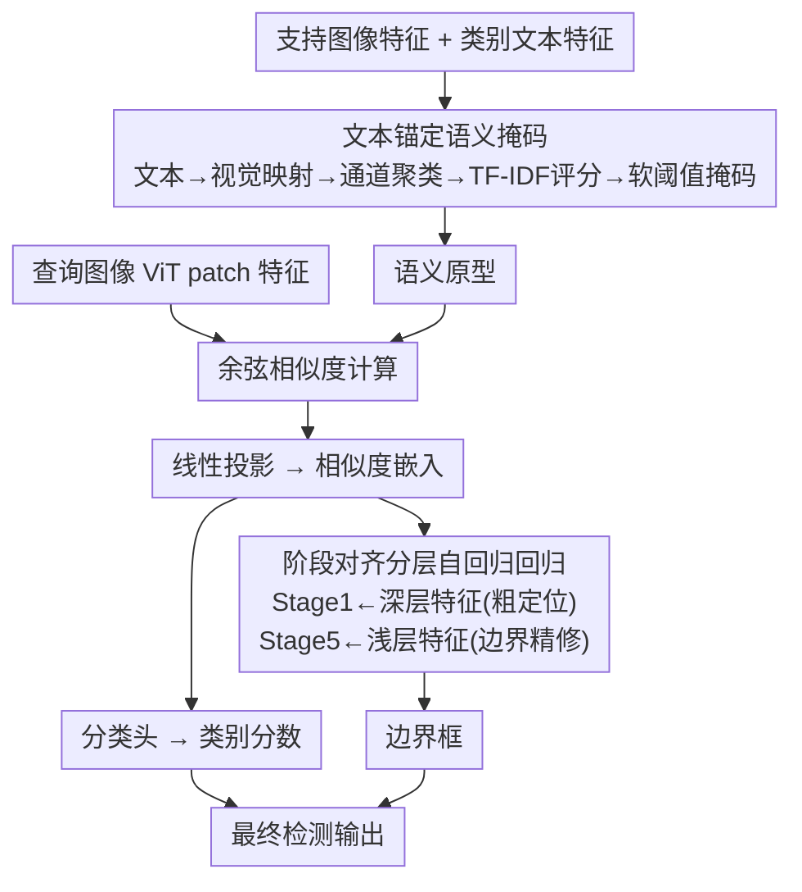

# Rethinking Prototype-based Similarity Learning for Few-Shot Object Detection

**会议**: ECCV 2026  
**arXiv**: [2606.23069](https://arxiv.org/abs/2606.23069)  
**代码**: [https://github.com/VisualScienceLab-KHU/ReSet](https://github.com/VisualScienceLab-KHU/ReSet) (有)  
**领域**: 目标检测  
**关键词**: 小样本目标检测, 原型相似度学习, 文本锚定语义掩码, 分层自回归回归, ViT 特征注入

## 一句话总结
针对原型相似度学习在小样本目标检测中的两个根本瓶颈——类间相似度margin塌缩导致类别混淆、相似度嵌入缺乏空间几何线索导致定位不准——本文提出文本锚定语义掩码（TSMa）利用文本特征抑制风格驱动的虚假相似度以扩大类间margin，同时提出阶段对齐分层自回归回归（SHARe）按ViT深度逆序注入多层级视觉特征实现渐进式边界框精修，在COCO上以+10.1 nAP大幅刷新SOTA。

## 研究背景与动机
小样本目标检测（FSOD）旨在仅用几张标注样本检测新类别，避免大规模标注成本。近年来，基于原型相似度学习的方法（如DE-ViT、PiDiViT）因其免微调（training-free）的特性受到关注：它们用冻结的ViT骨干提取支持图像特征并聚合为类别原型，再通过查询特征与原型之间的余弦相似度同时驱动分类和定位，推理时无需对新类别做任何微调。然而，这一类方法存在两个结构性瓶颈。

**第一个瓶颈是类间相似度margin塌缩导致的类别混淆。** 视觉原型由支持图像的视觉特征聚合而来，不可避免地编码了跨类别共享的风格相关成分（如纹理、光照模式）。这些风格驱动成分会在语义上无关的类别之间引入虚假的相似度响应，导致多个类别的相似度得分趋近——即类间margin塌缩。模型因此难以建立清晰的决策边界，分类错误会进一步传播到后续检测阶段。

**第二个瓶颈是相似度嵌入缺乏空间几何信息导致定位不准。** 在原型相似度学习框架中，定位同样依赖类别级相似度得分。由于余弦相似度本质上只对特征向量的方向角敏感，相似度嵌入主要编码类别级的语义亲和性，几乎不携带物体边界、形状、尺度等空间几何线索，导致精确定位天然困难。

**核心idea：** 用文本特征作为语义锚点，通过图文通道级交互识别并保留语义一致的通道以构建"语义原型"，从而抑制风格噪声、扩大类间margin；同时将定位重构成一个分层自回归过程，按ViT表征深度逆序（深层语义先粗定位、浅层几何后精修）注入多层级视觉特征，弥补相似度嵌入缺失的空间线索。

## 方法详解

### 整体框架
本文方法在DE-ViT的两阶段检测框架上引入两个互补组件。给定一张查询图像和若干支持图像，先用冻结的DINOv2 ViT-L提取所有图像的patch特征，用冻结的CLIP文本编码器提取每个类别的文本特征。TSMa将文本特征映射到视觉空间后，通过通道级图文交互识别语义对齐的通道，经TF-IDF评分和可学习软阈值生成语义掩码，作用于视觉原型得到语义原型。查询特征与语义原型的余弦相似度经线性投影得到相似度嵌入，分两路：分类头输出每类得分，回归分支则将相似度嵌入送入SHARe进行S=5阶段的自回归边界框精修，每阶段按ViT深度逆序注入对应层级的视觉特征。最终框坐标与类别得分合并得到检测输出。训练时用基类数据学习全部可训练参数（ViT和CLIP均冻结），推理时仅用k-shot支持样本构建语义原型，无需任何微调。

### 关键设计

**1. 文本锚定语义掩码（TSMa）：用文本特征识别并保留语义一致的通道，抑制风格驱动的虚假相似度**

TSMa的核心前提是：视觉和文本特征共同激活的通道更直接地反映类别特定语义。由于DINOv2和CLIP位于不同的特征空间，TSMa首先学习一个轻量映射函数将CLIP文本特征投影到DINOv2空间。具体使用Talk2DINO的非线性warping：$\psi(\mathbf{t}) = \mathbf{W}_b^\top(\tanh(\mathbf{W}_a^\top\mathbf{t} + \mathbf{b}_a)) + \mathbf{b}_b$，通过对比学习仅优化$\psi$而冻结两个骨干。该映射只在基类数据上训练，但对新类具有泛化性。

获得映射后的文本特征$\tilde{\mathbf{t}}_c$后，对每个类别的每个实例，计算视觉特征与文本特征的逐通道归一化元素积$\mathbf{a}_{c,n} = \frac{\mathbf{v}_{c,n}}{|\mathbf{v}_{c,n}|_2} \odot \frac{\tilde{\mathbf{t}}_c}{|\tilde{\mathbf{t}}_c|_2}$，其每个元素$\mathbf{a}_{c,n}[i]$表示第$i$通道对视觉和文本特征的联合响应强度。对每个实例的通道做k-means聚类（k=2），将高均值簇标记为"语义激活通道"。随后聚合所有实例的激活频率，用TF-IDF机制为每个通道打分：$\mathrm{Score}_c(i) = \mathrm{TF}_c(i) \cdot \mathrm{IDF}(i)$，其中TF反映通道在该类中的激活频率，IDF惩罚在所有类中普遍激活的通道。这一设计巧妙地将信息检索中的关键词权重思想迁移到通道选择：频繁在该类激活且在其他类稀少的通道得高分，既保证类相关性又保证类区分性。

按得分降序排列通道后，用可学习的软阈值$\theta_c$做连续掩码：$M_{c,i}(\theta_c) = \sigma\!\left(\frac{\theta_c - r_{c,i}}{\tau}\right)$，其中$\tau$控制掩码边界的软硬程度。$\theta_c$初始化为最低排名以保留几乎所有通道、逐步在训练中被优化。最终语义原型为$\tilde{\mathbf{p}}_c = \frac{\mathbf{M}_c \odot \mathbf{p}_c}{|\mathbf{M}_c \odot \mathbf{p}_c|_2}$。推理时新类阈值取所有基类阈值的均值，无需额外调参。通过让相似度计算仅发生在语义对齐的通道上，TSMa直接缓解了类间margin塌缩这一核心瓶颈。

**2. 阶段对齐分层自回归回归（SHARe）：将定位重构成多阶段自回归过程，按ViT深度逆序注入层级视觉特征以逐步恢复空间线索**

SHARe将定位从单步预测重构成S=5阶段的自回归精修过程。核心洞察来自ViT表征的深度特性：浅层捕获边缘、纹理等细粒度几何线索，深层编码高层语义和全局上下文。SHARe据此设计逆序注入策略——早期阶段用深层特征做粗定位，后期阶段逐步引入浅层特征做空间精修。

具体实现分两步。第一步是层级特征聚合：将ViT-L的24层均匀划分为S=5组$\{\mathcal{G}_s\}_{s=1}^S$（每组约5层），组内用可学习softmax加权和聚合得到阶段视觉线索$\mathbf{V}_s = \sum_{\ell \in \mathcal{G}_s} \alpha_{s,\ell} \mathrm{LN}(\mathbf{X}^\ell)$，其中$\alpha_{s,\ell} = \frac{\exp(w_{s,\ell})}{\sum_{j \in \mathcal{G}_s}\exp(w_{s,j})}$。LayerNorm用于消弭不同层之间的尺度差异。

第二步是阶段对齐自回归精修。在阶段$t$，先对$\mathbf{V}_{\pi(t)}$做RoIAlign提取区域特征（$\pi(t) = S-t+1$，实现逆序），经线性投影得到阶段条件$\mathbf{C}_t$。然后以前一阶段掩码logit $\mathbf{m}_{t-1}$作为门控信号，将$\mathbf{C}_t$注入隐嵌入：$\tilde{\mathbf{e}}_{t-1} = \mathbf{e}_{t-1} + \gamma_t \cdot (\mathbf{C}_t \odot \sigma(\mathbf{m}_{t-1}))$，其中$\gamma_t$是可学习的注入强度。掩码logit同时被拼接到嵌入中跨阶段传递：$\hat{\mathbf{e}}_{t-1} = \mathrm{Concat}(\tilde{\mathbf{e}}_{t-1}, [\mathbf{m}_{t-1}, \ldots, \mathbf{m}_0])$。经Conv-BN-ReLU精修块更新嵌入后，通过1x1卷积加sigmoid预测当前阶段掩码$\mathbf{m}_t$。最后用空间积分层将掩码转换为边界框坐标。整个过程的优雅之处在于：深层语义先圈出物体的"大概在哪"，浅层几何特征再逐步刻画"精确边界在哪"——这正是人类视觉定位的直觉过程。

### 一个完整示例

假设用30-shot支持图像检测查询图中的"斑马"。TSMa阶段：30张斑马支持图像的视觉特征与"zebra"文本特征做逐通道元素积，k-means将通道分为高/低共激活两组，TF-IDF评分后保留既高频在斑马中出现又在其他类中稀少的通道（如条纹纹理相关通道），抑制在所有类中普遍激活的风格通道。可学习阈值$\theta_{\text{zebra}}$（推理时取基类阈值均值≈300）产生软掩码，作用于斑马视觉原型得到语义原型。查询图每个RoI的特征与斑马及其他类别的语义原型计算余弦相似度——此时style通道已被抑制，斑马原型的相似度显著高于"马""狗"等易混淆类别，Top-1准确率大幅提升。

SHARe阶段：RPN给出初始候选框，RoIAlign提取查询特征并计算相似度嵌入$\mathbf{e}$。Stage 1注入ViT第20-23层（最深）的聚合特征$\mathbf{V}_5$——这些特征编码斑马的全局语义轮廓，给出一个覆盖斑马主体但边界模糊的粗掩码$\mathbf{m}_1$。Stage 2-5依次注入第15-19层、第10-14层、第5-9层、第0-4层的聚合特征，每次以前一阶段的掩码作为空间注意力门控，逐步将边界从模糊收窄为贴合斑马轮廓的精确掩码$\mathbf{m}_5$。空间积分层将$\mathbf{m}_5$转为紧致边界框，与分类得分合并输出最终检测。

### 损失函数 / 训练策略

总损失由三部分组成。分类损失：对每个RoI的类别logits（含背景类）施加focal loss，背景类权重1.5、前景类权重1.0，$\gamma=0.5$。边界框回归损失：最终预测框与真值框之间的Smooth-L1损失。SHARe辅助损失：在每个精修阶段$t$，预测掩码$\mathbf{m}_t$受BCE和Dice损失监督（以扩展RoI网格上的真值二值掩码为目标），预测区域坐标$\hat{\mathbf{r}}_t$受$\ell_1$和GIoU损失监督（以真值区域坐标为目标）。所有辅助损失项等权相加，无额外缩放系数。训练时SHARe的所有阶段均参与损失计算，推理时仅使用最终阶段$S$的输出。优化器与超参见原文（基于DE-ViT的训练配置）。

## 实验关键数据

### 主实验

COCO 2014 few-shot benchmark上10-shot和30-shot的结果（与代表性方法的对比）：

| 方法 | 骨干 | 微调 | 10-shot bAP | 10-shot nAP | 10-shot nAP50 | 10-shot nAP75 | 30-shot bAP | 30-shot nAP | 30-shot nAP50 | 30-shot nAP75 |
|------|------|------|-------------|-------------|---------------|---------------|-------------|-------------|---------------|---------------|
| DE-ViT (CoRL'24) | ViT-L/14 | 否 | 29.4 | 34.0 | 52.9 | 37.0 | 29.5 | 34.0 | 53.0 | 37.2 |
| CD-ViTO (ECCV'24) | ViT-L/14 | 否 | - | 35.3 | 54.9 | 37.2 | - | 35.9 | 54.5 | 38.0 |
| PiDiViT (ICCV'25) | ViT-L/14 | 否 | 32.3 | 37.0 | 57.6 | 40.9 | 31.4 | 37.3 | 58.5 | 41.7 |
| **Ours** | ViT-L/14 | 否 | **41.2** | **47.1** | **65.5** | **51.5** | **41.3** | **47.4** | **65.6** | **51.5** |

COCO 2017 one-shot benchmark上四组split的平均nAP50为43.7%，比PiDiViT的32.8%高出+10.9。Pascal VOC上跨1/2/3/5/10-shot三组split的平均nAP50为68.1%，比PiDiViT的61.2%高出+6.9。值得注意的是，本文方法在基类性能bAP上也大幅领先（10-shot +8.9，30-shot +9.9），说明TMSa的语义掩码和SHARe的层级特征注入同时惠及基类和新类的表征质量，而非以牺牲基类为代价提升新类。

### 消融实验

COCO 30-shot设定下的组件消融：

| SHARe | TSMa | bAP | nAP | nAP50 | nAP75 | 说明 |
|-------|------|-----|-----|-------|-------|------|
| - | - | 30.0 | 34.3 | 53.6 | 36.8 | 基线（纯相似度嵌入） |
| 是 | - | 37.1 | 43.1 | 60.8 | 47.4 | 仅SHARe，nAP75提升最大(+10.6) |
| - | 是 | 38.6 | 43.7 | 63.5 | 46.1 | 仅TSMa，nAP50提升最大(+9.9) |
| 是 | 是 | **41.3** | **47.4** | **65.6** | **51.5** | 完整模型 |

消融揭示了两个组件的功能分工：SHARe单独使用时nAP75提升最显著（+10.6），因为nAP75对高IoU下的定位精度最敏感，验证了层级特征注入对精确定位的贡献；TSMa单独使用时nAP50提升最显著（+9.9），因为nAP50的IoU阈值宽松、对分类准确率更敏感，验证了语义掩码对类间区分性的提升。两者互补叠加后所有指标达到最优。

SHARe中ViT特征注入策略的消融（30-shot）：

| 注入策略 | bAP | nAP | nAP50 | nAP75 | 说明 |
|---------|-----|-----|-------|-------|------|
| 无注入 | 38.6 | 43.7 | 63.5 | 46.1 | 等效于仅TSMa |
| 正向注入 | 40.0 | 45.9 | 64.4 | 48.2 | 浅层→深层（与直觉相反） |
| **逆向注入** | **41.3** | **47.4** | **65.6** | **51.5** | 深层→浅层（本文设计） |

逆向注入全面优于正向注入，尤其在nAP75上领先+3.3，直接验证了"深层语义先粗定位、浅层几何后精修"这一核心洞察。正向注入在后期引入深层语义特征反而干扰了已建立的精细边界，导致重叠实例的混淆加剧。

### 关键发现
- TSMa和SHARe分工明确：TSMa主攻分类（TSMa单独使nAP50提升+9.9），SHARe主攻定位（SHARe单独使nAP75提升+10.6），两者互补覆盖了原型相似度学习的两大瓶颈。定性结果也印证了这一点：仅SHARe时存在误分类但定位准确，仅TSMa时定位冗余框多但分类正确，完整模型同时解决两类问题。
- TSMa中的TF-IDF评分至关重要：去掉TF-IDF后nAP从47.4降至45.8，因为某些通道在所有类别中普遍呈现高响应（类无关通道），TF-IDF通过IDF项有效惩罚这些通道，将相似度计算聚焦于真正有区分力的通道。
- TSMa大幅扩大类间相似度margin：本文方法的Top-1分类准确率比PiDiViT高出+21.1%（84.3% vs 63.2%），Top-1与Top-2之间的相似度差距显著增大，t-SNE可视化中查询特征紧致聚集在正确原型周围而不再散布到错误原型附近。
- SHARe的逆向注入顺序是关键设计选择：正向注入（浅层先、深层后）虽然也好于无注入，但在高IoU定位上劣于逆向注入，说明层级特征的使用顺序必须与"粗到细"的定位逻辑匹配，而非任意排列。
- 推理效率优于PiDiViT：本文方法在nAP50高出+6.6的同时，推理速度反而快1.6倍（0.44s/img vs 0.71s/img），说明TSMa和SHARe的设计在性能提升的同时保持了计算效率。

## 亮点与洞察
- **TF-IDF机制在通道选择中的迁移应用**：将信息检索中经典的关键词权重公式（TF-IDF）用于衡量神经网络通道的类别区分性，是跨领域迁移的巧妙设计。该思想可推广到任何需要评估特征通道重要性的场景——只要定义好通道的"文档频率"和"词频"类比即可。
- **ViT深度特性与定位过程的自然对应**：深层语义→粗定位、浅层几何→精修的逆序注入设计，本质上是把ViT表征的归纳偏置（从局部到全局的层级抽象）转化为定位的先验知识。这种"利用预训练模型内在结构特性来指导下游任务设计"的思路对任何使用ViT骨干的密集预测任务都有参考价值——关键是先理解不同层的表征属性，再让任务流程与之对齐。
- **软阈值可学习掩码**：TSMa使用sigmoid化的排序阈值而非硬性设定保留通道数或固定阈值，既避免了离散选择不可导的问题，又允许模型在训练过程中自适应调整掩码宽度。推理时仅用基类阈值均值即可保持有效——说明存在一个相对稳定的"最优语义通道比例"。
- **门控条件注入的稳定性设计**：SHARe中将掩码门控信号$\sigma(\mathbf{m}_{t-1})$从计算图中detach，解耦了门控与嵌入更新之间的梯度流。这个看似细节的设计实际上防止了训练早期的梯度振荡：门控信号本身来源于尚不准确的掩码，如果允许梯度回传会导致"错误门控→错误梯度→更错误门控"的正反馈循环。

## 局限与展望
- 作者未明确讨论的局限：TSMa依赖CLIP文本编码器提取类别文本特征，对于没有自然语言对应名称的细粒度类别（如特定的工业缺陷类型、医学术语缩写），简单的"{class}"模板可能不足以产生有区分力的文本特征，需要设计更丰富的文本提示模板。
- SHARe的RoI基于初始RPN候选框扩展，如果RPN漏检或候选框质量极差（如只框住了物体一小部分），后续5阶段精修也难以恢复完整的物体区域。方法对前端RPN的质量有一定隐性依赖。
- 方法在COCO和Pascal VOC上验证充分，但两类数据集均以自然场景常见物体为主。在更极端的跨域场景（如遥感图像、医学图像中的小样本检测）中，文本锚定的有效性和ViT层级特征的迁移性有待验证。
- 可改进方向：（1）探索多模态文本提示（如类别描述+属性短语）替代单一"{class}"模板以增强TSMa的语义锚定；（2）在SHARe中引入动态阶段数，根据候选框的置信度或物体尺度自适应决定精修轮次，减少简单样本的冗余计算；（3）将TSMa的通道掩码思想反向应用于文本特征侧，做双向图文通道对齐，进一步提升语义原型的纯度。

## 相关工作与启发
- **vs DE-ViT (CoRL'24)**：DE-ViT是原型相似度学习路线的开创性工作，首次用冻结ViT+余弦相似度替代微调。但它直接用视觉原型做相似度计算、单步回归定位，正是本文所针对的两个瓶颈的来源。本文在其pipeline基础上用TSMa改进原型质量、用SHARe替代单步回归，属于"保留框架、替换核心模块"的改进范式。
- **vs PiDiViT (ICCV'25)**：PiDiViT尝试用像素差分卷积增强边界响应、多尺度特征融合提升尺度感知来改善定位，但仍未触及相似度计算本身的质量问题（风格通道导致的margin塌缩）。本文的TSMa从相似度计算的源头入手，效果更直接（+10.1 nAP vs PiDiViT的梯度方法改进）。
- **vs Talk2DINO**：TSMa复用了Talk2DINO的文本到视觉映射函数，但将其从开放词汇分割任务中剥离出来、重新定位为语义掩码构建的前置步骤。这种"借用已有对齐工具、赋予新任务角色"的思路值得学习。

## 评分
- 新颖性: 4星。TSMa用文本锚定改进原型质量、SHARe用逆序层级注入做自回归定位，两个设计都有明确动机且与前人工作形成清晰区分，但核心范式仍属于原型相似度学习框架的改进而非全新范式。
- 实验充分度: 5星。COCO+Pascal VOC双数据集、1/10/30-shot多设定、组件消融+注入策略消融+TF-IDF消融+Top-k准确率+相似度margin分析+t-SNE可视化+推理速度对比+多骨干规模实验，消融和分析链条完整且每个设计选择都有对应实验支撑。
- 写作质量: 4星。问题定义清晰（两个瓶颈→两个组件），方法描述配合公式和算法伪代码详实可复现，定性分析有效补充了定量结论。略不足的是部分公式符号堆叠较密，初次阅读时信息密度偏高。
- 价值: 5星。以+10.1 nAP的显著优势刷新SOTA，为原型相似度学习路线提供了强基线；TSMa和SHARe的设计思路（文本锚定去噪、层级特征逆序注入）具有跨任务迁移潜力；代码开源且推理高效，实用性强。

<!-- RELATED:START -->

## 相关论文

- [\[CVPR 2026\] FastRef: Fast Prototype Refinement for Few-shot Industrial Anomaly Detection](../../CVPR2026/object_detection/fastref_fast_prototype_refinement_for_few-shot_industrial_anomaly_detection.md)
- [\[ECCV 2024\] Adaptive Multi-task Learning for Few-Shot Object Detection](../../ECCV2024/object_detection/adaptive_multi-task_learning_for_few-shot_object_detection.md)
- [\[ECCV 2026\] CMDS-AD: Cross-Modal Dual-Stream Decoupling for Few-Shot Anomaly Detection](cmds-ad_cross-modal_dual-stream_decoupling_for_few-shot_anomaly_detection.md)
- [\[AAAI 2026\] MovSemCL: Movement-Semantics Contrastive Learning for Trajectory Similarity (Extension)](../../AAAI2026/object_detection/movsemcl_movement-semantics_contrastive_learning_for_trajectory_similarity_exten.md)
- [\[ECCV 2026\] Rethinking Continual Anomaly Detection on the Edge: Benchmarking Under Realistic Industrial Conditions](rethinking_continual_anomaly_detection_on_the_edge_benchmarking_under_realistic_.md)

<!-- RELATED:END -->
