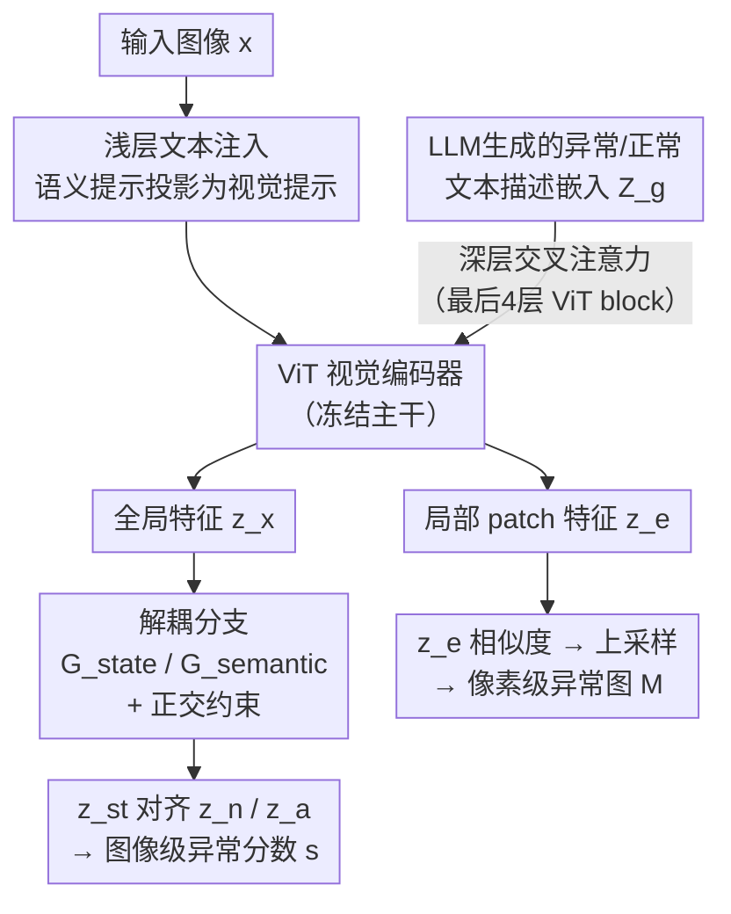

# Robust Zero-shot Anomaly Detection under Limited Auxiliary Anomaly Priors

**会议**: ECCV 2026  
**arXiv**: [2606.29428](https://arxiv.org/abs/2606.29428)  
**代码**: [https://github.com/ZhouF-ECNU/DIVE](https://github.com/ZhouF-ECNU/DIVE) (有)  
**领域**: 异常检测  
**关键词**: 零样本异常检测, CLIP, 视觉语言模型, 提示学习, 解耦表征

## 一句话总结
DIVE 首次研究辅助数据中异常先验有限场景下的零样本异常检测问题，通过浅层+深层文本嵌入注入策略让视觉编码器从有限的辅助异常模式中抽象出跨域通用的异常概念，并引入解耦机制消除物体语义对视觉嵌入的干扰；在使用纹理数据集 DTD 作为辅助数据时，DIVE 在 12 个目标数据集上的分类和分割性能最高超越 SOTA 基线 28.5%（AP）和 47.0%（AUPRO），同时将辅助数据多样性不足导致的性能退化幅度压缩约 46.5%-77.3%。

## 研究背景与动机

**领域现状**：零样本异常检测（ZSAD）旨在无需目标域数据收集即可识别任意新域中的缺陷，现有方法主要基于 CLIP 等大视觉语言模型，通过手工提示工程或可学习提示微调来对齐视觉特征与异常文本描述。从 WinCLIP 的手工提示，到 AnomalyCLIP 的对象无关可学习提示，再到 TPS、FAPrompt 等细粒度提示设计，ZSAD 方法在不断演进。

**现有痛点**：所有现有 ZSAD 方法都建立在同一个乐观假设之上——辅助训练数据中包含丰富多样的异常模式。当辅助数据的异常多样性不足时（比如只用纹理异常数据集 DTD 训练，却要泛化到工业缺陷和医学病变），这些方法会严重过拟合到辅助数据特有的异常分布上，对目标域中的复杂缺陷和持续涌现的新物体类别几乎完全失效。如论文 Fig.1 所示，将辅助数据从 MVTec（含孔洞、污渍、裂纹等多种工业缺陷）换为 DTD（仅含纹理异常）后，五种 SOTA 基线的平均 AP 下降 9.9% 到 23.3%。

**核心矛盾**：真实世界的目标域具有不可预测的异常变化和持续涌现的新异常模式，而辅助数据永远不可能穷尽覆盖所有可能的异常类型——这一"辅助数据异常先验有限"的矛盾在现实中普遍存在，但此前从未被系统研究过。

**另一个痛点**：预训练视觉编码器的特征空间由物体语义主导。当把这类视觉嵌入与仅为异常检测设计的、对象无关的文本提示做对齐时，主导的物体语义会成为干扰噪声——模型无法将细微的缺陷变化从显著的物体身份中分离出来，严重阻碍了异常判别表征的学习。

**核心 idea**：与其让模型死记辅助数据中的具体异常外观，不如让模型学会"什么样算异常"这一通用概念——通过在视觉编码过程中注入文本描述的异常/正常通用知识（浅层保持跨类别泛化、深层抽象异常概念），同时将全局视觉嵌入解耦为独立的状态子空间和语义子空间，使模型在辅助异常先验有限时仍能泛化到未见过的目标域。

## 方法详解

### 整体框架

DIVE 要解决的核心问题是：当辅助训练数据中异常模式有限时，如何让 CLIP 模型不依赖具体的异常外观就能学会判别异常。整体思路是"在视觉特征提取过程中注入文本中的通用异常知识，再把纠缠的物体语义和异常状态拆开"——不是改 CLIP 架构，而是在冻结的主干上挂接可学习的注入模块和解耦分支。

DIVE 框架包含三条并行的文本提示学习支路和两阶段的视觉嵌入处理。三条文本支路分别是：状态感知提示学习器（生成 "normal"/"abnormal" 文本嵌入 $z_n, z_a$）、语义感知提示学习器（生成物体类别文本嵌入 $z_c$）、以及 LLM 生成的异常/正常描述字典经冻结 CLIP 文本编码器得到的描述嵌入 $Z_g$。视觉端以 ViT 为骨干，在浅层通过 V-L 耦合函数 $\mathcal{F}$ 将语义提示的可学习 token 投影为视觉提示注入第一层 ViT，在深层（最后 4 个 ViT block）通过交叉注意力将 $Z_g$ 与 patch token 融合。ViT 输出全局特征 $z_x$ 和局部 patch 特征 $z_e$ 后，$z_x$ 经过两个并行的残差 MLP 分支（$\mathcal{G}_{state}$ 和 $\mathcal{G}_{semantic}$）解耦为状态嵌入 $z_{st}$ 和语义嵌入 $z_{se}$，分别与状态文本嵌入和语义文本嵌入做对齐，得到图像级异常分数 $s$；$z_e$ 则与状态文本嵌入计算相似度图，经上采样和高斯平滑得到像素级异常图 $\mathbf{M}$。

### 关键设计

**1. 浅层+深层文本嵌入注入：让视觉编码器从有限异常样本中抽象通用异常概念**

这个问题直击 Challenge 1——辅助数据异常多样性不足时模型过拟合。DIVE 的解法分两层：浅层注入解决"没见过的新物体类别"问题，深层注入解决"没见过的新异常形态"问题。

浅层注入借鉴了 MaPLe 的多模态提示机制：将语义文本提示的前 $h=4$ 个可学习 token 通过一个 V-L 耦合函数 $\mathcal{F}$（可学习的线性投影）映射到视觉空间，作为额外的视觉 prompt token $\tilde{C}$ 拼接到 ViT 输入序列中：$[c_1, E_1, \tilde{C}_1] = \text{ViT}_1([c_0, E_0, \mathcal{F}(C_0|_1^h)])$。这样做的直觉是：ViT 浅层主要负责捕捉边缘、纹理等粗粒度局部结构，把语义提示投影进来能让视觉编码过程保留跨模态对齐能力——即使目标域出现了辅助数据中从未见过的物体类别，模型也不会完全"失明"。

深层注入是更关键的设计：先用 GPT-4o 生成 100 条异常描述和 35 条正常描述（如 "a photo of an object with a crack""a photo of an object with a stain""a photo of an object with a flawless surface"），将这些描述输入冻结的 CLIP 文本编码器得到 $Z_g$，再通过可学习投影矩阵 $W_{proj}^\top$ 映射到视觉空间。在 ViT 的最后 4 层（第 22-24 层，即 $Q'=21$ 之后），将每个 patch token 作为 query、投影后的文本描述嵌入作为 key 和 value，通过交叉注意力 $\mathcal{CA}$ 融合：$E_{d'} = E_{d'-1} + \gamma \cdot \mathcal{CA}_{d'-1}(E_{d'-1}, Z_g W_{proj}^\top, Z_g W_{proj}^\top)$，其中 $\gamma$ 是平衡原始视觉特征和注入文本信息的超参数。为什么放在深层？因为 ViT 深层具有强大的概念抽象能力——此时 patch token 已经过 21 层的层次化抽象，适合接收语言级的通用异常概念。深层注入的效果相当于让模型把辅助数据中见过的具体异常纹理（比如 DTD 的织物瑕疵）映射到通用描述（"a photo of an object with a stain"），从而在遇到目标域中形态类似但表面材质完全不同的异常（比如医学影像中的肿瘤阴影）时也能激活相同的异常概念。

消融实验表明，去掉深层注入（DIVE$_{\text{-text(d)}}$）比去掉浅层注入（DIVE$_{\text{-text(s)}}$）掉点更严重（MVTec AUROC 下降 2.0 vs 0.5），去掉全部文本注入（DIVE$_{\text{-text}}$）掉的点最大（AUROC 下降 2.4、AP 下降 4.4），证实了文本注入——尤其是深层 LLM 描述注入——是 DIVE 在辅助异常先验有限时泛化的核心支柱。

**2. 视觉嵌入解耦机制：消除物体语义对异常判别的干扰**

这个问题直击 Challenge 2——视觉嵌入中物体语义和异常状态纠缠在一起，直接与对象无关的文本提示对齐是次优的。DIVE 的解法是：把全局视觉特征 $z_x$ 通过两个可学习的残差 MLP 显式投影到两个正交子空间。

具体做法：$z_{st} = z_x + \mathcal{G}_{state}(z_x)$，$z_{se} = z_x + \mathcal{G}_{semantic}(z_x)$，其中 $\mathcal{G}_{state}$ 和 $\mathcal{G}_{semantic}$ 是两个独立的 MLP 网络，学习的是残差偏移量 $\Delta z_{st}$ 和 $\Delta z_{se}$。采用残差学习而非绝对变换有两个好处：减轻预训练视觉概念的灾难性遗忘、稳定优化过程。为使两个子空间真正独立，施加正交约束——解耦损失为两个残差偏移向量的平方余弦相似度：$\mathcal{L}_{dis} = (\frac{\Delta z_{st}^\top \Delta z_{se}}{\|\Delta z_{st}\|_2 \|\Delta z_{se}\|_2})^2$。

解耦后，状态分支 $z_{st}$ 只与"normal/abnormal"文本嵌入做对齐（交叉熵损失 $\mathcal{L}_{state}$），语义分支 $z_{se}$ 只与物体类别文本嵌入做对比学习（$\mathcal{L}_{sem}$，拉近与真实类别嵌入的距离、推远与其他类别的距离）。推理时只用状态分支计算异常分数，因为物体是什么类别跟它有没有缺陷是两件独立的事。

消融实验中，去掉解耦机制（DIVE$_{\text{-dis}}$）主要导致分类指标下降（MVTec AUROC 降 0.6、AP 降 1.8），这是因为解耦作用于全局视觉嵌入，而分类分数正是由全局嵌入与状态文本嵌入对齐得来的。相比之下，分割指标下降幅度较小，因为分割使用的是未解耦的局部 patch 特征 $z_e$。

**3. RCPRO 指标：修正 AUPRO 对假阳性"放水"的问题**

这不是 DIVE 模型的一部分，而是论文提出的新分割评估指标。标准的 AUPRO 指标只关注预测是否覆盖了真值异常区域（per-region overlap），完全忽略正常区域中的假阳性预测和异常区域的过度分割。如论文 Fig.1 右图所示，AnomalyCLIP 在一张结肠镜图像上预测出三块异常区域，其中两块是明显的假阳性（包括得分最高的那块），但 AUPRO 仍然给出了虚高的 96.5%，因为那三块区域确实覆盖了真值异常。RCPRO 在 PRO 曲线的基础上增加了区域校准惩罚：对每个预测的连通异常区域 $P_m$，如果它与任何真值区域的最大重叠小于阈值 $\tau = 0.05 \times |T_{n^*}|$，质量分直接给 0（惩罚正常区域的假阳性）；如果通过了过滤但过度扩展（超出真值边界的面积比 $E(P_m) > \theta_{exc} = 2.0$），则质量分按 $\theta_{exc} / E(P_m)$ 反比衰减（惩罚过分割）。最终 RCPRO = 在不同阈值下 PRO 分数（X 轴）与区域校准分（Y 轴）构成的曲线下面积。上述结肠镜案例在 RCPRO 下得分被拉到合理的 28.7%。

### 损失函数 / 训练策略

DIVE 的总损失函数由五部分组成：$\mathcal{L} = \mathcal{L}_{state} + \lambda \mathcal{L}_{sem} + \lambda' \mathcal{L}_{dis} + \mathcal{L}_{seg} + \lambda'' \mathcal{L}_{reg}$。

- $\mathcal{L}_{state}$：状态分支的分类损失，对 $p_{st} = \text{softmax}([z_{st}^\top z_n, z_{st}^\top z_a] / \tau)$ 做交叉熵，让模型学会区分正常和异常图像。
- $\mathcal{L}_{sem}$：语义分支的对比损失，让 $z_{se}$ 靠近真实类别的文本嵌入、远离其他类别，确保语义分支确实在捕捉物体身份而非异常状态。
- $\mathcal{L}_{dis}$：解耦正交损失，约束 $\Delta z_{st}$ 和 $\Delta z_{se}$ 正交，强制两个子空间独立。
- $\mathcal{L}_{seg}$：分割损失 = Focal Loss + Dice Loss（异常通道对真值 mask + 正常通道对反 mask），优化像素级异常定位。
- $\mathcal{L}_{reg}$：视觉 prompt 正则项 $\frac{1}{|\tilde{C}|}\|\tilde{C}\|_2^2$，防止注入的视觉 prompt token 幅值过大导致训练不稳定。

训练时冻结 CLIP 的 ViT 和文本编码器主干，仅训练三组可学习参数：提示学习器（状态+语义，每层引入 $h=4$ 个可学习 token，提示深度 $P=9$）、V-L 耦合函数 $\mathcal{F}$ 和交叉注意力层 $\mathcal{CA}$、以及两个解耦 MLP（$\mathcal{G}_{state}$、$\mathcal{G}_{semantic}$）。推理时直接用冻结的模型权重：图像级异常分数 $s = \frac{\exp(z_{st}^\top z_a / \tau)}{\exp(z_{st}^\top z_n / \tau) + \exp(z_{st}^\top z_a / \tau)}$，像素级异常图 $\mathbf{M} = G_\sigma(Up(\mathbf{S}_a))$，其中 $\mathbf{S}_a$ 是相似度图的异常通道，$G_\sigma$ 是标准差为 $\sigma$ 的高斯滤波。

## 实验关键数据

### 主实验

**表 1：DTD 作为辅助数据时 DIVE 与各基线的性能对比（12 数据集平均结果）。** DTD 仅含纹理异常，模拟"辅助数据异常先验有限"的现实场景。

| 任务 | 指标 | AnomalyCLIP | AdaCLIP | AF-CLIP | AA-CLIP | TPS | DIVE | 提升(vs best) |
|------|------|-------------|---------|---------|---------|-----|------|---------------|
| 分类(8集平均) | AUROC | 79.3 | 80.1 | 75.8 | 71.1 | 81.6 | **87.3** | +5.7 |
| 分类(8集平均) | AP | 51.7 | 49.6 | 43.9 | 40.8 | 60.5 | **69.3** | +8.8 |
| 分割(8集平均) | AUROC | 72.9 | 84.1 | 82.3 | 84.4 | 63.9 | **87.3** | +2.9 |
| 分割(8集平均) | AUPRO | 32.5 | 24.1 | 65.5 | 64.9 | 24.6 | **71.1** | +5.6 |
| 分割(8集平均) | RCPRO | 16.3 | 28.1 | 29.4 | 34.3 | 17.2 | **40.4** | +6.1 |

**表 2：MVTec 作为辅助数据时（异常多样性充足），DIVE 与基线在 8 个分类数据集和 8 个分割数据集上的平均性能对比。**

| 任务 | 指标 | AnomalyCLIP | AdaCLIP | AF-CLIP | AA-CLIP | TPS | DIVE |
|------|------|-------------|---------|---------|---------|-----|------|
| 分类(8集平均) | AUROC | 88.6 | 89.1 | 87.4 | 78.6 | 88.7 | **90.1** |
| 分类(8集平均) | AP | 68.4 | 70.0 | 67.2 | 52.2 | 70.3 | **74.6** |
| 分割(8集平均) | AUROC | 90.0 | 88.3 | 91.1 | 83.3 | 73.1 | **91.1** |
| 分割(8集平均) | AUPRO | 71.7 | 31.0 | 71.5 | 65.5 | 40.9 | **75.0** |
| 分割(8集平均) | RCPRO | 41.4 | 34.6 | 42.7 | 34.3 | 19.6 | **43.7** |

两个关键对比：(1) 从 MVTec 换到 DTD 后，基线平均 AP 下降 9.9%-23.3%，DIVE 仅下降 5.3%，退化幅度被压缩约 46.5%-77.3%；(2) 即使辅助数据足够多样（MVTec），DIVE 仍然是所有指标上的最优或并列最优，说明其设计没有以牺牲充足数据场景的性能为代价。

### 消融实验

**表 3：DIVE 各组件消融（DTD 为辅助数据，在 MVTec 和 Visa 上评估）。**

| 配置 | MVTec 分类 AUROC | MVTec 分割 AUPRO | Visa 分类 AUROC | Visa 分割 AUPRO |
|------|-------------------|-------------------|-----------------|-----------------|
| DIVE (完整) | **89.3** | **80.9** | **77.8** | **80.2** |
| w/o 解耦 (DIVE$_{\text{-dis}}$) | 88.7 (-0.6) | 80.5 (-0.4) | 76.2 (-1.6) | 79.5 (-0.7) |
| w/o 浅层注入 (DIVE$_{\text{-text(s)}}$) | 88.8 (-0.5) | 80.5 (-0.4) | 76.9 (-0.9) | 79.4 (-0.8) |
| w/o 深层注入 (DIVE$_{\text{-text(d)}}$) | 87.3 (-2.0) | 77.3 (-3.6) | 75.3 (-2.5) | 77.9 (-2.3) |
| w/o 全部文本注入 (DIVE$_{\text{-text}}$) | 86.9 (-2.4) | 76.6 (-4.3) | 74.4 (-3.4) | 74.4 (-5.8) |

### 关键发现

- **深层文本注入是最关键的组件**：去掉深层注入的退化幅度（AUROC -2.0、AUPRO -3.6）远超去掉浅层注入（AUROC -0.5、AUPRO -0.4），说明 LLM 生成的通用异常/正常描述在 ViT 深层与 patch token 做交叉注意力是 DIVE 泛化能力的核心来源。完全去掉文本注入时性能崩塌（AP 下降 4.4-6.1），证实辅助异常先验有限时纯视觉特征无法泛化。
- **解耦机制主要影响分类而非分割**：去掉解耦后分类指标明显下降（MVTec AP -1.8、Visa AUROC -1.6），但分割指标几乎不受影响（AUPRO -0.4/-0.7），这是因为解耦仅作用于全局视觉嵌入 $z_x$ 而分割使用未解耦的局部 patch 特征 $z_e$。这也说明分类和分割对特征空间的需求不同——分类需要排除物体语义干扰，分割更依赖局部细节。
- **DIVE 的一个可观察副作用**：交叉注意力模块偶有轻微倾向于关注物体边界（如榛子的轮廓、电缆的边缘），导致异常图中沿物体边缘出现零星假阳性。论文在 Fig.3 和 Fig.4 中对此做了可视化分析——高注意力分既分配给损伤区域也分配给轮廓，属于文本描述"对象无关异常概念"的一个边界效应。
- **AUPRO 虚高问题被 RCPRO 实锤**：AA-CLIP 在多个数据集上 AUPRO 很高（因其预测覆盖了真值区域），但 RCPRO 很低（因其预测过度膨胀、假阳性多）；AdaCLIP 则相反，AUPRO 不高但 RCPRO 较高（定位核心异常区域准确、虽边界不完全）。这正好印证了 RCPRO 设计动机——不能只看是否覆盖真值，还要看是否引入了假阳性。

## 亮点与洞察

- **"用语言描述教视觉模型认识异常"这一思路巧妙且可迁移**：不是让模型看更多异常图像，而是让 LLM 生成 135 条通用异常/正常语言描述，通过交叉注意力注入深层 ViT——相当于用文本知识补视觉数据的不足。这种"视觉为主、语言为辅、多模态补数据短板"的思路可以迁移到其他视觉数据稀缺的场景（如少样本医学图像分类、罕见事件检测），只要有一条描述"这样算异常"的语言锚点。
- **解耦+正交约束的残差设计简洁高效**：两个小型 MLP 学残差偏移量（而非绝对映射），再加一个平方余弦相似度正交损失就让视觉嵌入的异常状态和物体语义分开——没有复杂的对抗训练或解耦 VAE，三行公式解决问题，适合作为其他多任务视觉模型的通用解耦模块。
- **RCPRO 指出了一个被广泛忽视的评估漏洞**：AUPRO 是 ZSAD 领域的标准分割指标，但只评"召回"不评"精度"的缺陷如此明显却长期无人指出。这个指标设计本身具有独立价值，建议后续 ZSAD 论文同时报告 AUPRO 和 RCPRO。
- **实验设计扎实、对比公平**：用 DTD 和 MVTec 两种辅助数据设置对比，清楚分离了"辅助数据充分"和"辅助数据不足"两种场景下的方法表现；12 个数据集覆盖工业和医学两大类；消融实验区分了浅层注入和深层注入的各自贡献而非笼统去掉整个模块。

## 局限与展望

- **物体边界假阳性**：DIVE 的交叉注意力模块偶尔在物体轮廓处产生假阳性预测（论文 Fig.3/Fig.4 中电缆、结肠等案例），作者也承认这是未来改进方向。可能的原因是该注意力被物体与背景的纹理突变激活（类似异常特征），但没有进一步区分"边界突变"和"缺陷突变"。一个改进思路是在 LLM 描述中加入否定描述（如 "a photo of an object with a clean edge"），或在交叉注意力训练时引入边界负样本。
- **医学分割数据无正常样本的特殊性**：ISIC、ColonDB、TN3K 三个医学分割数据集只有异常图像（无正常图像），这在消融实验中导致 AA-CLIP 的 RCPRO 反常高于 DIVE（ISIC 上 89.3 vs 74.2），因为 ISIC 病变区域占据图像大部分面积，AA-CLIP 的过度膨胀反而成"优势"。这暴露了 RCPRO 在病变占比极高场景下的适用性边界——此时过度分割和准确分割的差异被缩小。
- **LLM 生成描述的质量依赖**：深层注入的效果取决于 LLM 生成的异常/正常描述是否覆盖了足够多样的异常概念。论文使用了 GPT-4o 的 100+35 条描述，但若目标域的异常类型完全超出了描述词表（如一种全新的异常形态），注入可能失效。不过这个局限来自任务本质——零样本学习总有已知和未知的边界——但后续可以考虑动态扩充描述词表或让描述本身变为可学习的。
- **单辅助域设置**：论文在 DTD 或 MVTec 两个单一辅助域上验证，未探索多辅助域联合训练或辅助域增量扩展的设置，后者可能更贴近持续部署的现实场景。

## 相关工作与启发

- **vs AnomalyCLIP (ICLR 2024)**：两者都做对象无关提示学习，但 AnomalyCLIP 只优化文本端的可学习 prompt，视觉端直接用冻结特征对齐——这在辅助异常先验充足时有效，但先验不足时过拟合严重。DIVE 的创新在于把文本知识注入视觉编码过程（而非只在输出端对齐），让视觉特征本身变得对异常更敏感。这启发我们：提示学习不应局限于输入端或输出端，注入到中间表征层可能更有效。
- **vs MaPLe (CVPR 2023)**：DIVE 的浅层 V-L 耦合函数直接借鉴了 MaPLe 的多模态提示互投影思想，但 DIVE 将其从通用视觉识别迁移到异常检测，并追加了深层 LLM 描述注入这一关键扩展。这说明多模态提示学习的方法可以跨任务复用，关键在于根据下游任务特点调整注入层级和注入内容。
- **vs AA-CLIP (CVPR 2025)**：AA-CLIP 也做解耦（双视角提示解耦物体语义和缺陷外观），但它在文本端解耦（设计不同 prompt），DIVE 在视觉端解耦（显式分离全局特征子空间）。两篇论文独立发现了解耦对 ZSAD 的重要性，但实现路径不同——文本端解耦更轻量但可能不够彻底，视觉端解耦更彻底但增加了可学习参数。
- **RCPRO 的评估思想**：类似目标检测中从 mAP@0.5 到 mAP@0.5:0.95 的演进——从只看覆盖到同时看精度，是评估指标成熟的标志。RCPRO 为分割评估引入的"假阳性惩罚+过分割衰减"双机制可以作为其他密集预测任务（如变化检测、伪造区域定位）评估指标设计的参考范式。

## 评分
- 新颖性: 4/5 —— 首次定义并系统研究"辅助异常先验有限"这一现实 ZSAD 场景，文本注入+解耦的设计虽然组件层面有借鉴（MaPLe 的互投影、解耦的基本思路），但组装方式和新场景适配是全新的；RCPRO 指出的 AUPRO 漏洞有独立贡献价值
- 实验充分度: 5/5 —— 12 个数据集、两种辅助数据设置、5 个 SOTA 基线、完整的消融和超参数敏感性分析、可视化对比异常图和注意力图，实验设计无死角
- 写作质量: 4/5 —— 逻辑清晰，两个 Challenge 驱动全文结构；公式和算法描述完整可复现；Fig.1 的左右联动（定量曲线+定性案例）很有说服力。小瑕疵是部分公式排版在缓存文本中有截断
- 价值: 5/5 —— 定义了 ZSAD 的一个新子问题，提出的浅层+深层注入范式和解耦模块可被后续 ZSAD 工作直接复用；RCPRO 有潜力成为领域标准指标；在辅助数据不足时 16%-47% 的性能提升具有实际部署意义

<!-- RELATED:START -->

## 相关论文

- [\[CVPR 2026\] MoECLIP: Patch-Specialized Experts for Zero-shot Anomaly Detection](../../CVPR2026/object_detection/moeclip_patch-specialized_experts_for_zero-shot_anomaly_detection.md)
- [\[AAAI 2026\] PromptMoE: Generalizable Zero-Shot Anomaly Detection via Visually-Guided Prompt Mixing of Experts](../../AAAI2026/object_detection/promptmoe_generalizable_zero-shot_anomaly_detection_via_visually-guided_prompt_m.md)
- [\[CVPR 2026\] FB-CLIP: Fine-Grained Zero-Shot Anomaly Detection with Foreground-Background Disentanglement](../../CVPR2026/object_detection/fb-clip_fine-grained_zero-shot_anomaly_detection_with_foreground-background_dise.md)
- [\[CVPR 2026\] DLVP-CLIP: Enhancing Fine-Grained Zero-Shot Anomaly Detection via Dynamic Local Visual Prompting](../../CVPR2026/object_detection/dlvp-clip_enhancing_fine-grained_zero-shot_anomaly_detection_via_dynamic_local_v.md)
- [\[CVPR 2026\] VisualAD: Language-Free Zero-Shot Anomaly Detection via Vision Transformer](../../CVPR2026/object_detection/visualad_language-free_zero-shot_anomaly_detection_via_vision_transformer.md)

<!-- RELATED:END -->
