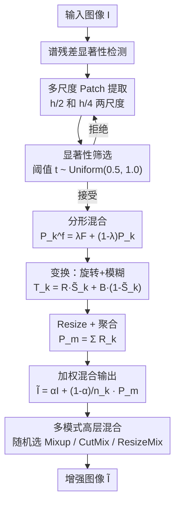

# $S^{2}$-FracMix: Label-Preserving Self-Saliency Mixup Augmentation

**会议**: ECCV 2026  
**arXiv**: [2606.25784](https://arxiv.org/abs/2606.25784)  
**代码**: 无（项目页: fracmix-data-augmentation.github.io）  
**领域**: 目标检测 / 图像分类  
**关键词**: 数据增强, Mixup, 显著性引导, 分形混合, 自监督增强

## 一句话总结
S²-FracMix 提出一种保标签的自显著性混合增强框架：在同一张图像内提取多尺度显著性 patch，经旋转、模糊、分形纹理注入后重新混合回原图，避免跨样本语义干扰；搭配多模式高层混合策略，在分类、检测、鲁棒性等 7 个 benchmark 上全面超越 AdAutoMix 等 SOTA 方法，同时训练开销极低。

## 研究背景与动机
Mixup 类数据增强已成为提升深度视觉模型泛化能力的标准手段。主流方法（Mixup、CutMix、ResizeMix）通过对两张随机图像做线性或区域混合来生成新样本，然而这种**跨样本混合天然引入语义干扰**——源图和目标图的语义区域被强行叠加后产生的合成样本可能包含相互矛盾的视觉线索，模型学到的特征反而受损。为解决这一问题，SaliencyMix、PuzzleMix、Co-Mixup 等显著性引导方法被提出，它们优先混合最具判别力的区域以保留语义完整性，但代价是**显著的计算开销**（需在线求解复杂的 mask 优化问题），大幅增加训练时间并依赖高端硬件。另一条路线是分形增强（PixMix、DiffuseMix），它们将分形纹理混入整张图像以增加多样性，但**全图无差别注入分形纹理会破坏关键目标的视觉结构**，引入不期望的分布偏移，反而损害模型鲁棒性。

**核心矛盾**：现有方法在「样本多样性」「标签一致性」「计算效率」三者之间无法兼得——跨样本混合牺牲标签一致性，显著性优化牺牲效率，全图分形牺牲结构保真度。

**本文目标**：设计一种既保持标签不变（同图操作）、又能产生高多样性增强样本、且计算开销极低的统一框架。切入角度是把「显著性引导」和「分形注入」限制在同一张图像内部：显著性 patch 不从别的图拿，分形纹理只往显著性区域打——两者的约束范围收窄后，矛盾自然消解。

**核心 idea**：用同一张图的显著性区域自己增强自己——把多尺度显著性 patch 抠出来、做几何/光度变换、注入分形纹理、再塞回非显著性位置——整个过程始终不离开本张图，既保标签又增多样性，再加一套轻量级多模式随机混合来覆盖不同粒度的增强信号。

## 方法详解

### 整体框架
S²-FracMix 的输入是一张常规训练图像，输出是一张经过多尺度显著性自混合与分形注入的增强图像，标签保持不变。整个流程分为五个阶段：(1) 用谱残差法（Spectral Residual）计算输入图像的显著性图；(2) 在 h/2 和 h/4 两个尺度上随机采样 patch，用显著性阈值筛选出包含足够判别信息的 patch；(3) 对每个接受的 patch 做分形纹理混合（从预计算的 400 张分形图像库中随机采样、按 λ=0.20 混合）；(4) 对 patch 施加变换——显著性区域做随机旋转（±30°）、非显著区域做高斯模糊，再 resize 回原图尺寸；(5) 将所有变换后的 patch 按等权重加权叠加，再与原图按随机比例 α 混合，得到最终增强图像。在训练时，还以随机选择的方式额外叠加 Mixup、CutMix、ResizeMix 等跨样本模式，形成多模式高层混合。

### 关键设计

**1. S² 自显著性混合（Self-Saliency Mixing）：在同一张图里自己增强自己**

这是本文最核心的设计，直接回应了跨样本混合引入语义干扰的痛点。传统显著性方法（SaliencyMix、PuzzleMix）将图 A 的显著区域贴到图 B 上——当两图内容不兼容时（如猫头贴在汽车上），合成样本的语义一致性被破坏，标签变得模糊。S² 的做法截然不同：**源和目标都是同一张图**。具体来说，先用谱残差法 $f(\cdot)$ 在原图 $I_i$ 上计算显著性图 $S_i = f(I_i)$，它是一个单通道热力图，每个像素值代表该位置对模型判别的重要程度。然后在两个尺度 $\mathcal{P} = \{(h/2, w/2), (h/4, w/4)\}$ 上随机采样 patch $P_k$，对每个 patch 的显著性 mask $S_k$ 做归一化后用阈值 $t \sim \text{Uniform}(0.5, 1.0)$ 二值化，只保留满足 $\sum \tilde{S}_k / (h_k w_k) \geq (1-t)$ 的 patch——即显著性区域占比足够高的 patch。这个阈值采样的设计很精巧：$t$ 越大意味着对显著性占比要求越宽松（更多 patch 被接受），$t$ 越小则越严格（只留最显著的 patch），通过随机采样 $t$，每次训练迭代的增强强度自然不同，无需手动调参。

接受的 patch 随后经历变换 $T_k$：显著性区域（$\tilde{S}_k=1$ 的像素）施加随机旋转 $R(P_k^f, \theta)$（$\theta \sim \text{Uniform}(-30^\circ, 30^\circ)$），非显著性区域施加高斯模糊 $B(P_k^f)$：

$$T_k = R(P_k^f, \theta) \cdot \tilde{S}_k + B(P_k^f) \cdot (1 - \tilde{S}_k)$$

变换后的 patch 被 resize 回原图尺寸 $R_k = \text{Resize}(T_k, (h, w))$，最终所有接受的 patch 等权叠加后与原图混合：

$$\tilde{I}_i = \alpha I_i + (1-\alpha) \sum_{k=1}^{n_p} \lambda_k R_k, \quad \lambda_k = 1/n_p, \quad \alpha \sim \text{Uniform}(0, 1)$$

这个设计之所以有效，是因为它同时达成了三个目标：(a) 标签天然不变（同一张图操作）；(b) 多尺度 patch 的 resize 操作强制模型学习尺度不变特征；(c) 旋转+模糊的组合提供了丰富的几何和光度扰动，且这些扰动被显著性 mask 精准限制在各自区域内，不会产生不自然的拼贴边界。

**2. FracMix 分形注入：只在显著性区域加纹理，不在背景撒胡椒面**

PixMix、DiffuseMix 等分形方法的通病是把分形纹理不加区分地混入整张图——背景、噪声区域和关键目标一视同仁，结果是非判别性区域的纹理变化淹没了目标的视觉线索，反而引发了分布偏移。FracMix 的关键洞察是：**分形纹理只有在被注入显著性区域时才是有效的正则化信号，注入背景时只是无意义的噪声**。因此，FracMix 把分形混合严格限制在 S² 筛选出的显著性 patch 内部。具体操作：从预计算的 400 张分形图像库 $\mathcal{F}$ 中随机采样 $F$，与 patch $P_k$ 按比例混合：

$$P_k^f = \lambda F + (1-\lambda) P_k, \quad \lambda = 0.20$$

混合后的 $P_k^f$ 再进入 S² 的变换管道（公式 2）。这里的 $\lambda=0.20$ 是通过验证集扫描确定的（见论文 Fig. 5b），过小则正则化不足，过大（0.50）则分形纹理压倒原始语义导致精度下降——这与论文第 4 节理论分析中「稳定性惩罚项随 $\lambda^2$ 增长」的结论完全吻合。

对比实验强烈支持这一设计选择：在 Stanford-Cars 上，全局分形注入（整图混合）得到 92.27%，而 FracMix 的局部分形注入得到 92.78%（Table 6）；在安全 benchmark 对比中，S²-FracMix 在对抗鲁棒性（89.2 vs 92.9）和校准误差（7.12 vs 8.1）上均显著优于全局分形的 PixMix（Table 10）。这证明「把分形纹理精准限制在显著性区域」不是一个微调 trick，而是有本质性能差异的设计决策。

**3. 多模式高层混合：用随机组合覆盖不同粒度的增强信号**

作者在实验中发现一个有趣的现象：如果只用 S²-FracMix 一种增强模式，模型虽已显著优于基线，但仍有提升空间。原因是 S²-FracMix 擅长提供「同图内的几何/纹理多样性」，但缺少「跨样本的全局语义多样性」——前者教模型同一物体在不同姿态/纹理下的不变性，后者教模型不同类别之间的判别边界。因此，作者提出在 S²-FracMix 的基础上随机叠加三种经典的轻量级跨样本模式：Mixup（全局线性插值，提供跨图平滑）、CutMix（矩形区域替换，提供局部遮挡多样性）、ResizeMix（缩放叠加，提供分辨率鲁棒性）。

具体机制：对每个训练 batch，以随机选择的方式决定使用 S²-FracMix 单独增强，还是额外叠加 $M_m$（Mixup）、$M_c$（CutMix）、$M_r$（ResizeMix）中的若干模式。消融实验（Table 5）清晰展示了各模式的互补性——单独 S²-FracMix 在 ResNet-18/ResNeXt-50 上分别达到 81.73%/82.22%，叠加全部三种模式后提升至 82.74%/84.91%，增量分别为 +1.01% 和 +2.69%。重要的是，这种高层混合只选用计算开销极低的经典方法（Mixup/CutMix/ResizeMix），刻意排除了 PuzzleMix、Co-Mixup 等重计算显著性方法——作者用 FMix 替换 S²-FracMix 后性能大幅下降（80.24%/82.27%），证明核心增益来自 S²-FracMix 本身而非「多模式包装器」。

### 一个完整示例：CIFAR-100「猫」图像增强全过程

以一张 CIFAR-100 中「猫」类别的 32×32 图像为例，走一遍 S²-FracMix 的完整流程。第一步，谱残差显著性检测器对原图计算显著性图 $S_i$——猫的身体和面部区域获得高显著性值（~0.8-1.0），背景区域接近 0。第二步，在两尺度上随机采样：在 h/2=16 尺度上采到一个覆盖猫脸和部分身体的 patch，其显著性 mask 归一化后随机阈值 $t=0.65$ 筛选——patch 内显著像素占比 72%，大于 $1-t=0.35$，接受；在 h/4=8 尺度上采到一个主要覆盖背景的 patch，显著像素占比仅 12%，拒绝，重新采样直到获得接受的 patch。第三步，从分形库随机抽取一张分形图 $F$，以 $\lambda=0.20$ 与接受的 patch 混合（$P_k^f = 0.20F + 0.80P_k$）——此时猫脸区域带上轻微的分形纹理，但不改变猫的可辨识性。第四步，对混合后的 patch 做变换：将 patch resize 到 32×32，显著性区域（猫脸）做随机旋转（如 +18°），非显著性区域做高斯模糊（$\sigma=2.0$）。第五步，将变换后的 patch $R_k$ 与原图按 $\alpha=0.35$ 混合——最终输出图像中，约 65% 的像素来自变换后的多尺度 patch，35% 来自原图。在这个具体例子中，模型看到的不再是一只端正的猫，而是一只脸部微旋、毛发带分形纹理、背景被模糊干扰的猫——但标签仍然是「猫」。第六步（训练时），若多模式混合随机选中了 CutMix，则还会从同 batch 的另一张图中裁一个矩形区域贴过来，进一步增强遮挡鲁棒性。

### 损失函数 / 训练策略

训练使用标准交叉熵损失，关键在于增强发生在数据加载阶段而非 loss 层面，因此不引入额外的损失项。论文第 4 节从 Vicinal Risk Minimization（VRM）的角度给出了理论分析：将 S²-FracMix 的增强过程分解为结构化变换 $T_\theta(x)$ 和加性分形扰动 $\Delta_\theta(x) = (1-\alpha)\lambda(M_\theta \odot F)$ 两部分，对损失函数做二阶 Taylor 展开后，VRM 近似为：

$$\text{VRM}(h_\omega) \approx \underbrace{\mathbb{E}_{x,y}\mathbb{E}_\theta[\ell(h_\omega(T_\theta(x)), y)]}_{\text{不变性项}} + \underbrace{\frac{\lambda^2}{6} \mathbb{E}_x[\text{tr}(H_g(T_\theta(x)) \Sigma_{\text{loc}}(x))]}_{\text{显著性局部稳定性惩罚}}$$

第一项强制模型对旋转/模糊/尺度变换保持预测不变性；第二项是一个**数据驱动的 Hessian 正则项**——$\Sigma_{\text{loc}}(x)$ 将惩罚限制在显著性区域（mask $M_\theta$ 非零的位置），使得模型只在关键区域被强制平滑，而非全图无差别正则化。这个理论推导解释了为什么 $\lambda$ 过大会掉点（惩罚项随 $\lambda^2$ 增长、过度平滑），也解释了为什么鲁棒性提升比干净精度提升更大（稳定性惩罚直接压制了局部扰动的敏感度）。

## 实验关键数据

### 主实验

S²-FracMix 在 CIFAR-100、Tiny-ImageNet、ImageNet-1K 三个基准上全面超越此前 SOTA 方法 AdAutoMix，覆盖 CNN（ResNet/ResNeXt）和 Transformer（Swin/ConvNeXt/ViT）架构。

| 数据集 | 骨干网络 | Vanilla | AdAutoMix | S²-FracMix | 提升 |
|--------|---------|---------|-----------|------------|------|
| CIFAR-100 | ResNet-18 | 78.04 | 82.32 | **82.74** | +0.42 |
| CIFAR-100 | ResNeXt-50 | 81.09 | 84.22 | **84.91** | +0.69 |
| CIFAR-100 | Swin-T | 78.41 | 84.33 | **85.35** | +1.02 |
| CIFAR-100 | ConvNeXt-T | 78.70 | 83.54 | **84.41** | +0.87 |
| Tiny-ImageNet | ResNet-18 | 61.68 | 69.19 | **70.38** | +1.19 |
| Tiny-ImageNet | ResNeXt-50 | 65.04 | 72.89 | **74.27** | +1.38 |
| ImageNet-1K | ResNet-18 | 70.04 | 70.86 | **71.37** | +0.51 |
| ImageNet-1K | ResNet-50 | 76.83 | 78.04 | **78.54** | +0.50 |
| ImageNet-1K | ViT-B | 76.7 | — | **81.2** | — |

细粒度分类（Caltech Birds-200、FGVC-Aircraft、Stanford-Cars）上同样稳定领先，在 ResNet-50 + Stanford-Cars 上相对 AdAutoMix 提升 +1.27%。迁移学习（ImageNet-1K 预训练后微调）上，ViT-B 在 CUB-200 达到 89.84%（AdAutoMix 为 88.76%），Stanford-Cars 达到 92.86%（AdAutoMix 为 91.38%）。

### 消融实验

| 配置 | ResNet-18 | ResNeXt-50 | 说明 |
|------|-----------|------------|------|
| Vanilla（无增强） | 78.04 | 81.09 | 基线 |
| 仅 Mixup ($M_m$) | 79.12 | 82.10 | 单一跨样本模式 |
| 仅 CutMix ($M_c$) | 78.17 | 81.67 | 单一跨样本模式 |
| 仅 ResizeMix ($M_r$) | 80.01 | 81.82 | 单一跨样本模式 |
| 仅 S²-FracMix | 81.73 | 82.22 | 核心方法，无多模式 |
| S²-FracMix + $M_m$ + $M_c$ + $M_r$ | **82.74** | **84.91** | 全模式组合，最优 |
| 用 FMix 替换 S²-FracMix | 80.24 | 82.27 | 消融：核心方法不可替代 |

关键发现：(1) 单独的 S²-FracMix（81.73%）就已经大幅超越单独的任何一种经典增强模式（最好的是 ResizeMix 的 80.01%），证明自显著性混合本身是一个极强的正则化信号；(2) 多模式组合提供额外 +1.01% 增量，但增益远小于从 Vanilla 到 S²-FracMix 的 +3.69%，说明核心贡献在 S²-FracMix 而非包装器；(3) 用 FMix（全局分形混合）替换 S²-FracMix 后性能骤降至与 AdAutoMix+MM 相当的 80.24%/82.27%，证实了「局部分形注入+自显著性混合」的不可替代性。

鲁棒性实验（CIFAR-100-C 上的 Corruption 测试 + FGSM 对抗攻击）中，S²-FracMix 在干净精度（82.74%）、损坏精度（53.84%）、FGSM 错误率（72.52%）三项均优于 AdAutoMix（81.55% / 51.44% / 75.66%），其中损坏精度提升最大（+2.40%），与理论分析中「稳定性惩罚对局部扰动敏感度的压制」一致。

### 关键发现
- 显著性阈值 $t$ 和分形混合系数 $\lambda$ 是两个关键超参：$t$ 控制 patch 的接受率（越小越严格），$\lambda$ 控制分形纹理的注入强度。实验表明 $t=0.5$、$\lambda=0.20$ 为最优，且二者在合理范围内表现稳定——$\lambda$ 从 0.20 增大到 0.50 时精度仅从 82.74% 降至 82.22%，$t$ 从 0.5 到 0.9 也仅小幅下降。
- 分形库大小从 100 到 500 张的扫描显示性能在 400 张时饱和（Stanford-Cars 上 90.56%），说明分形库的作用是提供「够用的结构化噪声多样性」而非稠密覆盖分形流形。
- Grad-CAM 可视化显示 S²-FracMix 训练的模型产生的注意力热图更集中、边界更清晰；t-SNE 可视化显示类间边界更分明，说明模型确实学到了更具判别力的特征表示。
- 校准误差（ECE）从 AdAutoMix 的 3.1% 降至 2.8%，表明模型不仅更准、也更「知道自己不知道」，这对安全关键应用尤为重要。

## 亮点与洞察
- **「自己增强自己」的思维转向**：传统 Mixup 的默认前提是「两图混合产生新样本」，S²-FracMix 打破了这一思维定式——论证了单图内部 patch 的提取-变换-重插入已经足以产生丰富的增强信号，且天然避免标签漂移。这个思路可以迁移到任何需要保持标签一致性的增强任务（如分割、关键点检测），只需将 patch 操作适配到像素级标注即可。
- **「精准打击」的分形注入策略**：不是简单地说「分形有用」，而是用实验和理论双重证明了**往哪里打比打多少更重要**。局部分形 vs 全局分形的对比（92.78% vs 92.27%）虽然只差 0.51%，但结合安全 benchmark 上更显著的差距（Corruption 27.8 vs 30.5、Adversaries 89.2 vs 92.9），说明精准注入的收益在分布外场景下被显著放大——这是一个可复用的设计原则：**正则化信号应该集中在信息密度最高的区域**。
- **多模式混合的「补集思维」**：作者没有试图用一种模式覆盖所有增强需求，而是识别出 S²-FracMix 的覆盖盲区（跨样本多样性）后，用最轻量的经典方法填补。这种「核心方法打主攻、廉价方法补盲区」的策略在工程落地中很有价值——不需要一个完美的统一方案，只需要一个完备的模式集合。

## 局限与展望
- **显著性检测器的依赖**：S²-FracMix 的 patch 提取和分形注入都依赖于谱残差显著性检测器的质量。论文声称在检测器严重失效时，旋转/模糊/分形混合仍能提供有用正则化（「优雅退化」），但这只在小规模数据集上验证，未在极端场景（如医学图像、低光照）下测试。替换为更强的显著性检测器（如基于预训练 ViT 的 attention map）可能是直接的改进方向。
- **多模式选择是随机的而非学习的**：当前的高层混合只是随机选取模式组合，如果能引入一个轻量级的门控网络根据样本难度自适应选择模式（简单样本用 S²-FracMix、困难样本叠加 CutMix 增加遮挡多样性），预期能进一步提升。论文也明确将此列为局限。
- **仅验证了 2D 自然图像**：论文的分形库、显著性检测、patch 变换全部针对 2D 图像设计。扩展到视频需要时空显著性检测和保持时序一致性的分形注入，扩展到 3D（点云/体素）则需要重新定义「显著性 patch」和「分形纹理」的含义。这些都不是简单的维度扩展，需要重新设计核心组件。
- **细粒度分类上的增益模式值得深究**：在 Stanford-Cars 上 S²-FracMix 相对 AdAutoMix 的提升（+1.37%/+1.27%）比在 CIFAR-100 上（+0.42%/+0.69%）更大，暗示自显著性混合对类间差异微妙的细粒度任务特别有效——可能原因是细粒度任务的判别线索集中在局部区域，与 S²-FracMix 的局部分形注入形成共振。但论文未对这一现象做深入分析。

## 相关工作与启发
- **vs SaliencyMix / PuzzleMix / Co-Mixup**: 三者都使用显著性引导混合，但混合发生在两张图之间——显著区域从图 A 迁移到图 B。S²-FracMix 的核心区别是**单图操作**，从根本上消除了跨样本语义干扰。另外，PuzzleMix 和 Co-Mixup 需要在线求解复杂的 mask 优化问题（运输问题/子模优化），训练开销远超 S²-FracMix。
- **vs PixMix / DiffuseMix / IPMix**: 三者都使用分形纹理增强，但都是**全局注入**（全图混合分形）。S²-FracMix 的 FracMix 组件将注入限制在显著性 patch 内，避免了背景噪声干扰关键目标。安全 benchmark 上的直接对比（Table 10）表明局部分形在所有指标上均优于全局分形。
- **vs SalfMix**: 与本文最接近的单图自混合方法。SalfMix 同样将显著区域转移到非显著区域，但缺少多尺度 patch 构建和分形注入两个关键设计——在 CIFAR-100 ResNet-18 上 SalfMix 仅达 78.35%，而 S²-FracMix 达 82.74%（+4.39%），差距主要来自尺度和纹理两个维度的多样性补充。
- **vs RandomMix**: RandomMix 也是多模式组合（Mixup+CutMix+ResizeMix+FMix），但每个模式的增强本身质量有限——在 CIFAR-100 ResNet-18 上仅达 81.02%。S²-FracMix 证明「高质量单模式 + 廉价互补模式」远优于「多个平庸模式的简单堆砌」。

## 评分
- 新颖性: ⭐⭐⭐⭐ 单图自显著性混合+局部分形注入的组合虽然是两个已有概念的融合，但「把两件事都从全局收窄到局部」的设计视角有洞察力，且是第一个证明局部分形优于全局分形的工作
- 实验充分度: ⭐⭐⭐⭐⭐ 7 个数据集、9 个 baseline、5 种下游任务（分类/细粒度/检测/迁移/对比学习）+ 理论分析 + 消融 + 可视化 + 安全 benchmark，实验覆盖面极广
- 写作质量: ⭐⭐⭐⭐ 结构清晰，理论分析一节将增强过程分解为变换+扰动并在 VRM 框架下推导出 Hessian 正则项的解释很有说服力；不足之处是部分消融表的符号说明略简省（$M_m$、$M_c$ 等需对照正文才能理解）
- 价值: ⭐⭐⭐⭐ 作为一个即插即用的数据增强模块，S²-FracMix 的训练开销极低（不需要在线优化、不需要额外网络、分形库预计算一次即可复用），且在不同架构（CNN/Transformer）和任务上表现一致，实用性强；最大价值是提供了一个可迁移的设计原则——正则化信号应集中在信息密度最高的区域

<!-- RELATED:START -->

## 相关论文

- [\[ECCV 2026\] The Label Imitation Game: Turing Test Network for Zero-Shot Pseudo-Label Pruning](the_label_imitation_game_turing_test_network_for_zero-shot_pseudo-label_pruning.md)
- [\[ICLR 2026\] Point2RBox-v3: Self-Bootstrapping from Point Annotations via Integrated Pseudo-Label Refinement and Utilization](../../ICLR2026/object_detection/point2rbox-v3_self-bootstrapping_from_point_annotations_via_integrated_pseudo-la.md)
- [\[CVPR 2026\] Saliency-R1: Enforcing Interpretable and Faithful Vision-language Reasoning via Saliency-map Alignment Reward](../../CVPR2026/object_detection/saliency-r1_enforcing_interpretable_and_faithful_vision-language_reasoning_via_s.md)
- [\[NeurIPS 2025\] ReCon: Region-Controllable Data Augmentation with Rectification and Alignment for Object Detection](../../NeurIPS2025/object_detection/recon_region-controllable_data_augmentation_with_rectification_and_alignment_for.md)
- [\[CVPR 2026\] Parameter-Efficient Semantic Augmentation for Enhancing Open-Vocabulary Object Detection](../../CVPR2026/object_detection/parameter-efficient_semantic_augmentation_for_enhancing_open-vocabulary_object_d.md)

<!-- RELATED:END -->
