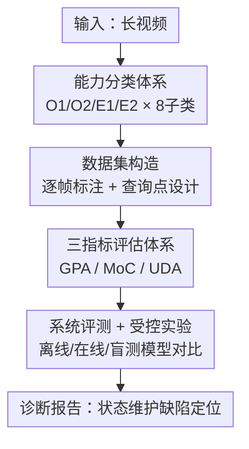

# SVCBench: A Streaming Video Counting Benchmark for Spatial-Temporal State Maintenance

**会议**: ECCV 2026  
**arXiv**: [2603.12703](https://arxiv.org/abs/2603.12703)  
**代码**: [https://buaa-colalab.github.io/SVCBench](https://buaa-colalab.github.io/SVCBench)  
**领域**: 视频理解  
**关键词**: 视频计数基准、流式视频理解、时空状态维护、视频语言模型评测

## 一句话总结

SVCBench 将视频计数重新定位为诊断视频语言模型「时空状态维护」能力的最小探针，通过流式多点查询观察预测轨迹，并设计三个互补指标揭示当前模型在周期事件计数和身份持续跟踪上的系统性缺陷。

## 研究背景与动机

视频理解研究一直关注模型能否「看懂」某一帧或某一片段，但一个更基础却被忽视的能力是：模型能否在视频持续播放过程中连续追踪和更新内部的世界状态表示？这种能力在具身智能、生活日志分析等应用中至关重要——比如室内导航中随时要知道某类物体出现了几次、运动员动作循环了多少圈。Video-MME、LVBench、MLVU 等大型长视频基准在语义理解的覆盖度上已相当成熟，但它们的评估粒度停在「一个问题 + 视频末尾一个答案」，看不到模型内部状态如何随时间演化——一个始终输出同一个数字的模型和一个真正追踪状态变化的模型，在传统评估下可能得分相近。

OVO-Bench、StreamingBench 等流式评估工作率先引入了时间戳查询的概念，但它们的查询窗口相对较短，且往往将具有不同跟踪语义要求的任务混在一起评估。以计数为例，「当前场景里有几把椅子」（需实时更新当前计数，可升可降）和「到目前共出现过几把不同的椅子」（需跨时序身份去重，单调不降）对模型提出的要求完全不同，却很少被区分开来。同样，「检测到几次瞬时动作」与「完成了几个完整周期的周期性动作」对边界检测能力的依赖程度也截然不同。没有一个基准专门将这些不同的状态维护子能力系统拆解、分别施压。

SVCBench 的切入点正是这一认知盲区：**核心 idea 是将计数重新定义为诊断「时空状态维护」的最小受控探针**——计数问题的答案具有明确的数值真相、无歧义、不依赖语言先验，而流式多点查询能直接暴露预测轨迹，从而定位状态更新在何时失败、失败的是哪种子能力。

## 方法详解

### 整体框架

SVCBench 是一套面向视频语言模型的能力诊断基准，其核心流程分为四个环节：构建分类体系（将状态维护能力分解为可评估的子类别）、数据集构造（视频采集 + 逐帧标注 + 流式查询点设计）、评估指标设计（三个互补指标覆盖精度、轨迹一致性、更新时机）、以及系统性模型评测与受控实验。

### 关键设计

**1. 状态维护能力分类体系：按跟踪语义将计数分解为 8 个子类**

现有计数评测将不同跟踪要求的任务混为一谈，导致诊断结论模糊。SVCBench 从「跟踪什么」和「如何更新」两个维度正交拆分能力：物体计数维度分为 O1（当前状态）和 O2（累积身份）；事件计数维度分为 E1（点事件）和 E2（跨度事件）。每个维度再细分两个子类，共 8 类。O1-Snap 查询当前可见数量（可升可降），O1-Delta 查询相对窗口起点的变化量；O2-Unique 查询视频开始到当前已出现的不同个体总数（单调不降），O2-Gain 查询时间窗口内新出现的个体数。E1-Action 计数瞬时动作的累计次数，E1-Transit 计数场景切换次数；E2-Periodic 计数完整动作周期数（需识别起止边界），E2-Episode 计数语义完整的活动片段数。这种分类体系的价值在于：O1 的预测轨迹允许升降，而 O2 的轨迹必须单调不降——若模型在 O2 任务上出现下降，说明它缺少跨时序身份持久化机制，而这一缺陷在混合评测中会被掩盖。

**2. 流式多点查询与逐帧标注：让预测轨迹而非孤立答案成为评估对象**

传统评测只在视频末尾问一个问题，无法定位模型在哪个时刻开始出错。SVCBench 沿时间线设计 3–8 个流式查询点（O1-Delta 和 O2-Gain 各设 1 个），对 406 段视频中 10,071 个事件发生时刻和物体状态变化时刻进行了逐帧精标，共生成 4,576 个查询点分布在 1,000 条 QA 上。查询点选取原则包括帧稳定性（避免运动模糊）、时间线覆盖（捕捉计数值的动态变化）、以及关键时刻优先（计数值发生变化的周围）。对于 E2-Periodic 类别，由于长周期视频稀缺，论文从 TOMATO 数据集筛选出 56 段具有无缝循环点的周期动作视频，通过精确的循环边界标注进行循环拼接，生成 2–3 分钟长视频，保证时间戳严格对齐无累积误差。这套逐帧标注让每个查询点的正确答案都可由之前的事件时刻机械推算，从而实现了零歧义的自动评分。

**3. 三指标互补诊断体系：GPA / MoC / UDA 覆盖不同失败模式**

单一指标无法区分「预测值不准」、「轨迹倒退」和「更新时机滞后」三种本质不同的失败模式，SVCBench 设计了三个互补指标。GPA（Gaussian Precision Accuracy）用高斯核衡量预测与真值的接近程度，令 $\sigma_i = 0.05 \cdot \max(g_i, 1)$，即以真值的 5% 作为容忍带宽，超过 15% 相对偏差（$3\sigma$）的预测得分趋近于零：

$$\text{GPA}_q = \frac{1}{n}\sum_{i=1}^{n}\exp\!\left(-\frac{(p_i - g_i)^2}{2\sigma_i^2}\right)$$

选择高斯软核而非绝对误差的动机在于：小模型倾向于保守地输出 0，大模型有时会输出真值十倍以上的数字，绝对误差会对后者极端惩罚，而高斯核能更合理地反映「接近程度」。MoC（Monotonicity Consistency）专门针对累积任务，检验预测序列是否满足单调不降约束——令 $v$ 为第一个违反单调性的位置，则 $\text{MoC}_q = (v-1)/(n-1)$，1 表示完全单调不降。UDA（Update Detection Accuracy）检验模型是否在世界状态真正发生变化的时刻更新预测，令 $S$ 为真值发生变化的相邻查询点集合，$\text{UDA}_q = \frac{1}{|S|}\sum_{i\in S}\mathbb{1}[p_i \neq p_{i-1}]$。三指标组合能准确区分失败模式：高 GPA+高 MoC+低 UDA 意味着数值准确且轨迹单调，但更新时机滞后；低 GPA+高 MoC 意味着数值偏差大但轨迹平滑，可能过度依赖语言先验。

**4. 受控实验：定位周期计数与身份持续性的失败机制**

仅靠整体指标难以判断失败是来自视觉感知瓶颈还是推理能力不足，论文设计了两组受控实验。针对 E2-Periodic 的极端失败（几乎所有模型 GPA < 4，人类 93.2），在视频左上角叠加显式周期计数标注（如「Current count: 5」）后，Gemini-3-Flash 的 GPA 从 3.9 跳升至 81.8（21 倍提升），单调性违反率从 43.8% 降至 6.2%。这说明模型具备推理累积计数的能力，瓶颈在于无法从视觉输入中检测周期边界，即缺乏鲁棒的视觉-时序对齐机制。针对 O2-Unique 的身份跟踪，论文构建了一个相机在室内原地旋转 60 圈、固定只有 1 把长椅的受控场景，正确答案始终为 1。三款主流模型（Gemini-3-Flash、Doubao-Seed-1.8、Qwen3-VL-8B）在前 10 圈 GPA 分别为 76.2、71.8、68.5，到 60 圈时均降至 23–36，逼近随机猜测水平，而人类全程保持 100。这条性能退化曲线表明：随着物体重复出现次数增加，模型内部的跨时序身份持久化表示逐渐崩溃，将每次出现都误认为新个体。

## 实验关键数据

### 主实验

| 模型类型 | 代表模型 | 整体 GPA | 整体 MoC | 整体 UDA |
|---------|---------|---------|---------|---------|
| 人类 | Human | **96.1** | **100.0** | **99.3** |
| 盲测 LLM（无视觉） | GPT-4-Turbo | 18.7 | 95.7 | 4.3 |
| 最强闭源多模态 | Gemini-3-Flash | **37.0** | 73.7 | 73.8 |
| 闭源次强 | Doubao-Seed-1.8 | 36.2 | 77.2 | 76.8 |
| 最强开源离线 | Qwen3-VL-8B (64帧) | 31.0 | **84.3** | 55.1 |
| 最强在线模型 | LiveStar | 19.9 | 86.4 | 36.8 |
| 最强在线（GPA） | Flash-VStream-7B | 23.4 | 78.5 | 34.7 |

E2-Periodic 子类上，人类 GPA 93.2，而最强模型 LiveStar 仅 11.1，其余模型几乎全部低于 4，是整个基准中人机差距最显著的子类。

### 消融实验

| 实验设置 | Gemini-3-Flash E2-Periodic GPA | MoC 单调性违反率 | 说明 |
|---------|-------------------------------|-----------------|------|
| 原始视频 | 3.9 | 43.8% | 模型几乎无法识别周期边界 |
| 叠加显式计数标注 | 81.8（+21×） | 6.2% | 跳过视觉感知瓶颈后接近人类水平 |
| 自然长周期视频验证 | 2.9（vs 3.9） | — | 失败与循环拼接构造方式无关 |

身份持续性退化实验（O2-Unique，1把长椅 60 次旋转）：

| 旋转圈数区间 | Gemini-3-Flash GPA | Doubao-Seed-1.8 GPA | Qwen3-VL-8B GPA | 人类 GPA |
|------------|-------------------|---------------------|-----------------|---------|
| 1–10 圈 | 76.2 | 71.8 | 68.5 | 100 |
| 51–60 圈 | 28.3 | 35.7 | 23.8 | 100 |

### 关键发现

- E2-Periodic 是全基准最难子类：几乎所有模型 GPA < 4，而叠加显式标注后 GPA 提升 21 倍，直接证明瓶颈在视觉感知而非推理——模型知道「要累积计数」，但不知道「何时该加 1」。
- 盲测 LLM（GPT-4-Turbo）MoC 高达 95.7，说明语言先验已包含「累积计数应单调不降」的知识，但其 GPA 仅 18.7、UDA 仅 4.3，表明视觉输入是精确状态维护和更新时机感知不可或缺的信息源。
- 开源模型 MoC（84+）普遍高于闭源模型（67–77），说明开源模型倾向于输出平滑单调序列，但牺牲了数值精度，可能反映了不同的训练策略取向。
- 在线模型在整体 GPA 上并不显著低于同参数量级的离线模型（Flash-VStream-7B 23.4 vs Qwen2.5-VL-7B 19.1），但在线模型精度随时间退化速度约为离线骨干的 2.5 倍，反映了流式状态压缩导致的历史信息损失。

## 亮点与洞察

- **用计数作为「最小探针」的设计哲学**：SVCBench 最核心的洞察是，计数答案具有数值真相、无歧义、无需语言判断，恰好能把「世界状态维护能力」和「语义理解能力」解耦。若换成开放式 QA（「人有没有做完饭」），真假难断；换成计数则有精确 ground truth。这个设计选择让所有评估结论都具有高可信度。
- **流式查询点揭示了传统终态评估根本无法发现的失败模式**：一个模型可以在最终时刻恰好猜对，却在整条预测轨迹上错得一塌糊涂；只有多点流式查询才能定位到「在第几分钟开始出错」。
- **受控实验「叠加标注」的巧妙设计**：通过在视频帧上直接叠加真实计数，论文把「视觉感知」和「数值推理」在评估层面解耦，给出了一种用于诊断 VLM 能力瓶颈的可复用实验范式。

## 局限与展望

- 数据规模相对较小（406 段视频，1,000 QA），原因是 E2-Periodic 和 O2-Unique 子类的逐帧精标成本极高；未来可借助目标检测和动作识别模型辅助半自动标注以扩大规模。
- 离线评估协议通过视频截断近似流式处理，每次查询时模型仍能重看截断段之前的全部历史，可能高估模型真实的状态维护能力；更理想的协议应强制增量处理。
- 目前仅评测了 4 款在线模型，在线架构的潜在优势尚未被充分展示；当前在线模型的状态压缩机制可能仍未充分优化。
- 评估仅使用视觉输入；引入音频模态（计数敲击声、说话人数）可进一步扩展状态维护的多模态诊断能力。
- E2-Periodic 的循环拼接来源于 TOMATO（CC BY-NC-SA），限制了该部分数据只能用于非商业学术研究。

## 相关工作与启发

- **vs Video-MME / LVBench / MLVU**：这些基准关注语义理解的广度（多任务覆盖、长视频范围），评估粒度是终态单次答案；SVCBench 关注状态维护能力的深度诊断，评估粒度是预测轨迹，两者在维度上正交互补。
- **vs OVO-Bench / StreamingBench**：OVO-Bench 系统化了在线评估的三种模式，StreamingBench 关注实时视觉理解，但两者查询窗口偏短、未区分不同跟踪语义；SVCBench 在此基础上专门拆解状态维护子能力并增加长期累积压力。
- **vs TOMATO / CountLLM**：TOMATO 包含动作计数的多任务评测，CountLLM 关注重复动作计数；SVCBench 将周期事件单独作为独立诊断子类，并通过流式多点查询+受控实验揭示了其机制瓶颈，是对这一方向的深化。

## 评分

- 新颖性: ⭐⭐⭐⭐ 将计数重定位为状态维护探针 + 8 子类分类体系是清晰的概念贡献，三指标互补设计有价值
- 实验充分度: ⭐⭐⭐⭐⭐ 系统评测 15 款模型 + 两组精心设计的受控实验 + 多项鲁棒性分析（采样率、置信区间、prompt 格式），数据非常充分
- 写作质量: ⭐⭐⭐⭐ 分类体系清晰，受控实验论证逻辑严密，局限性分析诚实
- 价值: ⭐⭐⭐⭐⭐ 揭示了当前 VLM 在时空状态维护上的系统性缺陷，为后续模型设计提供了清晰的改进方向

<!-- RELATED:START -->

## 相关论文

- [\[CVPR 2025\] VCBench: A Streaming Counting Benchmark for Spatial-Temporal State Maintenance in Long Videos](../../CVPR2025/object_detection/vcbench_a_streaming_counting_benchmark_for_spatial-temporal_state_maintenance_in.md)
- [\[ECCV 2026\] M4-SAR: A Multi-Resolution, Multi-Polarization, Multi-Scene, Multi-Source Dataset and Benchmark for optical-SAR Object Detection](m4-sar_a_multi-resolution_multi-polarization_multi-scene_multi-source_dataset_an.md)
- [\[ECCV 2026\] The Label Imitation Game: Turing Test Network for Zero-Shot Pseudo-Label Pruning](the_label_imitation_game_turing_test_network_for_zero-shot_pseudo-label_pruning.md)
- [\[ECCV 2026\] MSPL: Multi-Step Pseudo-Labeling for Open-Vocabulary Object Detection](mspl_multi-step_pseudo-labeling_for_open-vocabulary_object_detection.md)
- [\[ECCV 2026\] VLOD-TTA: Test-Time Adaptation of Vision-Language Object Detectors](vlod-tta_test-time_adaptation_of_vision-language_object_detectors.md)

<!-- RELATED:END -->
