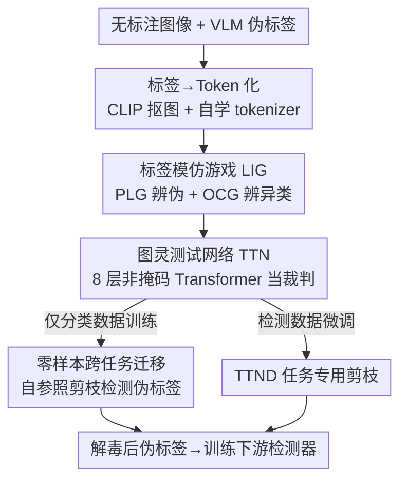

# The Label Imitation Game: Turing Test Network for Zero-Shot Pseudo-Label Pruning

**会议**: ECCV 2026  
**arXiv**: [2606.30875](https://arxiv.org/abs/2606.30875)  
**代码**: [https://github.com/voxel51/ttn](https://github.com/voxel51/ttn)  
**领域**: 目标检测  
**关键词**: 伪标签剪枝, 零样本任务迁移, 噪声鲁棒学习, 基础模型幻觉, 半监督检测

## 一句话总结
把「伪标签剪枝」形式化成一场图灵测试式的对抗审讯，训练一个只在图像分类数据上学过、却能零样本迁移去审判目标检测伪标签的轻量「裁判网络」（TTN），靠数据集级语义上下文识别并剔除基础模型的系统性幻觉，让最差类别的 F1 提升 28%（微调后 44%）。

## 研究背景与动机
用基础视觉-语言模型（VLM）做伪标注是当下最诱人的「零成本」数据引擎——像 Grounding DINO、YOLO-World、YOLOE 这类开放词表检测器，只要给个文本提示就能在海量无标注图像上生成检测框，把人工标注的高昂开销降到接近于零。但这条路有个致命软肋：VLM 会「幻觉」，即预测出视觉上根本不存在、或语义上不一致的目标，而且这些幻觉常常带着很高的置信度出现。传统做法是设一个固定置信度阈值来滤噪，可作者的实验发现这套逻辑南辕北辙——高阈值一刀切，往往把真实但低置信的标签误杀，同时又把那些「自信地错着」的结构化幻觉原封不动地留下。更糟的是，这些残留的幻觉一旦进入下游训练，会造成归纳干扰（inductive interference），把下游检测器往错误方向带偏。

问题的核心矛盾在于：判断一个伪标签是真是假，不能只看它自己的置信分或它周围的局部特征，而要放到「整个数据集这一类到底长什么样」的全局语义语境里去审视。现有的空间-几何式验证方法（比如用嵌入相似度剪掉冗余检测框）只依赖局部特征相似性，抓不住这种全局层面的语义不一致；而直接上大语言模型当裁判又太贵。作者想要的是一个轻量、事后、免人工监督、且不改动 VLM 架构和下游训练管线的「审讯者」，它能像人一样把候选标签摆到一堆参考样本中间去分辨真伪。

于是作者从图灵 1950 年的「模仿游戏」得到灵感：图灵测试问的是「机器的行为能否与人类不可区分」，而这里要问的是「哪些伪标签与人类标注者给出的标签不可区分」——不可区分即意味着高精度。**核心 idea：把伪标签剪枝形式化为「标签模仿游戏」（Label Imitation Game, LIG）——给一个裁判同时看「理想标签集」和「候选伪标签」，让它在数据集级参考上下文中判断每个候选是否与理想集不可区分，可区分者即幻觉、予以剔除；用这套游戏训练出的图灵测试网络（TTN）充当裁判，并意外获得从图像分类到目标检测的零样本跨任务迁移能力。**

## 方法详解

### 整体框架
方法可以拆成「怎么定义游戏 → 怎么把标签变成 token → 怎么训练裁判 → 怎么在推理时用裁判剪枝」四段。输入是一堆带伪标签的无标注图像，输出是被「解毒」（detoxify）后的干净伪标签子集 $\tilde Y \subseteq \hat Y$，再拿去训练下游检测器。整条链路的关键是：裁判 TTN 全程不需要知道类别标签，它只在一段序列里（前面放参考样本、末尾放待审候选）用非掩码自注意力横向比对，输出每个 token 的 Accept/Reject logit。

值得强调的一个反直觉设计是：基线 TTN **只在图像分类数据上训练**（8 个数据集、1303 个类，且刻意隐去类别名），却能零样本迁移去剪检测伪标签——因为训练时逼它从纯高保真序列里学「语义边界」而非「类别映射」，这套内化的语义逻辑天然可迁移。若想进一步榨性能，再用检测数据 + 每类 ≤100 个人工标签微调出任务专用变体 TTND。

### 关键设计

**1. 标签模仿游戏（LIG）：把剪枝重铸成一场对抗审讯**

传统阈值滤噪是「孤立地看每个标签配不配留下」，而 LIG 换了个提问方式：给裁判一个由「理想标签」（Ideal，人类高保真标注）和「候选标签」（Candidate，待审伪标签）混成的集合，裁判必须指认出哪些属于候选集。直觉是——如果某个候选 token 与理想集显著可区分，它对应的伪标签八成不准，该拒；反过来，越接近理想集精度的候选就越「不可区分」，该收。作者具体设计了两种互补的游戏：**PLG（伪标签游戏）** 直接混合「准确人工标签生成的理想 token $G^*$」和「伪标注数据生成的候选 token $\hat G$」，让裁判找出哪些来自 $\hat G$；**OCG（跨类别游戏）** 则构造一批同属目标类 $c^*$ 的同质理想 token 和一批严格属于其它类的候选 token，让裁判在**不被告知目标类是什么**的前提下，指认出哪些是异类。OCG 的巧妙之处有二：它逼裁判靠参考集的「密度」自己推断目标身份（因此约定 $|G(c^*)| > |G(\neg c^*)|$ 提供足够的参照密度），从而学到「这一类应该长什么样」的语义边界；同时它能从任意分类数据里凭空造出海量训练样本，为后面纯分类训练铺路。最终把两种游戏统记为 $h$，剪枝结果就是裁判在 $G^* \cup \hat G$ 上接受的候选、再映射回原标签。

**2. 标签-数据 Token 化：让 Transformer 能横向比对每一个标签**

Transformer 的看家本领是在输出前跨所有输入做迭代式上下文比对，要复用这个能力就得先把「标签 + 数据」融成 token。作者定义一个函数 $g(x,y)=\{g_1,\dots,g_n\}$，把每张图 $x$ 上每个标签 $y$ 对应的图像 patch 编码成一个比原图低维的 token，且 token 与标签一一对应——这意味着「标签剪枝」被等价重写成「token 剪枝」，选出 $\tilde G \subseteq \hat G$ 后可通过 $g^{-1}$ 双射地还原回标签 $\tilde Y$。具体实现上（见架构），$g$ 由两级构成：先用**冻结的 CLIP ViT-L/14** 把标签框定的图像 patch 编码成 768 维特征，再用一个**自学的轻量 MLP tokenizer**（1024 维全连接 → ReLU → 512 维全连接 → Dropout 0.2）压成 512 维 TTN token。之所以要在冻结 CLIP 之上再学一层 tokenizer，是因为静态 CLIP 嵌入和 Transformer 推理空间之间有鸿沟；消融也证实基于 TTN token 的 kNN 剪枝优于直接用 CLIP 嵌入，说明这层自学 token 确实提炼出了更利于审讯的表示。

**3. 非掩码 Transformer 裁判 + 参考/候选序列协议：靠上下文而非记忆做判断**

TTN 的核心是一个 8 层 Transformer 推理块，用 **非掩码多头自注意力**——不同于把样本孤立处理的普通分类器，它让一段序列里的众多标签 token 彼此可见、互相比对，从而把「候选到底像不像参考」这件事显式建模出来（还加了可学习位置编码以保留序列/关系上下文），最后对每个 token 输出 Accept/Reject logit。为了逼它真正「用上下文审讯」而不是「背特征」，训练协议规定每条序列前 10 个位置从理想状态（$S=1$）采样组成**参考集**（且限定参考类别实例数 $N>10$ 以保证语境稳健），末尾一个位置留给从完整分布采样的**候选槽**，形成 10:1 的参考-候选比。这样一来，裁判要判候选真伪，就必须回头看前面这 10 个参考样本长什么样。训练目标是一个加权二元交叉熵：

$$\mathcal{L}_{\text{BCE}}(w) := -\sum_{i=1}^{n}\Big[p_w\, y_i \log\big(\sigma(z_i)\big) + (1-y_i)\log\big(1-\sigma(z_i)\big)\Big]$$

其中 $y_i=1$ 表示该 token 应被拒（仅当它是异类/伪标签），$\sigma(z_i)$ 是模型估计的「该拒」概率，$p_w$ 是施加在 Reject 样本上的正权重——作者把它形象地称为「剪枝激进度」（pruning aggression）：$p_w$ 越大剪得越狠、精度升但召回降。基线 TTN 用 $p_w=1$，而保守的 TTND 用 $p_w=0.2$，只在幻觉证据很强时才动手，以压低误拒。

**4. 零样本跨任务迁移与自参照剪枝：只学分类却能审检测**

这是全文最惊艳的一步。基线 TTN 训练时只从**人工核验的分类数据**采样（$\pi_1=\pi_2=\tfrac12$，伪标签概率 $\pi_3=\pi_4=0$），完全不碰噪声伪标签、也不碰检测专属格式——正因如此，它被逼着内化一套「与具体任务无关的语义逻辑」，而非死记某种检测框特征。作者还特意混入 CIFAR、Fashion-MNIST 等低分辨率数据集，天然充当尺度变化的课程学习（模拟小目标伪标签常见的像素退化）。训练完后，推理阶段用**自参照剪枝**（Self-Referential Pruning）来免人工监督地剪检测标签：对每个目标类，先从该类置信度最高的 ≤1000 个伪标签里构造一个「理想集」$G(c^*)$，再对该类每个候选（包括被选进理想集的那些）跑一轮自参照 LIG——拿它和从 $G(c^*)$ 抽的 10 个参考比对，跨多局游戏聚合 logit，若聚合分 $>0$ 就剪掉。这套流程让 TTN 能揪出即便初始置信很高的系统性幻觉；而参考样本不足（$|G(c^*)|<10$）的类则保留原伪标签，避免无语境乱剪。

### 损失函数 / 训练策略
基线 TTN：BCE 损失（式 7），$p_w=1$，batch 256，SGD（weight decay $5\times10^{-4}$，lr $5\times10^{-3}$），每个数据集每 epoch 贡献 1000 条序列，20% 留作验证选模；训练 10 万 epoch（在 9 万 checkpoint 选），单张 L40S 约 61 小时。训练分布覆盖四种互斥状态：$S{=}1$ 理想人工标签（同类）、$S{=}2$ OCG-人工（异类人工标签）、$S{=}3$ OCG-伪（异类伪标签）、$S{=}4$ PLG（同类任意保真度伪标签）；调整 $\pi_k$ 即可控制游戏难度。TTND 微调：从 TTN 权重出发，用 YOLOW/YOLOE/GDINO 三个 VLM 在 $\tau{=}0.1$ 生成伪标签（且只取每类最低置信四分位以放大幻觉信号），采样分布改为 $\pi_1{=}\tfrac12,\pi_2{=}\tfrac14,\pi_3{=}\pi_4{=}\tfrac18$，$p_w{=}0.2$，lr 0.02 跑 4000 epoch（2000 选），仅需 4.28 小时。

## 实验关键数据

### 主实验
在 Auto-Labeling（AL）基准上评测，覆盖 GDINO/YOLOE/YOLOW 三个 VLM、多个置信阈值 $\tau\in[0.05,0.5]$ 和 VOC/COCO/LVIS/BDD 四个检测数据集。下表为按 VLM、置信阈值、类别平均后的整体伪标签质量与下游检测器性能（`LIG*` 是「剪掉所有 IoU<0.5」的 IoU-Oracle 上界）：

| 方法 | Overall Recall | Overall Prec. | Overall F1 | Overall mAP50 | 说明 |
|------|------|------|------|------|------|
| AL [15]（不剪枝基线） | 0.453 | 0.400 | 0.362 | 0.350 | 全量伪标签 |
| TTN（零样本） | 0.426 | 0.436 | 0.376 | 0.355 | F1 +4%，仅分类训练 |
| TTND（微调） | 0.437 | 0.447 | 0.387 | 0.362 | F1 +7% |
| LIG* Oracle | 0.454 | 0.815 | 0.525 | 0.382 | F1 上界 +45% |

关键读法：剪枝天然会略降召回，但精度提升更显著，故整体 F1 在所有数据集都上涨；TTND 把 AL→LIG* 之间 38% 的 mAP50 差距、43% 的 mAP50:95 差距补上，说明它剪掉的多是对下游训练特别有害的幻觉。下游 mAP 增益在**低置信阈值**区尤为明显——把 low-$\tau$、高召回区解毒后，等于给下游检测器扩出了「更大但更干净」的可用训练分布。

### 最难类别（Category Revival）
真正的看点在最差类别。在 $\tau{=}0.1$ 下对 AL 的最高 / 最低（非零）F1 类别做定向评测：

| 类别组 | 方法 | Mean F1 | 相对 AL |
|--------|------|---------|---------|
| Max. F1（最好类） | AL | 0.661 | — |
|  | TTN | 0.688 | +4% |
|  | TTND | 0.705 | +7% |
| Min. F1（最差类） | AL | 0.133 | — |
|  | TTN | 0.170 | **+28%** |
|  | TTND | 0.192 | **+44%** |
|  | LIG* | 0.575 | +432% |

Min. F1 类的 +432% Oracle 上界揭示：这些最差类根本不缺数据，而是被极高的噪声-信号比压垮。更戏剧性的是 **Category Revival**：LVIS 上 $\tau{=}0.1$ 时 AL 对 259 个脆弱类零召回，零样本 TTN 让其中 37 个类恢复了非平凡召回（TTND 恢复 28 个）——把「毒信号」剪掉后，下游模型从零召回起死回生。BDDv 上 TTND 剪掉 53% 标签、仅掉 3% 召回，却把精度/F1/mAP50/mAP50:95 近乎翻倍。

### 关键发现
- **贡献最大的是语义上下文而非空间几何**：TTN/TTND 的全 kNN 变体（用 TTN token）优于 CLIP-kNN，而完整 TTN 架构即便零样本也超过所有用了真值标签的 kNN 基线，证明「学到的语义-上下文逻辑」是比「局部空间-几何验证」更鲁棒的剪枝依据。
- **剪枝激进度 $p_w$ 是精度-召回旋钮**：$p_w$ 太低（0.1）从头训练会退化成「全部接受」，性能等同 AL 基线；TTND 选 $p_w{=}0.2$ 拿到最高 F2。
- **序列配置有甜点**：10 参考 : 1 候选、token 维度 512 均为最优；参考集从 ≤1000 缩到 ≤100 虽提升参考集自身准确率（63.6%→70.9%），却因语境广度下降而略损最终 F2。
- **三种游戏缺一不可**：单看个体游戏，OCG-Pseudo 最强、其次 OCG-Human 和 PLG，但用全部游戏的 nominal TTND 表现最佳。

## 亮点与洞察
- 把图灵测试从「评价对话智能」创造性地挪用为「评价伪标签保真度」——不可区分即高精度，这个类比让「剪枝」有了一个干净的对抗博弈形式化框架，且与源模型解耦、任务无关。
- 最反直觉也最有价值的一点：**只在图像分类上训练的裁判能零样本迁移去审判目标检测伪标签**。秘诀是训练时刻意隐去类别名、只喂人工核验数据，逼模型学「什么叫语义一致」而非「这是猫那是狗」，这套内化逻辑天然跨任务。
- 非掩码自注意力 + 参考/候选序列协议，把「判真伪」显式变成「和一堆参考横向比对」，这个把 in-context 比对能力用于噪声过滤的思路，可迁移到任何「有少量干净参考、要筛大量嘈杂候选」的场景（如数据清洗、异常检测）。
- 「解毒」视角很实用：剪枝的真正收益不在标签指标本身，而在下游模型能从零召回类别复活，说明系统性幻觉造成的归纳干扰远比想象严重，事后审讯是全自动伪标注管线的关键一环。

## 局限与展望
- 作者坦承存在「Post-Engine Interrogation Frontier」：最优剪枝区间恰恰包含低置信标签（最真实的信号常被传统滤波误杀），TTND 虽大幅缩小差距，但对更微妙、更难辨的幻觉仍力有未逮；作者设想用多模型共识和 LIG-aware 的空间冗余削减来进一步补齐。
- 剪枝以「降召回换升精度」为代价，在本身召回就极低的数据集（如 LVIS，Recall 仅 0.13 左右）上，整体收益的绝对值有限；对召回敏感的应用需谨慎权衡 $p_w$。
- 自参照剪枝依赖「该类高置信伪标签能构成靠谱理想集」这一前提，对参考样本不足（$|G(c^*)|<10$）的长尾类只能保留原标签、无法剪枝，恰恰这些类可能最需要清洗。
- 方法目前只验证了 2D 图像检测；作者把拓展到视频与 3D 模态列为未来方向——这些模态的时序/几何噪声结构与静态图像差异较大，能否直接套用尚待验证。

## 相关工作与启发
- **vs 固定阈值滤噪（Co-teaching / MentorNet 等）**: 他们用固定 loss/置信阈值孤立地判每个标签，本文指出这会误杀低置信真标签、留下「自信地错」的结构化幻觉；TTN 改用数据集级语义上下文做全局审讯，抓的是阈值抓不到的全局不一致。
- **vs 空间-几何验证（FeatureNMS 等嵌入剪冗余）**: 他们靠局部特征相似度剪冗余检测框，本文主张「学到的语义-上下文逻辑」是比局部空间-几何验证更鲁棒的替代，实验中完整 TTN 零样本即超过用真值的 kNN 基线。
- **vs LLM-as-a-Judge**: 同样是「用基础模型当裁判」的范式，但直接上大 LLM 太贵且难做复杂空间-语义审讯；TTN 是个仅 26.5M 参数的轻量判别器，单类并行剪枝可压到亚分钟级，成本相对被审的基础模型微不足道。
- **vs AL（Auto-Labeling）基线 [15]**: AL 是本文实验所依托的伪标注基准（同样零样本、不改检测管线），本文在其之上加了一层事后剪枝，把 AL 的 F1 与下游 mAP 系统性推高，尤其救活了 AL 会零召回的脆弱类。

## 评分
- 新颖性: ⭐⭐⭐⭐⭐ 把图灵测试重铸为伪标签剪枝的对抗博弈，且实现「只学分类→零样本审检测」的跨任务迁移，视角独到。
- 实验充分度: ⭐⭐⭐⭐⭐ 四数据集 × 三 VLM × 多阈值，含标签质量、下游 mAP、脆弱类、runtime 与丰富消融，还给出 IoU-Oracle 上界作参照。
- 写作质量: ⭐⭐⭐⭐ 形式化清晰、故事线（模仿游戏 → 裁判 → 复活）连贯；符号略密，个别公式需对照原文。
- 价值: ⭐⭐⭐⭐⭐ 开源预训练权重 + 代码，是可即插即用、免人工监督、不改管线的轻量剪枝模块，对大规模伪标注管线有直接工程价值。

<!-- RELATED:START -->

## 相关论文

- [\[CVPR 2026\] SFR-Net: Steering-Fusion-Refining Network in Multi-label Zero-Shot Sewer Defect Detection](../../CVPR2026/object_detection/sfr-net_steering-fusion-refining_network_in_multi-label_zero-shot_sewer_defect_d.md)
- [\[ECCV 2026\] $S^{2}$-FracMix: Label-Preserving Self-Saliency Mixup Augmentation](s2-fracmix_label-preserving_self-saliency_mixup_augmentation.md)
- [\[ICLR 2026\] Point2RBox-v3: Self-Bootstrapping from Point Annotations via Integrated Pseudo-Label Refinement and Utilization](../../ICLR2026/object_detection/point2rbox-v3_self-bootstrapping_from_point_annotations_via_integrated_pseudo-la.md)
- [\[ECCV 2026\] Robust Zero-shot Anomaly Detection under Limited Auxiliary Anomaly Priors](robust_zero-shot_anomaly_detection_under_limited_auxiliary_anomaly_priors.md)
- [\[ECCV 2026\] MSPL: Multi-Step Pseudo-Labeling for Open-Vocabulary Object Detection](mspl_multi-step_pseudo-labeling_for_open-vocabulary_object_detection.md)

<!-- RELATED:END -->
