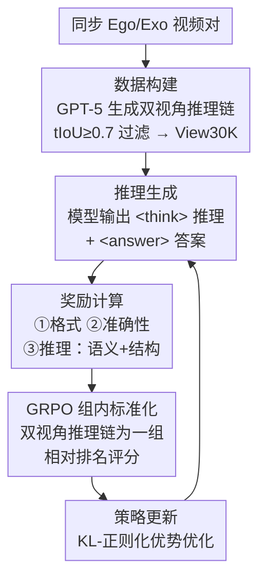

# EgoExo-Con: 探索视角不变性的视频时序理解  

**会议**: ECCV 2026  
**arXiv**: [2510.26113](https://arxiv.org/abs/2510.26113)  
**代码**: 有（项目主页已放出）  
**领域**: 多模态 VLM  
**关键词**: 视频时序理解, 视角不变性, 第一/三人称视频, 强化学习, GRPO, 视频大语言模型  

## 一句话总结
本文构建 EgoExo-Con 同步第一/第三人称视频时序评测基准，揭示 Video-LLM 跨视角一致性严重不足（远低于单视角表现），并提出 View-GRPO 框架，利用分组相对策略优化和显式推理奖励让模型学会视角特异推理和跨视角一致理解，在两个骨干网络上带来了显著的跨视角一致性提升。  

## 研究背景与动机  

Video-LLM 在问答和时序定位上已展现出不错的单视角能力，但几乎所有基准都假设固定或轻微变化的摄像机视角（通常是第三人称固定机位）。真实世界的视频感知远非如此——同一个事件从第一人称（头戴相机）和第三人称（三角架固定机位）拍下来，画面几乎像两个世界：第一人称受限视野、摇晃严重但手-物交互清晰；第三人称能看清全身动作但细粒度手部操作可能被遮挡。对人类来说视角切换几乎不影响时序判断，因为事件的时间结构（先切菜后炒锅的顺序）是视角不变的。  

然而，Video-LLM 真的学到了这种视角不变的时序理解吗？作者的系统性实验给出了一个反直觉的回答：模型在单一视角下表现尚可（验证准确率约 55–70%，定位 R1@0.5 约 12–28%），但跨视角一致性指标断崖式下降，往往只有单视角性能的一半左右（验证一致性 30–50%，定位一致性低至 3–20%）。更令人意外的是，**简单地把两个视角的视频混在一起 SFT 训练并没有帮助**——在某些情况下反而比只用一个视角训练更差（如 TimeSuite 在 CharadesEgo 上双视角训练的一致性为 51.3%，而仅用第三人称训练为 59.5%）。这意味着粗暴混合视角引入了冲突先验，模型被视角特有的视觉偏差信号淹没，反而削弱了共享的时序结构信号。  

这一核心矛盾在于：跨视角时序理解需要模型同时具备视角特异的视觉推理能力（知道从第一人称如何判断动作边界）和跨视角的输出一致性（两个视角的答案必须对齐），但现有 SFT 训练范式无法解耦这两个目标。本文的双管齐下方案是：先构建一个高质量的同步视频基准来精准刻画问题，再设计一个强化学习框架让模型在保留视角特有推理的同时，主动对齐跨视角的时序理解输出。**核心 idea：提出 EgoExo-Con 同步双视角基准暴露跨视角时序不一致问题，并设计 View-GRPO 框架，通过分组相对策略优化（GRPO）和由语义对齐+跨视角结构一致性组成的推理奖励，让 Video-LLM 内化视角不变的时序推理能力。**  

## 方法详解  

### 整体框架  

View-GRPO 的训练和推理流程分为三个层次。数据层：对每个同步视频对，用 GPT-5 分别生成第一人称和第三人称的步骤化时序推理链（观察到什么、什么动作发生、何时开始何时结束），确保双视角最终答案一致，过滤掉推理质量差的样本后得到 3.3k 视频约 30k 推理实例（View30K）。推理层：对每个视角的视频，Video-LLM 按 `<think>...</think><answer>...</answer>` 格式输出推理链和答案。优化层：以同一视频的双视角推理链作为一个 GRPO 组，分别计算格式、准确性和推理三项奖励，在组内做相对标准化后按 KL-正则化目标更新策略。  

### 关键设计  

**1. EgoExo-Con 基准构建：三源数据精炼出双视角时序评测集**  

现有数据集虽包含双视角视频但原始查询质量参差：CharadesEgo 的查询基于模板缺乏细节，LEMMA 的 HOI 标签过于原子化，更关键的是某些查询元素在一个视角完全不可见（如微笑只在第三人称能看到）。作者建立了一条严谨的清洗管线：首先将 LEMMA 的逐帧 HOI 标签聚合为自然语言查询；然后调用 GPT-4o 对查询做语义丰富化并生成一个含无关内容的"错配查询"作为时序验证的负样本；最终由四名人类评估者逐条校验每个查询在两个视角是否能准确对应到视频内容。通过这一过程，最终获得 1,148 个同步视频和 2,269 条紧贴时间戳的高质量查询，覆盖日常人-物交互和复杂技能任务（修自行车、攀岩等）。这一构建过程的重要启示是：公开数据集中相当多"看似可双视角回答"的查询经过精细检查并不合格，之前社区对跨视角评估的假设过于乐观。  

**2. 推理奖励分解：语义保真 + 跨视角结构对齐**  

直接让两个视角输出相同答案的约束太粗糙，会抹杀视角独有的视觉信号。作者把推理奖励拆为两项：语义奖励 `r_sem` 调用 LLM Judge 判断生成推理与参考推理的语义相似度，确保每个视角内的推理质量保真于 GPT-5 的高质量参考；结构奖励 `r_struct` 从两个视角的推理链中分别提取动作集和物体集（通过 spaCy 解析），计算它们的 Jaccard 重叠系数。公式为 `r_struct(o) = (Jac(A(o), A(õ)) + Jac(O(o), O(õ))) / 2`，强制跨视角在提到的基本动作和对象上保持一致。最终推理奖励为 `r_reasoning = λ·r_sem + (1-λ)·r_struct`（实验中 λ=0.7）。这个设计的精妙在于：语义项保视角内推理质量，结构项保跨视角动作/对象一致性——两项在 GRPO 组内标准化机制下协同发挥作用，让模型自然学会"共享时序结构、保留视角细节"。  

**3. View-GRPO 分组优化：将 GRPO 从单视角推广到跨视角**  

原始 GRPO 对同一 prompt 生成 G 个候选，组内标准化奖励后再优化。View-GRPO 将其改造为：以同一视频的双视角推理链作为一组候选（组内同时包含 ego 和 exo 的推理，各 G/2 个），对每个推理计算 `r_total = r_acc + r_format + r_reasoning` 三项之和，然后在该组内做标准化（减均值、除标准差）。组内标准化天然地通过相对排名把"跨视角一致且各视角准确"的推理链推高——因为如果一个推理链只在其中一个视角准、另一视角乱猜，它的总奖励会被同组另一视角的准确推理链通过标准化机制"压低"。GRPO 依赖相对排名而非绝对分数，因此对奖励函数的校准误差不敏感，比 SFT 或 PPO 更稳定。  

### 损失函数 / 训练策略  

骨干网络为 Qwen2.5-VL（3B/7B）和 InternVL3.5-8B。冻结视觉编码器，仅更新 LLM 参数。帧采样 2 FPS，最大像素 2.8M。AdamW 学习率 1e-6，每卡 batch size 8，8 张 A100，共约 2k 步。推理奖励 λ=0.7。对比基线包括：View30K 的 SFT 微调（直接用推理数据做监督学习）和 naive GRPO（不使用推理奖励，仅格式+准确）。  

## 实验关键数据  

### 主实验  

| 骨干 | 方法 | V-Exo | V-Ego | V-ExoEgo | G-Exo | G-Ego | G-ExoEgo |
|------|------|-------|-------|----------|-------|-------|----------|
| Qwen2.5-VL-7B | zero-shot | 54.3 | 56.3 | 33.0 | 14.2 | 11.4 | 6.9 |
| | +SFT | 57.6 | 58.0 | 41.4 | 18.3 | 17.8 | 14.9 |
| | +GRPO | 55.2 | 57.6 | 39.8 | 18.6 | 16.1 | 14.3 |
| | **+View-GRPO** | **58.6** | **58.2** | **45.1** | **22.0** | **21.6** | **18.7** |
| InternVL3.5-8B | zero-shot | 64.4 | 64.7 | 50.7 | 12.8 | 6.7 | 3.0 |
| | **+View-GRPO** | **73.1** | **74.4** | **62.4** | **20.5** | **16.8** | **10.6** |

View-GRPO 在所有指标上显著超过零样本、SFT 和 naive GRPO 基线。跨视角一致性提升尤为突出：Qwen2.5-VL-7B 的验证一致性（V-ExoEgo）从 33.0% 提升至 45.1%（+12.1%），定位一致性（G-ExoEgo）从 6.9% 提升至 18.7%（+11.8%），均大幅超越 SFT 和 naive GRPO 的效果。  

### 消融实验  

| 配置 | V-ExoEgo | G-ExoEgo | 说明 |
|------|----------|----------|------|
| GRPO 基线 | 39.8 | 14.3 | 无推理奖励 |
| +r_sem 语义奖励 | 44.7 | 18.3 | 加入语义对齐后一致性显著提升 |
| +r_sem+r_struct 全量 | 45.1 | 18.7 | 再加结构对齐继续小幅提升 |

### 关键发现  
- 语义奖励 r_sem 是对一致性改进的最大贡献者，结构奖励 r_struct 在此基础上提供额外 0.4–0.5% 小幅增益  
- 推理链长度最佳为 256 token：128 token 信息不足致准确率低，512 token 易引入幻觉导致准确率下降  
- LLM Judge 的校准很关键：Qwen2.5-0.5B 作为 Judge 从一开始就给推理奖励过高分数，导致优化退化和一致性下降 3%  
- 泛化能力强：在 Video-MME（无字幕设置 61.1 → 69.7）和 TVGBench（R1@0.5 19.5 → 25.0）上均显著提升，说明学到的是通用时序推理而非数据集特化  

## 亮点与洞察  
- **双视角 GRPO 分组创新**：把 GRPO 从"同一 prompt 多候选"改造为"同一事件双视角推理链为一组"，让组内相对排名天然促进跨视角一致，无需显式对齐损失函数  
- **推理奖励拆解策略**：语义项保视角内推理质量，结构项保跨视角动作/对象一致性——两项在 GRPO 组内标准化下协同优化，是方法获得最大收益的设计点  
- **反直觉发现：SFT 混合双视角反而有害**：在 TimeSuite 等模型上，使用双视角数据 SFT 训练的一致性低于仅使用单视角，这一发现对未来跨视角/多模态对齐研究有重要参考价值  
- **基准建设的高质量标准**：逐条人工校验查询，暴露了社区对已有数据集跨视角评估适用性的过于乐观假设  

## 局限与展望  
- View30K 推理数据依赖 GPT-5 生成，质量和覆盖范围受限于闭源模型的能力上限，可能存在缺失某些视角真实分布的模式  
- 训练需 8 卡 A100，成本较高，且冻结视觉编码器的设计对更大规模数据是否最优存疑（实验表明解冻视觉编码器未见提升，可能受限于数据量不足）  
- 目前仅验证时序验证和时序定位两个任务，对动作预测、动作识别等其他视频理解任务的效果未知  
- 作者指出大规模同步双视角视频采集成本极高，未来可探索从单视角视频合成另一视角来扩展训练数据  

## 相关工作与启发  
- **vs TimeChat-VT**：TimeChat-VT 专注于一致性建模但使用指令微调（VTune），View-GRPO 通过 GRPO+推理奖励更主动地优化一致性，最终效果显著更好  
- **vs EgoExoBench（同期工作）**：EgoExoBench 用选择题评估跨视角动作排序，但不评估预测一致性也不提改进方案；本文同时提供评测基准和可落地方案  
- **vs 传统对比学习跨视角方法**：Sigurdsson 等用对比学习做视角不变表示学习，聚焦特征对齐而非推理级别的时序理解，View-GRPO 的优势在于直接优化推理链  

## 评分  
- 新颖性: ⭐⭐⭐⭐ 跨视角时序理解在 Video-LLM 时代是第一个系统性评测和方法，View-GRPO 的分组设计新颖  
- 实验充分度: ⭐⭐⭐⭐⭐ 覆盖 10 个模型、跨 3 个测试子集+2 个外部基准、详尽的消融和泛化实验  
- 写作质量: ⭐⭐⭐⭐⭐ 问题动机推进清晰，实验发现组织有序，图表对应良好  
- 价值: ⭐⭐⭐⭐⭐ 基准暴露社区盲点，方法可推广到其他跨视角/跨模态对齐和一致性评测场景

<!-- RELATED:START -->

## 相关论文

- [\[ECCV 2026\] SVCBench: A Streaming Video Counting Benchmark for Spatial-Temporal State Maintenance](svcbench_a_streaming_video_counting_benchmark_for_spatial-temporal_state_mainten.md)
- [\[ECCV 2026\] MATCH: Flow Matching for Multi-View Anomaly Detection](match_flow_matching_for_multi-view_anomaly_detection.md)
- [\[ECCV 2026\] VLOD-TTA: Test-Time Adaptation of Vision-Language Object Detectors](vlod-tta_test-time_adaptation_of_vision-language_object_detectors.md)
- [\[ECCV 2026\] MSPL: Multi-Step Pseudo-Labeling for Open-Vocabulary Object Detection](mspl_multi-step_pseudo-labeling_for_open-vocabulary_object_detection.md)
- [\[ECCV 2026\] Robust Zero-shot Anomaly Detection under Limited Auxiliary Anomaly Priors](robust_zero-shot_anomaly_detection_under_limited_auxiliary_anomaly_priors.md)

<!-- RELATED:END -->
