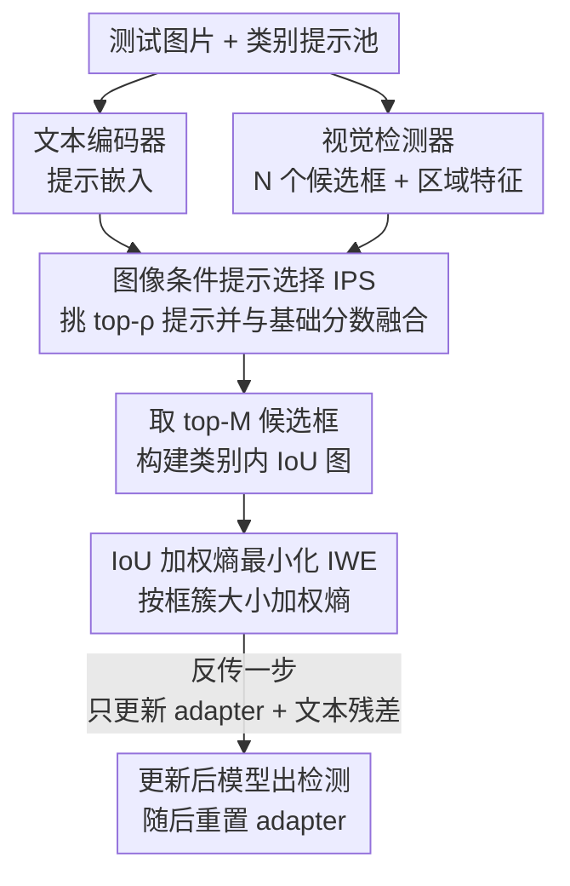

# VLOD-TTA: Test-Time Adaptation of Vision-Language Object Detectors

**会议**: ECCV 2026  
**arXiv**: [2510.00458](https://arxiv.org/abs/2510.00458)  
**代码**: [https://github.com/imatif17/VLOD-TTA](https://github.com/imatif17/VLOD-TTA)  
**领域**: 目标检测  
**关键词**: 测试时自适应, 视觉语言目标检测, 熵最小化, 提示选择, 分布偏移

## 一句话总结
针对 YOLO-World、Grounding DINO 这类视觉语言目标检测器在测试时遇到分布偏移就掉点的问题，VLOD-TTA 用「IoU 加权熵最小化」把自适应聚焦到空间上密集重叠的候选框簇，再用「图像条件下的提示选择」挑出与当前图片最匹配的文本提示，只更新极少量 adapter 参数，就能在艺术风格、恶劣驾驶、低光、常见退化等多种偏移下稳定超过已有 TTA 基线和上一代专用方法，且开销远低。

## 研究背景与动机
视觉语言目标检测器（VLOD）近年靠大规模图文预训练把区域特征和文本对齐，获得了很强的零样本泛化——给一句类别文本就能检测新类别，YOLO-World 甚至能做到实时。但一旦离开预训练分布，比如从自然照片切到水彩画、从白天切到夜晚、遇到运动模糊或压缩噪声，它们的定位和分类精度都会明显退化。离线的 source-free 域适应虽然能缓解，却要求预先收集好目标域数据、离线训练，这在真实部署里往往不现实：环境是在线变化的，模型必须一边推理一边适应。这就把问题指向了测试时自适应（TTA）——只用无标注的测试数据在线调模型。

问题在于，TTA 在视觉语言分类上已经研究得比较充分，在 VLOD 上却几乎是空白。唯一的先例 TTAOD-F 采用「多模态提示 + 均值教师 + 记忆增强伪标签」的框架，效果不错，但代价很重：它要额外维护一个教师检测器、多跑一次前向来生成伪标签、还要用 DINOv2 特征做记忆检索，测试时的显存和延迟都被顶得很高；而且它是为 transformer 检测器量身定制的，没法直接迁到 YOLO-World 这类 CNN 检测器上。另一条更轻的路子是照搬分类里的熵最小化，但直接搬到检测上有两个硬伤：一是它只会把最高类别分数往上锐化，容易让本来定位就错的候选框变得过度自信，放大确认偏置；二是它把每个候选框同等看待，孤立框、跨实例框和一簇空间一致的重叠框权重一样——论文用图 1 举例，标准熵最小化会把人和狗的分数一起抬高，最后凭空多检出一只并不存在的狗。此外，VLM 里常用的「多模板提示取平均」在 VLOD 上几乎没用甚至有害：图 2 里提示平均反而把人的分数压到了检测阈值以下，直接漏检。

作者由此看到了一个被忽视的结构性信号：现代检测器每张图会吐出成百上千个稠密重叠的候选框，它们本质上是对同一个物体的部分冗余视角。真物体周围通常聚着一大簇预测类别一致、互相高度重叠的框，而假目标往往是零散孤立的。**核心 idea：用候选框之间的 IoU 重叠结构给熵重新加权、让自适应偏向空间一致的框簇（IWE），同时按图像内容为每个类别挑选最相关的文本提示、而非一味平均（IPS），两者配合、只调轻量 adapter，就能在极低开销下显著提升 VLOD 在分布偏移下的鲁棒性。**

## 方法详解

### 整体框架
VLOD-TTA 的目标是：给一张来自未知目标域的测试图片和一组类别提示，在线地、只用这一张图的信息把检测器调好，然后立刻用调好的模型出检测结果。整体只有两个可训练组件叠在一个冻结的 VLOD 之上——图像条件提示选择（IPS）负责在打分阶段挑出对当前图最有用的文本提示并与检测器原始分数融合，IoU 加权熵最小化（IWE）负责把这些融合后的候选框分数按空间重叠结构加权、构成自适应目标。

具体一次推理的流转是：输入图片先过视觉检测器得到 N 个候选框及其区域特征，类别提示池过文本编码器得到嵌入；IPS 对每个类别算出每条提示与当前图的兼容度，只保留 top-ρ 的提示、把它们的相似度平均得到每个候选框的类别分数，再和检测器基础分数做加权融合；接着按融合分数取 top-M 个高置信候选框，用它们构建类别内的 IoU 图，得到每个框的权重；IWE 用这些权重对候选框的熵加权求和作为损失，只反传一步、只更新 adapter 和一个文本残差向量。因为是在单张图上适应，更新出来的参数不指望能泛化到别的图，所以每出一次预测就把 adapter 重置回零初始化，处理下一张图重新开始。

### 关键设计

**1. IoU 加权熵最小化 IWE：用重叠框簇的大小当权重，把熵最小化聚焦到可信区域**

标准熵最小化把每个候选框独立对待，孤立框和一簇空间一致的重叠框权重一样，于是它会在不可靠区域也硬锐化预测、放大确认偏置——这正是凭空多检出一只狗的根源。IWE 的做法是先看每个候选框预测的类别 $\hat{c}_i=\arg\max_k p_{i,k}$，对每个类别 $c$ 单独建一张 IoU 图 $G_c$：顶点是所有预测为 $c$ 的框，两个框只要 $\mathrm{IoU}\ge\theta$ 就连一条边。这样真物体周围那一大簇互相重叠的框会连成一个大连通分量，孤立框自成一个小分量。设 $\mathcal{C}(i)$ 是框 $i$ 所在连通分量、$|\mathcal{C}(i)|$ 是它的大小，权重取 $w_i=|\mathcal{C}(i)|^{\gamma}$，指数 $\gamma\ge0$ 控制簇大小的影响强度，最终目标是加权平均熵：

$$\mathcal{L}_{\mathrm{IoU\text{-}Ent}}=\frac{\sum_{i=1}^{N} w_i\,\mathcal{H}(\mathbf{p}_i)}{\sum_{i=1}^{N} w_i}.$$

关键细节是权重只依赖 IoU 图、反传时当常数处理，梯度只从熵 $\mathcal{H}(\mathbf{p}_i)$ 流回去。这样一来，大簇（更可能是真物体）主导优化、孤立框被压低影响，模型只在密集一致的区域变自信，从根上抑制了标准熵那种「什么都往上抬」的确认偏置。作者还验证这个 IoU 加权原则可以迁移到伪标签式 TTA（IWPL），说明它是个通用思想而非只对熵最小化有效。

**2. 图像条件提示选择 IPS：按当前图挑最匹配的提示，取代无差别的提示平均**

VLM 常用「每类多个模板取平均」来提鲁棒性，但作者发现这套在 VLOD 上收益很有限甚至掉点——提示平均会把有用信号和噪声一起摊平，图 2 里就把人的分数压到阈值以下漏检了。IPS 换成按图挑：对每个类别 $k$ 的每条提示 $t$，先算它和当前图所有候选框特征的平均余弦相似度 $r_{k,t}=\frac{1}{N}\sum_i \hat{\mathbf{v}}_i^\top \hat{\mathbf{e}}_{k,t}$ 作为「图像条件兼容度」，衡量这条提示和当前图内容有多贴合（论文在附录证明最大化 $r_{k,t}$ 等价于最小化归一化特征间的均方欧氏距离）。然后每个类别只留下兼容度最高的 top-ρ 那批提示 $\mathcal{S}_k$，候选框的类别分数只在选中的提示上平均 $\tilde{z}_{i,k}=\frac{1}{|\mathcal{S}_k|}\sum_{t\in\mathcal{S}_k} z_{i,k,t}$。

为进一步对齐文本和区域嵌入，IPS 还在文本嵌入空间加一个可学习残差向量 $\Delta$，让每条提示嵌入变成 $\tilde{\mathbf{e}}_{k,t}=(\mathbf{e}_{k,t}+\Delta)/\lVert\mathbf{e}_{k,t}+\Delta\rVert_2$，这也是测试时更新的少数参数之一。最后把选择得到的分数和检测器基础分数 $s_{i,k}$ 做加权融合 $g_{i,k}=\lambda\tilde{z}_{i,k}+(1-\lambda)s_{i,k}$。之所以要保留基础分数而非只用选中提示，是因为 VLOD 的早期视觉-文本融合让区域特征本身就依赖文本嵌入，$\lambda$ 太大反而会丢掉检测器原始提示携带的信息——实验里 YOLO-World 用 $\lambda=0.3$、融合更早更深的 Grounding DINO 只用 $\lambda=0.1$。

**3. 单图零初始化 adapter 更新：按架构差异放置 adapter，一步适应后即重置**

VLOD-TTA 原则上能调任意参数子集，但为了轻量和防过拟合，它冻住主干、只更新极少的 adapter 参数 $\Phi$ 和文本残差 $\Delta$，测试开始时全部零初始化。放哪个模块是按检测器架构决定的：YOLO-World 的检测器和文本编码器几乎解耦、只在最后打分阶段交互，所以把 Conv-Adapter 插进视觉 backbone 和 neck（消融显示调 backbone 单独就 +4.4 AP50，调文本编码器几乎没用）；Grounding DINO 是早期跨模态融合、文本特征贯穿定位和分类，反过来把 MLP-Adapter 只插进文本编码器（调它 +3.3 AP50，调视觉编码器反而掉点，且它 172M 参数太大、单图容易过拟合）。

流程上，拿到融合分数 $g_{i,k}$ 后先按 $\max_k g_{i,k}$ 取 top-M 候选框（加速 IoU 图构建），用 IWE 目标只做一步适应，反传更新 $(\Phi,\Delta)$。因为是在单张测试图上适应、更新出的参数不指望跨图泛化，每出完一次预测就把 $(\Phi,\Delta)$ 重置回零初始化，下一张图从头再来。这套「零初始化 + 单步 + 出图即重置」既保证了每张图的适应互不干扰，又把测试时开销压到只有一次前向加一次反向。

### 损失函数 / 训练策略
唯一的自适应损失就是 IWE 的加权熵 $\mathcal{L}_{\mathrm{IoU\text{-}Ent}}$（式 3）。关键超参：IoU 阈值 $\theta$（建图，0.5–0.7 稳定）、簇大小指数 $\gamma=1.1$（0.6–1.6 稳定）、top-M 候选框 $M=600$、融合系数 $\lambda$（YW 0.3 / GD 0.1）、提示选择比例 $\rho=0.25$。每张图 batch size = 1、单步适应，面向实时部署；每类用 ChatGPT 生成 T=16 条数据集无关的提示；adapter 用零初始化保证起点等于预训练函数。

## 实验关键数据

### 主实验
在六个域偏移数据集（Watercolor / ClipArt / Comic 艺术风格，Cityscapes / BDD100K 驾驶，ExDark 低光）加两个退化基准（PASCAL-C / COCO-C，15 种退化 × 5 级），YOLO-World 和 Grounding DINO 双检测器上评测，共 96 个测试场景。

| 数据集(YW) | 指标 | ZS | 最强基线(Adapter) | VLOD-TTA |
|--------|------|------|----------|------|
| Watercolor | AP50 | 47.9 | 51.5 | **53.1** |
| ClipArt | AP50 | 40.1 | 44.1 | **45.4** |
| Comic | AP50 | 29.4 | 34.7 | **36.1** |
| BDD100K | mAP | 13.3 | 13.7 | **14.6** |
| PASCAL-C | AP50 均值 | 34.6 | 37.0 | **38.5** |

风格偏移上 VLOD-TTA 相对 ZS 平均涨 YW +3.3 mAP / +5.8 AP50、GD +2.4 mAP / +3.3 AP50；PASCAL-C 上每种退化都是最优，JPEG 压缩 +8.2、玻璃模糊 +7.0 提升最大。GD 上 ClipArt mAP 从 38.4 涨到 41.2、Comic 从 31.2 涨到 34.2，涨幅比 YW 更大。

### 消融实验

| 配置(YW, 三风格集均值) | AP50 | 说明 |
|------|---------|------|
| ZS | ~39.1 | 零样本基线 |
| Adapter(标准熵) | ~43.4 | 普通熵最小化 |
| + IWE | ~44.3 | 换成 IoU 加权熵，稳定涨 |
| Full (IWE + IPS) | ~44.9 | 两者叠加最好 |

效率对比（COCO-C / GD）尤其关键：VLOD-TTA 平均 mAP 26.2 略高于上一代 TTAOD-F 的 26.0，但总参数 173.9M vs 629.9M、延迟 531.6 vs 701.9 ms/img、显存 3.76 vs 11.37 GB，全面更省；用与 TTAOD-F 相同的 warm-start 初始化得到 VLOD-TTA* 进一步涨到 27.3，在几乎所有退化组超过 TTAOD-F。可调参数仅 0.89M（VLOD-TTA*为 0.95M）。

### 关键发现
- 两个组件都正贡献且互补：IWE 单独就稳定超过标准熵 Adapter，再加 IPS 继续涨；提示平均在 Watercolor/Comic 反而掉 AP50（−0.35 / −0.30），提示选择三个集都涨、平均 +1.0。
- IWE 不是只对熵有效：把 IoU 加权搬进伪标签式 TTA（IWPL）同样稳定超过普通伪标签，说明「按重叠簇加权」是通用原则。
- 目标域未知使得逐数据集调学习率不现实，所以用 adapter（单一 5e-3 学习率跨数据集就好）而非 BN（需 1e-2/3e-2 逐集调）；但 VLOD-TTA 的目标对 BN 也有效，说明不绑定特定参数子集。
- 弱项在 Cityscapes：rider 和 person 标签易混（IWE 会把模糊的 rider 往 person 簇推）、小目标多且默认 640 分辨率把远处车/人缩没了。合并 rider→person、把分辨率提到 1024 后，VLOD-TTA 在 Cityscapes 涨幅从 +0.6 mAP 放大到 +2.7 mAP，印证小目标缺乏稳定重叠框是主因。

## 亮点与洞察
- 把「稠密重叠候选框」从冗余负担变成有用信号：真物体周围框会聚成大簇、假目标零散，用连通分量大小当熵权重，一步就把确认偏置从根上压住——这个观察简单却切中检测 TTA 的要害。
- 权重当常数、梯度只走熵，是个很干净的工程选择：既用上了空间结构，又不让不可导的图构建挡住反传。
- IPS 的「图像条件兼容度」给出了提示为什么该按图挑而非平均的量化依据，并有余弦-欧氏等价的理论支撑；这个思路可迁到任何 open-vocabulary 任务的提示工程。
- 按架构差异放 adapter（YW 调视觉、GD 调文本）体现了对早/晚融合本质的理解，不是无脑到处插 adapter。

## 局限与展望
- 作者承认：小目标密集、重叠框稀疏的场景（如 Cityscapes）IWE 收益受限，需要靠提分辨率或合并近义类缓解。
- 仍比零样本慢，因为测试时要反传；作者展望无梯度（gradient-free）自适应来进一步降延迟。
- 单图适应 + 每图重置意味着不积累跨图知识，遇到连续同分布的流数据可能没充分利用；提示池由固定 GPT 生成，数据集无关提示虽实用但不如数据集特定提示（后者不现实故未用）。
- IWE 对 rider/person 这类语义高度重叠的类别会把歧义往主导类推，可能加剧细粒度混淆。

## 相关工作与启发
- **vs TTAOD-F**: 同为 VLOD 专用 TTA，但 TTAOD-F 用均值教师 + 双提示微调 + DINOv2 记忆，要维护第二个检测器、多跑前向，重且只适配 transformer；VLOD-TTA 用单步熵目标、无教师前向，CNN/transformer 通吃，精度略高而开销大幅下降。
- **vs Tent / 标准熵最小化**: Tent 把候选框独立对待、只锐化最高分，易在不可靠区域过自信；VLOD-TTA 用 IoU 结构加权，只在空间一致簇上锐化。
- **vs CLIP 式提示平均**: CLIP 靠多模板平均提零样本精度，但在 VLOD 上平均收益微弱甚至有害；IPS 改为按图选择最相关提示并与基础分数融合。
- **vs TPT / VPT / DPE**: 这些从分类迁来的提示/缓存 TTA 在图像级操作、不涉及区域候选，VLOD-TTA 做候选框级自适应，同时管定位和分类。

## 评分
- 新颖性: ⭐⭐⭐⭐ 首个轻量、跨 CNN/transformer 的 VLOD TTA，IoU 加权熵的切入点巧且此前空白。
- 实验充分度: ⭐⭐⭐⭐⭐ 6 数据集 + 15 退化 × 5 级 + 双检测器共 96 场景，含效率、backbone、专业域、失败案例全套消融。
- 写作质量: ⭐⭐⭐⭐ 动机图示清晰、方法交代完整，失败案例分析诚实。
- 价值: ⭐⭐⭐⭐ 实时部署友好、精度-效率权衡明显更优，IoU 加权原则可迁移到伪标签 TTA。

<!-- RELATED:START -->

## 相关论文

- [\[ICCV 2025\] Visual Modality Prompt for Adapting Vision-Language Object Detectors](../../ICCV2025/object_detection/visual_modality_prompt_for_adapting_vision-language_object_detectors.md)
- [\[AAAI 2026\] Correcting False Alarms from Unseen: Adapting Graph Anomaly Detectors at Test Time](../../AAAI2026/object_detection/correcting_false_alarms_from_unseen_adapting_graph_anomaly_detectors_at_test_tim.md)
- [\[CVPR 2026\] CD-Buffer: Complementary Dual-Buffer Framework for Test-Time Adaptation in Adverse Weather Object Detection](../../CVPR2026/object_detection/cd-buffer_complementary_dual-buffer_framework_for_test-time_adaptation_in_advers.md)
- [\[AAAI 2026\] Harnessing Vision-Language Models for Time Series Anomaly Detection](../../AAAI2026/object_detection/harnessing_vision-language_models_for_time_series_anomaly_detection.md)
- [\[ICCV 2025\] EvRT-DETR: Latent Space Adaptation of Image Detectors for Event-based Vision](../../ICCV2025/object_detection/evrt-detr_latent_space_adaptation_of_image_detectors_for_event-based_vision.md)

<!-- RELATED:END -->
