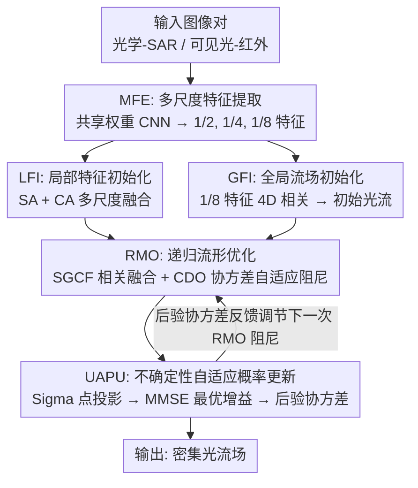

# RBE-Flow: Recurrent Bayesian Estimation on Feature Manifolds for Cross-Modal Registration

**会议**: ECCV 2026  
**arXiv**: [2606.30492](https://arxiv.org/abs/2606.30492)  
**代码**: [https://github.com/NEU-Liuxuecong/RBE-Flow](https://github.com/NEU-Liuxuecong/RBE-Flow)  
**领域**: 图像配准 / 多模态感知  
**关键词**: 跨模态配准, 贝叶斯估计, 光流估计, 特征流形, 不确定性建模

## 一句话总结
将跨模态密集光流估计重新建模为特征流形上的闭环递归贝叶斯状态估计问题，通过 RMO（递归流形优化）生成带不确定性的流观测、UAPU（不确定性自适应概率更新）用 Sigma 点投影进行 MMSE 最优贝叶斯融合并将后验协方差反馈调节下一次优化，在 OSdataset、WHU-OPT-SAR 和 RoadScene 三个跨模态数据集上一致达到 SOTA，AEPE 相比此前最佳方法降低 45.4%。

## 研究背景与动机
跨模态图像配准（如光学-SAR、可见光-红外）是多传感器感知的基础能力，支撑遥感分析、三维场景理解和自主导航等下游应用。然而，异构传感器固有的非线性辐射差异（如强度反转、散斑噪声、光谱间隙）和几何变形（视点变化、尺度差异、局部形变）严重违反标准光度对齐假设，使得匹配景观高度非凸、充满局部极小值。现有确定性匹配方法缺乏不确定性感知能力，在模糊区域容易积累错误更新，导致配准失败——不确定性通常仅被用作事后分析的被动输出，而非推理过程的主动组件。

核心矛盾在于：跨模态匹配本质上是一个高度不确定的推断问题，但现有方法将其当作确定性前馈回归来处理。本文的目标是将光流估计重新框定为动态状态估计问题，让系统在每一步都能根据自身的预测置信度调整优化行为。切入角度是在特征流形上进行局部非线性优化以产生似然证据，再通过递归贝叶斯更新实现误差自校正。**核心 idea**：将 RMO（在特征流形上求解阻尼非线性最小二乘产生流观测+不确定性）与 UAPU（用 Sigma 点投影融合先验与似然、输出后验协方差）紧耦合为闭环，后验协方差反馈调节下一次 RMO 的阻尼强度，使系统在高不确定性区域自动转为保守的梯度下降、在低不确定性区域保持高效的高斯-牛顿步。

## 方法详解

### 整体框架
RBE-Flow 将跨模态光流估计构造为一个"先验初始化-似然观测生成-贝叶斯后验更新-协方差反馈"的闭环递归系统。输入是一对跨模态图像（如光学-SAR 或可见光-红外），输出是密集像素级光流场。整个流程分为初始化阶段和递归迭代阶段：首先用共享权重 CNN 提取 1/2、1/4、1/8 三个尺度的特征（MFE），然后通过自注意力和交叉注意力融合多尺度特征（LFI），同时在 1/8 尺度上计算 4D 相关体积得到初始光流场（GFI），以此构成递归贝叶斯估计的先验均值。进入迭代循环后，RMO 模块利用谱熵引导的多尺度相关融合（SGCF）和协方差自适应阻尼优化（CDO）在特征流形上求解局部非线性最小二乘，生成流观测及其不确定性；UAPU 模块通过确定性 Sigma 点投影将观测与先验融合，计算 MMSE 最优的贝叶斯增益和更新后的后验均值和协方差；后验协方差被反馈回 RMO，调节下一轮优化的阻尼系数——不确定性高时走保守梯度下降，低时走高效率高斯-牛顿步。

### 关键设计

**1. RMO：谱熵引导相关融合与协方差自适应阻尼优化**

RMO 是贝叶斯估计中的"观测生成器"，核心假设是高维图像特征并非随机散布在环境空间中，而是位于一个低维非线性流形上，因此光流估计本质上是寻找该流形上连接对应特征的最短路径。RMO 需要同时产出流观测值及其关联的观测噪声协方差。

RMO 内部包含两个关键机制。第一个是谱熵引导的相关融合（SGCF）：为捕捉流形的多尺度几何结构，RMO 构造两层相关体积——局部窗口相关 $C_{L0}$ 捕获高频细节，池化特征相关 $C_{L1}$ 提供低频全局一致性。对每层相关体积，先通过 softmax 得到概率分布 $\mathbf{p}$，计算谱熵 $\mathcal{H}(\mathbf{u}) = -\sum_i p_i \log p_i$，再将两层相关体积及其各自熵值拼接送入轻量网络 $\Phi_{\text{Spec}}$，经 softmax 输出自适应融合权重 $[\omega_{L0}, \omega_{L1}]$，最终融合相关 $C_{\text{fused}} = \omega_{L0} \cdot C_{L0} + \omega_{L1} \cdot C_{L1}$。这个机制让网络根据当前区域的匹配歧义程度动态调节对不同尺度信息的依赖——纹理丰富区域更多依赖局部细节，低纹理区域更多依赖全局上下文。

第二个是协方差自适应阻尼优化（CDO）：RMO 用多头 ConvGRU 直接预测后续 LM 计算所需的雅可比 $\boldsymbol{J}_k$、残差梯度 $\mathbf{g}_k$ 和阻尼度量 $\lambda_k$。关键创新是将 UAPU 输出的上一时刻后验协方差 $\boldsymbol{P}_{k-1|k-1}$ 引入阻尼调节：

$$\lambda'_k = \lambda_k + \beta \cdot \operatorname{tr}(\boldsymbol{P}_{k-1|k-1})$$

当先验不确定性高时（$\operatorname{tr}(\boldsymbol{P}_{k-1|k-1})$ 大），$\lambda'_k$ 增大，LM 更新自然从高斯-牛顿步向更保守的梯度下降步过渡。流增量通过求解 $(\boldsymbol{J}_k^{\top}\boldsymbol{J}_k + \lambda'_k\boldsymbol{I})\Delta\boldsymbol{Flow}_k = -\boldsymbol{J}_k^{\top}\mathbf{g}_k$ 得到，最终流观测 $\boldsymbol{Z}_k = \hat{\boldsymbol{Flow}}_{k-1} + \Delta\boldsymbol{Flow}_k$。观测噪声协方差 $\boldsymbol{R}_k$ 由轻量 ConvNet 估计，共同构成似然的完整参数。

**2. UAPU：不确定性自适应的贝叶斯后验更新**

RMO 的观测在局部代价曲面上是准确的，但从全局视角看可能存在遮挡或运动边界带来的误差。UAPU 的核心思路是将流细化建模为非线性置信传播问题：每步取上一时刻的后验分布作为先验信念，与 RMO 提供的似然证据通过贝叶斯公式融合，计算当前后验分布，从而实现误差自校正。

先验传播建模为随机游走：$\hat{\boldsymbol{Flow}}_{k|k-1} = \hat{\boldsymbol{Flow}}_{k-1|k-1}$，并通过 QNet $\Psi_Q$ 自适应预测空间异质的过程噪声 $\boldsymbol{Q}_k$，得到先验协方差 $\boldsymbol{P}_{k|k-1} = \boldsymbol{P}_{k-1|k-1} + \boldsymbol{Q}_k$。引入 Cholesky 分解 $\boldsymbol{S}$ 保证数值稳定和半正定性。

由于特征流形的强非线性，对状态到观测空间的映射做局部线性化会引入不可忽略的截断误差。UAPU 采用类似无迹变换（Unscented Transform）的策略：在先验均值 $\hat{\boldsymbol{Flow}}_{k|k-1}$ 周围生成 $2L+1=5$ 个确定性 Sigma 采样点（1 个中心点 + 4 个沿流形主轴的对称扰动点），通过可学习的观测网络 $\text{ObsNet}(\cdot)$（轻量 1x1 卷积 MLP）投影到观测空间得到 $\mathbf{Z}_k^{(i)}$，再通过加权平均得到预测观测均值 $\hat{\boldsymbol{Z}}_k = \sum_{i=0}^{4} W_m^{(i)}\mathbf{Z}_k^{(i)}$，权重 $W_m^{(0)} = \frac{\lambda_{\text{scale}}}{L+\lambda_{\text{scale}}}$。

融合阶段计算新息协方差 $\boldsymbol{P}_{zz} = \sum_{i=0}^{4} W_c^{(i)}(\boldsymbol{Z}_k^{(i)} - \hat{\boldsymbol{Z}}_k)(\boldsymbol{Z}_k^{(i)} - \hat{\boldsymbol{Z}}_k)^{\top} + \boldsymbol{R}_k$ 和状态-测量互协方差 $\boldsymbol{P}_{xz} = \sum_{i=0}^{4} W_c^{(i)}(\boldsymbol{X}_k^{(i)} - \hat{\boldsymbol{Flow}}_{k|k-1})(\boldsymbol{Z}_k^{(i)} - \hat{\boldsymbol{Z}}_k)^{\top}$，在高斯近似假设下最小化后验估计均方误差等价于求解最优贝叶斯融合增益 $\mathcal{K}_k = \boldsymbol{P}_{xz}\boldsymbol{P}_{zz}^{-1}$，后验更新为 $\hat{\boldsymbol{Flow}}_{k|k} = \hat{\boldsymbol{Flow}}_{k|k-1} + \mathcal{K}_k(\boldsymbol{Z}_k - \hat{\boldsymbol{Z}}_k)$，后验协方差 $\boldsymbol{P}_{k|k} = \boldsymbol{P}_{k|k-1} - \mathcal{K}_k\boldsymbol{P}_{zz}\mathcal{K}_k^{\top}$。这个更新通过收缩先验不确定性空间来限制信息增益，在不可靠区域自动降权观测证据。

### 损失函数 / 训练策略

采用多阶段混合监督策略，桥接确定性全局对齐和随机局部细化。

**初始化损失**：对 GFI 生成的初始光流 $\boldsymbol{Flow}_{\text{init}}$ 用简单 L1 监督，将真值光流下采样到与 $\boldsymbol{Flow}_{\text{init}}$ 相同分辨率后计算 L1 距离：$\mathcal{L}_{\text{init}} = \frac{1}{N}\sum_{\mathbf{p}}|\boldsymbol{Flow}_{\text{init}} - \boldsymbol{Flow}_{\text{gt}}|$。

**几何感知整流 NLL 损失**：标准 NLL 目标常导致方差退化——模型通过预测趋近于零的方差来最小化惩罚，引发梯度爆炸。为此引入几何感知整流机制，对预测方差施加随几何误差尺度变化的动态下界：

$$(\hat{\sigma}_k^{(j)})^2 = \text{softplus}(s_k^{(j)}) + \alpha \cdot (\hat{\boldsymbol{Flow}}_k^{(j)} - \boldsymbol{Flow}_{\text{gt}}^{(j)})^2 + \epsilon$$

其中 $\mathbf{S}$ 是 UAPU 输出的 Cholesky 因子。第 k 次迭代的 NLL 损失为 $\mathcal{L}_{\text{NLL}}^{(k)} = \frac{1}{2}\sum_{j\in\{x,y\}}\left(\log(\hat{\sigma}_k^{(j)})^2 + \frac{(\hat{\boldsymbol{Flow}}_k^{(j)} - \boldsymbol{Flow}_{\text{gt}}^{(j)})^2}{(\hat{\sigma}_k^{(j)})^2}\right)$。对所有 $N_{\text{iter}}$ 次迭代施加指数衰减深度监督 $\gamma=0.9$，总损失 $\mathcal{L}_{\text{total}} = \lambda_{\text{init}}\mathcal{L}_{\text{init}} + \lambda_{\text{NLL}}\mathcal{L}_{\text{NLL}}$。该设计迫使高误差区域具有高不确定性，防止"过度自信却错误"的病态。

训练以 XoFTR 公开预训练权重初始化，在 RoadScene、WHU-OPT-SAR 和 OSdataset 上端到端微调，学习率 $3\times10^{-4}$，batch size 8，输入裁剪为 $64\times64$ patch，数据增强包含随机缩放 [0.9, 1.1]、旋转 [-30, 30] 和最多 15 像素的平移。

## 实验关键数据

### 主实验

在 OSdataset（光学-SAR，森林/农田/河流）、WHU-OPT-SAR（复杂城市场景光学-SAR）和 RoadScene（RGB-IR 街景）三个数据集上与手工特征、稀疏匹配、半稠密匹配和稠密匹配共 9 个代表性方法对比。

| 方法 | OSdataset AEPE | OSdataset CMR@1px | WHU-OPT-SAR AEPE | WHU-OPT-SAR CMR@1px | RoadScene AEPE | RoadScene CMR@1px |
|------|:---:|:---:|:---:|:---:|:---:|:---:|
| HOWP (ISPRS'23) | 20.39 | 0.3 | 157.14 | 0.0 | 16.67 | 0.2 |
| LNIFT (TGRS'22) | 46.98 | 0.3 | 167.00 | 0.0 | 28.89 | 0.1 |
| MSG (TGRS'25) | 44.50 | 0.3 | 120.97 | 0.1 | 43.59 | 0.0 |
| RIFT2 (TIP'20) | 29.83 | 0.7 | 214.08 | 0.0 | 29.45 | 0.0 |
| GMFlow (TPAMI'23) | 5.13 | 2.1 | 3.57 | 2.7 | 4.42 | 0.5 |
| XoFTR (CVPR'24) | 5.41 | 0.0 | 18.05 | 0.0 | 6.00 | 0.0 |
| RAFT (ECCV'20) | 2.89 | 14.0 | 2.07 | 25.4 | 1.79 | 31.3 |
| ADRNet (TGRS'24) | 1.41 | 50.5 | 1.43 | 52.9 | 0.98 | 71.3 |
| GDROS (TGRS'25) | 1.51 | 48.8 | 2.87 | 28.7 | 0.68 | 79.0 |
| **RBE-Flow** | **0.77** | **78.5** | **0.53** | **91.0** | **0.49** | **90.8** |

RBE-Flow 在所有三个数据集上均达到最优 AEPE。在 OSdataset 上将 AEPE 从 ADRNet 的 1.41px 降至 0.77px（相对降低 45.4%）；在 WHU-OPT-SAR 上 AEPE 仅为 0.53px，相比第二名 ADRNet 的 1.43px 提升近 3 倍；在 RoadScene 上 AEPE 为 0.49px，且 CMR@0.3px 达到 37.7%，远超其他方法。最关键的是，现有方法在严格阈值下（$t<1\text{px}$）性能普遍急剧下降，而 RBE-Flow 仍保持稳健的匹配率，体现了其子像素高精度对齐的独特优势。

### 消融实验

从基线（CNN 多尺度编码 + LFI + L1 损失）出发，逐步加入各组件。

| 配置 | OSdataset AEPE | OSdataset CMR@1px | WHU-OPT-SAR AEPE | WHU-OPT-SAR CMR@1px | RoadScene AEPE | RoadScene CMR@1px |
|------|:---:|:---:|:---:|:---:|:---:|:---:|
| (1) A+L1 (基线) | 1.32 | 22.9 | 5.52 | 2.5 | 0.69 | 87.4 |
| (2) A+L1+GFI | 0.98 | 61.8 | 1.10 | 47.3 | 0.64 | 87.3 |
| (3) A+GFI+loss (整流 NLL) | 0.91 | 66.7 | 0.76 | 82.9 | 0.59 | 89.0 |
| (4) A+GFI+loss+RMO | 0.84 | 71.9 | 0.61 | 89.3 | 0.54 | 89.8 |
| (5) A+GFI+loss+RMO+UAPU (完整) | **0.77** | **78.5** | **0.53** | **91.0** | **0.49** | **90.8** |

逐组件分析：(2) GFI 通过计算密集特征相关提供可靠的初始流场，WHU-OPT-SAR 上 AEPE 从 5.52 降至 1.10，说明全局相关步骤对解决大位移至关重要。(3) 将标准 L1 替换为几何感知整流 NLL 后，WHU-OPT-SAR 上 CMR@1px 从 47.3% 跳升至 82.9%，验证了概率监督优于确定性回归。(4) RMO 引入流形上的局部非线性优化和协方差自适应阻尼，RoadScene 上的 CMR@0.3px 从 12.6% 升至 26.9%。(5) 最后加入 UAPU 形成完整的闭环不确定性反馈，在 OSdataset 和 WHU-OPT-SAR 的最严格 0.3px 阈值上 CMR 分别从 3.1% 升至 11.6%、从 11.9% 升至 24.0%。

### 关键发现
- **最大贡献来自 UAPU 闭环**：RMO+UAPU 的协同效应在严格子像素阈值下尤为显著，去掉 UAPU 后 CMR@0.3px 骤降超过 60%。
- **整流 NLL 对稳定性至关重要**：标准 NLL 训练的方差常退化至零，几何感知整流的下界机制是训练稳定的关键使能因素。
- **效率优异**：参数量 14.3M，单张 RTX 4090 推理平均 1.48ms/对，每次迭代仅 0.13ms。完整框架（RMO+UAPU）相比纯确定性的 RMO-only 基线仅增加 12.9% 的每步时间开销（+29.42ms），UAPU 内存开销仅 +0.002GB，总峰值 GPU 内存控制在 10.16GB。
- **泛化能力强**：传统方法和通用光流估计器（如 RAFT、GMFlow）在 WHU-OPT-SAR 这类剧烈模态差异数据上几乎失效，RBE-Flow 仍保持 91.0% 的 CMR@1px。

## 亮点与洞察
- **不确定性从被动输出变为主动控制信号**：绝大多数方法将不确定性当作后验分析工具，本文首次在密集跨模态光流中将后验协方差反馈回优化器阻尼参数，形成真正的"confidence-driven optimization"闭环。这个设计思路可以迁移到任何迭代细化任务中——只要细化过程有可调步长参数，就可以用贝叶斯后验方差做自适应调节。
- **Sigma 点投影桥接非线性和解析最优性**：UAPU 用 5 个确定性采样点而非线性化来处理特征流形的强非线性，既避免了扩展卡尔曼滤波的截断误差，又保留了 MMSE 最优增益的闭式解。这是一种巧妙的"精度-可微性"折中，对需要端到端训练的概率状态估计任务有普遍参考价值。
- **几何感知整流 NLL 防止方差崩溃**：通过在方差中显式加入几何误差驱动的下界 $(\hat{\boldsymbol{Flow}} - \boldsymbol{Flow}_{\text{gt}})^2$，强迫模型在高误差区域不自欺欺人地预测零方差。这比加一个固定下界 $\epsilon$ 更合理——下界随误差自适应缩放，既防止崩溃又不损害已收敛区域的精细校准。

## 局限与展望
- **2D 到 3D 的扩展是主要方向**：作者明确提到计划将概率流形优化策略从 2D 稠密匹配扩展到 3D 多模态场景重建。当前框架依赖 2D 光流真值进行监督，如何获取 3D 空间中的可靠监督信号是一个开放挑战。
- **跨模态种类有限**：实验仅覆盖光学-SAR 和可见光-红外两类模态对，尚未验证框架对更极端模态组合（如光学-热红外、CT-MRI 医学图像）的泛化能力。Rectified NLL 的几何误差下界依赖真实光流真值，在真值不可得的真实场景（如无标注医学图像）中如何推广需要进一步思考。
- **闭环迭代次数固定**：当前 $N_{\text{iter}}$ 是预定义的超参数（文中为 7 次），而非数据自适应的早停机制。后验协方差理论上可以用于判定收敛——当 $\operatorname{tr}(\boldsymbol{P}_{k|k})$ 持续不下降时停止迭代——这是一个自然的改进方向。
- **特征编码器轻量但可能成为瓶颈**：MFE 仅用简单的共享权重 ResNet CNN，未使用 Transformer 或更强的主干网络。在极端跨模态场景下，CNN 编码的特征流形质量直接决定 RMO 优化的上限，探索更强的特征提取器（如交叉注意力预对齐编码）可能进一步提升性能。

## 相关工作与启发
- **vs DROID-SLAM**: DROID-SLAM 将可微 LM 求解器嵌入 SLAM 的 BA 优化，但针对同模态场景且无不确定性反馈。RBE-Flow 将可微二阶求解器首次应用于密集跨模态光流，并引入闭环贝叶斯更新——后验协方差反馈调节阻尼是 DROID-SLAM 所没有的概率推理维度。
- **vs PDC-Net / 概率配准**: PDC-Net 学习预测置信度图来识别不可靠区域，但不确定性是推理的被动输出。RBE-Flow 将不确定性作为推理过程的主动驱动信号——这对任何迭代细化任务都是一个通用范式升级方向。
- **vs VBReg (CVPR 2023)**: VBReg 用变分贝叶斯做 3D 点云外点剔除，RBE-Flow 将贝叶斯滤波原理从 3D 外点剔除扩展到 2D 特征流形上的递归状态估计，且面对的是图像匹配的强非凸性。两者共享贝叶斯更新的哲学，但应用场景和具体机制（变分 vs. Sigma 点投影）截然不同。
- **vs RAFT**: RAFT 用 ConvGRU 做递归相关查找和流更新，更新量是隐式学习的，无显式优化过程。RBE-Flow 的 RMO 显式求解 LM 方程组得到流增量，使更新具有明确的几何意义和可解释的阻尼机制，且 UAPU 的贝叶斯融合为此提供了概率校准。

## 评分
- 新颖性: ⭐⭐⭐⭐⭐ 首次将闭环递归贝叶斯估计与特征流形优化紧耦合用于跨模态密集光流，不确定性从被动输出变为主动控制信号的设计思路在配准领域具有范式层面的创新性。
- 实验充分度: ⭐⭐⭐⭐⭐ 覆盖 3 个跨模态数据集（光学-SAR 和 RGB-IR），对比 9 个代表性方法跨越手工/稀疏/半稠密/稠密四个范式，消融实验逐步验证每个组件的贡献，且专门分析了效率（时间/内存开销）。
- 写作质量: ⭐⭐⭐⭐ 方法论部分推导清晰，从 MFE 到 GFI 到 RMO 到 UAPU 到 Loss 的链条完整，数学定义齐备。SGCF 的设计动机和机制略有压缩，对不熟悉谱熵概念的读者可能需要额外上下文。
- 价值: ⭐⭐⭐⭐⭐ 闭环不确定性反馈的范式不仅适用于跨模态配准，对任何需要迭代细化且在模糊区域容易出错的视觉任务（如立体匹配、多帧融合、视频目标跟踪）都有迁移潜力。Rectified NLL 的方差下界设计也是训练概率模型时防止方差崩溃的实用技巧。

<!-- RELATED:START -->

## 相关论文

- [\[ICLR 2026\] Riemannian Zeroth-Order Gradient Estimation with Structure-Preserving Metrics for Geodesically Incomplete Manifolds](../../ICLR2026/optimization/riemannian_zeroth-order_gradient_estimation_with_structure-preserving_metrics_fo.md)
- [\[ICLR 2026\] Strongly Convex Sets in Riemannian Manifolds](../../ICLR2026/optimization/strongly_convex_sets_in_riemannian_manifolds.md)
- [\[ICML 2025\] Random Feature Representation Boosting](../../ICML2025/optimization/random_feature_representation_boosting.md)
- [\[ICLR 2026\] Constraint Matters: Multi-Modal Representation for Reducing Mixed-Integer Linear programming](../../ICLR2026/optimization/constraint_matters_multi-modal_representation_for_reducing_mixed-integer_linear_.md)
- [\[ICLR 2026\] Never Saddle for Reparameterized Steepest Descent as Mirror Flow](../../ICLR2026/optimization/never_saddle_for_reparameterized_steepest_descent_as_mirror_flow.md)

<!-- RELATED:END -->
