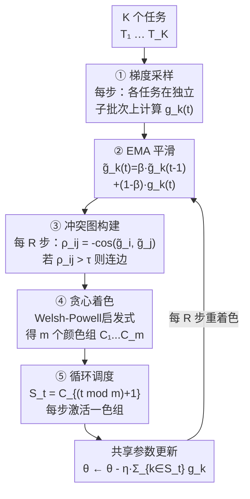

# SON-GOKU：图着色实现多任务学习的无冲突调度

**会议**: ECCV 2026  
**arXiv**: [2509.16959](https://arxiv.org/abs/2509.16959)  
**代码**: [https://anonymous.4open.science/r/SON-GOKU-Impl/](https://anonymous.4open.science/r/SON-GOKU-Impl/)  
**领域**: 优化  
**关键词**: 多任务学习, 梯度冲突, 图着色, 任务调度, 负迁移  

## 一句话总结

SON-GOKU 通过实时测量多任务学习中各任务的梯度冲突，构建冲突图并利用贪心图着色算法将任务动态划分为低冲突组，每个训练步只激活一组任务，周期性重着色以适应梯度演化，在六个数据集上一致提升了多种 MTL 基线方法的效果。

## 研究背景与动机

多任务学习（MTL）通过共享网络参数同时学习多个相关任务，旨在利用任务间的共性提升泛化表现。然而当不同任务的优化方向不一致时，它们对共享参数的梯度会产生冲突——即著名的负迁移现象。这种冲突直观上表现为两个任务的梯度向量指向相反方向，导致它们的合力相互抵消，不仅不能加速收敛，反而拖慢乃至逆转学习进程。现有应对策略主要分两类：一是梯度操纵（如 PCGrad 将冲突梯度投影到正交方向、CAGrad 在梯度的凸包内寻找平衡方向），通过修改共享梯度的几何形态来减小冲突；二是损失重加权（如 GradNorm 动态调整任务权重、AdaTask 为每个任务学习独立学习率），通过调节各任务的影响力来缓解主导任务压制定位任务的问题。这两类方法在每个训练步都激活全部任务，只是在共享更新上做"手术"来减轻冲突。

近年出现了一类不同的思路：将任务划分为子组，每次只更新一组。这个直觉很直接——既然冲突梯度放在一起会抵消，那就把它们分开，让相容的任务互相促进。早期工作如 TaskGrouping 和 Selective Task Group Update 已经证明分组更新可以比梯度操纵带来更稳定的训练。然而这些方法存在三个关键局限：一是依赖密集的全配对任务亲和度矩阵，计算开销随任务数平方增长且噪声大；二是分组在训练初期确定后很少更新，而任务间的梯度关系在整个训练过程中持续演化，静态分组会在中后期逐渐失效；三是分组策略多为局部启发式，缺乏全局兼容性保障和规范的轮转机制，难以保证每个任务被公平调度。

SON-GOKU 的核心洞察是：如果把每个任务看作节点，任务间的冲突程度就是边权，"哪些任务不该一起更新"天然是一个图着色问题——冲突的任务不能同色，同色的任务可以一起更新。基于这个视角，本文设计了从梯度测量到着色调度再到周期性重着色的完整流水线，并用严格的收敛理论证明了分组的合理性和调度的有效性。**核心 idea：将多任务学习的任务调度转化为动态图着色问题——用 EMA 平滑的梯度向量实时构建稀疏冲突图，通过贪心图着色算法将任务划分为低冲突颜色组，每个训练步循环激活一组，周期性重着色以自适应任务关系的演化，同时利用图论经典结果保证每个任务在最坏 Δ+1 步内至少更新一次（Δ 为最大冲突度）。**

## 方法详解

### 整体框架

SON-GOKU 是一个插件式的调度器，不改变底层的多任务优化器，只负责决定每一步激活哪些任务。整个流程以刷新周期 R 为节奏循环执行，每 R 步重建一次调度。

### 关键设计

**1. EMA 平滑的梯度冲突估计：用历史平均过滤批次噪声**

单步 minibatch 梯度的方向噪声极大——仅凭一两个批次的余弦相似度判断任务关系几乎不可靠。SON-GOKU 为每个任务维护一个指数移动平均（EMA）梯度向量：

$$g̃_k^{(t)} = β g̃_k^{(t-1)} + (1-β) g_k^{(t)}$$

只有当刷新调度（每 R 步）时，才基于 EMA 向量计算两两余弦相似度并定义干扰系数 $ρ_{ij} = -⟨g̃_i, g̃_j⟩/(‖g̃_i‖‖g̃_j‖)$，正数表示冲突。EMA 使梯度方向估计对单步噪声鲁棒，而存储开销仅需两个缓冲（当前+前一时刻）。为了进一步降低显存占用，实际实现采用低维 sketch 近似（sketch width $d_{sk} ≪ d$），将 K×d 的梯度矩阵压缩为 K×d_sk，使调度器的额外内存只随任务数 K 而非模型维度 d 增长，在大骨干网络上依然可行。

**2. 冲突图构建与贪心图着色：把调度问题转化为图论问题**

给定容差阈值 τ∈(0,1)，构建无向冲突图 $G_τ = (V, E_τ)$：节点是 K 个任务；若 $ρ_{ij} > τ$ 则在 i 和 j 之间连一条边，表示两者不应同时更新。τ 控制了图的稀疏度——τ 越大图越稀疏、颜色越少、每步激活的任务越多；反之 τ 越小图越密、颜色越多、步内冲突更少但任务更新间隔变长。建图后采用经典 Welsh-Powell 最大优先贪心算法：按度数降序排列节点，依次给每个节点分配可用的最小颜色号。该启发式保证所用颜色数不超过 Δ+1（Δ 为图的最大度），意味着调度周期长度由最冲突的那个任务决定，而非总任务数——当 Δ ≪ K 时调度极其紧凑。

**3. 周期性重着色与调度生成：自适应梯度演化**

任务间的梯度关系不是静态的——随着模型参数更新，不同任务的优化方向会持续漂移。固定分组会在训练中期逐渐失效。SON-GOKU 每 R 步使用最新 EMA 梯度重建冲突图并重着色，然后生成长度为当前颜色数 m 的周期调度：$S_t = C_{(t \bmod m) + 1}$。这意味着一个周期内所有任务至少被更新一次。对于贪心着色产生的单元素颜色组（即该任务与许多其他任务冲突，被迫独占一个颜色），调度器会将其复制到其他没有冲突边的训练步中，以保证更新频率不至于过低。

**4. 热身退火与即插即用：平滑启动和兼容性**

训练初期梯度的方向信息高度不稳定，过早引入严格分组反而有害。SON-GOKU 在前 $T_{warm}$ 步将 τ 设为 1（全通图，无边，所有任务同时更新），然后对数退火到目标阈值 $τ^*$。这样模型先经历一段"全任务共同训练"热身期，再平滑过渡到分组调度。更重要的是，SON-GOKU 是插件式调度器——它不绑定底层优化器，可以叠加在任何现有 MTL 方法之上（如 PCGrad + SON-GOKU、AdaTask + SON-GOKU）。调度器先消除大尺度冲突，优化器再在更干净的组内条件中工作，两者互补。

### 损失函数 / 训练策略

SON-GOKU 不修改任何任务的损失函数。训练目标仍是标准加权 MTL 目标 $F(θ, φ_1, ..., φ_K) = Σ w_k L_k(θ, φ_k)$。调度器只改变激活集合。理论分析证明了三点关键保证：（1）当 $τ(|S_t|-1) < 1$ 时，组更新方向保持下降，不会因冲突变成上升；（2）在标准非凸光滑假设下，SON-GOKU 保持 SGD 的 $O(1/√T)$ 收敛率，仅多出一个 $(1+τ)$ 的常数因子；（3）在刷新窗口内，顺序更新各颜色组的期望下降量严格不低于一次性混合更新，当组间冲突为负时优势更明显。

## 实验关键数据

### 主实验

| 数据集 | 指标 | Uniform | FAMO | SON-GOKU | ++AdaTask | ++PCGrad |
|--------|------|---------|------|----------|-----------|----------|
| CIFAR-10 | Acc. (%) ↑ | 55 | 64 | 65 | **67** | 65 |
| F&B | Acc. (%) ↑ | 63 | 70 | 69 | **71** | 70 |
| AV-MNIST | Acc. (%) ↑ | 52 | 60 | 58 | 59 | **62** |
| NYUv2 | Angle Error ↓ | 21.6 | 19.9 | 19.8 | 20.1 | **19.7** |
| MM-IMDb | Acc. (%) ↑ | 52 | 60 | 58 | 59 | **62** |
| HEALTH | Acc. (%) ↑ | 56 | 61 | 61 | **63** | 60 |

SON-GOKU 在全部六个数据集上一致超过 Uniform 基线，提升幅度在 10%-20%。与 FAMO、AdaTask、Nash-MTL 等强基线相比，SON-GOKU 在多个指标上取得最优或持平。当与 AdaTask 或 PCGrad 叠加时性能进一步提升——叠加 AdaTask 在分类任务上最优（其逐任务学习率能平滑分类梯度的突发尖峰），叠加 PCGrad 在回归/密集预测任务上最优（其投影操作去除组内剩余小冲突）。

### 消融实验

| 配置 | CIFAR-10 | F&B | NYUv2 Angle | 说明 |
|------|----------|-----|-------------|------|
| SON-GOKU (完整) | 65 | 69 | 19.8 | EMA + 动态着色 + 阈值建图 |
| Static One-Shot | 61 | 66 | 20.5 | 仅初着色一次，之后冻结分组 |
| Single-Step (H=1) | 40 | 59 | 26.4 | 无 EMA，每步只用当批梯度 |
| Signed-Only | 56 | 63 | 24.0 | 仅根据正负号建边，忽略幅度 |
| kNN-Symmetric | 60 | 65 | 22.1 | 每个任务连最冲突的 top-k |

### 关键发现

- 动态重着色至关重要：Static One-Shot 各项指标普遍落后 3-5 个百分点，证明梯度关系在训练中足够显著地漂移。
- 历史平均不可或缺：Single-Step 在 CIFAR-10 上从 65% 暴跌至 40%，说明单步噪声极大，EMA 平滑是可靠分组的必要前提。
- 建图规则实验表明，简单的全局阈值法（$ρ_{ij} > τ$）和分位数法效果最好；Signed-Only 和 kNN-Symmetric 忽略了冲突幅度或改变图结构，性能明显下降。
- 时间开销方面，SON-GOKU（R=32）在 K=40 时每步约 12 秒，而 PCGrad 需要 1127 秒、Nash-MTL 需 1014 秒，显示了巨大效率优势；额外内存仅随 K² 增长而不随模型维度 d 增长。

## 亮点与洞察

- **图着色视角非常自然**：把"哪些任务不该一起更新"等价为图着色，直接调用经典图论的理论保证。Δ+1 色边界将调度周期长度与最坏冲突度而非任务总数绑定，当大部分任务间无冲突时调度极其高效。
- **即插即用的设计哲学**：SON-GOKU 不是替代而是增强现有优化器。调度器先消除大尺度冲突，优化器在更干净的条件下工作——PCGrad 只需处理组内小冲突，AdaTask 不受敌对梯度干扰，产生协同增益。
- **EMA + sketch 双降噪**：EMA 过滤单步噪声，sketch 将内存从 O(Kd) 降到 O(K² + Kd_sk)，使调度器在大型骨干网络上依然可用。
- **完备的理论基础**：同时提供了下降保证（τ(|S|-1) < 1 时方向不反转）、收敛率保持（O(1/√T) + 小常数因子）、分组精确恢复保证（冲突估计误差低于容差时恢复理想冲突图）三重证明，这在调度类 MTL 工作中不多见。

## 局限与展望

- 着色复杂度随任务数二次增长（O(K²) + 着色 O(K²)），每 R 步才执行一次，但 K 极大（数百任务）时仍可能成瓶颈。论文讨论了加速策略但实验仅覆盖到 40 个任务。
- τ 的初始值和退火策略依赖人工设定，没有自适应机制。任务数变化或分布差异大时可能需要重新调参。
- SON-GOKU 本身只调度共享参数梯度，任务专用头（task-specific heads）的更新不受限制，但其梯度未纳入冲突图——若专用头也存在显著冲突，可能有待扩展。
- 实验仅覆盖视觉和表格数据，在语言模型多任务训练或多任务强化学习等场景的效果有待验证。

## 相关工作与启发

- **vs PCGrad / CAGrad**: 它们在每一步对所有任务梯度做投影/平衡，不改变激活集；SON-GOKU 先筛选任务再让优化器处理。两者互补而非替代，组合时效果最好。
- **vs TaskGrouping / Selective Task Update**: 现有分组方法依赖密集亲和矩阵或静态分组；SON-GOKU 用 EMA + 图着色实现动态稀疏调度，并有严格收敛保证。
- **vs AdaTask / GradNorm**: 这些方法调节数值尺度（权重/学习率），SON-GOKU 从结构层面消除大尺度冲突，组合效果好于单独使用。

## 评分

- 新颖性: ⭐⭐⭐⭐ 将图着色引入 MTL 调度并非独创，但完整流水线（EMA+sketch+动态重着色+理论分析）的综合设计与验证具有显著新意
- 实验充分度: ⭐⭐⭐⭐⭐ 六个数据集、十余种基线、6 种图构建规则 × 2 种密度设置的系统消融、时间/内存开销对比，非常充分
- 写作质量: ⭐⭐⭐⭐ 正文结构清晰，大量理论证明放入附录保证可读性，图表有效传达核心流程
- 价值: ⭐⭐⭐⭐ 即插即用的调度器可直接嵌入现有 MTL pipeline，验证了"调度 + 优化"协同增效的路线，实际部署潜力大

<!-- RELATED:START -->

## 相关论文

- [\[ICLR 2026\] From Gradient Volume to Shapley Fairness: Towards Fair Multi-Task Learning](../../ICLR2026/optimization/from_gradient_volume_to_shapley_fairness_towards_fair_multi-task_learning.md)
- [\[ECCV 2026\] RBE-Flow: Recurrent Bayesian Estimation on Feature Manifolds for Cross-Modal Registration](rbe-flow_recurrent_bayesian_estimation_on_feature_manifolds_for_cross-modal_regi.md)
- [\[ICML 2026\] URS：统一的神经路由求解器](../../ICML2026/optimization/urs_a_unified_neural_routing_solver_for_cross-problem_zero-shot_generalization.md)
- [\[ICML 2026\] RACO: Reward-free Alignment for Conflicting Objectives](../../ICML2026/optimization/reward-free_alignment_for_conflicting_objectives.md)
- [\[ICLR 2026\] Harmonized Cone for Feasible and Non-conflict Directions in Training Physics-Informed Neural Networks](../../ICLR2026/optimization/harmonized_cone_for_feasible_and_non-conflict_directions_in_training_physics-inf.md)

<!-- RELATED:END -->
