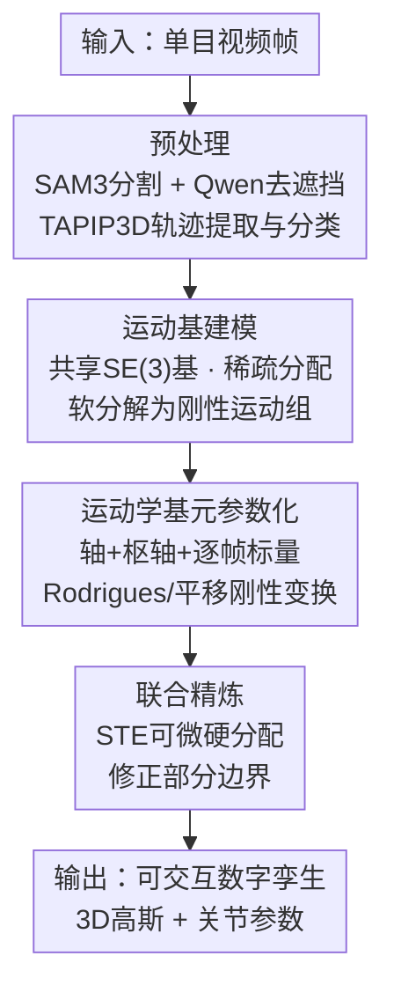

# Articulat3D: Reconstructing Articulated Digital Twins From Monocular Videos with Geometric and Motion Constraints

**会议**: ECCV 2026  
**arXiv**: [2603.11606](https://arxiv.org/abs/2603.11606)  
**代码**: 未开源  
**领域**: 3D视觉  
**关键词**: 铰接物体重建, 数字孪生, 单目视频, 运动学约束, 3D高斯溅射

## 一句话总结
Articulat3D 提出一个两阶段优化框架，从单目随意拍摄视频中重建铰接物体的可交互数字孪生：第一阶段用低维运动基（motion bases）对 3D 点轨迹做结构化部分级运动分解，第二阶段用显式运动学基元（旋转/平移关节的轴、枢轴、逐帧标量）约束运动使其满足物理刚体规律，在合成和真实数据上均达到 SOTA 精度且无需静态预扫描。

## 研究背景与动机
铰接物体（如门、抽屉、笔记本电脑）的数字化重建是计算机视觉和机器人领域的核心问题。重建出带部分几何、外观和关节参数的可交互数字孪生，可直接用于 AR、机器人仿真和交互式场景理解。在所有感知模态中，单目视频最具规模化潜力——它获取成本极低，随手可拍，且互联网上有海量数据。

然而，现有方法面临根本性的可扩展性瓶颈。第一类方法用前馈网络直接从图像预测关节参数，速度快但依赖外部模型库或需要特定数据微调，泛化能力弱。第二类方法更主流——从多视角多状态图像显式估计关节参数，几何约束强但需要受控采集环境和精确的相机内/外参，不适用于真实开放场景。第三类方法走向单目视频，看起来更可扩展，但实际上仍隐含依赖先对物体做一段静态扫描（如视频开头需相机绕物体旋转），无法处理视频一开始就带运动的野外场景。

更本质的、但被普遍忽视的问题是：几乎所有现有方法都把运动参数（如对偶四元数）按离散状态或单帧独立优化。这种逐帧优化天然割裂——模型在拟合特定时间戳的外观，而非学习运动本身的连续演化过程。现实中铰接运动（如门从关闭到打开）遵循连续物理轨迹，将每帧视为孤立优化目标必然丢失时间一致性，重建结果在过渡阶段缺乏物理合理性。

核心矛盾由此显式化：单目视频便宜但约束极度不足，多视角精确但不可规模化；逐帧优化能做到外观逼真但丢失物理一致性，运动学约束能保证物理合理但对初始化高度敏感。本文提出的问题是：能否仅从单目随意拍摄视频出发，通过让模型理解支配铰接运动的几何约束本身，来重建可交互的数字孪生？

切入角度是将运动建模为连续、受约束的轨迹，而非一组独立的逐帧状态快照。核心 idea 是两阶段优化：先用运动基从低维结构中发现刚性运动分组（解决初始化问题），再将运动约束为显式运动学基元的刚性变换（解决物理合理性问题）。

## 方法详解

### 整体框架
Articulat3D 解决的核心问题是：仅给定一段随意拍摄的单目视频 $X = \{x_i\}_{i=1}^N$，重建出包含部分级几何、外观和关节参数的可交互数字孪生。整体流程分预处理和两阶段优化，输入是原始视频帧，输出是 3D 高斯 + 显式关节参数（轴、枢轴、逐帧运动量），可直接导入物理仿真环境进行交互操作。

预处理阶段依次用 SAM3 分割目标物体、Qwen-Image 修复手部遮挡区域、TAPIP3D 提取稀疏 3D 点轨迹并按运动类型（静态/旋转/平移）分类。两阶段优化中，第一阶段（运动基初始化）将嘈杂的 3D 轨迹通过共享 SE(3) 基 + 稀疏部分分配软分解为若干刚性运动组；第二阶段（运动学约束精炼）将松散的 SE(3) 基替换为严格的运动学基元参数化，并通过 STE 可微重分配修正部分边界。整个优化联合训练规范高斯参数、潜在分配向量和运动学参数。

### 关键设计

**1. 运动基建模：将欠约束的逐点跟踪转化为结构化的部分级运动分解**

单目视频中铰接运动的直接逐高斯轨迹优化是严重不适定的——稀疏 TAPIP3D 轨迹噪声大、覆盖不全，直接优化每帧每高斯的位移无法收敛。该设计的核心 insight 是：铰接运动天然存在于低维子空间中，物体的运动可以由少数几个共享的 SE(3) 基的线性组合来表达。

具体做法是，从 TAPIP3D 轨迹先经过时空 K-Means 聚类得到 $B$ 个部分级运动组（含一个恒等基对应静态部分），对每组动力学轨迹求解加权 Procrustes 对齐得到初始逐帧 SE(3) 基 $\mathbf{T}_{0\rightarrow t}^{(b)}$。每个 3D 高斯分配一组可学习系数 $\{\mathbf{w}^{(b)}\}_{b=1}^B$，经 softmax 归一化后（$\sum_b \mathbf{w}^{(b)} = 1$），其聚合变换为各基的加权组合：

$$\mathbf{T}_{0\rightarrow t} = \text{Normalize}\left(\sum_{b=1}^{B} \mathbf{w}^{(b)}\mathbf{T}_{0\rightarrow t}^{(b)}\right)$$

其中 Normalize 通过 SVD 正交化保证结果仍为合法 SE(3) 成员。将高斯从规范态 $(\boldsymbol{\mu}_0, \mathbf{R}_0)$ 变换到时刻 $t$ 的位姿：

$$\boldsymbol{\mu}_t = \mathbf{R}_{0\rightarrow t}\boldsymbol{\mu}_0 + \mathbf{t}_{0\rightarrow t}, \quad \mathbf{R}_t = \mathbf{R}_{0\rightarrow t}\mathbf{R}_0$$

该设计与 Shape of Motion 的关键区别在于：后者允许每个高斯用任意软混合权重组合所有基（导致运动表示冗余且可解释性差），而 Articulat3D 通过强先验初始化和稀疏正则化引导分配趋向近独热（near-discrete），使运动表示从一开始就是部分感知的。此外，该方法将真实的铰接运动区间与静态绕拍帧解耦，只在物理上有意义的运动段施加时间正则化。效果是，共享基强制具有相似语义属性的高斯沿一致的低维轨迹运动，即使跟踪数据稀疏的区域也能保持时空连贯。

**2. 运动学基元参数化：用显式关节轴和枢轴约束运动，从"软混合"无缝过渡到"刚体物理"**

第一阶段运动基虽灵活但缺乏物理严谨性——加权混合 SE(3) 基不保证产生围绕固定轴的旋转或沿固定方向的平移。该设计将无约束 SE(3) 基替换为严格的运动学基元，强制每个组件遵循旋转关节或平移关节的刚体运动规律。

对每个物体部分 $k$，定义三个可学习参数：归一化关节轴 $\mathbf{a}_k \in \mathbb{S}^2$、枢轴点 $\mathbf{c}_k \in \mathbb{R}^3$、逐帧运动标量 $q_k(t)$（旋转角或平移位移）。对旋转关节，用 Rodrigues 公式计算旋转变换：

$$\mathbf{R}_k(t) = \exp(\theta_k(t)[\mathbf{a}_k]_\times), \quad \mathbf{t}_k(t) = (\mathbf{I} - \mathbf{R}_k(t))\mathbf{c}_k$$

其中 $\theta_k(t) = q_k(t)$ 为旋转角，$[\mathbf{a}_k]_\times$ 为轴向量的反对称矩阵。对平移关节，旋转分量为恒等矩阵，运动为沿轴向纯平移：

$$\mathbf{R}_k(t) = \mathbf{I}, \quad \mathbf{t}_k(t) = d_k(t)\mathbf{a}_k$$

其中 $d_k(t) = q_k(t)$ 为平移位移。

从运动基到运动学基元的桥接通过"鲁棒关节初始化"完成：先按最大系数做硬分配确定每个高斯的归属部分，然后对归属该部分的所有高斯位置取修剪均值（trimmed mean，剔除 20% 离群点）合成稳定中心轨迹 $\mathbf{c}_k(t)$，再对中心轨迹做 PCA——如果只有一个显著主成分则是平移关节（线性运动），两个显著主成分则是旋转关节（平面弧线运动，第三主成分的法向量初始化关节轴）。这个纯几何的关节类型判定简洁而有效，不需要训练额外的分类器。

**3. 联合精炼与 STE 重分配：在保持严格刚体变换的同时可微地修正初始部分边界**

基于运动基系数的初始硬分配在运动学边界附近往往不可靠——边界高斯的运动受相邻部分的影响，初始归属容易出错。如果直接锁死分配，这些错误会在运动学约束精炼阶段被放大。该设计的 challenge 在于：严格刚体变换要求每个高斯必须属于且仅属于一个关节（硬分配），但修正分配又需要梯度（软分配）。

解决方案是为每个高斯引入可学习的潜在向量 $\mathbf{z}_i \in \mathbb{R}^K$，经带温度 $\tau$ 的 softmax 得到软分配概率 $p_{i,k}$。前向传播中用最概然关节的变换做严格刚性变换：$\mathbf{T}_i = \mathbf{T}_{k^*}$（$k^* = \arg\max_k p_{i,k}$），保证输出物理一致；反向传播中用直通估计器（Straight-Through Estimator, STE），将变换近似为软混合 $\sum_j p_{i,j}\mathbf{T}_j$ 来传播梯度：

$$\frac{\partial \mathcal{L}}{\partial z_{i,k}} \approx p_{i,k}\sum_{j=1}^{K}\left\langle\frac{\partial \mathcal{L}}{\partial \mathbf{T}_i}, \mathbf{T}_j\right\rangle(\delta_{jk} - p_{i,j})$$

其中 $\delta_{jk}$ 为 Kronecker delta，$\langle\cdot,\cdot\rangle$ 为 Frobenius 内积。这种"前向硬、反向软"的策略让模型既能保持严格刚性运动，又能根据运动学一致性自动修正初始错误分配（图 3 体现了从混乱到物理合理的边界修正），是连接第一阶段软分解与第二阶段刚性约束的关键技术纽带。

### 损失函数 / 训练策略

总损失由三项组成：

$$\mathcal{L} = \mathcal{L}_{\text{render}} + \lambda_{\text{acc}}\mathcal{L}_{\text{acc}} + \lambda_{z}\mathcal{L}_{z}$$

渲染损失 $\mathcal{L}_{\text{render}}$ 结合光度误差与几何监督：$\mathcal{L}_{\text{render}} = (1 - \lambda_{\text{SSIM}})\mathcal{L}_1 + \lambda_{\text{SSIM}}\mathcal{L}_{\text{D-SSIM}} + \lambda_D\mathcal{L}_D$。深度监督使用 MegaSaM 的单目深度估计 $\bar{\boldsymbol{D}}$ 与渲染深度 $\boldsymbol{D}$ 之间的鲁棒尺度不变损失 $\mathcal{L}_D = \log(1 + \|\boldsymbol{D} - \bar{\boldsymbol{D}}\|_1)$。

加速损失 $\mathcal{L}_{\text{acc}}$ 直接作用于可学习关节标量 $q_k(t)$ 的二阶有限差分 $\mathcal{L}_{\text{acc}} = \sum_{t,k} \|q_k(t+1) - 2q_k(t) + q_k(t-1)\|^2$，惩罚高频振荡、鼓励匀速或匀变速运动，有效抑制单目跟踪先验中的抖动。

深度稳定损失 $\mathcal{L}_z$ 针对单目重建中常见的"呼吸效应"——优化器通过错误调整高斯沿相机光轴方向的深度来补偿色彩重投影误差。该损失惩罚运动学模型无法解释的 Z 轴位移 $\mathcal{L}_z = \sum_{i=1}^N \sum_{t=1}^T \omega_i \cdot \|\Delta\mathbf{x}_{i,t}^{(z)}\|^2$，其中 $\omega_i$ 为第一阶段运动先验置信度权重，强迫模型优先用旋转和横向平移解释观测，而非非物理的深度方向"脉动"。

## 实验关键数据

### 主实验

在三个数据集上全面评估：Video2Articulation-S（73 个合成视频，11 类单运动部件物体）、Articulat3D-Sim（本文新引入，20 个视频 17 类，2-7 个运动部件，同步铰接+大幅相机运动）、Articulat3D-Real（本文新引入，12 段 iPhone 实拍，9 类，多样化光照和背景）。评估维度包括关节估计（轴误差、位置误差）、重建精度（Chamfer Distance 整体/运动部/静态部）、3D 跟踪（EPE）、视角合成（PSNR/SSIM/LPIPS）。

| 方法 | 轴误差 ↓ | 位置误差 ↓ | CD-w ↓ | CD-m ↓ | CD-s ↓ | EPE ↓ | PSNR ↑ |
|------|---------|----------|--------|--------|--------|-------|--------|
| **Articulat3D-Sim 数据集** | | | | | | | |
| RSRD | 55.75 | 91.52 | 69.16 | 55.41 | 10.05 | 3.14 | 28.19 |
| Articulate Anything | 44.65 | 129.00 | 16.10 | 17.74 | 16.36 | 2.02 | N/A |
| iTACO | 48.50 | 38.00 | 3.13 | 1.63 | 3.72 | 0.14 | N/A |
| Shape of Motion | N/A | N/A | N/A | N/A | N/A | 0.08 | 33.37 |
| **Articulat3D** | **0.53** | **0.65** | **0.76** | **0.84** | **0.85** | **0.04** | **37.80** |
| **Video2Articulation-S 数据集** | | | | | | | |
| iTACO | 16.05 | 13.00 | 1.00 | 13.00 | 6.00 | N/A | N/A |
| **Articulat3D** | **1.60** | **1.83** | **0.82** | **1.12** | **1.82** | N/A | **35.91** |
| **Articulat3D-Real 数据集** | | | | | | | |
| RSRD | N/A | N/A | N/A | N/A | N/A | N/A | 16.12 |
| Shape of Motion | N/A | N/A | N/A | N/A | N/A | N/A | 24.13 |
| **Articulat3D** | N/A | N/A | N/A | N/A | N/A | N/A | **26.73** |

Articulat3D 在所有数据集的所有指标上一致领先。在最具挑战性的 Articulat3D-Sim（多部件场景）上，关节轴误差仅 0.53 度（iTACO 为 48.50 度，完全无法处理多部件），位置误差 0.65 cm（RSRD 为 91.52 cm，模板不匹配导致结构坍塌）。在真实场景中 PSNR 达 26.73，显著优于依赖静态扫描的 RSRD（16.12）。值得注意的是，Articulat3D 无需任何静态扫描或受控相机位姿，仅从视频第一帧即可开始重建。

### 消融实验

以下消融均在 Articulat3D-Sim 数据集上进行：

| 配置 | 轴误差 ↓ | 位置误差 ↓ | CD-w ↓ | CD-m ↓ | EPE ↓ | PSNR ↑ | 说明 |
|------|---------|----------|--------|--------|-------|--------|------|
| Full Articulat3D | 0.53 | 0.65 | 0.76 | 0.84 | 0.04 | 37.80 | 完整模型 |
| w/o motion prior (无 3D 轨迹引导) | 43.42 | 31.26 | 18.78 | 92.45 | 28.29 | 20.78 | 去掉运动先验，模型坍塌 |
| w/o prior init (跳过运动初始化) | 1.36 | 3.42 | 1.13 | 1.67 | 0.06 | 30.89 | 直接优化运动学参数陷入局部极小 |
| w/o kinem. const. (无运动学约束) | 0.86 | 4.98 | 5.19 | 7.71 | 0.09 | 35.45 | 无刚性约束导致几何漂移 |
| w/ track noise (轨迹加噪声) | 0.56 | 0.67 | 0.78 | 0.88 | 0.05 | 37.62 | 对跟踪噪声鲁棒 |
| w/ less data (仅 1/3 帧) | 0.61 | 0.68 | 0.83 | 0.92 | 0.07 | 34.60 | 数据稀疏时运动学精度几乎不变 |

### 关键发现
- **运动先验是地基，不能去掉**：去掉 3D 轨迹引导后模型完全坍塌（位置误差从 0.65 跳到 31.26，CD-m 从 0.84 跳到 92.45），说明单靠光度约束无法解开几何与运动学的耦合，运动先验是解决这一歧义性的关键。
- **两个阶段各司其职、缺一不可**：跳过运动初始化直接优化运动学参数轴误差升至 1.36（2.5 倍恶化），因为运动学优化空间高度非凸，差的初始化直接导致错误局部极小；去掉运动学约束 CD-m 跳至 7.71（接近 10 倍恶化），虽渲染质量下降不大（PSNR 35.45 vs 37.80），但几何结构已严重漂移——运动学约束是保证物理合理性的关键瓶颈。
- **运动学基元天然抗噪**：在 3D 轨迹注入高斯噪声后所有指标几乎不变（轴误差仅从 0.53 到 0.56），因为显式轴-角参数化构成一个刚性运动学瓶颈，只允许物理合法的运动通过，自动过滤不符合刚体运动规律的噪声。
- **仅需 1/3 帧即可维持运动学精度**：轴误差仅从 0.53 升到 0.61 度，位置误差从 0.65 到 0.68 cm，证明运动基从稀疏时序数据中仍能有效捕获铰接运动的低维结构。渲染质量下降（PSNR 37.80 到 34.60）是因高斯优化可用的光度约束减少，而非运动模型问题。

## 亮点与洞察
- **两阶段递进设计的动机链条非常清晰**：运动基解决"这个物体有哪些刚性部件"（分解问题），运动学基元解决"这些部件如何物理运动"（约束问题），两个阶段天然互补——基的灵活性给第二阶段一个好起点，基元的刚性给第一阶段一个物理出口。这种"先宽松后收紧"的策略在不适定重建问题上具有可迁移性，适用于任何需要从弱约束到强约束过渡的任务。
- **PCA 判定关节类型是一个优雅的启发式**：不用训练任何网络，纯几何地从轨迹的主成分分布判定是旋转关节还是平移关节——一个主成分就是平移，两个就是旋转（平面弧），极其简洁且在实践中有效。这种"能用简单几何就不再引入学习模块"的设计哲学值得借鉴。
- **STE 前向硬后向软的 trick 很实用**：在需要离散决策又要可微优化的场景中，这种"前向用 argmax 保证行为正确、后向用 softmax 保证梯度流通"的模式可复用到许多任务（如动态路由、自适应模块选择、部分级操作的边界优化等）。
- **深度稳定损失针对性强**：单目重建中 Z 轴"呼吸效应"是一个普遍存在的 artifacts，但很少有人专门设计损失来解决。该损失直接惩罚运动学模型无法解释的 Z 轴位移，是一条低成本解决深度模糊的经验，可以迁移到其他基于 3DGS 的单目动态重建任务。

## 局限与展望
- 作者承认纹理缺乏表面（texture-less surfaces）会导致稀疏 3D 轨迹不可靠，进而影响初始化质量。这是 TAPIP3D 类方法的共同瓶颈——稀疏跟踪本身依赖纹理特征点，光面物体缺少可跟踪特征。
- 当前实现假设各关节相互独立，不支持层次化运动学链（如机械臂的多级嵌套联动），限制了复杂装配体的建模能力。解决方向：引入树形运动学结构，用父子关节约束嵌套关系。
- 论文未建模动力学参数（质量、摩擦系数），重建出的数字孪生在物理仿真中只能做运动学回放，不能真正仿真力与运动的关系。后续可探索从视频中估计物理参数的联合优化。
- 实验中的"运动学基元参数化"要求已知部件数 $K$（或从先验聚类得到），在未知物体类别时部件数推断本身就是一个未解决的子问题。
- 真实场景实验的定量评估主要依赖渲染指标，运动学参数的 ground truth 难以获取（需要人工标注），评价体系不够完备。

## 相关工作与启发
- **vs Shape of Motion (Wang 2025)**：同为基于 4D-GS 的动态重建，Shape of Motion 用通用自由运动基和软混合权重表示运动，不区分铰接结构和自由形变。Articulat3D 在此基础上关键升级了两点：将软混合推向稀疏近独热（部分感知初始化），以及用显式运动学基元替换自由基。区别在于前者是"把一切运动都当成通用位移"，后者是"铰接运动有特殊结构，应该用专用约束"。
- **vs VideoArtGS / RSRD**：这类方法需要视频开头有静态扫描段来初始化 3D 几何。Articulat3D 通过运动基直接从不含静态段的视频开始工作，极大降低了数据采集门槛。核心差异在于前者把"先获得几何"和"再估计运动"当成两个独立步骤，后者将二者相互条件化联合优化。
- **vs Articulate Anything (Le 2024)**：作为一个依赖大规模网格库检索的方法，其泛化能力受限于库的覆盖范围。Articulat3D 不依赖任何外部模型库，对未见类别也具有泛化能力，这是重建方法对检索方法的基本优势。
- **启发**：本文"先软分解、再硬约束"的两阶段范式可推广至其他重构-约束问题，例如从视频中重建可变形物体的物理参数（弹性模量、阻尼）——先用数据驱动方式获得初始形变场，再用物理方程约束精炼。

## 评分
- 新颖性: ⭐⭐⭐⭐ 两阶段递进设计和运动学基元显式参数化的组合有创新性；运动基本身受 Shape of Motion 启发，运动学基元概念来自机器人学，但将二者结合并适配 3DGS 框架解决单目铰接重建是新的。
- 实验充分度: ⭐⭐⭐⭐⭐ 三个数据集覆盖合成简单/合成复杂/真实场景，四项评估维度，完整消融（每个组件都有"去掉它会发生什么"的测试），外加噪声鲁棒性、数据稀疏性、超参敏感度、运行时间对比，附录扎实。
- 写作质量: ⭐⭐⭐⭐⭐ 结构清晰（动机-方法-实验线性推进），核心矛盾表述有力，方法细节完整（含数学推导和技术动机），图表丰富且视觉对比有说服力。
- 价值: ⭐⭐⭐⭐ 将铰接物体数字孪生的创建门槛从受控多视角降到随手单目视频，有显著的规模化意义。当前价值主要在学术推进和方法框架层面，产业落地还需解决层次化运动学链和物理参数估计。

<!-- RELATED:START -->

## 相关论文

- [\[CVPR 2026\] A2GC: Asymmetric Aggregation with Geometric Constraints for Locally Aggregated Descriptors](../../CVPR2026/others/a2gc_asymmetric_aggregation_with_geometric_constraints_for_locally_aggregated_de.md)
- [\[ICLR 2026\] Articulation in Motion: Prior-Free Part Mobility Analysis for Articulated Objects](../../ICLR2026/others/articulation_in_motion_prior-free_part_mobility_analysis_for_articulated_objects.md)
- [\[ECCV 2026\] Seeing Touch from Motion: A Unified Modality-Aware Visuo-Tactile Policy with Tactile Motion Correlation](seeing_touch_from_motion_a_unified_modality-aware_visuo-tactile_policy_with_tact.md)
- [\[CVPR 2025\] LATTE-MV: Learning to Anticipate Table Tennis Hits from Monocular Videos](../../CVPR2025/others/latte-mv_learning_to_anticipate_table_tennis_hits_from_monocular_videos.md)
- [\[ECCV 2026\] Geometric Gradient Rectification for Safe Open-Set Semi-Supervised Learning](geometric_gradient_rectification_for_safe_open-set_semi-supervised_learning.md)

<!-- RELATED:END -->
