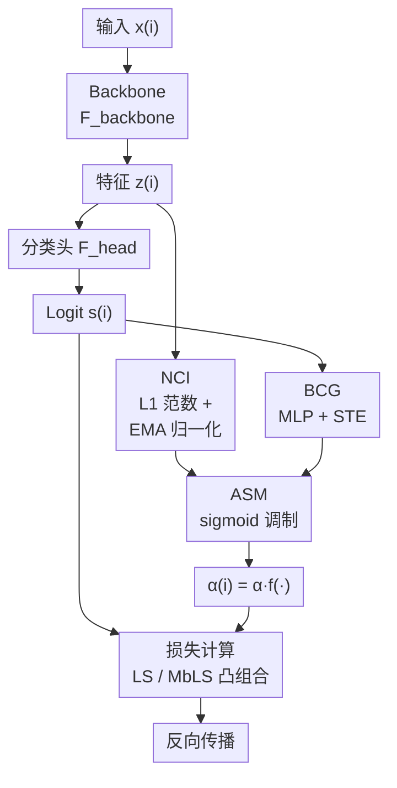

# FedLAS: Feature-Modulated Bidirectional Label Smoothing for Neural Network Calibration  

**会议**: ECCV 2026  
**arXiv**: [2606.28654](https://arxiv.org/abs/2606.28654)  
**代码**: [https://github.com/nadarasarbahavan/FEDLAS](https://github.com/nadarasarbahavan/FEDLAS)  
**领域**: 模型校准 / 神经网络  
**关键词**: 标签平滑, 模型校准, 特征范数, 双向校准门控, 自适应正则化  

## 一句话总结
提出 FeDLaS（Feature-modulated Bidirectional Label Smoothing），利用隐藏层特征 L1 范数作为置信度代理以绕过 softmax 饱和缺陷，搭配双向校准门控实时判断每个样本的过置信/欠置信状态，逐样本动态调制标签平滑强度，在保持 Top-1 精度的前提下显著降低 ECE 和 AECE。

## 研究背景与动机

**领域现状**：深度神经网络分类器的 softmax 输出置信度与真实正确概率之间存在系统性偏差。标准交叉熵训练的 one-hot 标签迫使模型为目标类分配接近 1 的概率，产生过度自信。标签平滑（LS）通过将概率质量均匀分散到所有类别引入熵正则化，Margin-based LS（MbLS）进一步将正则化建模为 logit gap 上的 margin 约束。Park et al. 理论证明许多先进校准方法本质上是隐式的样本自适应标签平滑变体。

**核心矛盾**：现有 LS 和 MbLS 依赖预设的均匀平滑规则，且仅针对过置信进行单向校正。但训练中大量样本处于欠置信状态——模型对正确预测也缺乏信心。更关键的是，样本的置信状态在训练过程中动态变化（模型非平稳性），而现有方法无法逐样本、逐训练步地识别当前置信状态并施加相应程度的平滑。Park et al. 归纳了四个未解决限制：Lim1 不能覆盖完整置信范围；Lim2 仅单向处理过置信；Lim3 不适应模型非平稳训练；Lim4 使用 softmax 输出本身易过自信。部分方法（如 AdaFocal）尝试处理欠置信，但需要额外验证集。

**切入角度**：特征范数已被理论和实验证明可作为类无关的置信度代理——隐藏层 L1 范数等价于隐式二值化分类器的最大 logit，反映模型整体判别强度，且不受 softmax 饱和限制、具有更宽动态范围。本文以此为基础设计可插拔的自适应平滑模块。

**核心 idea**：通过「特征范数置信度指示器（NCI）+ 双向校准门控（BCG）」组合成自适应平滑模块（ASM），对每个训练样本实时判断过置信/欠置信状态并据此双向调节平滑强度，覆盖完整置信范围。

## 方法详解

### 整体框架

FeDLaS 将标准分类网络分解为 `F_backbone → F_head → softmax`。训练时，从 backbone 提取特征向量和分类头 logit，通过 ASM 模块计算每个样本的自适应平滑系数 α(i)，然后将其注入 LS 或 MbLS 损失的凸组合中。ASM 由两个子模块组成：NCI 利用特征 L1 范数（经 EMA 归一化）给出连续置信度信号；BCG 利用 logit 经小型 MLP 输出 ±1 的二元门控信号。两者经 sigmoid 调制后得到 α(i)。

### 关键设计

**1. NCI（Norm-based Confidence Indicator）：用 EMA 归一化特征范数作为置信度代理**

传统方法依赖 softmax 最大概率作为置信度，但 softmax 具有饱和倾向——即使低质量样本的最大概率也接近 1，丢失细粒度差异（论文 Fig.1(c) 实验验证了 L1 范数的动态范围远宽于 softmax 概率）。Park et al. 证明了在 ReLU/GELU 网络的隐藏层中，特征向量的 L1 范数收敛于隐式二值化分类器的最大 logit，是模型判别强度的类无关度量。

NCI 计算为 $\gamma(z^{(i)}) = (\|\text{sg}[z^{(i)}]\|_1 - \mu_z^k) / \sigma_z^k$，其中 $\text{sg}[\cdot]$ 为 stop-gradient 操作。关键设计在于使用 EMA 追踪全局均值和方差 $\mu_z^k, \sigma_z^k$，而非 batch 统计量——这解决了两个问题：① 避免特征范数方差波动导致 sigmoid 进入饱和区（"死"自适应）；② 使平滑修正基于样本在全体训练数据中的相对位置，而非 batch 内相对位置。EMA 更新为 $\mu_z^k = \theta \hat{\mu}_z^k + (1-\theta)\mu_z^{k-1}$，动量 $\theta$ 控制更新速度。$\gamma$ 也可使用 softmax 概率或最大 logit 替代（论文在消融中对比了这些变体）。

**2. BCG（Bidirectional Calibration Gating）：离散门控区分过置信与欠置信**

BCG 输出 $\psi(\mathbf{s}^{(i)}) \in \{-1, +1\}$，+1 代表正模式（抑制过置信），-1 代表负模式（提升欠置信）。实现为一个轻量 MLP $\mathcal{F}_{gate}$，输入 stop-gradient 后的 logit，输出经 softmax 后用固定权重 $[1, -1]^\top$ 映射为二元符号：$\psi(\mathbf{s}^{(i)}) = \text{sgn}\left(\mathbf{w}_{\text{gate}}^\top \cdot \sigma(\mathcal{F}_{gate}(\text{sg}[\mathbf{s}^{(i)}]))\right)$。由于 $\text{sgn}$ 不可导，使用 Straight-Through Estimator（STE）在前向传播用离散值、反向传播穿透为连续梯度，维持端到端可训练。

BCG 的稳定性实验（论文 Fig.3）显示：训练过程中过置信/欠置信样本占比基本恒定，仅在学习率衰减时发生轻微偏移；样本状态翻转率（Flip Rate）持续下降，表明门控收敛。与需要额外验证集的 AdaFocal 不同，BCG 完全在训练数据上自主学习置信状态分类。

**3. ASM（Adaptive Smoothing Module）：融合 NCI 与 BCG 的动态平滑系数生成**

ASM 将 NCI 和 BCG 组合为统一的调制函数：
$\alpha^{(i)} = \alpha \cdot 2\phi\left(\beta \cdot \psi(\text{sg}[\mathbf{s}^{(i)}]) \cdot \gamma(\text{sg}[\mathbf{z}^{(i)}])\right)$
其中 $\phi$ 为 sigmoid。Sigmoid 的三点性质精确匹配设计需求：① **有界性**——输出 $(0, 2\alpha)$，$\beta=0$ 时退化为基线方法；② **单调性**——固定模式下 $\alpha^{(i)}$ 与 NCI 正/负单调；③ **对称性**——正负模式旋转对称。标量 $\beta$ 控制敏感度（验证集选择，CIFAR-10 用 $\beta=0.5$，Tiny-ImageNet 用 $\beta=4.0$）。

在**正模式**（$\psi=+1$，过置信）下，$\alpha^{(i)}$ 随 NCI 单调递增，高置信样本被施加更强平滑；**负模式**（$\psi=-1$，欠置信）下，$\alpha^{(i)}$ 随 NCI 单调递减，原本应自信但置信度低的样本被施加更弱平滑（甚至「负平滑」），提升预测置信度。

### 损失函数 / 训练策略

FeDLaS 以凸组合形式嵌入两类基线损失：
- **FeDLaS-LS**：$\mathcal{L}_{FeDLaS-LS}^{i} = (1-\alpha^{(i)})\mathcal{L}_{\text{CE}}^{i} + \alpha^{(i)}E(\hat{\mathbf{p}}^{(i)})$，基线 LS 的 $\alpha=0.05$（CIFAR-100 用 0.1）。
- **FeDLaS-MbLS**：$\mathcal{L}_{FeDLaS-MbLS}^{i} = (1-\alpha^{(i)})\mathcal{L}_{\text{CE}}^{i} + \alpha^{(i)}R(\mathbf{s}^{(i)})$，MbLS 的 margin 和 $\lambda$ 保持原配置（$m=6,\lambda=0.1$ / $m=10,\lambda=0.05$）。与 MbLS 将正则项孤立加和不同，FeDLaS-MbLS 的凸组合形式使 $\alpha^{(i)}$ 同时控制分类损失和正则化权重。

训练完全复现 ACLS 的标准化协议（SGD 优化器、余弦学习率调度、标准数据增强）。ResNet 取分类头前的特征向量，ViT 取 [CLS] token。$\beta$ 和 $\theta$ 通过验证集选择，细粒度任务沿用 Tiny-ImageNet 的最优配置。

## 实验关键数据

### 主实验

表 1 为 CIFAR-10/100、Tiny-ImageNet 上 6 种架构组合的校准结果（15 bins）。排名基于全场景平均：

| 方法 | ECE 平均排名 | AECE 平均排名 | Top-1 平均准确率 |
|------|-------------|-------------|----------------|
| CE | 14.00 | 14.00 | 78.74 |
| LS | 7.00 | 9.00 | 79.69 |
| MbLS | 4.33 | 6.00 | 79.66 |
| ACLS | 5.50 | 4.83 | 79.78 |
| DFL | 7.50 | 6.33 | 78.89 |
| AdaFocal | 10.00 | 9.83 | 78.77 |
| **FeDLaS-LS** | **5.50** | **4.17** | **79.62** |
| **FeDLaS-MbLS** | **1.83** | **3.83** | **79.58** |

FeDLaS-MbLS 的 ECE 平均排名 1.83 全面领先所有方法，显著高于基线 MbLS（4.33），说明双向自适应调制有效弥补了 margin-based 损失的校准缺口。易误读的是 FeDLaS-LS 精度 79.62 vs LS 的 79.69——标准搭配，自适应调制不会损害分类精度。

### 消融实验

表 2 为分解 ECE（CIFAR-10，ResNet-50），展示 BCG 双向校正效果：

| 配置 | O-ECE↓ | U-ECE↓ | 说明 |
|------|--------|--------|------|
| CE | 5.85 | 0.00 | 严重过置信，几乎无欠置信 |
| LS | 1.16 | 2.45 | 过校正：O-ECE 降了但 U-ECE 飙升 |
| FeDLaS-LS | **0.89** | **0.40** | 双向平衡，LS 的 U-ECE 从 2.45 降至 0.40 |
| MbLS | 1.09 | **0.12** | O-ECE 适中，U-ECE 较低 |
| FeDLaS-MbLS | 1.11 | **0.02** | 与 MbLS 持平 O-ECE，U-ECE 趋零 |

核心发现：CE 是单向过置信（U-ECE≈0）；LS 和 MbLS 反向过校正（大幅压 O-ECE 但 U-ECE 升高）。FeDLaS 变体在两种误差方向均保持低位——FeDLaS-LS 将 LS 的 U-ECE 从 2.45 降至 0.40（降幅 83.7%），同时 O-ECE 保持更低。

### 关键发现

- **BCG 是最大贡献点**：从消融可推断，移除 BCG（退化为单向平滑）会导致欠置信校正缺失。FeDLaS-LS 的 U-ECE 相比 LS 从 2.45 降至 0.40，降幅完全来自 BCG 的欠置信检测能力。
- **细粒度任务优势更明显**：在 CUB-200、FGVC-Aircraft 上，FeDLaS-LS 的 ECE 平均排名 1.5，远超 LS 的 3.0 和 MbLS 的 4.5。细粒度任务类间差异小、样本难度差异大，逐样本自适应平滑的优势更加突出。
- **OOD 检测性能回补**：LS 和 MbLS 显著降低 OOD 检测 AUROC（vs CE），但 FeDLaS 变体能大幅缩小此差距。例如 CIFAR-100→SVHN 场景，LS/AUROC=72.92，FeDLaS-LS 提升至 84.33（+11.41%）。
- **BCG 稳定性良好**：过置信/欠置信样本占比在训练过程中基本恒定，仅在学习率调度器触发时轻微波动；样本状态翻转率持续下降至接近零，说明门控收敛。

## 亮点与洞察

- **特征范数的系统性用途扩展**：之前特征范数主要用于 OOD 检测和难例挖掘，本文首次将其作为训练时标签平滑的逐样本置信度代理。EMA 归一化是一个简洁有效的工程技巧——使 NCI 反映样本在全体训练进程中的相对置信度而非 batch 内位置，同时避免 sigmoid 饱和。
- **STE 维持离散门控的可微分性**：BCG 输出 ±1 的离散二元信号，使用 Straight-Through Estimator 在前向传播用离散值、反向传播"穿透"为连续梯度，在保持门控明确性的同时使整个框架端到端可训练。
- **双向对称的数学设计**：正负模式下 NCI 与 α(i) 的关系对称（单调递增 vs 递减），sigmoid 有界性防止异常样本产生失控平滑系数。这种「有界 + 单调 + 对称」的调制框架可迁移到其他需要双向正则化适配的场景。
- **即插即用零推理开销**：ASM 只依赖 backbone 特征和 logit 的梯度分离计算，不改变网络结构、不增加推理开销——训练时仅增加一个微型 MLP 和 EMA 维护，推理时完全静默。

## 局限与展望

- **NCI 的理论假设限制**：特征范数作为置信度代理依赖于 ReLU/GELU 等单侧整流激活函数的理论边界（公式 2 的不等式推导），对于 Swish、ELU 等激活函数或没有清楚 backbone-head 分解的网络，理论基础可能不成立。作者明确承认了这一局限。
- **超参数 β 和 θ 需要调优**：β 控制 sigmoid 敏感度，θ 控制 EMA 动量，均需在验证集上选择。虽然细粒度任务可直接复用 Tiny-ImageNet 配置，但实际应用中仍带来额外调参成本。
- **BCG 仅依赖 logit**：门控决策仅从 logit 判断置信状态，未利用特征层信息。将特征信息引入门控可能进一步提升欠置信/过置信的判别准确性。
- **未探索半监督/自监督场景**：论文仅在结论中提到了 NCI 类无关特性在无监督、自监督、半监督和噪声标签校准中的潜力，没有实际实验验证。这是最直接的后续方向——当前标注昂贵场景下的模型校准需求是真实存在的。

## 相关工作与启发

- **vs Label Smoothing (LS)**：LS 对所有样本使用固定 α；FeDLaS-LS 通过 ASM 动态生成 α(i)。CIFAR-100 上 FeDLaS-LS 将 ECE 从 LS 的 ~5.42 降至 ~4.29，U-ECE 从 ~2.69 降至 ~0.59。
- **vs Margin-based LS (MbLS)**：MbLS 松化了 LS 的严格熵约束，但正则化强度仍全局固定。FeDLaS-MbLS 的 ECE 平均排名从 MbLS 的 4.33 升至 1.83。
- **vs ACLS**：ACLS 在 MbLS 基础上引入样本自适应 margin，但仍为单向过置信校正。FeDLaS-MbLS 增加欠置信门控，Tiny-ImageNet ResNet-50 上 ECE 从 ACLS 的 ~1.37 降至 ~1.22。
- **vs AdaFocal / DFL**：AdaFocal 需额外验证集选温度参数，DFL 正则化范围有限。FeDLaS 不依赖验证集，BCG+NCI 协同覆盖完整置信范围。

## 评分

- 新颖性: ⭐⭐⭐⭐ 将特征范数从 OOD 检测引入训练时逐样本标签平滑调制是新颖视角；双向门控 + EMA 归一化组合设计干净有效。整体仍属 LS/MbLS 框架内的自适应系数扩展，框架创新属增量改进。
- 实验充分度: ⭐⭐⭐⭐⭐ 在 3 个标准 + 2 个细粒度分类数据集上对比 10+ 基线，额外覆盖 OOD 检测、分解 ECE 分析、BCG 稳定性可视化。训练协议完全与 ACLS 对齐确保公平。
- 写作质量: ⭐⭐⭐⭐ 动机阐述清晰，理论证明→设计动机→工程细节递进合理。方法部分公式密度略高，部分推导可移入附录以提升可读性。
- 价值: ⭐⭐⭐⭐ 模型校正是实际部署中的关键问题，即插即用 + 零推理开销特性使其实用价值较高。双向校准的通用设计思路可推广到其他正则化方法。

<!-- RELATED:START -->

## 相关论文

- [\[NeurIPS 2025\] MaxSup: Overcoming Representation Collapse in Label Smoothing](../../NeurIPS2025/others/maxsup_overcoming_representation_collapse_in_label_smoothing.md)
- [\[ECCV 2026\] Hybrid Event–Frame Sensors: Modeling, Calibration, and Simulation](hybrid_event_frame_sensors_modeling_calibration_simulation.md)
- [\[ICLR 2026\] Fractional-Order Spiking Neural Network](../../ICLR2026/others/fractional-order_spiking_neural_network.md)
- [\[ICLR 2026\] Out of the Shadows: Exploring a Latent Space for Neural Network Verification](../../ICLR2026/others/out_of_the_shadows_exploring_a_latent_space_for_neural_network_verification.md)
- [\[ICLR 2026\] Measuring Uncertainty Calibration](../../ICLR2026/others/measuring_uncertainty_calibration.md)

<!-- RELATED:END -->
