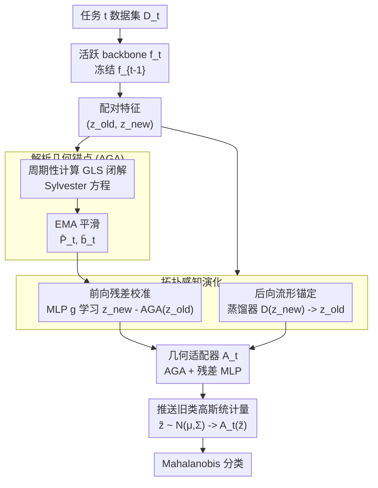

# Geometry-Anchored Transport Framework for Exemplar-Free Class-Incremental Learning

**会议**: ECCV 2026  
**arXiv**: [2606.25347](https://arxiv.org/abs/2606.25347)  
**代码**: [https://github.com/HXuSz11/GATF_ECCV2026](https://github.com/HXuSz11/GATF_ECCV2026)  
**领域**: 持续学习 / 类增量学习  
**关键词**: 无样本类增量学习, 特征传输, 拓扑保持, Mahalanobis 分类, 表示漂移

## 一句话总结

本文提出 Geometry-Anchored Transport Framework，将特征传输从解耦的后处理范式转变为训练时的几何约束，通过解析几何锚点（Sylvester 方程闭解）抑制宏观各向异性漂移，配合拓扑感知演化约束局部流形退化，在无样本约束下稳定地传输旧类高斯统计量以实现可靠 Mahalanobis 评估。

## 研究背景与动机

无样本类增量学习（Exemplar-Free Class-Incremental Learning, EFCIL）要求在完全不保存旧样本的条件下持续学习新类别——这意味着模型必须依赖之前学到的统计知识（如类条件均值与协方差）来区分旧类。主流方案采用原型加高斯参数推断：对每类维护一个多元高斯分布，在新任务的特征空间中以 Mahalanobis 距离做贝叶斯分类。这种方法优雅且高效，但它隐含一个假设：旧类的高斯统计量能被准确「搬运」到当前的特征空间。

然而，随着 backbone 每学完一个新任务，其 embedding 空间就经历一次连续非线性形变——这就是表示漂移（representation drift）。把旧类的统计量映射到形变后的空间并非易事。现有方法普遍采用解耦的两阶段范式：先用交叉熵和知识蒸馏在新数据上训练 backbone，再训练一个后处理 adapter 将旧类原型投影到新空间。这种「先训练、后适配」的流程存在两个结构性缺陷。

**第一，拓扑退化。** backbone 的优化只关心新类的判别和蒸馏损失，没有考虑它对旧类邻域结构的破坏。当 embedding 空间因参数更新而发生旋转和非均匀位移时，旧类之间的相对空间关系可能被严重扭曲——后处理 adapter 面对的是已经「拓扑崩塌」的流形，映射精度天然受限。**第二，各向异性漂移被 Mahalanobis 放大。** Mahalanobis 距离依赖协方差逆矩阵，沿低方差方向（即特征空间中的「窄轴」）的微小漂移会被逆协方差剧烈放大，导致决策边界偏移。解耦范式下的 adapter 通常优化的是各向同性 Euclidean 目标，对这些低方差方向上的敏感误差几乎不加惩罚。

本文的核心洞察是：与其等特征空间「坏了」再修，不如把传输约束直接嵌入 backbone 的训练过程——让特征在演化的同时保持与旧类几何的一致性。**核心 idea：提出 Geometry-Anchored Transport Framework，将特征传输从后处理适配变为训练时的内生约束——用解析几何锚点（AGA）抑制各向异性宏观漂移，用拓扑感知演化（Topology-Aware Evolution）限制局部流形退化，使 backbone 训练、线性锚定和非线性残差校准三者协同优化，最终输出一个训后即用的几何感知 adapter，无需额外的解耦微调。**

## 方法详解

### 整体框架

本文的核心问题设定如下：在第 t 个任务到来时，冻结旧 backbone f_{t-1}，用当前数据 D_t 训练新 backbone f_t。对同一张输入 x，f_{t-1} 与 f_t 分别生成特征 z_old 和 z_new。评估阶段沿用 Mahalanobis 分类规则，但旧类的类条件高斯统计量 (μ_c, Σ_c) 必须被「推送」到 f_t 的特征空间中。

传统的解耦做法是：先在前向传播中训练 f_t（只看新类），再额外训练一个后处理网络把旧类统计量投射过去。本文的做法则完全不同：训练 f_t 的同时，共同优化一个几何感知的适配器 A_t，使旧类统计量后续的推送本身就是准确的。

框架包含两个核心组件。**宏观层面**，解析几何锚点（AGA）通过求解 Sylvester 方程得到一个闭式仿射映射 P_t z + b_t，捕获从旧空间到新空间的主流全局漂移，并对低方差方向施加各向异性收缩以抑制 Mahalanobis 敏感误差。**微观层面**，拓扑感知演化通过一对损失项约束 backbone 的局部形变：前向残差校准让一个轻量 MLP 学习线性锚点未能建模的非线性位移，后向流形锚定则利用一个辅助蒸馏器保证新特征仍能重构出旧特征，迫使 backbone 的更新保持拓扑保持。

两者在训练过程中协同工作：AGA 提供零梯度的闭式基线，backbone 和残差网络在其约束下演化；AGA 本身每隔若干步利用当前配对特征重新计算，并通过指数移动平均平滑更新。最终 A_t(z) = P̄_t z + b̄_t + g(z; θ_t) 在训练完成后直接用于旧类高斯统计量的推送，无需任何后处理精调。

### 关键设计

**1. 解析几何锚点（AGA）：用 Sylvester 方程捕捉宏观漂移**  

旧特征到新特征之间最直观的对应关系是什么？对同一个输入 x，f_{t-1} 和 f_t 的输出应当存在某种可预测的偏移。本文提出用一个仿射映射 P_t z + b_t 来近似这种全局关系，但关键是要让这个映射「懂得」Mahalanobis 的几何：沿低方差方向的传输误差会被逆协方差放大，因此这些方向上需要更强的正则惩罚。

具体的构造如下。记配对新旧特征为 (z_old, z_new)，用广义最小二乘（GLS）求解仿射映射，但误差度量用的是加权 Mahalanobis 范数 ||·||^2_{Σ_new^{-1}}——这就给低方差方向的偏差施加了更高权重。加上 Frobenius 范数正则项 ρ||P||_F^2，最优解 P* 满足一个 Sylvester 方程：P* Σ_old + ρ Σ_new P* = C_on^T，其中 C_on 是 z_old 与 z_new 的互协方差。该方程有谱形式的闭式解 X_ij = (U^T C_on^T V)_ij / (γ_j + ρ λ_i)，分母 γ_j + ρ λ_i 很关键：当 Σ_new 的某方向特征值 λ_i 很小（窄轴），或 Σ_old 的 γ_j 很小（旧空间低方差方向），惩罚项 ρ λ_i 和分母中的对应项自然限制了沿该方向的映射幅度，实现了各向异性收缩（anisotropic shrinkage）。这本质上是在说：不要试图在「数据几乎没有提供信息的维度」上大跨度地映射旧特征——那些维度上的任何估计误差都会被后续 Mahalanobis 评估放大。

AGA 作为一个零梯度先验在训练中使用：它的参数由闭式解确定，不参与梯度传播，但 backbone 和残差网络的优化要以其为基准进行校准。此外，由于 f_t 随 SGD 不断变化，(z_old, z_new) 的联合分布也在演化，AGA 每隔 Δ 步利用当前配对特征更新一次瞬时闭解，并以 EMA 平滑得到稳定的映射基线。

**2. 拓扑感知演化：前向残差校准 + 后向流形锚定**  

AGA 只建模了全局线性漂移，但 backbone 的演化会引入局部非线性形变——这些形变无法被一个简单的仿射映射捕捉。拓扑感知演化通过一对损失项 ℒ_top 将 backbone 的演化约束在拓扑保持的范围内。

第一部分是前向残差校准（forward residual calibration）。适配器 A_t 被分解为 AGA 线性部分和一个轻量 MLP g(z; θ_t)：A_t(z) = P̄_t z + b̄_t + g(z; θ_t)。在训练时，g 的目标是拟合 z_new 减去 AGA 先验后的「残余位移」：||g(z_old) - stopgrad(z_new - Ā_t^lin(z_old))||^2_2。stopgrad 运算符防止残差校准反向限制 backbone 的 plasticity：g 去追赶当前特征空间的变化，但不把这种追赶反传给 f_t。这样，线性先验承载全局刚性漂移，MLP 吸收局部柔性形变，各司其职。

第二部分是后向流形锚定（backward manifold anchoring）。这是阻止拓扑退化的关键：既然直接惩罚新旧特征之间的 Euclidean 距离会限制 plasticity，不如换一个更巧妙的约束——训练一个辅助蒸馏器 D，让它能从 z_new 重构出 z_old：||D(z_new) - z_old||^2_2。注意 D 本身也在优化，但它的梯度会反传到 f_t 上。这意味着：backbone 可以自由地学习新类的判别特征，但不能以一种让旧特征「无法被还原」的方式扭曲流形。如果 f_t 的更新导致了拓扑退化——例如原本相距很近的两个旧类在新空间中被远远拉开——那么蒸馏器就无法从 z_new 准确恢复 z_old，损失会惩罚这种形变。这本质上是用一个生物狗（oracle）的还原能力作为流形完整性的代理指标。

两部分合起来的 ℒ_top 与交叉熵和反坍缩损失（AdaGauss 引入，防止不同类的高斯分布坍缩到一起）共同组成总训练目标：ℒ_total = ℒ_CE + λ_top ℒ_top + ℒ_ac。

**3. EMA 平滑与周期性先验刷新**  

f_t 的 SGD 演化意味着 (z_old, z_new) 的联合分布在每个 mini-batch 后都在变。如果每一轮都基于瞬间分布重解 Sylvester 方程，P_t 的估计方差会很大，反而干扰训练。本文的策略是：每隔 Δ 步（实验中 Δ = 10 epochs），从当前 batch 中采样配对特征计算一次瞬时 GLS 估计 (P̂_t, b̂_t)，然后以动量 m 更新 EMA：P̄_t ← m P̄_t + (1-m) P̂_t。在两次刷新之间，适配器使用稳定平滑的 EMA 先验计算 ℒ_top。这种设计使 backbone 的优化有一个平稳的几何基线，避免了先验高频抖动带来的训练不稳定。

### 损失函数 / 训练策略

总损失包含三项：

- **ℒ_CE**：当前任务新类的交叉熵损失，驱动 backbone 学习新类别判别特征。
- **ℒ_top**：拓扑感知损失，含前向残差校准（令 MLP g 拟合 z_new 减去 AGA 先验后的残余）和后向流形锚定（蒸馏器从 z_new 重构 z_old），两部分均为 L2 损失。
- **ℒ_ac**：反坍缩损失（AdaGauss 原版），防止各类高斯分布在特征空间中坍缩到一起。

超参数 λ_top 控制拓扑约束的强度。训练采用 SGD 优化器，ResNet-18 backbone，特征维度 512 投影到 64 维原型空间，CIFAR-100/TinyImageNet/ImageNet-100 训练 200 epochs。AGA 刷新间隔 K=10 epochs，每次刷新采样约 1 个 epoch 的步数，额外计算开销约 6.7%（经理论分析，消耗主要来自两次额外前向传播，GLS 矩阵求解在低维协方差上几乎零成本）。

## 实验关键数据

### 主实验

本文在 CIFAR-100、TinyImageNet、ImageNet-100（from scratch）和 CUB-200（pretrained backbone）四个基准上，与 EWC、LwF、SDC、PASS、FeTrIL、FeCAM、EFC、ADC、LDC、AdaGauss、DPCR 等 11 种方法对比。下面是 CIFAR-100 和 TinyImageNet（from scratch）的主结果：

| 方法 | CIFAR-100 T=10 Alast | CIFAR-100 T=10 Ainc | TinyImageNet T=10 Alast | TinyImageNet T=10 Ainc |
|------|---------------------|--------------------|------------------------|-----------------------|
| AdaGauss (NeurIPS24) | 46.8 | 60.9 | 32.9 | 45.8 |
| DPCR (ICML25) | 50.2 | 62.8 | 34.3 | 46.9 |
| **Ours** | **52.0** | **64.4** | **37.2** | **50.6** |

在更长的任务序列（T=20）下优势更明显：CIFAR-100 T=20 上本文 Alast 43.0 远超 DPCR 的 39.8（+3.2 pp）；TinyImageNet T=20 上 Alast 31.5 对次优 EFC 的 28.4（+3.1 pp）。ImageNet-100 上本文同样取得最高 Alast（T=10 时 53.2，T=20 时 44.7）。CUB-200 有预训练 backbone 导致表示漂移较小，本文与 AdaGauss 持平，EFC 在该设置下略优。

### 消融实验

| 配置 | CIFAR-100 T=10 Alast | 说明 |
|------|---------------------|------|
| 无 Top-Aware + 无 AGA + 精调 | 46.8 | 等价于 AdaGauss：解耦训练 + 后处理适配 |
| 有 Top-Aware + 无 AGA + 精调 | 50.3 | 仅拓扑约束，已有明显提升 |
| 有 Top-Aware + 有 AGA + 精调 | 51.7 | 双组件均启用 |
| **有 Top-Aware + 有 AGA + 无精调** | **52.0** | 完整框架，无需后处理精调反而更优 |

关键发现：
- **AGA 的独立贡献**：对比「Top-Aware + 无 AGA」（50.3）和「Top-Aware + AGA + 无精调」（52.0），AGA 带来了 +1.7 pp 的提升。
- **后处理精调不是必需的**：训练时耦合好的适配器在训后直接可用，精调反而可能破坏训练时建立的一致性（CIFAR-100 上精调后反而从 52.0 降至 51.7）。
- **TinyImageNet T=20 是例外**：长时间序列累积的漂移使隔离精调略有增益（31.7 vs 31.5），但幅度极小。
- **原型漂移分析**：本文追踪了旧类均值特征与传输后的原型之间的漂移距离，全框架显著优于 AdaGauss 和仅拓扑约束的变体，且对早期任务（漂移累积更大）的抑制效果最明显。
- **Mahalanobis 尾部误差**：沿特征值递减的方向（窄轴），AGA 的抑制作用随特征值减小而增强——这与定理 3.1 中各向异性收缩的谱分析一致。
- **旧类决策边界**：加入 AGA 后，旧类的 margin 分布整体右移（正值增多），意味着旧类更难被误分类为新类。

## 亮点与洞察

- **关键范式转换：从后处理修补到训练时约束**。本文最本质的贡献不是设计了一个更好的 adapter 结构，而是把「特征传输」这个任务从解耦的后处理步骤迁移到 backbone 训练的主循环中。这类似于将「先犯错再纠正」变为「在演化的同时保持约束」——在持续学习的场景下更符合直觉：backbone 应该知道自己接下来将要面对的评估是什么。

- **Sylvester 方程作为几何先验**。将跨空间映射求解为加权 GLS 的闭式解，巧妙利用了 Mahalanobis 范数的几何意义——低方差方向的误差惩罚天然更高。谱形式 X_ij = ... / (γ_j + ρ λ_i) 直观展示了各向异性收缩的机制，设计优雅。

- **用可逆性代理拓扑保持**。后向流形锚定用「从 z_new 能否重构 z_old」来衡量拓扑完整性，而不是直接监督特征距离。这是一个间接但有效的设计：它允许 backbone 自由移动特征点的位置，但禁止了「无法逆推」的形变（如维度坍缩、类间融合）。

- **AGA 的 EMA 刷新是关键工程细节**。如果只在训练开始时求解一次 AGA 然后固定，由于 backbone 在演化，这个先验很快就会过时。如果每步都重新求解，高方差波动会干扰训练。每 10 epochs 刷新 + EMA 平滑的方案平衡了两端，额外开销仅 6.7%。

## 局限与展望

- **线性先验的局限**。AGA 是一个全局仿射映射，虽然配合残差 MLP 可以建模局部非线性，但对于严重非平稳或高度非线性的表示漂移（如特征空间经历大幅度旋转或维度重分布），线性近似的精度可能不足。
- **理论保证绑定高斯假设**。定理 3.2 的 margin 稳定性界依赖于类条件高斯假设和协方差非奇异条件。当协方差估计有噪声或接近奇异时，实际性能可能偏离理论保证。
- **预训练 backbone 场景优势不明显**。CUB-200 上表示漂移本就轻微，本文相比 AdaGauss 没有显著优势，甚至不如 EFC——这说明当漂移很小时，复杂的几何约束回报递减。

## 相关工作与启发

- **vs DPCR（ICML 2025）**：DPCR 是效果最好的后处理方案——在 backbone 训练完后再用双投影和岭回归重建分类器。本文与 DPCR 的核心区别不在映射形式，而在时机：本文在训练过程中就用几何约束保护旧类流形，使后续统计量推送本身更加可靠，而不是等空间被扭曲后再修复。
- **vs AdaGauss（NeurIPS 2024）**：AdaGauss 引入类条件协方差和反坍缩损失，但 transport 仍采用解耦后处理。本文直接继承了 AdaGauss 的高斯统计书签记录和反坍缩损失，在其上增加几何锚定与拓扑感知训练——这意味着本文的消融实验可以干净地隔离出传输机制的贡献。
- **vs EFC / LDC**：这些方法也使用辅助神经网络映射旧原型，但同样在解耦范式中训练，优化的是 Euclidean 目标而非 Mahalanobis 几何敏感目标。本文的 AGA 先验提供了后者所缺少的几何方向性。

## 评分

- 新颖性: ⭐⭐⭐⭐ 将特征传输从后处理提升为训练时约束这一范式转换简洁有力，Sylvester 方程做几何锚定也很优雅。总体是增量改进但洞察深刻。
- 实验充分度: ⭐⭐⭐⭐⭐ 4 个基准 × 2 种任务划分 × 重复 5 次，消融、诊断分析（原型漂移、Mahalanobis 尾部、决策 margin、旧-新混淆率）十分系统。计算开销也做了定量分析。
- 写作质量: ⭐⭐⭐⭐ 理论推导（Sylvester 方程 + margin 稳定性定理）表述严谨，消融和诊断实验逻辑链条清晰。Introduction 对「解耦范式的结构性缺陷」剖析到位。图 1 的拓扑可视化直观有说服力。
- 价值: ⭐⭐⭐⭐ 对 EFCIL 社区提供了 training-time geometry anchoring 这一可泛化的设计原则，不依赖特定后处理结构，有潜力迁移到更多持续学习设定。

<!-- RELATED:START -->

## 相关论文

- [\[ECCV 2024\] ABC Easy as 123: A Blind Counter for Exemplar-Free Multi-Class Class-Agnostic Counting](../../ECCV2024/others/abc_easy_as_123_a_blind_counter_for_exemplar-free_multi-class_class-agnostic_cou.md)
- [\[ICLR 2026\] Consistency-Driven Calibration and Matching for Few-Shot Class Incremental Learning](../../ICLR2026/others/consistency-driven_calibration_and_matching_for_few-shot_class_incremental_learn.md)
- [\[CVPR 2026\] Drainage: A Unifying Framework for Addressing Class Uncertainty](../../CVPR2026/others/drainage_a_unifying_framework_for_addressing_class_uncertainty.md)
- [\[ICLR 2026\] Random Anchors with Low-rank Decorrelated Learning: A Minimalist Pipeline for Class-Incremental Medical Image Classification](../../ICLR2026/others/random_anchors_with_low-rank_decorrelated_learning_a_minimalist_pipeline_for_cla.md)
- [\[ECCV 2024\] An Incremental Unified Framework for Small Defect Inspection](../../ECCV2024/others/an_incremental_unified_framework_for_small_defect_inspection.md)

<!-- RELATED:END -->
