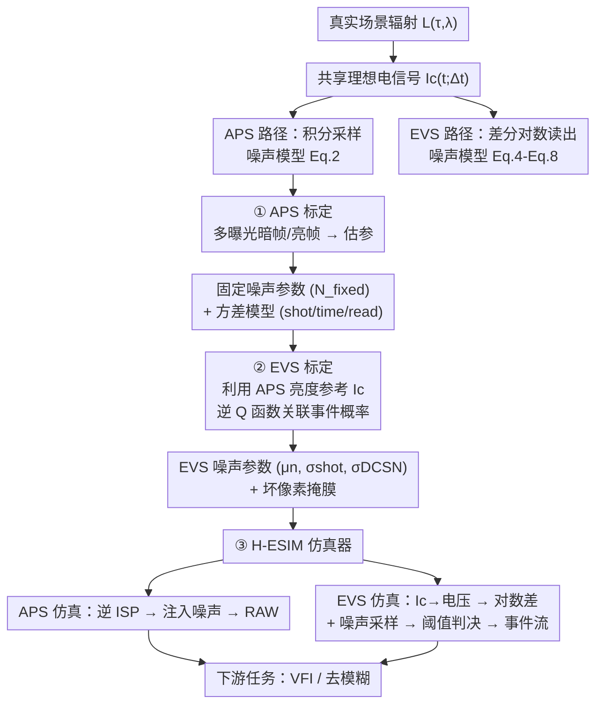

# Hybrid Event–Frame Sensors: Modeling, Calibration, and Simulation

**会议**: ECCV 2026  
**arXiv**: [2511.18037](https://arxiv.org/abs/2511.18037)  
**代码**: [https://yunfanlu.github.io/HESIM](https://yunfanlu.github.io/HESIM) (有)  
**领域**: 传感器建模 / 计算摄影  
**关键词**: 混合事件-帧传感器, 传感器噪声建模, 噪声标定, 事件相机仿真, H-ESIM

## 一句话总结

本文首次提出混合事件-帧传感器的统一统计噪声模型、标定流程和仿真器 H-ESIM，通过 APS 与 EVS 共享光度信号的联合建模，从真实传感器数据中估计噪声参数，并生成与硬件噪声统计一致的 RAW 帧和事件流，在视频帧插值和去模糊任务上验证了仿真到真实域的迁移有效性。

## 研究背景与动机

事件相机以其异步触发机制提供高动态范围和微秒级延迟，而传统帧相机则捕获稠密的全帧强度信息，两种模态在时域和空域天然互补。大量工作探索事件-图像融合来利用这种互补性，但大多数现有方法依赖分束器来实现事件与图像的空间对齐——这需要复杂的光学校准，导致庞大且不实用的硬件设计。近年来，混合传感器通过先进半导体集成在同一芯片上整合了主动像素传感器（APS）和事件视觉传感器（EVS），在实现紧凑、精确的时空对齐的同时，消除了分束器的需求。这种一体化设计使得混合传感器可轻松部署于手机、无人机等嵌入式平台。

然而，混合传感器电路复杂度的提升引入了比传统相机更复杂的噪声模式。其共享电路架构中，APS 和 EVS 像素交错排列，产生相互耦合的噪声：APS 侧包含光子散粒噪声、暗电流噪声、固定模式噪声和量化噪声；EVS 侧则通过差分对数域读出触发离散的事件信号，噪声不仅来自光子散粒和暗电流，还受到光照水平和阈值的非线性耦合影响。现有的事件仿真器如 ESIM 和 v2e 依赖手工设计的经验规则和超参数，既不支持 APS 帧的联合仿真，也无法从真实传感器数据中学习噪声参数。这导致一个核心矛盾：混合传感器需要在仿真环境中训练下游视觉模型，却没有能够真实反映其噪声统计特性的仿真工具。

本文的切入角度是：既然 APS 和 EVS 共享同一光学系统的理想电信号，就可以将两种模态的噪声建模统一到同一个统计框架下，通过精心设计的标定流程从真实数据中估计参数，再基于这些参数构建一个可复现的联合仿真器。**核心 idea：提出第一个基于统计的混合传感器成像噪声模型，统一描述 APS 和 EVS 的噪声行为（光子散粒、暗电流、固定模式、量化噪声），并建立从理想信号到 RAW 帧（APS）和事件概率（EVS）的完整映射，进一步开发标定管线从真实数据中估计噪声参数，最后基于标定参数构建 H-ESIM 仿真器。</bold>**

## 方法详解

### 整体框架

H-ESIM 的整体流程分为三个阶段：从多曝光数据中构建 APS 噪声模型并标定参数 → 利用标定后的 APS 结果作为亮度参考标定 EVS 噪声参数 → 基于联合标定参数实现高帧率视频到 RAW 帧 + 事件流的仿真。这一流程的核心线索是 APS 和 EVS 共享相同的理想光学信号 $I_c(t;\Delta t)$，因此可通过统一框架描述两种模态的噪声。

### 关键设计

**1. 统一统计成像噪声模型：建立 APS 与 EVS 共享的噪声描述框架**

混合传感器的 APS 与 EVS 共享同一光学系统，因此理想电信号 $I_c(t;\Delta t)$ 对两种像素是相同的。APS 做积分采样，输出 RAW 强度帧 $I_o$；EVS 做差分对数读出，输出离散的 $\pm1$ 事件。本文的核心洞察是：把两种输出都建模为 $I_c$ 的函数加上不同的噪声。对 APS，噪声分解为光照依赖的散粒噪声、曝光时间依赖的暗电流噪声以及固定模式噪声（行噪声、黑电平校正和量化噪声），写作 $I_o = I_c + N_{\text{shot}}(I_c) + N_{\text{time}}(\Delta t) + N_{\text{fixed}}$。对 EVS，噪声通过电压域的涨落影响事件触发概率：在静态场景下，ON/OFF 事件发生的概率相等且等于 $Q(\theta/\sigma_n)$，其中 $\sigma_n$ 由光子散粒和暗电流的联合方差决定。这个 $Q$ 函数（标准正态分布的右尾概率）是本文连接 EVS 噪声参数与可观测事件概率的关键数学桥梁。

**2. APS 噪声标定管线：控制变量法逐项分离混合噪声成分**

标定首先在 APS 侧完成，利用暗场和多曝光亮场数据分离各噪声分量。暗帧序列直接提供固定模式噪声 $N_{\text{FP}}$（包括行偏置 $N_{\text{row}}$ 和黑电平校正 $N_{\text{BLC}}$）以及暗电流偏移 $N_{\text{DP}}$。亮帧则通过减去暗分量后计算像素级方差，用二阶多项式拟合信号 $I_c$ 和曝光时间 $\Delta t$ 到方差 $\text{Var}(N_a)$ 的映射。值得注意的是，针对 Quad-Bayer 布局的 16 个像素位置分别拟合独立的系数 $\boldsymbol{\beta}_a$，从而捕获混合布局引入的空间非均匀性。这一策略的优势在于：APS 标定不仅提供自己的噪声参数，它产生的干净亮度参考 $I_c$ 还为后续 EVS 标定提供了关键输入——不需要间接推断亮度。

**3. EVS 噪声标定：逆 Q 函数关联事件概率与光照强度**

EVS 标定面临两大难点：APS 工作于数字强度域而 EVS 工作于对数电压域，需要建立可解释的单调映射 $I_c \rightarrow \hat{V}_t$；光子散粒与暗电流在混合布局上存在相关性。本文采用仿射映射 $\hat{V}_t + V_{\text{PD}} \approx \beta_1 I_c + \beta_2$ 桥接两个域，并将硬件阈值 $\Theta$ 乘以比例因子 $\beta_0$ 转换为仿真阈值，再将 $\sigma_{\text{shot}} = \beta_3 I_c$、$\sigma_{\text{DCSN}} = \beta_4$ 和相关系数 $\rho = -\beta_5$ 代入逆 Q 函数公式，建立 $Q^{-1}(P)$ 与 $I_c$ 的非线性回归关系：

$$ Q^{-1}(P) = \frac{\beta_0\Theta(\beta_1 I_c+\beta_2)}{\sqrt{2((\beta_3 I_c)^2+\beta_4^2+2\beta_5\beta_3 I_c\beta_4)}} $$

通过梯度下降拟合 $\boldsymbol{\beta}_e$ 并通过暗场数据估计偏置 $\mu_n$，同时生成坏像素掩膜来处理 $\mu_n \neq 0$ 的异常像素。这一设计使得 EVS 噪声参数具有物理解释性，且实验结果（Fig.7）显示 200 次随机初始化的变异系数最大仅 0.066，标定极其稳定。

**4. H-ESIM 仿真器：基于标定参数的可控噪声联合生成**

给定输入的高帧率（3200 fps）视频，APS 仿真器通过逆 ISP 管线（逆 gamma、逆颜色矩阵、重采样到 Bayer 模式）将 sRGB 帧映射到 RAW 域，然后注入标定的固定模式和随机噪声。EVS 仿真器复用 APS 前端获取 $I_c$，映射到电压域后计算信号项 $S$ 和噪声项 $N_e$，采样 $N_e \sim \mathcal{N}(\mu_n, \sigma_n^2)$，通过 $S+N_e$ 与阈值 $\theta$ 的比较决定 ON/OFF 触发。两个仿真器共享同一套输入和参数接口，确保一致性。一个关键工程细节是使用 3200 fps 的真实高速视频作为输入，避免了 ESIM/v2e 中帧插值引入的时间伪影。

### 损失函数 / 训练策略

损失函数不适用。H-ESIM 本身不是学习型方法，而是基于标定参数的物理仿真器。标定过程使用最小二乘（APS 方差拟合）和梯度下降（EVS 逆 Q 函数拟合）作为参数估计工具，不涉及神经网络训练损失。

## 实验关键数据

### 主实验

评估在两个混合传感器（GEN2 和 Eiger，不同像素布局和色彩滤波阵列）上展开。其中 Eiger 的 APS-EVS 集成度更高，每 Quad-Bayer 块内嵌入四个彩色滤波事件像素，噪声更显著。

| 任务 | 数据集 | 指标 | 方法 | 仿真器 | Eiger | GEN2 |
|------|--------|------|------|--------|-------|------|
| VFI | 真实混合传感器数据 | PSNR↑ | HR-INR w/o | ESIM | 32.41 | 34.26 |
| VFI | 真实混合传感器数据 | PSNR↑ | HR-INR w | H-ESIM | **35.24** | **35.52** |
| VFI | 真实混合传感器数据 | SSIM↑ | HR-INR w/o | ESIM | 0.7821 | 0.9134 |
| VFI | 真实混合传感器数据 | SSIM↑ | HR-INR w | H-ESIM | **0.8862** | **0.9278** |
| VFI | 真实混合传感器数据 | LPIPS↓ | HR-INR w/o | ESIM | 0.1979 | 0.0726 |
| VFI | 真实混合传感器数据 | LPIPS↓ | HR-INR w | H-ESIM | **0.0787** | **0.0419** |

### 消融实验

| 配置 | 关键指标 | 说明 |
|------|---------|------|
| H-ESIM 预训练的 TL-XL | VFI PSNR 33.87 (Eiger) | 完整模型 |
| ESIM 预训练的 TL-XL w/o H-ESIM | VFI PSNR 32.30 (Eiger) | 替换仿真器后掉了 1.57dB |
| H-ESIM + v2e 对比 | VFI PSNR 32.30 vs 33.87 (Eiger) | H-ESIM 优于 v2e |
| 去模糊 eSL w/ H-ESIM | CLIP-IQA 0.4346 | +0.1276 相比 w/o |
| 去模糊 eSL w/o H-ESIM | CLIP-IQA 0.3070 | 基线 |

### 关键发现

- **APS-EVS 集成度越高，固定模式噪声越显著**：Eiger（每块4个EVS像素）的行噪声远强于 GEN2（每块1个），说明增强集成直接放大固定噪声——反之也说明这类传感器的仿真更需要精确的噪声建模。
- **H-ESIM 微调在所有 VFI 方法上带来一致提升**：对 Eiger 的提升远大于 GEN2 的，说明当真实传感器噪声特征更强时，精确的标定仿真器带来的域迁移收益更大。
- **去模糊任务的提升集中在感知质量指标**（CLIP-IQA 提升 0.12-0.20），说明仿真主要改善了人类感知上的结构连贯性，而非传统数值指标。
- 定性结果（Fig.6）显示，H-ESIM 微调有效抑制了基线方法中噪声放大导致的孤立噪点，重建边缘更清晰连续。
- EVS 参数标定过程极为稳定：200 次随机初始化下所有参数的变异系数 < 0.066。

## 亮点与洞察

- **`Q` 函数作为 EVS 噪声分析桥梁**：将传统用于通信统计的 Q 函数引入事件传感器噪声建模，建立了"可观测的事件触发概率 ↔ 不可观测的像素级噪声方差"之间的可解析映射，这使得 EVS 标定从经验调参变成了可逆推的参数估计。
- **APS 标定结果复用为 EVS 亮度参考**：不单独设计 EVS 亮度推断方案，而是直接利用 APS 多曝光标定恢复的干净强度 $I_c$，不仅简化了标定流程，还保证了两种模态的亮度一致性。
- **Quad-Bayer 位置级标定**：针对混合传感器特有的像素布局（APT/EVS 交错），对 16 个 Quad-Bayer 子位置分别拟合独立的噪声模型，捕获了布局依赖的空间非均匀性——这是区分混合传感器与传统相机噪声的关键差异。

## 局限与展望

- **不覆盖极端条件**：当前模型假设噪声幅度小于信号水平（非极低光照），采用高斯近似；极低光照、极端温度或带宽受限条件下的噪声统计可能偏离高斯假设。
- **未处理 PRNU（光响应非均匀性）**：光响应非均匀性在本文的标定框架中被各位置系数吸收，没有独立建模；这在高精度成像需求下可能需要单独标定。
- **标定需要专门的采集设备**：多曝光、控制亮度的标定数据采集需要实验室条件，对没有混合传感器的研究者不太友好。
- **可将标定流程扩展到更多传感器代际**：随着混合传感器芯片更新，噪声模式可能变化，需要周期性重新标定并更新仿真参数库。

## 相关工作与启发

- **vs ESIM / v2e**：ESIM 和 v2e 是纯事件仿真，不生成 RAW 帧，也不支持混合传感器特有的布局耦合噪声；H-ESIM 是首个统一 APS+EVS 的统计仿真框架，且参数来源于真实传感器标定而非手工调整。
- **vs DVS-Voltmeter / ADV2E**：这些基于物理建模的事件仿真器同样依赖手工参数，且未涉及 APS 侧噪声，H-ESIM 则在统计框架下实现了跨模态的一致建模。
- **vs Noise2NoiseFlow / 数据驱动噪声建模**：数据驱动方法从数据直接学习噪声分布但不具备物理解释性，H-ESIM 的统计模型参数可直接映射到具体噪声源（如行噪声增益、暗电流率），更易于分析和调试。

## 评分

- 新颖性: ⭐⭐⭐⭐⭐ [首个混合传感器统一噪声模型 + 标定流水线 + 仿真器，填补了一个明确的空白]
- 实验充分度: ⭐⭐⭐⭐ [在两个传感器 + 两类下游任务上验证，标定稳定性测试充分；但去模糊仅用无参考指标，缺少真值对比]
- 写作质量: ⭐⭐⭐⭐⭐ [结构清晰，核心贡献层层递进，公式推导完整但不过度堆砌]
- 价值: ⭐⭐⭐⭐⭐ [混合传感器是嵌入式视觉的明确趋势，该工作为后续算法开发提供了关键的仿真基础设施]

<!-- RELATED:START -->

## 相关论文

- [\[ECCV 2026\] FedLAS: Feature-Modulated Bidirectional Label Smoothing for Neural Network Calibration](fedlas_feature-modulated_bidirectional_label_smoothing_for_neural_network_calibr.md)
- [\[ICLR 2026\] Measuring Uncertainty Calibration](../../ICLR2026/others/measuring_uncertainty_calibration.md)
- [\[CVPR 2025\] Event Ellipsometer: Event-based Mueller-Matrix Video Imaging](../../CVPR2025/others/event_ellipsometer_event-based_mueller-matrix_video_imaging.md)
- [\[AAAI 2026\] HybriDLA: Hybrid Generation for Document Layout Analysis](../../AAAI2026/others/hybridla_hybrid_generation_for_document_layout_analysis.md)
- [\[ICLR 2026\] PriorGuide: Test-Time Prior Adaptation for Simulation-Based Inference](../../ICLR2026/others/priorguide_test-time_prior_adaptation_for_simulation-based_inference.md)

<!-- RELATED:END -->
