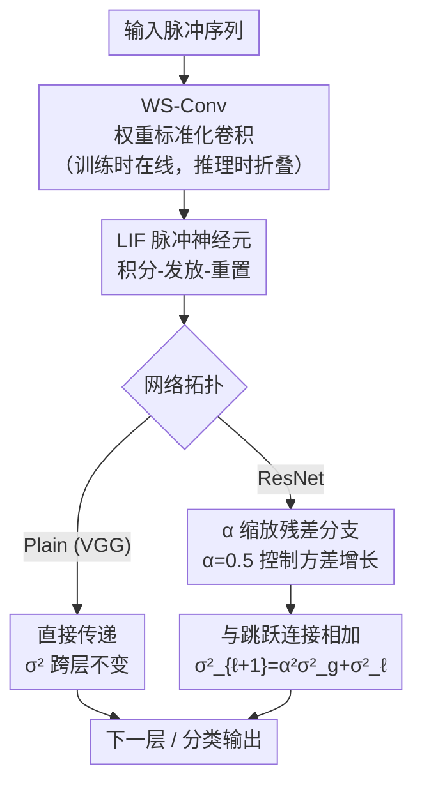

# Intrinsically Stable Spiking Neural Networks: Overcoming the Performance Barrier in the Absence of Batch Normalization

**会议**: ECCV 2026  
**arXiv**: [2606.31695](https://arxiv.org/abs/2606.31695)  
**代码**: [https://github.com/Ruichen0424/IS-SNN](https://github.com/Ruichen0424/IS-SNN)  
**领域**: 神经形态计算 / 模型压缩  
**关键词**: 脉冲神经网络, 无批归一化训练, 权重标准化, 发放率稳定性, 离线重参数化

## 一句话总结
IS-SNN 通过拓扑感知的权重标准化和改进的残差连接，在完全移除激活归一化层（Batch Normalization）的情况下，使深度脉冲神经网络的发放率保持稳定，训练完成后将标准化操作折叠进静态权重，推理时零归一化开销，在 ImageNet 上达到 68.05% 精度且 FPGA LUT 资源消耗降低 96.4%。

## 研究背景与动机
脉冲神经网络（SNN）因其事件驱动的稀疏计算特性，在神经形态硬件上有望实现极低功耗推理。然而，当前高性能深度 SNN 严重依赖批归一化（BN）来稳定训练和提升精度。标准静态 BN 虽然可以在推理时折叠进突触权重或阈值，但领先模型普遍使用时间/批次依赖的动态 BN 变体（如 TEBN、TAB、tdBN），这些变体的归一化统计量必须在运行时逐时间步重新计算，无法折叠为静态参数，从而重新引入了乘法运算和统计追踪，削弱了 SNN 以累加为核心的数据通路优势。

一个关键困境由此产生：直接移除激活归一化并非可行方案。前向信号分析表明，缺乏统计控制的深度 SNN 会遭遇**灾难性发放率衰减**（catastrophic firing-rate decay）——神经元发放率随层深急剧下降或饱和，导致信号传播中断、训练崩溃。已有 BN-free 尝试（如 OTTT）仅适用于浅层网络和小规模数据集，尚未建立起适用于现代深度架构的通用方案。本文由此切入，将问题视角从"优化不稳定性"转向"信号存活"，核心 idea 是：通过权重空间的拓扑感知标准化和残差方差控制，在训练时维持发放率稳态，在推理时完全消除归一化开销。

## 方法详解

### 整体框架
IS-SNN 将标准 SNN 中的 Conv-BN-SN 最小重复单元（MRU）替换为 WS-Conv-SN：每次训练步骤开始时，对卷积层权重在线执行标准化（减均值、除标准差、乘以拓扑感知的缩放因子 $\gamma_\ell$），然后用标准化后的权重进行前向传播。训练结束后，权重及其统计量固定，标准化操作被数学折叠进静态权重，推理时的网络结构与裸 BN-free 网络完全一致——无运行时归一化统计追踪、无归一化相关乘法，仅保留膜电位累积和阈值比较。

对于 plain 网络（VGG），MRU 就是 WS-Conv $\to$ SN 的简单堆叠；对于残差网络，MRU 由一个 transition block（重置方差统计）和若干 residual block 组成，每个 residual block 在跳跃连接分支上引入缩放因子 $\alpha$ 控制方差增长，连接到恒等映射后再传入下一层。

### 关键设计

**1. 权重标准化与离线重参数化：以权重空间约束替代激活空间归一化**

深度 SNN 去掉 BN 后训练崩溃的根源在于预激活分布失控——发放率随层深指数衰减或饱和。IS-SNN 的思路是直接在权重空间施加约束，使预激活 $x_{pa}$ 逼近标准正态分布 $\mathcal{N}(0,1)$。由预激活的均值和方差公式 $\mu_{pa}=N\mu_{in}\mu_{W_i}$ 和 $\sigma_{pa}^2=N\sigma_{in}^2(\sigma_{W_i}^2+\mu_{W_i}^2)$ 可知，只需保证 $\mu_{W_i}=0$ 且 $\sigma_{W_i}^2=1/(N\sigma_{in}^2)$ 即可达成目标。IS-SNN 通过权重标准化显式满足这两条：

$$\hat{W}_{i,j} = \gamma_\ell \cdot \frac{W_{i,j} - \mu_i}{\sqrt{N\sigma_i^2 + \epsilon}}$$

其中 $\mu_i$ 和 $\sigma_i^2$ 是可学习权重 $W_{i,j}$ 在当前 batch 的统计均值和方差，$\gamma_\ell$ 是逐层缩放因子（由拓扑感知方差传播推导），$\epsilon=10^{-4}$。训练时每一步都动态标准化后做前向传播；训练完成后所有参数固定，$\hat{W}_{i,j}$ 被预计算为静态权重烧录进硬件。这一步的关键在于**解耦训练与推理**——训练阶段享受 WS 的稳定效果，推理阶段没有任何归一化开销，结构等同于裸 BN-free 网络。与之对比，标准静态 BN 折叠后仍会在神经元膜电位中引入恒定偏置电流（$b_{fused}$），破坏事件驱动的稀疏性；而 IS-SNN 的 WS 折叠后仅改变突触权重值，不会引入额外的恒流注入。

**2. 拓扑感知的方差传播：为不同网络结构逐层推导缩放因子 $\gamma_\ell$**

权重标准化公式本身只是手段，其有效性完全取决于 $\gamma_\ell$ 是否与网络拓扑匹配。IS-SNN 为此建立了一套拓扑感知的方差传播框架，定义三个核心参数：$\sigma_\ell$（层 $\ell$ 的理论输入标准差，仅由拓扑决定，跨时间步不变）、$\gamma_\ell \equiv 1/\sigma_\ell$（逐层缩放因子）、$\sigma_g$（特定脉冲神经元在标准正态输入下的经验输出标准差，是神经元的固有属性）。

对于 **plain 网络**（VGG），层 $\ell$ 的输出直接作为层 $\ell+1$ 的输入，方差跨层不变：$\sigma_{in,\ell+1}^2 = \sigma_{out,\ell}^2 = \sigma_g^2$，因此所有层的缩放因子统一设为 $\gamma_\ell \equiv 1/\sigma_g$。

对于**残差网络**，跳跃连接的加法操作会逐块累积方差，若不控制将导致深层信号爆炸。IS-SNN 引入改进的残差连接：

$$x_{\ell+1} = \alpha \cdot \text{SN}(f(x_\ell)) + x_\ell$$

其中 $\alpha$ 控制残差分支的贡献（所有架构统一设为 $0.5$，可实现为比特移位而非乘法）。跟踪方差传播可得 $\sigma_{\ell+1}^2 = \alpha^2 \cdot \sigma_g^2 + \sigma_\ell^2$。在每阶段的开始，transition block 将统计量重置为 $\sigma_{reset}^2 = (1+\alpha^2) \cdot \sigma_g^2$。通过逐层解析跟踪 $\sigma_\ell^2$，即可计算出整个 ResNet 拓扑中每一层的 $\gamma_\ell = 1/\sigma_\ell$。消融实验表明，将 $\gamma_\ell$ 固定为 1（退化为朴素 WS）会导致 VGG 完全无法训练（CIFAR-100 上仅 1.00%）和 ResNet 严重掉点（CIFAR-100 上从 76.02% 降至 70.69%），验证了拓扑感知推导的必要性。

**3. 脉冲神经元输出方差 $\sigma_g^2$ 的经验估计**

上述方差传播框架依赖一个关键参数 $\sigma_g^2$——脉冲神经元在标准正态输入下的输出方差。对于 ReLU 这类线性激活函数，输入-输出方差关系有解析闭式解；但脉冲神经元的发放过程涉及离散脉冲生成、膜电位积分与泄漏、时间步依赖的复位机制，高度非线性，难以解析推导。IS-SNN 采用经验模拟方法：以从 $\mathcal{N}(0,1)$ 采样的随机预激活刺激不同配置的 LIF 神经元，测量时间平均输出方差 $\overline{\sigma_g^2}$。对于标准 LIF（$\tau=2$，无输入衰减），在 T=4 时 $\overline{\sigma_g^2}=0.1234$；引入输入衰减后降至 $0.0290$。这些值在 T=4/8/16 下变化很小，表明估算具有时间步鲁棒性。该方法可推广至其他神经元模型（IF、PLIF 等）。$\sigma_g^2$ 一旦估算完毕即作为架构常量固定，不随训练或推理变化。对 $\sigma_g$ 注入高达 10% 的随机扰动，CIFAR-10/100 上精度仅下降 0.23%/0.31%，说明方法对 $\sigma_g$ 估计误差不敏感。

### 损失函数 / 训练策略
IS-SNN 不修改损失函数，使用标准交叉熵损失。训练采用替代梯度法（surrogate gradient），以 arctan 型光滑函数 $g(x)=\frac{1}{\pi}\arctan(\frac{\pi}{2}\alpha x)+\frac{1}{2}$ 近似 Heaviside 阶跃函数的前向脉冲生成，反向传播时使用 $g'(x)=\frac{2\alpha}{4+(\pi\alpha x)^2}$ 替代真实梯度（$\alpha=2$）。优化器为 SGD（动量 0.9）+ 余弦退火学习率调度。CIFAR 上初始学习率 0.02、weight decay 5e-4、batch size 128、训练 256 epoch；ImageNet 上初始学习率 0.1、weight decay 2e-5、batch size 256、训练 128/400 epoch。每步训练开始前执行在线权重标准化，训练结束后将所有标准化操作折叠为静态权重。

## 实验关键数据

### 主实验
IS-SNN 在静态数据集（CIFAR-10/100、ImageNet）和神经形态数据集（DVS-Gesture、CIFAR10-DVS）上，跨 VGG / ResNet / Spikformer 三种架构，与含动态 BN 的 SOTA 方法进行全面对比。下表摘录代表性结果。

| 数据集 | 模型 | 时间步 | w/o BN Acc | IS-SNN Acc | 动态 BN SOTA | SOTA 方法 |
|--------|------|--------|------------|------------|-------------|----------|
| CIFAR-10 | VGG-9 | 4 | 10.00 | 92.91 | 94.50 (T=6) | TET |
| CIFAR-10 | ResNet-19 | 4 | 90.46 | 94.32 | 94.44 | TET |
| CIFAR-10 | ResNet-19* | 4 | 89.94 | 96.02 | 95.94 | TAB |
| CIFAR-100 | ResNet-19 | 4 | 67.99 | 76.02 | 76.13 | TEBN |
| CIFAR-100 | ResNet-19* | 4 | 70.60 | 79.97 | 78.71 | TEBN |
| CIFAR-100 | ResNet-152 | 4 | 17.10 | 76.98 | — | — |
| ImageNet | ResNet-34 | 4 | 32.58 | 68.05 (E400) | 68.28 | TEBN |
| DVS-Gesture | 7B-Net | 16 | 77.08 | 96.88 | 97.92 | w/ BN |
| CIFAR10-DVS | VGGSNN | 8 | 10.0 | 77.7 | 78.1 | w/ BN |

\* 表示使用 Mixup/Cutmix 强数据增强。关键发现：(1) w/o BN 基线在深层模型上完全崩溃（ResNet-152 仅 17.10%，ImageNet ResNet-34 仅 32.58%），IS-SNN 稳定恢复至有竞争力水平；(2) IS-SNN 在强增强设置下超越 TAB 和 TEBN（CIFAR-100 ResNet-19* 达 79.97%，超过 TEBN 的 78.71%）；(3) IS-SNN 可即插即用地应用于 Spikformer（Transformer 架构），CIFAR-10/CIFAR-100 上分别达 95.43%/78.92%，超过原始 Spikformer 的 95.19%/77.86%。

### 消融实验

| 消融项 | 数据集/模型 | 指标 | 关键结论 |
|--------|-----------|------|---------|
| Full IS-SNN | CIFAR-100 ResNet-19* | 79.97% | 完整模型 |
| γ_ℓ ≡ 1（退化为朴素 WS） | CIFAR-100 VGG-11* | 1.00% | VGG 完全崩溃，拓扑感知 γ_ℓ 是必需的 |
| γ_ℓ ≡ 1（退化为朴素 WS） | CIFAR-100 ResNet-19 | 70.69% | ResNet 掉点 5.33%，残差结构有一定容错但仍需 γ_ℓ |
| w/o BN | CIFAR-100 ResNet-19B (5 transition blocks) | 1.00% | 更多 transition block 加剧发放率衰减 |
| IS-SNN | CIFAR-100 ResNet-19B (5 transition blocks) | 78.71% | IS-SNN 对拓扑变化鲁棒，仅比标准 ResNet-19 低 1.26% |
| IS-SNN + Dropout | CIFAR-100 ResNet-19 | +0.21% | 去掉 BN 后可用纯训练期正则化补回随机性收益 |
| σ_g 扰动 ±10% | CIFAR-10/100 ResNet-19 | -0.23%/-0.31% | 对 σ_g 估计误差高度鲁棒 |

### 关键发现
- **拓扑感知的 γ_ℓ 是方法的核心支柱**：将 γ_ℓ 固定为 1（朴素 WS）导致 VGG 无法训练、ResNet 大幅掉点，说明单纯约束权重模长不足以对抗发放率衰减，必须结合网络拓扑逐层计算缩放因子。
- **残差缩放因子 α 有宽广的最优平台**：α=0.5 在 48 次独立训练中一致表现最优且方差最小；α=0.5 与 α=1.0 之间的精度差距 <0.2%，说明方法对 α 不敏感，可统一复用 0.5 而无需逐架构调参。
- **IS-SNN 对深层架构缩放能力显著**：ResNet-152 在 CIFAR-100 上从 w/o BN 的 17.10% 恢复至 76.98%，ImageNet 上 ResNet-34 从 32.58% 提升至 68.05%，绝对增益 35.47%。
- **硬件收益显著**：训练吞吐量从 401 imgs/sec/GPU 提升至 461（+15%），显存降低 17%；FPGA 上 LIF 神经元核的 LUT 资源消耗降低 96.4%（乘法器 vs 纯累加器的硬件成本差异为 $\mathcal{O}(N^2)$ vs $\mathcal{O}(N)$，与理论估算 93.75% 一致）。

## 亮点与洞察
- **把归一化从"激活空间的运行时修正"迁移到"权重空间的编译期折叠"**：这个视角转换是全文最优雅的设计。传统 BN 在激活空间逐时间步修正分布，IS-SNN 在权重空间一次性做好约束然后折叠——等价于把归一化从"在线服务"变成了"离线预处理"，推理时零开销。这种"训练时在线标准化 + 推理时静态折叠"的范式可迁移到其他需要运行时归一化的高效网络设计中。
- **用发放率衰减作为核心诊断信号**：不做泛泛的"训练不稳定"分析，而是通过前向信号分析精确量化发放率比 $c=\mu_{L+1}/\mu_L$ 和熵 $H(S_L)$，将问题归结为可测量的物理量，进而指导方案设计。这种"先诊断、再开方"的方法论值得复用。
- **σ_g 经验估计替代解析推导**：面对 SNN 非线性动力学无法解析求解的实际困难，直接用蒙特卡洛模拟标定神经元输出方差，配合鲁棒性验证（±10% 扰动几乎不影响精度），是一个务实的工程选择——不追求理论完美，但通过实验证伪来兜底。
- **α=0.5 的统一设定与比特移位实现**：α 取 2 的整数次幂（0.5 = 2^{-1}），可将缩放操作实现为高效的比特移位而非乘法，在硬件友好的前提下获得了跨架构的通用性。

## 局限与展望
- **仅适用于推理场景，不支持在线学习**：IS-SNN 的离线重参数化假设训练后权重固定，适合边缘推理部署。若需在线学习（如片上 STDP 或持续适应），仍需硬件支持运行时统计追踪。
- **硬件分析聚焦局部数据通路**：FPGA 实验仅量化了神经元核级别的 LUT 节省（Component B，仿射变换），未计入动态 BN 变体的统计量聚合开销（Component A）和完整的存储/路由/系统调度开销。端到端神经形态芯片上的能耗评估仍是未来工作。
- **max-pooling 与脉冲发放率存在非单调交互**：论文指出 max-pooling 的输入-输出方差关系随发放率非单调变化（$\sigma_{in}^2$ 在 $\mu_{in}=0.5$ 处达到峰值 0.25 后回落），建议优先使用步长卷积做下采样。这一约束在实际部署中可能限制架构灵活性。
- **在 Spikformer 上的增益有限**：CIFAR-10 Spikformer 上 IS-SNN 仅比原始 Spikformer 高 0.24%（95.43% vs 95.19%），说明 Transformer 类架构的注意力机制本身对发放率衰减有一定容忍度，IS-SNN 的核心收益主要体现在卷积架构上。
- **可探索方向**：将 IS-SNN 的稳定信号传播特性用于系统研究发放率-稀疏性-精度三元 trade-off；适配硬件友好的在线学习范式（如 eligibility trace）；扩展到序列任务（语音、NLP）和自监督学习以验证 BN-free SNN 的通用性。

## 相关工作与启发
- **vs 动态 BN 变体（TEBN / TAB / tdBN）**: 它们通过在时间/批次维度引入动态统计量来稳定训练，代价是推理时需逐时间步执行乘法和统计追踪，无法折叠为静态参数。IS-SNN 以权重空间标准化替代之，推理时零归一化开销。在精度上 IS-SNN 与 TEBN 持平或略优（CIFAR-100 ResNet-19*: 79.97% vs 78.71%），在效率上显著占优。
- **vs OTTT（Online Training Through Time）**: OTTT 也使用 WS，但目标是降低在线训练复杂度，将 WS 视为通用权重重参数化手段。IS-SNN 的不同在于：(1) 问题导向不同（稳定深度 BN-free SNN 推理 vs 在线训练效率）；(2) γ_ℓ 的拓扑感知推导是 IS-SNN 独有的，OTTT 未做此处理；(3) IS-SNN 系统验证了深度缩放能力（ResNet-152、ImageNet），OTTT 仅在小规模浅层网络上评估。
- **vs NFNet（Normalizer-Free ResNet）**: NFNet 为 ANN 设计了基于信号传播分析的 scaled WS 和残差分支缩放，是 IS-SNN 在 ANN 侧的重要前驱。但直接迁移到 SNN 并不可行，因为脉冲激活是离散的、时间累积的、受神经元发放动力学支配的。IS-SNN 的核心适配在于：(1) 用经验估计的 $\sigma_g^2$ 替代 ANN 中 ReLU 的解析方差关系；(2) 在脉冲动力学下重新推导方差传播公式；(3) 针对发放率衰减而非梯度消失来做信号稳定。

## 评分
- 新颖性: ⭐⭐⭐⭐ 将"归一化折叠"思想与 SNN 发放率稳定性问题结合，拓扑感知 γ_ℓ 推导和 σ_g 经验估计形成了有别于 ANN BN-free 方法的独特贡献，但核心机制（WS + 残差缩放）在 ANN 领域已有先例
- 实验充分度: ⭐⭐⭐⭐⭐ 覆盖 5 个数据集、3 种架构（VGG/ResNet/Transformer）、深层缩放验证（ResNet-152）、硬件实测（FPGA LUT + GPU 吞吐量）、多维度消融（γ_ℓ / α / transition block 数量 / Dropout / σ_g 扰动），实验设计全面且自洽
- 写作质量: ⭐⭐⭐⭐ 从发放率衰减的诊断出发，到 WS 机制、拓扑推导、经验估计的递进逻辑清晰，硬件分析部分理论与实测相互印证；但部分段落密度较高，初次阅读可能需要反复对照公式
- 价值: ⭐⭐⭐⭐⭐ 解决了深度 SNN 领域一个实际且紧迫的工程矛盾（高性能 vs 硬件效率），提供了可复现的完整方案并有开源代码，对推动 SNN 从学术 benchmark 走向实际神经形态部署具有明确的实践意义

<!-- RELATED:START -->

## 相关论文

- [\[ICLR 2026\] Training Deep Normalization-Free Spiking Neural Networks with Lateral Inhibition](../../ICLR2026/others/training_deep_normalization-free_spiking_neural_networks_with_lateral_inhibition.md)
- [\[AAAI 2026\] I2E: Real-Time Image-to-Event Conversion for High-Performance Spiking Neural Networks](../../AAAI2026/others/i2e_real-time_image-to-event_conversion_for_high-performance_spiking_neural_netw.md)
- [\[ICLR 2026\] Breaking Gradient Temporal Collinearity for Robust Spiking Neural Networks](../../ICLR2026/others/breaking_gradient_temporal_collinearity_for_robust_spiking_neural_networks.md)
- [\[ICML 2026\] Bullet Trains: Parallelizing Training of Temporally Precise Spiking Neural Networks](../../ICML2026/others/bullet_trains_parallelizing_training_of_temporally_precise_spiking_neural_networ.md)
- [\[ICLR 2026\] Beyond Linear Processing: Dendritic Bilinear Integration in Spiking Neural Networks](../../ICLR2026/others/beyond_linear_processing_dendritic_bilinear_integration_in_spiking_neural_networ.md)

<!-- RELATED:END -->
