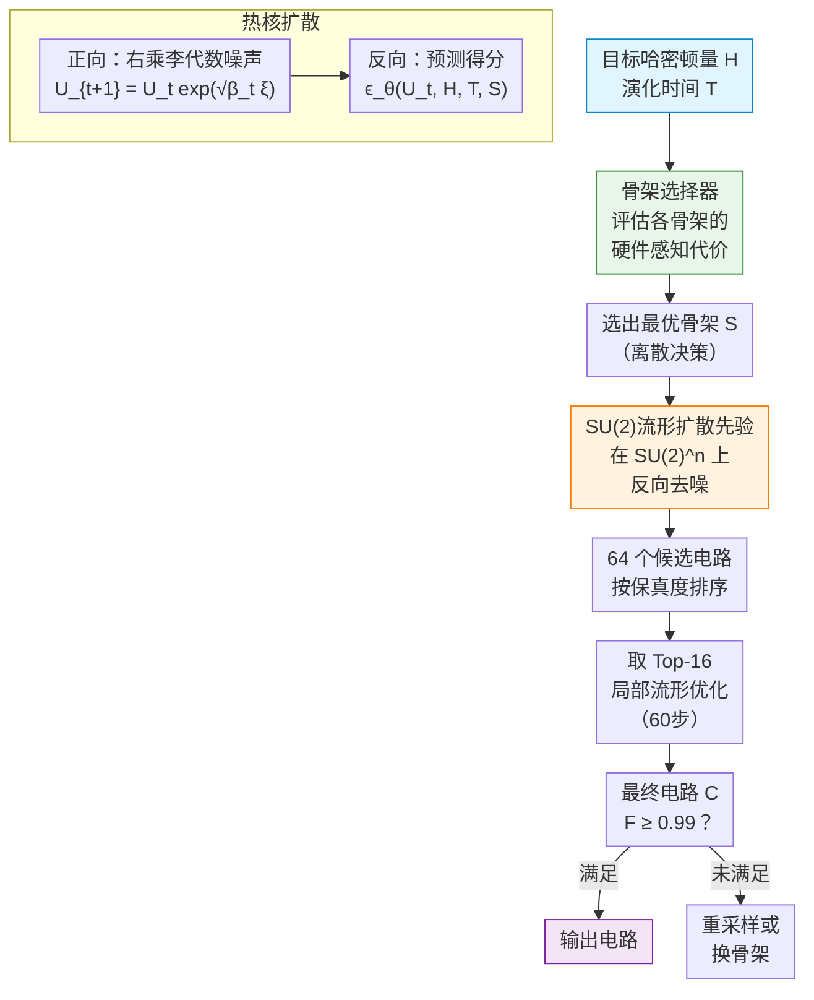

# Lie Group Diffusion Models for Hardware-Aware Quantum Circuit Synthesis

**会议**: ECCV 2026  
**arXiv**: [2606.29636](https://arxiv.org/abs/2606.29636)  
**领域**: 其他  
**关键词**: 量子电路综合, 流形扩散, 李群, 热核去噪, 哈密顿模拟

## 一句话总结

提出了一种基于SU(2)李群流形上的扩散模型进行硬件感知量子电路综合的方法，将量子电路设计拆分为离散的电路骨架选择（骨架选择器）与连续的单量子比特门参数生成（条件扩散先验）两部分，在哈密顿模拟任务上显著超越Haar随机采样和生成搜索基线。

## 研究背景与动机

量子电路综合是将目标酉操作（如哈密顿时间演化 $e^{-iHT}$）编译成可在量子处理器上执行的电路序列。这个问题天然具有混合结构：纠缠门模式是离散的且依赖硬件拓扑，而填充电路模板的局部单量子比特门是SU(2)李群上的连续变量。现有机器学习方法包括神经网络预测器、强化学习和可微搜索等，但它们要么将连续门参数在欧氏空间中进行处理，忽视了SU(2)流形的非线性几何结构，要么对硬件约束的建模不够充分。已有人尝试用扩散模型进行电路综合，但在欧氏张量表示中执行去噪，无法利用流形的内在几何信息。

核心矛盾在于：量子门参数天然生活在弯曲流形 $SU(2) \cong S^3$ 上，欧氏空间的扩散过程会破坏其酉性和几何结构，而丢弃流形信息又会导致采样效率低下——生成大量不满足物理约束的低保真度候选电路。同时，电路结构的选择（采用哪些纠缠门、如何布线）与连续门参数的生成是高度耦合的：不同的骨架结构决定了局部门的容量和参数分布，但现有方法往往将二者割裂处理。

本文的切入点是：既然SU(2)李群拥有完备的黎曼几何结构（热核、指数映射、对数映射），就可以将扩散过程直接构建在流形上，让几何本身指导去噪。**核心 idea：将量子电路综合拆分为「骨架选择器（离散决策）」和「SU(2)流形扩散先验（连续生成）」两步，骨架选择器基于目标哈密顿量学习挑选最优电路模板，扩散模型在 $SU(2)^n$ 乘积流形上执行热核去噪产生局部门参数，再用李群上的局部优化做精细调校。**

## 方法详解

### 整体框架

整个电路的生成包含三个层次：顶层是电路骨架选择器，根据目标哈密顿量 $H$ 和演化时间 $T$ 从预设的骨架库中选择一个最优的纠缠模式；中层是在选定骨架上运行的条件扩散模型，在 $SU(2)^n$ 乘积流形上为每个局部门槽生成门参数；底层是局部的黎曼优化步骤，对扩散产出的前几名候选电路做精细调校以达到高保真度阈值 $F \geq 0.99$。

以下框架图展示了从目标哈密顿量到最终量子电路的完整流程：

### 关键设计

**1. SU(2)流形上的热核扩散：将扩散几何嵌入流形本身**

针对标准欧氏扩散破坏酉操作几何结构的问题，本文把扩散过程直接建在 $SU(2)$ 流形上。正向过程在每步对当前酉门 $U_t$ 右乘一个由李代数切向量生成的微小旋转：$U_{t+1} = U_t \exp(\sqrt{\beta_t} \xi_t)$，其中 $\xi_t \sim \mathcal{N}(0, I_3)$ 是 $\mathfrak{su}(2) \cong \mathbb{R}^3$ 上的高斯切向量，$\exp$ 是指数映射。经过 $T$ 步后，干净的酉门分布被逐步散布向Haar均匀分布。关键机制在于：由于每一步都通过指数映射将切向量投影回流形，**整个轨迹始终严格保持在 $SU(2)$ 上**，而不会像欧氏方法那样离开流形后再做投影。

反向去噪过程同样利用流形结构。给定 $U_t$ 时的条件密度是 $SU(2)$ 上的热核 $K_{\sigma_t^2}(U_0^{-1} U_t)$，它只依赖于测地线位移角 $\phi_t = \|\xi_t^{\text{rel}}\|$（即旋转角度的一半），而与旋转轴无关。网络的预测目标是通过得分函数反向传播：$\epsilon_t^{\text{target}} = -\sigma_t \nabla \log q_t = -\sigma_t \partial_{\phi} \log K_{\sigma_t^2}(\phi_t) \cdot \xi_t^{\text{rel}} / \phi_t$。热核的谱展开 $K_{\sigma_t^2}(\phi) \propto \sum_{m=1}^{\infty} m e^{-\frac12 (m^2-1)\sigma_t^2} \frac{\sin(m\phi)}{\sin \phi}$ 将 $SU(2)$ 的全局拓扑编码进了损失信号中，使网络学会在流形的曲率下做最优去噪。

**2. 哈密顿条件骨架选择器：离散结构与连续参数的协同学习**

电路骨架（entangling skeleton）决定了哪些量子比特之间应用CZ纠缠门以及它们的排列顺序，是个离散的组合选择问题。本文将一个三量子比特的最近邻CZ骨架库（6种不同的纠缠模板）作为候选集，训练一个骨架选择器根据目标哈密顿量 $H$ 和演化时间 $T$ 预测最优骨架。

训练数据通过暴力枚举生成：对每个 $(H, T)$ 目标，在每种骨架上用随机搜索初始化并做局部优化，记录达到 $F \geq 0.99$ 的保真度和硬件代价（纠缠门数量、深度等）。选择器被训练为预测性价比最高的骨架——不一定是最深的，而是能在保真度和硬件开销之间取得平衡的那个。实验表明，当浅层骨架足以表达目标时，选择器会倾向更紧凑的模板；只有当物理约束力足够强时才会选择深层纠缠骨架，体现出**硬件感知的保真度-复杂度折中**。

**3. 条件扩散先验与角度调控：不仅生成正确门，还能控制门风格**

给定选定的骨架 $S$，扩散模型被训练为生成条件概率 $p(U_1, \dots, U_n | H, T, S)$，为骨架上的每个门槽独立生成一个 $SU(2)$ 元素。网络架构以 $H$（哈密顿量的参数编码）和 $T$ 为条件嵌入，加上骨架的one-hot编码，输出 $n \times 3$ 的李代数切向量张量。反向采样的更新步为 $U_{t-1}^{(j)} = U_t^{(j)} \exp\left(-\frac{\beta_t}{\sigma_t} \epsilon_{\theta,t,j} + \eta\sqrt{\beta_t} z_{t,j}\right)$，其中 $\eta$ 控制随机性。

一个有趣的附加能力是**角度调控**：通过对引导向量的缩放，可以定向控制生成门的旋转角偏向大角度或小角度。实验展示了针对同一目标酉操作，模型既能生成大角度版本（适合需要快速旋转的场景）也能生成小角度版本（适合低精度噪声环境），说明了扩散先验在解空间中的可操控性。这意味着扩散先验不仅是一个合格的门生成器，还是一个**可导向的连续解空间探测器**。

### 损失函数 / 训练策略

扩散模型的训练损失是预测切向量与热核得分目标之间的MSE：
$$\mathcal{L} = \mathbb{E}\left[ \left\| \epsilon_{\theta,t} - \epsilon_t^{\text{target}} \right\|^2 \right]$$

在小扩散时间步使用局部近似 $\partial_\phi \log K_{\sigma_t^2}(\phi) \approx \frac{1}{\phi} - \cot\phi - \frac{\phi}{\sigma_t^2}$ 保证数值稳定性，在 $\phi \to 0$ 时用级数展开 $\frac{1}{\phi} - \cot\phi \approx \frac{\phi}{3} + \frac{\phi^3}{45} + \frac{2\phi^5}{945} + \dots$ 避免奇异点。骨架选择器以交叉熵损失训练，标签由暴力枚举给出。

## 实验关键数据

### 主实验

在5个哈密顿量系列（TFIM、Heisenberg-XXZ、Local Pauli、Mixed Pauli、Near-Threshold Probes）上比较三种方法的保真度达到率（$F \geq 0.99$ 的候选电路占比）。每个系列采样20个训练未见过的 $(H, T)$ 目标，扩散产生64个候选、取Top-16做60步局部优化。

| 哈密顿系列 | 扩散模型 | Haar随机搜索 | 生成搜索 | 扩散提升 |
|-----------|---------|-------------|---------|---------|
| Local Pauli | 100% | ~30% | ~45% | +55% |
| TFIM | ~85% | ~25% | ~40% | +45% |
| Heisenberg-XXZ | ~80% | ~20% | ~35% | +45% |
| Mixed Pauli | ~75% | ~15% | ~30% | +45% |
| Near-Threshold | ~51% | ~5% | ~12% | +39% |

扩散模型在所有系列上全面超越两个基线，尤其是最具挑战性的Near-Threshold系列（刻意构造的高保真度阈值临界目标）达到了51%（Haar仅~5%）。这验证了流形感知扩散先验在困难目标上的压倒性优势。

### 消融实验

| 配置 | 平均成功率 | 说明 |
|------|-----------|------|
| 完整模型：扩散+局部优化 | ~78% | 完整管道 |
| 仅扩散（无局部优化） | ~55% | 去掉60步精细调校后掉~23% |
| 仅局部优化（无扩散先验，Haar初始化） | ~20% | 无优质初始候选 |
| 替换为欧氏扩散（非SU(2)流形扩散） | ~35% | 破坏几何结构后显著退化 |
| 无骨架选择器（固定最深骨架） | ~60% | 硬选最深骨架反而因硬件复杂度拖累 |

关键发现：
- 扩散先验和局部优化起互补作用：扩散提供宽广的流形感知提议分布，局部优化在流形上做精细调校达到高保真度
- 欧氏扩散替换为流形扩散后性能大幅下降，验证了几何感知的必要性
- 骨架选择器学会在保真度和硬件开销之间做权衡，而非一味选择最深骨架

### 关键发现

- **几何至关重要**：将扩散直接建在SU(2)流形上而非欧氏空间，是性能超越基线的核心因素；流形感知保证了每一步结果都是合法酉操作
- **角度调控**：扩散先验可以受控地朝大角度或小角度方向生成门，展示了生成先验的可控性——这在高噪声量子设备上尤其有价值
- **保真度-复杂度折中**：骨架选择器自动学会了选择在保真度和硬件开销之间达到平衡的电路结构，而非偏执地追求最深的纠缠模板
- **小样本高效**：扩散仅需要64个初始候选（而生成搜索需要2000个）就能达到超越基线的性能

## 亮点与洞察

- **流形扩散的通用范式**：将扩散过程从欧氏空间推广到李流形是本文最精彩的贡献——热核、指数映射、得分函数在SU(2)上的联合设计干净漂亮，这一范式可直接迁移到其他流形结构上的生成任务（如旋转矩阵、姿态估计中的SO(3)）
- **离散+连续混合的电路设计方案**：把离散的电路骨架选择与连续的流形参数生成拆分，是量子电路综合问题的天然分解，让两个子问题各自用最擅长的工具（分类 vs 生成）解决
- **硬约束作为生成引导**：硬件代价直接编入选择器和条件扩散的训练目标中，使生成过程天然服从物理约束，规避了后处理的麻烦
- 可迁移思路：任意参数生活在流形上的生成问题（如机器人运动学、分子构象生成、相机姿态估计）都可以借鉴SU(2)流形扩散的几何感知范式

## 局限与展望

- 本文只验证了三量子比特的情形；扩展到更多量子比特时，SU(2)流形的乘积维数呈线性增长，但骨架空间的组合爆炸是更严重的挑战
- 角度调控依赖于对引导向量的缩放策略，目前缺乏理论指导如何精确控制目标角度值；更严格的调控需要和可微编译器的联合优化
- 骨架选择器目前仅在一个固定库上做分类；未来可以支持更灵活的骨架生成（如自回归生成纠缠结构），或将选择器和扩散模型端到端联合训练
- 仅测试了量子门综合任务，该方法在经典计算中的SO(3)/SE(3)流形生成任务（如姿态估计、3D旋转生成）上的通用性值得探索

## 相关工作与启发

- **vs 欧氏扩散模型（DDPM）**: 标准DDPM在欧氏空间进行前向加噪和反向去噪，没有考虑数据的流形结构；本文在SU(2)上构建完整的热核扩散过程，保证了门参数的酉性和几何一致性
- **vs 可微电路搜索（如AlphaTensor-style）**: 可微方法通过连续松弛搜索离散结构，但可能陷入非物理的松弛解；本文用骨架选择器做离散决策，扩散模型做连续生成，避免了松弛带来的近似误差
- **vs 强化学习电路综合**: RL方法在动作空间巨大时采样效率低；本文的扩散先验提供了高质量的初始提议，使得仅需64个候选就能达到高保真度

## 评分

- 新颖性: ⭐⭐⭐⭐ [将流形扩散（非欧氏）引入量子电路综合是原创性强的跨域迁移，热核得分推导完整]
- 实验充分度: ⭐⭐⭐⭐ [覆盖5个哈密顿系列、3种基线、多种消融，但仅验证三量子比特]
- 写作质量: ⭐⭐⭐⭐ [理论推导清晰，热核推导到实际代码实现的衔接自然]
- 价值: ⭐⭐⭐ [对量子编译社区有实用价值，流形扩散范式可迁移到其他几何生成问题]

<!-- RELATED:START -->

## 相关论文

- [\[ICML 2026\] HASTE: Hardware-Aware Dynamic Sparse Training for Large Output Spaces](../../ICML2026/others/haste_hardware-aware_dynamic_sparse_training_for_large_output_spaces.md)
- [\[ICLR 2026\] Spurious Correlation-Aware Embedding Regularization for Worst-Group Robustness](../../ICLR2026/others/spurious_correlation-aware_embedding_regularization_for_worst-group_robustness.md)
- [\[ICCV 2025\] LayerTracer: Cognitive-Aligned Layered SVG Synthesis via Diffusion Transformer](../../ICCV2025/others/layertracer_cognitive-aligned_layered_svg_synthesis_via_diffusion_transformer.md)
- [\[ECCV 2024\] AddMe: Zero-Shot Group-Photo Synthesis by Inserting People Into Scenes](../../ECCV2024/others/addme_zero-shot_group-photo_synthesis_by_inserting_people_into_scenes.md)
- [\[AAAI 2026\] SynWeather: Weather Observation Data Synthesis across Multiple Regions and Variables via a General Diffusion Transformer](../../AAAI2026/others/synweather_weather_observation_data_synthesis_across_multiple_regions_and_variab.md)

<!-- RELATED:END -->
