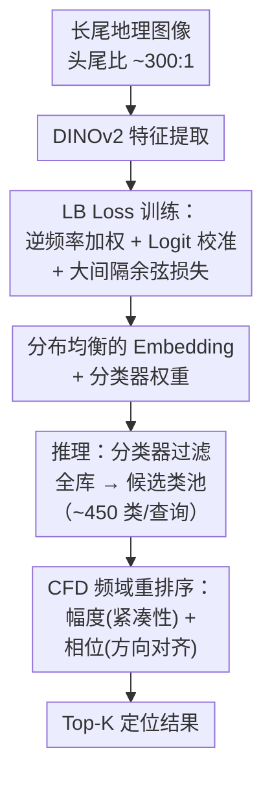

# Lost in the Tail: Addressing Geographic Imbalance in Urban Visual Place Recognition

**会议**: ECCV 2026  
**arXiv**: [2607.00090](https://arxiv.org/abs/2607.00090)  
**代码**: 待确认（Lambda 提供算力，代码准备中）  
**领域**: 图像检索 / 视觉定位  
**关键词**: 长尾分布, 视觉位置识别, 地理不平衡, 分布感知, 特征函数距离  

## 一句话总结
本文发现城市级视觉位置识别数据集存在严重的长尾地理分布问题（头尾类样本比达 300:1），提出 DAPR 框架——训练阶段用 Low-visit Bias 损失逆频率加权并校准分类器偏差，推理阶段用特征函数距离在频域实现分布感知的重排序，在 SF-XL 基准上超越此前最佳混合管线 18.3% R@1。

## 研究背景与动机

视觉位置识别（Visual Place Recognition, VPR）旨在通过查询图像在带地理标签的参考数据库中定位其拍摄地点，是自动驾驶、巡逻机器人等城市级应用的基础能力。近年来，基于分类范式的 VPR 方法将城市地图划分为离散地理网格单元（如 20m×20m 的 cell），每个 cell 作为一个类别，训练分类器来学习可区分的位置描述子，并在推理阶段先用分类器过滤全量数据库再到候选池内做相似度检索。然而，现有 VPR 数据集（如 SF-XL、GSV-Cities、MSLS）的数据收集严重依赖 Google Street View 或众包平台，图像密度实质由车流量和摄影师频次而非地理特征丰富度决定。这意味着繁华主干道积累了上千张训练图像，而居民区、小巷、低交通量城市走廊——恰恰是类别内部视觉多样性最高的区域——只有十几张甚至数张训练样本。

这种地理不平衡的严重程度远超预期。以 SF-XL 基准为例，按样本数排序后将地理类别分为头部（head, 前 30%）、中部（middle, 40%）和尾部（tail, 后 30%），头尾类样本比高达约 300:1：头部类含逾 3000 张图像，尾部类却少至 12 张。更具讽刺意味的是，文章的定量分析显示尾部类内部的成对特征相似度方差反而更大——即那些本就因视觉内容丰富而识别难度最高的区域，反而获得了最少的训练信号。Per-class Recall@1 曲线在尾部类断崖式下跌，而安全关键的应用场景（如 GPS 退化区域中的自动巡逻机器人）恰恰最依赖这些区域的可靠定位。现有方法对这个矛盾完全忽视：分类器依赖 L2 距离做过滤后的重排序，而 L2 距离对所有类一视同仁，头部类的紧凑密集表示天然主导匹配，尾部类被系统性地低估。

核心 idea：提出 DAPR（Distribution-Aware Place Recognition）框架，训练阶段通过 LB Loss 用逆频率加权协同先验 Logit 校准来重平衡各类别的梯度贡献，推理阶段针对混合管线用特征函数距离（Characteristic Function Distance, CFD）在频域做分布感知的重排序，让头部类的密集紧凑表示不再主导匹配判决。

## 方法详解

### 整体框架

DAPR 是一个模型无关（model-agnostic）的即插即用框架，包含两个核心模块分别作用于训练和推理阶段。训练阶段：给定长尾分布的地理图像数据集，先用 DINOv2 提取特征，再通过 LB Loss 训练特征提取器和分类器。LB Loss 内部耦合了三个机制——逆频率样本加权（放大尾部类梯度）、先验 Logit 校准（上调尾部类 logit）和大间隔余弦相似度（分离类间边界）——来消除长尾分布导致的训练偏差。推理阶段（混合管线场景）：分类器将全量数据库过滤到候选类池（SF-XL 约 450 类/查询），然后在这个候选池上使用 CFD 进行频域重排序，通过比较特征分布的紧凑性（幅度）和方向匹配度（相位）来公平比较头尾类。

### 关键设计

**1. LB Loss（Low-visit Bias Loss）：逆频率加权协同先验 Logit 校准**

LB Loss 的动机直接来源于统计观察：头部类样本数多，它们产生的梯度在每次优化步中占据主导，尾部类的信号被噪声淹没。简单放大尾部类梯度会导致少量样本成为离群点进而发散——LB Loss 的方案是将三种机制缝合到一个损失函数中，共享同一个类频率先验 $p_c = n_c/N$。

首先进行类分布重加权。每个类别 $c$ 分配一个权重 $w_c \propto (p_c + \epsilon)^{-\beta}$，经归一化保证梯度幅度稳定，$\beta \in [0,1]$ 控制重加权强度。这意味着尾部类的每个训练样本在损失函数中获得更高的权重，从而放大了它们对梯度的贡献。其次进行先验 Logit 校准：给分类器的 logit 添加一个与类频率相关的偏置项 $\nu_c = -\kappa \log(p_c / (1-p_c))$，$\kappa$ 控制校正强度。由于尾部类 $p_c$ 很小，$\nu_c$ 为正，模型在分类时默认给尾部类的 logit 加上一个正偏置，在决策边界层面补偿先验不平衡。最后，将上述两项嵌入大间隔余弦损失（分类范式）或多重相似度损失（检索范式）中。以分类版 $L^{cls}_{lb}$ 为例，它通过 CosFace 的角间隔施加类间分离，然后在 softmax 交叉熵中嵌入权重 $w_c$ 和偏置 $\nu_c$。消融实验表明这三者缺一不可——任意一种机制单独拿出都无法达到联合使用的效果，且 LB Loss 在 SF-XL 的混合管线上相比交叉熵基线提升了 13.9% R@1。

**2. CFD（Characteristic Function Distance）：多尺度频域距离搜索**

LB Loss 纠正了训练偏差，但推理时分布不平衡依然存在。混合管线虽把全数据库过滤到候选池，候选池内仍存在特征分布的异质性：头部类的特征簇紧密紧凑，尾部类的特征稀疏分散。若使用标准的 L2 或余弦相似度，两者的分布形态被忽略，尾部类的查询会系统性地偏向最近的头部类簇。

CFD 的核心洞察是把特征映射到频域后，分布紧凑性自然显露为幅度（amplitude），方向相似性显露为相位（phase）。对查询特征集 $S_q$ 和候选类 $j$ 的特征集 $S_j$，在 $K$ 个频率点 $\mathbf{T}=\{t_k\}_{k=1}^K$ 上计算经验特征函数 $\Phi_q(t_k)$ 和 $\Phi_j(t_k)$。根据欧拉公式 $\Phi(t_k)=|Φ(t_k)|e^{iα(t_k)}$，幅度 $|Φ(t_k)|$ 编码了集合的紧凑程度——紧密簇幅度高、分散簇幅度低，相位 $α(t_k)$ 编码了特征的空间方向。频率点 $\mathbf{T}$ 从 4 个对数尺度的各向同性高斯分布中分层采样，以同时捕获细粒度局部模式和全局结构。

为了平衡幅度和相位在匹配中的角色，CFD 引入自适应加权：先计算查询与候选类的平均幅度比 $r^{(j)}=\bar{A}_q/\bar{A}_j$（紧凑性比率），然后得到幅度权重 $α_w^{(j)}=\min(α \cdot r^{(j)}, 1)$ 和相位权重 $λ_w^{(j)}=1-α_w^{(j)}$。最终的距离是两个分量的加权平均：幅度差（平方差）和相位差（带 $2\pi$ 卷绕的循环距离），分别乘以自适应权重后求和。当一个候选类的特征分布稀疏时（尾部类常见），$\bar{A}_j$ 小，$r^{(j)}$ 变大，幅度权重占据主导——CFD 优先比较紧凑性而非方向对齐，自然对尾部类更公平。值得注意的是，这个 $r^{(j)}$ 同时可作为查询的置信度估计（幅度比高意味着特征紧凑、匹配更可靠），不需要额外的随机嵌入或后处理。CFD 仅在推理阶段使用，因为训练时对超 11 万类计算特征函数的复杂度为 $O(B \times C \times K \times D)$，计算不可行。

### 损失函数 / 训练策略

LB Loss 包含两个版本。分类版基于大间隔余弦损失：

$L^{cls}_{lb} = -w_c \cdot \log\left(\frac{\exp(z_c - \nu_c)}{\sum_{j=1}^C \exp(z_j - \nu_j)}\right)$

其中 $z_j = s \cdot (d - m \cdot \mathbb{I}[j=c])$，$d$ 是特征与分类器权重的余弦相似度，$s$ 是缩放因子，$m$ 是角间隔。检索版则将逆频率加权 $w_{y_i}$ 和 Logit 偏置 $\nu_{y_j}$ 嵌入多重相似度损失中。训练使用 DINOv2 主干、Adam 优化器、batch size 256、学习率 $6 \times 10^{-6}$，共 200 个 epoch。分类管线中 $\beta=0.01$、$\kappa=0.05$；检索管线中 $\kappa=0.01$。推理时 CFD 的幅度基权重 $\alpha=0.7$。

## 实验关键数据

### 主实验

| 方法 | Backbone | 推理耗时 | R@1 v1 | R@1 v2 |
|------|----------|---------|--------|--------|
| D&C（混合基线） | EfficientNet | 30 ms | 71.4 | 87.6 |
| SALAD（纯检索） | DINOv2 | 4805 ms | 87.6 | 93.5 |
| BoQ（纯检索） | DINOv2 | 21333 ms | 83.7 | 92.8 |
| SALAD* (+LB Loss) | DINOv2 | 4823 ms | 88.0 | 94.5 |
| BoQ* (+LB Loss) | DINOv2 | 21047 ms | 88.8 | 93.7 |
| **DAPR-M（本文混合）** | **DINOv2** | **74 ms** | **89.7** | **94.3** |

DAPR-M 在 test v1 上以 74 ms 的推理时间超越所有纯检索方法（4～21 秒），同时在 test v1/v2 上大幅超越 D&C 混合基线（+18.3% / +6.7%）。LB Loss 的即插即用效果在 SALAD 和 BoQ 上同样被验证。

### 消融实验

| 配置 | R@1 v1 | R@1 v2 | 说明 |
|------|--------|--------|------|
| DINOv2 + CE + L2 | 75.8 | 91.1 | 基线 |
| + LB Loss（替换 CE） | 88.0 | 93.8 | +12.2% / +2.7% |
| + LB Loss + CFD（替换 L2） | 89.7 | 94.3 | +1.7% / +0.5% |
| LogitAdjust Loss 替代 | 88.0 | 93.3 | 仅 Logit 校准 |
| Focal Loss 替代 | 86.4 | 94.0 | 仅困难样本加权 |
| **本文 LB Loss（联合）** | **89.7** | **94.3** | 加权+校准+大间隔 |

消融表明：LB Loss 是性能提升的主力（+12.2%），CFD 提供额外 +1.7%。LB Loss 同时优于 LogitAdjust（仅校准）和 Focal Loss（仅加权），证实两机制耦合的必要性。

### 关键发现

- LB Loss 在不同 backbone（EfficientNet、ResNet101、DINOv2）和不同管线（纯分类、纯检索、混合管线）上均带来一致性提升，说明长尾地理分布是一个数据层面的通用瓶颈而非特定模型的特有问题。
- 头/中/尾三类性能分解显示尾部类增益最大（R@1 +1.47%, R@5 +7.35%），验证了 LB Loss 确实瞄准了设计目标——纠正了最被忽视的尾类区域。
- CFD 比 L2 在尾类上高出 5.6% R@1（test v1），证实频域幅度分量能有效捕捉稀疏特征的分布紧凑性。
- DAPR-M 混合管线的内存需求仅 1.35 MB（候选池 450 个 768-d 描述子），而纯检索 SALAD 需 94.8 GB，这使大规模城市部署变得切实可行。
- LB Loss 在 MSLS、Pitts30k 等多城市基准上同样带来一致的尾类提升（BoQ* 在 MSLS 尾类 +2.70% R@1），跨城市泛化能力得到验证。

## 亮点与洞察

- **问题发现本身就是一个贡献**：文章首次系统性地揭示了城市级 VPR 数据集中 300:1 的长尾地理分布，并定量证明尾类区域（低交通量、视觉多样性高）正是安全关键部署场景（巡逻机器人、GPS 退化区）最集中的地方——这个观察直接赋予问题实际的紧急性。
- **LB Loss 的"三机制耦合"值得借鉴**：逆频率加权（梯度重平衡）+ Logit 校准（决策边界修正）+ 大间隔余弦（特征可区分性），三者共享同一个类先验 $p_c$，彼此互补不冲突。消融每少一个都掉点——这种严谨耦合的消融设计本身就是方法论上的示范。
- **CFD 的自适应权重设计巧妙**：$r^{(j)}=\bar{A}_q/\bar{A}_j$ 天然编码了"查询相对于候选类的紧凑性"，对尾部类自动放大幅度权重，且不需要额外训练就在同一检索通道完成了隐式置信度估计。
- **计算效率的巨大胜利**：混合管线 + 紧凑候选池（450 vs 全库 280 万）+ 单 DINOv2 backbone，仅 74 ms/查询就能达到甚至超越纯检索方法（数秒/查询）的精度——这在大规模真实部署中是决定性的差异。

## 局限与展望

- 当前长尾定义完全依赖每个地理类的**样本计数**，忽略了"特征层面的长尾"——一个类即使样本数充足，如果类内特征差异极大（同区域不同季节、不同时段），它仍然是困难类。作者在结论中也指出这一方向值得探索。
- CFD 仅在推理阶段使用，因为训练时对超 11 万类计算特征函数复杂度为 $O(B \times C \times K \times D)$，计算不可行。这是一个实用取舍，但也意味着训练和推理阶段使用不同的距离度量，存在一定的错配风险。
- 自适应划分（如 CPlaNet 的 k-d tree 算法，通过划分使各类样本数接近）和 LB Loss 解决的是不同层面的不平衡（数据布局 vs 学习信号），文中仅单独比较、未讨论两者互补——如果先自适应划分再用 LB Loss 做细粒度校准，效果是否会更好？
- 实验集中在旧金山（SF-XL）、匹兹堡（Pitts30k）及多城市 MSLS 基准，缺乏极端的跨域测试（如城市泛化到乡村/森林环境）。尾类改善在跨域场景下能否保持尚不明确。
- 失败案例分析显示在稠密树冠遮挡和极端色彩/光照变化下 DAPR 仍然失败——这些问题本质是特征层面的不匹配，样本计数层面的长尾纠正无法完全解决。

## 相关工作与启发

- **vs D&C**：D&C 首次提出分类-检索混合管线来提升大规模 VPR 的推理效率，但使用 L2 距离对所有类一视同仁。本文的关键改进在于意识到 L2 距离对尾部类不公，用 CFD 替换标准距离度量。
- **vs 通用长尾学习方法（LogitAdjust、Focal Loss）**：LA 仅做 Logit 校准，FL 仅做困难样本加权，各自只覆盖一种失败模式。LB Loss 将两者耦合再叠加大间隔余弦，在 VPR 任务上同时超越二者。
- **vs CosPlace / EigenPlaces**：这些方法也用地理网格分类 + 大间隔余弦损失，但隐式假设各类别均匀，未意识到网格间样本数差异已达 300:1。
- **vs SALAD / BoQ（DINOv2 纯检索方法）**：这些方法在全量数据库上做直接相似度搜索，精度虽高但内存和时间开销巨大。本文证实 DINOv2 时代混合管线仍有竞争力——DAPR-M（74 ms）比 SALAD（4.8 s）快 60 倍且精度更高。

## 评分

- 新颖性: ⭐⭐⭐⭐ 问题识别（长尾地理分布）在 VPR 领域是首次系统化揭示，但方法本身是成熟长尾学习技术的巧妙组合而非全新框架。
- 实验充分度: ⭐⭐⭐⭐⭐ 在 SF-XL 的 v1/v2、MSLS、Pitts30k、Nordland 五个基准上验证，消融完整，头/中/尾分层分析清晰，超参敏感性充足。
- 写作质量: ⭐⭐⭐⭐ 问题动机和意义阐述充分，图 1 的 300:1 不平衡 + 尾类 diversity 更宽的对比非常有力，公式部分稍显繁复但逻辑通顺。
- 价值: ⭐⭐⭐⭐⭐ 即插即用、模型无关、不增加推理耗时、带来显著提升——这种实用价值 + 清晰问题识别的工作在工程部署场景中极受欢迎。

<!-- RELATED:START -->

## 相关论文

- [\[CVPR 2026\] HypeVPR: Exploring Hyperbolic Space for Perspective to Equirectangular Visual Place Recognition](../../CVPR2026/others/hypevpr_exploring_hyperbolic_space_for_perspective_to_equirectangular_visual_pla.md)
- [\[ICCV 2025\] A Hyperdimensional One Place Signature to Represent Them All: Stackable Descriptors For Visual Place Recognition](../../ICCV2025/others/a_hyperdimensional_one_place_signature_to_represent_them_all_stackable_descripto.md)
- [\[NeurIPS 2025\] Addressing Mark Imbalance in Integration-free Neural Marked Temporal Point Processes](../../NeurIPS2025/others/addressing_mark_imbalance_in_integrationfree_neural_marked_t.md)
- [\[CVPR 2026\] Drainage: A Unifying Framework for Addressing Class Uncertainty](../../CVPR2026/others/drainage_a_unifying_framework_for_addressing_class_uncertainty.md)
- [\[CVPR 2026\] Spectral Conformal Risk Control: Distribution-Free Tail Guarantees via Bayesian Quadrature](../../CVPR2026/others/spectral_conformal_risk_control_distribution-free_tail_guarantees_via_bayesian_q.md)

<!-- RELATED:END -->
