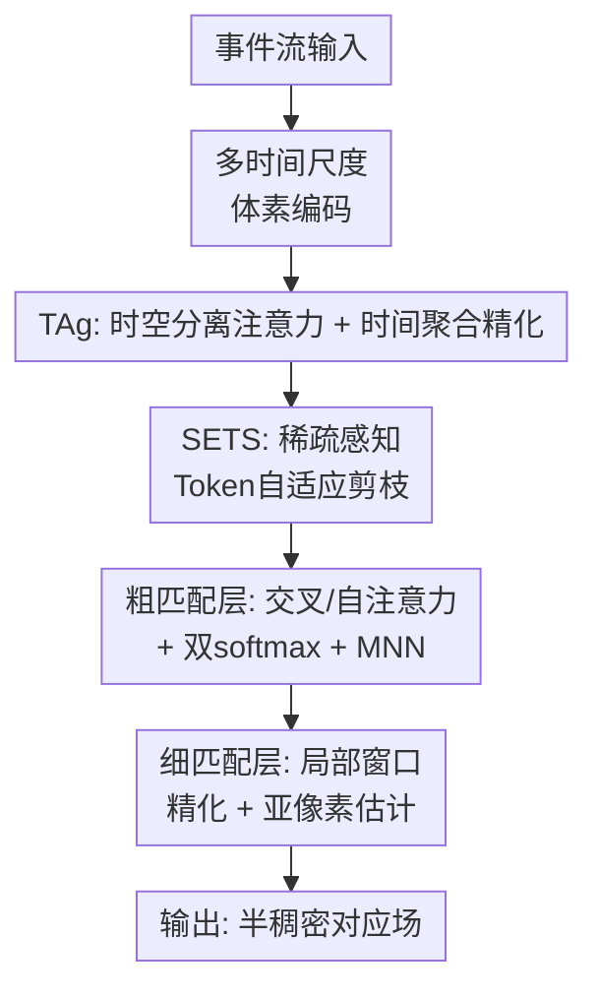

# Match-Any-Events: Zero-Shot Motion-Robust Feature Matching Across Wide Baselines for Event Cameras

**会议**: ECCV2026  
**arXiv**: [2604.18744](https://arxiv.org/abs/2604.18744)  
**代码**: [https://github.com/spikelab-jhu/Match-Any-Events](https://github.com/spikelab-jhu/Match-Any-Events)  
**领域**: 事件相机特征匹配  
**关键词**: 事件相机, 宽基线匹配, 零样本泛化, 时空Transformer, Token剪枝

## 一句话总结

本文提出首个实现零样本跨数据集泛化的事件相机宽基线特征匹配模型，通过分离式时空注意力骨干（TAg）和稀疏感知Token自适应剪枝（SETS）实现高效多时间尺度事件特征学习，结合大规模合成（E-MegaDepth）与真实（ECM）宽基线数据集训练，在多个基准上相比此前最佳方法提升37.7%。

## 研究背景与动机

事件相机因其高时间分辨率和极大的动态范围，在快速运动和低光照场景下展现出非凡的瞬时运动估计能力。然而，一个被长期忽视的问题是：当我们需要在两个任意视角之间建立宽基线特征对应时——比如在不同时间点从完全不同位置观察同一场景——事件相机的表现远不如传统帧相机。造成这一差距的原因有三个层面。在数据层面，现有事件数据集几乎全部依赖SLAM位姿推断的相邻帧光流标注，网络从未在训练中见过真正的大视角变化。在模型层面，事件数据本质是三维时空表示（时间×高度×宽度），如果简单地对完整时空体积做Transformer自注意力，计算量高达 O((THW)²)，使得在大规模数据上训练网络变得不可行。在表征层面，事件的外观会随运动速度剧烈变化：同一场景在慢速运动下事件分布稠密，在快速运动下则稀疏且带有更强的边缘信号，传统的手工编码表示（如固定时间窗口事件帧）无法同时适配快慢不同的运动。这三个问题相互耦合——没有足够大的宽基线数据集就无法训练大规模网络，但没有高效架构即便是有限的数据也无法承受。

本文从架构设计和训练数据两个方向同时切入。架构方面，设计了一个分离时空维度的注意力机制，将三维体积注意力拆成二维空间注意力和一维时间注意力的交替计算，再配合自适应稀疏Token剪枝将有效计算量进一步压低到足以支持百万级配对的训练。数据方面，基于MegaDepth合成300万对宽基线事件流、并搭建真实异源立体系统采集真实事件-图像配对，提供模型真正需要的宽基线监督信号。**核心 idea：提出可分离的时空注意力时间聚合器（TAg），将三维事件体素特征解耦为空间和时间两个维度的交替注意力计算，复杂度从 O((THW)²) 降至 O(T(HW)² + HW·T²)；配合稀疏感知Token选择（SETS）以可微方式自适应剪枝无事件区域的冗余计算；在此基础上利用大规模合成+真实宽基线事件配对进行端到端训练，首次在事件相机上实现零样本跨数据集泛化的宽基线特征匹配。**

## 方法详解

### 整体框架

Match-Any-Events的整体流程分为四个阶段。首先，原始事件流按对数时间窗口划分为多个时间bin，生成多时间尺度事件体素表示。体素被token化后送入时间聚合Transformer（TAg），先通过分离式空间-时间注意力交替沿空间和时间维度做特征交互，再通过时间聚合精化模块将多时间bin的多尺度特征融合为单一运动不变的特征图。接着，稀疏感知事件Token选择模块（SETS）根据每个空间位置在各时间步的累积暂停分数自适应剪枝掉无事件区域（如大面积静止背景），降低后续计算开销。最后，在粗到细匹配阶段，经特征交互后的粗粒度特征图通过双softmax和互近邻（MNN）选取初始匹配对，再在细粒度局部窗口内精化到亚像素精度。

### 关键设计

**1. TAg时间聚合Transformer：解耦时空维度的多尺度事件特征融合**

事件Transformer的核心计算瓶颈在于三维时空注意力的 O((THW)²) 复杂度。TAg的核心洞察是：空间邻域关系和时间方向上的特征变化本质上可以分离处理，不需要一次性对全局时空做联合注意力。TAg将计算拆成两个阶段。

第一阶段是分离式时空注意力（Separable Spatial-Temporal Attention）。先对每个时间bin内的H×W空间维度单独做自注意力，这是空间域的特征交互；然后对每个空间位置，沿时间维度T做自注意力，实现跨时间bin的运动特征融合。两个注意力交替堆叠Nl次。这一设计的复杂度仅为 O(T(HW)² + HW·T²)——第一项是T个时间bin各自做空间注意力的开销，第二项是HW个空间位置各做时间注意力的开销——当T较大时相比紧耦合的 O((THW)²) 显著降低。

第二阶段是时间聚合精化（Temporal Aggregation Refinement）。不同运动速度的信息分布在不同的时间尺度上：快速运动的边缘信号集中在短时间bin（分辨率高、细节锐利），慢速运动的纹理则依赖长时间bin积累更多信息。TAg以分辨率最高的第一个时间bin的token作为query，其余时间bin的token作为key/value，通过跨时间注意力将多尺度信息整合到单一特征图中。聚合时引入一个可学习的偏置向量 b ∈ Rᴰ，用以补偿当最小时间bin包含信息过少（如该区域完全没有快速运动）时的特征质量下降。可视化结果表明，模型在快速运动区域自适应地关注细粒度时间bin，在慢速运动区域则切换到粗粒度时间bin。

**2. SETS稀疏感知Token选择：以可微方式自适应剪枝冗余事件Token**

尽管TAg已将时间维度分离，每个时间bin上的空间注意力仍需处理全部H×W个token——其中大量token对应无事件发生的静止区域。SETS为每个空间位置n在每个时间步τ预测一个暂停分数 hₙᵗ ∈ [0,1]（通过MLP+Sigmoid输出），分数沿时间步累积，当累计和达到阈值 1-ε 时该位置的token停止处理，后续时间步不再为其分配计算。为确保可微性，最后一个时间步的暂停分数被替换为残差项 Rₙ = 1 - Σᵢ₌₁^{Nₙ-1} hₙⁱ。

与早期工作将暂停分数作为模型输出加权平均（ponder cost）不同，SETS将累积暂停分数以偏置项形式直接注入空间注意力权重：

$$
\text{bias}_n^\tau = 
\begin{cases}
\log(1 - \sum_{i=1}^{\tau-1} h_n^i), & \tau \leq N_n \\
-\infty, & N_n < \tau \leq T
\end{cases}
$$

高暂停分数的token在后续注意力中指数级衰减从而实现实际"停止"。Ponder损失 L_ponder = (1/HW) Σₙ (Nₙ + Rₙ) 与匹配损失形成推拉机制：匹配损失要求保留所有与匹配有用的特征，ponder损失推动尽早停止，模型自动在二者之间找到平衡。在ECM上，SETS将空间注意力FLOPs降低21.5%（从62.22G到48.87G），且对整体匹配性能影响极小。

**3. 粗到细渐进式匹配：双softmax + 互近邻的稠密对应估计**

在TAg和SETS提取出运动鲁棒的多尺度特征后，匹配阶段采用粗到细策略。在粗粒度层（stride=14），两个视图的特征图经过交替的交叉注意力和自注意力进行特征交互，构建相关矩阵S，对矩阵的行和列分别做softmax得到匹配概率P，然后通过互近邻（MNN）选取置信度最高的匹配对：

$$
(x_i, y_j) = (\arg\max_x S(x, y_j), \arg\max_y S(x_i, y))
$$

粗匹配得到的索引用于从细粒度特征图中的对应位置裁剪局部窗口（即待匹配点在细粒度特征中的邻域），在窗口内重复MNN选取。最终在3×3局部区域内计算期望坐标，实现亚像素精度的精化。

### 损失函数 / 训练策略

训练损失由四部分组成：粗匹配层的交叉熵损失 L_c（基于真实匹配矩阵M_c^gt）、细匹配层的交叉熵损失 L_f（基于M_f^gt）、亚像素精化L2坐标回归损失 L_l、以及SETS的ponder损失 L_ponder。最终损失 L = L_c + αL_f + βL_l + γL_ponder。模型在单张NVIDIA H100（96G）上训练3天，batch size=16，输入分辨率560×336。ViT骨干使用DINO预训练权重初始化以加速收敛，其余模块从头训练。完整模型在RTX 4080上处理一对350×630分辨率的事件流需49ms。

## 实验关键数据

### 主实验

| 数据集 | 任务 | 指标 | Ours | 之前最佳 | 提升 |
|--------|------|------|------|----------|------|
| ECM | 事件→事件 | AUC@5° | 54.61 | 11.40 (SuperEvent) | +379% |
| ECM | 事件→事件 | AUC@10° | 72.24 | 22.12 (SuperEvent) | +226% |
| ECM | 事件→图像 | AUC@5° | 48.58 | 23.60 (MatchAnything) | +106% |
| M3ED | 事件→事件 | AUC@5° | 52.99 | 24.89 (MatchAnything) | +113% |
| M3ED | 事件→图像 | AUC@5° | 54.97 | 26.35 (MatchAnything) | +109% |
| EDS | 事件→事件 | AUC@5° | 40.4 | 25.4 (SuperEvent) | +59% |

### 消融实验

| 配置 | AUC@5° | 精度(%) | 说明 |
|------|---------|---------|------|
| Full model | 54.61 | 68.90 | 完整模型 |
| w/o TAg | 50.12 | 67.18 | 去掉TAg，将时间维度直接压入通道 |
| w/o TAg + ConcentrateNet | 48.37 | 64.79 | 用传统CNN代替TAg聚合时间维 |
| w/o Multi-scale Input | 39.86 | 66.87 | 单一时间尺度输入 |
| 仅合成数据(E-MegaDepth) | 52.63 | 68.04 | 只使用E-MegaDepth训练 |
| 仅真实数据(M3ED) | 11.33 | 20.25 | 只使用M3ED训练 |

### 关键发现

- TAg模块贡献显著：去掉后AUC@5°下降约4.5个点；用传统ConcentrateNet替代TAg下降幅度更大，说明本文的分离式时空注意力比简单的CNN时间压平效果好得多
- 多时间尺度输入是最关键的单一因素：去掉多尺度后AUC@5°骤降至39.86（掉了近15个点），说明不同运动速度下的有效信息分布在不同的时间窗口中，单一窗口无法同时覆盖快慢运动
- 合成数据（E-MegaDepth）提供了不可或缺的宽基线多样性：仅靠真实驾驶场景数据（M3ED）训练的模型泛化能力极差（AUC@5°仅11.33），而仅靠合成数据训练的模型已经接近完整模型（52.63 vs 54.61），两者混合后达到最佳
- 运动鲁棒性实验表明，模型在20ms到500ms的宽输入窗口范围内性能几乎不衰减，而对比方法在窗口增大时性能显著下降

## 亮点与洞察

- **事件相机零样本宽基线匹配的首次实现**：此前事件匹配方法要么需要测试时微调、要么仅在窄基线设定下有效，本文训练一次即可在任何未见数据集上直接推理，无需任何domain adaptation或微调
- **TAg复杂度分析清晰且可迁移**：将O((THW)²)降至O(T(HW)² + HW·T²)的分离策略特别适合事件相机这类三维稀疏数据，也可以借鉴到LiDAR点云或其他三维传感器的特征学习中
- **SETS用可微偏置替代硬剪枝**：相比DynamicViT等固定比例剪枝方案，SETS通过ponder loss推拉机制自动学习每个位置的剪枝时机，无需任务特定的预设剪枝比例；用偏置而非加权平均注入注意力也更为直接
- **数据集的实用价值**：E-MegaDepth（300万对合成事件流）和ECM（真实异源立体事件-图像配对，含COLMAP位姿和VGGT深度）填补了事件领域缺乏大规模宽基线标注数据的空白
- **架构简单实用**：模型仅需单张H100训练3天、单张RTX 4080推理仅49ms/对，有良好的实用部署前景

## 局限与展望

- 在极端运动（<20ms窗口）下仍有性能下降，原因是事件过于稀疏导致纹理信息不足——这一边界可能是事件相机本身的物理限制
- 输出为半稠密特征对应而非逐像素稠密匹配，在需要全场景稠密对应关系的下游任务（如稠密SfM、全景对齐）中精度可能不够
- 当前仅支持事件到事件和事件到图像两种模态，尚未扩展到纯图像到图像匹配（虽然这不是事件相机场景的目标，但引入混合模态训练可能进一步提升泛化能力）

## 相关工作与启发

- **vs SuperEvent**: SuperEvent采用检测器架构（先检测关键点再描述），受限于稀疏关键点的数量且在宽基线场景下关键点重复性差；本文是检测器无关的方法，产生半稠密对应且对宽基线更鲁棒，在ECM上AUC@5°领先SuperEvent约43个点
- **vs MatchAnything**: MatchAnything是跨模态匹配通用框架，在事件到图像任务上有一定表现，但事件到事件任务上差距明显（本文AUC@5°高出约30个点）；本文还支持事件到事件到事件匹配任务
- **vs VGGT**: VGGT作为12亿参数的基础模型在3D推理上很强，但与事件流并非"原生"兼容——需要先用E2VID从事件重建图像再输入VGGT；本文直接在事件流上操作，且参数量小得多

## 评分

- 新颖性: ⭐⭐⭐⭐⭐ 首次在事件相机实现零样本跨数据集宽基线匹配，TAg和SETS的设计简洁高效且可迁移
- 实验充分度: ⭐⭐⭐⭐⭐ 在ECM/M3ED/EDS三个数据集评估、事件到事件/事件到图像两项任务、完整消融、运动鲁棒性分析、SfM下游应用
- 写作质量: ⭐⭐⭐⭐ 动机清晰、方法叙述完整、消融设计合理，introduction的生物视觉铺垫略冗长
- 价值: ⭐⭐⭐⭐⭐ 解决了事件相机领域一个长期被忽视的关键问题，开源代码和数据，为零样本事件匹配设立了新baseline

<!-- RELATED:START -->

## 相关论文

- [\[CVPR 2026\] NAF: Zero-Shot Feature Upsampling via Neighborhood Attention Filtering](../../CVPR2026/others/naf_zero-shot_feature_upsampling_via_neighborhood_attention_filtering.md)
- [\[CVPR 2025\] Full-DoF Egomotion Estimation for Event Cameras Using Geometric Solvers](../../CVPR2025/others/full-dof_egomotion_estimation_for_event_cameras_using_geometric_solvers.md)
- [\[ACL 2025\] Are Any-to-Any Models More Consistent Across Modality Transfers Than Specialists?](../../ACL2025/others/are_any-to-any_models_more_consistent_across_modality_transfers_than_specialists.md)
- [\[ECCV 2026\] Seeing Touch from Motion: A Unified Modality-Aware Visuo-Tactile Policy with Tactile Motion Correlation](seeing_touch_from_motion_a_unified_modality-aware_visuo-tactile_policy_with_tact.md)
- [\[AAAI 2026\] Spike Imaging Velocimetry: Dense Motion Estimation of Fluids Using Spike Cameras](../../AAAI2026/others/spike_imaging_velocimetry_dense_motion_estimation_of_fluids_using_spike_cameras.md)

<!-- RELATED:END -->
