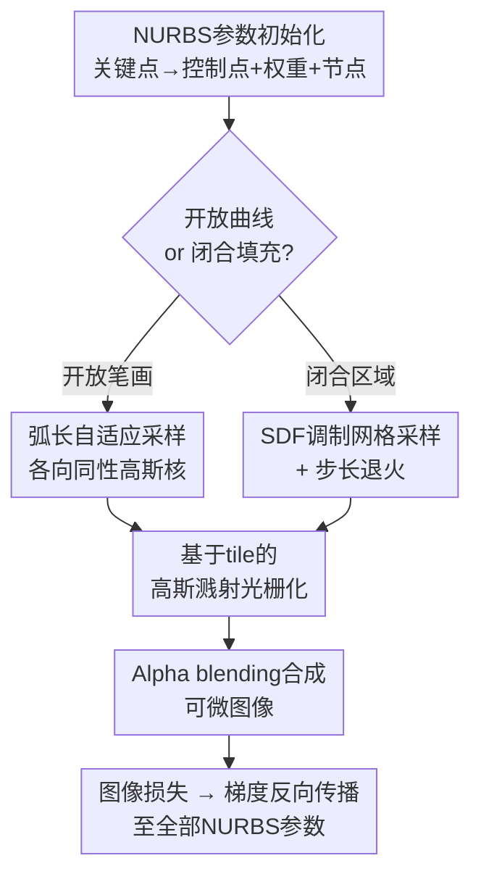

# NURBS Splatting: A Unified Differentiable Rendering Framework for Vector Graphics

**会议**: ECCV2026  
**arXiv**: [2606.31764](https://arxiv.org/abs/2606.31764)  
**代码**: [https://github.com/AnicoderAndy/nurbs-splatting](https://github.com/AnicoderAndy/nurbs-splatting)  
**领域**: others (可微渲染 / 矢量图形)  
**关键词**: NURBS曲线, 可微渲染, 高斯溅射, 图像矢量化, 参数曲线拟合

## 一句话总结
本文提出NURBS Splatting，通过将NURBS曲线沿弧长自适应采样为各向同性高斯核并使用基于tile的高斯溅射光栅化器进行可微渲染，首次将有理权重和非均匀节点向量纳入2D图像空间端到端优化，在书法重建、分层图像矢量化和单笔画图像抽象等任务上显著超越基于多项式基元的现有方法。

## 研究背景与动机

NURBS（非均匀有理B样条）是CAD和制造业中曲线与曲面的标准表示形式——SolidWorks、CATIA、Rhino等所有主流CAD内核以及STEP/IGES交换格式都基于NURBS，等几何分析也直接构建在其之上。相比多项式B样条，有理权重和非均匀节点赋予了NURBS精确表示圆锥截面（圆、椭圆、抛物线段）的能力，这是多项式样条只能近似而无法精确做到的；同时每个控制点独立的有理权重提供了更紧凑的局部几何控制。随着基于像素的图像生成模型不断进步，可微渲染为将这些像素输出转化为可制造、可编辑的矢量格式带来了极具前景的路径。

然而，现有可微2D渲染方法在这些方向上存在严重的结构性不足。DiffVG开创了可微贝塞尔光栅化，但依赖逐像素求交测试，高分辨率下耗时长且梯度不稳定。Bézier Splatting将高斯溅射引入2D矢量图形渲染，但同样局限于多项式贝塞尔曲线，不支持有理权重和非均匀节点。Berio等人的工作支持B样条优化但也排除了有理参数化。这些限制的根本原因在于：NURBS求值涉及Cox-de Boor递归和有理除法，计算开销显著高于多项式基元；同时要联合优化控制点位置、有理权重、非均匀节点间距和笔画宽度等多个异质参数并保持梯度通路稳定，并非简单的表示替换即可完成。

本文的核心idea是将NURBS曲线转化为连续高斯场——沿曲线参数域按弧长自适应采样各向同性高斯核覆盖开放笔画轮廓，通过基于符号距离场(SDF)调制的网格采样实现对封闭闭合区域的稠密填充，再利用基于tile的高斯溅射光栅化器以alpha blending合成最终图像，使图像空间的梯度能高效反向传播至控制点坐标、有理权重、非均匀节点区间和笔画宽度，从而首次将NURBS的全套表达能力纳入2D可微渲染的框架之中。

## 方法详解

### 整体框架

NURBS Splatting的整体管线分为四个阶段：首先以关键点(key points)作为顶层可学习参数，构造NURBS曲线的控制点、权重和节点向量；然后根据曲线类型采取不同的高斯采样策略——开放笔画沿弧长自适应密度采样各向同性高斯核，闭合填充区域则通过SDF调制的均匀网格生成内部高斯核；所有高斯基元通过基于tile的高斯溅射光栅化器排序并alpha blending合成可微图像；最终图像空间的损失驱动梯度反向传播至全部NURBS参数。三个阶段之间通过高效的导数计算（Cox-de Boor递推求解析曲率导数）实施几何正则化。

### 关键设计

**1. 关键点驱动的NURBS参数化：分离顶层优化与底层表示**

直接优化控制点和节点向量面临维度不确定性和单调性约束的问题。本文的巧妙之处在于引入关键点作为顶层可学习参数，控制点和节点向量由此派生。对于开放曲线，控制点直接等于关键点，节点向量两端以重复度为p+1的钳制节点封口——只有nₖ−p个内部节点区间τⱼ>0作为可学习参数存储，通过累积求和重建完整节点向量，天然保证了节点非递减的单调性约束。对于闭合曲线，将最后⌈p/2⌉和最初⌊p/2⌋个关键点循环绕回构造nₖ+p个控制点，节点向量也通过前后各绕回p个区间构造周期化节点向量。每个曲线还携带可学习的RGB颜色和全局不透明度，并将控制点扩展到ℝ³（第三个坐标编码当前位置的局部笔画宽度），使曲线求值的同时返回位置和宽度信息。

**2. 自适应弧长高斯采样：各向同性核化解旋转不稳定**

现有Bézier Splatting使用沿切线方向对齐的各向异性高斯核，这依赖atan2函数估计旋转角度——在大笔画宽度处产生模糊边缘，在高曲率区域产生尖刺伪影。本文采用各向同性高斯核从根本上规避了旋转估计问题：先通过数值求积近似弧长L=∫‖C'(u)‖du，然后按M=⌈δ_c·L⌉计算所需高斯核数量（δ_c为单位弧长上的用户指定密度），在参数域均匀分布M个采样点。每个采样点的计算利用B样条基函数紧支撑特性——对参数uⱼ只有p+1个基函数非零——将单次求值从O(Mn)降至O(Mp)。每颗各向同性高斯核的标准差σ=局部笔画宽度/全局尺度比ρ，因为M随弧长增长而保持足够密度，圆形核就能提供平滑覆盖。对开放曲线还额外将首尾高斯核复制κ次以保证端部完全不透明，无需引入额外参数。

**3. SDF调制的闭合区域填充与网格步长退火**

封闭填充曲线面临两个矛盾：精细网格保证填充质量但产生大量高斯基元拖慢计算；粗网格速度快但空洞明显。本文的解决方案分两步：先沿闭合曲线在像素坐标下采样⌈δ_b·L⌉个边界点构成多边形，对轴对齐包围盒内的均匀二维网格计算符号距离场——通过绕数确定符号（绕数>0.5为内部，+1；否则为外部，−1），距离值取到最近边界线段的最小欧氏距离。每个网格点生成一颗各向同性高斯核，其基础不透明度通过sigmoid(γ/h·sdf(qⱼ))调制——内部点的不透明度接近曲线级不透明度，外部点趋于零，边界处平滑过渡。第二步是网格步长退火：h从初始值4.0以余弦退火方式衰减至1.0（在迭代进度10%~80%之间），使早期使用粗网格优先完成大形变，后期切换到细网格精修边界细节。这套机制在计算效率和边界精度之间取得了良好平衡。

**4. 基于tile的各向同性高斯溅射光栅化**

高斯基元生成后采用GaussianImage的基于tile的光栅化器。得益于各向同性方案（σᵢ,ₓ=σᵢ,ᵧ=σᵢ, θᵢ=0），协方差退化为Σᵢ=σᵢ²I，像素xₙ处的高斯不透明度简化为αᵢ(xₙ)=oᵢ·exp(-‖xₙ−μᵢ‖²/2σᵢ²)。渲染器按深度排序所有高斯基元并逐像素做alpha blending——每个像素的最终颜色为其覆盖高斯基元的深度有序alpha混合，剩余透射率合成预定义的背景色。整个前向过程完全可微，图像空间损失（MSE或加权的距离损失）的梯度经由alpha blending、高斯核参数一路回传至NURBS的控制点坐标、有理权重、节点间距和笔画宽度。

### 损失函数 / 训练策略

整体损失为图像重建损失与几何正则化的加权和：ℒ = ℒ_img + λ_geo ℒ_geo。几何正则化包含三项：三阶导数平滑损失（ℒ_deriv³ = 沿参数域平均的‖d³C(u)/du³‖²，由Cox-de Boor递推的解析导数高效求值）抑制曲线抖动；边界框损失对越界点施加Softplus/ReLU惩罚阻止控制点漂移出画布；自交惩罚（仅分层图像矢量化中使用）惩罚连续路径段方向反转。学习率方面，控制点位置的学习率常设为1.0~2.0，笔画宽度为0.2，有理权重和节点间隔为0.1，配合余弦学习率衰减；优化器为Adam，迭代120~300步（依应用而定）。

## 实验关键数据

### 主实验：书法重建

在包含192个字符（92个日本假名+100个简体汉字）的书法基准上对比本文方法与Berio等人的B样条基线。

| 方法 | MSE ↓ | PSNR ↑ | SSIM ↑ | Hausdorff ↓ | F1 ↑ | 优化时间(s) ↓ |
|------|-------|--------|--------|-------------|------|---------------|
| Baseline (B-spline) | 0.0057 | 24.72 | 0.9813 | 15.26 | 0.9642 | 10.65 |
| Ours (δc=18) | **0.0038** | **26.32** | 0.9793 | **10.69** | 0.9741 | 8.73 |
| Ours (δc=30) | 0.0039 | 26.24 | **0.9824** | 11.07 | **0.9743** | 9.34 |

在默认配置下本文MSE降低33%、PSNR提升+1.6dB、Hausdorff距离降低30%，同时优化速度快1.2倍——速度增益主要来自避免了B样条转贝塞尔的矩阵乘法开销。在日文字符上优势尤为明显（+2.10dB PSNR），因为频繁的锐弯和钩拐受益于非均匀节点间距将基函数支撑集中在高曲率区域。提高采样密度至δc=30可恢复最佳SSIM(0.9824)，仅以少量时间增加为代价。

### 消融实验

| 配置 | PSNR ↑ | Hausdorff ↓ | 优化时间(s) | 说明 |
|------|--------|-------------|-------------|------|
| Full model | 26.32 | 10.69 | 8.73 | 完整NURBS |
| w/o rational weights | 25.63 (−0.69) | 11.70 (+1.01) | 8.98 | 去掉权重质量下降最大 |
| w/o non-uniform knots | 26.07 (−0.25) | 10.98 (+0.29) | 5.63 | 去掉节点速度提升最大 |
| w/o weights & knots | 25.92 (−0.40) | 11.34 (+0.65) | 5.12 | 仅多项式B样条+高斯光栅化仍优于基线 |

去掉有理权重是所有消融中影响最大的单因素（PSNR下降0.69dB），说明逐控制点的权重调制对局部曲率控制尤为关键。去掉节点对重建质量影响较小但提速最多。权重和节点的贡献是互补而非重叠的——完整模型比去掉节点的变体进一步改善0.25dB PSNR，证实两者应对不同的几何局限性。将完整模型简化至仅多项式B样条（即去掉权重和节点）后仍比基线的DiffVG光栅化快2.1倍且PSNR高+1.2dB，验证高斯溅射管线本身的一致性优势。

### 关键发现

- 各向同性高斯核相比Bézier Splatting的各向异性方案，从根本上消除了大笔画宽度处的模糊边缘和高曲率区域的尖刺伪影，是本文实现高质量渲染最核心的设计选择
- 有理权重对书法重建的贡献大于非均匀节点，尤其在日本假名的锐弯处——权重通过调整控制点处的曲率张量实现更精细的局部形变控制
- 分层图像矢量化(LIVE)实验中，网格步长退火在计算效率和重建质量间提供了有利折中：有退火时速度快30%但LPIPS仅增加0.0005
- 本文方法在薄交叉结构（如表情包中的面部细节）上比DiffVG基线的LIVE更鲁棒，因为SDF调制的区域填充避免了贝塞尔路径拼接处的尖刺问题

## 亮点与洞察

- **用各向同性高斯替代各向异性消除了梯度不稳定的根源**：Bézier Splatting的旋转角度估计依赖atan2，在高曲率区域梯度爆炸/消失很常见。退回到各向同性看似"降级"，但搭配弧长自适应密度后反而实现了更均匀的覆盖和更稳定的梯度。
- **关键点间接参数化天然解决节点单调性约束**：将节点区间作为正值参数存储再加累积和重建节点向量，比直接优化升序节点序列简单且稳定得多——这是将NURBS嵌入可微管线的工程精髓。
- **SDF调制填充与高斯溅射的嫁接**：本应将SDF求值作为离散步骤导致梯度截断，但通过将SDF的符号部分从计算图中分离（使用detach）、仅传导连续距离值的梯度，巧妙维持了整个管线的可微性。
- **网格步长退火的粗到细策略**：早期粗略填充让大形变快速收敛，后期精细填充锁定边界细节——这一策略可以在不牺牲最终质量的前提下将填充的计算量降低约1/3，值得在其他需要密集采样的可微渲染管线中借鉴。

## 局限与展望

- 目前闭合区域填充依赖启发式的SDF网格策略，对规则几何形状对比扫描线方法优势有限，且高斯基元的数量随曲线复杂度线性增长，在极高细节的插画场景下显存占用可能较高
- 低分辨率下NURBS求值的计算复杂度使其前向传播慢于DiffVG和Bézier Splatting；本文的优势主要体现在高复杂曲线（大量控制点）场景中，简单图形场景反而有性能劣势
- 闭合曲线的区域填充需要曲线本身是封闭的，且自交等复杂拓扑的处理依赖粗略的绕数判定，在多连通区域场景下可能出现填充不一致
- 编辑性方面，由于主流矢量图形编辑器（如Illustrator）不支持NURBS编辑，优化得到的曲线无法直接导入已有工作流——未来需要开发NURBS到贝塞尔的分段精确转换接口
- 扩展至3D NURBS曲面、开发更高效的分析区域填充算法、以及融合生成模型实现文本/图像到可编辑NURBS的端到端生成，是三个值得探索的方向

## 相关工作与启发

- **vs DiffVG**：DiffVG开创了可微贝塞尔光栅化但逐像素求交在高分辨率下慢且梯度不稳定。本文用高斯溅射替代逐像素求交，在大幅加速的同时首次将NURBS（有理权重+非均匀节点）纳入可微管线。
- **vs Bézier Splatting**：Bézier Splatting同样采用高斯溅射但使用各向异性高斯核，本文的各向同性方案避免了旋转估计的不稳定；此外Bézier Splatting要求场景中所有曲线共享相同控制点数量，本文允许每条曲线拥有独立的控制点、权重和节点配置。
- **vs Berio et al. (Neural Image Abstraction)**：Berio等人的方法支持B样条优化但不含有理权重。本文将同样任务延拓至NURBS，在书法重建中PSNR提升+1.6dB，且在SDS辅助的神经抽象中因避免B样条转贝塞尔而获得1.27倍加速。
- **vs NURBS-Diff**：Deva Prasad等人的NURBS-Diff提供了可微NURBS求值层但局限于3D几何拟合和曲面拼接任务，未涉足2D图像空间的可微渲染。本文将NURBS的可微能力拓展至图像空间，打开了书法修复、图层矢量化等与像素级监督直接对接的通道。

## 评分

- 新颖性: ⭐⭐⭐⭐⭐ 首个将NURBS有理权重和非均匀节点向量纳入2D可微渲染框架的工作，连接了矢量图形渲染与CAD工业标准之间的鸿沟。
- 实验充分度: ⭐⭐⭐⭐ 在书法重建、分层图像矢量化、神经抽象三个差异化任务上做了充分对比，消融实验分别隔离了权重、节点、退火策略的贡献；局限在于与Bézier Splatting的定量对比因代码架构限制缺失，仅能以原型实验替代。
- 写作质量: ⭐⭐⭐⭐⭐ 动机链清晰（CAD标准→可微渲染能力缺口→本文方案），方法叙述循序渐进地展开各设计点，公式使用克制且与中文叙述配合恰当。
- 价值: ⭐⭐⭐⭐⭐ NURBS在可微管线中的引入打开了CAD/CAM领域与视觉/图形学交叉的新空间，对书法数字存档、字体设计、机器人手写字复制等实际应用有直接推动作用。

<!-- RELATED:START -->

## 相关论文

- [\[ECCV 2026\] Vector Scaffolding: Inter-Scale Orchestration for Differentiable Image Vectorization](vector_scaffolding_inter-scale_orchestration_for_differentiable_image_vectorizat.md)
- [\[CVPR 2026\] DiffBMP: Differentiable Rendering with Bitmap Primitives](../../CVPR2026/others/diffbmp_differentiable_rendering_with_bitmap_primitives.md)
- [\[CVPR 2025\] Locally Orderless Images for Optimization in Differentiable Rendering](../../CVPR2025/others/locally_orderless_images_for_optimization_in_differentiable_rendering.md)
- [\[ICLR 2026\] GoR: A Unified and Extensible Generative Framework for Ordinal Regression](../../ICLR2026/others/gor_a_unified_and_extensible_generative_framework_for_ordinal_regression.md)
- [\[ECCV 2024\] An Incremental Unified Framework for Small Defect Inspection](../../ECCV2024/others/an_incremental_unified_framework_for_small_defect_inspection.md)

<!-- RELATED:END -->
