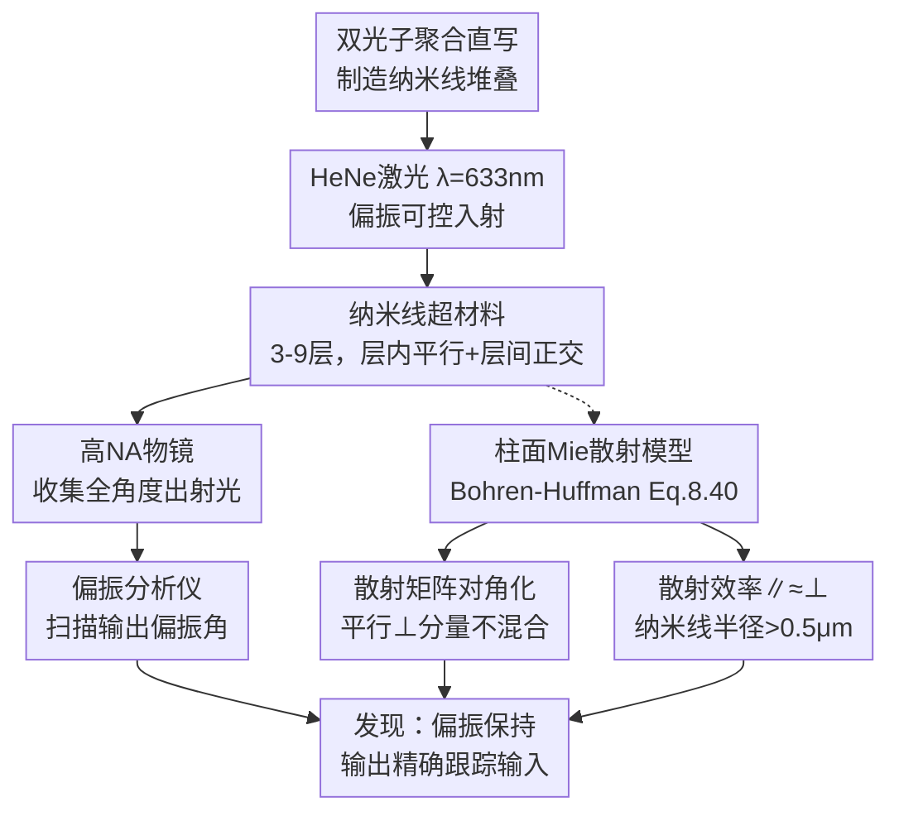

# 光密纳米线超材料：多重散射下的偏振保持

**会议**: ECCV 2026  
**arXiv**: [2606.29019](https://arxiv.org/abs/2606.29019)  
**代码**: 无  
**领域**: 计算光学 / 物理光学  
**关键词**: 各向异性散射, 纳米线超材料, 偏振保持, 多重散射, 米氏散射

## 一句话总结
本文通过实验发现，由定向排列聚合物纳米线构成的各向异性超材料在光学稠密（多重散射）条件下仍然能够保持输入线偏振的偏振态，并利用柱面米氏散射矩阵的对角化性质揭示了「偏振不旋转」的物理机制：对于圆柱散射体，平行与垂直电场分量在散射过程中独立保持相位关系，当两种偏振的散射截面相等时输出偏振精确跟踪输入偏振。

## 研究背景与动机

光在不均匀介质（生物组织、涂料、泡沫）中的散射传输是复杂光子学的核心课题。传统研究几乎全部集中在球形纳米粒子构成的散射介质上。球对称性意味着散射后的电场分量经历无规律的相位混合，因此当样品光学厚度远大于平均自由程（多重散射区域）时，入射光的传播方向被完全打乱，偏振状态同样被彻底随机化——这是领域内沿袭数十年的普遍认知。这一退偏效应使得任何试图利用偏振信息的技术（如偏振差分成像、偏振敏感传感）在多重散射场景中受到根本性制约。

本文作者提出了一个反直觉的问题：如果散射体的形状从球体变为各向异性的柱体（纳米线），偏振随机化是否仍然不可避免？为了系统研究这一猜想，他们利用双光子聚合直写（DLW）技术制造了高度可控的定向纳米线堆叠样品——每层内纳米线平行排列且最近邻间距随机（面内无序），相邻层间纳米线互相垂直（层间正交）。这种「有序 + 无序」混合结构是研究各向异性散射的理想模型系统，因为传统球堆积方法无法独立控制散射体的取向和空间随机性。

出乎意料的是，尽管这些样品的透过率低至 12%，平均自由程 ℓ ≈ 1.1 μm 远小于样品厚度 L（确认为多重散射），入射的线偏振光在出射时不仅没有被随机化，反而完美地保持了偏振态——输出偏振角与输入偏振角呈精确的线性关系。**核心 idea：对于垂直于入射方向的圆柱散射体，Bohren-Huffman 散射矩阵是对角化的，平行和垂直电场分量在散射过程中不混合、相位关系不变；当纳米线直径 > 1 μm 时两种偏振的散射截面相等，因此输出偏振方向与输入一致，即使在多次散射后也不旋转。**

## 方法详解

### 整体框架

本文的方法链条为「样品制造 → 光学测量 → 理论解释」三阶段。通过双光子聚合直写制造定向纳米线堆叠，用 HeNe 激光（λ=633 nm）做偏振可控入射，经大数值孔径物镜收集全角度透射光并进行偏振分析，最后用柱面米氏散射理论定量解释偏振保持的物理机制。

### 关键设计

**1. 双光子聚合直写制造定向纳米线堆叠：解决各向异性散射样品缺乏可控构造方法的问题**

作者使用 Nanoscribe Photonic Professional GT2 商业系统，在光敏聚合物（Ip-Dip）中通过双光子诱导聚合逐层写入纳米线。纳米线半径 a=0.5-1 μm，长度 b=10 μm，堆叠层数 3-9 层，总厚度 3-20 μm。每层内纳米线平行排列、最近邻间距随机（面内无序）；相邻层间纳米线互相垂直（层间正交）。制造参数（激光功率 6.4-10 mW，写入速度 150-1100 μm/s）在 3×3 阵列上系统变化以优化条件。SEM 表征证实结构精确可控，其关键优势在于同时实现了「各向异性定向」和「面内随机性」——这是传统方法（球随机堆积或光栅周期结构）无法独立控制的。多组重复扫描透过率高度一致，说明样品质量和重现性良好。

**2. 偏振保持的物理机制：圆柱散射矩阵的对角化保证偏振分量不混合**

这是全文的理论核心。从 Bohren-Huffman 柱面米氏散射理论（式 8.40）出发：对于无限长圆柱体，散射电场与入射电场满足

$$\begin{pmatrix}E_{\parallel o} \\ E_{\perp s}\end{pmatrix}=e^{i3\pi/4}\sqrt{\frac{2}{\pi kr}}\,e^{ikr}\begin{pmatrix}T_1 & 0 \\ 0 & T_2\end{pmatrix}\begin{pmatrix}E_{\parallel i} \\ E_{\perp i}\end{pmatrix}$$

散射矩阵是对角矩阵——平行分量 $E_{\parallel}$ 和垂直分量 $E_{\perp}$ 独立获得相同的相位因子 $e^{i3\pi/4}e^{ikr}$，不存在交叉混合项。这意味着线偏振入射光的两个正交分量在散射后相位关系不变，输出仍为线偏振。进一步地，图 5 的散射效率计算显示：对于半径 a > 0.5 μm 的纳米线，平行和垂直偏振的散射效率趋于相等（$T_1 \approx T_2$），因此输出偏振方向与输入偏振方向一致，不发生旋转。

在多层正交堆叠的几何中，入射光主要在 z 方向（垂直于纳米线平面）传播。由于密实超材料的等效折射率 n_eff ≈ 1.4、照明物镜 NA=0.25，内部最大入射角仅约 10°（cosθ ≈ 0.98），实际传播方向近乎垂直于纳米线轴。每一层散射体上的入射偏振总能分解为该层纳米线的平行/垂直分量，散射后分量相位关系不变；进入下一层时，相邻层纳米线正交，原来的「平行」分量变为下一层的「垂直」分量（反之亦然），但两个分量在每一层的散射矩阵中都被独立守恒处理。因此，即使在跨越所有层并经历多次散射后，输出偏振始终跟踪输入偏振。

**3. 从散射效率到透过率的定量预测：米氏模型与实验定量吻合**

作者利用 bhcyl FORTRAN 程序计算纳米线的散射效率 Q_sc 与半径 a 的关系。对于 a=0.75 μm、λ=633 nm，平行和垂直偏振的平均散射效率 Q_sc = 1.7898（远大于 1，确认处于米氏散射区，非瑞利散射）。由此推导散射截面 C_sc = Q_sc · G（G=2ab 为几何截面），再由纳米线数密度 ρ 计算平均自由程 ℓ = 1/(ρC_sc) = 1.12 μm。利用独立散射近似（ISA）估计总透过率 T ≈ ℓ/L = 1.12/7.5 ≈ 15%，与实验测量到的最低透过率 12% 定量吻合，偏差归因于模型忽略内反射边界效应。表 1 进一步显示从光学透过率反推的纳米线半径与 SEM 实测值趋势一致（光学值系统性偏低约 10%，同样可归因于内反射边界效应），有力验证了光学模型的预测能力。

### 一个完整示例：45° 偏振入射下的偏振跟踪

取结构 3（纳米线半径 a=0.75 μm，层数 L=5，物理厚度 7.5 μm）。HeNe 激光以 45° 线偏振入射。总透过率约 12%，平均自由程 ℓ=1.12 μm，光子在介质内约经历 L/ℓ ≈ 7 次散射。用偏振分析仪以不同角度扫描输出光，发现最大透射出现在输出偏振角约 45°——精确跟踪输入偏振（图 6a）。当输入偏振旋转至 180°，输出最大透射同样出现在约 180°（图 6b）。将图 6 的正弦拟合曲线提取的最大/最小位置作图，得到输出偏振角与输入偏振角之间的严格线性关系（图 7a）。偏振效率（最大/最小强度对比）在 90% 以上，消光比约 10 倍。尽管光子在超材料中经历了约 7 次散射，偏振信息丝毫没有丢失。

## 实验关键数据

### 主实验

| 结构 | 光学反推半径 (μm) | SEM 实测半径 (μm) | 最低透过率 | 估算平均自由程 ℓ (μm) |
|------|-------------------|-------------------|-----------|---------------------|
| 1 | 0.670 ± 0.009 | 0.795 ± 0.066 | ~21% | — |
| 2 | 0.686 ± 0.012 | 0.840 ± 0.066 | ~18% | — |
| 3 | 0.768 ± 0.012 | 0.883 ± 0.066 | ~12% | 1.12 |

### 消融分析

| 实验条件 | 关键发现 |
|---------|---------|
| 输入偏振 0°（平行于第一层纳米线） | 输出最大透射对应 ~0°，偏振保持 |
| 输入偏振 90°（垂直于第一层纳米线） | 输出最大透射对应 ~90°，偏振保持 |
| 输入偏振 45° | 输出最大透射对应 ~45°，偏振方向跟踪输入 |
| 输入偏振 180° | 输出最大透射对应 ~180°，对称性验证 |
| 纳米线半径 a < 0.5 μm | 散射效率 ∥ 和 ⊥ 不相等，预计会产生偏振旋转（但论文未直接实验验证此区域） |

### 关键发现

- 纳米线半径从光学透过率反推与 SEM 实测趋势一致（光学值系统偏低 ~10%），验证了独立散射近似（ISA）在材料体系中的适用性。
- 散射效率 Q_sc 随半径 a 增大从约 1 增至约 3；当 a > 0.5 μm（直径 > 1 μm）后，平行和垂直偏振的散射效率趋于相等——这是 T₁ ≈ T₂ 进而偏振不旋转的关键条件。
- 样品越厚/越密透过率越低（结构 1 的 21% → 结构 3 的 12%），但偏振保持特性不变，说明这是各向异性圆柱散射体的固有性质，与多重散射次数无关。
- 图 7b 的偏振效率和消光比数据显示所有输入偏振角度下效率均高于 90%，验证了偏振保持的全局性而非偶然。

## 亮点与洞察

- 实验与理论形成闭环验证：从全散射效率（Mie 理论）计算平均自由程 ℓ，再预测透过率 T ≈ ℓ/L，与 12% 实测定量吻合——单一模型同时解释强度衰减和偏振保持两个现象。
- 散射矩阵对角化是最简洁的解释：不需要额外假设，Bohren-Huffman 式 8.40 的对角性质直接说明圆柱散射体中偏振分量不混合；两种偏振散射截面相等（T₁ ≈ T₂）不出现在散射振幅中、只影响偏振方向是否旋转，两个条件共同保证了偏振保持。
- 从「球体退偏」到「柱体保偏」的反直觉发现展示了散射体几何形状对光学响应的根本性影响，可能启发更多各向异性散射结构的设计（如椭圆形、棒状、甚至生物细胞形状）。

## 局限与展望

- 散射模型基于独立散射近似（ISA），忽略了层间界面处的内反射边界效应（作者明确承认）。更精确的模型需考虑多层界面间的光学耦合和相干效应。
- 实验仅在一个波长（λ=633 nm）进行，偏振保持行为的波长依赖性（尤其是靠近纳米线尺寸共振区时）未探索。
- 当前仅为概念验证，距离实际应用（白 LED 中的保偏偏光元件、光学加密、通信）还有距离。大规模制造技术（如化学合成纳米线的溶液沉积或电场定向排列）的可行性尚待验证。
- 偏振保持的量化极限未探索——当层数增加到 20+ 层或纳米线取向分散度增大时，累积的微小相位差是否最终导致退偏？

## 相关工作与启发

- **vs 球形散射体多重散射**：传统认知是光学稠密介质必然退偏，本文用实验证明各向异性圆柱散射体可以打破这一直觉。关键在于散射体形状决定了散射矩阵是否对角化。
- **vs 液晶/双折射介质**：传统各向异性介质通过材料体折射率差影响偏振（各向异性光学材料），而本文的各向异性来自散射体几何形状（各向异性结构材料），属于结构光学范畴，原理完全不同。
- **vs 光子晶体**：光子晶体依赖周期布拉格散射，而有严格周期性要求；本文结构是「层内随机 + 层间正交」的混合秩序，制造约束大幅降低。
- **潜在可迁移设计**：Bohren-Huffman 散射方程适用于任意介电函数的圆柱，因此原理可推广到氧化物纳米线、半导体纳米棒/纳米线、甚至反向结构（高折射率基底中的低折射率圆柱孔道），为偏振敏感/偏振保持散射器设计提供了通用理论基础。

## 评分

- 新颖性: ⭐⭐⭐⭐⭐  通过巧妙选择散射体几何，在公认「必退偏」的多重散射条件下实现偏振保持，反直觉且物理深刻
- 实验充分度: ⭐⭐⭐⭐  实验设计清晰、定量验证充分，但仅一个波长，层数和取向参数的扫描范围有限
- 写作质量: ⭐⭐⭐⭐  逻辑递进清晰（制造→测量→理论→应用），方法论和结果讨论细致，理论基础扎实
- 价值: ⭐⭐⭐⭐  为各向异性光学散射基础研究开辟新方向，对白光照明、光通信、光学加密等应用领域有启发意义

<!-- RELATED:START -->

## 相关论文

- [\[ECCV 2026\] Geometric Gradient Rectification for Safe Open-Set Semi-Supervised Learning](geometric_gradient_rectification_for_safe_open-set_semi-supervised_learning.md)
- [\[ECCV 2026\] Geometry-Anchored Transport Framework for Exemplar-Free Class-Incremental Learning](geometry-anchored_transport_framework_for_exemplar-free_class-incremental_learni.md)
- [\[ECCV 2026\] Pointer-CAD v2: Plan-Then-Construct CAD Generation with Dimension-Aware Parametric Precision](pointer-cad_v2_plan-then-construct_cad_generation_with_dimension-aware_parametri.md)
- [\[ECCV 2026\] Articulat3D: Reconstructing Articulated Digital Twins From Monocular Videos with Geometric and Motion Constraints](articulat3d_reconstructing_articulated_digital_twins_from_monocular_videos_with_.md)
- [\[ECCV 2026\] Lie Group Diffusion Models for Hardware-Aware Quantum Circuit Synthesis](lie_group_diffusion_models_for_hardware_aware_quantum_circuit_synthesis.md)

<!-- RELATED:END -->
