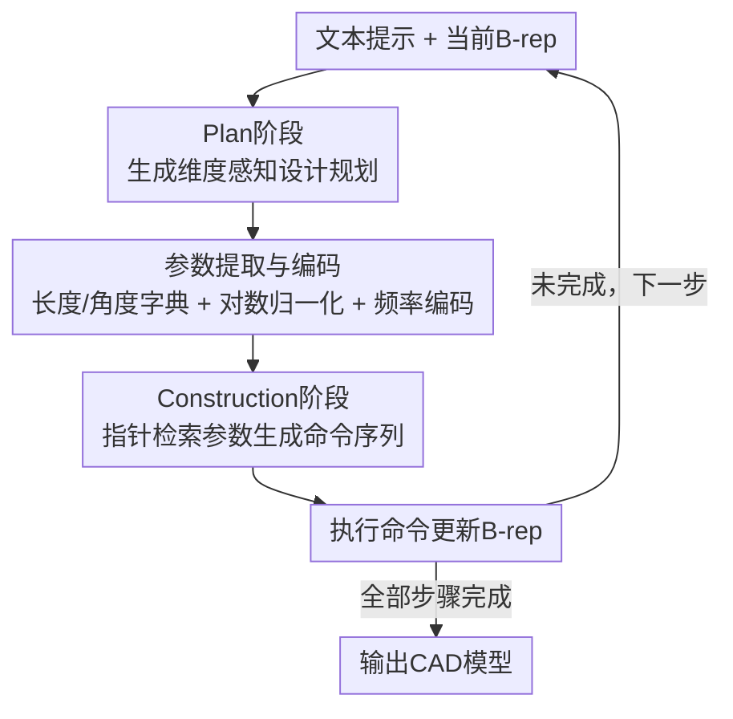

# Pointer-CAD v2: Plan-Then-Construct CAD Generation with Dimension-Aware Parametric Precision

**会议**: ECCV 2026  
**arXiv**: [2606.29301](https://arxiv.org/abs/2606.29301)  
**代码**: [https://github.com/Snitro/Pointer-CAD-v2](https://github.com/Snitro/Pointer-CAD-v2) (有)  
**领域**: 3D视觉  
**关键词**: CAD生成, 参数化建模, Plan-Then-Construct, 指针机制, 几何精度

## 一句话总结
Pointer-CAD v2 提出 Plan-Then-Construct 框架，将 CAD 生成解耦为「先规划维度参数、再通过指针检索参数构造几何」两个阶段，彻底消除传统命令序列方法中数值参数量化带来的精度损失，在顶点/边/面三级几何精度指标上大幅超越所有基线。

## 研究背景与动机

**领域现状**：CAD 生成的主流范式分为两类——命令序列表示和代码表示。代码表示直接生成 CADQuery 或 FreeCAD API 脚本，天然支持精确数值，但 token 效率低（比命令序列长约 4 倍）；命令序列表示用专用 token 描述参数化操作，token 效率高，但连续几何量必须被量化为有限词表，导致精度损失。Pointer-CAD 通过指针机制扩展了命令序列的表达能力，支持引用中间几何实体，但仍未解决精确尺寸控制问题。

**现有痛点**：命令序列方法将长度、角度等连续参数离散化为 token，引入量化误差。表面上看，这些微小偏差在形状级别（Chamfer Distance、IoU）上几乎不可见，但在工业制造中，毫米级的尺寸偏差就足以导致零件装配失败。更糟的是，现有评估指标（CD、IoU）对这类参数误差不敏感，导致研究社区长期忽视了维度精度问题。

**核心矛盾**：命令序列方法的参数和几何操作共享同一个 token 空间，迫使连续值必须量化——这是一个结构性矛盾，不是调参能解决的。代码表示能表达精确值，但 token 代价太高。两者之间存在 token 效率与参数精度的根本性 trade-off。

**本文目标**：在不牺牲 token 效率的前提下，使命令序列模型能够表达连续、精确、带单位的几何参数。具体分解为三个子问题：(1) 如何在文本域中显式表达维度参数；(2) 如何在生成命令序列时精确引用这些参数；(3) 如何评估生成模型的参数保真度而非仅看形状相似度。

**切入角度**：作者观察到，参数推理和几何构造是两种不同性质的任务——前者需要在文本空间进行带单位的数值推理，后者需要在几何空间进行实体选择和操作排序。将两者强行塞进同一个 token 预测任务，是精度损失的根本原因。如果能先让模型在文本域「想清楚」所有参数，再在几何域「照着做」，就能同时保留数值精度和 token 效率。

**核心 idea**：Plan-Then-Construct——在每个建模步骤中，先让模型生成一份包含完整维度参数的结构化文本「设计规划」，再将规划中的参数提取为字典，构造阶段通过指针机制从字典中检索精确值填入命令序列，从而彻底绕过参数量化。

## 方法详解

### 整体框架

Pointer-CAD v2 解决的核心问题是：命令序列 CAD 生成中，连续几何参数被迫量化为离散 token 导致精度损失。整体思路是将参数推理与几何构造解耦。方法继承 Pointer-CAD 的逐步建模范式，每一步操作（sketch-extrude / chamfer / fillet）拆成两个阶段：Plan 阶段在文本域生成带维度标注的结构化设计规划，Construction 阶段从规划中提取参数字典、通过指针检索精确数值填入命令序列，执行后更新 B-rep，再进入下一步。

### 关键设计

**1. 维度感知的设计规划：在文本域显式表达带单位的连续参数**

传统命令序列方法中，长度 5.3mm 被量化为 token ID #4237，解码时映射回 5.0mm —— 精度在「连续值变成有限类目」这一步就丢失了。Pointer-CAD v2 的 Plan 阶段不去预测 token，而是在文本域生成一份结构化的「设计规划」，规划中用 `<>` 包裹每个可引用的参数，显式标注类型（L 表示长度，A 表示角度）和物理单位（如 mm、degrees、meters），并支持同类型参数之间的算术引用（如 `<L2> = <L1> × 2`）。这份规划是文本 token 序列，不涉及任何量化，每个参数保留原始连续值。

**2. 基于指针的参数检索：提取、编码、相似度匹配三步走**

Plan 阶段生成规划后，所有 `<L>` 和 `<A>` 参数被提取为长度字典和角度字典。接下来的问题是如何让模型在生成命令序列时「指回」这些精确值。作者设计了一套参数编码与检索管线：(1) **参数提取与归一化**：将提取的参数统一转换到标准单位（长度→米，角度→度），应用符号保持的对数归一化 $ \tilde{x}=\frac{\text{sign}(x)\cdot\log(1+|x|)}{\max_{x'\in\mathcal{P}}|\text{sign}(x')\cdot\log(1+|x'|)|+\epsilon} $，缓解不同量级参数之间的尺度失衡；(2) **频率编码**：对归一化值 $ \tilde{x} $ 用指数增长的频率带 $ \mathbf{b}=[2^0,2^1,\dots,2^{K-1}] $ 做傅里叶特征映射 $ \phi(\tilde{x})=[\sin(\tilde{x}\cdot s\cdot\mathbf{b}),\cos(\tilde{x}\cdot s\cdot\mathbf{b})] $，增强对不同数值范围的表达能力；(3) **门控 MLP 嵌入**：将原始归一化值 $ \tilde{x} $ 和频率特征 $ \phi(\tilde{x}) $ 分别通过门控 MLP $ \mathcal{H}(\mathbf{u})=\text{LayerNorm}(\sigma(W_g\mathbf{u})\odot\text{MLP}(\mathbf{u})) $ 投影到共享嵌入空间后取均值 $ \mathbf{e}=\frac{1}{2}(\mathcal{H}(\tilde{x})+\mathcal{H}(\phi(\tilde{x}))) $，再加 RoPE 编码参数身份和位置信息。构造命令序列时，每当需要数值参数，模型预测一个查询嵌入 $ \tilde{\mathbf{e}} $，与参数字典中所有候选做余弦相似度匹配 $ \text{similarity}(\tilde{\mathbf{e}},\mathbf{e}_i)=\frac{\tilde{\mathbf{e}}\cdot\mathbf{e}_i}{|\tilde{\mathbf{e}}|\cdot|\mathbf{e}_i|} $，选最高分者直接插入命令序列。整个过程参数值始终以连续形式存在，彻底消除量化误差。

**3. 三级层次化几何精度指标：从「形状像不像」到「参数对不对」**

现有指标（Chamfer Distance、IoU）衡量的是归一化后的形状相似度，对毫米级的尺寸偏差几乎无感。作者定义了一组从粗到细的层次化几何精度指标，所有指标共享 Accuracy Ratio 公式 $ Acc=\frac{N_{match}}{N_{gt}}\times 100 $：(1) **顶点精度**：预测顶点与 GT 最近点的欧氏距离在容差 $ \epsilon=0.001\times\min(\mathbf{b}_{gt}^{max}-\mathbf{b}_{gt}^{min}) $ 内即算匹配；(2) **边精度**：不仅要求端点匹配，还要求底层几何参数（如圆弧的圆心和半径、圆的法向）对齐；(3) **面精度**：要求所有构成边都匹配且面类型（平面/圆柱/圆锥/球面/环面）一致。此外引入 RMR@3（Repairable Model Rate）：错误面数不超过 3 个即视为可修复模型，衡量实际工程可用性。所有评估在模型原始尺寸和位置下进行，不做归一化，强制模型展示真正的尺度理解能力。

### 一个完整示例

假设文本指令要求生成一个「边长 50mm 的正方形底座，向上拉伸 30mm」。在 Plan 阶段，模型生成规划：「(1) 在 XY 平面绘制正方形草图，边长 `<L1>=50mm`；(2) 沿 Z+ 方向拉伸，距离 `<L2>=30mm`。」参数被提取为长度字典 `{L1: 0.05, L2: 0.03}`（统一转换为米），经对数归一化和频率编码后得到嵌入向量。在 Construction 阶段，模型依次生成 `<ss>`(开始草图) → 四条直线命令（端点坐标通过指针检索 B-rep 已有顶点）→ `<se>`(开始拉伸) → `<lv>`(预测查询嵌入，与 L2 嵌入余弦相似度最高，选中 0.03m) → `<em>`(结束)。两个参数值的检索都是连续精确匹配，不再有「token #4237 解码为 5.0 而非 5.3」的问题。

### 损失函数 / 训练策略

训练目标组合四个损失项：$ \mathcal{L}=\lambda_t\cdot\mathcal{L}_t+\lambda_l\cdot\mathcal{L}_l+\lambda_v\cdot\mathcal{L}_v+\lambda_p\cdot\mathcal{L}_p $，其中 $ \mathcal{L}_t $ 和 $ \mathcal{L}_l $ 分别是 Plan token 和 Label token 的交叉熵损失，$ \mathcal{L}_v $ 和 $ \mathcal{L}_p $ 分别是数值 token 和指针 token 的对比损失（余弦相似度 + softmax）。超参设置为 $ \lambda_t=0.2,\lambda_l=0.3,\lambda_v=0.2,\lambda_p=0.3 $，label 和 pointer 损失权重更高，因其对命令生成的准确性更关键。解码端使用三个独立头——Label Head 预测标签 token（含 `<lv>`/`<av>` 指示当前为长度/角度值），Value Head 预测 128 维查询嵌入用于参数检索，Pointer Head 预测 128 维查询嵌入用于 B-rep 几何实体检索。骨干 LLM 为 Qwen2.5-0.5B，H800 GPU 训练 10 epoch。

## 实验关键数据

### 主实验

在下表（OmniCAD-Plan 数据集，含 202K 模型）中，Pointer-CAD v2 在三级几何精度和 RMR@3 上均显著超越 CADmium 和 Pointer-CAD。1.5B 版本较 CADmium-1.5B 平均精度提升 13.49 个百分点。

| 方法 | RMR@3 | 顶点精度 | 边精度 | 面精度 |
|------|-------|---------|--------|--------|
| CADmium-0.5B | 78.60 | 76.37 | 72.41 | 66.56 |
| Pointer-CAD-0.5B | 66.03 | 58.87 | 59.18 | 55.88 |
| **Ours-0.5B** | **87.29** | **90.10** | **92.21** | **89.05** |
| CADmium-1.5B | 81.15 | 79.36 | 74.03 | 67.99 |
| Pointer-CAD-1.5B | 72.10 | 64.67 | 62.40 | 59.50 |
| **Ours-1.5B** | **91.25** | **92.76** | **94.23** | **91.14** |

在更复杂的 OmniCAD-Plan+（含 chamfer/fillet，209K 模型）上，0.5B 模型将面精度从 CADmium 的 26.06% 提升至 84.16%，1.5B 模型的 RMR@3 达 90.97%，说明框架对复杂操作具有强鲁棒性。与通用 LLM（GPT-5.2、Gemini 3 Pro、Claude Opus 4.5、Qwen3-235B）对比，Ours-1.5B 平均三级精度超越最强通用模型 Gemini 3 Pro 21.30 个百分点。在传统指标（F1、CD）上，Line 和 Circle 的 F1 已近饱和，Ours 将 Arc F1 从 Pointer-CAD 的 51.00 提升至 63.59，CD 改善微弱——这恰好印证传统指标对参数精度不敏感，需要新指标。

### 消融实验

| 变体 | RMR@3 | 顶点精度 | 边精度 | 面精度 | 说明 |
|------|-------|---------|--------|--------|------|
| Full model | 87.29 | 90.10 | 92.21 | 89.05 | 完整模型 |
| w/o Ref. | 65.55 | 66.30 | 71.14 | 66.30 | 去掉指针检索，改用直接回归+最近值匹配，掉 21.74 |
| w/o Plan | 80.93 | 76.13 | 75.50 | 71.38 | 去掉 Plan 阶段，直接从原始 prompt 提取参数，掉 6.36 |
| w/o Freq. | 86.77 | 89.02 | 90.67 | 87.31 | 去掉频率编码，仅轻微下降 0.52 |
| w/o Norm. | 86.76 | 89.63 | 91.96 | 88.51 | 去掉对数归一化，仅轻微下降 0.48 |

### 关键发现

- 去掉指针检索（w/o Ref.）掉点最严重（RMR@3 从 87.29 跌至 65.55），说明直接回归数值极易受邻近值干扰，指针机制是精度保障的核心。去掉 Plan 阶段掉 6.36 个点，因为原始 prompt 往往不包含全部构造参数（如从已有几何体推算出的定位参数），需显式推理补齐。
- 频率编码和对数归一化的贡献很小（<1.2%），说明指针检索机制对数值尺度的敏感性较低，即使不做精细编码也能较好地检索到正确参数——这是一个正面的鲁棒性信号。
- 随着模型从 0.5B 扩展到 7B，Ours 与 CADmium 的差距持续拉大（从 13.12% 扩至 15.36%），说明 Plan-Then-Construct 框架能有效利用更大的模型容量。
- 传统 CD 指标上 Ours vs Pointer-CAD 差异很小（3.15 vs 3.69），直观反映了参数精度提升不被形状级别指标捕捉的问题。

## 亮点与洞察

- **Plan-Then-Construct 解耦思路巧妙且普适**：将「参数推理」与「几何构造」分离为两个阶段，Plan 阶段负责在文本域做数值推理，Construction 阶段负责在几何域做实体操作，两者通过指针桥接。这种「先想清楚参数、再照着做」的模式不仅解决了量化问题，还让规划天然可编辑——改规划里的参数值就直接得到修改后的 CAD 模型。
- **用指针做参数检索而非回归**：回归预测连续值容易漂移，但把参数值编码成嵌入、让模型从候选集中检索最相似的——这本质上是把回归问题转化为检索问题，稳定性大幅提升。消融实验中 w/o Ref. 掉 21.74 点验证了这一点。
- **对数归一化 + 频率编码的参数表达管线**：这是 NeRF 社区的技术迁移——把处理连续坐标的 Fourier Feature 技巧用来处理跨度几个数量级的 CAD 参数值（从微米到米），是个跨领域迁移的好例子。
- **RMR 指标贴合工程实际**：不给「面面俱到」的严苛指标，而是用 RMR@3 衡量「后处理能否救回来」，这比纯学术指标更可能被工业界采纳。

## 局限与展望

- **Plan 质量受限于 LLM**：规划标注依赖 Qwen3-32B 自动生成，复杂 sketch-extrude 对的 Plan 生成失败率较高（原文数据显示 OmniCAD-Plan+ 中此类操作比源数据减少 22.08%），意味着当前框架对复杂草图的覆盖可能不足。如果 Planner 本身在复杂场景下出错，构造阶段再精确也无法挽救。
- **步进式生成效率**：沿用 Pointer-CAD 的逐步范式，每步需 Plan+Construct 两阶段，长序列模型（多步 CAD）推理延迟是代码方法的多倍。论文未讨论推理速度。
- **端到端训练 vs 模块独立**：当前框架中 Plan 和 Construction 共享骨干但在同一前向传播中顺序生成，Plan 阶段的错误会传播到 Construction。论文未探索 Plan-Construction 之间的 error recovery 机制（如 Plan 生成后可验证/修正再进入 Construction）。
- **操作类型受限**：当前支持 sketch-extrude、chamfer、fillet 三种操作，尚未覆盖 loft、sweep、boolean 等更通用的 CAD 操作，距离完整覆盖工程 CAD 工作流仍有距离。

## 相关工作与启发

- **vs Pointer-CAD**：Pointer-CAD 引入指针机制用于参考已有几何实体（边/面），Pointer-CAD v2 将其扩展为双用途——既参考几何实体又参考数值参数。v1 的指针解决的是「选哪个面去倒角」，v2 的指针还解决了「倒角的半径是多少」。两者的关系是继承+扩展，v2 的规划阶段是全新的。
- **vs CADmium / 代码表示方法**：代码方法天然支持精确参数（API 参数就是 float），但 token 消耗大且受限于 LLM 的代码生成能力。Pointer-CAD v2 在命令序列中取得了与代码方法同等的精度，同时保留 token 效率优势，本质上是取两者的长处。
- **vs 通用 LLM 直接生成 CAD 代码**：GPT-5.2、Gemini 3 Pro 等即使 prompt 引导生成 CADQuery 代码，几何精度仍显著弱于专门训练的 0.5B 模型，RMR@3 差距超过 13 个点。说明 CAD 建模需要专门的表示和训练范式，通用 LLM 的 code generation 能力不足以弥补领域差距。

## 评分

- 新颖性: ⭐⭐⭐⭐ 解耦参数推理与几何构造的思路新颖，Plan-Then-Construct 范式为命令序列方法开辟了新方向；核心机制（指针检索参数）是从 Pointer-CAD 扩展开的，不完全是从零创新
- 实验充分度: ⭐⭐⭐⭐⭐ 双数据集、多模型尺寸（0.5B-7B）、多基线（命令序列/代码/通用 LLM）、多指标（新指标+传统指标）、消融+容差分析+定性对比，非常全面
- 写作质量: ⭐⭐⭐⭐ 结构清晰、Motivation 充分（工业场景切入）、图表质量高；但部分技术细节（如 Plan 生成的具体 prompt 格式、参数验证的重试逻辑）需翻补充材料才能完全理解
- 价值: ⭐⭐⭐⭐ 解决了命令序列 CAD 生成被长期忽视的精度问题，提出的层次化评估指标有望成为社区新标准；Plan-Then-Construct 框架有潜力迁移到其他需要精确参数生成的序列建模任务

<!-- RELATED:START -->

## 相关论文

- [\[CVPR 2026\] Bidirectional Query-Driven Generation of Parametric CAD Sketch](../../CVPR2026/others/bidirectional_query-driven_generation_of_parametric_cad_sketch.md)
- [\[ECCV 2026\] Lie Group Diffusion Models for Hardware-Aware Quantum Circuit Synthesis](lie_group_diffusion_models_for_hardware_aware_quantum_circuit_synthesis.md)
- [\[ECCV 2026\] Seeing Touch from Motion: A Unified Modality-Aware Visuo-Tactile Policy with Tactile Motion Correlation](seeing_touch_from_motion_a_unified_modality-aware_visuo-tactile_policy_with_tact.md)
- [\[ACL 2025\] CADReview: Automatically Reviewing CAD Programs with Error Detection and Correction](../../ACL2025/others/cadreview_automatically_reviewing_cad_programs_with_error_detection_and_correcti.md)
- [\[CVPR 2025\] Exploring Contextual Attribute Density in Referring Expression Counting (CAD-GD)](../../CVPR2025/others/exploring_contextual_attribute_density_in_referring_expression_counting.md)

<!-- RELATED:END -->
